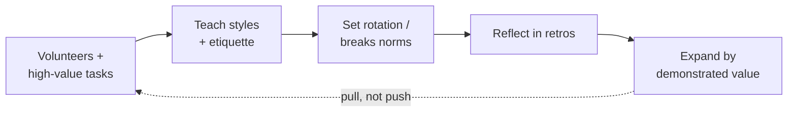
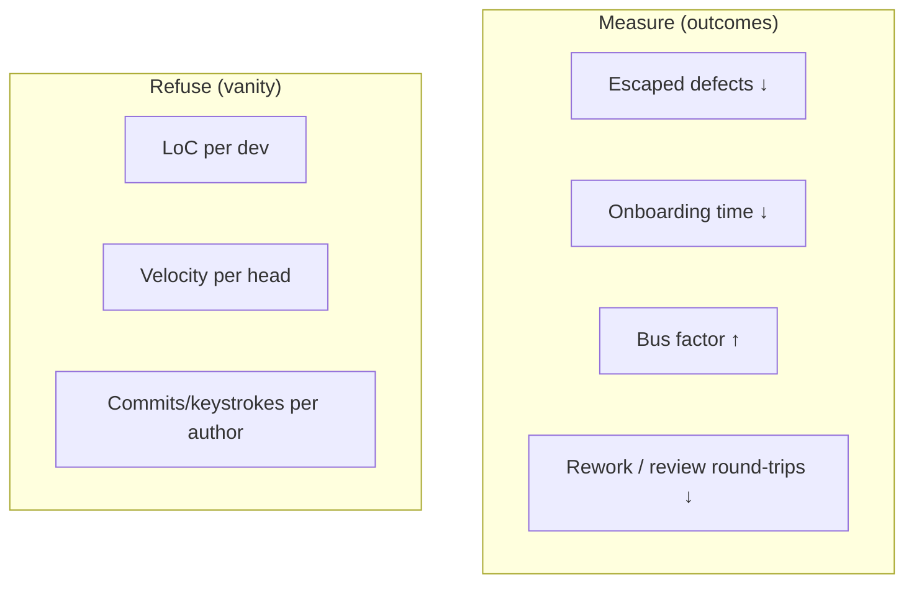

# Pair & Mob Programming — Professional

> **Category:** [Craftsmanship Disciplines](../README.md) — two or more people building one piece of software together, in real time, sharing one stream of work.

> **Prerequisites:** [Junior](junior.md) · [Middle](middle.md) · [Senior](senior.md)
> **Focus:** **Rollout, measurement, objections, hiring, and culture at team scale**

---

## Introduction

> Focus: **production** — what it takes to make pairing and mobbing work for a real team, observed by managers, sustained over years.

Knowing *how* to pair is a craft skill. Making a *team* pair well, defending it to a budget-holder, measuring whether it's working, and keeping it healthy through hiring, onboarding, remote work, and personality friction — that's the professional skill. This level is about the organizational machinery around pairing:

- How to **introduce** it without triggering a revolt.
- How to answer the **"two people, one task"** objection with something better than faith.
- What to **measure**, and which numbers are honest versus which are vanity.
- How to build the **psychological safety** the whole practice rests on.
- How to run **remote-first** pairing and **pairing interviews** professionally.

---

## Rolling Pairing Out to a Team

The fastest way to *kill* pairing is to mandate "everyone pairs on everything starting Monday." It triggers resistance, exhausts people, and gets blamed for every subsequent slowdown. Roll it out the way you'd roll out any behavior change: incrementally, with consent, with evidence.

**A staged rollout:**

1. **Start with volunteers and high-value tasks.** Pair on the hard, risky, or siloed work first — where the payoff is obvious and the practice sells itself. Don't pair on boilerplate; it makes pairing look pointless.
2. **Make it safe to be bad at it.** The first sessions will be awkward. Name that up front: "we're learning a skill; it'll feel clumsy for a few weeks." Awkwardness is not failure.
3. **Teach the styles explicitly.** Most failed pairing is just *un-taught* pairing — watch-the-master and backseat driving by people who never learned strong-style or ping-pong. Run a session on the [styles](middle.md#pairing-styles-in-depth) and the etiquette.
4. **Set rotation and break norms from day one.** A timer, a partner-rotation scheme, scheduled breaks. The structure is what makes it sustainable.
5. **Reflect in retros.** "How is pairing going? What's awkward? What's helping?" Let the team tune it. A practice the team shapes is a practice the team keeps.
6. **Expand by demonstrated value, not decree.** As the volunteers report fewer bugs and faster onboarding, others opt in. Pull, not push.

**Avoid the two extremes:**

| Extreme | Failure |
|---|---|
| **Mandate everything** | Burnout, resentment, pairing blamed for every problem |
| **Leave it fully optional forever** | Defaults back to solo; silos never dissolve; the practice never takes root |

The professional middle path: **pairing is the *default* for high-value work, with the autonomy to opt out of specific sessions, plus the structure (styles, rotation, breaks) that makes it sustainable.**

---

## Handling Manager Objections

A professional engineer must be able to make the business case to someone holding a budget and a deadline. The objections are predictable.

### "Two people on one task — that's half my output."

This is the central objection. The answer is a *cost model*, delivered calmly:

> "It's not 2× cost for 1× output. A pair finishes in roughly 15% more *person-hours* — but in *less calendar time*, so the feature ships sooner. In exchange we catch defects in the editor, where they cost ~1×, instead of in production where they cost ~100× plus an incident, a rollback, and a trust hit. And we stop building systems only one person understands — which is a single-point-of-failure risk you're carrying today whether you see it or not."

Lead with the framing that resonates with *that* manager: **defect cost** for a quality-focused manager, **bus-factor risk** for a risk-averse one, **onboarding speed** for a fast-growing team, **delivery predictability** for a deadline-driven one.

### "We can't afford it under this deadline."

> "Then let's pair *selectively* — on the riskiest, most-likely-to-bite parts of this deliverable, where a defect or a wrong design would blow the deadline worse than the pairing cost. Pairing isn't all-or-nothing."

### "Pairing is just senior devs babysitting juniors."

> "When a senior pairs strong-style with a junior, they're not babysitting — they're compressing months of mentorship into days, and raising that junior's *independent* output permanently. It's the highest-leverage teaching we have. The alternative is the junior learning slowly and shipping bugs we review late."

### "How do I know it's working?"

That's the next section — and a professional brings the measurement plan *to* the objection, not after it.

| Objection | One-line professional answer |
|---|---|
| "2× the cost" | ~15% more effort, less calendar time, defects caught at 1× not 100×, and bus-factor risk eliminated. |
| "No time under deadline" | Pair selectively on the riskiest parts; it's not all-or-nothing. |
| "Babysitting juniors" | Strong-style is compressed mentorship that permanently raises junior output. |
| "Can't measure it" | Track defect escape rate, onboarding time, and bus factor — here's the plan. |
| "People hate it" | Don't mandate uniformly; default for high-value work, with opt-out and breaks. |

---

## Measuring Impact (Without Lying)

The senior level warned that the *wrong* metric makes pairing look worthless. The professional level operationalizes the *right* ones — and refuses the vanity ones.

**Measure these (honest, decision-useful):**

| Metric | Why it's honest | How to read it |
|---|---|---|
| **Defect escape rate** (bugs reaching QA/prod) | Pairing's core claim is fewer escaped defects | Compare paired vs. solo work, or before/after on a module |
| **Onboarding time to first meaningful contribution** | Pairing's strongest, fastest-visible win | New hires who pair ramp dramatically faster |
| **Bus factor / knowledge coverage** | The risk argument, made concrete | Survey "who could safely change module X?" before/after |
| **Lead time & rework rate** | Captures the "ship sooner, redo less" effect | Less time stuck in review; fewer "rewrite this" PRs |
| **Cycle time spent in code review** | Paired code is pre-reviewed | PR review time drops; fewer review round-trips |

**Refuse these (vanity / misleading):**

| Vanity metric | Why it lies |
|---|---|
| **Lines of code per developer** | Pairing *lowers* it by design — and LoC was never a value measure anyway |
| **Raw individual velocity / story points per person** | Treats one stream as two people's output; structurally penalizes the practice |
| **"Tasks completed per head"** | Same flaw — counts heads, not value or risk avoided |
| **Keystrokes / commits per author** | Pairing concentrates these on the driver; meaningless |

**The honest reporting rule:** measure *outcomes* (escaped defects, onboarding time, knowledge coverage, rework), never *individual throughput proxies*. If the only dashboard a manager has is per-person velocity, pairing will look like a regression even as quality and risk improve — fixing that dashboard is part of the job. Pair the numbers with qualitative signal (retro sentiment, "would you pair again?") because much of pairing's value is in tacit knowledge that no metric fully captures.

---

## Psychological Safety: The Load-Bearing Wall

Pairing and mobbing **convert private work into public work.** Everything you don't know, every wrong turn, every "wait, how does this API work again?" is now visible to a colleague. That's the source of all the benefits — *and* the reason the whole practice collapses without **psychological safety**: the shared belief that you won't be punished or humiliated for being wrong, asking questions, or not knowing something.

**Why it's non-negotiable here:**

- A developer who feels judged **goes silent** — and a silent pair has lost the continuous review and knowledge transfer that justify pairing at all.
- Strong-style *requires* a novice to drive in front of an expert and an expert to think aloud (and sometimes be wrong) in front of a novice. Both need safety.
- Mobbing makes *everyone's* gaps visible to the *whole team* at once. Without safety, people perform competence instead of doing real work.

**How a professional builds it:**

1. **Seniors model fallibility.** The most senior person in the pair/mob says "I don't know, let's look it up" out loud, regularly. This single behavior does more than any policy.
2. **Frame every question as legitimate.** "There are no dumb questions" must be *demonstrated*, not just stated, by answering them seriously every time.
3. **Separate the code from the person.** Critique the design, never the designer. "This function is doing two things" not "you wrote this badly."
4. **Never weaponize pairing.** The instant pairing is used to surveil, evaluate, or rank individuals, safety dies and so does the practice. Pairing data must never feed performance reviews.
5. **Protect the quiet voice.** In mobs especially, actively invite the people who aren't speaking — "we haven't heard from you, what's your read?"

> Psychological safety is not a *nice-to-have* layered on top of pairing. It is the foundation the entire practice stands on. Build it first, or pairing will quietly fail and nobody will say why — because saying why would require the safety that's missing.

---

## Remote-First Pairing Conventions

For distributed teams, pairing needs explicit conventions to replace the things co-location gave for free.

**Tooling baseline:**
- **Low-latency, dual-control pairing tools** — VS Code Live Share, JetBrains Code With Me, or purpose-built screen-share (Tuple, Pop, Drovio). Generic video-call screen share is too laggy and usually single-control (which is just watch-the-master).
- **Mob automation** — `mob.sh` / Mobster to handle the rotation timer *and* the git handoff between machines.
- **Always-on audio/video** for the constant conversation pairing requires.

**Conventions that replace co-location:**

| Co-located default | Remote convention |
|---|---|
| Lean over and point | Narrate locations explicitly ("the method below `save`, ~line 40") |
| Read body language | Verbalize state ("I'm lost", "I'm following", "give me a sec") |
| Tap someone's shoulder to swap | Use the tool's handoff or a verbal "your turn" + push |
| Glance to see if someone's free | Shared signal for availability (status, a "pairing?" channel) |
| Natural breaks | *Scheduled* breaks — remote pairs forget to stop and over-fatigue |
| Whiteboard | Shared digital whiteboard / diagram tool open alongside |

**Remote-first norms a professional codifies:**
- **Default to dual control** — both drive, every session. No one-types-while-others-watch.
- **Cameras-on for pairing** (within reason) — it carries the social cues that keep the conversation human.
- **Async-friendly handoffs** across time zones — when a pair can't be synchronous, hand off with a clear written context note so the work is one continuous stream, not two disconnected efforts.
- **Respect time zones** in partner matching; don't force pairs into nobody's working hours.

Done right, remote pairing is *better* than co-located: shared screen at each person's comfortable font and keymap, no neck-craning, no one person hogging the one keyboard.

---

## Pairing Interviews (Hiring)

Many craftsmanship-oriented companies replace (or supplement) whiteboard interviews with a **pairing interview**: the candidate and an engineer pair on a small, realistic problem.

**Why it's a better signal than whiteboarding:**
- It tests **how the person actually works** — collaboration, communication, handling feedback, navigating ambiguity — not whether they memorized an algorithm under stress.
- It surfaces **culture and safety fit** directly: do they think aloud? take suggestions gracefully? give them respectfully? say "I don't know" comfortably?
- It's **realistic**: the job *is* pairing, so the interview mirrors the work.

**How a professional runs one well:**

1. **Make it collaborative, not adversarial.** You're a *partner*, not an examiner. The candidate should feel they're previewing the actual job.
2. **Pick a small, realistic, language-of-their-choice problem** — ideally one with room for design discussion and a test or two, not a trick puzzle.
3. **Pair for real** — drive sometimes, navigate sometimes, offer hints, take their ideas. Watch *how they collaborate*, not just whether they reach the answer.
4. **Reduce stress deliberately.** Tell them it's collaborative, it's fine to look things up, and you're evaluating the working relationship. A terrified candidate doesn't show you their real self.
5. **Evaluate the right things:** Do they communicate clearly? Take and give feedback well? Reason out loud? Handle being wrong? Drive *and* navigate competently? Would you want to pair with them every day?

**Pitfalls to avoid:** turning it into a silent exam, choosing a problem so hard there's no room to collaborate, penalizing nervousness, or letting one grumpy interviewer poison the candidate's experience (it's also the candidate evaluating *you*).

---

## Pairing as Onboarding Infrastructure

The single most reliable, fastest-to-show ROI of pairing is **onboarding**, and a professional treats it as deliberate infrastructure.

- **Pair the new hire from day one**, strong-style with the new person *driving*. They learn the codebase by *doing*, with an expert narrating the context, conventions, and landmines in real time.
- **Rotate which experienced person they pair with** so they absorb the system's knowledge from multiple holders and build relationships across the team.
- **The new hire's "stupid questions" are a gift** — they surface stale docs, hidden assumptions, and accidental complexity the team had gone blind to.
- It collapses the usual onboarding experience (read decaying docs, get blocked, wait for answers, ship a bug, get it reviewed late) into a guided, high-bandwidth, defect-resistant ramp.

A team that pairs new hires gets them to meaningful, *independent* contribution dramatically faster than one that hands them a wiki and a backlog ticket — and that delta is the easiest pairing win to point a skeptical manager at.

---

## Team Conventions & Charter

Codify these so the practice is uniform and self-sustaining, not dependent on whoever's in the room:

1. **When we pair/mob:** default for hard, risky, or siloed work; solo for trivial/exploratory (see [modality guidance](middle.md#when-to-pair-vs-mob-vs-solo)).
2. **Default style:** strong-style for mixed-experience, ping-pong for TDD work — and *teach* both.
3. **Rotation:** a real timer (4–10 min mob, per-green ping-pong, ~15–30 min traditional); rotate *partners* across the team, not just roles.
4. **Breaks:** scheduled; pairing is intense and partial-day by design.
5. **Safety:** critique code not people; questions always legitimate; pairing data never feeds reviews.
6. **Remote:** dual control always; narrate locations; cameras on; explicit handoffs.
7. **Credit:** co-author trailers (`Co-authored-by:`) so both/all names are on shared work.
8. **Measure:** outcomes (escaped defects, onboarding time, bus factor), never individual throughput.

---

## Anti-Patterns at Team Scale

| Anti-pattern | Symptom | Fix |
|---|---|---|
| **Mandated pairing on everything** | Burnout, resentment, pairing blamed for slowdowns | Default for high-value work; opt-out room; breaks |
| **Pairing as surveillance** | People perform competence; questions stop | Firewall pairing from evaluation; seniors model fallibility |
| **Vanity metrics** | Per-person velocity makes pairing "look bad" | Measure outcomes, fix the dashboard |
| **Untaught pairing** | Watch-the-master & backseat driving everywhere | Explicitly teach styles & etiquette |
| **Permanent pairs** | Two-person silos re-form | Rotate partners on a schedule |
| **Pairing trivial work** | Pairing looks pointless; people sour on it | Reserve it for tasks with real design/risk/knowledge value |
| **No breaks, all day** | Quality and morale collapse | Partial-day, scheduled recovery |
| **Laggy remote setup** | Frustration, single-control watch-the-master | Low-latency dual-control tools |

---

## Real Scenarios

### Scenario 1: The siloed legacy system

*A billing system only one engineer understands; they're a flight risk.* **Play:** mob (or rotating pairs) on the next few billing changes, with the expert navigating and others driving. The knowledge spreads as a side effect of normal work; within weeks the bus factor goes from 1 to the whole team. Sell it to management as **risk reduction**, not process.

### Scenario 2: The manager who only sees velocity

*Per-person story-point velocity is the only dashboard, and it "drops" when the team pairs.* **Play:** bring the *outcome* metrics — escaped defects down, onboarding time down, review round-trips down — and explicitly reframe: "velocity-per-head structurally penalizes one shared stream; here's what actually moved." Fix the dashboard, don't argue the vanity number.

### Scenario 3: The reluctant senior

*A strong solo developer resents pairing and "loses flow."* **Play:** don't force all-day pairing. Pair them on the *hard, collaborative* problems where two minds genuinely help; leave the deep solitary work solo. Respect that the objection is partly real (see [flow](senior.md#flow-interruptions-and-focus)), and let them keep recovery time. Often they convert once pairing is reserved for the work where it obviously pays.

### Scenario 4: Distributed team, never met in person

*Fully remote, multiple time zones.* **Play:** dual-control tooling, cameras-on, explicit location narration, scheduled breaks, and async handoffs with written context for cross-time-zone work. Treat the conventions table above as the team charter.

---

## Checklist

```text
ROLLOUT
[ ] start with volunteers + high-value tasks (not boilerplate)
[ ] explicitly teach styles (strong-style, ping-pong) + etiquette
[ ] set rotation, partner-rotation, and break norms from day one
[ ] tune via retros; expand by demonstrated value, not decree

OBJECTIONS
[ ] cost model ready (~15% effort, defects at 1× not 100×, bus-factor risk)
[ ] tailor the pitch (quality / risk / onboarding / predictability)
[ ] bring the measurement plan to the objection

MEASURE
[ ] outcomes: escaped defects, onboarding time, bus factor, rework, review time
[ ] refuse vanity: LoC, per-person velocity, commits/keystrokes per author

CULTURE
[ ] psychological safety first — seniors model "I don't know"
[ ] critique code, not people
[ ] pairing data NEVER feeds performance reviews
[ ] rotate partners (no permanent pairs / new silos)
[ ] scheduled breaks; partial-day by design

REMOTE
[ ] low-latency dual-control tooling
[ ] narrate locations; cameras on; explicit handoffs
[ ] mob.sh / Mobster for rotation + git handoff

HIRING
[ ] pairing interview is collaborative, not adversarial
[ ] realistic small problem; candidate's choice of language
[ ] evaluate communication, feedback, reasoning-aloud — would you pair daily?
```

---

## Diagrams

### Rollout as a ratchet, not a cliff



### What to measure vs. what to refuse



---

## Related Topics

- **Reinforces:** [The Three Laws of TDD](../01-the-three-laws-of-tdd/junior.md) — pairing + TDD as a package.
- **Practice format:** [Kata & Deliberate Practice](../07-kata-and-deliberate-practice/junior.md) — mob/pair katas build the skill safely.
- **Evidence base:** Williams & Kessler, *Pair Programming Illuminated*; Hannay et al. (2009) meta-analysis; Amy Edmondson on psychological safety.

---


---

## Check your understanding

1. Explain Pair & Mob Programming — Professional Level in your own words and name the problem it solves.
2. How would you apply the ideas around Table of Contents, Introduction, Rolling Pairing Out to a Team in a realistic engineering change?
3. What failure mode or misuse should you look for, and what evidence would reveal it?
4. How would you introduce and govern Pair & Mob Programming — Professional Level across teams through reversible, measurable increments?
5. What observable result would convince you that the approach improved the system?
