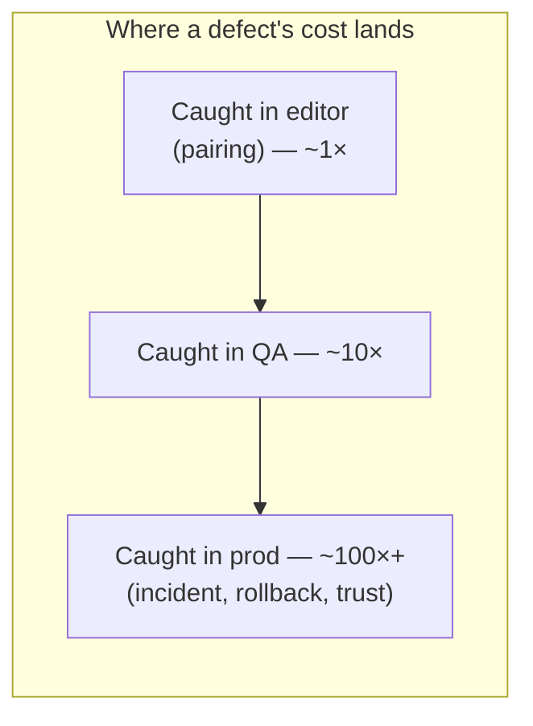
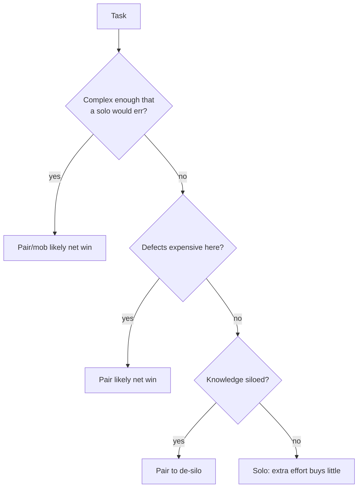
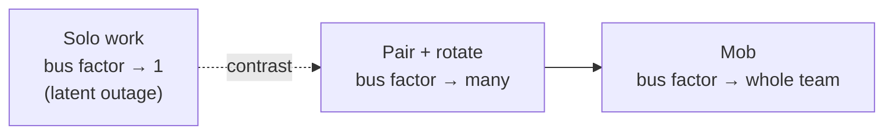

# Pair & Mob Programming — Senior

> **Category:** [Craftsmanship Disciplines](../README.md) — two or more people building one piece of software together, in real time, sharing one stream of work.

> **Prerequisites:** [Junior](junior.md) · [Middle](middle.md)
> **Focus:** **The evidence, the economics, and the failure modes**

---

## Table of Contents

1. [Introduction](#introduction)
2. [The Research: What Williams & Kessler Actually Found](#the-research-what-williams-kessler-actually-found)
3. [The Economics: Cost vs. Defect Reduction](#the-economics-cost-vs-defect-reduction)
4. [Bus Factor, Truck Number, and Knowledge Risk](#bus-factor-truck-number-and-knowledge-risk)
5. [Flow, Interruptions, and Focus](#flow-interruptions-and-focus)
6. [The Criticisms, Taken Seriously](#the-criticisms-taken-seriously)
7. [Introverts, Fatigue, and Sustainability](#introverts-fatigue-and-sustainability)
8. [Scaling Mobbing](#scaling-mobbing)
9. [Pairing With TDD](#pairing-with-tdd)
10. [When Pairing Genuinely Fails](#when-pairing-genuinely-fails)
11. [System-Level Trade-offs](#system-level-trade-offs)
12. [Diagrams](#diagrams)
13. [Related Topics](#related-topics)

---

## Introduction

> Focus: **the evidence, the economics, and the failure modes**

A senior is expected to *decide* whether and how a team pairs, and to *defend* that decision to skeptical engineers and skeptical managers. That requires moving past "pairing is good" into three harder questions:

1. **What does the research actually say** — and what are its limits? (Most "pairing studies" people cite are small, and the famous one is a student study.)
2. **What is the real economic trade** — pairing roughly *doubles* the labor on a task; what do you get back, and when is that a net win?
3. **When does it fail, and why** — because pairing done badly is genuinely worse than solo, and a senior who can't name the failure modes will roll it out into resentment.

The senior position is not evangelism. It's: *pairing and mobbing are powerful, evidence-backed, expensive tools whose value depends sharply on the task and the execution.*

---

## The Research: What Williams & Kessler Actually Found

The foundational empirical work is **Laurie Williams and Robert Kessler**, around 1999–2000 (her PhD work at the University of Utah, with Ward Cunningham and others), summarized in *Pair Programming Illuminated* (2002).

**The headline findings, stated honestly:**

| Finding | The number people quote | The honest caveat |
|---|---|---|
| Pairs spend **more total effort** | ~**15% more** person-hours than solo | This is the *cost*, and it's the optimistic figure |
| Pairs produce **fewer defects** | ~**15% fewer defects** | Measured on student code; effect size varies wildly elsewhere |
| Pairs produce **better designs** | Shorter, cleaner solutions | Subjective; hard to measure rigorously |
| **Enjoyment & confidence** rose | Most preferred pairing | Self-reported |

So the canonical soundbite is: **"~15% more time, ~15% fewer defects."** A senior must add the asterisks:

- **It was largely a *student* study.** The original experiments used university students, not seasoned professionals on production systems. Generalization is plausible but not proven.
- **Later meta-analyses are more cautious.** Hannay et al.'s 2009 meta-analysis of 18 pairing studies found pairing has a *small-to-medium* positive effect on quality and a *medium* positive effect on duration (faster wall-clock) — **but** with a significant trade-off: quality, duration, and effort can't all be optimized at once, and the effect depends heavily on **task complexity** and **programmer expertise**. For *complex* tasks, pairs achieve **higher quality**; for *simple* tasks, pairs mostly buy **speed at the cost of effort**.
- **The "15% cost" can be much higher or lower in practice.** Mismatched pairs, no rotation, and bad remote tooling can push the cost far past 15% with little quality return.

**The defensible senior summary of the evidence:** *Pairing reliably improves quality on hard tasks and spreads knowledge; it costs extra effort that is well-spent on complex/critical work and poorly-spent on trivial work; and the magnitude depends on task difficulty and how well the pair is matched and run.* Cite Williams & Kessler for the origin, but cite **Hannay 2009** for the nuance — that's the senior move.

---

## The Economics: Cost vs. Defect Reduction

The objection a senior hears most is economic: *"You're putting two salaries on one task — that's 2× the cost."* The rebuttal is a real cost model, not a slogan.

**Naive model (wrong):** two people on one task = 2× labor for 1× output. By this model pairing is obviously wasteful.

**What the naive model ignores:**

1. **Pairs are faster than 2×, not 1×.** A pair completes a task in *more* than half the time a solo would take but *less* than the full solo time — roughly 15% more *person-hours*, which means substantially *less wall-clock time*. You get the feature sooner.
2. **Defects are the dominant cost in software, and they're cheaper to prevent than to fix.** The cost of a defect rises by roughly an order of magnitude at each stage it escapes — cheapest in the editor, ~10× in QA, ~100× in production. Pairing catches defects *in the editor*, the cheapest possible place. A bug caught while pairing never becomes a production incident, a rollback, a postmortem, and a customer-trust hit.
3. **Knowledge transfer has a cost you're already paying — badly.** Onboarding, documentation, "go ask Sara," and the rework caused by misunderstandings are all knowledge-transfer costs. Pairing folds them into the work instead of paying them later at a worse exchange rate.
4. **Rework is the silent budget killer.** Code that "works" but is wrong-headed gets rewritten. A second mind at design time prevents the false-start that a solo discovers only after a day of building.

**The honest break-even:** pairing is a net economic *win* when the task is **complex enough that a solo developer would make costly mistakes**, **important enough that defects are expensive**, or **siloed enough that the knowledge spread has real value**. It's a net *loss* on trivial, well-understood, low-stakes work where the extra 15%+ buys you nothing. This is why "pair on everything" and "never pair" are both economically wrong — the right answer is *task-dependent*, and matching task to modality is the lever that makes the economics work.

---

## Bus Factor, Truck Number, and Knowledge Risk

The **bus factor** (a.k.a. truck number) is the number of people who'd have to be hit by a bus before the project is in serious trouble — i.e., the size of the smallest set of people who hold irreplaceable knowledge. **A bus factor of 1 is a latent outage.**

Solo development is a bus-factor *machine*: every part of the system ends up understood by exactly the one person who wrote it. Documentation decays, comments lie, and the real knowledge — *why* it's like this, *what* breaks if you touch it — lives only in one head.

Pairing and mobbing attack this directly and continuously:

- **Pairing** at least *doubles* the bus factor of everything it touches, and **rotating partners** spreads it across the team.
- **Mobbing** drives the bus factor toward *the whole team* — every line was written with everyone present.
- The transfer is **tacit knowledge**, the kind that resists documentation: the gut feel for where bugs hide, the unwritten conventions, the "don't touch that without checking with X" lore.

This is frequently the *strongest* business case for pairing, stronger than the defect numbers, because a bus factor of 1 on a revenue-critical system is an existential risk that no amount of documentation reliably fixes. A senior arguing for pairing to leadership often leads with **risk reduction**, not quality: "We currently have three systems only one person understands. Pairing fixes that as a side effect of normal work."

---

## Flow, Interruptions, and Focus

A serious objection from strong solo developers: *"Pairing destroys flow."* It deserves a real answer.

**The nuance:**

- **Pairing changes the *kind* of focus.** Solo flow is deep, internal, and fragile — easily shattered by a Slack ping. Pairing flow is *external and conversational*, and it's surprisingly *robust*: a pair is much harder to interrupt than a solo dev (people hesitate to break up two people talking), and if one person's attention drifts, the other holds the thread. The context isn't lost the way a solo's is when interrupted.
- **Pairing can *kill* certain flow.** For some people, on some tasks (especially deep, exploratory, solitary problem-solving), the constant verbalization genuinely disrupts the internal modeling that flow depends on. This is real and not a character flaw — see [introverts and fatigue](#introverts-fatigue-and-sustainability).
- **Net effect on team flow is often positive.** Because the pair is interruption-resistant and never fully blocked (one can ask while the other keeps a thread), the *team's* throughput on the hard, focus-demanding work is often steadier than a room of interruptible solos.

The senior framing: **pairing trades fragile, private flow for robust, shared flow.** For collaborative problem-solving that trade is usually good; for deep solitary exploration it can be bad. Match accordingly.

---

## The Criticisms, Taken Seriously

A senior must be able to articulate the case *against* pairing better than its detractors, then respond.

| Criticism | Steelman | Senior response |
|---|---|---|
| "It's 2× the cost." | Two salaries, one task. | It's ~15% more effort, not 2×; defects prevented and rework avoided usually more than repay it *on the right tasks*. |
| "It destroys deep flow." | Solo flow is real and valuable. | True for some people/tasks; reserve deep solitary work for solo, pair the collaborative work. |
| "It's exhausting." | Sustained focus + talking drains people. | Real — cap pairing hours, schedule breaks, don't pair all day every day. |
| "Some people just don't like it." | Forced pairing breeds resentment. | Don't mandate uniformly; build a culture where it's the default for the *right* work, with opt-out room. |
| "The research is weak." | Famous study was students. | Honest — lean on Hannay 2009's nuance and on the bus-factor/economic argument, not just defect counts. |
| "Juniors slow seniors down." | A senior pairs with a junior and types less. | The senior is *teaching*, raising the junior's future output — it's an investment, not a tax, and strong-style maximizes the return. |

The mark of senior judgement is treating these as **valid constraints to design around**, not heresies to crush. A pairing culture that ignores fatigue and flow will collapse under its own dogma.

---

## Introverts, Fatigue, and Sustainability

This is where naive pairing rollouts die, so seniors must get it right.

- **Pairing is not "for extroverts."** The misconception that introverts can't pair confuses *social energy* with *pairing skill*. Many excellent pairers are introverts; what they need is **structure** (strong-style, ping-pong, clear roles) and **recovery time**, not a personality transplant. Strong-style in particular gives an introvert a clear, bounded role instead of an open-ended social free-for-all.
- **Fatigue is the real constraint.** Pairing is *more* mentally taxing than solo work — constant verbalization, no zoning out, continuous decision-making. A team that pairs 8 hours a day will burn out. **Sustainable pairing is partial:** a few focused hours, with solo time around it for recovery, email, thinking, and the trivial tasks that don't warrant a pair.
- **Recovery is not laziness.** Build solo/async time into the day deliberately. The goal is a *sustainable* practice, not a heroic one.
- **Consent and matching matter.** Forcing two clashing personalities to pair all day is cruel and unproductive. Rotate, and let people have some say.

The sustainability principle: **pairing is a high-intensity activity, like sprinting — valuable in bursts, destructive as a permanent state.** Design the day so pairing happens when it pays and people can recover around it.

---

## Scaling Mobbing

Mobbing's economics look terrifying naively (N people, one task) and its scaling has real limits a senior must manage.

- **There's an upper bound on useful mob size.** Beyond ~5–6 people, the marginal navigator contributes little and the back-row checks out (the mob equivalent of a too-large meeting). Past that, **split into two mobs** or drop to pairs.
- **The economic case for mobbing is *specific*, not general.** Mobbing wins decisively when: the problem is *hard and central* (architecture, a thorny bug, a critical migration), the *cost of getting it wrong is enormous*, several people *need* the knowledge, or you're trying to *establish a shared standard* fast. On routine parallelizable work, mobbing is wasteful — the whole point of having a team is to work on different things.
- **It eliminates coordination cost entirely.** No merge conflicts, no PR latency, no "I'll explain it later," no blocking questions, no knowledge silos. For some teams the *removal of handoff friction* outweighs the parallelism lost — especially on tightly-coupled work where parallel streams would just collide.
- **Facilitation matters at scale.** A rotating facilitator keeps the mob from rat-holing, ensures the quiet voices are heard, and protects the rotation discipline.

The senior call on mobbing: **it's a focused tool for hard, high-stakes, knowledge-critical work — not a default operating mode for a whole team's whole backlog.** Teams that mob *everything* full-time exist (and report good results), but that's a deep cultural commitment, not a casual choice.

---

## Pairing With TDD

Pairing and [TDD](../01-the-three-laws-of-tdd/junior.md) are mutually reinforcing — combined, they're more than the sum.

- **TDD gives pairing a structure.** Ping-pong pairing uses the red-green-refactor cycle as the natural rotation trigger and the natural unit of conversation. Without TDD, pairs drift; with it, the rhythm is built in.
- **Pairing gives TDD a second mind at the decisive moments.** The hardest TDD skill is *choosing the next test* and *deciding what "simplest thing that passes" means*. A navigator challenges those choices in real time, exactly when it's cheapest.
- **The two cover each other's blind spots.** TDD catches *behavioral* regressions automatically; the navigator catches *design* and *strategic* problems a test can't express ("this is correct but it's the wrong abstraction"). Continuous human review plus continuous automated regression is a strong combination.
- **Together they shrink the feedback loop to seconds.** Test feedback in seconds, human review feedback in seconds — the tightest loop available short of formal methods.

This is why craftsmanship-oriented teams treat pairing + TDD as a package: the [three laws of TDD](../01-the-three-laws-of-tdd/junior.md) supply the micro-discipline, and pairing supplies the second brain that keeps the discipline honest and the design sound.

---

## When Pairing Genuinely Fails

A senior must know the situations where pairing is the *wrong* answer, not just a poorly-executed one:

- **Trivial / mechanical work.** Boilerplate, renames, dependency bumps — no design or knowledge to share. Pairing here is pure cost.
- **Solitary deep exploration.** A spike where you're learning an unfamiliar API by trial and error is often faster and less frustrating alone; share the findings afterward.
- **Severe personality clash with no rotation escape.** Two people who genuinely can't work together will produce worse code paired than apart. Rotate around it.
- **As a surveillance tool.** If management uses "pairing" to watch people, it becomes coercive theater and every benefit evaporates. Pairing requires [psychological safety]; weaponized, it's worse than solo.
- **When the team lacks the basic skills it requires.** A team with no shared conventions, no TDD, and no safety will pair badly. Build those first; pairing amplifies whatever culture exists — good or bad.

**The unifying rule:** pairing's costs are fixed (effort, energy) but its benefits are *conditional* on the task having design complexity, defect risk, or knowledge value. When none of those are present, the cost stands alone, and solo wins.

---

## System-Level Trade-offs

| Dimension | Solo | Pair | Mob |
|---|---|---|---|
| Person-hours per task | 1× | ~1.15× | N× (but coordination → 0) |
| Wall-clock to done | Baseline | Often faster | Fast on hard problems |
| Defect rate | Highest | Lower (esp. complex tasks) | Lowest |
| Bus factor impact | Pushes toward 1 | Doubles + spreads | Toward whole team |
| Energy / sustainability | Easiest to sustain | Tiring; needs breaks | Most intense; needs facilitation |
| Coordination cost (merges, PRs) | High (parallel streams) | Low | Near zero |
| Best ROI on | Trivial / exploratory | Complex / critical / siloed | Hard / high-stakes / team-wide |
| Worst ROI on | Hard siloed work | Trivial work | Routine parallelizable work |

The table encodes the entire senior thesis: **the value of adding people to one stream rises with task complexity, defect cost, and knowledge risk, and falls with task triviality — while energy cost rises monotonically.** Optimizing a team means routing each task to the modality where that trade is favorable.

---

## Diagrams

### The economic decision

### Bus factor over time

---

## Related Topics

- **Reinforces and is reinforced by:** [The Three Laws of TDD](../01-the-three-laws-of-tdd/junior.md) — ping-pong pairing and the red-green-refactor loop.
- **Skill development:** [Kata & Deliberate Practice](../07-kata-and-deliberate-practice/junior.md) — mobs and pairs are how katas are often run.
- **Evidence:** Williams & Kessler, *Pair Programming Illuminated*; Hannay et al. (2009), "The effectiveness of pair programming: A meta-analysis."

---

---

## Check your understanding

1. Explain Pair & Mob Programming — Senior Level in your own words and name the problem it solves.
2. How would you apply the ideas around Table of Contents, Introduction, The Research: What Williams & Kessler Actually Found in a realistic engineering change?
3. What failure mode or misuse should you look for, and what evidence would reveal it?
4. How would you validate a system-level decision about Pair & Mob Programming — Senior Level under uncertainty?
5. What observable result would convince you that the approach improved the system?
