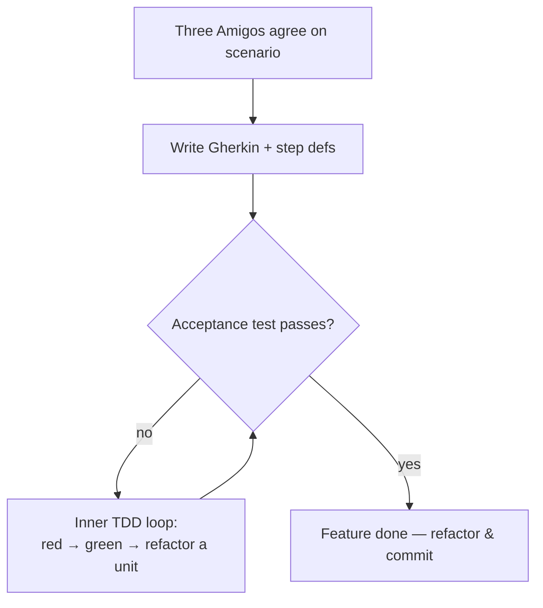
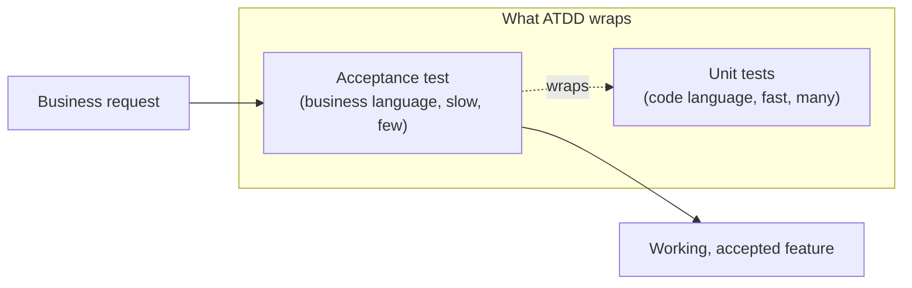

# Acceptance Test-Driven Development — Junior

> **Category:** [Craftsmanship Disciplines](../README.md) — drive development from executable acceptance criteria agreed with the business, so "done" means "the behavior the customer asked for actually works."

---

## Table of Contents

1. [Introduction](#introduction)
2. [Prerequisites](#prerequisites)
3. [Glossary](#glossary)
4. [Core Concepts](#core-concepts)
5. [Real-World Analogies](#real-world-analogies)
6. [Mental Models](#mental-models)
7. [Pros & Cons](#pros-cons)
8. [Use Cases](#use-cases)
9. [Code Examples](#code-examples)
10. [Anatomy of a Scenario](#anatomy-of-a-scenario)
11. [The Outer Loop](#the-outer-loop)
12. [Clean Code](#clean-code)
13. [Best Practices](#best-practices)
14. [Edge Cases & Pitfalls](#edge-cases-pitfalls)
15. [Common Mistakes](#common-mistakes)
16. [Tricky Points](#tricky-points)
17. [Test Yourself](#test-yourself)
18. [Cheat Sheet](#cheat-sheet)
19. [Summary](#summary)
20. [Further Reading](#further-reading)
21. [Related Topics](#related-topics)
22. [Diagrams](#diagrams)

---

## Introduction

> Focus: **What is it?** and **How to use it?**

**Acceptance Test-Driven Development (ATDD)** is the practice of starting a feature by writing an **executable acceptance test** — a test phrased in the language of the business that describes *what the feature must do from the user's point of view* — and then writing code until that test passes.

The key word is **acceptance**. An acceptance test answers one question: *"Would the customer accept this as done?"* It is not about whether a single function returns the right value (that's a unit test). It is about whether the feature, exercised end to end through a realistic slice of the system, produces the outcome the business agreed to.

ATDD turns a vague request — "users should be able to reset their password" — into a concrete, *runnable* definition of done:

```gherkin
Feature: Password reset

  Scenario: User resets a forgotten password
    Given a registered user "ada@example.com"
    When she requests a password reset
    Then she receives a reset link by email
    And the link lets her set a new password
```

This file is not a comment. It is **wired to code** and runs in your test suite. When it passes, the feature is — by the definition everyone agreed on — done.

### Why this matters

Most software defects are not "the code is wrong." They are "the code is correct, but it does the wrong thing" — it solves a slightly different problem than the customer needed. ATDD attacks that gap directly: by writing the acceptance criteria as an executable test **before** coding, and by writing it *with* the business, you discover the misunderstanding while it is still cheap to fix — a sentence in a document — instead of after it has shipped.

ATDD is the **outer loop** that wraps unit-level TDD. You write a failing acceptance test that captures the whole feature; inside it, you do many fast [red-green-refactor](../01-the-three-laws-of-tdd/junior.md) cycles at the unit level; when the units are built, the acceptance test goes green and the feature is complete. The acceptance test is the goal; the unit tests are the steps.

---

## Prerequisites

- **Required:** Comfort with [unit-level TDD](../01-the-three-laws-of-tdd/junior.md) — red, green, refactor.
- **Required:** The idea of a **user story** or **acceptance criterion** ("As a user, I want…, so that…").
- **Helpful:** Having written tests in one language and run them in a suite.
- **Helpful:** A feel for the difference between *what* a system does (behavior) and *how* it does it (implementation).

---

## Glossary

| Term | Definition |
|------|-----------|
| **Acceptance test** | An executable test, written in business terms, that verifies a whole feature behaves as the customer expects. |
| **Acceptance criteria** | The conditions a feature must satisfy to be accepted by the business; ATDD turns these into tests. |
| **ATDD** | Acceptance Test-Driven Development — driving a feature from a failing acceptance test. |
| **BDD** | Behavior-Driven Development — a style of ATDD that uses natural-language `Given-When-Then` scenarios. |
| **Gherkin** | The structured plain-text language (`Feature`/`Scenario`/`Given`/`When`/`Then`) used to write BDD scenarios. |
| **Step definition** | The code that connects one line of a Gherkin scenario to an action against the system. |
| **Outer loop** | The slow ATDD cycle: failing acceptance test → build → acceptance passes. |
| **Inner loop** | The fast TDD cycle: red → green → refactor at the unit level, run many times inside one outer loop. |
| **Three Amigos** | A conversation between business, development, and QA to agree on a scenario before coding. |
| **Living documentation** | Specs that double as documentation and *fail the build* when the code drifts from them. |

---

## Core Concepts

### 1. An acceptance test is written in the user's language, not the code's

A unit test talks about methods, return values, and mocks. An acceptance test talks about *users, actions, and outcomes*:

```
Unit test:        assertEquals(60, account.withdraw(40))
Acceptance test:  "When Ada withdraws $40 from her $100 account,
                   her balance should be $60."
```

Same logic; different audience. The acceptance test is something a non-programmer can read and confirm: *"Yes, that's what we want."*

### 2. ATDD is "test-first" at the feature level

Just as TDD says *write the unit test before the unit*, ATDD says *write the acceptance test before the feature*. You begin with a test that **fails** (the feature doesn't exist yet) and you are done when it **passes**.

### 3. The acceptance test wraps many unit cycles — the double loop

You do not implement the whole feature in one go. You write the failing acceptance test, then drop into the fast inner loop of unit TDD, building one small piece at a time. Each inner cycle takes seconds; the outer cycle — getting the acceptance test green — may take hours or days.

### 4. The test runs against a real slice of the system

An acceptance test exercises more than one class. It drives the feature through a meaningful path — ideally the **service layer** (the application's public API), not the database in isolation and not the UI pixel-by-pixel. (We'll see *why* the service layer in [Middle](middle.md).)

### 5. Three Amigos: agree before you automate

Before a scenario becomes a test, three perspectives review it:
- **Business** — *is this the behavior we actually want?*
- **Development** — *can we build it; is it well-defined?*
- **QA / testing** — *what are the edge cases and ways it breaks?*

This conversation is where ATDD pays for itself: most of the value is in catching the misunderstanding, not in the automation.

---

## Real-World Analogies

| Concept | Analogy |
|---|---|
| **Acceptance test** | A building **inspection checklist** agreed before construction. The contractor knows up front exactly what "passing" means; there's no argument at the end. |
| **Writing the test first** | A chef plating a **photo of the finished dish** before cooking, so everyone agrees what success looks like. |
| **Outer loop vs inner loop** | Building a house (outer: "the kitchen is usable") vs laying each brick (inner: "this wall is straight"). Many bricks per room. |
| **Three Amigos** | A **contract negotiation**: customer, builder, and inspector all sign the spec before work starts, so nobody is surprised. |
| **Living documentation** | A **recipe that refuses to print** if the kitchen no longer has the ingredients — the doc can't lie because it's checked against reality. |

---

## Mental Models

**The intuition:** *"Describe 'done' as a runnable example first, then write code until the example passes."*

```
        ┌──────────────────────────────────────────┐
        │  OUTER LOOP (ATDD) — slow, business-facing │
        │                                            │
        │   write FAILING acceptance test            │
        │            │                               │
        │            ▼                               │
        │   ┌──────────────────────────────┐         │
        │   │ INNER LOOP (TDD) — fast        │        │
        │   │  red → green → refactor        │        │
        │   │  (repeat many times)           │        │
        │   └──────────────────────────────┘         │
        │            │                               │
        │            ▼                               │
        │   acceptance test PASSES → feature done    │
        └──────────────────────────────────────────┘
```

The acceptance test is your **compass**: it stays red, pointing at the goal, while you take many small unit-test steps toward it. The moment it turns green, you have arrived — and not a line of code earlier was wasted on anything the customer didn't ask for.

---

## Pros & Cons

| Pros | Cons |
|------|------|
| Catches "built the wrong thing" before coding | Slower to start a feature (must write/agree the spec) |
| Spec is executable — can't silently go stale | Acceptance tests are slower to run than unit tests |
| Shared language between business and devs | Easy to write brittle, UI-coupled tests that break constantly |
| Doubles as living documentation | Tempting to test *everything* at this level (anti-pattern) |
| Forces clear, testable acceptance criteria | Requires real collaboration, which some teams skip |
| Gives a precise, agreed definition of "done" | Tooling (Cucumber, etc.) adds a layer to learn |

### When to use:
- Features with real business rules that a customer cares about ("checkout applies the right discount").
- Cross-cutting flows where unit tests alone can't prove the feature works end to end.
- Anywhere the requirement is fuzzy and a concrete example would clarify it.

### When NOT to use:
- Pure technical/internal helpers with no business-facing behavior — unit tests are enough.
- As a *replacement* for unit tests (it's a complement; see the [test pyramid](senior.md)).
- For trivial CRUD where the acceptance test would just restate the framework.

---

## Use Cases

- **Business rules:** "Orders over $100 get free shipping" — express as scenarios with examples.
- **User workflows:** signup, password reset, checkout, refund — multi-step flows.
- **Regulatory/contractual behavior:** the spec *is* the contract; the test proves compliance.
- **Defining done in a sprint:** the story isn't done until its acceptance tests pass.
- **Living documentation:** the scenarios describe how the system behaves, always up to date.

---

## Code Examples

### A first feature, end to end (Python + behave)

Below is the smallest complete ATDD round trip: a Gherkin feature, the step definitions that wire it to code, and the production code driven into existence to make it pass.

**1. The acceptance test — `features/discount.feature`:**

```gherkin
Feature: Volume discount
  As a shopper
  I want a discount on large orders
  So that I'm rewarded for buying more

  Scenario: Orders over $100 get 10% off
    Given a cart with items totalling $120
    When I check out
    Then the total charged should be $108.00
```

**2. The step definitions — `features/steps/discount_steps.py`:**

```python
from behave import given, when, then
from shop.checkout import Checkout, Cart

@given('a cart with items totalling ${amount:f}')
def step_cart(context, amount):
    context.cart = Cart(subtotal=amount)

@when('I check out')
def step_checkout(context):
    context.total = Checkout().total_for(context.cart)

@then('the total charged should be ${expected:f}')
def step_assert(context, expected):
    assert context.total == expected, f"got {context.total}, want {expected}"
```

**3. The production code — `shop/checkout.py` (built via inner TDD loops):**

```python
from dataclasses import dataclass

@dataclass
class Cart:
    subtotal: float

class Checkout:
    def total_for(self, cart: Cart) -> float:
        discount = 0.10 if cart.subtotal > 100 else 0.0
        return round(cart.subtotal * (1 - discount), 2)
```

Run `behave`, and the scenario goes green. **The English in the `.feature` file is now executable, verified truth.**

**Highlights:**
- The `.feature` file is readable by a non-programmer.
- Step definitions are the *only* place that knows about Python classes.
- The production code was written *after* the failing scenario, to satisfy it.

---

### The same scenario in Java (Cucumber)

```gherkin
Feature: Volume discount
  Scenario: Orders over $100 get 10% off
    Given a cart with items totalling 120 dollars
    When I check out
    Then the total charged should be 108.00 dollars
```

```java
public class DiscountSteps {
    private Cart cart;
    private double total;

    @Given("a cart with items totalling {int} dollars")
    public void aCartTotalling(int subtotal) {
        cart = new Cart(subtotal);
    }

    @When("I check out")
    public void iCheckOut() {
        total = new Checkout().totalFor(cart);
    }

    @Then("the total charged should be {double} dollars")
    public void theTotalShouldBe(double expected) {
        assertEquals(expected, total, 0.001);
    }
}
```

Different language, identical *shape*: the scenario is business English, and a thin step layer translates each line into a call against the real `Checkout`.

---

## Anatomy of a Scenario

Every BDD scenario has the same three-beat structure — **Given / When / Then** — and learning to keep each beat in its lane is the single most useful junior skill.

| Keyword | Meaning | Example |
|---|---|---|
| **Given** | The starting state / preconditions ("the world is set up like this") | `Given a cart with items totalling $120` |
| **When** | The single action under test ("the user does this one thing") | `When I check out` |
| **Then** | The expected, observable outcome ("this is what should be true after") | `Then the total charged should be $108.00` |
| **And / But** | Continues the previous keyword's section | `And a 10% loyalty member` |

Rules of thumb:
- **One `When` per scenario.** A scenario tests one action. Two `When`s usually means two scenarios.
- **`Given` sets up, `Then` checks** — never put an assertion in a `Given` or an action in a `Then`.
- **Write outcomes, not clicks.** `Then she receives a reset link` (outcome), not `Then the page shows a green div with id #toast` (mechanism). Mechanism-coupled `Then`s are the #1 cause of brittle tests — covered deeply in [Senior](senior.md).

---

## The Outer Loop

ATDD's rhythm is a loop inside a loop. Here is the explicit sequence for adding one feature:

1. **Talk** — Three Amigos agree on a scenario. Write it in Gherkin.
2. **Automate the spec** — write step definitions. Run it: it **fails** (red), because the feature doesn't exist.
3. **Drop into the inner loop** — pick the first small piece. Write a failing *unit* test, make it pass, refactor. Repeat for each piece the feature needs.
4. **Re-run the acceptance test.** Still red? Keep doing inner loops. Green? You're done.
5. **Refactor at the feature level** if needed, with both safety nets (unit + acceptance) green.



The discipline that makes this work: **don't write production code that no failing test (unit or acceptance) demands.** The acceptance test guarantees you build the *right* feature; the unit tests guarantee you build it *correctly*.

---

## Clean Code

### Keep scenarios declarative, not imperative

A scenario should read like a business rule, not a UI script:

```gherkin
# ❌ Imperative — describes clicks, brittle, unreadable
Scenario: Login
  Given I open "/login"
  And I type "ada@example.com" into "#email"
  And I type "secret" into "#password"
  And I click "#submit"
  Then "#welcome" should contain "Hello"

# ✅ Declarative — describes intent, stable, readable
Scenario: Registered user logs in
  Given a registered user "ada@example.com"
  When she logs in with the correct password
  Then she sees her dashboard
```

The declarative version survives a UI redesign; the imperative one breaks the moment a CSS id changes.

### Put translation in step definitions, logic in scenarios

The `.feature` file holds **business intent**. The step definition holds the **translation** to code. Never leak code concepts (ids, SQL, HTTP status codes) into the feature, and never put business decisions inside step definitions.

### One scenario, one behavior

If a scenario needs three `When`s and five `Then`s, it's testing several behaviors. Split it. Small scenarios fail with a clear message about *which* behavior broke.

---

## Best Practices

1. **Write the acceptance test first, with the business.** The conversation is the point.
2. **Keep `Given/When/Then` in their lanes** — setup, single action, observable outcome.
3. **Be declarative** — describe *what* the user achieves, not *how* they click.
4. **Test through the service layer, not the UI**, wherever possible (see [Middle](middle.md)).
5. **Let the acceptance test stay red** while you do inner unit loops; that's normal.
6. **Don't over-test at this level** — a few acceptance tests, many unit tests ([test pyramid](senior.md)).
7. **One `When` per scenario.** One behavior per scenario.

---

## Edge Cases & Pitfalls

- **Acceptance test passes for the wrong reason.** If your step definition has a bug that always asserts true, the feature is "done" but broken. Make the test fail first (red) to prove it can fail.
- **UI-coupled brittleness.** A scenario tied to CSS selectors and page layout breaks on every cosmetic change, even when behavior is correct. Drive through the service layer.
- **Slow suite.** Hundreds of full end-to-end acceptance tests turn a 10-second build into a 40-minute one. Keep them few; push detail down to unit tests.
- **Scenario tests implementation, not behavior.** `Then a row is inserted into the orders table` couples the spec to the schema; `Then the order is confirmed` describes behavior.
- **Skipping the Three Amigos.** Writing scenarios alone re-introduces exactly the misunderstanding ATDD exists to prevent.

---

## Common Mistakes

1. **Writing the acceptance test *after* the feature** — it's then just a regression test, not a design tool, and it can't catch "built the wrong thing."
2. **Imperative scenarios** full of clicks and selectors — brittle and unreadable.
3. **No `When`, or many `When`s** — a scenario with no clear single action, or several.
4. **Assertions in `Given`** — preconditions shouldn't fail the test; they set the stage.
5. **Treating ATDD as a replacement for unit tests** — it's the outer loop, not the whole pyramid.
6. **Letting the spec rot** — if scenarios aren't run in CI, they stop being living documentation and become lies.

---

## Tricky Points

- **ATDD ≠ BDD ≠ Cucumber.** ATDD is the *practice* (drive from acceptance tests). BDD is a *style* of ATDD using `Given-When-Then`. Cucumber/behave/SpecFlow are *tools* that run Gherkin. You can do ATDD with plain xUnit and no Gherkin at all. See [Middle](middle.md).
- **The acceptance test is a means, not the deliverable.** The deliverable is *working software the customer accepts*; the test is how you know you got there.
- **"Acceptance test" and "end-to-end test" are not synonyms.** An acceptance test *can* be end-to-end, but the best ones run through the service layer for speed and stability — narrower than full E2E, broader than a unit test.
- **A green acceptance test you wrote *after* the code proves regression-safety, not correctness of intent.** Order matters.

---

## Test Yourself

1. What question does an acceptance test answer that a unit test does not?
2. What are the three beats of a BDD scenario, and what goes in each?
3. What is the "double loop," and which loop is the acceptance test in?
4. Why write the acceptance test *before* the code?
5. What's the difference between ATDD, BDD, and Cucumber?

---

## Cheat Sheet

```gherkin
# A well-formed scenario
Feature: <capability the business wants>
  Scenario: <one specific behavior>
    Given <starting state>        # setup, no assertions
    When  <one action>            # exactly one
    Then  <observable outcome>    # business outcome, not mechanism
```

```text
THE ATDD CYCLE
1. Three Amigos agree → write Gherkin
2. Wire step defs → run → RED (feature absent)
3. Inner TDD loops (red/green/refactor) until...
4. Acceptance test GREEN → done
5. Refactor with both nets green
```

```text
DECLARATIVE vs IMPERATIVE
✅ "When she logs in with the correct password"
❌ "When I type ... and click #submit"
```

---

## Summary

- **ATDD** drives a feature from an **executable acceptance test** written in business language, *before* coding.
- It answers *"would the customer accept this?"* — catching "built the wrong thing" early.
- A BDD scenario has three beats: **Given** (setup), **When** (one action), **Then** (observable outcome).
- The **double loop**: a slow outer acceptance loop wraps many fast inner unit-TDD loops.
- The **Three Amigos** (business + dev + QA) agree on a scenario before it's automated.
- Keep scenarios **declarative**, test through the **service layer**, and keep acceptance tests **few** — most detail belongs in unit tests.
- ATDD (practice) ≠ BDD (style) ≠ Cucumber (tool).

---

## Further Reading

- Gojko Adzic, *Specification by Example* — the canonical book on ATDD/BDD done well.
- Markus Gärtner, *ATDD by Example*.
- Matt Wynne & Aslak Hellesøy, *The Cucumber Book*.
- Dan North, *"Introducing BDD"* (the essay that named BDD).
- [The Three Laws of TDD](../01-the-three-laws-of-tdd/junior.md) — the inner loop ATDD wraps.

---

## Related Topics

- **Inner loop:** [The Three Laws of TDD](../01-the-three-laws-of-tdd/junior.md)
- **Test craft:** [Test Design & Fixtures](../02-test-design-and-fixtures/junior.md)
- **Cleanup partner:** [Refactoring as a Discipline](../03-refactoring-as-a-discipline/junior.md)

---

## Diagrams




---

## Check your understanding

1. Explain Acceptance Test-Driven Development — Junior Level in your own words and name the problem it solves.
2. How would you apply the ideas around Table of Contents, Introduction, Prerequisites in a realistic engineering change?
3. What failure mode or misuse should you look for, and what evidence would reveal it?
4. What small example would prove that you can apply Acceptance Test-Driven Development — Junior Level correctly?
5. What observable result would convince you that the approach improved the system?
