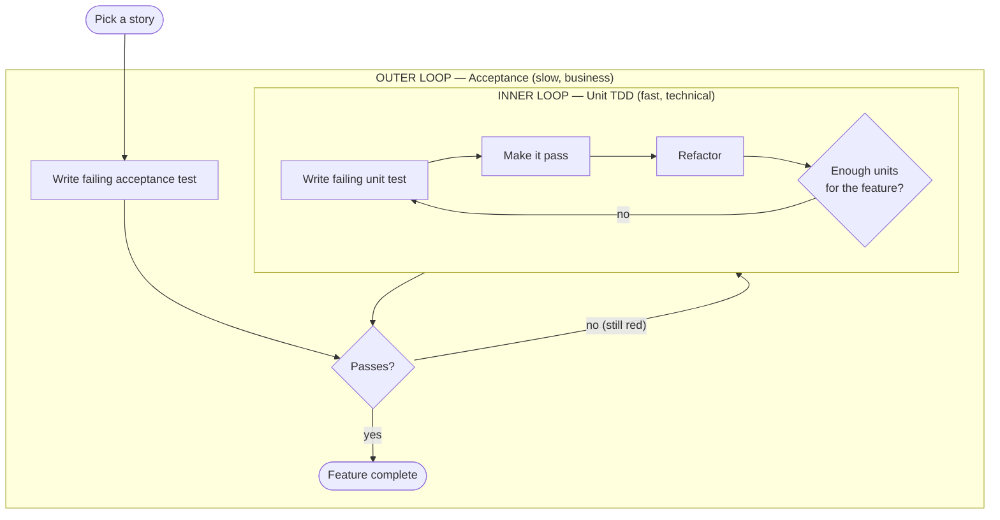
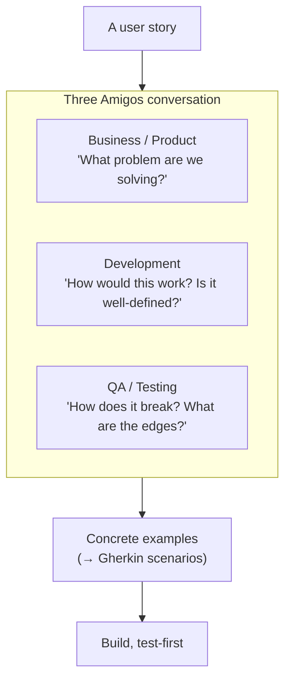
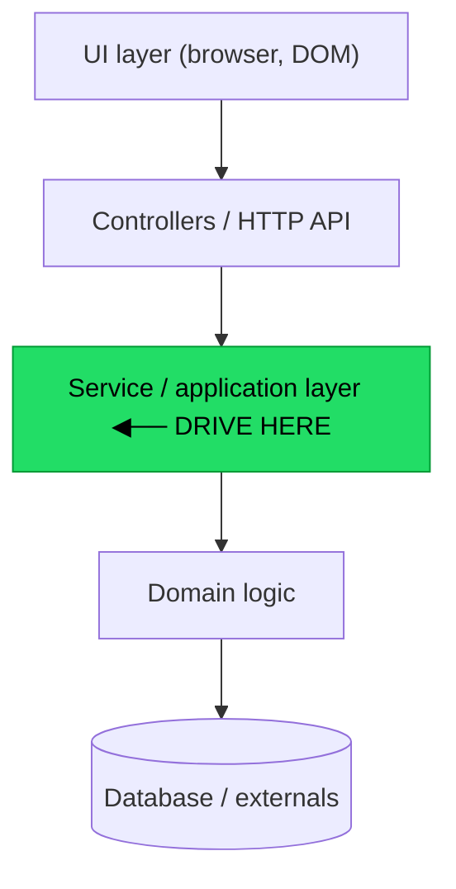
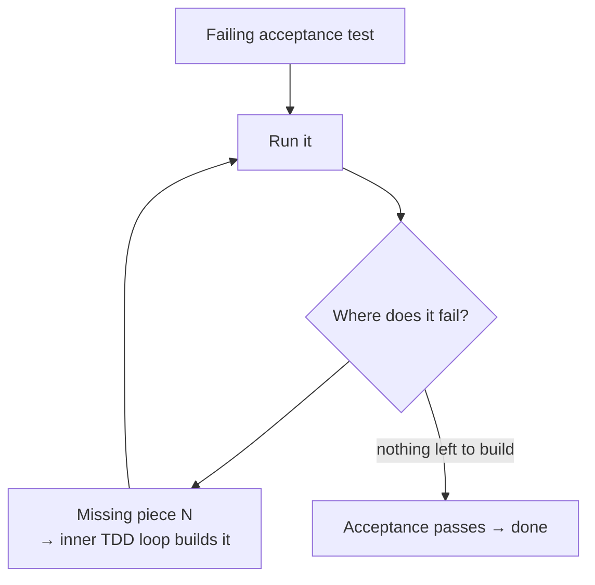
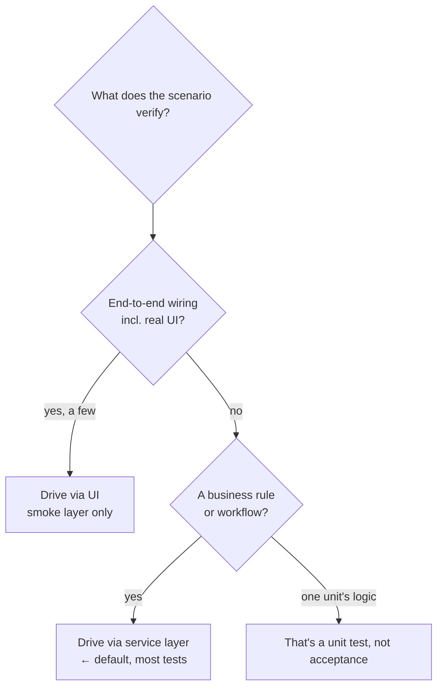

# Acceptance Test-Driven Development — Middle

> **Category:** [Craftsmanship Disciplines](../README.md) — drive development from executable acceptance criteria agreed with the business.

> **Prerequisite:** [Junior](junior.md)
> **Focus:** **Why** and **When**

---

## Introduction

> Focus: **Why** and **When**

At the junior level, ATDD is a procedure: write the Gherkin, wire the steps, make it pass. At the middle level it becomes a set of *judgements*:

- **How deep does the acceptance test reach?** Through the UI? The HTTP layer? The service layer? The answer determines whether your suite is fast and stable or slow and brittle.
- **What deserves a scenario at all**, versus a unit test or no test?
- **How do the two loops actually interleave** when you build a non-trivial feature outside-in?
- **Who writes the scenario**, and why does it matter that it isn't just the developer?

The recurring tension is **fidelity vs. cost**. A test that drives the real UI in a real browser is maximally faithful and maximally expensive — slow, flaky, and coupled to layout. A test that calls a service method directly is cheaper and stabler but skips the wiring above it. Knowing where to cut that line is the middle-level skill.

---

## The Double Loop in Depth

The "double loop" (also called **two-tier TDD** or the **outside-in** loop) is the engine of ATDD. The outer loop is failing-acceptance-test-driven; the inner loop is the classic [three-laws TDD](../01-the-three-laws-of-tdd/junior.md) cycle.



### Why two loops instead of one

If you only had unit tests, you could build a hundred perfectly-tested classes that *don't add up to the feature the customer wanted*. The acceptance test is the **integration of intent** — it proves the units, assembled, do the right thing. If you only had acceptance tests, every failure would point at "the whole feature is broken" with no fine-grained signal about *which line* — and the suite would be too slow to run on every save.

The two loops divide the labor:

| Loop | Question it answers | Speed | Granularity | Count |
|---|---|---|---|---|
| **Outer (acceptance)** | "Did we build the right feature?" | Slow (seconds) | Coarse (whole feature) | Few |
| **Inner (unit)** | "Did we build this piece correctly?" | Fast (ms) | Fine (one unit) | Many |

### The rhythm, concretely

1. Write the acceptance test. Run it. It fails — typically because the *entry point* (a service method, an endpoint) doesn't exist yet.
2. That failure tells you the **first thing to build**. Create the entry point with a unit test; make it pass.
3. The acceptance test now fails *further along* — the next collaborator is missing. Build that, inner-loop.
4. Repeat. The acceptance test's failure message **walks you through the feature**, one missing piece at a time.
5. When the last piece lands, the acceptance test goes green.

This is why ATDD is called *outside-in*: you start at the outside (the feature's observable behavior) and let its failures pull you inward to the units you need.

---

## BDD and Gherkin Properly

**BDD** (Behavior-Driven Development) is ATDD with a particular vocabulary: scenarios written in **Gherkin** as `Given-When-Then`. Dan North invented BDD to fix a specific problem — people heard "test" in TDD and thought "QA verification," missing that TDD is really about *specifying behavior*. BDD renames the artifacts to make the intent obvious: not "tests" but **specifications by example**.

### The Gherkin keywords

```gherkin
Feature: <a capability, with a brief why>
  Background:               # steps run before EVERY scenario in this file
    Given <common setup>

  Scenario: <one concrete behavior>
    Given <precondition>
    And   <more precondition>
    When  <the single action>
    Then  <observable outcome>
    But   <a negative outcome>
```

- **`Feature`** names a capability and usually carries the user-story "so that…".
- **`Background`** factors out setup shared by every scenario in the file (use sparingly — heavy backgrounds hide context).
- **`Scenario`** is one example of the behavior.
- **`Given/When/Then/And/But`** are interchangeable *to the parser* — they all match step definitions the same way — but they carry meaning to the *reader*. Respect their roles.

### Declarative beats imperative — the central skill

This is worth repeating from [Junior](junior.md) because it's the difference between a maintainable suite and an abandoned one:

```gherkin
# ❌ Imperative: a UI script. Breaks on any layout change.
Scenario: Transfer money
  Given I am on "/login"
  When I fill "#user" with "ada" and "#pass" with "x" and click "#go"
  And I navigate to "/transfer"
  And I fill "#amount" with "40" and "#to" with "bob" and click "#submit"
  Then "#balance" should show "60"

# ✅ Declarative: business intent. Survives redesigns.
Scenario: Transfer money between own accounts
  Given Ada has $100 in checking and $0 in savings
  When she transfers $40 from checking to savings
  Then checking shows $60 and savings shows $40
```

The declarative scenario describes **what the user accomplishes**; the *how* (forms, clicks, endpoints) lives in step definitions, where it can change without touching the spec.

---

## The Three Amigos

The "Three Amigos" is the practice of having **three perspectives** review a story before it's built. It is the highest-value, lowest-cost part of ATDD — and the part teams most often skip.



| Amigo | Brings | Catches |
|---|---|---|
| **Business / Product Owner** | The *why* and the desired outcome | "That's not actually what we need." |
| **Developer** | Feasibility, hidden complexity, ambiguity | "This rule is undefined for the empty case." |
| **QA / Tester** | Edge cases, failure modes, adversarial inputs | "What happens at exactly $100? On the boundary?" |

The output of the conversation is a set of **concrete examples** — which become the Gherkin scenarios. The examples *are* the specification. This is the core of Gojko Adzic's **Specification by Example** (covered in [Senior](senior.md)): you specify behavior not in abstract prose ("apply appropriate discounts") but in tables of examples ("$99 → $99, $100 → $100, $101 → $90.90") that a computer can check.

**Why three, not one:** a developer writing scenarios alone re-creates exactly the assumption gap ATDD exists to close. The misunderstanding is invisible to the person who has it. You need a second and third pair of eyes from *different* concerns to surface it.

---

## Where Acceptance Tests Plug Into the Stack

This is the most consequential middle-level decision: **which layer does the acceptance test drive?**



| Drive through… | Fidelity | Speed | Stability | Verdict |
|---|---|---|---|---|
| **UI (Selenium/Playwright)** | Highest — tests the real thing | Slowest (seconds each) | Lowest — breaks on any layout change | Use sparingly, a handful of true E2E smoke tests |
| **HTTP API** | High — tests routing, serialization, auth | Medium | Medium | Good for API products and contract-level checks |
| **Service / application layer** | Good — tests business behavior end-to-end *minus* the UI | Fast (in-process) | High — decoupled from presentation | **Default for most acceptance tests** |
| **Domain object only** | Low — that's a unit test | Fastest | Highest | Not an acceptance test |

### Why the service layer is the default

The guidance — from *Growing Object-Oriented Software, Guided by Tests* (Freeman & Pryce) and reinforced by Martin Fowler — is to write the **bulk** of acceptance tests against the application's **service layer** (its programmatic API), not its UI. Reasons:

1. **Speed.** Service-layer tests run in-process, in milliseconds. UI tests launch a browser and wait for it. A suite of 200 service-layer acceptance tests runs in seconds; 200 UI tests take 40 minutes.
2. **Stability.** The service layer changes far less often than the UI. A button moving, a CSS class renaming, a redesigned page — none of these touch a service-layer test. UI tests break constantly on changes that don't affect behavior.
3. **Clear failure signal.** A UI test failure could be the feature, the browser, the network, a race condition, or a moved element. A service-layer test failure is the *behavior*.

You still want a *few* UI tests — to prove the UI is wired to the service at all — but the **business rules** are tested below the UI. This is the antidote to the **ice-cream-cone anti-pattern** (covered in [Senior](senior.md)): a suite top-heavy with slow, brittle UI tests and starved of fast unit tests.

```gherkin
# Same scenario, two wirings:

# UI-driven step def (brittle, slow):
@when('she transfers ${amt:d} from checking to savings')
def step(context, amt):
    context.browser.fill('#amount', amt)
    context.browser.fill('#to', 'savings')
    context.browser.click('#submit')        # depends on the DOM

# Service-layer step def (stable, fast):
@when('she transfers ${amt:d} from checking to savings')
def step(context, amt):
    context.result = context.bank.transfer(   # calls the real service
        context.user, "checking", "savings", amt)
```

The Gherkin is identical. Only the step definition changes — and that's the whole point: **the spec is decoupled from the layer it drives.** You can start with a UI-driven step and later move it down to the service layer without touching the business-readable scenario.

---

## Tooling: Cucumber, behave, SpecFlow

Gherkin is a *language*; these are *runners* that parse it and dispatch each step to a matching step definition.

| Tool | Ecosystem | Step-definition language |
|---|---|---|
| **Cucumber** | JVM (Java/Kotlin), Ruby, JS | Java / Kotlin / Ruby / JS |
| **behave** | Python | Python |
| **SpecFlow** (now **Reqnroll**) | .NET | C# |
| **Cucumber-JS** | Node | JS / TS |
| **pytest-bdd** | Python | Python (runs under pytest) |
| **Gauge** | polyglot | Markdown specs + many languages |

They all work the same way: a regular-expression or cucumber-expression pattern on each step definition matches a Gherkin line and captures its parameters.

### Java / Cucumber — step with a Spring service

```java
public class TransferSteps {
    @Autowired private BankService bank;   // the real service layer
    private Money checking, savings;

    @Given("Ada has ${int} in checking and ${int} in savings")
    public void adaHas(int chk, int sav) {
        bank.openAccount("ada", "checking", Money.of(chk));
        bank.openAccount("ada", "savings",  Money.of(sav));
    }

    @When("she transfers ${int} from checking to savings")
    public void sheTransfers(int amt) {
        bank.transfer("ada", "checking", "savings", Money.of(amt));
    }

    @Then("checking shows ${int} and savings shows ${int}")
    public void balancesAre(int chk, int sav) {
        assertThat(bank.balance("ada", "checking")).isEqualTo(Money.of(chk));
        assertThat(bank.balance("ada", "savings")).isEqualTo(Money.of(sav));
    }
}
```

### Python / behave — same behavior

```python
@given('Ada has ${chk:d} in checking and ${sav:d} in savings')
def step_open(context, chk, sav):
    context.bank.open_account("ada", "checking", chk)
    context.bank.open_account("ada", "savings", sav)

@when('she transfers ${amt:d} from checking to savings')
def step_transfer(context, amt):
    context.bank.transfer("ada", "checking", "savings", amt)

@then('checking shows ${chk:d} and savings shows ${sav:d}')
def step_check(context, chk, sav):
    assert context.bank.balance("ada", "checking") == chk
    assert context.bank.balance("ada", "savings") == sav
```

Both call the **real `bank` service** in-process — fast, stable, and exercising real business logic.

---

## Scenario Outlines and Data Tables

When the same behavior has many examples (the heart of Specification by Example), don't copy-paste scenarios — use a **Scenario Outline**:

```gherkin
Scenario Outline: Volume discount tiers
  Given a cart subtotal of $<subtotal>
  When I check out
  Then the total charged should be $<total>

  Examples:
    | subtotal | total  |
    | 99       | 99.00  |   # below threshold, no discount
    | 100      | 100.00 |   # exactly at threshold (boundary!)
    | 101      | 90.90  |   # above threshold, 10% off
    | 500      | 450.00 |
```

The `Examples` table *is* the specification of the discount rule, in business-readable form, including the boundary case QA insisted on in the Three Amigos meeting. Each row runs as a separate test. **Data Tables** (multi-column arguments to a single step) handle structured inputs:

```gherkin
Given the following products exist:
  | sku   | name   | price |
  | A-1   | Widget | 9.99  |
  | A-2   | Gadget | 19.99 |
```

---

## Driving a Feature Outside-In

Concretely, here's the double loop building "volume discount" from scratch:

1. **Outer (red):** Write the `Scenario Outline` above. Run it. Fails — `Checkout.total_for` doesn't exist.
2. **Inner:** Write a failing unit test `test_no_discount_below_100`. Implement the simplest `total_for` (return subtotal). Green. Refactor.
3. **Re-run acceptance:** the `99` and `100` rows pass; the `101` row fails (no discount applied).
4. **Inner:** Write `test_10pct_over_100`. Implement the threshold logic. Green. Refactor.
5. **Re-run acceptance:** all rows green. **Outer loop closes.** Feature done.

Notice the acceptance test's failures **dictated the order of work** and stopped you the instant the behavior was complete — you never gold-plated.

---

## When to Use ATDD — and When Not

### Use ATDD when:

- The feature encodes **business rules** a customer cares about and could get wrong.
- The requirement is **ambiguous** and a concrete example would resolve it.
- The behavior **spans multiple components** and unit tests alone can't prove it works assembled.
- You need a **living, agreed definition of done** (regulated domains, contracts, complex workflows).

### Don't use ATDD when:

| Symptom | Why ATDD is wrong | Better |
|---|---|---|
| Pure technical helper (a date parser, a cache) | No business-facing behavior to specify | Unit tests |
| Trivial CRUD that just restates the framework | The scenario adds no information | A thin integration test, or nothing |
| You'd test *every* rule at the acceptance level | Slow, brittle suite; wrong layer | Push detail to unit tests; keep acceptance tests few |
| The team won't do the Three Amigos conversation | You lose the main benefit; you're just writing slow tests in English | Fix the collaboration first, or use plain unit/integration tests |

The anti-use is **"BDD theatre"**: writing Gherkin for everything, alone, after the code, with imperative UI steps. That has all of ATDD's costs and none of its benefits.

---

## Trade-offs

| Dimension | ATDD (acceptance-first) | Unit-tests-only |
|---|---|---|
| Catches "wrong feature built" | Yes — before coding | No — units can be right, feature wrong |
| Shared business/dev language | Yes (Gherkin / examples) | No |
| Feedback speed per test | Slow (acceptance) + fast (unit) | All fast |
| Risk of brittle/slow suite | High if done at UI level | Low |
| Living documentation | Yes | No |
| Up-front cost per feature | Higher (conversation + spec) | Lower |
| Confidence the feature *works end to end* | High | Lower |

The honest summary: ATDD trades **more up-front collaboration and a slower outer test** for **dramatically lower risk of building the wrong thing** and **executable documentation**. That trade is worth it for behavior the business cares about and a poor trade for plumbing.

---

## Edge Cases

### 1. The acceptance test passes before you wrote the feature

If a brand-new scenario passes immediately, the test is broken (matching the wrong steps, asserting nothing, or hitting a stub). **Always see it red first**, exactly as in unit TDD.

### 2. Background overuse hides context

```gherkin
# Heavy Background — readers lose track of the world each scenario runs in
Background:
  Given 5 users exist
  And 3 products exist
  And a promo "SAVE10"
  And the warehouse is in "EU" mode
```

When scenarios depend on facts buried in a long `Background`, they become hard to read in isolation. Keep `Background` to genuinely universal, small setup; put scenario-specific facts in the scenario.

### 3. Step-definition duplication and drift


### 4. Shared mutable state between scenarios

If scenario B depends on data scenario A created, order-dependence makes the suite fragile and un-parallelizable. Each scenario must set up its own world and clean up after.

---

## Tricky Points

- **The Gherkin keyword is documentation, not logic.** `Given`, `When`, `Then` are all matched identically by the runner; using `When` for setup or `Then` for an action still "works" but lies to the reader. Discipline, not the parser, enforces meaning.
- **A scenario can be green and the feature still wrong** if it's driven at too shallow a layer (e.g., the step def calls a stub instead of the real service). Acceptance tests must hit real collaborators to be meaningful.
- **Outside-in does *not* mean "build the UI first."** It means "start from observable behavior." You can — and usually should — drive that behavior through the service layer, with the UI added thinly on top later.
- **ATDD complements, never replaces, unit TDD.** A suite of only acceptance tests is slow and gives coarse failure signals; a suite of only unit tests can't prove the feature is right.

---

## Best Practices

1. **Run the acceptance test red first**, then let its failures drive your inner loops.
2. **Default to the service layer**; reserve UI-driven tests for a thin smoke layer.
3. **Keep scenarios declarative** — business intent in Gherkin, mechanism in step defs.
4. **Do the Three Amigos** — the conversation, not the syntax, is the value.
5. **Use Scenario Outlines** for rule tables (Specification by Example); include boundary rows.
6. **One `When`, one behavior per scenario.** Split anything bigger.
7. **Make scenarios independent** — own setup, no cross-scenario state.
8. **Reuse and normalize step definitions** to prevent drift.

---

## Test Yourself

1. Why two loops instead of just unit tests, or just acceptance tests?
2. Which layer should most acceptance tests drive, and why?
3. What does each of the Three Amigos catch that the others miss?
4. What's the difference between BDD and ATDD?
5. When is ATDD the *wrong* tool?

---

## Summary

- The **double loop** wraps fast inner unit-TDD cycles inside a slow outer acceptance cycle; the acceptance test's failures drive the order of work **outside-in**.
- **BDD** is ATDD expressed as `Given-When-Then` Gherkin; keep scenarios **declarative** (intent), not imperative (clicks).
- The **Three Amigos** (business + dev + QA) turn a story into concrete examples *before* coding — the highest-value, most-skipped step.
- Drive most acceptance tests through the **service layer** for speed, stability, and clear failure signals; keep UI tests few.
- **Cucumber / behave / SpecFlow** run Gherkin against step definitions; **Scenario Outlines** express rule tables (Specification by Example).
- ATDD **complements** unit TDD; it's wrong for plumbing, trivial CRUD, or teams that skip the conversation.

---

## Diagrams

### The double loop, with the failure-driven walk inward



### Choosing the drive layer




---

## Check your understanding

1. Explain Acceptance Test-Driven Development — Middle Level in your own words and name the problem it solves.
2. How would you apply the ideas around Table of Contents, Introduction, The Double Loop in Depth in a realistic engineering change?
3. What failure mode or misuse should you look for, and what evidence would reveal it?
4. Which local design trade-off would make you choose or reject Acceptance Test-Driven Development — Middle Level in an existing codebase?
5. What observable result would convince you that the approach improved the system?
