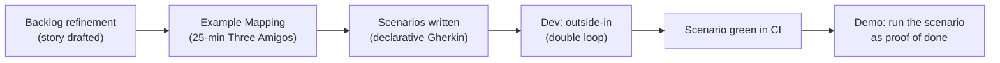
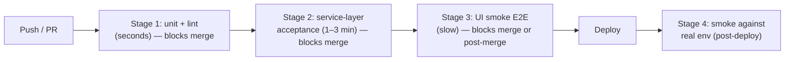
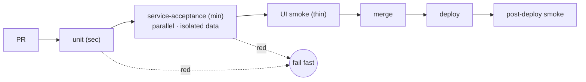
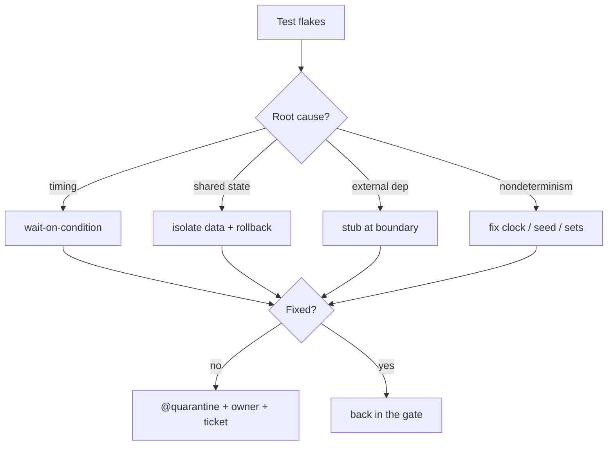

# Acceptance Test-Driven Development — Professional

> **Category:** [Craftsmanship Disciplines](../README.md) — drive development from executable acceptance criteria agreed with the business.

> **Prerequisites:** [Junior](junior.md) · [Middle](middle.md) · [Senior](senior.md)
> **Focus:** **Production** — delivery workflow, CI, flakiness, rollout, tooling

---

## Table of Contents

1. [Introduction](#introduction)
2. [The Collaboration Workflow That Actually Works](#the-collaboration-workflow-that-actually-works)
3. [Keeping Specs Alive](#keeping-specs-alive)
4. [CI Integration](#ci-integration)
5. [Taming Flaky Acceptance Suites](#taming-flaky-acceptance-suites)
6. [Test Data and Environment Management](#test-data-and-environment-management)
7. [Tooling Choices](#tooling-choices)
8. [Rolling ATDD Into an Existing Team](#rolling-atdd-into-an-existing-team)
9. [Metrics for an Acceptance Suite](#metrics-for-an-acceptance-suite)
10. [Real Incidents](#real-incidents)
11. [Code Review Standards for Scenarios](#code-review-standards-for-scenarios)
12. [Cheat Sheet](#cheat-sheet)
13. [Diagrams](#diagrams)
14. [Related Topics](#related-topics)

---

## Introduction

> Focus: **production** — what ATDD costs and protects once a feature is live, observed, and maintained by a team across many releases.

By the professional level the syntax is assumed. The questions are operational:

- How does the **collaboration** actually flow through a sprint without becoming a bottleneck?
- How do you keep specs from **rotting** into ignored, slow, English-flavored test code?
- How do you wire acceptance tests into **CI** without making the build unbearable?
- What do you do about the **flaky** acceptance suite that everyone has and nobody trusts?
- Which **tools** fit which teams, and how do you **roll ATDD in** to a team that's never done it?

The unifying theme: an acceptance suite is a production system in its own right. It has uptime (does CI stay green?), reliability (is it flaky?), performance (how long does it run?), and cost (who maintains it?). Treat it that way.

---

## The Collaboration Workflow That Actually Works

The Three Amigos is easy to describe and hard to sustain. What works in practice:



### Example Mapping — the practical Three Amigos

A 25-minute structured conversation (Matt Wynne's technique) using four colors of cards:

- **Yellow** — the **story** under discussion.
- **Blue** — the **rules** (acceptance criteria) that constrain it.
- **Green** — **examples** that illustrate each rule (these become scenarios).
- **Red** — **questions / unknowns** nobody in the room can answer.

The deliverable is a wall of cards. Red cards are gold: they're the misunderstandings caught *before* a line of code. A story with too many reds isn't ready — it goes back to refinement. A story whose rules each have clear examples is ready to build. This keeps the conversation **time-boxed and productive** instead of an open-ended meeting.

### Who writes what

- **Scenarios (Gherkin):** drafted collaboratively, owned by the team, must stay business-readable. The PO/BA should be able to read and challenge them.
- **Step definitions:** developers. This is code and lives with the codebase.
- **Keeping them green:** whoever changes the behavior. A red scenario blocks merge.

The failure mode to avoid: developers writing scenarios in isolation and showing them to the business as a fait accompli. The point is the *conversation that produces* the examples, not the examples themselves.

---

## Keeping Specs Alive

Specs rot in predictable ways. Counter each deliberately:

| Rot | Symptom | Counter |
|---|---|---|
| **Drift to imperative** | Scenarios fill with ids, clicks, status codes | Review gate: a non-dev must be able to read every scenario |
| **Staleness** | Scenarios `@Ignore`d/`@wip` to keep build green | Treat ignored scenarios as failing in the metrics; fix or delete |
| **Over-growth** | Every edge case is an acceptance test | Move edges to unit tests; keep acceptance as a sampler |
| **Orphaned docs** | A separate requirements wiki disagrees with the scenarios | Delete the wiki; scenarios are the single source of truth |

The single most important habit: **the business reads the scenarios.** If the only people who ever open a `.feature` file are developers, the spec has already stopped being living documentation — it's just slow test code, and the discipline has quietly died.

Render scenarios as browsable docs (Cucumber HTML reports, SpecFlow/Reqnroll **LivingDoc**, **Serenity BDD** reports) and link them from where the team actually looks — the PR, the wiki landing page, the demo deck. Documentation that's hard to find isn't read; documentation that's read stays honest.

---

## CI Integration

Acceptance tests are slower than unit tests, so naively running everything on every push makes the build unbearable. The professional pattern is **staged execution**:



Principles:

1. **Fail fast, cheap first.** Unit tests gate before slow acceptance tests even start — most regressions are caught in seconds.
2. **Run the bulk of acceptance tests at the service layer**, in-process, so Stage 2 stays in single-digit minutes.
3. **Keep UI/E2E thin** and isolate it (Stage 3). If it's flaky, a thin layer limits the blast radius.
4. **Parallelize.** Cucumber/behave/pytest-bdd all support parallel execution; independent scenarios shard across runners. (Independence — no shared state — is the prerequisite; see [Test Data](#test-data-and-environment-management).)
5. **Tag and select.** `@smoke`, `@slow`, `@wip`, `@regression` let CI run the right subset per stage:

```bash
# behave: run only smoke-tagged scenarios in the PR gate
behave --tags=@smoke
# cucumber-jvm: exclude work-in-progress
mvn test -Dcucumber.filter.tags="not @wip"
```

6. **Post-deploy smoke.** A handful of read-only scenarios against the *real* deployed environment catch config/wiring failures that no pre-deploy test can.

---

## Taming Flaky Acceptance Suites

Flakiness — a test that passes and fails on identical code — is the disease of acceptance suites. It's corrosive because it trains the team to ignore red, defeating the entire purpose. Treat each flaky test as a **production incident**, not an annoyance.

### Root causes and fixes

| Cause | Fix |
|---|---|
| **Implicit waits / timing races** (UI) | Wait for a *condition* (element present, network idle), never `sleep(2)`. Use the framework's explicit waits. |
| **Shared mutable state across scenarios** | Each scenario sets up and tears down its own data; never depend on order. |
| **Real external dependencies** (email, payment, 3rd-party API) | Stub/fake them at the boundary; verify the contract separately ([Senior](senior.md)). |
| **Test environment contention** | Isolated data per run (unique tenant/prefix), or ephemeral environments per pipeline. |
| **Nondeterministic data** (now(), random, ordering) | Inject a fixed clock; seed RNG; assert on sets, not order. |
| **Async/eventual consistency** | Poll-with-timeout for the expected state instead of asserting immediately. |

### Policy, not just fixes

- **Quarantine, don't ignore.** A newly-flaky test moves to a `@quarantine` tag that runs but doesn't block the build — *with a ticket and an owner and a deadline*. Quarantine is a hospital, not a graveyard.
- **Track a flakiness rate** (% of runs where a test failed then passed on retry). If it's rising, stop adding features and fix the suite.
- **Retries are a smell, not a cure.** Auto-retrying flaky tests hides the rot. A single retry to absorb genuinely rare infra blips is defensible; retrying to paper over a race is how the ice-cream cone becomes permanent.
- **A flaky test is failing.** Culturally, treat "it's just flaky" as "it's broken," because a suite you don't trust provides no safety.

---

## Test Data and Environment Management

The biggest source of slow, flaky, order-dependent acceptance suites is **shared, leftover, or hand-managed test data.** Professional patterns:

- **Each scenario owns its world.** Create exactly the data the scenario needs in its `Given` steps; tear it down (or roll back the transaction) after. No reliance on a pre-seeded database.
- **Builders / object mothers** over fixtures. A `Given` step calls a builder (`aCustomer().withTier(GOLD).build()`) so setup is readable and intent-revealing, not a wall of inserts. (See [Test Design & Fixtures](../02-test-design-and-fixtures/senior.md).)
- **In-memory or transactional rollback** for service-layer tests: wrap each scenario in a transaction and roll back, or use an in-memory adapter, so tests are fast and self-cleaning.
- **Unique namespacing** for tests that must hit a shared environment: prefix every entity with a per-run id so parallel runs and reruns don't collide.
- **Idempotent setup.** `Given` steps should produce the same world whether the previous run cleaned up or crashed.

```python
# behave environment.py — clean isolation per scenario
def before_scenario(context, scenario):
    context.tx = db.begin()          # start a transaction
    context.bank = BankService(db)

def after_scenario(context, scenario):
    context.tx.rollback()            # discard everything the scenario did
```

This is what makes acceptance suites **parallelizable** (Stage 2 in CI) and **non-flaky** (no cross-scenario contamination). Data hygiene is not optional plumbing — it's the foundation the whole suite's reliability rests on.

---

## Tooling Choices

There is no universally "best" tool; fit it to the stack and the team.

| If your stack is… | Consider | Notes |
|---|---|---|
| **JVM (Java/Kotlin/Spring)** | Cucumber-JVM, Serenity BDD, JBehave | Serenity adds rich living-doc reports; integrates with Spring for service-layer wiring |
| **.NET** | Reqnroll (the maintained successor to SpecFlow) | LivingDoc reports; SpecFlow is end-of-life |
| **Python** | behave, pytest-bdd | pytest-bdd reuses pytest fixtures/parametrization — usually the better choice in a pytest shop |
| **Node/TS** | Cucumber-JS, Playwright (for the thin UI layer) | Playwright for resilient UI smoke; Cucumber-JS for Gherkin |
| **Polyglot / docs-first** | Gauge, Concordion | Markdown specs; Concordion embeds examples in prose docs |
| **Ruby** | Cucumber (its original home), RSpec | |

### When *not* to use a Gherkin tool

A crucial professional judgement: **you can do ATDD without Gherkin.** If the business never reads the scenarios, the Gherkin layer is pure overhead — a regex-matching indirection between you and your assertions. In that case, write acceptance tests as **plain, well-named tests in your unit framework** (a `@Tag("acceptance")` JUnit test, a pytest with a descriptive name) driving the service layer. You keep outside-in development and the test pyramid; you drop the ceremony that was buying nothing.

> Rule: use Gherkin **only if non-developers actually read and shape the scenarios.** Otherwise it's slower test code with an extra parsing layer.

---

## Rolling ATDD Into an Existing Team

You rarely start greenfield. Introduce ATDD incrementally and measurably:

1. **Start with the conversation, not the tool.** Run Example Mapping on the next ambiguous story. The red-card insights sell the practice better than any tooling demo.
2. **Pick one valuable, rule-heavy feature** for the first automated scenarios — somewhere a misunderstanding would hurt. Don't start with CRUD.
3. **Drive at the service layer from day one.** Starting with UI tests is how teams land directly in the ice-cream cone.
4. **Add the suite to CI as a non-blocking stage first**, then promote to blocking once it's green and stable. A flaky new suite that blocks merges gets disabled by an annoyed team.
5. **Establish the data-isolation pattern early** (transaction rollback / builders). Retrofitting isolation into a suite built on shared data is painful.
6. **Make the business read scenarios in the demo** — run the actual scenario as proof of done. This closes the loop and keeps specs honest.

The anti-pattern to avoid: mandating "Gherkin for every story" on day one. That produces ATDD theatre — slow English tests written alone, after the code. Grow the practice where it pays.

---

## Metrics for an Acceptance Suite

Measure the suite as the production asset it is:

- **Suite wall-clock time** (per stage). Trend it; a creeping number means the cone is forming.
- **Flakiness rate** (% runs failing-then-passing on retry). Target near zero; treat a rise as a stop-the-line.
- **Pyramid ratio** (unit : service-acceptance : UI). Watch for inversion.
- **Pass-without-change rate** — scenarios that break on *unrelated* changes signal wrong-layer coupling.
- **Business-readability** — sample scenarios; can a non-dev explain each? If not, declarativeness is rotting.
- **Defect escape rate** — bugs found in prod that *should* have been caught by an acceptance test; informs where to add (or where the suite gives false comfort).

Report the **right** metric when justifying the suite: "this acceptance suite has caught N requirement misunderstandings before release and runs in 90 seconds," not "we have 400 scenarios" (count is cost, not value).

---

## Real Incidents

### Incident 1: The 40-minute build everyone stopped running

A team verified every rule through Selenium. The suite grew to 600 UI tests, 40 minutes, and flaked ~15% of runs. Developers stopped running it locally and merged on red ("it's just flaky"). A real regression shipped behind the noise. **Fix:** rebalanced to the pyramid — moved business rules to service-layer scenarios, kept ~30 UI smoke tests, built out unit coverage. Build dropped to 6 minutes; flakiness to <1%. **Lesson:** an ignored suite is worse than none; the ice-cream cone is a trust-destroyer.

### Incident 2: Order-dependent scenarios

Scenarios shared a seeded database; scenario B relied on a user scenario A created. When CI started running scenarios in parallel, B failed intermittently — sometimes it ran before A. **Fix:** each scenario creates its own data in `Given`, wrapped in a per-scenario transaction rolled back after. **Lesson:** shared test state is the root of flakiness and the blocker to parallelization.

### Incident 3: The scenario that passed for the wrong reason

A step definition's assertion was `assert result is not None` — and `result` was always a (wrong) object. The scenario was green for months while the feature was subtly broken; a customer found the bug. **Fix:** assert on the *behavior* (`result.total == 108.00`), and the team adopted "see every new scenario red first." **Lesson:** a green test proves nothing unless you've watched it fail for the right reason.

### Incident 4: Spec drift to imperative, business stopped reading

Over a year, scenarios accreted `data-testid`s and HTTP codes to make UI automation work. The PO stopped reading `.feature` files. Three Amigos meetings quietly ended. The next big feature shipped with a requirement misunderstanding ATDD would have caught. **Fix:** moved mechanism into step definitions, restored declarative scenarios, reinstated Example Mapping. **Lesson:** declarativeness isn't cosmetic — it's the property that keeps the business engaged, which is the *only* thing that makes ATDD more than slow tests.

### Incident 5: assertion-free `Then` step

A `@then` step was implemented as `pass` (a placeholder never filled in). The scenario could never fail. **Fix:** lint/CI check that every `Then` step contains an assertion; require red-first. **Lesson:** a `Then` with no assertion is a guard that doesn't guard — it's a lie that says "verified."

---

## Code Review Standards for Scenarios

A reviewer evaluating a `.feature` change should check, in order:

1. **Is the scenario declarative?** Business intent, no ids/clicks/SQL/status codes. Request a rewrite if it's a UI script.
2. **One `When`, one behavior?** Multiple actions → split.
3. **Does every `Then` actually assert** an observable outcome (not just "no exception")?
4. **Was it seen red first?** Ask in the PR; a new scenario that never failed proves nothing.
5. **Is it driven at the right layer?** Default to service layer; question new UI tests for non-wiring behavior.
6. **Is it independent?** Owns its setup, no reliance on other scenarios or pre-seeded data.
7. **Right level at all?** Could this be a unit test? If it's a single rule's logic, push it down.
8. **Readable by a non-dev?** If the PO couldn't follow it, it's not living documentation.

### Review comment templates

> "This scenario asserts on `#submit-btn` — couple it to behavior instead. Move the selector into the step definition, and ideally drive this through the service layer."

> "Three `When`s here — split into three scenarios so a failure tells us which behavior broke."

> "This `Then` only checks the call didn't throw. Assert the actual outcome (the confirmed order / the new balance)."

> "This is one unit's logic — it'll be faster and more precise as a unit test. Reserve acceptance tests for cross-component behavior."

---

## Cheat Sheet

```text
DELIVERY WORKFLOW
1. Example Mapping (25 min): story / rules / examples / questions
2. Red cards → not ready; resolve before building
3. Declarative scenarios from green cards
4. Build outside-in (double loop), service layer
5. Green in CI; run the scenario in the demo as proof of done

CI STAGING
[ ] unit + lint        (sec)   — gate
[ ] service-acceptance (1-3m)  — gate, parallel, isolated data
[ ] UI smoke (thin)    (slow)  — gate or post-merge
[ ] post-deploy smoke  (real env, read-only)

ANTI-FLAKE
[ ] wait on conditions, never sleep()
[ ] per-scenario data + transactional rollback
[ ] stub external services; fixed clock; seeded RNG
[ ] quarantine (with owner+ticket), don't @Ignore
[ ] a flaky test is a FAILING test

REVIEW
[ ] declarative (no ids/clicks/SQL)
[ ] one When / one behavior
[ ] every Then asserts an outcome
[ ] seen red first
[ ] right layer (service by default)
[ ] independent + readable by a non-dev

TOOL CHOICE
[ ] Gherkin ONLY if non-devs read the scenarios
[ ] else plain service-layer tests, tagged @acceptance
```

---

## Diagrams

### The suite as a staged CI pipeline



### Flaky-test triage



---

## Related Topics

- **Inner loop:** [The Three Laws of TDD](../01-the-three-laws-of-tdd/professional.md)
- **Data/fixtures:** [Test Design & Fixtures](../02-test-design-and-fixtures/professional.md)
- **Tooling:** Cucumber, Serenity BDD, Reqnroll (SpecFlow successor), behave, pytest-bdd, Gauge, Playwright.

---


---

## Check your understanding

1. Explain Acceptance Test-Driven Development — Professional Level in your own words and name the problem it solves.
2. How would you apply the ideas around Table of Contents, Introduction, The Collaboration Workflow That Actually Works in a realistic engineering change?
3. What failure mode or misuse should you look for, and what evidence would reveal it?
4. How would you introduce and govern Acceptance Test-Driven Development — Professional Level across teams through reversible, measurable increments?
5. What observable result would convince you that the approach improved the system?
