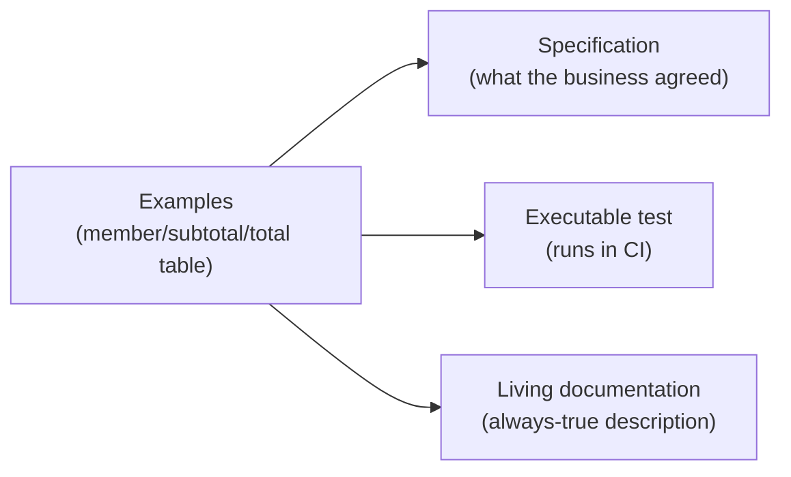
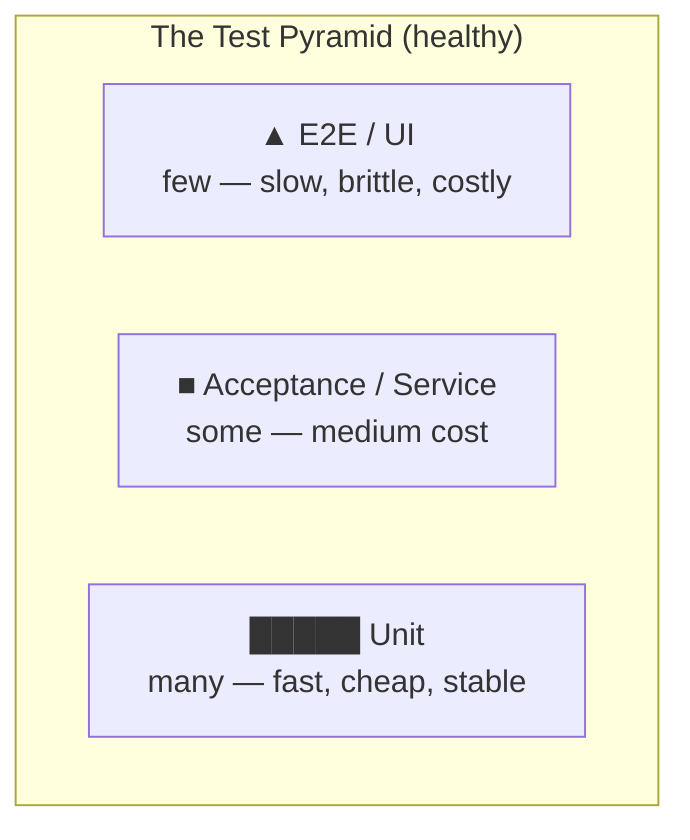
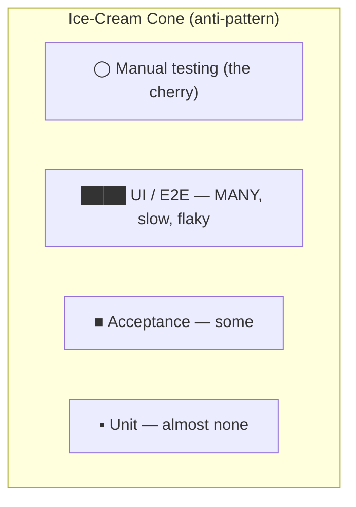
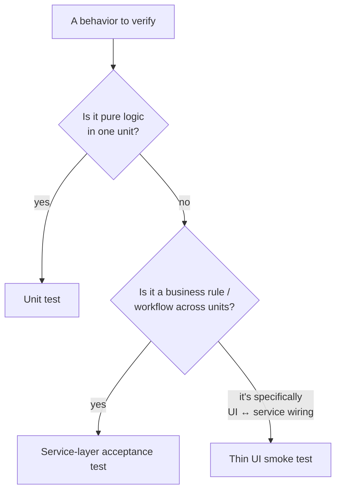
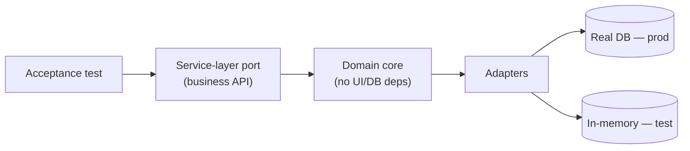
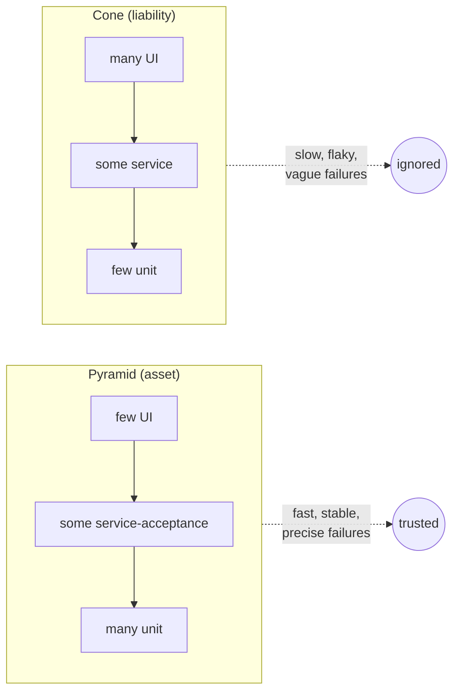

# Acceptance Test-Driven Development — Senior

> **Category:** [Craftsmanship Disciplines](../README.md) — drive development from executable acceptance criteria agreed with the business.

> **Prerequisites:** [Junior](junior.md) · [Middle](middle.md)
> **Focus:** **Design trade-offs** and **system-level reasoning**

---

## Table of Contents

1. [Introduction](#introduction)
2. [Specification by Example](#specification-by-example)
3. [Living Documentation](#living-documentation)
4. [The Test Pyramid — Economics](#the-test-pyramid-economics)
5. [The Ice-Cream-Cone Anti-Pattern](#the-ice-cream-cone-anti-pattern)
6. [Why UI-Driven Acceptance Tests Rot](#why-ui-driven-acceptance-tests-rot)
7. [Testing Through the Right Layer](#testing-through-the-right-layer)
8. [When ATDD Adds Value vs. Wastes Effort](#when-atdd-adds-value-vs-wastes-effort)
9. [ATDD and Contract Testing](#atdd-and-contract-testing)
10. [Designing for Testability from the Outside In](#designing-for-testability-from-the-outside-in)
11. [The Cost Model of an Acceptance Suite](#the-cost-model-of-an-acceptance-suite)
12. [Liabilities](#liabilities)
13. [Diagrams](#diagrams)
14. [Related Topics](#related-topics)

---

## Introduction

> Focus: **design trade-offs** and **system-level reasoning**

At the senior level, ATDD stops being "how to write a Gherkin feature" and becomes a set of architecture-and-economics questions:

1. **Specification by example** — how examples beat prose as a way to *specify*, and why that reframes testing as a communication tool.
2. **The pyramid as economics** — acceptance tests cost orders of magnitude more per unit of confidence than unit tests, and that ratio dictates how many of each you should own.
3. **Where the test couples** — the single biggest determinant of whether an acceptance suite is an asset or a liability is *what layer it drives*, because that decides what changes break it.
4. **When ATDD pays** — it's not free, and a senior must call when its collaboration overhead earns its keep and when it's ceremony.

The throughline: an acceptance suite is a **long-lived asset with a maintenance cost**, and senior judgement is about maximizing the confidence it buys per unit of that cost.

---

## Specification by Example

**Specification by Example** (Gojko Adzic's book and the practice it names) is the deep idea under BDD: **specify behavior with concrete examples, not abstract description.**

Prose specifications are ambiguous by nature:

> "Loyalty members get a discount on large orders."

What's "large"? What's "the discount"? Do they stack? What about exactly-large? Six readers infer six rules. Now the same requirement as **examples**:

| member | subtotal | total | note |
|---|---|---|---|
| no | 100 | 100.00 | at threshold, no discount |
| no | 101 | 101.00 | non-member, no discount |
| yes | 100 | 100.00 | member but at threshold |
| yes | 101 | 90.90 | member, large → 10% |
| yes | 1000 | 900.00 | scales |

The table is **unambiguous, testable, and reviewable by the business**. It surfaces the boundary question ("what happens at exactly 100?") that prose hid. These examples become Scenario Outlines; the same artifact serves three roles at once:



The senior insight: **the examples are the requirement.** The code, the test, and the documentation are all *derived from* the same shared examples — which is why they can't drift apart. Adzic's key practices: *derive scope from goals*, *specify collaboratively* (Three Amigos), *illustrate with examples*, *refine the specification*, *automate without changing the examples*, *validate frequently*, and *evolve a living documentation system*.

The crucial discipline is **"automate without changing the examples."** The business-readable example must not be distorted to suit the automation tool. If you find yourself adding technical noise to a scenario to make it run, the automation layer (step definitions) is leaking upward — push it back down.

---

## Living Documentation

A normal document describes the system at the moment it was written and decays from there. **Living documentation** describes the system *and fails the build when it becomes false*. That property — *it cannot silently lie* — is what makes it worth more than a wiki page.

For a specification to be living documentation it must be:

1. **Executable** — run as tests, so divergence from code is caught immediately.
2. **Readable by non-developers** — in the business's language, or it's just more test code.
3. **Run continuously** — in CI on every change, or it stops being "living."
4. **The single source of truth** — there is no *separate* requirements doc that could disagree; the scenarios *are* the spec.

```gherkin
# This is simultaneously: the requirement, the test, and the docs.
Feature: Refund policy
  Scenario: Refund within 30 days is full
    Given an order delivered 10 days ago
    When the customer requests a refund
    Then they are refunded the full amount

  Scenario: Refund after 30 days is store credit only
    Given an order delivered 45 days ago
    When the customer requests a refund
    Then they receive store credit, not a cash refund
```

A new engineer reads these scenarios to learn what the refund policy *is* — and trusts them, because if the code didn't behave this way, the build would be red. Tools like **Cucumber Reports**, **SpecFlow LivingDoc**, **Serenity BDD**, and **Concordion** render passing scenarios into browsable HTML documentation, with the green/red status baked in.

The failure mode to guard against: documentation that is *executable but unreadable* (imperative, click-by-click scenarios). It satisfies "executable" but fails "readable by non-developers," so it functions as slow test code, not documentation. **Declarative scenarios are the price of admission to living documentation.**

---

## The Test Pyramid — Economics

Mike Cohn's **test pyramid** is usually drawn as a shape; the senior reading is **an economic argument about confidence-per-dollar**.



Each layer has a wildly different cost profile:

| Layer | Speed | Stability | Cost to write | Cost to maintain | Confidence per test |
|---|---|---|---|---|---|
| **Unit** | ~1 ms | High | Low | Low | Narrow but precise |
| **Service-layer acceptance** | ~10–100 ms | Medium-high | Medium | Medium | Broad behavioral |
| **UI / E2E** | seconds | Low | High | **High** | Whole-system, but flaky |

The pyramid prescribes **many cheap fast tests, few expensive slow ones** because:

- A bug caught by a unit test gives a precise location in milliseconds. The same bug caught only by a UI test gives a vague "something is broken" after a 30-second run and a possible retry.
- UI/E2E tests have a **superlinear maintenance cost**: they break on changes unrelated to behavior (layout, timing, test-env flakiness), so each one you add taxes every future change.
- Confidence is not free, but it has steep diminishing returns at the top. The 50th UI test rarely catches what the 49th didn't; the 50th unit test routinely does.

The senior heuristic, often credited to the testing community: **push every test as far *down* the pyramid as it can go while still proving what you need.** If a business rule can be verified by a service-layer test, don't verify it through the UI. If it can be a unit test, don't make it an acceptance test. Reserve each higher layer for what *only* that layer can prove — UI tests prove "the screens are wired to the services," not "the discount math is right."

---

## The Ice-Cream-Cone Anti-Pattern

Invert the pyramid and you get the **ice-cream cone** (also "test cone" or "cupcake"): a fat scoop of slow UI/E2E tests on top, a thin middle, and almost no unit tests — often topped with a dollop of manual testing.



How teams fall into it:

- They equate "acceptance test" with "drive the real UI," so *every* behavioral test becomes a UI test.
- They skip unit tests ("we test through the UI anyway").
- QA owns a giant Selenium suite; developers own few unit tests; the two grow apart.

The consequences are predictable and severe:

| Symptom | Cause |
|---|---|
| 45-minute CI; devs stop running it locally | Hundreds of slow UI tests |
| Chronic flakiness; "just re-run it" culture | Timing/DOM-coupled tests |
| A bug = hours of bisecting | No precise unit-level failure signal |
| Fear of refactoring | Every change breaks dozens of brittle tests |
| Tests get `@Ignore`d to keep the build green | Maintenance cost exceeded perceived value |

The fix is not "delete the UI tests" — it's **rebalance**: keep a thin layer of UI smoke tests, move business-rule verification down to the service layer, and build out the unit base. This is the most common large-scale test-suite pathology, and recognizing it is a senior responsibility.

---

## Why UI-Driven Acceptance Tests Rot

It's worth being precise about *why* UI-coupled acceptance tests are brittle, because the reasons dictate the cure.

1. **They couple to incidental structure.** A test that finds `#submit-btn` breaks when the button's id changes — a change with zero behavioral impact. The test is asserting on *how the page is built*, not *what the feature does*.
2. **They're nondeterministic.** Real browsers, real networks, async rendering, animations, and shared test environments introduce timing races. The same test passes and fails on identical code — the defining property of a **flaky** test, which trains the team to ignore failures.
3. **They fail far from the cause.** A service-layer test failing says "transfer logic is wrong." A UI test failing could be the service, the controller, serialization, routing, the DOM, the test's own waits, or the CI runner.
4. **They're slow, so there are fewer of them**, so each carries more behavioral weight, so each failure is more catastrophic and more tempting to suppress.

The cure follows directly: **drive behavior through the service layer** (no DOM, no browser, no network races), and reserve UI tests for the *one* thing only they verify — that the presentation layer is correctly wired to the behavior beneath it. Keep those few UI tests **declarative and resilient**: select by stable, semantic attributes (`data-testid`, ARIA roles), never by layout or styling classes.

---

## Testing Through the Right Layer

"Testing through the wrong layer" is the senior framing of brittleness. The rule:

> **Test a behavior at the lowest layer that can fully express it, and couple the test to the most stable interface available.**



Two classic "wrong layer" mistakes:

- **Too high:** verifying discount math through the UI. The math is unit-testable in microseconds; routing it through a browser makes a precise rule depend on the entire stack.
- **Too low / coupled to internals:** an acceptance test asserting `Then a row exists in the orders table with status=2`. This couples the spec to the schema and the magic number `2`. The behavioral assertion is `Then the order is confirmed`; the step definition may *check* the DB, but the **scenario** must speak behavior, not storage.

The interface you couple to is as important as the layer. Couple to the **public, stable contract** (a service method, a documented API), not to **incidental internals** (DOM ids, table columns, private methods). Stable-interface coupling is what lets the suite survive refactoring — and surviving refactoring is the entire point of a regression suite.

---

## When ATDD Adds Value vs. Wastes Effort

ATDD has a real, recurring cost: the Three Amigos conversation, writing and maintaining scenarios, and a slower outer test loop. A senior allocates that cost deliberately.

### Adds value

- **Genuine business complexity** with rules a customer can get wrong (pricing, eligibility, refunds, compliance). The example tables earn their keep.
- **Ambiguous requirements** where a concrete example resolves a debate faster than another meeting.
- **Cross-team contracts** where the scenario is the agreement.
- **Long-lived systems** where living documentation pays compounding dividends as people rotate.

### Wastes effort

- **Plumbing and CRUD** with no interesting rules — the scenario just restates the framework.
- **Throwaway / spike code** that won't live long enough to amortize the spec.
- **Teams that won't collaborate** — without the Three Amigos, you keep the cost (slow English tests) and lose the benefit (shared understanding).
- **Highly volatile UIs** in early-stage products where the behavior itself is churning weekly; the spec can't stabilize.

### The decisive question

> *Is there a misunderstanding worth preventing, and a behavior worth documenting for the long term?* If both — ATDD. If neither — unit/integration tests are cheaper and just as safe.

This is the senior version of "right tool for the job": ATDD is a *communication and documentation* technology that happens to produce tests. Where there's no communication gap and nothing worth documenting, you're paying for a benefit you don't need.

---

## ATDD and Contract Testing

In a microservice or API world, ATDD intersects with **contract testing**, and seniors should know the relationship and the boundary.

| | Acceptance test (ATDD) | Contract test (e.g. Pact) |
|---|---|---|
| Verifies | A *feature's behavior* end-to-end (within one service or system) | The *interface agreement* between a consumer and a provider |
| Audience | Business + dev (intent) | The two services' teams (compatibility) |
| Scope | Whole feature, possibly several collaborators | One request/response shape per interaction |
| Catches | "Built the wrong feature" | "We broke our caller / our provider changed" |
| Speed | Medium | Fast (no real cross-network call) |

They are **complementary, not competing**. ATDD asks *"does this feature do what the business wants?"*; contract testing asks *"do these two services still agree on the wire format?"*. A senior uses contract tests to **shrink the need for cross-service E2E acceptance tests**: instead of a slow, flaky test that spins up both services to verify they integrate, each service is tested against the shared contract independently — fast, isolated, and still catching integration breaks. That's *pushing integration confidence down the pyramid*, the same economic move as everywhere else.

The relationship to **Consumer-Driven Contracts**: the consumer expresses what it needs as examples (a contract), and the provider verifies it can satisfy them — which is itself a form of specification-by-example applied to an interface rather than a feature.

---

## Designing for Testability from the Outside In

Outside-in development (ATDD's double loop) is not just a testing technique — it's a **design** technique. Driving from the acceptance test *first* shapes the architecture toward a clean **service-layer seam**:

- Because the acceptance test calls the service layer (not the UI, not the DB), the service layer **must exist as a coherent, callable API** — you can't bury business logic in controllers or in the database.
- The need to set up scenarios cheaply pressures you toward **dependency injection** and **ports/adapters (hexagonal) architecture**: real domain logic, swappable infrastructure (in-memory repo for tests, real DB in prod).
- "Test through the service layer" and "keep the domain free of framework/UI/DB concerns" are the same design constraint viewed from two directions.



This is why GOOS (Freeman & Pryce) treats outside-in TDD as a way to *grow* a well-structured object-oriented system: the tests, written first against the outside, force the seams that make the system both testable *and* well-designed. The testability and the good architecture arrive together — neither is a happy accident.

---

## The Cost Model of an Acceptance Suite

Treat the suite as an investment with carrying costs:

- **Write cost** (one-time): the conversation + scenario + step definitions.
- **Run cost** (per CI run, forever): wall-clock time × number of runs per day × team size. A 5-minute suite run 50×/day is hours of aggregate waiting daily.
- **Maintenance cost** (per change, forever): how many scenarios break per unrelated change — driven almost entirely by *what layer they couple to*.
- **Value** (per change, forever): bugs and misunderstandings caught × cost-if-shipped.


---

## Liabilities

### Liability 1: The slow, brittle suite that gets ignored

An ice-cream-cone suite eventually becomes so slow and flaky that the team stops trusting it, `@Ignore`s the red ones, and ships anyway. A suite nobody trusts is worse than no suite — it costs maintenance *and* provides false comfort. **Rebalance toward the pyramid before the suite loses the team's trust.**

### Liability 2: Specs that drift into test code

Scenarios that accrete technical detail (ids, status codes, SQL) stop being readable by the business, so the Three Amigos stop reading them, so they stop catching misunderstandings — collapsing back into slow, English-flavored integration tests. **Guard declarativeness as a first-class property.**

### Liability 3: ATDD theatre

Gherkin written alone, after the code, imperatively. It has every cost of ATDD and none of the benefit. The tell: no one outside the dev team has ever read a `.feature` file. **If the business doesn't engage, you're not doing ATDD — drop the ceremony and write plain tests.**

### Liability 4: Over-specification at the top

Verifying *every* rule and edge through acceptance tests inverts the pyramid by accretion. Each edge case belongs in a unit test; the acceptance test should cover the *representative* path and key boundaries, not the full combinatorial space. **The acceptance suite is a sampler, not an exhaustive checker.**

---

## Diagrams

### Pyramid vs. cone — the same suite, two economies



### One example, three artifacts (Specification by Example)

```mermaid
flowchart TD
    AMI[Three Amigos] --> EX["Concrete examples (table)"]
    EX --> S[Specification]
    EX --> T[Executable test]
    EX --> D[Living documentation]
    S -. "can't drift —<br/>same source" .- T
    T -. .- D
```

---

## Related Topics

- **Inner loop:** [The Three Laws of TDD](../01-the-three-laws-of-tdd/senior.md)
- **Test craft:** [Test Design & Fixtures](../02-test-design-and-fixtures/senior.md)
- **Enables outside-in design:** [Simple Design](../04-simple-design/junior.md)
- **Refactor safely under the suite:** [Refactoring as a Discipline](../03-refactoring-as-a-discipline/junior.md)

---


---

## Check your understanding

1. Explain Acceptance Test-Driven Development — Senior Level in your own words and name the problem it solves.
2. How would you apply the ideas around Table of Contents, Introduction, Specification by Example in a realistic engineering change?
3. What failure mode or misuse should you look for, and what evidence would reveal it?
4. How would you validate a system-level decision about Acceptance Test-Driven Development — Senior Level under uncertainty?
5. What observable result would convince you that the approach improved the system?
