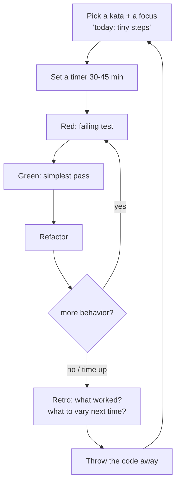

# Kata & Deliberate Practice — Junior

> **Category:** [Craftsmanship Disciplines](../README.md) — practice programming on purpose, on safe throwaway problems, the way a musician practices scales.

---

## Table of Contents

1. [Introduction](#introduction)
2. [Prerequisites](#prerequisites)
3. [Glossary](#glossary)
4. [Core Concepts](#core-concepts)
5. [Real-World Analogies](#real-world-analogies)
6. [Mental Models](#mental-models)
7. [Why Practice Away From Production](#why-practice-away-from-production)
8. [Your First Kata: FizzBuzz via TDD](#your-first-kata-fizzbuzz-via-tdd)
9. [The Practice Loop](#the-practice-loop)
10. [Best Practices](#best-practices)
11. [Common Mistakes](#common-mistakes)
12. [Tricky Points](#tricky-points)
13. [Test Yourself](#test-yourself)
14. [Cheat Sheet](#cheat-sheet)
15. [Summary](#summary)
16. [Further Reading](#further-reading)
17. [Related Topics](#related-topics)

---

## Introduction

> Focus: **What is a kata?** and **How do I practice?**

A **code kata** is a small, well-defined programming exercise that you solve *not to ship it* but to **practice the act of programming itself**. The term comes from Dave Thomas (co-author of *The Pragmatic Programmer*), who borrowed it from martial arts. In karate, a *kata* is a choreographed sequence of moves you repeat hundreds of times until your body executes it without conscious thought. The point of a kata was never the imaginary opponent — it was the practitioner. The same is true in code: the point of FizzBuzz is not the FizzBuzz program. The point is *you*, getting better at writing tests, naming things, refactoring, and listening to the design.

Here is the idea that surprises most beginners: **professionals practice.** Pianists play scales every morning even though no concert ever consists of scales. Surgeons rehearse on simulators. Athletes drill the same footwork thousands of times. Yet many programmers never practice at all — they only ever perform, live, in production, under deadline, where mistakes are expensive and there is no room to experiment. A kata is the missing rehearsal space. It is a place where it is **safe to be slow, safe to be wrong, and safe to try a technique you have not mastered yet.**

This topic is about turning "I write code at work" into "I deliberately get better at writing code," using small exercises, repetition, and honest feedback.

---

## Prerequisites

- **Required:** You can write a function and run it in at least one language.
- **Required:** You have written at least one automated test (or are ready to learn — see [Three Laws of TDD](../01-the-three-laws-of-tdd/junior.md)).
- **Helpful:** A test runner set up so you can go red→green in seconds (JUnit, pytest, `go test`, Jest...).
- **Helpful:** A timer. Many katas are time-boxed (30–45 minutes).

---

## Glossary

| Term | Definition |
|------|-----------|
| **Kata** | A small, well-specified coding exercise solved repeatedly to practice technique, not to ship. |
| **Deliberate practice** | Focused, effortful practice with immediate feedback, aimed just beyond your current ability (Anders Ericsson). |
| **Throwaway code** | Code written to be discarded after the practice session — its value is the learning, not the artifact. |
| **TDD** | Test-Driven Development: write a failing test, make it pass, refactor. The default rhythm for most katas. |
| **Coding dojo** | A group meeting where people practice a kata together, usually with a projector and rotating typists. |
| **Randori** | A dojo format where everyone takes turns at the keyboard on one shared solution. |
| **Prepared kata** | A dojo format where one person performs a kata they have rehearsed, narrating their thinking. |
| **Retro / retrospective** | A short reflection after practice: what went well, what to try differently next time. |

---

## Core Concepts

### 1. A kata is practice, not production

The first mental shift is the hardest. At work, "done" means "merged and shipped." In a kata, **there is no ship.** Done means *you learned something and noticed how you worked.* You will often throw the code away — and that is not waste, it is the point. A pianist does not keep a recording of every scale.

### 2. Deliberate practice ≠ just doing reps

Mindlessly repeating something you already do well builds nothing. Anders Ericsson — the psychologist whose research underlies the famous "10,000 hours" idea — showed that what separates experts is not *time spent* but **deliberate practice**: practice that is

- **focused** on a specific, narrow skill,
- **feedback-driven**, so you immediately know if you got it right,
- **pushed slightly beyond** your current comfort zone, where you fail a little, and
- **repeated with variation**, so you generalize the skill instead of memorizing one answer.

Driving to work every day for 20 years does not make you a Formula 1 driver. Doing the same kata the same way forever makes you good at *that one performance* and nothing else. Real practice means each rep targets a weakness and tries something harder.

### 3. Repetition with variation builds fluency

You do the *same* kata many times, but each time with a twist: a different language, a stricter constraint, a faster clock, a new design approach. Repetition lets the mechanical parts (typing, test syntax, the problem itself) fade into the background so your attention is free for the skill you are actually practicing — say, taking the smallest possible step, or naming things well.

### 4. Feedback is the engine

Without feedback you are just rehearsing your habits, good and bad. In a kata, feedback comes from **tests** (red/green is instant and honest), from a **pair or group** watching you, and from **retrospection** afterward. No feedback, no learning.

---

## Real-World Analogies

| Concept | Analogy |
|---|---|
| **Kata** | A musician's scales and étude — repeated daily, never performed as-is, but the foundation of every performance. |
| **Deliberate practice** | A climber drilling the one move they keep falling off, not re-climbing the routes they already send easily. |
| **Throwaway code** | A sketchbook. Artists fill hundreds of pages no one will ever see, to make the one painting that hangs on the wall. |
| **Doing the same kata many times** | A chef who has cut ten thousand onions — they no longer think about the knife, so they can think about the dish. |
| **Coding dojo** | A martial-arts dojo: a dedicated space and ritual for practicing together, with a teacher and partners. |

---

## Mental Models

**The intuition:** *"Production is the concert. A kata is the practice room. You cannot get good in the concert — there is no time to fail there."*

```
            REHEARSAL (kata)                 PERFORMANCE (work)
        ┌──────────────────────┐         ┌──────────────────────┐
        │ safe to be slow       │         │ deadline pressure     │
        │ safe to be wrong      │   →     │ mistakes are costly   │
        │ try unfamiliar moves  │         │ use mastered moves    │
        │ throw the code away   │         │ ship the code         │
        └──────────────────────┘         └──────────────────────┘
              skill is BUILT here              skill is SPENT here
```

The skills you grind smooth in the practice room — small steps, clean tests, fearless refactoring, good names — are exactly the ones you will reach for automatically under pressure. You practice slow so you can perform fast.

---

## Why Practice Away From Production

It is tempting to think, "I write code 8 hours a day — that *is* practice." It usually is not. Here is why production work is a poor practice environment:

| Production work | Deliberate practice |
|---|---|
| You reach for what you already know (the deadline forbids experimenting). | You deliberately try what you *don't* know yet. |
| Mistakes cost money, reputation, and 2am pages. | Mistakes cost nothing and are the point. |
| The problem is huge, messy, and entangled with legacy. | The problem is tiny and fully specified. |
| Feedback is slow (a bug might surface in weeks). | Feedback is instant (the test goes red now). |
| You can't repeat it — every task is one-shot. | You repeat freely, varying one thing at a time. |

A kata strips away everything that makes work a bad teacher. The problem is small enough to finish in 30 minutes, fully specified so you are not arguing about requirements, and disposable so you can experiment without fear. That is exactly the laboratory you need to *improve* rather than merely *produce*.

> **Separate the practice from the production.** When you practice, you are allowed — encouraged — to go slower and more carefully than you ever would on the job, because you are building a habit, not delivering a feature.

---

## Your First Kata: FizzBuzz via TDD

**FizzBuzz** is the canonical first kata. The spec:

> Print the numbers from 1 to 100. But for multiples of 3 print `Fizz`, for multiples of 5 print `Buzz`, and for multiples of both 3 and 5 print `FizzBuzz`.

It is deliberately trivial. That is the point — the problem must be easy enough that all your attention goes to *how you work*, not *what to build*. We will solve it with **Test-Driven Development**: write a failing test, make it pass with the simplest code, then refactor. (See the [Three Laws of TDD](../01-the-three-laws-of-tdd/junior.md).)

### Step 1 — Red: write a failing test

We start with the simplest possible behavior: 1 maps to `"1"`.

```python
# test_fizzbuzz.py
from fizzbuzz import fizzbuzz

def test_returns_the_number_as_a_string():
    assert fizzbuzz(1) == "1"
```

Run it. It fails — `fizzbuzz` does not exist. **Good.** A failing test is the starting line. Resist the urge to write the whole solution; we are practicing *small steps*.

### Step 2 — Green: simplest code that passes

```python
# fizzbuzz.py
def fizzbuzz(n):
    return "1"
```

Yes, this is "wrong" — but it passes the only test we have, and that is the discipline we are practicing: **do the simplest thing**, then let the next test force more. Run the tests: green.

### Step 3 — Red again: force generality

```python
def test_returns_the_number_as_a_string():
    assert fizzbuzz(1) == "1"
    assert fizzbuzz(2) == "2"   # this fails — we hard-coded "1"
```

### Step 4 — Green: generalize

```python
def fizzbuzz(n):
    return str(n)
```

### Step 5 — Drive in Fizz, then Buzz, then FizzBuzz

Each new rule is a new failing test, then the smallest change to pass it:

```python
def test_multiples_of_three_are_fizz():
    assert fizzbuzz(3) == "Fizz"

def test_multiples_of_five_are_buzz():
    assert fizzbuzz(5) == "Buzz"

def test_multiples_of_both_are_fizzbuzz():
    assert fizzbuzz(15) == "FizzBuzz"
```

A solution that passes all of them:

```python
def fizzbuzz(n):
    if n % 15 == 0:
        return "FizzBuzz"
    if n % 3 == 0:
        return "Fizz"
    if n % 5 == 0:
        return "Buzz"
    return str(n)
```

### Step 6 — Refactor

Now that the tests are green, improve the design without changing behavior. Notice the `15` is really "3 and 5":

```python
def fizzbuzz(n):
    result = ""
    if n % 3 == 0:
        result += "Fizz"
    if n % 5 == 0:
        result += "Buzz"
    return result or str(n)
```

Run the tests after every tiny change. If they stay green, your refactor is safe. (This is [Refactoring as a Discipline](../03-refactoring-as-a-discipline/junior.md) in miniature.)

> **What did you just practice?** Not FizzBuzz. You practiced the **red-green-refactor rhythm**, taking the smallest step, and improving code under the safety of tests. Those are the skills. FizzBuzz was just the dumbbell.

### Now do it again

Here is the part that feels strange and is the most important: **delete it and do FizzBuzz again.** This time in another language, or with a rule (e.g., "no `if` statements"), or against a clock. The second time will feel different — smoother, and the friction you notice tells you exactly what to practice next.

---

## The Practice Loop



The loop is the whole discipline. Pick a *focus* (not just a kata), time-box it, run red-green-refactor, then **retrospect**: What slowed me down? What felt awkward? What will I try differently next time? Then discard the code and go again another day.

---

## Best Practices

1. **Choose a focus, not just a problem.** "Do FizzBuzz" is weak. "Do FizzBuzz taking the smallest step I possibly can" is deliberate practice.
2. **Keep the problem small.** If you cannot finish in ~45 minutes, the kata is too big for a session.
3. **Always use a test.** The red/green signal is your instant feedback loop.
4. **Time-box it.** A clock keeps practice from sprawling into a side project.
5. **Repeat with variation.** Same kata, new constraint or language. Variation is what generalizes the skill.
6. **Retrospect every time.** Thirty seconds of "what would I do differently?" turns reps into learning.
7. **Throw the code away.** Its job is done the moment you learned from it.
8. **Practice regularly, briefly.** Twenty minutes most days beats a five-hour binge once a quarter.

---

## Common Mistakes

1. **Treating the kata as a product.** Polishing, adding features, keeping it forever — you have left practice and started a hobby project.
2. **Doing a kata once and moving on.** One rep of a new technique is a sighting, not a skill. Fluency needs repetition.
3. **No feedback.** Skipping tests, skipping the retro, practicing alone with no signal — you just rehearse your existing habits.
4. **Staying in your comfort zone.** Re-solving a kata the way you already know is exercise, not *deliberate* practice. Push slightly past what you can do.
5. **Picking a problem that's too big.** A multi-hour challenge becomes a project; you stop noticing *how* you work because you are too busy *finishing*.
6. **Confusing busy with deliberate.** Eight hours of cranking out tickets is not practice if you never stretch a weak skill.

---

## Tricky Points

- **"10,000 hours" is a popular misreading.** Ericsson's research says *quality* of practice, not raw hours, drives expertise — and that the hours must be *deliberate* (focused, feedback-rich, stretching). Plain experience plateaus fast. See [Senior](senior.md).
- **The skill is transferable; the program is not.** You will never write FizzBuzz at work, but the small-steps habit you built doing it shows up in every feature you write.
- **TDD and katas grew up together.** Most famous katas are designed to be done test-first, because the test gives the instant feedback deliberate practice requires. See [Three Laws of TDD](../01-the-three-laws-of-tdd/junior.md).

---

## Test Yourself

1. What is a code kata, and where does the term come from?
2. Why do you practice on throwaway problems instead of just practicing at work?
3. What four properties make practice "deliberate" (Ericsson)?
4. In the FizzBuzz walkthrough, why did we first return the hard-coded `"1"`?
5. After finishing a kata, what two things should you do before stopping?

---

## Cheat Sheet

```
WHAT   small, well-specified problem, solved to practice — not to ship
WHY    build skill where it's safe to be slow & wrong (not in production)
HOW    pick a FOCUS → time-box → red/green/refactor → retro → discard → repeat
DELIBERATE = focused + feedback-driven + just past comfort + varied reps
FIRST KATA  FizzBuzz, test-first, smallest steps
REMEMBER    do the same kata MANY times, each time differently
```

---

## Summary

- A **code kata** is a small, well-defined exercise solved to practice programming, not to ship a product.
- **Deliberate practice** (Ericsson) is focused, feedback-driven, slightly-beyond-comfort, repeated-with-variation — not just clocking hours.
- Practice **away from production** because work punishes the experimentation that learning requires.
- **FizzBuzz via TDD** trains the red-green-refactor rhythm and small steps; the program is disposable, the habit is not.
- Run the loop: **focus → time-box → red/green/refactor → retro → discard → repeat.**
- The whole point is *you*, getting better — so **do the same kata many times, each time differently.**

---

## Further Reading

- Dave Thomas, *CodeKata* — the original essays (codekata.com).
- Anders Ericsson & Robert Pool, *Peak: Secrets from the New Science of Expertise*.
- Emily Bache, *The Coding Dojo Handbook* — a practical guide to katas and dojos.
- Robert C. Martin, *Clean Coder* — Chapter on practice and "the practicing programmer."

---

## Related Topics

- **Sibling disciplines:** [Three Laws of TDD](../01-the-three-laws-of-tdd/junior.md), [Refactoring as a Discipline](../03-refactoring-as-a-discipline/junior.md), [Pair & Mob Programming](../05-pair-and-mob-programming/junior.md).

---


---

## Check your understanding

1. Explain Kata & Deliberate Practice — Junior Level in your own words and name the problem it solves.
2. How would you apply the ideas around Table of Contents, Introduction, Prerequisites in a realistic engineering change?
3. What failure mode or misuse should you look for, and what evidence would reveal it?
4. What small example would prove that you can apply Kata & Deliberate Practice — Junior Level correctly?
5. What observable result would convince you that the approach improved the system?
