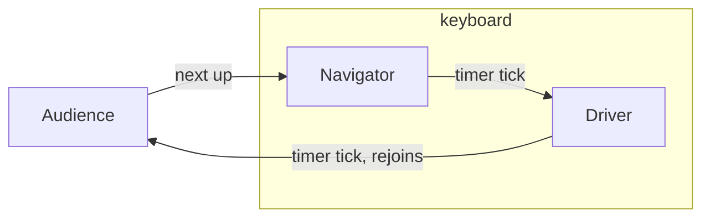

# Kata & Deliberate Practice — Middle

> **Category:** [Craftsmanship Disciplines](../README.md) — practice programming on purpose, on safe throwaway problems, the way a musician practices scales.

---

## Introduction

> Focus: **How do I make practice actually improve me?** and **How do groups practice together?**

At the junior level you learned what a kata is and ran your first one. The risk now is the most common failure of practice: you keep doing katas, but you keep doing them *the same way*, so you stop improving. This is the difference between **playing** and **practicing**. Playing is fun and changes nothing. Practicing is uncomfortable and changes you.

This level is about converting reps into growth. The lever is **constraint** — artificial rules that block your default solution and force you down an unfamiliar path. It is also about **coding dojos**: the social formats that let a team practice together, give each other feedback, and make practice a habit rather than a New Year's resolution.

---

## Prerequisites

- **Required:** You have run at least one kata test-first (see [junior](junior.md)).
- **Required:** Comfortable with red-green-refactor and a fast test runner.
- **Helpful:** Familiarity with refactoring moves (extract method, rename, inline) — see [Refactoring as a Discipline](../03-refactoring-as-a-discipline/middle.md).
- **Helpful:** Some exposure to pairing — see [Pair & Mob Programming](../05-pair-and-mob-programming/junior.md).

---

## Deliberate Practice, Applied

Ericsson's principles become concrete when you turn each one into a session decision:

| Principle | What it means in a kata session |
|---|---|
| **Specific focus** | Before you start, name *one* skill: "smaller commits," "intention-revealing names," "no debugger, only tests." |
| **Just beyond comfort** | Choose a constraint that makes your usual solution *illegal*, so you must struggle. If it feels easy, the constraint is too weak. |
| **Immediate feedback** | Tests (red/green now), a pairing partner narrating what they see, a timer showing your pace. |
| **Repetition with variation** | Re-do the *same* kata, changing exactly one variable (language, constraint, clock, design) so you can attribute the difference. |
| **Reflection** | A 2-minute retro: did the focus skill get easier? What was the friction? What's next session's focus? |

The single most important mental move at this level: **stop measuring a session by whether you finished the kata, and start measuring it by whether the focus skill got smoother.** A kata you didn't finish but in which you nailed tiny steps was a *better* practice session than one you raced through on autopilot.

---

## Repeating a Kata With Constraints

A constraint is a self-imposed rule that removes your default tools, forcing you to discover new ones. The same kata under a new constraint is effectively a new exercise for your brain. Common, battle-tested constraints:

| Constraint | What it trains |
|---|---|
| **No mouse** | Keyboard fluency — navigation, refactoring shortcuts, test running. Removes the biggest source of friction in your editor. |
| **No `if` / no conditionals** | Polymorphism, lookup tables, the Null Object and other branch-removing patterns. |
| **No primitives across boundaries** ("Object Calisthenics") | Wrapping primitives in value types; richer domain models. |
| **Tiny steps only** | Never write more than one line before re-running tests. Trains true TDD discipline. |
| **Time-boxed (e.g., 25 min)** | Prioritization; recognizing the *minimum* design that satisfies the spec. |
| **No naming a variable twice** / **no comments** | Forcing names and structure to carry all the meaning. |
| **Delete-and-restart ("Kata Erase")** | Solve it, delete everything, solve again from scratch — builds the fluency that makes the solution feel inevitable. |
| **One assertion per test** | Test design discipline; small, focused tests. |
| **Functional only / no mutation** | Immutability and expression-oriented thinking — see Functional Programming. |

> **Object Calisthenics** (Jeff Bay) is a famous bundle of nine constraints — one level of indentation per method, no `else`, wrap all primitives, first-class collections, one dot per line, no abbreviations, small entities, max two instance variables, no getters/setters. Apply them to a kata and watch your default OO habits break in productive ways.

The discipline is to pick **one** constraint per session (two at most). Piling on five constraints at once produces paralysis, not learning — you can't tell which rule taught you what.

---

## The Transformation Priority Premise

The **Transformation Priority Premise** (TPP), from Robert C. Martin, is a more advanced TDD constraint worth practicing deliberately. The idea: as you make a failing test pass, you change code through small **transformations**, and these transformations have a *priority order* — prefer the simpler ones first.

A rough ordering, simplest to most complex:

```
({} → nil)            no code → return nothing
(nil → constant)      return nothing → return a constant
(constant → variable) constant → use an argument
(unconditional → if)  add a conditional
(scalar → array)      single value → collection
(statement → recursion)
(if → while)          add a loop
(expression → function)
(variable → assignment) change a value
```


---

## A Constrained String Calculator Walkthrough

The **String Calculator** (Roy Osherove) is the best second kata after FizzBuzz. Spec (first few stages):

> Write `add(string)` that:
> 1. returns `0` for an empty string,
> 2. returns the number for a single number,
> 3. returns the sum for two comma-separated numbers,
> 4. handles any amount of numbers,
> 5. allows new-lines between numbers as well as commas...

We'll practice it with the constraint **"tiny steps only — one transformation per green."** Watch how the design grows from nothing.

### Go, test-first, smallest transformations

```go
// add_test.go
func TestEmptyStringIsZero(t *testing.T) {
    if got := Add(""); got != 0 {            // RED: Add doesn't exist
        t.Fatalf("Add(%q) = %d, want 0", "", got)
    }
}
```

Simplest pass — the `(nil → constant)` transformation:

```go
func Add(s string) int { return 0 }          // GREEN, intentionally naive
```

Next test forces a single number — `(constant → variable)`:

```go
func TestSingleNumber(t *testing.T) {
    if got := Add("1"); got != 1 { t.Fatalf("got %d", got) }
}
```

```go
func Add(s string) int {
    if s == "" {
        return 0
    }
    n, _ := strconv.Atoi(s)                   // (unconditional → if), (constant → variable)
    return n
}
```

Next, two numbers — `(scalar → array)`:

```go
func TestTwoNumbers(t *testing.T) {
    if got := Add("1,2"); got != 3 { t.Fatalf("got %d", got) }
}
```

```go
func Add(s string) int {
    if s == "" {
        return 0
    }
    sum := 0
    for _, part := range strings.Split(s, ",") {  // (statement → loop)
        n, _ := strconv.Atoi(part)
        sum += n
    }
    return sum
}
```

Note that this generalized version *also* handles the single-number and empty cases. Once the loop is in, "any amount of numbers" needs **no new code** — you write the test and it is already green, which is itself a satisfying signal that your steps were well-sized.

Then the new-line delimiter — a `strings.NewReplacer("\n", ",")` or splitting on multiple separators — and so on through the kata's later stages (custom delimiters, negative-number errors). Each stage: red, smallest transformation to green, refactor.

> **The practice payoff:** by forcing one transformation per step, you experience the algorithm *assembling itself* from the tests. Then delete it and do it again with a *different* constraint — say "no mutation, fold the list" — and you'll discover an entirely different shape for the same problem.

---

## Coding Dojos and Their Formats

A **coding dojo** is a recurring meeting where a group practices a kata together. The name and concept were popularized by Laurent Bossavit and Emmanuel Gaillot; the canonical reference is Emily Bache's *The Coding Dojo Handbook*. The dojo turns solitary practice into a social, feedback-rich ritual — and makes it far more likely to actually happen, because it's on the calendar.

The two foundational formats:

| Format | How it works | Best for |
|---|---|---|
| **Prepared kata** | One person performs a kata they have rehearsed, narrating every decision; the audience watches and questions. | Demonstrating a technique cleanly; teaching TDD rhythm; conference talks. |
| **Randori kata** | The *whole group* solves one kata together on a shared screen, rotating who types every few minutes. Everyone contributes. | Group learning, building shared habits, surfacing different approaches. |

A typical dojo session:

1. **Choose** a kata and (ideally) a focus or constraint.
2. **Set up** a projector and one machine, tests-first.
3. **Practice** in the chosen format for a fixed time (often ~90 minutes for a dojo, vs. ~30 for solo).
4. **Retrospect** together: what did we learn, what surprised us, what to try next time.

The golden rule of a dojo: **the code must always work.** You never leave the keyboard with a red bar or broken build for the next person. This enforces small steps and makes the rotation smooth.

---

## The Randori Rotation

In a randori, control of the keyboard rotates so everyone participates. The standard structure is a **pair at the keyboard** — a *driver* (types) and a *navigator* (the most recent person to rotate off, who guides) — plus the audience. On each timer tick (commonly ~5–7 minutes), everyone shifts one seat: driver returns to the audience, navigator becomes driver, an audience member becomes navigator.



Rules that keep a randori productive:

- **Only the driver and navigator talk while the bar is red.** Once it's green, the audience may discuss. This stops backseat-driving from derailing a step.
- **The navigator states intent, not keystrokes** — "let's make a test for two numbers," not "type a semicolon." It's pairing, not dictation. (See [Pair & Mob Programming](../05-pair-and-mob-programming/middle.md).)
- **Always rotate on a green bar** if possible — never hand over a mess.
- **Respect the kata's design as it stands.** A new driver continues the group's approach rather than rewriting it; disagreements go to the retro.

A randori is the most efficient way to spread a habit across a team: everyone sees everyone else's keyboard tricks, test style, and refactoring instincts in one sitting.

---

## Picking a Kata for a Skill Gap

Deliberate practice means choosing the exercise that targets *your* weakness. Match the gap to the kata:

| If you want to practice... | Reach for... | Why |
|---|---|---|
| TDD rhythm, tiny steps | FizzBuzz, String Calculator, Prime Factors | Trivial domains; all attention on the red-green-refactor loop. |
| Letting an algorithm *emerge* | Prime Factors (with TPP) | The factoring algorithm assembles itself if your steps are small enough. |
| Refactoring legacy code safely | **Gilded Rose**, Tennis (refactor variant) | You're handed messy code + tests; practice characterization + refactoring, not greenfield. |
| Modeling a domain / state | Game of Life, Mars Rover, Bank Account | Rules and state transitions; practice clean modeling and command handling. |
| Mapping rules to data | Roman Numerals, Bowling | Lots of edge cases; practice expressing rules as tables/data, not nested ifs. |
| Immutability / FP style | Game of Life (pure), Roman Numerals (fold) | Naturally expressible without mutation. |
| Working with collections | Bowling, String Calculator | Folding/reducing sequences cleanly. |

> The skill you want determines the kata **and** the constraint. "Practice refactoring" → Gilded Rose with the rule "no behavior change, micro-commits." "Practice removing conditionals" → FizzBuzz with "no `if`." Always pair a kata with an intention.


---

## Best Practices

1. **One focus, one constraint per session.** More than two and you can't tell what taught you what.
2. **Make your default solution illegal.** A constraint that lets you do what you'd do anyway teaches nothing.
3. **Measure smoothness of the focus skill, not completion.** An unfinished, deliberate session beats a finished, mindless one.
4. **Re-do the same kata, varying one thing.** Variation is what generalizes the skill beyond one problem.
5. **In a dojo, never hand over a red bar.** Rotate on green; keep the build working.
6. **Navigator states intent, not keystrokes.** Practice articulating design, not dictating typing.
7. **Always end with a retro.** Name what got easier and the next focus.

---

## Common Mistakes

1. **Replaying your comfort zone.** Re-solving a kata the way you already can is exercise, not deliberate practice.
2. **Constraint soup.** Five rules at once causes paralysis and muddied feedback. Pick one.
3. **Optimizing for "finished."** Racing to a green suite on autopilot trains speed at your *current* skill, not a new one.
4. **A dojo with no focus.** Without a stated skill or constraint, a dojo becomes a casual code-along — pleasant, but not practice.
5. **Backseat-driving in a randori.** The audience chattering while the bar is red derails the driver. Talk on green.
6. **Never repeating.** A kata done once and abandoned is a sighting of a technique, not a learned skill.

---

## Tricky Points

- **A constraint is a teaching tool, not a production rule.** "No `if`" is absurd in real code; in a kata it forces you to *discover* polymorphism so you recognize when it's genuinely useful at work.
- **The Transformation Priority Premise is about *order*, not *banning* transformations.** You'll still write loops and conditionals — TPP just nudges you to reach for the simplest transformation a failing test allows, keeping steps small.
- **Randori ≠ mob programming, but they're cousins.** A randori rotates strictly on a timer to spread participation in a *learning* setting; mobbing optimizes for *delivering real work* together. The mechanics overlap — see [Pair & Mob Programming](../05-pair-and-mob-programming/senior.md).
- **The Gilded Rose is a kata about *not* writing new code.** Its whole lesson is refactoring under test coverage you build yourself. Treating it as a greenfield rewrite misses the point.

---

## Test Yourself

1. What distinguishes "playing" with katas from "practicing" with them?
2. Why pick only one constraint per session?
3. What is the Transformation Priority Premise and what does practicing it train?
4. Describe the rotation and the "talk only on green" rule in a randori.
5. Which kata would you choose to practice safe refactoring of legacy code, and with what constraint?

---

## Cheat Sheet

```
SESSION = one focus + one constraint + timer + retro
CONSTRAINTS  no-mouse · no-if · tiny-steps · time-box · no-mutation · object-calisthenics
TPP          when red, pick the SIMPLEST transformation that goes green
DOJO         prepared (one performs) | randori (group rotates the keyboard)
RANDORI      driver+navigator, rotate on a timer, talk only on GREEN
KATA↔GAP     refactor→Gilded Rose · emerge→Prime Factors · model→Game of Life
RULE         re-do the same kata, change ONE variable
```

---

## Summary

- The middle-level danger is doing katas *the same way forever* — playing, not practicing.
- **Constraints** (no-mouse, no-if, tiny-steps, time-box, Object Calisthenics) make your default solution illegal and force growth — one constraint per session.
- The **Transformation Priority Premise** orders code changes simplest-first, keeping steps tiny so algorithms *emerge*.
- A **coding dojo** practices a kata as a group: **prepared** (one performs) or **randori** (the group rotates the keyboard, rotating on green, talking only on green).
- **Pick the kata to fit your skill gap** and pair it with an intention — refactoring → Gilded Rose, emergence → Prime Factors, modeling → Game of Life.
- Measure a session by whether the *focus skill got smoother*, not by whether you finished.

---

## Further Reading

- Emily Bache, *The Coding Dojo Handbook* — formats, facilitation, kata catalog.
- Robert C. Martin, *The Transformation Priority Premise* (blog post, "8thlight").
- Jeff Bay, *Object Calisthenics* (in *ThoughtWorks Anthology*) — the nine constraints.
- Roy Osherove, *String Calculator kata* writeup.

---

## Related Topics

- **Previous:** [Kata & Deliberate Practice — Junior](junior.md)
- **Sibling disciplines:** [Three Laws of TDD](../01-the-three-laws-of-tdd/middle.md), [Refactoring as a Discipline](../03-refactoring-as-a-discipline/middle.md), [Pair & Mob Programming](../05-pair-and-mob-programming/middle.md).

---


---

## Check your understanding

1. Explain Kata & Deliberate Practice — Middle Level in your own words and name the problem it solves.
2. How would you apply the ideas around Table of Contents, Introduction, Prerequisites in a realistic engineering change?
3. What failure mode or misuse should you look for, and what evidence would reveal it?
4. Which local design trade-off would make you choose or reject Kata & Deliberate Practice — Middle Level in an existing codebase?
5. What observable result would convince you that the approach improved the system?
