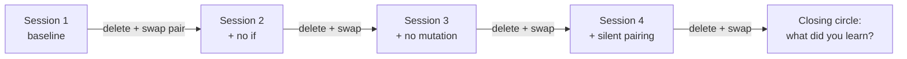

# Kata & Deliberate Practice — Professional

> **Category:** [Craftsmanship Disciplines](../README.md) — practice programming on purpose, on safe throwaway problems, the way a musician practices scales.

---

## Table of Contents

1. [Introduction](#introduction)
2. [Prerequisites](#prerequisites)
3. [Building a Practice Culture on a Team](#building-a-practice-culture-on-a-team)
4. [Running Dojos at Work](#running-dojos-at-work)
5. [Learning Hours and Protected Time](#learning-hours-and-protected-time)
6. [Mentoring Through Practice](#mentoring-through-practice)
7. [Measuring Growth (Without Gaming It)](#measuring-growth-without-gaming-it)
8. [Sustaining the Habit](#sustaining-the-habit)
9. [Conferences, Coderetreats, and the Global Day](#conferences-coderetreats-and-the-global-day)
10. [Best Practices](#best-practices)
11. [Common Mistakes](#common-mistakes)
12. [Tricky Points](#tricky-points)
13. [Test Yourself](#test-yourself)
14. [Cheat Sheet](#cheat-sheet)
15. [Summary](#summary)
16. [Further Reading](#further-reading)
17. [Related Topics](#related-topics)

---

## Introduction

> Focus: **How do I make practice a sustained team and organizational habit?**

A personal practice habit is a private good. At the professional level the question changes: how do you make deliberate practice part of how a *team* and an *organization* operate — so that improvement is systemic, not dependent on a few self-motivated individuals? This is a leadership and culture problem at least as much as a technical one. Most "we should do katas" initiatives die in three weeks because nobody protected the time, nobody owned the ritual, or it felt like a mandatory chore.

This level covers building a durable practice culture, running dojos and learning hours at work, mentoring through practice, measuring growth honestly, sustaining the habit against the gravity of delivery pressure, and plugging into the wider community through coderetreats and the Global Day of Coderetreat.

---

## Prerequisites

- **Required:** A solid personal practice habit and the ability to lead a kata session (see [senior](senior.md)).
- **Required:** Enough organizational standing or trust to ask for protected time.
- **Helpful:** Experience facilitating retros and mentoring.

---

## Building a Practice Culture on a Team

A practice culture is one where it is **normal, expected, and safe** to spend some time getting better rather than only shipping. Building it is mostly about removing the reasons people don't practice:

| Barrier | What kills it |
|---|---|
| "There's no time." | **Protected, recurring time** on the calendar that delivery cannot quietly eat. |
| "It feels like extra work." | Make it *social and enjoyable* — a dojo with snacks beats a solo homework assignment. |
| "I'll look slow/dumb in front of peers." | **Psychological safety**: leaders model being slow and wrong; the keyboard is never a judgment seat. |
| "Nobody owns it." | A named **facilitator/rotation** so it doesn't depend on one person's enthusiasm. |
| "Management thinks it's slacking." | **Frame and defend it** to leadership as a capability investment with concrete payoffs. |

The decisive factors are **safety** and **protected time**. Without safety, people perform instead of practice and learn little. Without protected time, practice is always the first thing sacrificed to the sprint. A senior or lead who secures both has done 80% of the work; the kata mechanics are the easy part.

> **Make it a ritual, not a campaign.** Campaigns ("Q3 is our learning quarter!") spike and fade. A modest, *recurring* ritual — every Friday at 3pm, a 90-minute dojo, same room, same facilitator rotation — compounds. Consistency beats intensity.

---

## Running Dojos at Work

A workplace dojo is the same format from [middle](middle.md) (prepared or randori), adapted to a professional setting:

- **Cadence:** weekly or biweekly, fixed slot, ~60–90 minutes. Predictability is what makes it stick.
- **Facilitation rotation:** rotate the facilitator so it's not one person's burden and more people build the leading skill.
- **Mixed seniority is a feature.** Juniors see seniors' keyboard habits and test instincts live; seniors articulate tacit knowledge they'd never write down. The randori format spreads habits across the whole experience range in one sitting.
- **Use katas relevant to your stack and pains.** If the team struggles with testing legacy code, run Gilded Rose and the refactoring katas; if they over-engineer, run design katas under a Simple Design constraint. Tie practice to the team's actual weaknesses.
- **Occasionally practice on a *sanitized* slice of the real domain.** A carefully extracted, anonymized version of a gnarly internal module can be a powerful dojo subject — but keep it disposable and keep it *practice*, never sneaking production work in under the dojo banner.

The same rules as ever: green rotation, talk-on-green, strict timer, always a retro. The retro is doubly valuable at work because it surfaces shared conventions ("we all name tests differently — let's pick one") that flow straight back into the production codebase.

---

## Learning Hours and Protected Time

Several craft-focused organizations institutionalize practice with explicit **learning hours** — protected, recurring blocks where engineers are *expected* to learn rather than deliver. Common patterns:

- **Weekly learning hour / dojo slot** — a fixed team block (e.g., Friday afternoon) for a dojo, a kata, or a study group.
- **The 20%-time tradition** — a fraction of time for self-directed learning and experimentation. (Famous, frequently eroded; protect it explicitly or it evaporates.)
- **Personal practice expectation** — the *Clean Coder* stance (Robert C. Martin): your employer pays for a day's work; keeping your *skills* sharp is partly your own professional responsibility, practiced on your own time, like a doctor staying current. The honest professional position is **both/and** — the team invests *some* time, and individuals invest *some* of their own.
- **Onboarding via katas** — new hires do a few team katas to absorb conventions and the testing style before touching production code.

The recurring failure mode is that protected time is *nominally* protected but practically raided whenever a deadline looms. The defense is leadership backing: practice time has to be as real as a standing meeting, with someone willing to say no when delivery tries to eat it. Treat the erosion of learning time as a leading indicator of long-term capability decay — because that is exactly what it is.

---

## Mentoring Through Practice

Katas are one of the best mentoring vehicles in existence, because they make the *invisible* parts of expertise visible:

- **Pair on a kata with a junior.** They see how you take small steps, how you name, when you refactor, how you back out of a dead end calmly. None of this is in any documentation; it only transmits by observation. (See [Pair & Mob Programming](../05-pair-and-mob-programming/senior.md).)
- **Mentor narrates the *why*.** "I'm writing the test for the empty case first because it's the simplest behavior" teaches reasoning, not just keystrokes.
- **Let the mentee drive on a known kata.** With a familiar problem, the mentee's attention is free for the discipline you're coaching, and you can intervene on process without the domain getting in the way.
- **The prepared kata as a teaching set-piece.** A senior performing a kata cleanly, narrating decisions, is a high-bandwidth way to demonstrate TDD rhythm or a refactoring sequence to a whole team at once.
- **Reverse it.** Have a junior teach you a kata they've practiced — teaching is the deepest practice, and it builds their confidence.

The mentoring power of katas is precisely that the problem is *trivial and shared*, so all the bandwidth goes to transmitting craft, not explaining requirements.

---

## Measuring Growth (Without Gaming It)

"What gets measured gets managed" cuts both ways: measure practice badly and you'll get gaming (kata-completion theater) instead of growth. Practice growth is real but slippery; measure it with humility:

**Reasonable signals (leading, qualitative):**
- The *focus skill* getting smoother session over session (from practice logs / retros).
- Review comments on a class of issue (e.g., poor test names, huge commits) declining over time.
- Engineers reaching for a technique unprompted in real work — the only true proof of *transfer*.
- Dojo attendance and energy sustaining itself (a culture signal).

**Dangerous metrics (avoid as targets):**
- **Number of katas done** — pure activity, trivially gamed, says nothing about learning.
- **Hours practiced** — the "10,000 hours" error in miniature; quantity isn't quality.
- **Speed on a known kata** — rewards memorization, the opposite of deliberate practice.

> Apply **Goodhart's Law**: the moment a practice metric becomes a target, it stops measuring practice. Use metrics as *conversation starters in retros*, never as KPIs. The honest measure of a practice culture is whether craft in the *production* codebase is improving — cleaner tests, smaller PRs, less fear of refactoring — and whether engineers visibly enjoy getting better.

---

## Sustaining the Habit

Most practice initiatives die from neglect, not failure. Sustaining them:

1. **Make it recurring and owned.** A calendar ritual with a rotating owner survives individual motivation dips. Heroic enthusiasm always fades; a ritual doesn't.
2. **Keep sessions short and frequent.** A reliable weekly 60-minute dojo beats an ambitious monthly half-day that keeps getting cancelled.
3. **Lower the activation energy.** Pre-set the room, the kata, the repo. The harder it is to start, the sooner it dies.
4. **Vary to keep it fresh.** Rotate katas, formats (prepared/randori/mob), constraints, and languages so it doesn't become stale repetition.
5. **Protect it visibly.** When a leader defends practice time against a deadline *once*, in public, the whole team learns it's real.
6. **Celebrate learning, not output.** Share "here's a technique I picked up" in the retro. Reward the growth, since there's no shipped artifact to reward.
7. **Plug into the community.** External events (below) re-energize a flagging internal habit and import fresh ideas.

The deepest sustainability lever is **intrinsic enjoyment**. People who experience getting better come back on their own. Your job as a leader is to engineer enough early, visible improvement that the habit becomes self-reinforcing.

---

## Conferences, Coderetreats, and the Global Day

Practice scales beyond the team through the wider craftsmanship community:

- **Coderetreat** — a full-day event, created by Corey Haines and others, dedicated entirely to practice. The format is iconic: you do the **same kata (almost always Conway's Game of Life) all day, in ~45-minute sessions**, and **delete your code and switch pairs after every session**. Each round adds a constraint (no `if`, no mutation, no naming, no return values, ping-pong pairing, silent pairing...). Deleting the code each time enforces that the value is the *learning*, not the artifact, and re-doing the same problem under escalating constraints is deliberate practice in its purest organized form.
- **Global Day of Coderetreat (GDCR)** — one day each year (typically November) when coderetreats run simultaneously around the world, often video-linking sites. A superb way to inject energy and connect your team to the global community.
- **Conference workshops, code jams, hack/learn days** — many conferences (SoCraTes, Agile, language confs) run kata and dojo sessions. SoCraTes-style **open-space unconferences** are practice-and-discussion-centric by design.
- **Internal coderetreats / hack days** — you can run the coderetreat format inside your own company as a quarterly event; it's a high-energy way to refresh the culture and onboard the format to new people.




---

## Best Practices

1. **Secure psychological safety and protected time first** — they're 80% of a practice culture; mechanics are the easy 20%.
2. **Make practice a recurring, owned ritual,** not a campaign that spikes and fades.
3. **Run mixed-seniority dojos** so habits transmit in both directions; always retro to feed conventions back into production.
4. **Mentor through katas** — pair on a known problem so all bandwidth goes to transmitting craft.
5. **Measure with leading, qualitative signals;** never make kata-count or hours a target (Goodhart).
6. **Defend learning time visibly** against delivery pressure — once in public teaches the whole team it's real.
7. **Connect to the community** — coderetreats and GDCR re-energize and refresh the internal habit.

---

## Common Mistakes

1. **Mandating practice without safety.** People perform instead of practice and resent it; nothing is learned.
2. **Leaving learning time "protected" only nominally.** It gets raided every deadline; the message is that it doesn't matter.
3. **Running it as a one-person campaign.** When that person burns out or leaves, the habit dies. Rotate ownership.
4. **Measuring activity (katas done, hours).** Invites gaming and rewards the opposite of deliberate practice.
5. **Letting dojos become stale.** Same kata, same format, forever — it turns into a chore. Vary deliberately.
6. **Smuggling production work into a dojo.** It destroys the safe-to-fail premise and the practice value. Keep practice disposable.

---

## Tricky Points

- **Whose time is practice on?** The mature answer is *both* the team's and the individual's. Insisting it's purely the employer's makes it fragile to deadlines; insisting it's purely the individual's (the strict *Clean Coder* line) lets organizations off the hook for capability investment. A healthy culture shares the cost.
- **Coderetreat's "delete your code" rule feels wasteful and is the entire point.** Removing the artifact forces attention onto the learning and onto *how* you work, and removes the sunk-cost attachment that blocks experimentation.
- **A practice metric becomes useless the instant it's a target (Goodhart).** The honest gauge of a practice culture is improvement in the *production* codebase and visible engineer enjoyment — not any practice-side number.
- **Mixed-seniority dojos can intimidate juniors** if safety is weak. The facilitator must actively model fallibility and protect the slow, so juniors will risk being seen struggling.
- **The Global Day of Coderetreat is a culture multiplier, not a training course.** Its value is energy, connection, and renewed habit — measure it as morale and momentum, not as skills delivered.

---

## Test Yourself

1. What are the two decisive factors in building a team practice culture, and why?
2. Why prefer a small recurring ritual over a "learning quarter" campaign?
3. Why are katas an unusually good mentoring vehicle?
4. Name two practice metrics that invite gaming and explain the underlying law.
5. Describe the coderetreat format and why deleting the code each round matters.

---

## Cheat Sheet

```
CULTURE = psychological safety + protected time (+ owned recurring ritual)
DOJO @ WORK   weekly fixed slot · rotate facilitator · mixed seniority · always retro
LEARNING TIME  protect it VISIBLY; erosion = leading indicator of capability decay
MENTOR        pair on a KNOWN kata · narrate the WHY · let the junior drive
MEASURE       leading/qualitative signals only — never kata-count/hours (Goodhart)
SUSTAIN       short+frequent · low activation energy · vary · celebrate learning
COMMUNITY     Coderetreat (Game of Life, delete+swap each round) · Global Day (Nov)
```

---

## Summary

- A team **practice culture** rests on **psychological safety** and **protected time**, run as an **owned, recurring ritual** — not a campaign.
- **Workplace dojos** with mixed seniority spread habits both ways; retros feed conventions back into production.
- **Learning hours** must be *really* protected and visibly defended; whose time it is, is honestly *both* the org's and the individual's.
- **Mentor through katas** — a trivial shared problem transmits the invisible craft that no document can.
- **Measure with qualitative leading signals,** never kata-count or hours (Goodhart); the real gauge is the production codebase improving.
- **Sustain** with short frequent sessions, low activation energy, variation, and celebrating learning over output.
- **Coderetreats** (same kata all day — usually **Game of Life** — delete and swap each round) and the **Global Day of Coderetreat** connect and re-energize the habit.

---

## Further Reading

- Robert C. Martin, *The Clean Coder* — professional responsibility for practice.
- Corey Haines, *Understanding the Four Rules of Simple Design* (born from coderetreat practice).
- coderetreat.org and the Global Day of Coderetreat site.
- Emily Bache, *The Coding Dojo Handbook* — facilitation at work.

---

## Related Topics

- **Previous:** [Kata & Deliberate Practice — Senior](senior.md)
- **Sibling disciplines:** [Pair & Mob Programming](../05-pair-and-mob-programming/professional.md), [Refactoring as a Discipline](../03-refactoring-as-a-discipline/professional.md), [The Craftsman's Ethics & Oath](../08-the-craftsmans-ethics-and-oath/junior.md).

---


---

## Check your understanding

1. Explain Kata & Deliberate Practice — Professional Level in your own words and name the problem it solves.
2. How would you apply the ideas around Table of Contents, Introduction, Prerequisites in a realistic engineering change?
3. What failure mode or misuse should you look for, and what evidence would reveal it?
4. How would you introduce and govern Kata & Deliberate Practice — Professional Level across teams through reversible, measurable increments?
5. What observable result would convince you that the approach improved the system?
