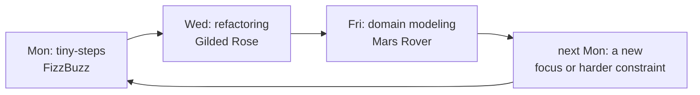

# Kata & Deliberate Practice — Senior

> **Category:** [Craftsmanship Disciplines](../README.md) — practice programming on purpose, on safe throwaway problems, the way a musician practices scales.

---

## Table of Contents

1. [Introduction](#introduction)
2. [Prerequisites](#prerequisites)
3. [The Science of Expertise](#the-science-of-expertise)
4. [The 10,000-Hours Myth](#the-10000-hours-myth)
5. [Designing Your Own Practice Regimen](#designing-your-own-practice-regimen)
6. [Practicing Design and Refactoring, Not Just Algorithms](#practicing-design-and-refactoring-not-just-algorithms)
7. [Plateaus and How to Break Them](#plateaus-and-how-to-break-them)
8. [Transfer: Making Practice Show Up at Work](#transfer-making-practice-show-up-at-work)
9. [Leading a Dojo](#leading-a-dojo)
10. [Best Practices](#best-practices)
11. [Common Mistakes](#common-mistakes)
12. [Tricky Points](#tricky-points)
13. [Test Yourself](#test-yourself)
14. [Cheat Sheet](#cheat-sheet)
15. [Summary](#summary)
16. [Further Reading](#further-reading)
17. [Related Topics](#related-topics)

---

## Introduction

> Focus: **Why does practice work?**, **How do I design practice for myself?**, and **How do I lead others?**

A senior engineer has usually noticed an uncomfortable fact: years of experience does not equal years of improvement. There are programmers with fifteen years who are, functionally, the same engineer they were at year three — they have *one year of experience, repeated fifteen times*. The thing that separates the engineers who keep getting sharper is not more hours at the keyboard. It is **deliberate practice**, and understanding *why* it works lets you design it for yourself and lead it for your team.

This level covers the cognitive science behind expertise, how to build a personal regimen that targets your real weaknesses, how to practice the hard-to-drill skills (design and refactoring, not just algorithms), how to push through plateaus, how to make practice actually *transfer* to production work, and how to facilitate a dojo well.

---

## Prerequisites

- **Required:** A regular personal kata habit (see [middle](middle.md)).
- **Required:** Fluency with refactoring and TDD as disciplines, not just techniques.
- **Helpful:** Some experience facilitating or pairing — see [Pair & Mob Programming](../05-pair-and-mob-programming/senior.md).

---

## The Science of Expertise

The foundational research is Anders Ericsson's. Studying violinists, chess masters, athletes, and surgeons, he found that elite performers were not distinguished by talent or by raw practice time, but by the *kind* of practice they did. He named it **deliberate practice**, with several defining features:

| Feature | Why it matters for code |
|---|---|
| **A well-defined, specific goal** | "Get better" is useless. "Make my test names describe behavior, not methods" is trainable. |
| **Full concentration & effort** | Practice on autopilot doesn't rewire anything. You must be mentally present and slightly strained. |
| **Immediate, informative feedback** | You need to know *now* whether you did it right (tests, a coach, a recording of yourself). |
| **Operating outside the comfort zone** | Skill grows at the edge of failure. If it feels comfortable, you're maintaining, not building. |
| **Built on existing mental representations** | Experts hold rich internal models ("chunks") that let them see patterns novices can't. Practice grows these models. |

That last point is the deep one. Ericsson's central concept is the **mental representation**: an expert chess player doesn't see 32 pieces, they see a handful of meaningful patterns. An expert programmer doesn't see 200 lines, they see "a strategy pattern with a leaky abstraction here." Deliberate practice works by **building and refining these representations** — and katas, repeated with variation and reflection, are a way to manufacture the focused, feedback-rich reps that grow them.

The corollary: practice that doesn't engage and stretch your mental models — mindless reps, comfortable re-solving — does almost nothing, no matter how many hours you log.

---

## The 10,000-Hours Myth

Malcolm Gladwell's *Outliers* popularized "10,000 hours" as the magic number for mastery, citing Ericsson's research. Ericsson spent years publicly correcting the distortion. The myth fails in three ways:

1. **It's about quality, not quantity.** Ericsson's data was about *deliberate* practice hours, not total hours. Ten thousand hours of mindless repetition makes you a ten-thousand-hour amateur. The hours must be focused, feedback-driven, and stretching.
2. **There is no universal number.** The hours-to-elite varied enormously by domain and individual. 10,000 was a rough average for one study of violinists, not a law.
3. **It ignored that the *best* did MORE and BETTER practice.** Even among elite violinists, the top tier had accumulated more deliberate practice than the merely good — the differentiator was still the *deliberate* practice, all the way up.

The actionable senior takeaway: **stop counting hours and start auditing quality.** Ask of any practice — *Is it focused on a specific weakness? Is feedback immediate? Am I stretched past comfort? Am I reflecting?* If the answer is no, the hours are nearly wasted, and adding more won't help. This is why a senior with a thoughtful 20-minute daily kata habit can outpace someone grinding LeetCode for hours on autopilot.

---

## Designing Your Own Practice Regimen

A senior doesn't just *do* katas; they run a deliberate program against their own weaknesses. A workable framework:

### 1. Diagnose your weaknesses honestly

You can't practice deliberately without a target. Find your weak spots from real signals: code-review comments you keep getting, the parts of work that feel slow or anxious, techniques you avoid because you're not confident in them. Common senior gaps: keeping refactoring steps small under pressure, designing without over-engineering, writing tests that don't couple to implementation, modeling a domain cleanly.

### 2. Map each weakness to a kata + constraint

Use the matrix from [middle](middle.md), but at this level you'll often *invent* the constraint to hit your specific gap. Weak at small refactoring steps under pressure? Gilded Rose, time-boxed, "commit on every green, never break the build." Over-engineering? Any kata with "you may not add an abstraction until the third duplication" ([Simple Design](../04-simple-design/junior.md) discipline).

### 3. Cycle, don't grind

Rotate focuses across sessions so you build breadth and don't burn out on one weakness:



### 4. Instrument and reflect

Keep a lightweight practice log: date, kata, focus, what got easier, next focus. Over weeks, the log *is* your feedback on the regimen itself — it shows whether a weakness is actually closing.

### 5. Vary the dimensions

The same kata across **language**, **constraint**, **time-box**, and **design approach** is four practice variables. A senior consciously varies them so the underlying skill generalizes rather than fossilizing into one memorized solution.

---

## Practicing Design and Refactoring, Not Just Algorithms

Most kata culture skews toward small algorithmic problems because they're easy to specify and test. But the skills that distinguish senior engineers — **design judgment** and **refactoring under pressure** — need their own practice, and the algorithm-heavy katas don't train them well. Three kinds of practice that do:

### Refactoring katas

The point is to *not* write new behavior. You're handed working-but-ugly code (with or without tests) and you improve its structure while keeping it green.

- **Gilded Rose** — the canonical refactoring kata. You inherit gnarly conditional logic and a vague spec; you build characterization tests, then refactor safely, then add a new requirement. It trains the entire legacy-code workflow: pin behavior, then change structure.
- **Tennis (refactoring variant)** — several pre-written messy implementations to clean up; great for practicing reading and untangling.
- **Trip Service / Theatrical Players Refund (Fowler)** — practice breaking dependencies and extracting seams.

### Design katas

Here the practice is *judgment*: what to model, what to defer, when an abstraction earns its keep. Mars Rover, Bank Account, and Game of Life have enough domain to make design choices real. Do them under a [Simple Design](../04-simple-design/junior.md) constraint — "passes tests, reveals intent, no duplication, fewest elements" — and the practice is explicitly about *restraint*, not cleverness.

### Practicing the *discipline*, not the *answer*

Crucially, when you've done a kata several times, the algorithm is no longer a challenge — which is exactly when it becomes a *good* design-practice vehicle, because all your attention is free to spend on the design. A senior re-doing Bowling for the tenth time isn't solving Bowling; they're practicing "can I express these rules with zero conditionals and intention-revealing names?" The known answer is a *feature*: it frees the mind for the meta-skill.

---

## Plateaus and How to Break Them

Skill growth is not linear. You improve fast, then stall on a **plateau** where more of the same practice yields nothing. Plateaus are the natural enemy of long-term improvement, and Ericsson's work explains both the cause and the cure.

**Cause:** you've automated a skill to "good enough," and your brain, efficient as ever, stops investing effort. Comfortable competence is a plateau.

**Cures:**

1. **Change the constraint.** Make your current solution illegal. If FizzBuzz is automatic, do it with no conditionals, then with no mutation, then under a 10-minute clock. Each new rule re-creates the just-past-comfort zone.
2. **Attack a different component.** A plateau is usually a *specific* sub-skill stalling. Break the skill into pieces (test naming, step size, refactoring choice) and drill the weakest piece in isolation.
3. **Get a coach / pair.** An outside observer sees the habit you can't. Pairing on a kata with someone better at your weak skill is the fastest plateau-breaker. (See [Pair & Mob Programming](../05-pair-and-mob-programming/senior.md).)
4. **Raise the difficulty of the problem.** Move from FizzBuzz to Bowling to Game of Life to a small interpreter — keep the *practiced skill* the same but increase the problem's demand on it.
5. **Slow down deliberately.** Plateaus often hide sloppiness that speed conceals. Forcing exaggerated care re-exposes the rough edges.

The general principle: **a plateau means your practice has drifted into your comfort zone.** Re-introduce productive difficulty and growth resumes.

---

## Transfer: Making Practice Show Up at Work

The hard truth about practice is **transfer**: a skill drilled in a kata doesn't automatically appear in production. You can be flawless at FizzBuzz-with-no-mouse and still mouse around aimlessly in your real codebase. Maximizing transfer is a senior concern.

What improves transfer:

- **Practice the skill, not the problem.** If your focus is "smaller commits," that transfers; if your focus is "memorize the Bowling solution," nothing transfers. Always name a *generalizable* skill.
- **Use realistic conditions.** Practice in your actual editor, your actual language, your actual test framework. Skills tied to a foreign environment transfer poorly.
- **Bridge consciously.** After a session, ask "where in current work could I have used this?" Naming the application primes you to reach for it.
- **Practice the meta-skills that are inherently transferable:** TDD rhythm, refactoring moves, naming, taking the next-smallest step, recognizing duplication. These are the same in every codebase, so they transfer almost completely.
- **Spaced repetition.** A skill practiced once decays. A skill revisited weekly becomes default behavior.

The most transferable practice of all is doing katas in the **exact disciplines you want to be automatic under deadline pressure** — because the whole reason to build a habit in the calm of practice is that habits, unlike deliberate choices, survive the stress of production.

---

## Leading a Dojo

Running a dojo well is a distinct skill from being good at katas. As facilitator your job is to maximize *everyone's* learning, not to show off your own:

- **Set a clear focus.** "Tonight we practice tiny steps" beats "tonight we do Bowling." Without a focus the dojo drifts into a code-along.
- **Protect psychological safety.** A dojo only works if people are willing to be slow and wrong in front of peers. Model fallibility yourself; never let the keyboard become a place of judgment. (This is the same dynamic as good [pairing](../05-pair-and-mob-programming/senior.md).)
- **Keep the build green and the rotation moving.** Enforce "rotate on green," "talk on green," and a strict timer so no one dominates.
- **Manage the loudest and the quietest.** Draw out reluctant participants; gently rein in the expert who wants to drive the whole session.
- **Time-box and always retro.** End with a group reflection: what did we learn, what surprised us, what to try next time. The retro is where the session converts to growth.
- **Vary formats.** Alternate prepared katas (you or a guest demonstrating a clean technique) with randori (everyone hands-on) to balance teaching with doing.

A senior who runs a good monthly dojo raises the whole team's floor faster than any amount of solo brilliance.

---

## Best Practices

1. **Audit practice *quality*, not hours.** Focused + feedback + stretch + reflection, or it barely counts.
2. **Diagnose real weaknesses from real signals** (review comments, slow/anxious work) and aim practice there.
3. **Practice design and refactoring deliberately,** not just algorithms — use a known kata so the mind is free for the meta-skill.
4. **Break plateaus by re-introducing difficulty** — new constraint, harder problem, a coach, deliberate slowness.
5. **Optimize for transfer:** practice generalizable skills in realistic conditions and consciously bridge to work.
6. **Lead dojos for everyone's learning** — clear focus, safety, green rotation, always a retro.

---

## Common Mistakes

1. **Counting hours.** Treating time-at-keyboard as progress; mindless reps plateau fast.
2. **Practicing only algorithm katas.** Neglecting the design/refactoring skills that actually distinguish seniors.
3. **Re-solving comfortable katas the comfortable way.** Maintenance disguised as practice; no stretch, no growth.
4. **Assuming automatic transfer.** Drilling in an unrealistic setting and being surprised it doesn't show up at work.
5. **Leading a dojo to perform.** Showing off instead of facilitating; the team learns less.
6. **No reflection.** Reps without a retro never compound into skill.

---

## Tricky Points

- **A *known* solution is an asset for design practice.** Once the algorithm is automatic, the kata stops being an algorithm problem and becomes a pure design/discipline drill — which is the higher-value use.
- **The "10,000 hours" claim is not what Ericsson found.** Repeat this when you hear it; quality of deliberate practice, not a magic number, is the finding. Misquoting it leads people to grind instead of focus.
- **Comfort is the signal of a plateau.** When practice feels easy and satisfying, you've likely stopped growing. Productive practice should feel slightly effortful and error-prone.
- **Transfer is the whole game, and it's not free.** The reason to build habits in calm practice is that *habits* — not conscious decisions — survive deadline stress. Practice the thing you want to be automatic when it's hard.
- **Talent exists, but it's not the lever you control.** Ericsson's point isn't that talent is a myth; it's that *deliberate practice* is the variable you can actually change, and it dominates outcomes over a career.

---

## Test Yourself

1. What is a "mental representation," and how does deliberate practice relate to it?
2. Give two reasons the "10,000 hours" rule is a misreading of the research.
3. Why is a kata whose answer you already know a *good* tool for practicing design?
4. What does a skill plateau indicate, and name two ways to break one.
5. What makes a practiced skill actually transfer to production work?

---

## Cheat Sheet

```
DELIBERATE = goal + concentration + immediate feedback + past comfort + grows mental models
MYTH        "10,000 hours" → it's QUALITY of deliberate practice, not a number
REGIMEN     diagnose weakness → kata+constraint → cycle focuses → log → vary dimensions
DESIGN/REFACTOR practice  use a KNOWN kata so the mind is free for the meta-skill
PLATEAU     comfort = stall → new constraint | harder problem | coach | slow down
TRANSFER    practice the SKILL not the problem · realistic conditions · bridge to work
DOJO LEAD   focus · safety · green rotation · always retro · vary formats
```

---

## Summary

- Expertise comes from **deliberate practice** (Ericsson): specific goal, full effort, immediate feedback, just-past-comfort, growing **mental representations** — not from hours alone.
- **"10,000 hours" is a misreading**: quality of deliberate practice, not a magic number, is the finding.
- Design your own **regimen**: diagnose real weaknesses, map each to a kata+constraint, cycle focuses, log, and vary language/constraint/clock/design.
- Deliberately practice **design and refactoring** (Gilded Rose, Mars Rover under Simple Design), using a *known* kata so attention is free for the meta-skill.
- **Plateaus** mean comfort — break them with new difficulty, a coach, or deliberate slowness.
- **Transfer isn't free:** practice generalizable skills in realistic conditions and bridge to work; build habits that survive deadline stress.
- **Leading a dojo** is about everyone's learning: clear focus, safety, green rotation, always a retro.

---

## Further Reading

- Anders Ericsson & Robert Pool, *Peak: Secrets from the New Science of Expertise*.
- K. Anders Ericsson et al., *The Role of Deliberate Practice in the Acquisition of Expert Performance* (1993, the foundational paper).
- Geoff Colvin, *Talent Is Overrated*.
- Martin Fowler, *Refactoring* (2nd ed.) — the refactoring moves you drill in refactoring katas.

---

## Related Topics

- **Previous:** [Kata & Deliberate Practice — Middle](middle.md)
- **Sibling disciplines:** [Refactoring as a Discipline](../03-refactoring-as-a-discipline/senior.md), [Simple Design](../04-simple-design/senior.md), [Pair & Mob Programming](../05-pair-and-mob-programming/senior.md).

---


---

## Check your understanding

1. Explain Kata & Deliberate Practice — Senior Level in your own words and name the problem it solves.
2. How would you apply the ideas around Table of Contents, Introduction, Prerequisites in a realistic engineering change?
3. What failure mode or misuse should you look for, and what evidence would reveal it?
4. How would you validate a system-level decision about Kata & Deliberate Practice — Senior Level under uncertainty?
5. What observable result would convince you that the approach improved the system?
