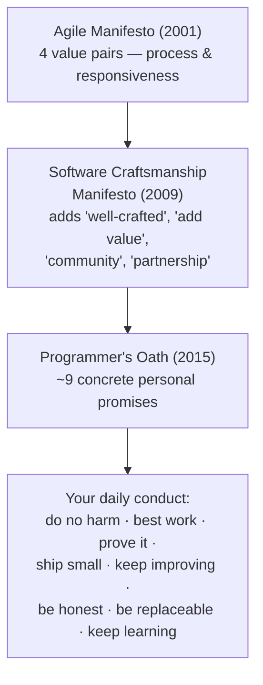
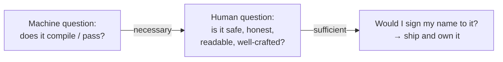

# The Craftsman's Ethics & Oath — Junior

> **Category:** [Craftsmanship Disciplines](../README.md) — the professional and ethical commitments that separate a software craftsman from someone who merely types code that compiles.

---

## Introduction

> Focus: **What is professional ethics for a developer?** and **Why does it exist?**

Most professions that can hurt people have an ethic. Doctors take the Hippocratic Oath. Engineers who build bridges sign their names to load calculations and can be struck off for negligence. Accountants and lawyers have codes of conduct with real teeth. Software, for most of its history, had none of this — and yet software now runs hospitals, cars, aircraft, elections, power grids, and the money supply. The code you write at a junior level today may, a few promotions from now, decide whether a radiation machine delivers a safe dose or a lethal one.

**Professional ethics for a developer** is the set of commitments you make about *how* you do the work — not just *whether* the feature ships. It is the difference between "the ticket is closed" and "I am willing to put my name on this." It answers questions a compiler never asks:

- Did I leave this code better or worse than I found it?
- Can someone else understand and safely change it tomorrow?
- Did I tell the truth about how long it would take and how risky it is?
- If this fails at 2 a.m. and hurts a user, did I do everything a careful professional would have done?

A compiler verifies that your code is *syntactically valid*. It says nothing about whether it is *correct*, *safe*, *honest*, or *maintainable*. Those are human commitments, and they are what this topic is about.

### The core claim

> A craftsman is not someone who writes clever code. A craftsman is someone who can be *trusted* — by teammates, by employers, and by the people whose lives the software touches.

Two documents try to write that trust down in concrete terms: Robert C. Martin's **Programmer's Oath** and the **Software Craftsmanship Manifesto**. The rest of this file introduces both, and the higher levels go deep into each promise, the trade-offs they create under pressure, and the real disasters that happen when the ethic is ignored.

---

## Prerequisites

- **Required:** Having written and shipped at least a small amount of real code that other people depend on. The ethic only makes sense once your work affects someone else.
- **Required:** Basic familiarity with what tests, code review, and version control are — these are the *tools* the ethic is enforced with.
- **Helpful:** A bug or outage you caused (or witnessed). Nothing teaches the value of professional discipline like having broken something in production.

---

## Glossary

| Term | Definition |
|------|-----------|
| **Professional ethics** | The standards of conduct expected of someone whose work affects others, beyond what is legally or contractually required. |
| **The Programmer's Oath** | Robert C. Martin's set of ~9 promises (2015) defining a programmer's professional obligations to their code, their team, and society. |
| **Software Craftsmanship Manifesto** | A 2009 statement extending the Agile Manifesto, raising the bar from "working software" to "well-crafted software." |
| **Agile Manifesto** | The 2001 statement of four value pairs that launched the modern software-process movement; the craftsmanship manifesto is its sequel. |
| **Craftsmanship** | The pursuit of high quality and continuous skill growth in software, treating programming as a skilled trade with standards. |
| **Technical debt** | The future cost incurred by choosing a quick, low-quality solution now; an ethical issue when hidden or denied. |
| **Saying no** | A professional's duty to refuse a request that is unsafe, dishonest, or impossible — respectfully but firmly. |
| **Doing no harm** | The baseline obligation: your code should not damage its users, its readers (other programmers), or society. |

---

## Core Concepts

### 1. Software is a profession that can cause harm

A profession, in the strict sense, is an occupation that (a) requires specialized skill, (b) holds a position of trust, and (c) can do serious damage when done badly. Software qualifies on all three. The moment your code can lose someone's money, leak their data, or — in safety-critical systems — injure them, you are not "just a coder." You hold a position of trust whether or not anyone made you sign anything.

### 2. The two audiences you serve

Every line of code answers to two audiences at once:

- **The machine**, which only needs the code to be valid and produce the right output.
- **The humans** — your teammates, your future self, the users — who need the code to be honest, safe, understandable, and changeable.

The compiler speaks for the first audience. The ethic speaks for the second. Junior developers tend to optimize only for the machine ("it works, ship it"). The whole arc of becoming a professional is learning to also optimize for the humans.

### 3. Ethics is mostly about pressure

It is easy to write careful code when you have all the time in the world. Ethics matters precisely when you *don't* — when the deadline is tomorrow, the manager is leaning on you, and the "fast" path is to skip the tests and ship the hack. The ethic is the answer to: *what do I do when doing the right thing is expensive?* The senior level is built around this question.

### 4. You are responsible for what you ship

"I was just following the ticket" is not a defense. A professional owns the outcome of their work. If you knew the code was untested and dangerous and you shipped it anyway because someone told you to, the harm is partly yours. This is the hardest and most important idea in the whole topic, and it is what the famous engineering disasters (covered at the senior level) ultimately turn on.

---

## The Programmer's Oath — A First Look

In 2015, Robert C. Martin ("Uncle Bob") proposed a **Programmer's Oath** — a deliberate echo of the Hippocratic Oath, written as a list of promises a professional programmer makes. You do not need to memorize the exact wording, but you should recognize the *shape* of each promise. Here they are in plain terms:

| # | The promise (paraphrased) | What it means day-to-day |
|---|---|---|
| 1 | I will not produce harmful code | Don't ship code you know can hurt users, society, or other programmers. |
| 2 | The code I produce will always be my best work | No deliberately sloppy work, ever — quality is not optional. |
| 3 | I will provide, with each release, a quick, sure, and repeatable proof that every element works | Automated tests, run on every release. |
| 4 | I will make frequent, small releases | Small batches so problems are caught and reversed cheaply. |
| 5 | I will fearlessly and relentlessly improve my creations | Refactor continuously; never let the code rot because you're afraid to touch it. |
| 6 | I will keep productivity — mine and my team's — as high as possible | Don't do anything that lowers the team's ability to deliver. |
| 7 | I will ensure others can cover for me, and I for them | Share knowledge; no indispensable heroes, no bus-factor-of-one. |
| 8 | I will produce estimates that are honest in magnitude and precision | No lying about how long things take, in either direction. |
| 9 | I will never stop learning and improving my craft | The field changes; a professional keeps up. |

A common framing splits these into two halves:

- **Promises 1–5 are about the code** — do no harm, do your best, prove it works, ship small, keep improving.
- **Promises 6–9 are about you and your team** — protect productivity, be replaceable, estimate honestly, keep learning.

> **A note on the Oath's status:** it is *not* an official, universally-adopted standard like the medical oath. It is one influential person's attempt to articulate the profession's duties. Treat it as a thoughtful checklist, not law. The middle level examines each promise — and its limits — in detail.

---

## The Software Craftsmanship Manifesto — A First Look

In 2001, seventeen developers wrote the **Agile Manifesto**, which famously valued four things "over" four others (e.g., "individuals and interactions over processes and tools"). It changed the industry — but over the next decade, many teams adopted Agile *ceremonies* (standups, sprints, story points) while quietly abandoning the *quality* that made Agile work. You can do "Agile" and still ship a mountain of untested, unmaintainable code.

In 2009, in reaction to exactly that, a group of developers wrote the **Software Craftsmanship Manifesto**. It deliberately mirrors the Agile Manifesto's "X over Y" form, but adds a quality dimension. It says: *as aspiring craftsmen we are raising the bar by valuing...*

| Not only... | ...but also (what craftsmanship adds) |
|---|---|
| Working software | **Well-crafted software** |
| Responding to change | **Steadily adding value** |
| Individuals and interactions | **A community of professionals** |
| Customer collaboration | **Productive partnerships** |

The key word is **"not only."** The craftsmanship manifesto does not reject the left column — working software still matters enormously. It says working is the *floor*, not the *ceiling*. Software can run correctly today and still be a disaster to maintain, extend, or trust tomorrow. "Well-crafted" means it is *also* clean, tested, and built to be changed.

The middle level compares all four lines against their Agile ancestors in detail.

---

## Real-World Analogies

| Concept | Analogy |
|---|---|
| **The Programmer's Oath** | The Hippocratic Oath. A doctor's job is not "the patient left the building" — it's "first, do no harm." A programmer's is not "the build is green" — it's "this code is safe and honest." |
| **"Working software is not enough"** | A house that has electricity and running water but wiring buried in the walls that will start a fire in two years. It *works* on move-in day. It is not *well-built*. |
| **Saying no** | A structural engineer who refuses to sign off on a bridge with too-thin beams, no matter how angry the developer (the property kind) gets. The refusal is the profession doing its job. |
| **Technical debt** | A loan. Useful when taken consciously and paid back; ruinous when hidden, denied, and left to compound until the system collapses under the interest. |
| **Replaceability (promise 7)** | A restaurant where any cook can run the line tonight because the recipes are written down — versus one that closes when the one chef who "knows everything" is sick. |

---

## Mental Models

**The intuition:** *"Would I sign my name to this, knowing I might have to defend it after it fails?"*

```
A FEATURE REQUEST ARRIVES
        │
        ▼
  ┌───────────────────────────────────┐
  │  Does it work?      (the compiler) │  ← the machine's question
  └───────────────────────────────────┘
        │ yes
        ▼
  ┌───────────────────────────────────┐
  │  Is it well-crafted?               │  ← the human's question
  │   • tested / provable              │
  │   • safe (does no harm)            │
  │   • readable by the next person    │
  │   • honestly estimated & described │
  └───────────────────────────────────┘
        │ yes
        ▼
   SHIP, and own it.
```

The junior mind stops at the first box. The professional mind treats the first box as merely the entry ticket to the second.

---

## Why "It Compiles" Isn't Enough

This is the single most important idea for a junior to internalize. "It compiles" — or even "the tests pass on my machine" — is the *beginning* of professional responsibility, not the end. Consider everything a green build does **not** tell you:

- Whether the code is **correct** for inputs you didn't think to test.
- Whether it is **safe** — does it leak data, mishandle money, or fail dangerously?
- Whether the next person can **understand and change** it without breaking something.
- Whether you were **honest** about the time, cost, and risk when you took the work on.
- Whether you cut a corner that will become a **2 a.m. outage** for whoever is on call.

```
"It compiles"  ──────────►  necessary, not sufficient
"Tests pass"   ──────────►  better, still not the whole job
"I'd sign my   ──────────►  the professional bar
 name to it"
```

A craftsman treats the compiler and the test suite as *tools that catch a subset of mistakes*, not as a certificate of professional quality. The rest — safety, clarity, honesty, maintainability — only a human can vouch for, and vouching for it is what the ethic asks of you.

---

## Pros & Cons of Holding Yourself to an Ethic

| Pros | Cons (and the honest counter) |
|------|-------------------------------|
| You become **trusted** — the developer whose work doesn't need re-checking | Sometimes feels **slower** in the short term (the counter: it's faster across the life of the system) |
| Fewer 2 a.m. pages; defects caught before users see them | Can create **friction** with managers who want corners cut |
| Code others can safely change → the team moves faster | Requires the courage to **say no**, which is uncomfortable |
| Your reputation compounds across a whole career | The ethic gives you no cover if you apply it *self-righteously* — judgment still required |
| Protects you, ethically and sometimes legally, when things fail | No external body enforces it, so it relies on **personal integrity** |

The cons are real, but notice the pattern: every "con" is a *short-term* cost paying for a *long-term* gain. That trade-off — short-term pressure versus long-term integrity — is the heart of professional ethics, and the senior level is built entirely around navigating it.

---

## Best Practices

1. **Leave the code better than you found it** (the "Boy Scout Rule"). Every time you touch a file, make one small improvement. This is promise 5 in miniature.
2. **Never ship code you wouldn't sign your name to.** If you'd be embarrassed to defend it after a failure, it isn't done.
3. **Write the test.** A green test is the cheapest "proof it works" you can give a future maintainer — and it's promise 3 of the Oath.
4. **Tell the truth in estimates.** "I don't know yet" is honest; a confident number you don't believe is not.
5. **Ask "who could this hurt?"** before shipping anything that handles money, data, identity, or safety.
6. **Share what you know.** Document the weird parts; pair with a teammate. Don't become the single point of failure (promise 7).
7. **Keep learning deliberately.** The skills that made you hireable will be obsolete; treat learning as part of the job, not an extracurricular (promise 9). See [Kata & Deliberate Practice](../07-kata-and-deliberate-practice/junior.md).

---

## Common Mistakes

1. **Treating "done" as "it works on my machine."** The compiler is not your conscience.
2. **Hiding technical debt instead of naming it.** Cutting a corner is sometimes fine; *not telling anyone* you cut it is the ethical failure.
3. **Padding or shrinking estimates to please someone.** Both directions are lies; both blow up later.
4. **Confusing "following orders" with "not responsible."** If you wrote it, you own a share of what it does.
5. **Becoming the indispensable hero.** Being the only one who understands a system feels like job security; it's actually a liability you've inflicted on your team.
6. **Mistaking the ethic for a license to be self-righteous.** "I'm the only one with standards here" is usually wrong and always unhelpful. The ethic is about *your* conduct, applied with humility.
7. **Thinking ethics is for senior people.** The habits form at the junior level or they don't form at all.

---

## Test Yourself

1. What does the compiler verify, and what does it say nothing about?
2. Name the two audiences every line of code serves.
3. What is the Programmer's Oath, and roughly how many promises does it contain?
4. What is the one word that makes the Software Craftsmanship Manifesto a *raising* of the bar rather than a rejection of Agile?
5. Why is "I was just following the ticket" not an ethical defense?

---

## Summary

- **Professional ethics** for a developer is about *how* you do the work — safely, honestly, and maintainably — not just whether the feature ships.
- Software is a real **profession** that holds public trust and can cause real harm.
- The **Programmer's Oath** (~9 promises) and the **Software Craftsmanship Manifesto** (four "not only X but also Y" lines) are two attempts to write that trust down.
- The Oath splits into promises **about the code** (1–5) and promises **about you and your team** (6–9).
- The craftsmanship manifesto's key word is **"not only"** — working software is necessary but not sufficient.
- **"It compiles" is the entry ticket, not the finish line.** The professional bar is: *would I sign my name to this?*

---

## Further Reading

- Robert C. Martin, *The Clean Coder* — the foundational book on software professionalism.
- Robert C. Martin, "The Programmer's Oath" (blog post, 2015).
- The Software Craftsmanship Manifesto — [manifesto.softwarecraftsmanship.org](https://manifesto.softwarecraftsmanship.org).
- The Agile Manifesto — [agilemanifesto.org](https://agilemanifesto.org).
- Sandro Mancuso, *The Software Craftsman: Professionalism, Pragmatism, Pride*.

---

## Related Topics

- **The disciplines the ethic relies on:** [The Three Laws of TDD](../01-the-three-laws-of-tdd/junior.md) (promise 3, "prove it works"), [Simple Design](../04-simple-design/junior.md) (promise 2 & 5, best work and relentless improvement).
- **Knowledge-sharing in practice:** [Pair & Mob Programming](../05-pair-and-mob-programming/junior.md) (promise 7, others can cover for me).
- **Never stop learning:** [Kata & Deliberate Practice](../07-kata-and-deliberate-practice/junior.md) (promise 9).

---

## Diagrams

### The two manifestos, the one oath



### The professional bar




---

## Check your understanding

1. Explain The Craftsman's Ethics & Oath — Junior Level in your own words and name the problem it solves.
2. How would you apply the ideas around Table of Contents, Introduction, Prerequisites in a realistic engineering change?
3. What failure mode or misuse should you look for, and what evidence would reveal it?
4. What small example would prove that you can apply The Craftsman's Ethics & Oath — Junior Level correctly?
5. What observable result would convince you that the approach improved the system?
