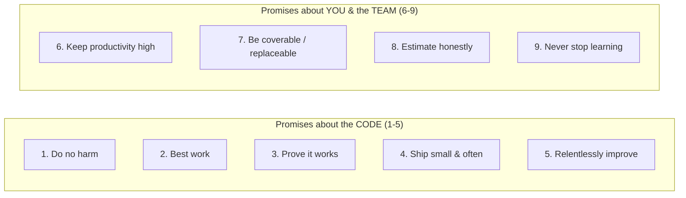
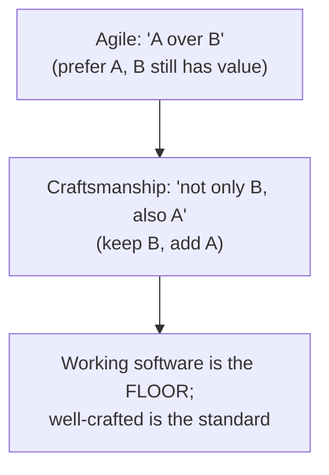
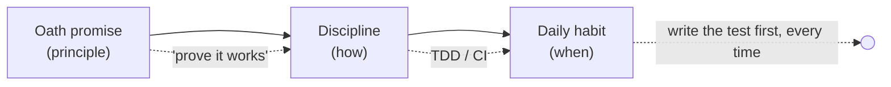
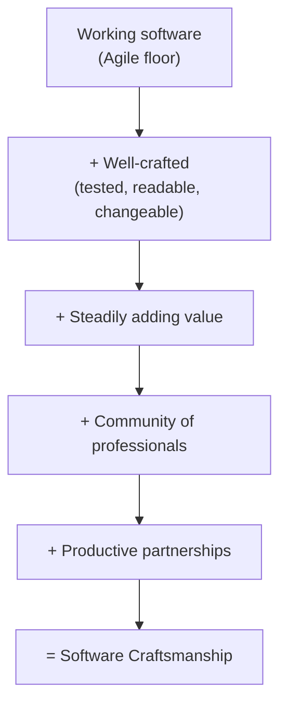

# The Craftsman's Ethics & Oath — Middle

> **Category:** [Craftsmanship Disciplines](../README.md) — the professional and ethical commitments that separate a software craftsman from someone who merely types code that compiles.

> **Prerequisite:** [Junior](junior.md)
> **Focus:** **What each promise actually means** and **how the manifestos relate**

---

## Introduction

> Focus: **Why** each promise exists and **when** it bites.

At the junior level the Oath was a list to recognize and the manifesto was a slogan to understand. At the middle level you treat each promise as a *concrete engineering practice with a cost and a reason*, and you can explain exactly how the Software Craftsmanship Manifesto extends — not replaces — the Agile Manifesto.

The recurring middle-level skill is **translating a principle into a practice**. "Do your best work" is a platitude until you can say: *it means a test for every behavior, a name that explains itself, and no commented-out code left in the file.* This file does that translation for all nine promises and all four manifesto lines.

---

## The Programmer's Oath, Promise by Promise

Robert C. Martin's Oath is usually rendered as nine numbered promises (some printings group them differently). Below is each one, what it *concretely* obligates you to do, and the practice or discipline that delivers it.

### Promise 1 — I will not produce harmful code

> *"I will not produce harmful code."*

The baseline, mirroring "first, do no harm." Harm here is broad: harm to **users** (a bug that loses their money or leaks their data), harm to **society** (software that deceives, discriminates, or endangers), and harm to **other programmers** (code so bad it sabotages the next person's work). The Oath explicitly counts bad code itself as a form of harm, because unmaintainable code damages everyone who must touch it.

**Practice:** threat-think before shipping anything touching money, identity, safety, or data. Ask *who could this hurt, and how?*

### Promise 2 — The code I produce will always be my best work

> *"I will not knowingly allow code that is defective either in behavior or structure to accumulate."*

Two kinds of defect: **behavioral** (it does the wrong thing) and **structural** (it's tangled, duplicated, badly named — it works but it rots). Crucially, the word is *knowingly*: you will make mistakes, but you will not *deliberately* let known rot pile up. This is the death of "I'll clean it up later" as an excuse.

**Practice:** the Boy Scout Rule, continuous refactoring, code review. See [Simple Design](../04-simple-design/junior.md).

### Promise 3 — I will provide a quick, sure, repeatable proof that every element works

> *"I will produce, with each release, a quick, sure, and repeatable proof that every element of the code works as it should."*

This is the promise that *forces* automated testing. "Quick" rules out manual QA as the only safety net; "sure" rules out flaky tests; "repeatable" rules out "it worked when I tried it." The phrase "every element" is demanding — it's the aspiration behind high test coverage and TDD.

**Practice:** automated tests, run on every release, ideally written test-first. See [The Three Laws of TDD](../01-the-three-laws-of-tdd/junior.md).

### Promise 4 — I will make frequent, small releases

> *"I will make frequent, small releases so that I do not impede the progress of others."*

Small batches are an ethical position, not just a process preference. A small release that breaks is **cheap to diagnose and reverse**; a giant quarterly release that breaks is a manhunt. Frequent integration also means you are never secretly diverging from your teammates for weeks.

**Practice:** continuous integration, small pull requests, trunk-based or short-lived branches, feature flags.

### Promise 5 — I will fearlessly and relentlessly improve my creations

> *"I will fearlessly and relentlessly improve my creations at every opportunity. I will never degrade them."*

The two halves matter. *Fearlessly* improve — and you can only refactor without fear if promise 3 (the test suite) is kept, because the tests catch you when a refactor breaks something. *Never degrade* — every change should leave the design at least as clean. Code that everyone is afraid to touch is a failure of this promise.

**Practice:** refactoring as a continuous discipline, backed by tests. See [Refactoring as a Discipline](../03-refactoring-as-a-discipline/junior.md).

### Promise 6 — I will keep productivity high

> *"I will do all that I can to keep the productivity of myself, and others, as high as possible. I will do nothing that decreases that productivity."*

This reframes the previous promises as a *team* obligation. Shipping a hack that slows everyone else down violates this even if it sped *you* up. So does breaking the build, leaving the CI pipeline red, or merging code that forces everyone to work around your mess.

**Practice:** keep the build green, keep the suite fast, keep shared code clean, don't optimize your output at the team's expense.

### Promise 7 — I will ensure others can cover for me, and I for them

> *"I will continuously ensure that others can cover for me, and that I can cover for them."*

The anti-hero promise. A bus factor of one — where one person is the only one who understands a system — is a liability you inflict on the team and the business. Being indispensable is not a virtue; it is a single point of failure with a salary.

**Practice:** knowledge-sharing, collective code ownership, documentation of the non-obvious, pairing. See [Pair & Mob Programming](../05-pair-and-mob-programming/junior.md).

### Promise 8 — I will produce estimates that are honest

> *"I will produce estimates that are honest both in magnitude and precision. I will not make promises without certainty."*

Estimation honesty cuts **both ways**. Padding an estimate to give yourself slack is dishonest; shrinking it to please a manager is dishonest. "Honest in precision" is subtle: if you genuinely don't know, the honest answer is a *range* or "I need to spike this first," not a confident single number you don't believe. A professional refuses to make a commitment they have no basis for keeping.

**Practice:** ranges over point estimates, "three-point" estimates (best/likely/worst), spikes for unknowns, and saying "I don't know yet" out loud.

### Promise 9 — I will never stop learning and improving my craft

> *"I will never stop learning and improving my craft."*

The half-life of a software skill is short. A professional treats continuous learning as part of the job description, not a hobby. This promise is what keeps the other eight alive as the field changes.

**Practice:** deliberate practice, katas, reading, conferences, learning from code review. See [Kata & Deliberate Practice](../07-kata-and-deliberate-practice/junior.md).

### A summary table

| # | Promise | Delivered by | Violated when you... |
|---|---|---|---|
| 1 | Do no harm | Threat-thinking, care | ship a known-dangerous feature |
| 2 | Best work, no defects allowed to accumulate | Refactoring, review | knowingly leave rot "for later" |
| 3 | Quick, sure, repeatable proof | Automated tests / TDD | ship with no tests and "hope" |
| 4 | Frequent small releases | CI, small PRs | sit on a giant branch for weeks |
| 5 | Fearlessly improve, never degrade | Refactoring + tests | leave code worse, or fear to touch it |
| 6 | Keep productivity high | Green build, clean shared code | speed yourself up by slowing the team |
| 7 | Others can cover for me | Knowledge sharing, pairing | hoard knowledge, become a hero |
| 8 | Honest estimates | Ranges, spikes, candor | pad or shrink to manage feelings |
| 9 | Never stop learning | Deliberate practice | coast on yesterday's skills |

---

## The Two Halves of the Oath

A useful way to remember the Oath is that it splits cleanly:

The first half is about the *artifact* you produce. The second half is about the *professional* you are. A surprising number of mid-career developers are strong on 1–5 and weak on 6–9 — they write clean, tested code but hoard knowledge, estimate to please, or stop learning. The Oath insists you owe both.

---

## The Craftsmanship Manifesto vs the Agile Manifesto

The Software Craftsmanship Manifesto (2009) is consciously built as a **second layer on top of** the Agile Manifesto (2001). Each craftsmanship line takes an Agile value and adds a quality dimension to it.

### The Agile Manifesto (for reference)

> We value:
> - Individuals and interactions **over** processes and tools
> - Working software **over** comprehensive documentation
> - Customer collaboration **over** contract negotiation
> - Responding to change **over** following a plan
>
> *That is, while there is value in the items on the right, we value the items on the left more.*

### The Craftsmanship Manifesto, mapped

> *Not only working software, but also well-crafted software.*
> *Not only responding to change, but also steadily adding value.*
> *Not only individuals and interactions, but also a community of professionals.*
> *Not only customer collaboration, but also productive partnerships.*

| Agile value (2001) | Craftsmanship extension (2009) | What the extension fixes |
|---|---|---|
| Working software | **Well-crafted software** | "Working" tolerated untested, unmaintainable code; craftsmanship demands quality *as well*. |
| Responding to change | **Steadily adding value** | Reacting to change isn't enough; you must consistently *improve* the product and the codebase, not just patch it. |
| Individuals and interactions | **A community of professionals** | Beyond a single team's interactions: mentor, share, raise the whole field's bar. |
| Customer collaboration | **Productive partnerships** | Don't just "collaborate"; build a genuine, mutually-accountable partnership where you advise honestly, including saying no. |

### The crucial structural difference

The Agile Manifesto uses **"over"** — it picks the left over the right, but explicitly says the right still has value. The Craftsmanship Manifesto uses **"not only … but also"** — it *keeps* the left and *adds* the right. It is purely additive.

This is the most-tested distinction at the middle level: **craftsmanship does not say "well-crafted instead of working."** It says "working is not enough on its own; also make it well-crafted." Working software remains essential — a beautiful codebase that doesn't solve the user's problem is still a failure.

---

## What "Well-Crafted" Actually Means

"Well-crafted" is the manifesto's central new word, so it deserves a concrete definition. A well-crafted system is one that is:

| Property | Concretely |
|---|---|
| **Correct** | It does what the user needs — working software is still the prerequisite. |
| **Tested** | Behavior is pinned by a fast, reliable, automated suite (Oath promise 3). |
| **Readable** | The next developer understands it without archaeology; names and structure tell the story. |
| **Changeable** | You can add a feature or fix a bug without fear, because the design and tests support it (promise 5). |
| **Simple** | No accidental complexity, no speculative generality, no dead code. See [Simple Design](../04-simple-design/junior.md). |
| **Honest** | The code does what it appears to do; no hidden surprises, no misleading abstractions. |

The litmus test: **a well-crafted system is one a stranger can safely change six months after you've left.** "Working" is a statement about today; "well-crafted" is a statement about every tomorrow. The gap between the two is exactly the technical debt you'll carry — and the senior level treats that debt as an ethical, not merely technical, issue.

---

## The Oath's Limits and Criticisms

A middle-level professional should hold the Oath thoughtfully, not religiously. Honest criticisms:

- **It is not officially adopted.** No licensing body backs it. It carries moral, not legal, weight. (The senior level discusses the ACM/IEEE codes, which *are* formally adopted.)
- **It can read as absolutist.** "Always my best work" and "never degrade" collide with real deadlines and triage. The mature reading is *aspirational direction*, not a rule that fails you on the first hotfix.
- **It centers the individual, not the system.** Many failures are *organizational* — the lone heroic programmer keeping the Oath inside a dysfunctional company can still be overruled. Ethics needs structural support, not just personal virtue.
- **"Do no harm" is hard to operationalize.** Harm is often diffuse and indirect (recommendation algorithms, surveillance). The Oath gives you the *obligation* to think about it, not an *answer*.

Holding these criticisms in mind is itself professional maturity: the Oath is a *compass*, not a *contract*. It points; it does not absolve.

---

## Putting the Promises Into Daily Practice

The promises become real only as habits. A concrete mapping:

- **Before you code:** Is this harmful? (1) Do I understand it well enough to estimate honestly? (8)
- **As you code:** Am I writing a test for this behavior? (3) Is this my best, or am I knowingly leaving rot? (2)
- **As you commit:** Is this a small, safe increment? (4) Did I leave it cleaner than I found it? (2, 5)
- **As you review others' code:** Am I helping keep team productivity and quality high? (6) Am I sharing knowledge both ways? (7)
- **Each week:** Did I learn something deliberately? (9) Is anyone (including me) becoming a single point of failure? (7)

---

## Trade-offs

| Dimension | Keeping the promise | Breaking it "just this once" |
|---|---|---|
| Promise 3 (tests) | Slower first commit, fast & safe forever after | Fast now; every future change is a gamble |
| Promise 4 (small releases) | More release ceremony, cheaper failures | Fewer releases, catastrophic failures |
| Promise 7 (coverability) | Time spent sharing, resilient team | "Indispensable" feeling, fragile team |
| Promise 8 (honest estimates) | Awkward conversations now | Comfortable now, broken trust at the deadline |

The pattern is identical across every row, and it is the central lesson of the topic: **the promise trades a small, visible, short-term cost for a large, invisible, long-term gain.** Breaking it does the reverse. Most professional failures are not malice — they are someone repeatedly choosing the comfortable short-term side of this table.

---

## Common Misreadings

1. **"Craftsmanship means gold-plating."** No. Promise 4 (small releases) and Simple Design both push *against* over-engineering. Well-crafted ≠ over-built.
2. **"The manifesto rejects Agile."** No — it's "not only … but also." It is additive; it keeps every Agile value.
3. **"Honest estimate means a precise estimate."** The opposite. Honesty about *precision* often means giving a *range* or admitting uncertainty.
4. **"Do no harm only applies to safety-critical code."** Harmful code includes unmaintainable code that harms the next programmer — promise 1 covers ordinary CRUD apps too.
5. **"The Oath is enforceable."** It is a personal commitment with moral weight, not a regulated standard.

---

## Best Practices

1. **Learn the promises as practices, not slogans.** Be able to name the discipline that delivers each one.
2. **Audit yourself on promises 6–9, not just 1–5.** Clean code is the easy half; being honest, replaceable, and still learning is the hard half.
3. **Use "not only … but also" as your craftsmanship test.** Did this change *add value* and stay *well-crafted*, not just respond to a ticket?
4. **Estimate in ranges with stated assumptions.** It is the most-violated promise and the easiest to fix.
5. **Hold the Oath as a compass, not a cudgel.** Apply it to your own conduct, with humility, not as a stick to beat colleagues with.

---

## Test Yourself

1. Which Oath promise forces automated testing, and what do its words "quick, sure, repeatable" each rule out?
2. Why is making frequent, small releases an *ethical* position and not just a process choice?
3. What is the structural difference between the Agile Manifesto's "over" and the Craftsmanship Manifesto's "not only … but also"?
4. Promise 8 says estimates must be honest "in magnitude and precision." What does honesty about *precision* actually require?
5. Give two legitimate criticisms of the Programmer's Oath.

---

## Summary

- Each Oath promise is a **concrete practice with a cost and a reason**, not a slogan — tests, small releases, refactoring, knowledge-sharing, honest estimates, continuous learning.
- The Oath splits into promises **about the code** (1–5) and **about you and your team** (6–9); most people are stronger on the first half.
- The Craftsmanship Manifesto extends Agile with **"not only … but also"** — it is **additive**, not a replacement; working software stays essential.
- **"Well-crafted"** means correct *and* tested, readable, changeable, simple, and honest — safely modifiable by a stranger after you're gone.
- The Oath is a **compass, not a contract**: aspirational, not officially enforced, and best held with humility.

---

## Diagrams

### From principle to practice

### Manifesto stack

---

## Check your understanding

1. Explain The Craftsman's Ethics & Oath — Middle Level in your own words and name the problem it solves.
2. How would you apply the ideas around Table of Contents, Introduction, The Programmer's Oath, Promise by Promise in a realistic engineering change?
3. What failure mode or misuse should you look for, and what evidence would reveal it?
4. Which local design trade-off would make you choose or reject The Craftsman's Ethics & Oath — Middle Level in an existing codebase?
5. What observable result would convince you that the approach improved the system?
