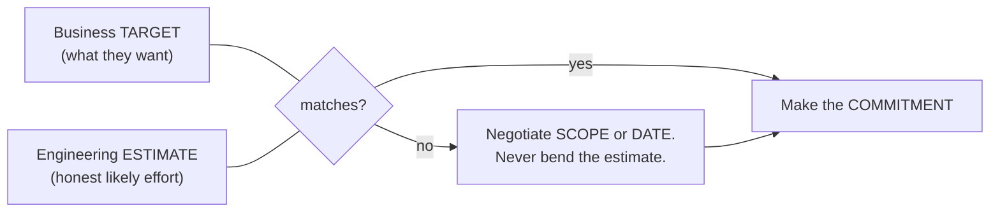
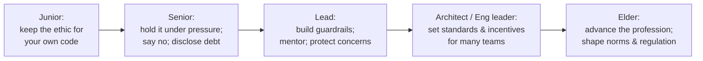
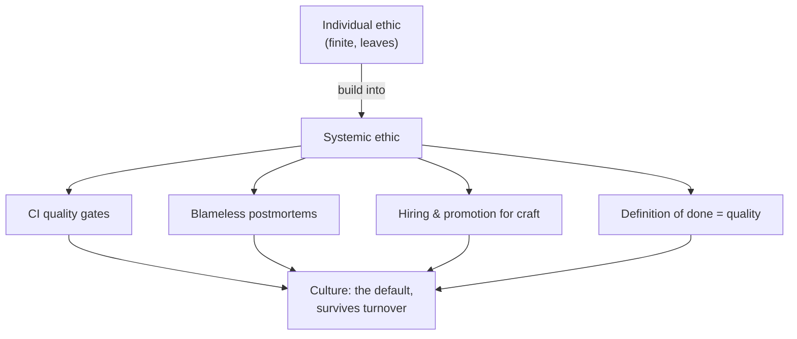
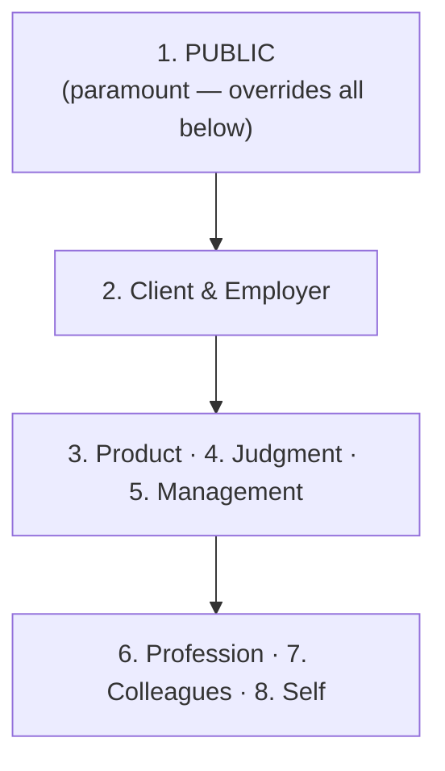

# The Craftsman's Ethics & Oath — Professional

> **Category:** [Craftsmanship Disciplines](../README.md) — the professional and ethical commitments that separate a software craftsman from someone who merely types code that compiles.

> **Prerequisites:** [Junior](junior.md) · [Middle](middle.md) · [Senior](senior.md)
> **Focus:** **Living the ethic on a team and as a leader** — culture, codes, estimation, mistakes, mentoring

---

## Table of Contents

1. [Introduction](#introduction)
2. [From Personal Virtue to Team Culture](#from-personal-virtue-to-team-culture)
3. [Formal Codes: ACM and IEEE](#formal-codes-acm-and-ieee)
4. [Estimation Honesty in Practice](#estimation-honesty-in-practice)
5. [Owning Mistakes & Blameless Culture](#owning-mistakes-blameless-culture)
6. [Mentoring Juniors Into the Ethic](#mentoring-juniors-into-the-ethic)
7. [Building a Craftsmanship Culture](#building-a-craftsmanship-culture)
8. [The Leader's Specific Duties](#the-leaders-specific-duties)
9. [Career-Long Responsibility](#career-long-responsibility)
10. [Anti-Patterns of Ethical Leadership](#anti-patterns-of-ethical-leadership)
11. [A Maturity Model](#a-maturity-model)
12. [Test Yourself](#test-yourself)
13. [Summary](#summary)
14. [Diagrams](#diagrams)

---

## Introduction

> Focus: the ethic stops being a thing *you* hold and becomes a thing the *team* and the *organization* hold.

The senior level was about keeping the ethic when it costs *you* something. The professional level is about a harder problem: **making the ethic survive at scale, across people who don't share your convictions, inside a system that pressures everyone toward shortcuts.** A lone craftsman in a corner-cutting org is, as the disasters showed, frequently overruled. The professional question is therefore structural: *how do you build an environment where doing the right thing is the path of least resistance?*

This shifts the leverage from personal heroics to **culture, process, and codes**. The most ethical thing a senior-plus engineer does is rarely a dramatic refusal; it is the quiet construction of guardrails — review standards, blameless postmortems, honest estimation practices, mentoring — that make the *next* engineer's right choice automatic.

---

## From Personal Virtue to Team Culture

There is a ceiling on individual integrity. You can write perfect code, estimate honestly, and refuse every bad order, and still ship a disaster if the system around you is broken — because software is built by teams, and one person's standards don't propagate by example alone.

The leverage shift:

| Individual contributor | Professional / leader |
|---|---|
| *I* write tested code | The team's **definition of done** requires tests, enforced in CI |
| *I* refuse to ship the hack | The **review standard** blocks the hack regardless of who wrote it |
| *I* estimate honestly | The team uses **ranges and spikes**; padding/shrinking isn't the norm |
| *I* own my mistakes | The org runs **blameless postmortems** so everyone can own mistakes safely |
| *I* keep learning | The team has **slack and rituals** (katas, brown-bags) for learning |

The deepest insight at this level: **ethics that depends on exceptional individuals will fail, because the supply of exceptional individuals is finite and they leave.** Ethics that is built into the system — the pipeline, the rituals, the codes, the incentives — survives turnover. The craftsman's job grows from "be ethical" to "make ethics the default."

---

## Formal Codes: ACM and IEEE

Unlike the Programmer's Oath (one person's proposal), the software field *does* have formally-adopted professional codes, and a professional should know they exist and what they emphasize.

### The ACM Code of Ethics and Professional Conduct (revised 2018)

The Association for Computing Machinery's code opens with general principles, the first of which is the strongest:

- **1.1 — Contribute to society and human well-being**, recognizing all people as stakeholders. It explicitly names the obligation to promote *fundamental human rights* and to consider those who are *not* the direct users (the public, the vulnerable).
- **1.2 — Avoid harm.** Mirrors Oath promise 1, but broader: harm includes negative consequences, especially when significant and unjust.
- **2.1 — Strive for high quality** in both process and product.
- **2.5 — Give comprehensive and thorough evaluations**, including honest analysis of risks — i.e., don't rubber-stamp.
- **2.9 — Design and build robust and usably *secure* systems.**

### The IEEE/ACM Software Engineering Code of Ethics (1999)

A joint code structured around **eight principles**, each naming a party the engineer owes a duty to:

| Principle | Duty to | Core idea |
|---|---|---|
| 1. Public | Society | Act consistently with the public interest — the *overriding* principle |
| 2. Client and Employer | Whoever pays | Act in their best interest, *consistent with* the public interest |
| 3. Product | The artifact | Meet the highest professional standards possible |
| 4. Judgment | Your integrity | Maintain independent, honest professional judgment |
| 5. Management | Your team's process | Promote an ethical approach to managing development |
| 6. Profession | The field | Advance the profession's integrity and reputation |
| 7. Colleagues | Peers | Be fair to and supportive of colleagues |
| 8. Self | You | Lifelong learning and ethical practice |

The structurally important point: **principle 1 (the public) is explicitly *paramount* and overrides principle 2 (the employer).** That is the formal, profession-wide answer to the Dieselgate and 737 MAX situations: when your employer's interest conflicts with public safety, the code says the public wins. It is the institutional backing for the senior-level claim that "informed acceptance by a manager does not clear you for safety harm."

> These codes are not legally binding for most developers (no license is revoked), but they are the field's *consensus articulation* of duty — and they are cited in litigation, contracts, and increasingly in regulation (e.g., AI governance). Knowing them turns "I personally felt it was wrong" into "this violates the profession's adopted code."

---

## Estimation Honesty in Practice

Oath promise 8 (honest estimates) is the promise leaders most often *corrupt*, usually without meaning to, because estimates sit at the friction point between engineering and the business. Practicing it as a professional:

### Estimate ranges, not points

A single number ("5 days") is almost always a dishonest precision. Provide a distribution:

- **Three-point estimates:** optimistic / most-likely / pessimistic. The spread *is* the information — a 2/5/20 estimate communicates "high uncertainty" honestly; a flat "5" hides it.
- **Confidence-qualified ranges:** "1–2 weeks, 80% confident; the risk is the third-party integration we haven't touched."

### Separate estimate from commitment from target

These three are routinely conflated, and the conflation is where dishonesty enters:

- **Estimate** — your honest assessment of likely effort (an engineering output).
- **Target** — what the business *wants* (a business desire).
- **Commitment** — what you *promise* (a negotiated agreement).

A target is not an estimate, and pressure to "estimate lower" is usually pressure to make the estimate match the target — which is asking you to lie. The professional response: *"The target is two weeks; my estimate is four. We can hit two weeks by cutting these features — which would you like to drop?"* You hold the estimate honest and move the *scope* or the *date*, never the truth.

### Never let silence imply certainty

If you don't know, say so and propose a **spike** (a timeboxed investigation) to reduce the uncertainty before committing. "I'll know after a two-day spike" is a professional answer; a confident number you invented to end an uncomfortable meeting is not.

---

## Owning Mistakes & Blameless Culture

A professional owns their mistakes — but the *organizational* version of that virtue is **blameless culture**, and a leader's job is to build it, because the alternative actively manufactures the disasters in the senior file.

### Why blame is counterproductive

When people are punished for mistakes, they **hide** mistakes. Hidden mistakes are exactly how Therac-25's overdose reports were dismissed and how the 737 MAX's internal concerns were buried. A blame culture optimizes for *concealment*, which is the opposite of safety. A blameless culture optimizes for *disclosure and learning*, which is what makes a system get safer over time.

"Blameless" does **not** mean "no accountability." It means:

- We assume people acted reasonably given what they knew at the time (the "we're all doing our best" stance).
- We ask **"how did the *system* let this happen?"** not "who screwed up?"
- We hold people accountable for *honesty and follow-through* (did you disclose it, did you help fix it), not for *being human and making errors*.

### The blameless postmortem

The professional artifact for owning mistakes at scale:

| Element | Purpose |
|---|---|
| **Timeline of facts**, no judgment | Establish what happened without assigning fault |
| **Contributing factors**, plural | Resist the single-root-cause myth; disasters are always multi-causal |
| **What made it hard to detect/recover** | Surface the missing safeguards (the senior-level pattern) |
| **Action items with owners** | Turn the lesson into a systemic change, not a scolding |
| **No names attached to blame** | Make it safe to be fully honest next time |

Owning your own mistakes personally — saying "I broke it, here's what I learned, here's the fix" — is the individual practice. Building the postmortem ritual that makes *everyone* able to do that safely is the leadership practice. The first earns trust; the second scales it.

---

## Mentoring Juniors Into the Ethic

The ethic is transmitted, not taught — juniors absorb what they *see* senior people do under pressure far more than what they're told in onboarding. Mentoring into the ethic is therefore mostly about *modeling* and *creating safe practice*:

1. **Model the hard behaviors visibly.** Say no in front of them. Disclose your own technical debt in a PR they can see. Admit a mistake in a postmortem. They learn that the ethic is *real* — that people actually do this — only by watching someone senior pay its cost.
2. **Teach the "why," with the disasters.** A junior who knows the Therac-25 and Dieselgate stories understands *viscerally* why promise 3 and promise 1 matter. Abstract principles don't stick; "engineers went to prison for that ticket" does.
3. **Make corner-cutting psychologically expensive and quality cheap.** Pair with them so the right way is the easy way; set up the pipeline so the test is required, not optional. See [Pair & Mob Programming](../05-pair-and-mob-programming/junior.md).
4. **Protect their right to say no.** A junior who gets punished for raising a concern learns to stop raising concerns — and you've trained the next person who'll stay silent during the next disaster. Reward the concern even when it turns out to be wrong.
5. **Give them deliberate practice in safe settings.** Katas, code review, and pairing build the *skill* that the ethic requires — because "do your best work" is empty if they lack the ability. See [Kata & Deliberate Practice](../07-kata-and-deliberate-practice/junior.md).

The transmission test: *if you left tomorrow, would the juniors you mentored still say no to a dangerous shortcut?* If yes, you transmitted the ethic. If they only behaved well because you were watching, you transmitted compliance.

---

## Building a Craftsmanship Culture

Culture is "what happens when no one is enforcing the rules." Building one where craftsmanship is the default:

| Lever | What it does |
|---|---|
| **Definition of Done includes quality** | Tests, review, and docs are *part of done*, not optional extras a manager can waive under pressure |
| **Quality gates in CI** | The pipeline — not a person — refuses untested or unreviewed code, depersonalizing the "no" |
| **Blameless postmortems** | Make disclosure safe; convert failures into systemic fixes (see above) |
| **Slack for refactoring & learning** | Promises 5 and 9 need *time*; a 100%-utilized team has none and rots |
| **Hiring & promoting for it** | Reward the engineers who say no, disclose debt, mentor — not just the heroes who ship fast and leave messes |
| **Leadership air cover** | Managers who *defend* the quality standard under deadline pressure, instead of being the ones who demand it be cut |

The single most important lever is the last one: **a craftsmanship culture cannot survive leadership that punishes it.** If the people who say no get passed over and the heroes who cut corners get promoted, every code-of-ethics poster on the wall is theater. Culture follows incentives, and incentives are set by leadership. This is why building the culture is ultimately a *leadership* responsibility, not an IC one.

---

## The Leader's Specific Duties

When you have authority over others' work, the ethic gains obligations the individual contributor doesn't have:

- **Absorb pressure; don't transmit it amplified.** When the business pushes for an impossible date, a good lead negotiates scope and protects the team's ability to do quality work — rather than relaying "just make it work" downward.
- **Make the safe choice the easy choice.** Build the guardrails (CI gates, review norms) so the team doesn't have to be heroic to be safe.
- **Defend the people who raise concerns,** especially when the concern is inconvenient. The cost of one false alarm is trivial next to the cost of training the team to stay silent.
- **Estimate honestly *upward*.** Don't pass the team's honest estimate to executives shaved down to look good; that converts an engineering truth into a management lie and sets the team up to fail.
- **Own the team's failures publicly and the team's successes generously.** Blame absorbed up, credit pushed down — the inverse of the corrosive pattern.

---

## Career-Long Responsibility

The ethic is not a phase; it is a *career-spanning* commitment, and its character changes as you gain influence:

Promise 9 (never stop learning) becomes existential here: the engineer who stops learning at 40 spends the next 25 years giving *outdated* advice with *increasing* authority — actively harmful, because juniors trust seniority. Your obligation to keep learning *grows* with your influence, not shrinks. And as software's reach into society deepens (AI, surveillance, automated decisions about people's lives), the "responsibility to society" clause of every code becomes the defining professional question of the field's next era — the one today's juniors will lead.

---

## Anti-Patterns of Ethical Leadership

1. **The poster on the wall.** Adopting a code of ethics ceremonially while incentives reward the opposite. Worse than nothing — it teaches cynicism.
2. **Hero worship.** Celebrating the engineer who saved the launch by working all weekend on an untested hack, instead of asking why the launch required a hero.
3. **Blame theater dressed as "accountability."** Calling postmortems "blameless" while everyone knows someone will quietly be punished. The team learns to perform openness while actually hiding.
4. **Estimate laundering.** Asking the team for honest estimates, then shaving them before they reach executives — and acting surprised when the team "missed the date."
5. **Punishing the messenger.** Treating the engineer who raised a safety concern as the problem. The fastest way to manufacture a future disaster.
6. **Demanding craftsmanship while removing the time for it.** Requiring tests and refactoring at 100% feature utilization; the team complies by faking it.

---

## A Maturity Model

| Level | The ethic lives in… | Failure mode |
|---|---|---|
| **0 — Absent** | Nothing; "ship it" is the only value | Disasters waiting to happen |
| **1 — Individual** | A few principled engineers | Overruled; they burn out or leave |
| **2 — Team norm** | Definition of done, review standards | Fragile; collapses under a hard deadline |
| **3 — Systemic** | CI gates, blameless postmortems, hiring | Survives turnover and pressure |
| **4 — Cultural** | "How we do things here," led from the top | Self-reinforcing; new hires absorb it automatically |

The professional's career-long project is to move their organization up this ladder — and the jump that matters most is **1 → 3**, from "depends on heroes" to "built into the system," because that is the jump that makes the ethic survive *you*.

---

## Test Yourself

1. Why does ethics built on exceptional individuals eventually fail, and what's the alternative?
2. In the IEEE/ACM code's eight principles, which one is paramount, and what real situation does that resolve?
3. Distinguish estimate, target, and commitment. Where does dishonesty usually enter?
4. What does a blameless culture *actually* optimize for, and why does a blame culture produce disasters?
5. What's the transmission test for whether you've successfully mentored someone into the ethic?
6. Why is "demanding craftsmanship while removing the time for it" an anti-pattern rather than just a tension?

---

## Summary

- The professional shift is from **personal virtue to systemic culture**: ethics built into pipelines, rituals, codes, and incentives survives turnover; ethics built on heroes doesn't.
- The field has **formally adopted codes** (ACM, IEEE/ACM SE) — and in them the **public interest is paramount over the employer**, the institutional answer to the senior-level disasters.
- **Estimation honesty** means separating estimate / target / commitment and negotiating scope or date — never bending the estimate to match a target.
- **Blameless culture** optimizes for disclosure (safety) where blame culture optimizes for concealment (disaster); it removes blame, not accountability.
- The ethic is **transmitted by modeling under pressure**, not by onboarding slides; the test is whether juniors hold it when you're gone.
- A leader's duties: **absorb pressure, build guardrails, protect concern-raisers, estimate honestly upward, own failures and share credit** — and never demand craftsmanship while removing the time for it.

---

## Diagrams

### The leverage shift

### Duty hierarchy (IEEE/ACM)

---

## Check your understanding

1. Explain The Craftsman's Ethics & Oath — Professional Level in your own words and name the problem it solves.
2. How would you apply the ideas around Table of Contents, Introduction, From Personal Virtue to Team Culture in a realistic engineering change?
3. What failure mode or misuse should you look for, and what evidence would reveal it?
4. How would you introduce and govern The Craftsman's Ethics & Oath — Professional Level across teams through reversible, measurable increments?
5. What observable result would convince you that the approach improved the system?
