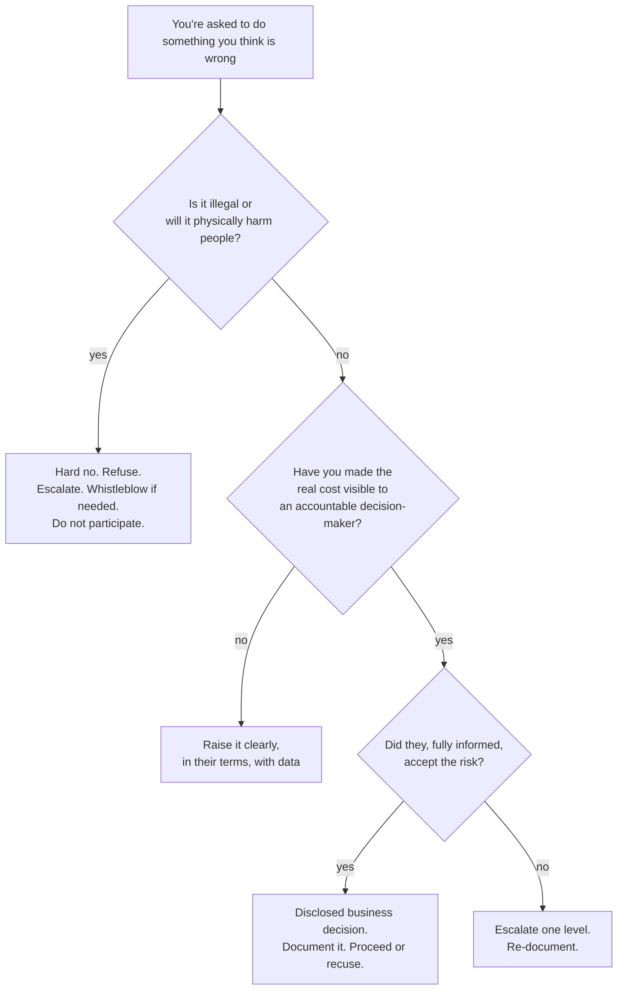
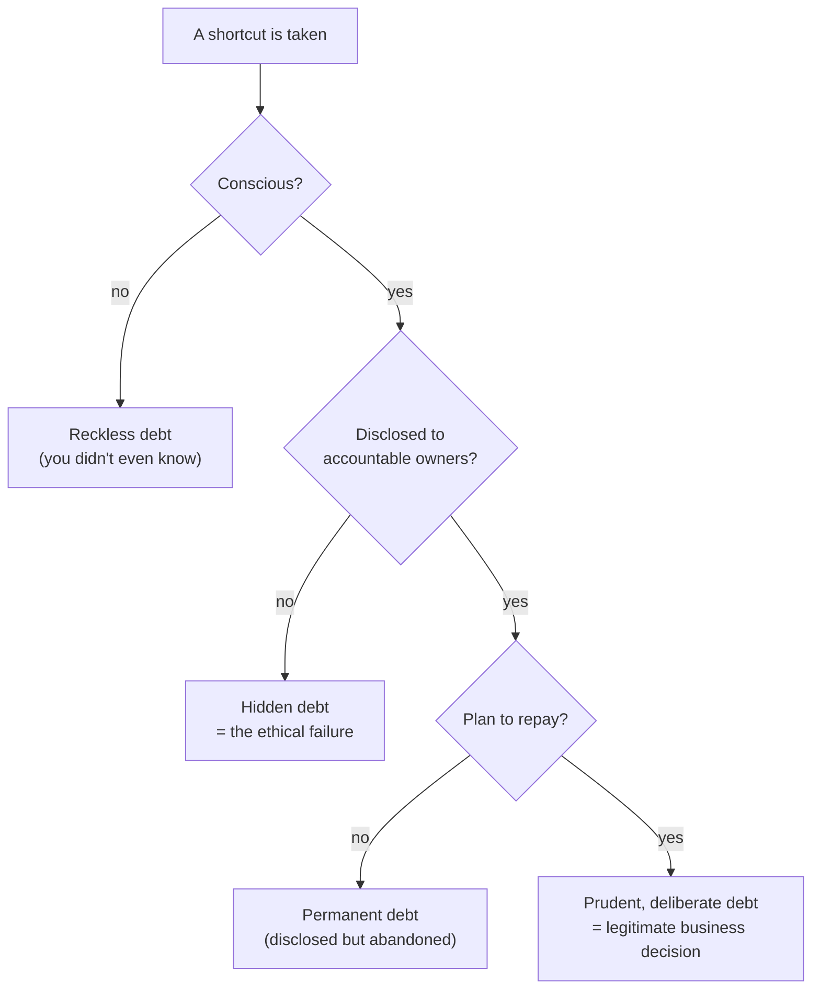
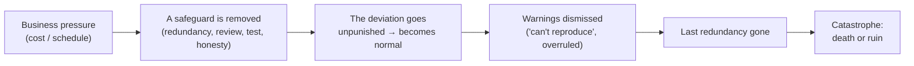
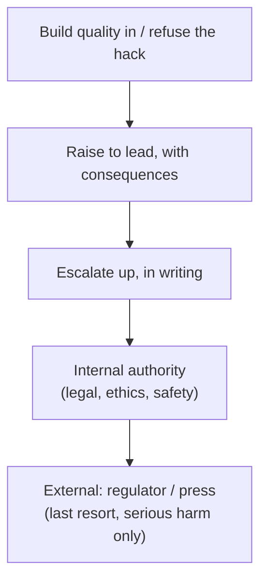

# The Craftsman's Ethics & Oath — Senior

> **Category:** [Craftsmanship Disciplines](../README.md) — the professional and ethical commitments that separate a software craftsman from someone who merely types code that compiles.

> **Prerequisites:** [Junior](junior.md) · [Middle](middle.md)
> **Focus:** **Ethics under pressure** and **what the real disasters teach**

---

## Table of Contents

1. [Introduction](#introduction)
2. [The Central Tension: Deadlines vs Quality](#the-central-tension-deadlines-vs-quality)
3. [Saying No as a Professional Act](#saying-no-as-a-professional-act)
4. [The Limits of "Just Following Orders"](#the-limits-of-just-following-orders)
5. [Whistleblowing: The Last Resort](#whistleblowing-the-last-resort)
6. [Case Study: Therac-25](#case-study-therac-25)
7. [Case Study: Volkswagen Dieselgate](#case-study-volkswagen-dieselgate)
8. [Case Study: Boeing 737 MAX (MCAS)](#case-study-boeing-737-max-mcas)
9. [Case Study: Knight Capital](#case-study-knight-capital)
10. [What the Failures Have in Common](#what-the-failures-have-in-common)
11. [Technical Debt as an Ethical Issue](#technical-debt-as-an-ethical-issue)
12. [A Decision Model: Should I Ship This?](#a-decision-model-should-i-ship-this)
13. [Pros & Cons of an Ethical Stand](#pros-cons-of-an-ethical-stand)
14. [Test Yourself](#test-yourself)
15. [Summary](#summary)
16. [Diagrams](#diagrams)

---

## Introduction

> Focus: ethics is only tested **under pressure**, and history shows exactly how it fails.

The junior and middle levels described the ideal. This level is about what happens when the ideal meets a shipping date, an angry executive, a fixed-bid contract, or a regulatory deadline. Ethics that only holds when it's convenient is not ethics — it's preference. The senior skill is keeping the commitments *when they cost something*, and knowing the escalating menu of options — from quietly building quality in, to saying no, to (rarely) whistleblowing — when you're asked to do something wrong.

This level leans hard on real engineering disasters, because they are the field's accumulated wisdom about what happens when the ethic is abandoned. None of the four cases below were caused by a single villain. Each was a *system* of normalized small compromises that, stacked, killed people or destroyed a company. That is the pattern worth burning into memory.

---

## The Central Tension: Deadlines vs Quality

Nearly every software-ethics dilemma reduces to one tension:

> **Short-term pressure (a deadline, a cost, an unhappy stakeholder) versus long-term integrity (safety, honesty, maintainability).**

The dangerous framing — the one that produces disasters — is "quality versus speed," as if they trade off linearly. For *sustained* delivery they do not: the teams that ship fastest over a year are usually the ones with the cleanest, best-tested code, because they are not constantly fighting their own past shortcuts. Robert C. Martin's blunt version: *"The only way to go fast is to go well."*

The honest version of the tension is narrower: **occasionally, a genuine business emergency justifies a conscious, temporary, *disclosed* shortcut.** The ethics live in three words:

- **Conscious** — you know you're cutting a corner; you didn't do it by accident.
- **Temporary** — there is a plan and a commitment to pay it back.
- **Disclosed** — the people accountable for the system *know* the corner was cut.

A shortcut that is conscious, temporary, and disclosed is a *business decision*. A shortcut that is unconscious, permanent, or hidden is the beginning of every disaster in this file.

---

## Saying No as a Professional Act

The single most important professional skill that no one teaches in a CS degree is **saying no**. Robert C. Martin devotes a chapter of *The Clean Coder* to it for a reason: a professional's "yes" is only worth something if they are *capable* of saying "no."

Saying no is not insubordination. It is the profession functioning correctly. A structural engineer who says "I won't sign off on those beams" is not being difficult — they are doing the exact job society licenses them to do. The software equivalent:

- *"We can't ship this Friday with the payment path untested. We can ship Friday without the payment feature, or ship the payment feature next Tuesday tested. I can't responsibly do both."*
- *"I can build that, but not by the date you've already promised the client. Here's what's actually achievable."*

### How to say no well

| Do | Don't |
|---|---|
| Say no to the *task or date*, while staying committed to the *goal* | Say no to the person, or to the mission |
| Offer the **real** alternatives (scope, date, or risk — pick) | Offer false hope ("I'll try") that you know is a no |
| Make the **cost of yes** visible and specific | Be vague ("it's risky") with no concrete consequence |
| Put the trade-off in *their* terms (outage, liability, churn) | Lecture about clean code; they don't care, and shouldn't have to |
| Escalate with data if overruled, then document | Quietly comply and let the failure be a surprise |

The deepest point: **"I'll try" is the most dangerous phrase in professional software.** "Try" is what you say to avoid the discomfort of "no" while taking on the obligation of "yes." Either you commit (and mean it) or you decline (and offer alternatives). "Try" commits you to a result you don't believe in.

---

## The Limits of "Just Following Orders"

Every engineer eventually faces the moment where someone with authority asks for something they shouldn't do — ship the untested thing, fake the number, hide the defect. "I was just following orders" is not a defense, ethically or, increasingly, legally.

The reason is the same one that makes you a professional in the first place: **you have specialized knowledge the order-giver lacks.** The manager who says "just ship it" frequently does not understand that "it" will leak customer data or that the test gap is a safety gap. Your duty is to make the consequence *visible* — to convert their uninformed instruction into an informed decision. If, fully informed, they still proceed, the situation has changed: an informed organization accepting a disclosed risk is different from an engineer silently shipping a hidden one.

Where the line genuinely falls:

The crucial asymmetry: for **safety and legality**, "informed acceptance" by a manager does *not* clear you — you cannot help build a thing that injures people because a boss approved it. For **quality and schedule** trade-offs, informed acceptance *does* shift the call to the business, where it belongs.

---

## Whistleblowing: The Last Resort

Whistleblowing is the escalation of last resort, and it is genuinely costly — careers, friendships, and finances are routinely destroyed by it, often even when the whistleblower is right. So it deserves a sober framing, not romanticism.

The ladder of escalation, in order:

1. **Fix it yourself** quietly if you can (build quality in, write the test, refuse to merge the hack).
2. **Raise it** to your lead/manager with specifics and consequences.
3. **Escalate** up the chain, in writing, when ignored.
4. **Go to an internal authority** — ethics hotline, legal, safety board, an independent function.
5. **Go external** — regulator, press — only when the harm is severe, internal channels are exhausted or compromised, and the alternative is participating in serious harm.

Whistleblowing is justified mainly when the harm is *serious* (safety, large-scale fraud, public danger), the evidence is *solid*, and internal channels have genuinely *failed*. It is not the tool for "I disagreed with an architecture decision." Many jurisdictions provide legal protection for good-faith whistleblowers on safety and fraud; knowing whether you have it is part of doing it wisely. The MAX and Dieselgate cases below both featured engineers who raised concerns internally and were overruled — a reminder that the earlier rungs of the ladder fail more often than we'd like.

---

## Case Study: Therac-25

**What it was:** A radiation therapy machine (mid-1980s, AECL). Between 1985 and 1987 it massively overdosed at least six patients with radiation; several died.

**The technical cause:** A race condition. The Therac-25 removed the *hardware* safety interlocks present in earlier models and relied on *software* alone to prevent the high-power beam from firing without its protective target in place. A fast, experienced operator entering and editing settings quickly could trigger a race between concurrent tasks, leaving the machine in a state where it fired a massive unfiltered beam while the screen said everything was normal. A counter that overflowed periodically defeated a safety check entirely.

**The ethical failures — the part that matters here:**

- **No independent code review or rigorous testing** of safety-critical software; the code was largely written and trusted by one person.
- **Reused code** from earlier models was assumed safe because "it had worked before" — without analysis of whether removing the hardware interlocks invalidated those assumptions.
- **Overconfidence in software**: hardware interlocks (defense in depth) were deliberately removed to cut cost, putting the entire safety burden on unverified code.
- **Dismissal of field reports**: early overdose reports were attributed to operator error or declared impossible, because the manufacturer could not reproduce them and *trusted the software over the patients*.

**The lessons for the craftsman:** Oath promise 3 ("provide proof every element works") is not a nicety in safety-critical code — its absence is lethal. Defense in depth matters; never let software be the *sole* barrier against catastrophic harm. And believe your bug reports: "we couldn't reproduce it" is a hypothesis, not an exoneration.

---

## Case Study: Volkswagen Dieselgate

**What it was:** From around 2008, Volkswagen shipped diesel cars whose engine-control software *detected when the car was undergoing an emissions test* (by sensing the test's characteristic steering, speed, and duration pattern) and switched into a clean, low-power mode. On the road, it switched back, emitting up to ~40× the legal limit of nitrogen oxides. Roughly 11 million vehicles were affected. The fallout: >$30 billion in fines and settlements, criminal convictions, and a Volkswagen engineer sentenced to prison in the U.S.

**The ethical failure — and why it's the purest case in this file:** This was not negligence or a missed test. It was a **deliberate, conscious deception, implemented in code.** Some engineer wrote the function that recognized the test cycle. Some engineer wrote the `if (being_tested) { run_clean_mode() }`. The "defeat device" was *software craftsmanship in service of fraud* — well-engineered code that did exactly what it was designed to do, and what it was designed to do was lie to regulators and poison the public.

**The lessons for the craftsman:**

- Oath promise 1 ("do no harm to society") is not abstract. The engineers who wrote that code violated it as directly as it is possible to do.
- **"I just implemented the spec" is the Dieselgate defense, and it failed — in court.** A professional is responsible for what their code *does*, not merely that it matches a ticket. If the ticket is "help us cheat," the professional answer is no.
- Skill is morally neutral; **the choice of what to build with it is not.** A defeat device is well-crafted software in the technical sense and an ethical catastrophe in every other.

---

## Case Study: Boeing 737 MAX (MCAS)

**What it was:** Two crashes — Lion Air 610 (2018) and Ethiopian Airlines 302 (2019) — killed 346 people and grounded the entire 737 MAX fleet worldwide. The proximate cause was **MCAS** (Maneuvering Characteristics Augmentation System), software added to make the MAX handle like older 737s so airlines wouldn't need expensive pilot retraining.

**The technical cause:** MCAS could automatically push the aircraft's nose down based on input from a **single angle-of-attack sensor** with no redundancy. When that sensor failed, MCAS repeatedly forced the nose down; the pilots, who in many cases *did not know MCAS existed*, fought it until they lost control.

**The ethical failures — a cascade, not a single mistake:**

- **A business goal corrupted the engineering**: avoiding pilot-retraining cost drove the decision to hide MCAS rather than design and document it openly.
- **A safety-critical function depended on a single sensor** — no redundancy on a system with authority to crash the plane.
- **MCAS was downplayed to regulators and omitted from pilot manuals**, so the people meant to be the last line of defense didn't know it was there.
- **Internal warnings were overruled.** Engineers and test pilots raised concerns; schedule and cost pressure won. ("Designed by clowns … supervised by monkeys," one Boeing employee wrote internally.)
- **Self-certification**: regulatory oversight had been partly delegated back to Boeing, weakening the independent check.

**The lessons for the craftsman:** This is the deadliest modern illustration of *business pressure overriding engineering judgment* and of removing **defense in depth** (single sensor, hidden system, untrained pilots — every redundant safeguard stripped to save cost or time). It is also a case where saying no internally *happened and was ignored*, which is exactly why the escalation ladder and external oversight exist. Promise 1 and promise 8 (honest disclosure) both failed at organizational scale.

---

## Case Study: Knight Capital

**What it was:** On August 1, 2012, the trading firm Knight Capital deployed new software and **lost ~$440 million in 45 minutes**, nearly destroying the company (which was acquired shortly after). No one died — this is the cautionary tale about *process and operational discipline* rather than physical safety.

**The technical cause:** A deployment to eight servers was applied to only seven. The eighth still ran old code. Worse, the new code *reused an old, dormant feature flag* (`Power Peg`) that, on the un-updated server, repurposed it to fire millions of erroneous orders into the live market — fast, automatically, and irreversibly.

**The ethical/craft failures:**

- **No automated, verified deployment** — the rollout depended on a human copying files to each server by hand, and one was missed with no check.
- **Dead code left in the system** (the dormant flag) instead of being deleted — a direct violation of Oath promise 2 ("don't let defective structure accumulate") that turned lethal.
- **No effective kill switch / no rehearsed rollback** for a system that could lose hundreds of millions per minute.
- **Inadequate testing of the deploy path itself**, not just the feature.

**The lessons for the craftsman:** Oath promises 2, 3, and 4 are *operational survival*, not aesthetics. Dead code is not harmless; automated repeatable deployment is not optional at scale; and the ability to *stop and reverse* fast (small releases, kill switches) is the difference between a bad day and bankruptcy. Knight is the proof that you don't need a safety-critical domain for cut corners to be existential.

---

## What the Failures Have in Common

Lay the four cases side by side and the same DNA appears:

| Case | Business pressure | Safeguard removed | Warning ignored | Honesty failure |
|---|---|---|---|---|
| Therac-25 | Cost (drop hardware interlocks) | Hardware interlocks; code review | Field overdose reports | "Can't reproduce → impossible" |
| Dieselgate | Hit emissions targets cheaply | Honesty itself | (Deliberate from the start) | The product *was* a lie |
| 737 MAX | Avoid retraining cost / schedule | Sensor redundancy; disclosure | Internal engineer concerns | MCAS hidden from pilots & regulators |
| Knight Capital | Ship the trading update fast | Automated deploy; dead-code hygiene | (Process gap) | — |

The recurring pattern:

> **Disasters are not caused by one bad decision by one bad person. They are caused by a chain of individually-defensible compromises, each made under pressure, each removing a safeguard, with warnings normalized away — until the last redundancy is gone and the system kills someone or destroys itself.**

This is the **normalization of deviance** (Diane Vaughan's term from the Challenger disaster): each small deviation from the safe standard goes unpunished, becomes the new normal, and lowers the bar for the next one. The craftsman's ethic is, at bottom, the discipline of *not letting the deviation become normal* — of treating the first skipped test, the first hidden shortcut, the first ignored warning, as the place to stop.

---

## Technical Debt as an Ethical Issue

Most engineers think of technical debt as a *technical* problem. At the senior level it is also an *ethical* one, and the deciding factor is **disclosure and consent**.

The financial-debt metaphor (Ward Cunningham's original) is precise:

- **Deliberate, disclosed, prudent debt** is a legitimate business tool: *"We'll ship the manual version now and automate it next quarter; here's the interest we'll pay until then."* The accountable people consented with full information. This is ethical.
- **Reckless or hidden debt** is the ethical failure: cutting the corner *without* telling anyone, or denying it exists, so the organization makes decisions on a false picture of its own risk. The bill comes due on someone who never agreed to it — often the on-call engineer at 2 a.m., or the user whose data leaks.

The professional move is therefore not "never incur debt" — that's naïve and uncompetitive. It is **make debt visible**: name it in the PR, track it as a ticket, quantify the interest ("this will slow every future change to this module by ~X"), and surface it to whoever owns the trade-off. The crime is not borrowing; it's borrowing in someone else's name without telling them. See [Refactoring as a Discipline](../03-refactoring-as-a-discipline/junior.md) for how the debt gets paid down, and [Simple Design](../04-simple-design/junior.md) for how to avoid taking it on accidentally.

---

## A Decision Model: Should I Ship This?

A senior carries an internal checklist for the "ship it?" moment. Made explicit:

The model's spine is the same as the junior "would I sign my name to it?" — but a senior knows *which* gates are negotiable (schedule, disclosed debt) and which are not (harm to people, hidden risk).

---

## Pros & Cons of an Ethical Stand

| Pros | Cons (and the honest reckoning) |
|------|-------------------------------|
| You don't end up on the wrong side of a Dieselgate-style prosecution | Saying no can stall a career in a dysfunctional org — sometimes the ethical move is to *leave* |
| Your name is associated with systems that didn't fail catastrophically | You will occasionally be wrong about the risk and look overcautious |
| Trust compounds; you become the person whose sign-off means something | The org may overrule you anyway; personal virtue can't fix a broken culture |
| You sleep at night | Whistleblowing, the last resort, is genuinely ruinous even when justified |

The honest senior position: the ethic does not guarantee good outcomes. It guarantees that *your* contribution to a bad outcome was minimized and disclosed — which is the most any individual can control, and exactly what every engineer in this file's disasters failed to do.

---

## Test Yourself

1. What three properties turn a corner-cutting shortcut from an ethical failure into a legitimate business decision?
2. Why is "I'll try" considered more dangerous than a clear "no"?
3. In "should I do what I'm told?", where exactly does informed acceptance by a manager *clear* you, and where does it *not*?
4. What single design idea — present (and removed) in Therac-25 and the 737 MAX both — is the recurring safety theme?
5. Why is Dieselgate considered a *purer* ethics case than Therac-25 or Knight Capital?
6. When does technical debt cross from legitimate into an ethical failure?

---

## Summary

- Ethics is only tested **under pressure**; the real tension is short-term pressure vs long-term integrity, and "the only way to go fast is to go well."
- A shortcut is acceptable only when **conscious, temporary, and disclosed**; otherwise it's the first step of a disaster.
- **Saying no** is the profession working correctly; "I'll try" is the most dangerous phrase. Make the *cost of yes* visible in the stakeholder's own terms.
- **"Just following orders"** fails because you hold knowledge the order-giver lacks; for safety/legality, no approval clears you.
- **Therac-25, Dieselgate, 737 MAX, and Knight Capital** share one DNA: business pressure → safeguards removed → warnings normalized away → catastrophe. This is the **normalization of deviance**.
- **Technical debt is an ethical issue** when it is hidden; disclosed, deliberate, repayable debt is legitimate.

---

## Diagrams

### The disaster pattern (shared across all four cases)

### The escalation ladder

---

## Check your understanding

1. Explain The Craftsman's Ethics & Oath — Senior Level in your own words and name the problem it solves.
2. How would you apply the ideas around Table of Contents, Introduction, The Central Tension: Deadlines vs Quality in a realistic engineering change?
3. What failure mode or misuse should you look for, and what evidence would reveal it?
4. How would you validate a system-level decision about The Craftsman's Ethics & Oath — Senior Level under uncertainty?
5. What observable result would convince you that the approach improved the system?
