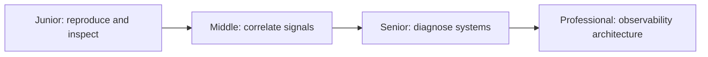
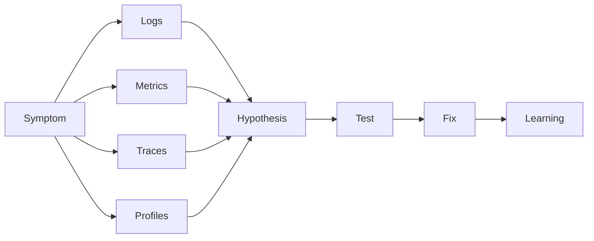

# Diagnostics and Observability

> Turn unknown production behavior into evidence, mitigation, explanation, and a safer system.

The consolidated guide covers debugging, errors, logs, metrics, traces, profiles, crash reports, audit logs, diagnostic endpoints, dynamic instrumentation, sampling, incidents, and postmortems.

| Level | Guide | You are done when |
|---|---|---|
| Junior | [Diagnose one failure](junior.md) | You can reproduce, read evidence, test one hypothesis, and verify the fix. |
| Middle | [Instrument a service](middle.md) | You can correlate logs, metrics, and traces across boundaries. |
| Senior | [Lead system diagnosis](senior.md) | You can mitigate incidents and diagnose partial or emergent failure. |
| Professional | [Design observability capability](professional.md) | You can govern telemetry quality, cost, safety, and organizational learning. |

## Practice rule

Start with the symptom and a falsifiable hypothesis. Add telemetry only when it answers a concrete operational question.

## Related

- [Quality Engineering → Performance → Profiling](../../Software-Engineering/quality-engineering/performance/profiling/)
- [Documentation](../documentation/README.md)
