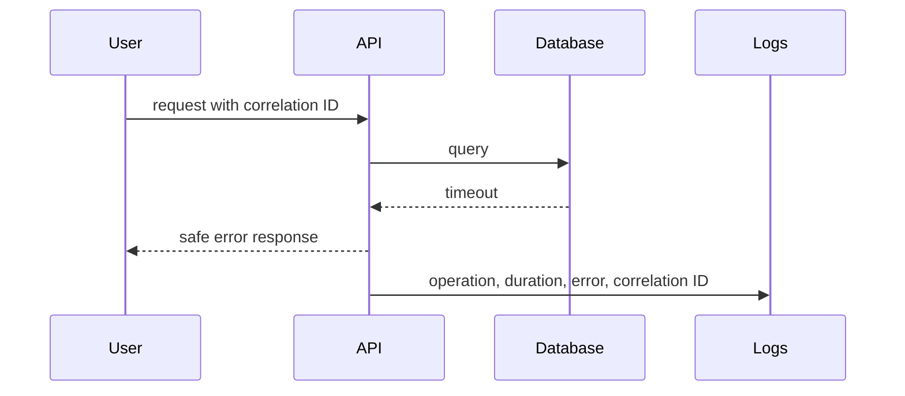

# Diagnostics — Junior

Capture exact error, time, version, input, environment, and request or job ID. Reproduce the smallest failing case and read the complete stack trace.

Form one hypothesis and predict the evidence it would produce. Compare failing and healthy cases. Do not add random logging or make several changes at once.

Logs explain discrete events; metrics show aggregate behavior; traces show request paths; profiles show resource consumption. Use the signal closest to the question.

Never log passwords, tokens, or unnecessary personal data. Return safe messages to users while preserving diagnostic context internally.

## Test yourself

1. What information makes a failure reproducible?
2. Which signal answers “where did this request wait?”
3. Why compare a healthy request?
4. Which data must not enter logs?

Continue to [`middle.md`](middle.md).
