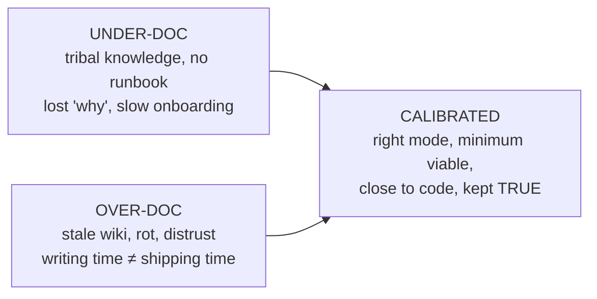
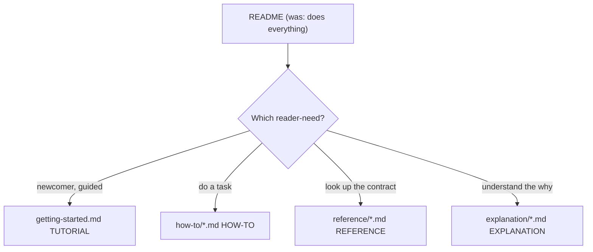

# Why & What to Document — Middle

> **Category:** [Documentation](../README.md) — what an engineer documents, where it belongs, and how to keep it alive.

> **Prerequisite:** [Junior](junior.md)
> **Focus:** **Why** and **When**

---

## Table of Contents

1. [Introduction](#introduction)
2. [Applying Diátaxis to a Real Project](#applying-diataxis-to-a-real-project)
3. [The "Document Decisions, Interfaces, and Surprises" Heuristic](#the-document-decisions-interfaces-and-surprises-heuristic)
4. [Deciding the Right Amount: Too Much vs. Too Little](#deciding-the-right-amount-too-much-vs-too-little)
5. [Self-Documenting Code and Where It Stops](#self-documenting-code-and-where-it-stops)
6. [Trade-offs](#trade-offs)
7. [Edge Cases](#edge-cases)
8. [Tricky Points](#tricky-points)
9. [Best Practices](#best-practices)
10. [Test Yourself](#test-yourself)
11. [Summary](#summary)
12. [Diagrams](#diagrams)

---

## Introduction

> Focus: **Why** and **When**

At the junior level, *what to document* is a set of categories you can name. At the middle level it becomes a stream of **judgement calls inside a real project under deadline pressure**: *This PR adds an endpoint — does it need a doc, and which kind? We have a wiki, a README, and inline comments — where does this belong? Is this worth writing, or will it rot before anyone reads it?*

The recurring tension is the same one that governs all documentation, stated as two failure modes:

- **Under-documentation** — the *why* lives only in heads; new hires take a month; the same questions recur; the on-call engineer has no runbook. Knowledge has a bus factor of one.
- **Over-documentation** — a wiki of 400 pages, 380 of them stale; a mandated design doc for a typo fix; comments that restate code. The signal drowns in maintenance cost, and readers stop trusting *any* of it.

Most teams oscillate between the two: a documentation push produces a wiki, the wiki rots, everyone declares "docs don't work here," and the pendulum swings back to none. The middle-level skill is **calibrating** — writing the *right* docs, in the *right* mode, at the *right* moment, at the volume you can keep *true*. The calibration tools are **Diátaxis** (for *which kind*) and the **decisions/interfaces/surprises** heuristic (for *whether at all*).

---

## Applying Diátaxis to a Real Project

Diátaxis is easy to recite and easy to violate. The middle-level skill is using it to *diagnose* an existing doc set and *route* new writing. Consider a typical microservice with one sprawling `README.md` that has grown to do everything.

**Diagnosis — what modes is the README accidentally blending?**

```
README.md (current state — the anti-pattern)
├── "Getting Started" walkthrough ............ TUTORIAL  ✓ ok here
├── "Configuration options" table ............ REFERENCE (buried)
├── "How to rotate the signing key" .......... HOW-TO   (buried)
├── "Architecture & why we use Kafka" ........ EXPLANATION (buried)
└── "API endpoints" ........................... REFERENCE (buried)
```

The README is doing all four jobs, so it serves none well: a newcomer wading through Kafka rationale to find the setup command, an on-call engineer hunting for key rotation amid architecture prose. **The fix is not "write more" — it's split by mode and link:**

```
README.md ................ front door: 3-line "what is this", then ROUTES:
docs/
├── getting-started.md .... TUTORIAL    — guided first success
├── how-to/
│   ├── rotate-keys.md .... HOW-TO      — one task each, scannable
│   └── add-a-consumer.md . HOW-TO
├── reference/
│   ├── config.md ......... REFERENCE   — exhaustive options table
│   └── api.md ............ REFERENCE   — every endpoint, generated if possible
└── explanation/
    └── why-kafka.md ...... EXPLANATION — the decision and rejected alternatives
```

The same words, redistributed. The reader is now always in one mode, and each file has a single job — which also makes each *easy to keep true*, because a config change touches exactly one reference file, not a 2,000-line README.

> The practical heuristic: **when a doc is hard to write or read, suspect it's serving two modes at once.** "Where do I put this paragraph?" usually has the answer "in whichever of the four modes it belongs to — and not the others."

### Mapping a feature to its four quadrants

When you ship a feature, walk the four quadrants explicitly and decide *yes/no* for each — including deliberate "no":

| Mode | Question | Typical answer for a small internal feature |
|---|---|---|
| Tutorial | Does a newcomer need a guided first success? | Often **no** — over-documentation for internal APIs |
| How-to | Is there a recurring task to recipe-ize? | **Yes** if anyone but the author will do it |
| Reference | Is there a public interface/config to list? | **Yes** if there's an API/flag — generate it if you can |
| Explanation | Was a non-obvious decision made? | **Yes** if you'd struggle to defend it in six months |

The deliberate "no" is as much a skill as the "yes." Writing a tutorial for a two-method internal helper is over-documentation; the cost is real and the reader is imaginary.

---

## The "Document Decisions, Interfaces, and Surprises" Heuristic

When deadline pressure forces you to write *only the docs that matter*, this is the triage. Good engineers do it by instinct; here it is explicitly.

**1. Decisions.** Anything where you *chose* among alternatives — a database, a retry count, a consistency model, a "we'll do X not Y because Z." The chosen option is visible in the code; the *alternatives and the reasoning* are not, and they're exactly what a future maintainer needs to avoid re-litigating or wrongly "fixing." This is the **explanation/ADR** territory.

**2. Interfaces.** The contract others depend on — function signatures, API endpoints, config schemas, event formats, CLI flags. The *contract* is the promise; consumers code against it, and they need it stated precisely and exhaustively. This is **reference** territory, and it's the highest-leverage documentation because it serves the most readers.

**3. Surprises.** The non-obvious — the workaround for a vendor bug, the field that *looks* optional but isn't, the ordering dependency, the "do not parallelize this." Surprises are where wrong assumptions become incidents. A surprise undocumented is a trap left for the next person.

> The complement is just as important: **don't document the unsurprising.** A standard CRUD endpoint that behaves exactly as its name implies needs reference (the contract) but no explanation (there's no decision to defend) and no surprise note (there's nothing surprising). Documenting the obvious is the over-documentation tax.

What this heuristic deliberately *excludes* tells you what not to write: the mechanical *what/how* of code that good names already convey, restatements, and narration. If the reader can get it from reading the code, it's not a decision, interface, or surprise — and it's not worth a doc.

---

## Deciding the Right Amount: Too Much vs. Too Little

The cost of documentation is **bidirectional**, and middle engineers must reason about both costs at once.

| | Too little | Too much |
|---|---|---|
| Symptom | Repeated questions, slow onboarding, lost *why*, no runbook | Stale wiki, distrust of all docs, writing time not shipping time |
| Who pays | Future readers (and you, re-explaining) | Writers now + readers who can't find the live doc among dead ones |
| Failure name | Tribal knowledge / low bus factor | Documentation debt / doc rot |
| Root cause | "No time to write it down" | "Document everything to be safe" |

The reconciling principle is **minimum viable documentation** (Google): *the least documentation that genuinely answers the reader's question, kept as close to the code as possible.* The closeness matters as much as the volume — a doc next to the code (a docstring, a `docs/` folder in the repo) gets updated in the same PR that changes the behavior; a doc on a separate wiki drifts because nobody remembers it exists.

> The volume you should write is the volume you can keep *true*. A team that can maintain ten honest pages should not own a hundred. Every doc is a standing maintenance liability; budget for its upkeep, not just its creation.

A useful test before writing: **"In six months, will this be cheaper to keep accurate than the cost of someone not having it?"** If a doc is both unlikely to be read *and* expensive to keep current (because it mirrors fast-changing values), don't write it — generate it from the source, or accept its absence.

---

## Self-Documenting Code and Where It Stops

A common (and partly correct) middle-level belief: *good code is self-documenting, so I shouldn't need many docs.* The nuance that separates a calibrated engineer from a dogmatic one:

**Self-documenting code eliminates the need to document *what* and *how*.** A well-named function with clear structure tells the reader its mechanics; a comment restating them is pure liability. To this extent, "self-documenting code" is correct and a comment that explains *what* is a code smell.

**But code can never be self-documenting about *why*.** Names and structure express the chosen behavior; they *cannot* express the rejected alternative, the external constraint, or the reasoning. No amount of clean code tells you *why* the retry count is three rather than five, or *why* a `+` is deliberately stripped from a phone number against the standard.

```python
# Self-documenting WHAT — needs no comment:
def total_with_tax(subtotal: Money, rate: TaxRate) -> Money:
    return subtotal * (1 + rate)

# Code that CANNOT self-document its WHY — needs a doc:
SHARD_TIMEOUT_S = 4   # ← why 4? the code can't say.
```

The comment that earns its place:

```python
# Vendor's gateway p99 latency is ~3.2s; 4s gives headroom without
# stacking past our own 5s upstream deadline. Raising this risks
# cascading timeouts. See ADR-0021.
SHARD_TIMEOUT_S = 4
```

> The synthesis: **make the code self-documenting for *what/how* (so you write fewer docs), and document the *why* explicitly (because code structurally cannot).** "Self-documenting code" is an argument for *better code*, not for *no documentation* — and conflating the two is how teams lose every *why* they ever had.

---

## Trade-offs

| Decision | Lean lighter (less doc / closer to code) | Lean heavier (more doc / standalone) |
|---|---|---|
| Writing cost now | Low | High |
| Maintenance cost | Low — co-located, updated with code | High — drifts, needs separate upkeep |
| Risk | Some *why* lost; onboarding slower | Rot; readers can't find the live doc; distrust |
| Discoverability | Lower for non-readers of code | Higher *if* kept current |
| Best when | Internal, fast-changing, small audience | Public APIs, many consumers, stable contracts, regulated domains |

The asymmetry that usually favors *lighter and closer*: an under-documented internal module costs *re-explanation* (recoverable — you ask someone), while an over-documented wiki costs *rot plus distrust* (corrosive — once readers learn the docs lie, they stop reading even the true ones). For *interfaces with many external consumers*, the asymmetry flips: there, thorough reference docs pay back enormously because the cost of every consumer guessing the contract is multiplied across all of them.

---

## Edge Cases

### 1. The doc that's correct today and rots fastest

Anything that *mirrors* a value better held in the source — a list of supported countries, current version numbers, an enum's members, exact line counts. Writing these as prose guarantees rot. The middle-level move: **generate it or link to the source of truth**, never hand-copy it. (The mechanics live at [Docs as Code & Tooling](../10-docs-as-code-and-tooling/junior.md).)

### 2. The "everyone already knows this" surprise

The most dangerous surprises are the ones the *current* team has internalized so deeply they no longer see them ("of course you have to run the migration first"). These feel un-worth-documenting precisely *because* they're tribal knowledge — which is exactly why they must be written down. Test: *did a new hire trip on it?* If yes, it's a surprise, document it.

### 3. Prototype / throwaway code

A genuine spike that will be deleted in a week shouldn't carry production-grade docs — that's over-documentation. But "throwaway" code has a way of shipping. The pragmatic rule: a one-line "this is a spike, do not productionize without rewriting" note is cheap insurance against the spike quietly becoming the system with no *why* recorded.

### 4. Cross-cutting decisions that span many files

A decision like "all money is stored as integer cents, never floats" affects dozens of files and belongs in *none* of them specifically. This is the case for a *central* explanation/ADR that the files link to — documenting it in one file leaves it invisible to the others.

---

## Tricky Points

- **"Self-documenting code" is not "no documentation."** It removes *what/how* docs; it can't touch *why* docs. Teams that take it as license to write nothing lose every decision rationale they ever had.
- **The forgotten audience is usually the operator or the maintainer.** Teams instinctively document the *user* (it's the product) and forget *how to run it at 3 a.m.* and *why it's built this way*. Audit those two quadrants specifically.
- **Picking the Diátaxis mode is a *reader* decision, not a *topic* decision.** The same subject (say, authentication) gets a tutorial, a how-to, reference, *and* an explanation — one per reader-need. "Which mode?" = "which reader, doing what?"
- **Over-documentation hides under-documentation.** A 400-page wiki *feels* well-documented while the one runbook anyone needs is missing. Volume is not coverage; map the audiences and modes to find real gaps.
- **The doc you write at decision-time is 10× cheaper than the one you reconstruct later.** The *why* is free to capture while it's in your head and expensive (sometimes impossible) to recover afterward. This is the strongest argument for [ADRs](../05-architecture-decision-records-adrs/junior.md).

---

## Best Practices

1. **Route by mode, link between modes.** Split a do-everything README into tutorial / how-to / reference / explanation; let the front door route readers. Don't blend.
2. **Triage with decisions / interfaces / surprises.** Under pressure, write *those*; skip the unsurprising and the self-evident.
3. **Make `what/how` self-documenting in code; write `why` as docs.** Better names mean fewer docs *and* a clearer *why* when you do write.
4. **Keep docs next to the code** (docstrings, in-repo `docs/`) so they're updated in the same change — the single biggest defense against rot.
5. **Generate the rotting parts** (option lists, API reference, version tables) from the source; never hand-copy values.
6. **Budget for upkeep, not just creation.** Own only the volume you can keep true; a smaller, trustworthy doc set beats a large, stale one.
7. **Capture decisions at decision-time.** The rationale is freest now and gone by next week.

---

## Test Yourself

1. A README has grown to include setup steps, a config table, key-rotation instructions, and the rationale for the database choice. What's wrong, and how do you fix it using Diátaxis?
2. State the "document decisions, interfaces, and surprises" heuristic and what it deliberately excludes.
3. Why is keeping a doc *close to the code* often more important than how much you write?
4. Where does "self-documenting code" stop, and what must still be documented?
5. Give two failure costs of *over*-documentation that *under*-documentation doesn't have.
6. Why are the most-internalized "everyone knows this" facts the most dangerous to leave undocumented?

---

## Summary

- The middle-level skill is **calibrating** between under- and over-documentation: the right doc, in the right Diátaxis mode, at the volume you can keep *true*.
- Use Diátaxis to **diagnose and route**: a do-everything README serves no one; split it by mode and link. "Hard to write/read" usually means "blending two modes."
- Triage what to write with **decisions, interfaces, surprises** — and deliberately *skip* the unsurprising and the self-evident.
- The cost is **bidirectional**: too little loses the *why* and slows onboarding; too much rots and breeds distrust. **Minimum viable documentation, kept close to the code**, reconciles them.
- **Self-documenting code** removes *what/how* docs but *never* the *why* — write better code to reduce docs, and document decisions explicitly because code structurally cannot.
- Capture the **why at decision-time** — it's cheapest then and often unrecoverable later.

---

## Diagrams

### Under- vs. over-documentation — the calibrated middle



### Routing a do-everything README by mode




---

## Check your understanding

1. Explain Why & What to Document — Middle Level in your own words and name the problem it solves.
2. How would you apply the ideas around Table of Contents, Introduction, Applying Diátaxis to a Real Project in a realistic engineering change?
3. What failure mode or misuse should you look for, and what evidence would reveal it?
4. Which local design trade-off would make you choose or reject Why & What to Document — Middle Level in an existing codebase?
5. What observable result would convince you that the approach improved the system?
