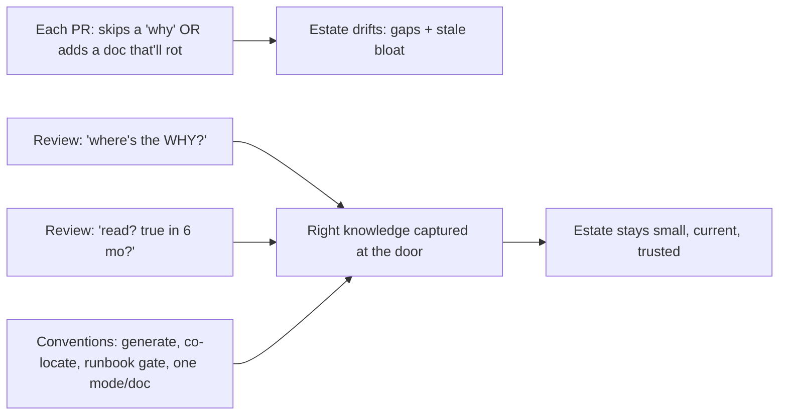
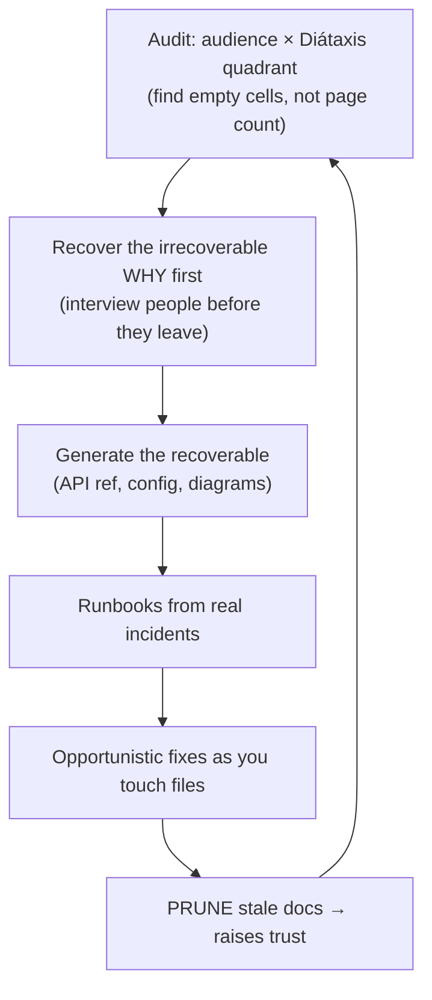

# Why & What to Document — Professional

> **Category:** [Documentation](../README.md) — what an engineer documents, where it belongs, and how to keep it alive.

> **Prerequisites:** [Junior](junior.md) · [Middle](middle.md) · [Senior](senior.md)
> **Focus:** **Production** — reviews, team conventions, real incidents, legacy gaps

---

## Introduction

> Focus: **production** — sustaining the right documentation across a large team over years.

Knowing *what* to document is one thing for an individual and another for an organization of hundreds shipping continuously. The professional problem is operational: **how do you ensure the right knowledge gets captured — and the wrong docs don't accumulate — when documentation is the easiest thing to skip under deadline pressure and the easiest thing to over-produce when someone gets enthusiastic?**

The answer is the same shape as for any quality discipline: make it part of *done* (review gates and definition-of-done), make the right path the default (conventions, templates, generation), make complexity visible (audience × quadrant audits), and have a disciplined way to claw back missing knowledge from legacy systems without halting feature work. Crucially, the professional must enforce *both* directions — pushing back on *missing* the *why* **and** on over-documentation that will rot.

---

## Enforcing "What to Document" in Code Review

Most documentation gaps and most documentation bloat enter the codebase one PR at a time. Review is where both are caught. A reviewer applies a short, audience-driven test to every change — and, like simplicity enforcement, pushes back on *unnecessary* docs as hard as on *missing* ones.

### Review questions, in order

1. **Is there a *decision* here whose rationale isn't recorded?** If the PR makes a non-obvious choice (a retry count, a consistency trade-off, a vendor workaround), the *why* must be captured — a comment for local choices, an ADR for cross-cutting ones. "The code shows what; where's the why?"
2. **Did this change an *interface* others depend on?** Then the reference must be updated *in the same PR* — a new endpoint, flag, or event field with stale reference is a defect, not a follow-up.
3. **Is there a *surprise* a future reader will trip on?** A non-obvious ordering, an "optional-looking but required" field, a "do not parallelize." Unrecorded → it's a trap.
4. **Is any *new* doc actually going to be read and kept true?** A tutorial for a two-method internal helper, a comment restating the code, a wiki page duplicating generated reference — push back. This is over-documentation; it will rot.
5. **Could this knowledge be code instead of prose?** "Always pass cents" in a comment → suggest a `Money` type. Prose that a test or type could enforce is a liability.

### The two highest-value review questions

> **"The code shows *what* it does — where is the *why*?"** (catches the most expensive, most irrecoverable gap)

> **"Who reads this doc, and will it still be true in six months?"** (catches over-documentation before it becomes rot)

### Review comment templates

> "This adds a 4-second timeout — why 4? That number is a decision the code can't explain. A one-line comment (or an ADR if it's load-bearing) will stop the next person from 'tidying' it."

> "New `?include=` query param but `reference/api.md` is unchanged. Reference must move with the interface — please update it in this PR."

> "This docstring restates the signature (`get_user — gets a user by id`). It adds nothing and will drift; I'd delete it and let the name speak. Save the words for the *why*."

> "This wiki page duplicates the generated config reference. Two sources of truth will diverge — link to the generated one instead."

> "Great runbook addition — but it's on the wiki. Move it next to the service in `docs/` so it updates with the code; remote runbooks rot."

---

## Team Conventions for Documentation

Codify these so the right documentation is the default path and the wrong documentation is hard to accumulate:

1. **"Where's the why?" is a standing review question.** Every non-obvious decision gets its rationale captured — comment for local, [ADR](../05-architecture-decision-records-adrs/junior.md) for cross-cutting/irreversible.
2. **Interface changes update reference in the same PR.** Enforced by a CI check where possible (e.g., a generated-spec diff that fails if the code and reference disagree).
3. **No service joins the on-call rotation without a runbook.** A hard gate; the operator audience is the one teams forget until 3 a.m.
4. **Generate, don't hand-write, anything derivable** — API reference, config tables, enums, version lists. Hand-written copies are banned in review.
5. **One Diátaxis mode per document; folder structure enforces it.** `tutorials/ how-to/ reference/ explanation/` — a tutorial in `reference/` is visible in review.
6. **Docs live next to the code** (in-repo `docs/`, docstrings), not on a detached wiki, so they're reviewed and updated with the change.
7. **Delete stale docs without ceremony.** An honest gap beats a confident lie; deleting a rotted doc is a celebrated cleanup, not vandalism.
8. **Tutorials/polished how-tos only for external or high-traffic surfaces.** Internal, low-traffic code stops at reference + the *why* — this bounds over-documentation.

These encode the senior reasoning so the team gets it right by default and reviewers cite a convention, not a personal preference.

---

## Fixing Documentation Gaps in Legacy Systems

Greenfield documentation is easy. The professional reality is a legacy system where the *why* is gone, the wiki is 80% stale, and the original authors have left. The approach is incremental, opportunistic, and audience-driven — never a "document everything" project (those never finish and produce rot).

### The sequence

1. **Audit by audience × Diátaxis quadrant, not by page count.** Map what exists against the six audiences and four modes; the *empty cells* are the real backlog. A 400-page wiki with no runbook and no recorded *why* is *under*-documented where it matters and *over*-documented where it doesn't.
2. **Recover the irrecoverable first.** The *why* decays fastest and is most expensive to reconstruct. Interview the remaining people who hold context *now*, before they leave, and capture decisions as retroactive ADRs. This is salvage, and it has a clock on it.
3. **Generate the recoverable.** Stand up generated API reference, config tables, and diagrams-as-code so the large, drift-prone surface stops needing hand-maintenance — and delete the hand-written copies it replaces.
4. **Write runbooks driven by real incidents.** Every page/incident with no runbook is a runbook waiting to be written; capture the resolution *during the retro*, while it's fresh.
5. **Improve docs opportunistically (the Boy Scout Rule for docs).** Don't schedule a documentation mega-project. When you touch a module for feature work, capture the *why* you had to reverse-engineer and fix the doc you found stale. Coverage compounds through normal work.
6. **Prune ruthlessly.** Deleting stale docs is part of the fix, not separate from it. Every dead doc you remove raises trust in the ones that remain.

### What *not* to do in legacy documentation

- **Don't "document everything" as a project.** It's all cost, never finishes, and the output rots faster than you write it. Tie documentation to the work and the incidents flowing through the system.
- **Don't hand-write what you could generate.** Re-creating a 600-line API reference by hand is committing to its eternal drift. Generate it once.
- **Don't preserve a confusing design with heavy docs when you could simplify it.** Hard-to-document is a design smell; sometimes the fix is the code, not the doc.
- **Don't trust the old wiki as a source of truth.** Treat legacy docs as *unverified* until checked against code; a stale doc you propagate is worse than the gap you started with.

---

## Real Incidents

### Incident 1 — The retry that "got simplified"

A payment service retried a flaky downstream **three times with jittered backoff.** A new engineer, cleaning up, "simplified" it to a single immediate retry — there was no comment explaining the three, the jitter, or the backoff. Under the next downstream blip, all clients retried in synchronized waves (a thundering herd), amplifying the outage and taking down the downstream entirely. **Postmortem:** the *why* (a hard-won lesson from a prior incident) lived only in the original author's head; the code showed *what* but not *why three* or *why jitter*. **Fix:** a comment plus an ADR recording the rationale and linking the original incident. **Lesson:** an undocumented decision is an invitation to re-cause the incident it solved. Document the *why* of any non-obvious defensive code.

### Incident 2 — The 3 a.m. page with no runbook

A service was added to the on-call rotation without a runbook because "it's simple, it just works." At 3 a.m. it didn't: a certificate expired, and the on-call engineer — who had never touched the service — spent two hours reverse-engineering how to rotate it while the outage ran. **Fix:** a runbook gate (no on-call without one) and a runbook written from the incident. **Lesson:** the *operator* is the most-forgotten audience. "It just works" is true until it doesn't, and that's precisely when the doc is needed and absent.

### Incident 3 — The wiki that lied

A team's setup wiki said "run `make seed` after `make migrate`." A schema change had reordered the dependency (`seed` now had to run *first*) but the wiki — detached from the repo — was never updated. New hires followed it, corrupted their local databases, and lost a day each, repeatedly, for months. **Fix:** moved setup into a co-located, tested `docs/getting-started.md` validated in CI; deleted the wiki page. **Lesson:** a stale doc is worse than no doc — it sent people *confidently* to the wrong action. Docs detached from the code rot invisibly; keep them next to the code and check them in CI.

### Incident 4 — The over-documented module nobody trusted

A well-meaning engineer documented every internal class with paragraph docstrings — most just restating the code. Over a year half drifted out of sync. New hires, having been burned by wrong docstrings, learned to *ignore all of them* — including the three that recorded genuine, load-bearing *whys*. Those three got "simplified away" in a refactor. **Fix:** deleted the restating docstrings, kept and elevated the three real *whys*. **Lesson:** over-documentation doesn't just waste effort — it *destroys trust in the docs that matter*. Volume is not coverage; it's camouflage for the gaps.

---

## The Politics of Documentation

Sustaining the right documentation is partly social:

- **Skipping docs is invisible; the cost is deferred and diffuse.** The engineer who skips the *why* ships faster today and isn't blamed when the incident lands six months later on someone else. Make decision-capture part of *done* so it isn't a discretionary, easily-skipped extra.
- **Over-documentation looks like diligence.** A thick wiki *appears* responsible; deleting docs *feels* reckless. Professionals must reframe deletion of stale docs as a valued cleanup and "minimum viable, kept true" as the mature stance — not laziness.
- **"We'll document it later" is documentation's "we'll fix it later."** Later rarely comes, and the *why* is gone by then. The only reliable capture is at decision-time; insist on it.
- **Stakeholders conflate doc volume with doc health.** "We have a 500-page wiki" reassures non-engineers. Educate them: the metric is *can a new hire onboard, can on-call recover, is the why retrievable* — not page count.
- **Senior engineers set the norm.** If the staff engineer records the *why* of their decisions and deletes stale docs in passing, the team does too. Model "document the why, generate the rest, prune the dead."

---

## Review Checklist

```text
WHAT-TO-DOCUMENT REVIEW CHECKLIST
[ ] WHY     — non-obvious decision in this PR has its rationale captured
              (comment for local; ADR for cross-cutting / irreversible)
[ ] INTERFACE — interface change updates the reference IN THIS PR
              (prefer generated; CI fails if spec ≠ code)
[ ] SURPRISE — non-obvious gotcha / ordering / constraint is noted near the code
[ ] OPERATOR — new on-call service has a runbook before joining rotation
[ ] AUDIENCE — the doc names its reader; right Diátaxis mode, not blended
[ ] NOT-ROT — new doc will be read AND kept true; not a restatement of code
[ ] CODE>PROSE — knowledge a type/test/generator could enforce isn't left as prose
[ ] CO-LOCATED — doc lives next to the code, not on a detached wiki
[ ] PRUNE    — stale docs touched by this change are fixed or deleted
```

---

## Cheat Sheet

```text
ENFORCE      two questions kill most gaps AND most bloat:
             "the code shows WHAT — where's the WHY?"
             "who reads this, and is it true in 6 months?"

CAPTURE      decisions (why) → comment/ADR    interfaces → generated reference
             surprises → co-located note       operations → runbook (on-call gate)

DON'T        restate code · hand-write the generable · detach docs to a wiki ·
             document everything · over-doc internal/low-traffic surfaces

LEGACY       audit by AUDIENCE × QUADRANT (gaps, not page count) → recover the
             irrecoverable WHY first (clock is ticking) → generate the rest →
             runbooks from incidents → opportunistic (Boy Scout) → PRUNE the dead

POLITICS     skipping docs is invisible & deferred → make WHY part of DONE.
             over-doc looks diligent → reframe pruning as a win; volume ≠ coverage.

CODE > PROSE push knowledge down the reliability stack:
             type > test > generated doc > hand-written prose
```

---

## Diagrams

### Where documentation gaps and bloat enter, and where they're stopped



### Legacy documentation salvage



---

## Related Topics

- **The *why* doc, formalized:** [Architecture Decision Records](../05-architecture-decision-records-adrs/junior.md), [Design Docs & RFCs](../06-design-docs-and-rfcs/junior.md).
- **The forgotten audience:** [Runbooks & Operational Docs](../07-runbooks-and-operational-docs/junior.md).
- **Generate-don't-write & keep-it-checked:** [API & Reference Docs](../04-api-and-reference-documentation/junior.md), [Docs as Code & Tooling](../10-docs-as-code-and-tooling/junior.md).
- **Fighting rot:** [Keeping Docs Alive & Doc Rot](../11-keeping-docs-alive-and-doc-rot/junior.md).
- **Comment-level enforcement:** Clean Code → Comments.

---


---

## Check your understanding

1. Explain Why & What to Document — Professional Level in your own words and name the problem it solves.
2. How would you apply the ideas around Table of Contents, Introduction, Enforcing "What to Document" in Code Review in a realistic engineering change?
3. What failure mode or misuse should you look for, and what evidence would reveal it?
4. How would you introduce and govern Why & What to Document — Professional Level across teams through reversible, measurable increments?
5. What observable result would convince you that the approach improved the system?
