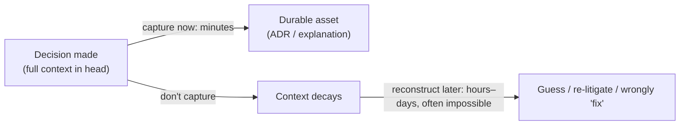
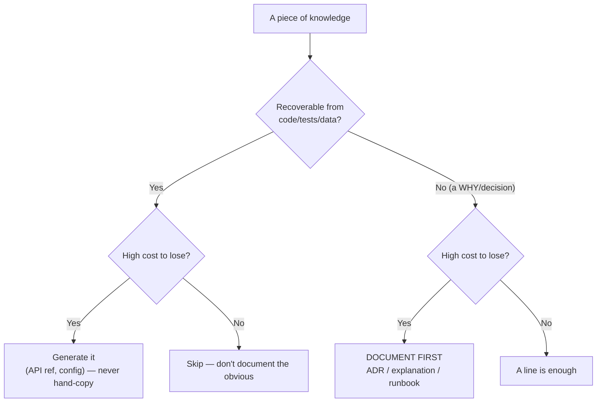
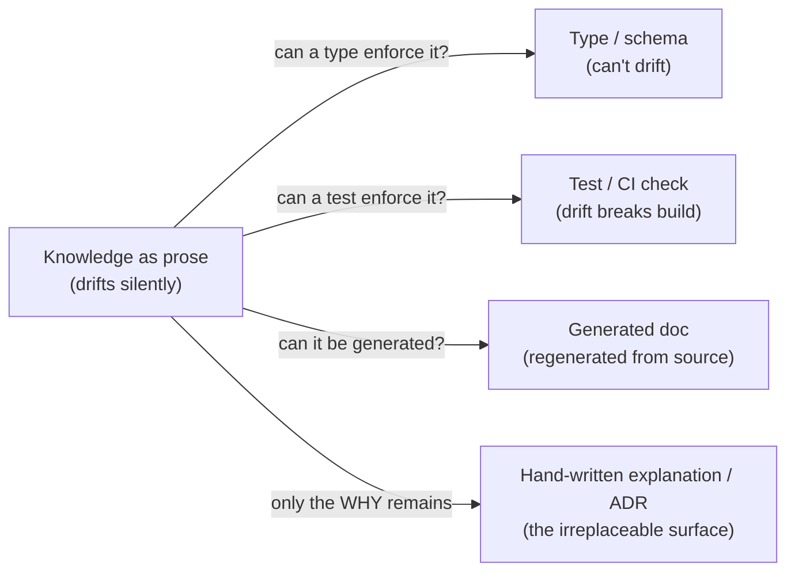

# Why & What to Document — Senior

> **Category:** [Documentation](../README.md) — what an engineer documents, where it belongs, and how to keep it alive.

> **Prerequisites:** [Junior](junior.md) · [Middle](middle.md)
> **Focus:** **Documentation strategy** and **system-level reasoning**

---

## Table of Contents

1. [Introduction](#introduction)
2. [Documentation as Risk Management](#documentation-as-risk-management)
3. [Diátaxis at the System Level: Architecture, Not Just Pages](#diataxis-at-the-system-level-architecture-not-just-pages)
4. [Comparing Documentation Philosophies](#comparing-documentation-philosophies)
5. [The Economics of the Why: Decision Capture as Compounding Asset](#the-economics-of-the-why-decision-capture-as-compounding-asset)
6. [Documentation as a Liability](#documentation-as-a-liability)
7. [Single Source of Truth and Generated Documentation](#single-source-of-truth-and-generated-documentation)
8. [Choosing What to Document at Scale](#choosing-what-to-document-at-scale)
9. [Pros & Cons at the System / Org Level](#pros--cons-at-the-system--org-level)
10. [Diagrams](#diagrams)
11. [Related Topics](#related-topics)

---

## Introduction

> Focus: **documentation strategy** and **system-level reasoning**

At junior and middle levels, "what to document" is decided one doc at a time. At the senior level it becomes a **strategy question for a system and an organization**: which knowledge is load-bearing, which is reproducible from source, which is so volatile that documenting it is a liability, and where the documentation *architecture* (not individual pages) should live. The four Diátaxis modes stop being a writing template and become a way to reason about whether a *whole product's* documentation has structural gaps.

Three hard questions define the senior view:

1. **What is the actual asset documentation creates, and how do you decide what's worth the standing liability?** (Answer: it's risk management — you document where the cost of *not* knowing is high and the knowledge is *unrecoverable* from code.)
2. **When is the right answer to write *no* prose at all** — to generate, to enforce in code, or to delete? (The liability framing.)
3. **How do you make a "what to document" decision survive contact with an org of hundreds of engineers and years of change?**

---

## Documentation as Risk Management

The senior reframing of "why document" is precise: **documentation is insurance against the loss of knowledge that is expensive to lose and impossible to reconstruct.** That single sentence tells you both *what* to document and *how much*.

Every piece of knowledge in a system sits on two axes:

- **Recoverability** — can a competent engineer reconstruct it from the code/tests/data? (The *what/how* usually can be; the *why* usually cannot.)
- **Cost-of-loss** — what does the org pay when this knowledge is gone? (A trivial helper: nearly nothing. A payment-rounding rule's rationale: a compliance incident.)

```
              high cost-of-loss
                     ▲
   DOCUMENT          │   DOCUMENT
   (recoverable but  │   (irrecoverable AND
    costly to redo:  │    costly: the WHY of
    runbooks)        │    critical decisions) ← top priority
  ───────────────────┼───────────────────────►  irrecoverable
   SKIP / GENERATE    │   DOCUMENT LIGHTLY
   (recoverable, low  │   (irrecoverable but low
    stakes: trivial   │    stakes: a one-off
    CRUD)             │    naming choice — a line)
                     │
              low cost-of-loss
```

The top-right quadrant — **knowledge that is both irrecoverable and expensive to lose** — is where senior documentation effort concentrates: the *why* behind critical decisions, the surprises that cause incidents, the contracts many teams depend on. The bottom-left — recoverable, low-stakes — is where over-documentation wastes money and breeds rot. This is "decisions, interfaces, surprises" derived from first principles: those three categories are precisely the high-cost, low-recoverability knowledge.

> "Document everything" and "the code is the documentation" are both wrong because both ignore the two axes. The senior question is never "should we document?" but "*is this knowledge expensive to lose and hard to recover — and if so, where does it live so it survives?*"

---

## Diátaxis at the System Level: Architecture, Not Just Pages

Daniele Procida's framework is usually taught as a per-page rule ("don't mix modes in one doc"). At the senior level its higher value is as a **diagnostic for an entire documentation estate.** A product's docs have a *shape*, and the four quadrants reveal its structural defects:

| Quadrant gap | Symptom in the org | Who suffers |
|---|---|---|
| Missing **tutorials** | High drop-off for new users/contributors; "I couldn't get started" | Adoption, onboarding |
| Missing **how-to guides** | Same task questions recur in support/Slack forever | Support load, expert interrupts |
| Missing **reference** | Consumers guess the contract, integrate wrong, file bugs | API consumers, support |
| Missing **explanation** | Decisions re-litigated; maintainers "fix" things that were deliberate | Maintainers, velocity |
| **Mixed** modes everywhere | Docs exist but nobody trusts or finds them | Everyone — silent failure |

A senior reviewing a documentation strategy does *not* count pages; they ask whether each *quadrant* is served for each *audience*, and whether the *information architecture* enforces the separation (folder structure, navigation, templates) rather than relying on every author to remember it. Diátaxis is most powerful as an *organizing constraint on the doc system* — make the wrong thing hard to write (a `reference/` folder full of tutorials is structurally obvious in review) — not as etiquette.

> The senior insight: **a documentation estate fails the same way a codebase does — by accreting un-separated concerns.** Diátaxis is the modularity principle for docs. Apply it to the architecture, not just the paragraph.

---

## Comparing Documentation Philosophies

Seniors must locate "document decisions/interfaces/surprises + Diátaxis" against the competing philosophies the industry actually holds, and know each one's failure mode.

| Philosophy | Core claim | Where it's right | Where it fails |
|---|---|---|---|
| **"Code is the documentation"** (extreme agile) | Clean, tested code + good names need no docs | *What/how* of internals; reduces low-value docs | Loses *why* entirely; ignores users, operators, consumers who never read the code |
| **"Document everything"** (heavyweight/waterfall) | Comprehensive specs and manuals up front | Regulated, safety-critical, contract-bound systems | Massive rot; specs diverge from reality; reader can't find the live doc |
| **Diátaxis** (Procida) | Four reader-needs, kept separate | The *structure* of user-facing docs | Says *how to organize*, not *how much* or *which decisions* to record |
| **Minimum viable docs** (Google) | Least doc that helps, next to the code | Internal engineering docs at scale | Under-serves external users who need polished tutorials |
| **Docs-as-code** (this roadmap's spine) | Docs in the repo, reviewed, generated, CI-checked | Keeping docs *true*; engineering docs | Doesn't itself tell you *what* to write |
| **Decisions/interfaces/surprises** (engineering instinct) | Record the high-cost, irrecoverable knowledge | Triaging *what* under pressure | Silent on user-facing tutorials and reference polish |

These are **not mutually exclusive — they answer different questions.** Diátaxis answers *how to organize*; minimum-viable answers *how much*; decisions/interfaces/surprises answers *which knowledge*; docs-as-code answers *how to keep it true*. The senior synthesis is to compose them: *use Diátaxis to structure, decisions/interfaces/surprises to triage, minimum-viable to bound the volume, and docs-as-code to keep it alive.* The two genuine *extremes* to reject are pure "code is the docs" (loses the *why*) and pure "document everything" (drowns in rot).

---

## The Economics of the Why: Decision Capture as Compounding Asset

The single highest-return documentation is the **captured decision** — the *why* behind a choice — and the reason is economic, not aesthetic.

The cost/value curve of a decision's rationale is sharply time-asymmetric:

- **At decision time:** capturing it costs *minutes* — you already hold the full context, the alternatives, the constraints.
- **Six months later:** reconstructing it costs *hours to days* (archaeology through git, Slack, and memory) and is often *impossible* — the person left, the context evaporated, the alternative that was rejected is invisible.



This asymmetry is *why* the most valuable engineering documentation pattern is the [Architecture Decision Record](../05-architecture-decision-records-adrs/junior.md): a tiny, append-only, decision-time record of *what we chose, what we rejected, and why.* It compounds: each ADR prevents a future re-litigation or a wrong "fix," and the value accrues across every engineer who would otherwise have re-asked the question.

The senior corollary for *what* to document: **the why is the only documentation whose cost rises and whose recoverability falls over time.** Reference can be regenerated from code anytime; a tutorial can be rewritten; but a rationale not captured at the moment of decision is frequently gone for good. Therefore, of all documentation, the *why* is the one to never defer — even when everything else can wait.

---

## Documentation as a Liability

Junior engineers see docs as an unalloyed good. Seniors hold the harder truth: **every document is a standing liability, and some documentation is net-negative.** A doc must be *maintained, trusted, and found*; failing any of the three makes it a cost.

The liabilities, precisely:

### Liability 1 — Stale docs are worse than none

A missing doc sends the reader to the source (slow, correct). A *wrong* doc sends them confidently to the wrong action. The expected cost of a doc is `P(read) × (value_if_true − P(stale) × cost_of_misleading)`. Once `P(stale)` is high and `cost_of_misleading` is high, the term goes *negative* — the doc should be deleted, not "improved someday." Seniors delete stale docs without ceremony; an honest blank is better than a confident lie.

### Liability 2 — Documentation that should have been code

Knowledge encoded as prose that *could* have been enforced by the type system, a schema, a test, or a generator is a liability: prose can't be checked and will drift. "Always pass cents, never floats" in a wiki rots; a `Money` type that *makes floats impossible* never does. The senior move is to **push knowledge down the reliability stack**: prefer a test over a doc, a type over a comment, a generated reference over a hand-written one. Document only what *cannot* be expressed more reliably as code.

```
   MOST RELIABLE  ┌─ type system / compiler  (can't drift)
        ▲         ├─ tests / CI checks       (drift fails the build)
        │         ├─ generated docs          (regenerated from source)
        ▼         └─ hand-written prose       (drifts silently) ── LEAST RELIABLE
   Prefer the highest rung that can carry the knowledge.
```

### Liability 3 — The illusion of coverage

A large doc set *feels* like good documentation while masking the one missing runbook or the absent *why*. Volume is mistaken for coverage; the org believes it's well-documented and is blindsided in an incident. The defense is auditing by audience × Diátaxis quadrant, not by page count.

### Liability 4 — Documentation that ossifies bad design

Heavily documenting a confusing interface invests in keeping it confusing — the docs become a reason *not* to fix the design ("but it's all documented"). Sometimes the right answer to "this needs a lot of documentation to use" is *make the thing simpler*, not *write more docs*. Hard-to-document is often a design smell.

---

## Single Source of Truth and Generated Documentation

The senior strategy for fighting the liabilities above is **single source of truth (SSoT)**: each piece of knowledge has exactly one authoritative home, and everything else is *generated from* or *links to* it — never copied.

- **API reference** generated from the code/OpenAPI spec, not hand-written, so it cannot drift from the implementation. (See [API & Reference Docs](../04-api-and-reference-documentation/junior.md).)
- **Config/flag lists, enums, supported-version tables** generated from the source declarations.
- **Diagrams as code** (Mermaid/PlantUML/C4) versioned beside the code so they review and update with it. (See [Diagrams as Code](../08-diagrams-as-code/junior.md).)
- **The *why*** — the one thing that *cannot* be generated, because it lives in human judgement — is the part you write by hand, in ADRs/explanations, and the part worth the maintenance.

The principle inverts the naive "what to document": **document by hand only what cannot be generated or enforced; generate everything that can be.** The hand-written surface shrinks to exactly the irrecoverable knowledge — which is also the cheapest surface to keep true. This is how a senior reconciles "documentation is a liability" with "the *why* must be captured": minimize the liability surface to just the irreplaceable part.

---

## Choosing What to Document at Scale

In a large org, "what to document" must be a *policy*, because individual judgement won't be uniform across hundreds of engineers. The senior establishes defaults:

1. **Every irreversible/cross-team decision gets an ADR.** (One-way doors: schemas, public contracts, protocols — the same set that demands up-front design also demands recorded rationale.)
2. **Every published interface gets generated reference.** No hand-maintained API docs in new code.
3. **Every on-call service gets a runbook** before it's allowed in the on-call rotation. (See [Runbooks](../07-runbooks-and-operational-docs/junior.md).)
4. **Every surprise gets a co-located note** — a comment or a doc next to the code, never a remote wiki.
5. **Tutorials and polished how-tos are written for *external* or *high-traffic* surfaces only** — internal, low-traffic code stops at reference + the *why*.

The meta-principle: **make the high-value documentation a non-optional part of "done," and make the low-value documentation structurally hard to accumulate.** Policy beats exhortation at scale — "please document" produces nothing or rot; "no service joins on-call without a runbook" produces runbooks.

---

## Pros & Cons at the System / Org Level

| Dimension | Disciplined "document the irrecoverable why + generate the rest" | Naive "document everything" | "Code is the docs" |
|---|---|---|---|
| Cost to write | Low — small hand-written surface | High — comprehensive prose | Near zero |
| Cost to maintain | Low — generated parts self-update; small *why* surface | Very high — constant drift | Zero (nothing to maintain) |
| Bus factor / knowledge retention | High — the *why* is captured | High *if* current; usually rots | **Low** — *why* lost when authors leave |
| Onboarding speed | Fast — tutorials/how-tos where they pay | Slow — can't find the live doc | Slow — must read all the code |
| Risk in incidents | Low — runbooks + recorded surprises | Medium — buried runbooks | High — reverse-engineer under pressure |
| Trust in docs | High — small, current, true | **Low** — readers learn docs lie | N/A — no docs to distrust |
| Best domain | Most engineering orgs | Regulated/contractual (where mandated) | Tiny teams, throwaway code |

The table makes the senior stance precise: the disciplined approach wins on nearly every dimension by *minimizing the hand-written surface to the irrecoverable why and generating the rest*. "Document everything" loses to rot and distrust; "code is the docs" loses the *why* and every reader who isn't a code-reader (users, operators, consumers). Both extremes fail; the composition of Diátaxis + minimum-viable + decisions/interfaces/surprises + docs-as-code wins.

---

## Diagrams

### What to document — the recoverability × cost-of-loss decision



### Push knowledge down the reliability stack



---

## Related Topics

- **The highest-value *why* doc:** [Architecture Decision Records](../05-architecture-decision-records-adrs/junior.md), [Design Docs & RFCs](../06-design-docs-and-rfcs/junior.md).
- **Generate-don't-write:** [API & Reference Docs](../04-api-and-reference-documentation/junior.md), [Diagrams as Code](../08-diagrams-as-code/junior.md), [Docs as Code & Tooling](../10-docs-as-code-and-tooling/junior.md).
- **Keeping the small surface true:** [Keeping Docs Alive & Doc Rot](../11-keeping-docs-alive-and-doc-rot/junior.md).
- **The comment-level *why*:** Clean Code → Comments.
- **Not this roadmap:** the writing *career* → Soft-Skills → Technical Writer.

---


---

## Check your understanding

1. Explain Why & What to Document — Senior Level in your own words and name the problem it solves.
2. How would you apply the ideas around Table of Contents, Introduction, Documentation as Risk Management in a realistic engineering change?
3. What failure mode or misuse should you look for, and what evidence would reveal it?
4. How would you validate a system-level decision about Why & What to Document — Senior Level under uncertainty?
5. What observable result would convince you that the approach improved the system?
