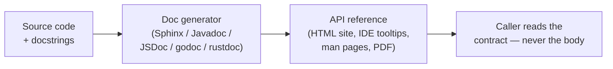
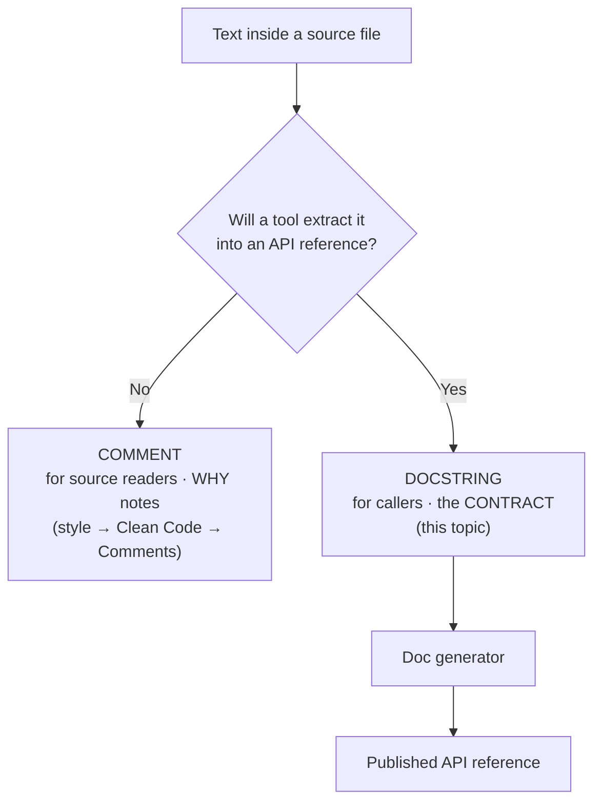

# Code Comments & Docstrings — Junior

> **Category:** [Documentation](../README.md) — writing the docs that live *inside* the code: docstrings that describe a function's contract, and the tooling that turns them into a published API reference.

---

## Introduction

> Focus: **What is it?** and **How to use it?**

There are two kinds of writing that lives inside source files, and beginners blur them constantly:

1. **Comments** — free-text notes for whoever reads the *source code*. They explain a tricky line, a non-obvious decision, a workaround. They are *style* — when to leave one, what to say. That belongs to **Clean Code → Comments**, and this topic deliberately points you there for it.
2. **Docstrings (a.k.a. API doc comments)** — structured documentation attached to a function, class, or module, written in a tool-readable format so a **doc generator** can extract them and publish an **API reference**. A docstring describes the *contract* of a thing — what it does, what it takes, what it returns, what it can throw — for someone who will *call* the code without reading its body.

> **This topic is about the second kind.** A docstring is not "a comment that happens to be at the top of a function." It is a *first-class, generated artifact*: you write it once, in code, and a tool turns it into searchable HTML, IDE tooltips, and `--help` text.

### Why this matters

The body of a function tells you *how* it works. Its docstring tells you *how to use it without reading the how*. The whole point of a library — `requests`, the Java standard library, `lodash`, Go's `net/http` — is that you call it from its documented contract and never open its source. That documented contract is the docstrings, rendered by a generator. Get docstrings right and your code becomes usable by people who will never read it. Get them wrong (or omit them) and every caller has to reverse-engineer your function from its implementation.

---

## Prerequisites

- **Required:** You can write functions, classes, and modules in at least one language, and you understand parameters, return values, and exceptions/errors.
- **Required:** You can run a command-line tool and read its output (you'll run a doc generator).
- **Helpful:** Exposure to a public library's online API reference (e.g., docs.python.org, the Javadoc for `java.util.List`, pkg.go.dev). That *is* generated docstring output — you've been reading docstrings for years without knowing it.
- **Helpful:** A feel for [why and what to document](../01-why-and-what-to-document/junior.md) — docstrings are the "reference" slice of that bigger picture.

---

## Glossary

| Term | Definition |
|------|-----------|
| **Comment** | Free-text note in source for a code *reader*; about style/intent of a specific line or block. (Style → Clean Code → Comments.) |
| **Docstring / doc comment** | Structured documentation attached to a declaration (function, class, module) in a tool-readable format, intended to be *extracted* and published. |
| **API reference** | The generated, browsable catalog of every public function/type and its docstring — the "reference" doc type. |
| **Doc generator** | A tool that reads source + docstrings and emits a reference site / IDE data (Sphinx, Javadoc, JSDoc, godoc, rustdoc, Doxygen). |
| **Contract** | What a function promises: inputs (preconditions), output (postconditions), errors it raises, units, nullability, thread-safety. |
| **Doc-test** | An example *inside* a docstring that a test runner executes, so the example can't silently go stale (Python `doctest`, Rust doc-tests). |
| **Doc rot** | Documentation that has drifted out of sync with the code it describes — the chronic failure mode of all docs. |
| **Self-documenting code** | Code clear enough (from names and structure) that it needs no comment to explain *what* it does. |

---

## Comments vs. Docstrings: the One Distinction to Get Right

```text
  COMMENT                                   DOCSTRING
  ───────────────────────────────────       ─────────────────────────────────────
  audience: someone reading the SOURCE       audience: someone CALLING the function
  format:   free text (// or #)              format:   structured, tool-readable
  purpose:  explain a tricky line / WHY      purpose:  describe the public CONTRACT
  output:   read in-place, never extracted   output:   EXTRACTED into an API reference
  lives in: anywhere (inline, block)         lives in: attached to a declaration
  covered in: Clean Code → Comments          covered in: THIS topic
```

A quick test: *"Will a tool pull this text out and put it on a docs website / in an IDE tooltip?"* If yes, it's a docstring and it must follow a convention. If it's just there to help the next person reading line 42, it's a comment.

```python
def withdraw(self, amount: Decimal) -> Decimal:
    """Debit `amount` from the account and return the new balance.    # ← DOCSTRING

    Raises:
        InsufficientFunds: if `amount` exceeds the available balance.
    """
    # We lock the row pessimistically here because two ATMs can hit the   # ← COMMENT
    # same account at once; optimistic retry caused double-spends in 2023.  (a WHY note)
    with self._row_lock():
        ...
```

The docstring is the contract a caller reads in the generated reference. The `#` comment is a *why* note for a maintainer reading the body — and its style (when to write it, how to phrase it) is the subject of **Clean Code → Comments**, not this file.

---

## Comment Philosophy in Brief

We cover this only enough to set the stage; the depth lives in **Clean Code → Comments**.

> **Comment *why*, not *what*.** The code already says what it does. A comment earns its place by explaining the *reason* — a non-obvious decision, a workaround, a constraint the code can't express.

```python
# BAD — restates the code (the "what"). Noise.
i += 1          # increment i

# GOOD — explains the "why" the code can't.
# Skip the header row; the export tool emits one even for empty result sets.
i += 1
```

The governing idea: **prefer self-documenting code to comments.** A good name beats a comment that explains a bad one.

```python
# Needs a comment because the name hides intent:
d = days * 86400          # convert days to seconds

# Needs no comment — the name IS the explanation:
SECONDS_PER_DAY = 86400
total_seconds = days * SECONDS_PER_DAY
```

A useful (if slightly overstated) framing: **a comment is an apology for code that isn't clear enough.** Don't be an absolutist about it — some *why* genuinely needs prose (a regulation, a hardware quirk, a "we tried the obvious thing and it broke"). But reach for a clearer name or a smaller function first.

**Comment smells** (the things to *delete*, covered fully in Clean Code → Comments):

| Smell | Example | Fix |
|---|---|---|
| **Redundant** | `i++ // add one to i` | Delete it. |
| **Outdated** | A comment describing logic that changed two refactors ago | Delete or correct it. |
| **Commented-out code** | A block of dead code "in case we need it" | Delete it — that's what version control is for. |
| **Noise** | `// constructor` above a constructor | Delete it. |

> The line for this topic: we acknowledge comment philosophy, then spend the rest of our energy on **docstrings + generators**, because *that* is the part this topic owns. For everything about inline-comment *style*, go to **Clean Code → Comments**.

---

## What a Docstring Is

A docstring documents the **contract** of a code element so it can be used as a black box. It answers, for a caller who will never read the body:

- **What** does this do? (one-line summary)
- **What** does it take? (each parameter: meaning, type, units, allowed range)
- **What** does it return? (type and meaning)
- **What** can go wrong? (exceptions/errors raised, and when)
- **How** do I call it? (a short example)
- **What** are the caveats? (thread-safety, nullability, side effects, ownership)

The key reframe from comment to docstring: a comment is read *in place*; a docstring is **extracted and republished**. That single fact drives everything — it must follow a convention the generator understands, it must make sense out of context (no "see the comment above"), and it is part of your public API surface.

---

## Docstring Conventions by Language

Every mainstream language has a convention and a tool that reads it. The shape differs but the *intent* is identical: a structured block attached to a declaration.

| Language | Convention | Marker | Tags / structure | Generator |
|---|---|---|---|---|
| **Python** | PEP 257 + a style (Google / NumPy / reST) | `"""triple-quoted string"""` as first statement | `Args:` / `Returns:` / `Raises:` (Google) | Sphinx (autodoc), pdoc |
| **Java** | Javadoc | `/** ... */` above the declaration | `@param`, `@return`, `@throws`, `@deprecated` | `javadoc` tool |
| **JS / TS** | JSDoc / TSDoc | `/** ... */` above the declaration | `@param`, `@returns`, `@throws` (types often inferred in TS) | JSDoc, TypeDoc |
| **Go** | godoc convention | `// ...` directly above the declaration | full sentences, *starting with the identifier name* | `go doc`, pkg.go.dev |
| **Rust** | rustdoc | `///` above the declaration (Markdown) | `# Examples`, `# Panics`, `# Errors` sections | `rustdoc` (`cargo doc`) |
| **C#** | XML doc comments | `/// ...` above the declaration | `<summary>`, `<param>`, `<returns>`, `<exception>` | DocFX, Sandcastle |

Two conventions to memorize because their *rules* trip up beginners:

- **Python:** the docstring must be the **first statement** in the module/function/class — a string literal, not a `#` comment. `def f(): # docs` is a comment; `def f(): """docs"""` is a docstring.
- **Go:** the doc comment is a plain `//` comment placed **immediately above** the declaration with no blank line, and by convention it is a **full sentence that begins with the name being documented** (`// Withdraw debits ...`). That phrasing is not a quirk — godoc renders it directly.

---

## Anatomy of a Good Docstring

Here is the same well-formed contract in four languages. Notice they all carry the *same* information; only the syntax changes.

### Python (Google style)

```python
def withdraw(account_id: str, amount: Decimal) -> Decimal:
    """Debit an amount from an account and return the new balance.

    Args:
        account_id: The account to debit. Must reference an existing account.
        amount: Money to withdraw, in the account's currency. Must be > 0.

    Returns:
        The account's new balance after the debit.

    Raises:
        AccountNotFound: If `account_id` does not exist.
        InsufficientFunds: If `amount` exceeds the available balance.
    """
```

### Java (Javadoc)

```java
/**
 * Debits an amount from an account and returns the new balance.
 *
 * @param accountId the account to debit; must reference an existing account
 * @param amount    money to withdraw, in the account's currency; must be > 0
 * @return the account's new balance after the debit
 * @throws AccountNotFoundException  if {@code accountId} does not exist
 * @throws InsufficientFundsException if {@code amount} exceeds the balance
 */
BigDecimal withdraw(String accountId, BigDecimal amount) { ... }
```

### TypeScript (TSDoc)

```typescript
/**
 * Debits an amount from an account and returns the new balance.
 *
 * @param accountId - The account to debit; must reference an existing account.
 * @param amount - Money to withdraw, in the account's currency; must be > 0.
 * @returns The account's new balance after the debit.
 * @throws {InsufficientFundsError} If `amount` exceeds the available balance.
 */
function withdraw(accountId: string, amount: number): number { ... }
```

### Go (godoc convention)

```go
// Withdraw debits amount from the account identified by accountID and
// returns the new balance. amount must be positive.
//
// It returns ErrAccountNotFound if the account does not exist, and
// ErrInsufficientFunds if amount exceeds the available balance.
func Withdraw(accountID string, amount Money) (Money, error) { ... }
```

In Go there are no `@param` tags — the convention is well-written full sentences, starting with the function name, that godoc renders verbatim. Errors are documented in prose because Go returns them as values.

---

## Bad Docstring vs. Good Docstring

The single most common junior mistake is a docstring that just *restates the signature* — it adds zero information a reader couldn't get from reading the function name and parameters.

```python
# BAD — restates the signature; useless. (And note: it documents "the what"
# that the code already shows.)
def transfer(src, dst, amount):
    """Transfer.

    Args:
        src: the src
        dst: the dst
        amount: the amount
    """

# GOOD — documents the CONTRACT a caller can't see from the signature.
def transfer(src: str, dst: str, amount: Decimal) -> None:
    """Move money from one account to another, atomically.

    Both accounts are locked for the duration; the debit and credit either
    both succeed or both roll back. `amount` is in the source account's
    currency and must be positive.

    Raises:
        InsufficientFunds: if `src` lacks the balance (nothing is moved).
        CurrencyMismatch:  if `src` and `dst` hold different currencies.
    """
```

The good version tells you the things you *cannot* infer from `transfer(src, dst, amount)`: it's atomic, both accounts lock, the currency and sign rules, and exactly what happens on failure (nothing is moved). **That** is what a docstring is for.

> The test for a docstring line: *"Could the reader have known this from the signature alone?"* If yes, delete the line. If no, it's earning its place.

---

## Doc Generators: From Source to a Reference Site

A docstring is raw material. A **doc generator** is the machine that turns it into the API reference your users actually read. The pipeline is the same everywhere:



| Generator | Ecosystem | What it reads | Produces |
|---|---|---|---|
| **Sphinx** (with `autodoc`) | Python | docstrings (reST/Google/NumPy) | HTML site (Read the Docs), PDF |
| **Javadoc** | Java | `/** */` Javadoc comments | HTML API reference |
| **JSDoc / TypeDoc** | JS / TypeScript | JSDoc/TSDoc comments + TS types | HTML site |
| **godoc / pkg.go.dev** | Go | `//` doc comments | the package page on pkg.go.dev |
| **rustdoc** (`cargo doc`) | Rust | `///` Markdown doc comments | HTML site, *runs doc-tests* |
| **Doxygen** | C / C++ / many | structured comments | HTML, LaTeX, call graphs |
| **DocFX** | C# / .NET | XML doc comments | docs site |

The reference site a generator produces is the **"reference" mode** of documentation — terse, complete, lookup-oriented. (Reference is one of four doc types in the Diátaxis model; see [Why & What to Document](../01-why-and-what-to-document/junior.md) and [API & Reference Documentation](../04-api-and-reference-documentation/junior.md).) You usually don't *write* a reference site by hand — you write good docstrings and let the generator build it.

### Try it (Go, zero install)

```bash
# In any Go module, see the generated reference from your doc comments:
go doc ./...            # one-line summaries for the package
go doc YourType.Method  # the full doc comment for one declaration
```

That output *is* your docstrings, extracted. The same text appears on pkg.go.dev when you publish.

---

## Doc-Tests: Documentation That Can't Lie

The deepest problem with examples in docs is that they **rot** — the API changes, the example doesn't, and now your docs actively lie. **Doc-tests** solve this: the example lives *in the docstring* and is **executed by the test runner**, so a stale example fails CI.

### Python `doctest`

```python
def slugify(title: str) -> str:
    """Turn a title into a URL slug.

    >>> slugify("Hello, World!")
    'hello-world'
    >>> slugify("  Trailing  spaces ")
    'trailing-spaces'
    """
    return "-".join(title.lower().split())  # (bug: doesn't strip punctuation)
```

Run it:

```bash
python -m doctest module.py -v
```

The first example **fails** (`'hello,-world!'` ≠ `'hello-world'`), exposing the bug *and* the fact that the docstring promised behavior the code doesn't deliver. The example and the code are now forced to agree.

### Rust doc-tests

```rust
/// Returns the slug form of a title.
///
/// # Examples
/// ```
/// assert_eq!(mycrate::slugify("Hello World"), "hello-world");
/// ```
pub fn slugify(title: &str) -> String { /* ... */ }
```

`cargo test` runs that fenced code block as a real test. Rust treats doc examples as part of the test suite by default — your docs literally cannot drift from the API without turning the build red.

> Doc-tests are the antidote to doc rot for examples: docs that are *verified*, not just *written*. More on fighting rot in [Keeping Docs Alive & Doc Rot](../11-keeping-docs-alive-and-doc-rot/junior.md).

---

## Best Practices

1. **Document the contract, not the implementation.** Inputs, output, errors, units, side effects — the things a caller can't see. Leave the *how* to the code.
2. **Write the one-line summary first.** A single imperative sentence ("Debit an amount and return the new balance") that fits in an IDE tooltip.
3. **Don't restate the signature.** If a line could be inferred from the name and types, cut it.
4. **Follow your language's convention exactly** so the generator can parse it (PEP 257 / Javadoc tags / godoc full sentences / TSDoc).
5. **Document every public thing; relax for private internals.** Public API gets full docstrings; a private one-line helper often needs none.
6. **Prefer doc-tested examples** where the language supports them (Python `doctest`, Rust doc-tests) — they can't go stale.
7. **For inline comment *style*, defer to Clean Code → Comments.** This topic owns docstrings; that one owns comments.

---

## Common Mistakes

1. **Confusing comments with docstrings.** Putting the contract in a `#` comment the generator won't extract, or putting a *why* note in the docstring where callers don't need it.
2. **Restating the signature.** `amount: the amount`. Pure noise that wastes the reader's attention.
3. **Documenting the *how*.** "Loops over the list and sums the prices" — the body shows that; document *what* it returns and when it throws.
4. **Wrong placement (Python/Go).** A `#` comment instead of a `"""docstring"""`; a Go doc comment with a blank line above the `func` (godoc won't attach it).
5. **Examples that lie.** A hand-written example that no longer runs. Use doc-tests so it can't.
6. **Over-documenting trivial getters.** `"""Return the name."""` on `get_name()` is noise; the signature already says it.
7. **Forgetting errors.** The most-omitted and most-needed part of a contract: *what exceptions can this raise, and when?*

---

## Tricky Points

- **A docstring is part of your public API.** Changing what it promises is a contract change, like changing a parameter — callers depend on it.
- **Python: it must be a string literal, first statement.** `def f(): "docs"` works; `def f(): # docs` does not — that's a comment the generator ignores.
- **Go: phrasing is the convention.** Start the comment with the identifier and write full sentences; godoc renders it as-is, so "increments the counter" reads worse than "Increment increments the counter."
- **TypeScript: don't repeat types in JSDoc.** TS already knows the types; `@param {string} name` duplicates what the compiler enforces. Document *meaning*, not type.
- **Doc-tests are tests.** A failing `doctest` should fail your build. If they're not run in CI, they rot like any other example.

---

## Test Yourself

1. In one sentence each, distinguish a *comment* from a *docstring* by audience and output.
2. State the comment philosophy in five words.
3. Name four things a good docstring documents that a reader *can't* see from the signature.
4. Why is "restates the signature" the cardinal docstring sin?
5. What does a doc generator do, and name one for Python, Java, and Go.
6. What problem do doc-tests solve, and name two languages that support them.
7. In Go, where does the doc comment go and how should its first word read?

---

## Cheat Sheet

```text
COMMENT vs DOCSTRING
  comment    → for SOURCE readers, free text, explains WHY, not extracted
  docstring  → for CALLERS, structured, describes the CONTRACT, EXTRACTED

COMMENT PHILOSOPHY (depth → Clean Code → Comments)
  comment WHY not WHAT · self-documenting code first · delete: redundant,
  outdated, commented-out, noise

DOCSTRING = the CONTRACT
  summary · params (meaning/units/range) · returns · errors-and-when
  · example · caveats (thread-safety, nullability, side effects)
  RULE: never restate the signature; document what the caller can't see

CONVENTIONS
  Python  """first statement""" (PEP 257; Google/NumPy/reST)
  Java    /** */  @param @return @throws
  JS/TS   /** */  JSDoc/TSDoc (don't repeat TS types)
  Go      // above decl, full sentence starting with the Name
  Rust    /// markdown, # Examples / # Panics / # Errors
  C#      /// XML <summary><param><returns><exception>

GENERATORS:  Sphinx · Javadoc · JSDoc/TypeDoc · godoc · rustdoc · Doxygen · DocFX
DOC-TESTS:   Python doctest · Rust doc-tests  → examples that CAN'T rot (run in CI)
```

---

## Summary

- Source files contain two different things: **comments** (free text for *readers*, style covered in Clean Code → Comments) and **docstrings** (structured contracts for *callers*, extracted by a generator — the subject of this topic).
- The comment philosophy in brief: **comment *why*, not *what***; prefer self-documenting code; delete redundant/outdated/commented-out/noise comments.
- A **docstring documents the contract**: summary, params (with units/ranges), return, errors-and-when, example, caveats — never restating the signature.
- Every language has a **convention + generator**: PEP 257/Sphinx, Javadoc, JSDoc/TypeDoc, godoc, rustdoc, Doxygen, DocFX. The generated reference is Diátaxis's "reference" mode.
- **Doc-tests** (Python `doctest`, Rust doc-tests) make examples *executable*, so they can't rot.

---

## Further Reading

- [PEP 257 — Docstring Conventions](https://peps.python.org/pep-0257/) (Python).
- [Effective Go — Commentary](https://go.dev/doc/effective_go#commentary) and *Go Doc Comments* (the godoc convention).
- Oracle, *How to Write Doc Comments for the Javadoc Tool*.
- [TSDoc](https://tsdoc.org/) and the [JSDoc](https://jsdoc.app/) reference.
- The [Rust API Guidelines — Documentation](https://rust-lang.github.io/api-guidelines/documentation.html).
- [Diátaxis](https://diataxis.fr/) — the four doc types (reference is what generators produce).

---

## Related Topics

- **Comment *style* (deferred here):** Clean Code → Comments
- **The bigger picture:** [Why & What to Document](../01-why-and-what-to-document/junior.md)
- **Where reference docs live:** [API & Reference Documentation](../04-api-and-reference-documentation/junior.md)
- **Keeping them truthful:** [Keeping Docs Alive & Doc Rot](../11-keeping-docs-alive-and-doc-rot/junior.md)

---

## Diagrams

### The two kinds of in-code writing




---

## Check your understanding

1. Explain Code Comments & Docstrings — Junior Level in your own words and name the problem it solves.
2. How would you apply the ideas around Table of Contents, Introduction, Prerequisites in a realistic engineering change?
3. What failure mode or misuse should you look for, and what evidence would reveal it?
4. What small example would prove that you can apply Code Comments & Docstrings — Junior Level correctly?
5. What observable result would convince you that the approach improved the system?
