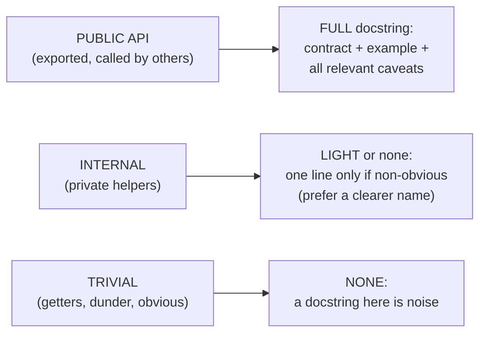
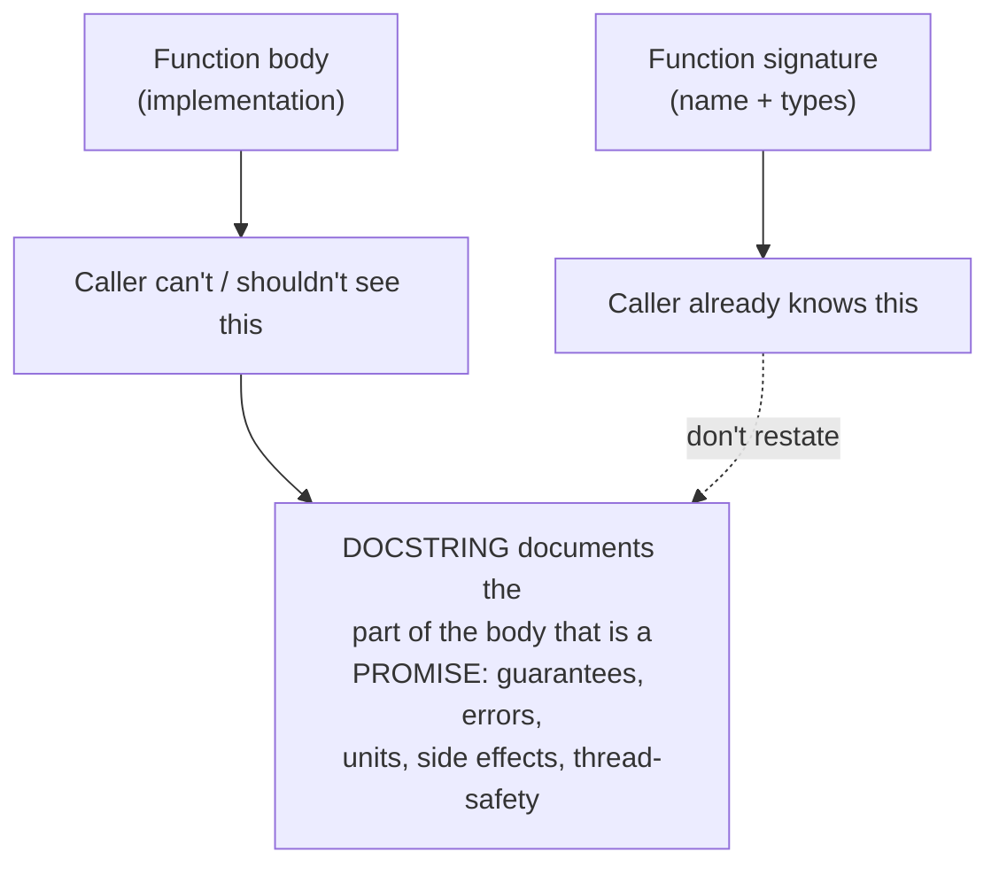
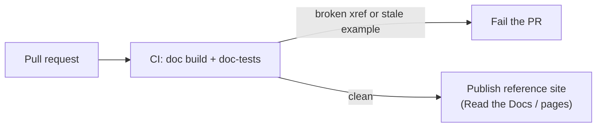

# Code Comments & Docstrings — Middle

> **Category:** [Documentation](../README.md) — docstrings as the generated API-reference layer, and the judgement of *what* to put in a contract vs. *what* to leave to the code.

> **Prerequisite:** [Junior](junior.md)
> **Focus:** **Why** and **When**

---

## Introduction

> Focus: **Why** and **When**

At the junior level you learned *what* a docstring is and *how* to format one per language. The middle-level skill is **judgement**: deciding which facts belong in the contract, which style to standardize on, how much to document for whom, and how to wire the generator so docstrings become a living reference instead of dead text.

The recurring tension is between **two failure modes**, exactly mirroring the under/over-design split:

- **Under-documentation** — public functions with no docstring, errors undocumented, units implicit. Callers reverse-engineer the contract from the body.
- **Over-documentation** — a paragraph on every trivial getter, every type repeated in prose, generated reference sites bloated with `"""Return the id."""` noise that buries the three docstrings that matter.

The middle engineer calibrates: **full contracts on the public surface, restraint on the trivial and internal.** The single best calibration question is the one from junior, applied relentlessly: *"Could the caller have known this from the signature alone?"*

---

## Applying Docstrings: Choosing the Right Style

In Python especially, you must pick *one* docstring style and standardize on it, because the generator parses a specific grammar. The three live options:

| Style | Looks like | Strength | Generator fit |
|---|---|---|---|
| **Google** | `Args:` / `Returns:` / `Raises:` indented blocks | Most readable as raw source | Sphinx (via `napoleon`), pdoc |
| **NumPy** | `Parameters` / `Returns` under dashed underlines | Best for math/scientific APIs, long param docs | Sphinx (`napoleon`), used by SciPy/pandas |
| **reStructuredText** | `:param x:` / `:returns:` / `:raises:` field lists | Native Sphinx, most powerful cross-refs | Sphinx (no plugin) |

```python
# Google style — what most non-scientific Python codebases pick
def resize(image: Image, width: int, height: int) -> Image:
    """Return a new image scaled to the given dimensions.

    Args:
        image: Source image; not mutated.
        width: Target width in pixels. Must be > 0.
        height: Target height in pixels. Must be > 0.

    Returns:
        A new Image of size (width, height). Aspect ratio is NOT preserved.

    Raises:
        ValueError: If width or height is <= 0.
    """
```

The choice matters less than the *consistency*: a generator configured for Google style silently mis-renders a reST docstring. Pick one in a style guide and lint for it. (Java/Go/Rust don't have this fork — there's one canonical convention each.)

### TSDoc: document meaning, never types

```typescript
// BAD — duplicates what TypeScript already enforces
/**
 * @param {string} userId - the user id   // the {string} is redundant noise
 */

// GOOD — TS owns the type; the docstring owns the MEANING
/**
 * @param userId - Stable opaque identifier; never the email. Used as the cache key.
 */
```

In typed languages (TS, Java with generics, Rust), the type system already carries the type. The docstring's job is the *semantics* the type can't express: "stable", "opaque", "never the email", "used as the cache key".

---

## Documenting the Contract, Not the Implementation

The deepest middle-level principle: **a docstring describes the contract; the body describes the implementation.** If your docstring narrates the algorithm, two things go wrong — it duplicates the code (doc rot waiting to happen) and it omits what the caller actually needs (the guarantees).

```python
# BAD — documents the HOW. Rots the moment you change the algorithm,
# and tells the caller nothing about the guarantees.
def dedupe(items):
    """Loop over items, put each into a set, then convert back to a list."""

# GOOD — documents the WHAT and the guarantees the caller depends on.
def dedupe(items: list[T]) -> list[T]:
    """Return items with duplicates removed, preserving first-seen order.

    Elements must be hashable. The input is not mutated. O(n) expected.
    """
```

The good version commits to a contract — *first-seen order is preserved*, *input not mutated*, *elements must be hashable* — that the caller can rely on and that you must not break, even if you later swap the implementation. The bad version pins you to a `set`, leaks an irrelevant detail, and is silent on the one guarantee callers care about (ordering).

### The contract checklist

A complete contract covers, *where applicable*:

| Aspect | Question it answers | Example |
|---|---|---|
| **Preconditions** | What must be true of inputs? | "`amount` must be > 0", "list must be sorted" |
| **Postconditions** | What's guaranteed about the output? | "preserves first-seen order", "returns a new list" |
| **Errors** | What's raised, and exactly when? | "`KeyError` if id is unknown" |
| **Units** | What unit/scale is this value? | "timeout in **milliseconds**", "price in cents" |
| **Side effects** | What changes outside the return? | "writes to the audit log", "mutates `cache`" |
| **Nullability** | Can it be / return null/None? | "returns `None` if not found" |
| **Thread-safety** | Safe to call concurrently? | "not thread-safe; guard with a lock" |
| **Ownership / lifetime** | Who owns / closes / frees this? | "caller must `close()` the returned handle" |

You won't fill in all eight for every function — that would be noise. You fill in the ones that are *non-obvious and load-bearing* for this particular function.

---

## Public API vs. Internal: Where Effort Goes

Documentation effort is a budget. Spend it where the leverage is.



| Code | Documentation level | Why |
|---|---|---|
| Public/exported function, class, package | **Full contract** + example | Strangers depend on it; it's in the published reference |
| Internal helper with subtle behavior | **One-line summary** of the *why* | Maintainers benefit; callers are in-team |
| Trivial getter / obvious helper | **None** | The signature is the documentation; a docstring is noise |
| A module / package | **Module-level docstring** | The "front page" of the generated section — what's this for? |

The asymmetry: a missing docstring on a *public* function costs every external caller; an extra docstring on a *trivial* one costs every reader of the reference site, forever. Over-documenting trivia is the more *common* mistake in mature codebases, because tooling and reviewers nag for "100% docstring coverage" and engineers comply with `"""Return the name."""`. Coverage metrics that count trivial docstrings as wins are measuring the wrong thing — see Quality Engineering → Documentation Quality and [Professional](professional.md).

---

## Wiring a Generator: autodoc and Friends

Docstrings only pay off when a generator publishes them. The middle-level deliverable is a working pipeline. Sphinx + `autodoc` is the canonical Python example:

```python
# docs/conf.py  — Sphinx configuration
extensions = [
    "sphinx.ext.autodoc",    # pull docstrings straight from the source
    "sphinx.ext.napoleon",   # understand Google/NumPy styles (not just reST)
    "sphinx.ext.doctest",    # RUN doctests during the docs build
]
```

```rst
.. automodule:: payments.accounts
   :members:                 # generate a reference page from this module's docstrings
```

```bash
sphinx-build -b html docs/ docs/_build   # source + docstrings -> HTML reference site
sphinx-build -b doctest docs/ /tmp       # also EXECUTE the doctests
```

The same pattern in other ecosystems:

```bash
javadoc -d docs/api src/**/*.java     # Java -> HTML API reference
npx typedoc src/index.ts              # TS -> HTML site (reads TSDoc + types)
cargo doc --no-deps --open            # Rust -> HTML site; `cargo test` runs doc-tests
go doc ./...                          # Go -> terminal; pkg.go.dev on publish
```

The crucial move at this level: **make doc generation part of CI**, not a manual ritual. A docs build that runs on every PR catches broken cross-references and (with doctest/doc-tests) stale examples *before* merge. That's the bridge to [Docs as Code & Tooling](../10-docs-as-code-and-tooling/junior.md).

---

## Trade-offs

| Decision | Lean fuller docstrings | Lean leaner docstrings |
|---|---|---|
| Onboarding / external use | Easier — contract is explicit | Harder — readers reverse-engineer |
| Maintenance burden | Higher — more text to keep truthful | Lower — less to drift |
| Risk of doc rot | Higher (more prose to go stale) | Lower (less to be wrong) |
| Reference-site signal | Risk of noise burying the essentials | Crisp, but may omit needed caveats |
| Best for | Public APIs, libraries, shared modules | Private internals, obvious helpers |

The asymmetry that guides the call: **on the public surface, the cost of a missing contract (every caller pays) outweighs the maintenance cost; on internal trivia, the cost of noise outweighs the documentation benefit.** Spend richly on the public boundary, sparingly inside it.

A second trade-off — **prose examples vs. doc-tests**: a doc-test can't rot but constrains what you can illustrate (it must actually run and assert); a prose example is freer but drifts silently. Prefer doc-tests for the canonical "how to call this", prose for conceptual color.

---

## Edge Cases

### 1. Inherited / overridden methods

An override that doesn't change the contract shouldn't re-document it. In Java, `{@inheritDoc}` pulls the parent's Javadoc; Python's `pydoc`/Sphinx can inherit. Re-stating the parent's contract on every override is duplication that rots independently.

### 2. Generated code

Don't hand-write docstrings on machine-generated code (protobuf stubs, ORM models) — they'll be overwritten on regeneration. Document the *schema source* (the `.proto`, the model definition) and let generation carry it through.

### 3. The example that needs setup

A doc-test that requires a database or network can't run in isolation. Either mock the dependency in the example, mark it `# doctest: +SKIP` (Python) / `no_run` (Rust) — which *shows* the example but doesn't execute it — or move it to an integration test. A skipped example still rots; prefer making it runnable.

### 4. Deprecation

A docstring is where you announce deprecation to callers: `@deprecated` (Javadoc/JSDoc), `.. deprecated::` (Sphinx), `#[deprecated]` (Rust, which the *compiler* enforces with a warning). Say *what to use instead* and *since when*.

---

## Tricky Points

- **A docstring change is an API change.** Tightening a documented precondition or removing a guarantee can break callers who relied on the old contract, even with identical code.
- **Type annotations are not a docstring.** They tell you `amount: int`; they don't tell you it's in **cents** and must be **non-negative**. Document the semantics the type omits.
- **"100% docstring coverage" is a vanity metric.** It rewards `"""Return x."""` on getters. Coverage of the *public surface with real contracts* is what matters, not raw percentage.
- **Doc-tests are tests *and* docs simultaneously** — which means a flaky or environment-dependent doc-test breaks your *docs build*, not just a test. Keep them deterministic.
- **godoc renders the comment, blank-line-sensitively.** A blank line between the doc comment and the `func` detaches it; an indented line in a doc comment becomes a code block. Phrasing and whitespace are semantic in Go.

---

## Best Practices

1. **Standardize one docstring style** (e.g., Google for Python) and lint for it, so the generator parses every file the same way.
2. **Document the contract, not the algorithm** — guarantees the caller relies on, never the implementation steps.
3. **Always document errors** — the most-omitted, most-needed part: what's raised and exactly when.
4. **State units and ranges explicitly** — `milliseconds`, `cents`, `must be > 0`. Implicit units cause real bugs.
5. **Full contracts on the public surface; nothing on trivia.** Spend the budget where strangers call you.
6. **Don't repeat the type** in TSDoc/Java prose — document meaning the type can't carry.
7. **Run doc generation (and doc-tests) in CI** so the reference stays buildable and examples stay truthful.

---

## Test Yourself

1. Name the three Python docstring styles and what a Sphinx plugin (`napoleon`) is for.
2. Why should a docstring document the contract rather than the implementation? Give the failure mode of each.
3. List five aspects of a complete contract beyond "params and return".
4. Where should documentation effort be high, and where should it be near-zero? Why is that the right split?
5. Why is "100% docstring coverage" a misleading goal?
6. In TypeScript, what should a `@param` document and what should it *not*?

---

## Summary

- Pick **one docstring style** per language and lint for it, so the generator parses consistently (Python's Google/NumPy/reST fork is the main place this bites).
- **Document the contract, not the implementation** — preconditions, postconditions, errors, units, side effects, nullability, thread-safety, ownership — only the ones that are non-obvious and load-bearing.
- Spend the documentation budget on the **public surface**; write near-nothing on trivial and internal code. "100% coverage" is a vanity metric.
- In typed languages, the docstring carries **meaning the type can't** — never repeat the type in prose.
- **Wire the generator into CI** (Sphinx autodoc, Javadoc, TypeDoc, rustdoc) and run **doc-tests** so the reference stays buildable and examples stay true.

---

## Diagrams

### Where the contract facts come from



### Docstring → reference pipeline in CI




---

## Check your understanding

1. Explain Code Comments & Docstrings — Middle Level in your own words and name the problem it solves.
2. How would you apply the ideas around Table of Contents, Introduction, Applying Docstrings: Choosing the Right Style in a realistic engineering change?
3. What failure mode or misuse should you look for, and what evidence would reveal it?
4. Which local design trade-off would make you choose or reject Code Comments & Docstrings — Middle Level in an existing codebase?
5. What observable result would convince you that the approach improved the system?
