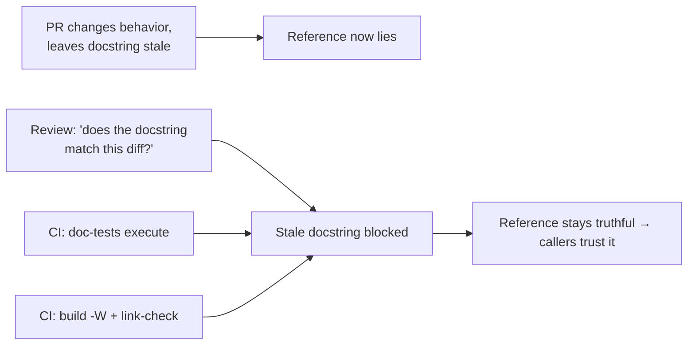
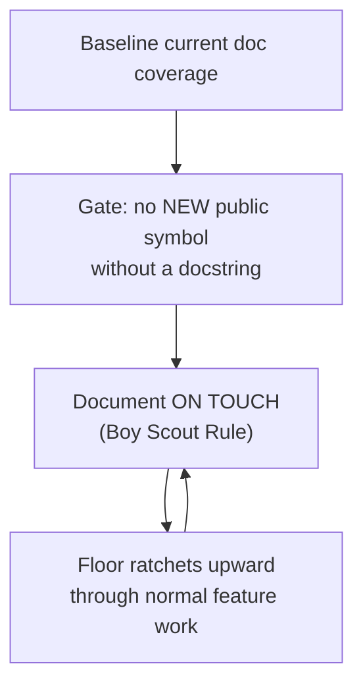

# Code Comments & Docstrings — Professional

> **Category:** [Documentation](../README.md) — sustaining a truthful, generated API reference across a large multi-contributor codebase: review standards, conventions, CI gates, legacy remediation, and the incidents that teach why it matters.

> **Prerequisites:** [Junior](junior.md) · [Middle](middle.md) · [Senior](senior.md)
> **Focus:** **Production** — reviews, conventions, legacy, incidents, checklists

---

## Table of Contents

1. [Introduction](#introduction)
2. [Reviewing Docstrings and Comments](#reviewing-docstrings-and-comments)
3. [Team Conventions for Docstrings](#team-conventions-for-docstrings)
4. [The Doc-Generation Pipeline in CI](#the-doc-generation-pipeline-in-ci)
5. [Docstrings in Legacy Systems](#docstrings-in-legacy-systems)
6. [Real Incidents](#real-incidents)
7. [The Politics of Documentation](#the-politics-of-documentation)
8. [Review Checklist](#review-checklist)
9. [Cheat Sheet](#cheat-sheet)
10. [Diagrams](#diagrams)
11. [Related Topics](#related-topics)

---

## Introduction

> Focus: **production** — keeping a generated reference truthful when hundreds of changes land per week.

A docstring written once and never touched again is the default outcome in most codebases, and it's a slow-motion failure: the code moves, the docstring doesn't, and the generated reference becomes a confidently-wrong artifact that callers trust. The professional question is operational: **how do you keep an entire generated API reference truthful across years and dozens of contributors with different instincts?**

The answer is a system, not heroics: review standards that treat docstrings as contract changes, conventions that make the right docstring the default, a CI pipeline that *executes* examples and *fails* on broken references, and a disciplined, opportunistic approach to documenting legacy code without pretending you'll do it all at once.

---

## Reviewing Docstrings and Comments

Most docstring rot and noise enters one PR at a time, so review is where the reference is kept honest. A reviewer applies a specific lens, distinct for the two artifacts.

### Reviewing docstrings (the contract)

1. **Does the public surface have a contract?** Every new/changed `public`/exported symbol needs a docstring covering summary, params (with units/ranges), return, and **errors-and-when**. The most-skipped check is errors.
2. **Does it document the contract, not the implementation?** "Uses quicksort" is a future-breaking over-promise; "sorts ascending, not stable" is a contract. Flag mechanics-in-docstrings.
3. **Is it truthful *right now*?** Read the docstring against the diff. The classic rot vector is a PR that changes behavior and leaves the docstring describing the old behavior. **A behavior change with an untouched docstring is a review-blocker.**
4. **Is a promise being weakened?** Removing "thread-safe" or "preserves order" from a docstring is a *breaking change* (see [Senior](senior.md)). Treat it with semver gravity, not as a "comment tweak."
5. **Is it noise?** `"""Return the name."""` on `get_name()` adds nothing. Push for deletion, not addition, on trivia.

### Reviewing comments (style → defer)

Comment *style* — when to leave one, how to phrase a *why* note — is reviewed against Clean Code → Comments, not here. The only comment checks that belong to *this* topic's review:

- **Commented-out code** → delete it (version control remembers).
- **Outdated comment** describing changed logic → correct or delete.
- A *why* note placed where it should be a *docstring contract* (or vice versa) → move it to the right artifact.

### Review comment templates

> "This changes `withdraw` to lock pessimistically, but the docstring still says 'lock-free'. Update the contract — callers may be relying on the documented concurrency behavior."

> "The docstring says 'uses a hash map internally' — that's an implementation detail, not a promise. Drop it so we're free to change the data structure later; document the *guarantee* (O(1) expected lookup) if that's what callers need."

> "`amount` is documented as 'the amount' — what unit, and what's the valid range? This is a public API; please state cents and `> 0`."

> "Removing 'thread-safe' from this docstring is a breaking change for concurrent callers. If we genuinely broke thread-safety, that needs a major-version note, not a quiet docstring edit."

---

## Team Conventions for Docstrings

Codify these so the right docstring is the default path, not a per-PR negotiation:

1. **One docstring style, linted.** E.g., Google-style for Python enforced by `ruff`/`pydocstyle`; the JDK `doclint` for Java. A generator configured for one grammar mis-renders another.
2. **Public surface requires a contract.** `#![warn(missing_docs)]` (Rust on `pub`), `interrogate` on the public API (Python), `-Xdoclint:all` (Java) — gate the *boundary*, not raw percentage.
3. **Contract, not implementation.** Written rule: document guarantees (errors, units, ordering, thread-safety), never algorithm internals you might change.
4. **Errors are mandatory.** Every documented function states what it raises and when — the most-omitted, most-needed field.
5. **Examples are doc-tested where the language allows.** Python `doctest` / Rust doc-tests run in CI; prose-only examples are the exception, flagged as un-verified.
6. **No commented-out code in `main`.** A linter rule (e.g., `eslint-plugin` / `ruff` ERA rules) flags it.
7. **Docstring changes follow semver.** Weakening a documented guarantee is a major change; reviewers and release tooling treat it as one.
8. **Comment style lives in the Clean Code → Comments standard**, referenced — not re-litigated per PR.

These encode the senior reasoning so juniors get it right by default and reviewers cite policy, not preference.

---

## The Doc-Generation Pipeline in CI

The reference site is a build artifact; treat its pipeline like the production build.

```text
DOC PIPELINE (runs on every PR)
  1. BUILD       generate the reference with WARNINGS-AS-ERRORS
                   sphinx-build -W · javadoc -Xwerror · RUSTDOCFLAGS="-D warnings"
  2. DOC-TEST    execute every embedded example
                   sphinx -b doctest · cargo test (runs doc-tests) · python -m doctest
  3. LINK-CHECK  verify cross-references resolve (intra-doc links, intersphinx)
  4. COVERAGE    fail if a PUBLIC symbol lacks a docstring (boundary, not %)
  5. PUBLISH     on merge/release: deploy a VERSIONED site (v2.3 docs ≠ latest)
```

The non-negotiables a professional owns:

- **Warnings-as-errors.** Without it, a broken `{@link}` or malformed tag silently ships a broken page. This one flag prevents most "the docs look broken" reports.
- **Doc-tests in CI as a *required* check.** An example that no longer runs fails the build *before* it can mislead a caller. This is the structural cure for example rot.
- **Versioned publishing.** Users on v1.x must see v1.x docs. Publishing only `latest` guarantees stale docs for everyone behind HEAD — a frequent, avoidable support-ticket source.
- **Link-checking** (internal *and* external) so a renamed symbol or dead URL fails CI, not a user's click. (This pipeline is the heart of [Docs as Code & Tooling](../10-docs-as-code-and-tooling/junior.md).)

> The professional standard: **docs that aren't built and doc-tested in CI are already rotting.** Manual generation means the published reference lags reality by however long since someone last ran the command — usually months.

---

## Docstrings in Legacy Systems

Greenfield docstring discipline is easy. The real job is a large, under-documented system in production. The approach is incremental, opportunistic, and test-anchored — never a "document everything" sprint.

### The sequence

1. **Don't boil the ocean.** A standalone "add docstrings everywhere" initiative produces hundreds of low-value `"""Return x."""` lines, burns goodwill, and dies at the first deadline. Reject it.
2. **Document on touch (the Boy Scout Rule).** When you modify a function for feature work, add or fix its docstring *then*, while you have the context loaded. Coverage of the *active* surface compounds through normal work.
3. **Prioritize the public boundary and the painful code.** The exported API and the functions people keep asking about in Slack are where a docstring pays for itself immediately. Internal trivia can stay undocumented.
4. **Verify before you write.** In legacy code you often don't *know* the contract — read the code (and tests) to confirm what it actually guarantees before you commit it to a docstring. Documenting a *guessed* contract manufactures a lie.
5. **Add doc-tests as you learn behavior.** When you finally understand a gnarly function, encode the understanding as a doc-tested example — it documents *and* pins the behavior against regression.

### Turning on a coverage gate without a flood of failures

You can't flip `missing_docs`/`interrogate` to "fail" on a legacy codebase — thousands of failures. The professional move: **baseline and ratchet.** Record current coverage, gate "no *new* public symbol without a docstring", and let the Boy-Scout-Rule raise the floor over time. Never a big-bang gate that blocks all work.

### What *not* to do

- **Don't auto-generate docstrings from signatures** with a script/LLM and call it done — you get `"""transfer(src, dst, amount): transfers src dst amount"""` at scale, which is *negative* value (noise that looks like docs).
- **Don't document the implementation** you happen to see — it's the most fragile contract and the most likely to rot.
- **Don't leave commented-out code** "for context" — delete it; the legacy git history is the context.

---

## Real Incidents

### Incident 1: The docstring that lied about thread-safety

A widely-used internal cache class documented `get()` as "thread-safe". A refactor replaced the synchronized map with a plain `HashMap` behind a fast-path optimization — and *left the docstring unchanged*. Three teams kept calling it concurrently on the documented promise. Result: intermittent corrupted cache entries and one production data-integrity incident that took a week to trace, because everyone "knew" the cache was thread-safe — the docs said so. **Fix:** restored synchronization, and added a review rule that concurrency claims in docstrings require a matching test. **Lesson:** a docstring is a contract; silently invalidating it is a breaking change that fails *silently and late*. Doc-test or test the documented guarantee.

### Incident 2: 100% coverage, zero contracts

A team proudly hit "100% docstring coverage" to satisfy a quality gate. Every function had a docstring — generated by a script that echoed the signature (`"""def save(order): save order"""`). The reference site was enormous and useless; new hires still reverse-engineered every function from its body. **Fix:** deleted the auto-generated noise, switched the gate from raw percentage to "public symbols must have a *hand-written* contract", and reviewed for the error/units/guarantees fields. **Lesson:** coverage counts docstrings, not contracts. The metric rewarded the wrong behavior and produced *negative* value.

### Incident 3: The example that hadn't run since 2021

A flagship library's README and class docstring showed a "getting started" snippet using a constructor signature that had changed two major versions earlier. Every new user's first copy-paste failed; the GitHub issues filled with "your docs are wrong." The example was prose — never executed. **Fix:** converted the canonical example to a doc-test (`cargo test` ran it), so the next signature change broke the build instead of the user. **Lesson:** an unverified example is a future lie. Doc-tests make examples that *can't* rot.

### Incident 4: The broken reference nobody noticed

A repo generated Sphinx docs without `-W`. A renamed class left a dozen broken `:class:` cross-references; the build "succeeded" and published a reference full of dead links and "module not found" pages. It sat broken for months until a customer complained. **Fix:** `sphinx-build -W` (warnings-as-errors) plus a link-checker in CI; broken references now fail the PR. **Lesson:** without warnings-as-errors, the generator happily ships a broken artifact. The toolchain is infrastructure — gate it.

---

## The Politics of Documentation

Sustaining docstrings is partly a social problem:

- **Docs feel optional under deadline.** Code "works" without docstrings, so they're the first thing cut. Counter: make the public-surface contract a *merge requirement* (CI gate), so it's not negotiable per-PR.
- **Writing docstrings is invisible work.** Nobody gets promoted for a great docstring. Counter: surface doc quality in review explicitly, and treat a misleading docstring as the bug it is when it causes an incident.
- **"The code is the documentation" is a seductive excuse.** It's true for the *what* (self-documenting code) and false for the *contract* (a caller shouldn't read your body to learn what you raise). Counter: distinguish the two — clean names *and* a documented contract, not one or the other.
- **Stale docs erode trust in all docs.** Once a team is burned by a lying docstring, they stop trusting the reference and read source instead — destroying the whole point. Counter: doc-tests and review discipline keep the reference trustworthy enough to rely on.

---

## Review Checklist

```text
DOCSTRING REVIEW CHECKLIST
[ ] PUBLIC surface — every new/changed exported symbol has a docstring
[ ] CONTRACT — summary · params (units/ranges) · return · ERRORS-AND-WHEN
[ ] CONTRACT not IMPLEMENTATION — no documented algorithm internals
[ ] TRUTHFUL NOW — docstring matches the behavior in THIS diff
[ ] PROMISE INTEGRITY — weakening a guarantee (thread-safe/order) = breaking change
[ ] NO NOISE — no """Return x.""" on trivial getters; no signature-restating
[ ] TYPES — typed langs: document MEANING, don't repeat the type
[ ] EXAMPLES — doc-tested where the language allows (run in CI)
[ ] STYLE — one convention, linted; comment STYLE → Clean Code → Comments
[ ] HYGIENE — no commented-out code; no outdated comments
```

---

## Cheat Sheet

```text
REVIEW           treat a docstring change as a CONTRACT change.
                 Weakening a documented guarantee = breaking change.
                 #1 missed field: ERRORS (what's raised, and when).

CONVENTIONS      one style (linted) · public surface gated (boundary, not %)
                 · contract-not-implementation · errors mandatory
                 · doc-tested examples · no commented-out code

CI PIPELINE      build -W (warnings-as-errors) → doc-test → link-check →
                 coverage gate (public only) → publish VERSIONED site
                 Not in CI = already rotting.

LEGACY           don't boil the ocean. Document ON TOUCH (Boy Scout).
                 Verify the real contract before writing it. Baseline +
                 ratchet the coverage gate. NEVER auto-generate from signatures.

METRICS          coverage counts docstrings, NOT contracts. Gate the
                 public boundary; review for errors/units/guarantees.

POLITICS         make the public contract a MERGE requirement (CI).
                 A lying docstring is a bug — treat it as one.
```

---

## Diagrams

### Where docstring rot enters, and where it's stopped



### Legacy: baseline-and-ratchet, never big-bang



---

## Related Topics

- **Comment *style* (deferred here):** Clean Code → Comments
- **Doc CI pipeline in depth:** [Docs as Code & Tooling](../10-docs-as-code-and-tooling/junior.md)
- **Fighting rot:** [Keeping Docs Alive & Doc Rot](../11-keeping-docs-alive-and-doc-rot/junior.md)
- **Measuring doc quality:** Quality Engineering → Documentation Quality
- **Tooling:** Sphinx (`-W`, `doctest`, `napoleon`), `interrogate`/`pydocstyle`/`ruff`, `cargo doc`/doc-tests, `javadoc -Xdoclint`, TypeDoc.

---


---

## Check your understanding

1. Explain Code Comments & Docstrings — Professional Level in your own words and name the problem it solves.
2. How would you apply the ideas around Table of Contents, Introduction, Reviewing Docstrings and Comments in a realistic engineering change?
3. What failure mode or misuse should you look for, and what evidence would reveal it?
4. How would you introduce and govern Code Comments & Docstrings — Professional Level across teams through reversible, measurable increments?
5. What observable result would convince you that the approach improved the system?
