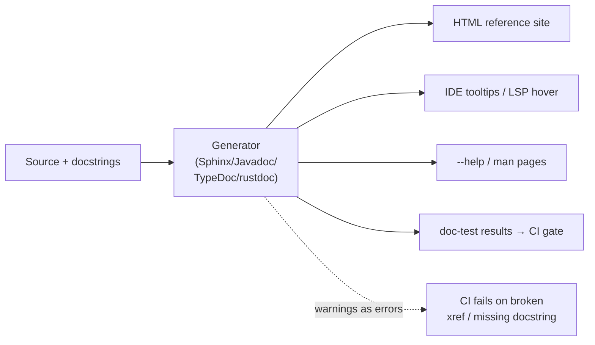
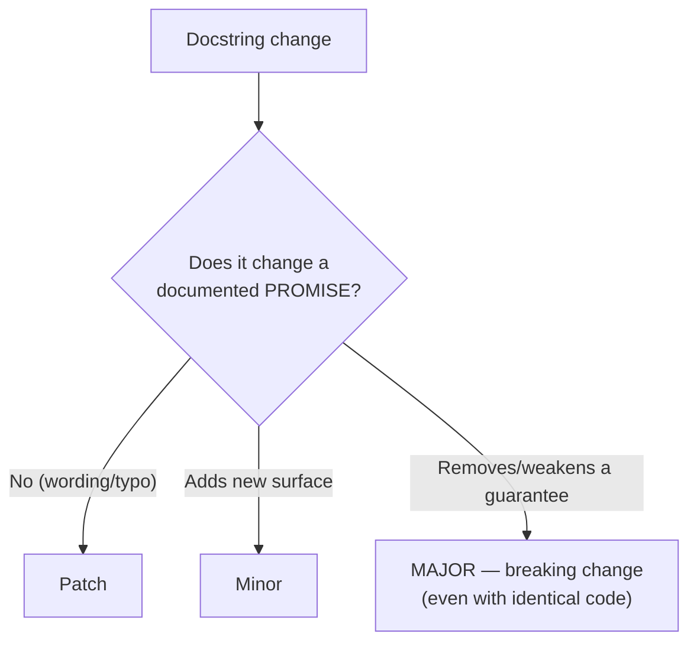
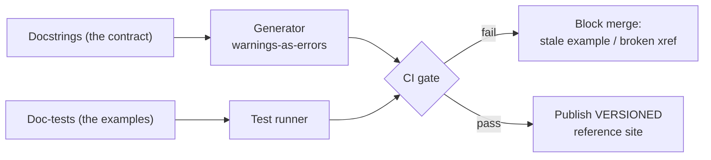

# Code Comments & Docstrings — Senior

> **Category:** [Documentation](../README.md) — docstrings as a versioned API contract, the doc-generation toolchain as build infrastructure, and the discipline of keeping a generated reference honest at scale.

> **Prerequisites:** [Junior](junior.md) · [Middle](middle.md)
> **Focus:** **Design trade-offs** and **system-level reasoning**

---

## Introduction

> Focus: **design trade-offs** and **system-level reasoning**

At junior and middle levels, a docstring is a per-function craft decision. At the senior level it is three system-level things at once:

1. **A versioned contract** — part of your published API surface, subject to the same backward-compatibility discipline as a function signature.
2. **An input to build infrastructure** — the doc-generation toolchain is a pipeline you own, version, gate in CI, and reason about like any other build step.
3. **The single largest defense against doc rot** — because the docstring lives *next to* the code it describes and can be *executed* (doc-tests), it is the only documentation that has a structural chance of staying true.

This file is about the architectural consequences of those three facts: how to treat docstrings as a contract under versioning, how to engineer the generator pipeline, and where the whole approach breaks down.

---

## Docstrings as a Versioned Contract

A docstring is not annotation; it is a **promise**. When a caller reads "preserves first-seen order" and builds on it, that sentence is as load-bearing as the type signature. The senior consequence: **changing a docstring's *promise* is an API change, governed by semantic versioning.**

| Docstring change | Semver impact | Why |
|---|---|---|
| Fix a typo, clarify wording (same promise) | Patch | No contract change |
| Document a previously-undocumented guarantee that already held | Patch / minor | Tightening *toward* reality; usually safe |
| **Add** a new documented behavior/parameter | Minor | New surface, old callers unaffected |
| **Remove or weaken** a documented guarantee | **Major (breaking)** | Callers relied on it |
| Mark something `@deprecated` | Minor | Signal, not yet removal |

The trap: engineers treat docstring edits as "just comments" and merge a weakened guarantee in a patch release. If the docs said "thread-safe" and a refactor quietly made it not, removing the word is a *breaking change* dressed as a doc tweak — every concurrent caller is now wrong.

> **Hyrum's Law applies to docstrings.** With enough callers, every *documented* behavior is depended upon — and some *undocumented* ones too. The documented contract is the surface you've explicitly committed to; widening it (documenting an incidental behavior) commits you to keeping it. Document the guarantees you're willing to *maintain*, not every fact that happens to be true today.

This is why "document the contract, not the implementation" is a senior survival rule, not a style nicety: every implementation detail you write into a docstring becomes a behavior you've promised to preserve.

---

## The Toolchain as Build Infrastructure

The doc generator is a compiler: source + docstrings in, reference artifact out. Senior engineers own it as infrastructure, with the same concerns as any build:



The decisions you own:

- **Warnings-as-errors.** Sphinx `-W`, `javadoc -Xwerror`, `cargo doc` with `RUSTDOCFLAGS="-D warnings"`. A broken cross-reference or malformed tag should fail the build, not silently produce a broken page. This is the single highest-leverage toolchain setting.
- **Hosting and versioning.** A reference site must be **versioned alongside the code** — v2.3 docs describe v2.3, not `main`. Read the Docs version-switchers, `cargo doc` per release, Javadoc per artifact. Publishing only "latest" guarantees stale docs for everyone not on the latest version.
- **Determinism and reproducibility.** The same source must produce the same docs; non-deterministic generation (timestamps, ordering) creates noisy diffs and untrustworthy artifacts.
- **Coverage gating** (with care — see below) and **doc-test execution** as a required CI check.

The senior reframe: **docs that aren't built in CI are docs that are already broken.** Manual generation guarantees the reference lags the code by however long since someone last ran the command.

---

## Generators Compared

Choosing and operating a generator is a system decision. The landscape:

| Generator | Language(s) | Reads | Output | Notable |
|---|---|---|---|---|
| **Sphinx** + autodoc/napoleon | Python (and others) | reST/Google/NumPy docstrings | HTML, PDF, ePub | Most powerful cross-refs; `intersphinx` links across projects; runs doctests |
| **Javadoc** | Java | `/** */` + tags | HTML | Built into the JDK; the canonical reference model the industry copied |
| **JSDoc** | JavaScript | JSDoc comments | HTML | Type info comes from comments |
| **TypeDoc** | TypeScript | TSDoc + **the type system** | HTML, JSON | Reads types from the compiler — far less to write by hand |
| **godoc / pkg.go.dev** | Go | `//` doc comments | package pages | Zero config; convention-driven; the doc *is* the comment |
| **rustdoc** (`cargo doc`) | Rust | `///` Markdown | HTML | **Runs every example as a test**; deep integration with `cargo test` |
| **Doxygen** | C/C++/many | structured comments | HTML, LaTeX, **call/dependency graphs** | The heavyweight for systems languages; diagrams from code |
| **DocFX** | C#/.NET | XML doc comments + conceptual `.md` | docs site | Microsoft's; merges reference + guides |

The structural axes that distinguish them:

- **How much do they infer vs. require you to write?** rustdoc and TypeDoc read the type system, so you write less; JSDoc and pre-types JS require everything in comments. Inference reduces doc rot (the type is the single source of truth).
- **Do they execute examples?** rustdoc (always) and Sphinx (with `doctest`) verify examples; the rest render unverified prose. Execution is the difference between "examples that can't rot" and "examples that will."
- **Convention vs. configuration.** godoc is pure convention (write good comments, get good docs); Sphinx/Doxygen are highly configurable (and correspondingly heavyweight). Convention scales across a large org with less coordination cost.

---

## Doc-Tests as Executable Documentation

Doc-tests are the senior-level crown jewel of this topic because they collapse two artifacts that normally rot apart — the example and the code — into one that *cannot* diverge without failing the build.

```rust
/// Parses a duration like `"1h30m"` into seconds.
///
/// # Examples
/// ```
/// use mycrate::parse_duration;
/// assert_eq!(parse_duration("1h30m").unwrap(), 5400);
/// ```
///
/// # Errors
/// Returns `ParseError` if the string contains an unknown unit.
///
/// ```
/// use mycrate::parse_duration;
/// assert!(parse_duration("1h30x").is_err());
/// ```
pub fn parse_duration(s: &str) -> Result<u64, ParseError> { /* ... */ }
```

`cargo test` compiles and runs both blocks. If `parse_duration`'s signature changes, the doc example **stops compiling** and the build fails — the docs are forced to track the API at compile time. Python's `doctest` does the runtime version of this:

```python
def parse_duration(s: str) -> int:
    """Parse a duration like "1h30m" into seconds.

    >>> parse_duration("1h30m")
    5400
    >>> parse_duration("1h30x")
    Traceback (most recent call last):
        ...
    ValueError: unknown unit 'x'
    """
```

### The senior nuance: doc-tests are a contract on *behavior*, not just a demo

A doc-test asserts that the documented behavior *is the actual behavior*. That makes it a regression test for the contract. But it has costs:

- **They run in the test suite**, so a slow or flaky doc-test slows/destabilizes the build. Keep them tiny and deterministic.
- **They can't easily test side effects or I/O** without setup that pollutes the example's pedagogical clarity. Use `no_run` (Rust) / `+SKIP` (Python) for illustrative-but-unrunnable snippets — accepting that those *can* rot again.
- **They tie example syntax to the host language**, so they double as compile-time API-usage checks (Rust) — a powerful, underused property.

> The principle: **prefer the example that the compiler/test-runner verifies.** An unverified example is a future lie; a verified one is a regression test wearing documentation's clothes.

---

## Docstrings and the Diátaxis Reference Mode

The [Diátaxis](https://diataxis.fr/) framework splits documentation into four modes: **tutorials** (learning-oriented), **how-to guides** (task-oriented), **reference** (information-oriented), and **explanation** (understanding-oriented). Generated API docs occupy exactly one of these:

```text
                 PRACTICAL          THEORETICAL
  LEARNING   │  Tutorials      │  Explanation
  WORKING    │  How-to guides  │  REFERENCE  ← generated API docs live HERE
```

A generated reference is **information-oriented**: complete, accurate, austere, structured for *lookup*, not for *learning*. The senior implication: **don't try to make your generated reference do the other three jobs.** A docstring is a poor tutorial — cramming a getting-started narrative into a function's docstring bloats the reference and still doesn't teach. The division of labor:

- **Reference (generated from docstrings)** — every symbol, its exact contract. Owned by *this* topic.
- **How-to guides + tutorials** — hand-written, task-shaped prose. Owned by [API & Reference Documentation](../04-api-and-reference-documentation/junior.md) and [READMEs & Onboarding](../03-readmes-and-onboarding-docs/junior.md).

The art is *linking* the two: a docstring can point to a how-to (`See the "Authenticating" guide`), and a guide links into the reference. But each stays in its lane. Forcing a docstring to teach is the most common way a reference site becomes unusable. (The four-mode model and the *what to document* judgement live in [Why & What to Document](../01-why-and-what-to-document/junior.md).)

---

## Comment Philosophy at the Senior Level

This topic defers comment *style* to Clean Code → Comments, but the senior framing of *where comments fit relative to docstrings* belongs here:

- **Docstrings face outward (callers); comments face inward (maintainers).** The same code element may need both: a docstring stating the contract and a `// why` comment explaining a non-obvious implementation choice. They serve different readers and should not be merged.
- **The "comment is an apology" maxim is not absolutist.** Some *why* is irreducible — a regulatory rounding rule, a hardware erratum workaround, a "the obvious approach deadlocks under load." That belongs in a comment (for maintainers), possibly *also* summarized in the docstring if it affects the contract (e.g., "rounds half-even per IFRS"). The senior judgement is which audience needs which fact.
- **Comment smells scale into systemic risk.** Commented-out code and outdated comments in a large codebase are *negative-value documentation* — they actively mislead, and at scale they erode trust in *all* comments. The senior discipline is ruthless deletion (version control remembers) plus tooling (linters that flag commented-out code).

---

## Advanced: Cross-References, Stability, and Doc Coverage Gates

### Cross-references that don't break

Sphinx (`:func:`, `:class:`, intersphinx), rustdoc (`[Type]` intra-doc links), and Javadoc (`{@link}`) let docstrings link to other symbols. The senior rule: **prefer symbol references the generator can *verify* over hand-typed names.** rustdoc intra-doc links and Sphinx refs *fail the build* when the target is renamed — turning "broken link" from a rot problem into a compile error. Plain-text `See foo()` rots silently.

### Stability annotations

Mature APIs annotate maturity in the docstring/attribute so the reference communicates risk: Rust's `#[stable]`/`#[unstable]`, Python's "Added in 3.x / Deprecated since 3.y", `@since`/`@deprecated` (Javadoc). This turns the reference into a *contract timeline*, not just a snapshot — callers can see what's safe to depend on.

### Doc coverage gates — use with judgement

Tools like `interrogate` (Python), Rust's `#![warn(missing_docs)]`, and `javadoc -Xdoclint` can *require* docstrings. The senior caveat (carried from middle): **gate the public surface, not raw percentage.** `missing_docs` on `pub` items is excellent — it forces a contract on everything strangers can call — but a blanket "100% including private" gate manufactures noise. Configure the gate to the *boundary that matters*.

---

## Liabilities

### Liability 1: The docstring that lies (doc rot)

The worst documentation is confidently wrong documentation — a docstring describing behavior the code no longer has. It's worse than none, because callers *trust* it. The structural defenses: doc-tests (executed), keep docstrings next to code (reviewed together), and treat docstring promises as contract under versioning. Hand-written, unverified examples are the prime rot vector. (Deep-dive: [Keeping Docs Alive & Doc Rot](../11-keeping-docs-alive-and-doc-rot/junior.md).)

### Liability 2: Over-documenting the implementation into a contract

Every implementation detail you write into a docstring is a promise you must keep. "Uses a binary search internally" becomes a documented behavior callers may time against — and now you can't change the algorithm without (technically) a contract change. Document guarantees, not mechanics.

### Liability 3: Reference-as-tutorial bloat

Stuffing narrative onboarding into docstrings makes the generated reference enormous and *still* fails to teach. Keep reference austere; link to how-to guides.

### Liability 4: Toolchain neglect

A generator without warnings-as-errors silently produces broken pages; an unversioned site shows wrong-version docs; a doc build outside CI lags reality. The pipeline is infrastructure — neglecting it produces a reference that *looks* authoritative while being wrong.

### Liability 5: Coverage theater

A 100% docstring-coverage badge earned with `"""Return x."""` everywhere signals quality while delivering noise. Metrics that count trivial docstrings reward the wrong behavior.

---

## Pros & Cons at the System Level

| Dimension | Docstrings + generated reference | Hand-written external reference / no docstrings |
|---|---|---|
| Proximity to code (rot resistance) | **High** — lives next to code, reviewed together | Low — separate doc drifts fast |
| Examples can be verified | **Yes** (doc-tests / doc examples) | No |
| IDE / LSP integration | **Native** (tooltips, hover, completion) | None |
| Maintenance cost | Per-symbol, ongoing | Concentrated but disconnected |
| Risk of contract-as-implementation | Real — easy to over-promise mechanics | Lower (usually higher-level) |
| Best for | API/reference (Diátaxis "reference") | Tutorials, explanation, narrative guides |
| Versioning | Tracks the code's version automatically | Manual, error-prone |

The system-level verdict: **for the reference mode, docstrings + generation dominate** — they're closer to the code, IDE-integrated, and verifiable. They are the *wrong* tool for tutorials and explanation, which need hand-written prose. The senior architecture uses docstrings for the contract surface and links out to purpose-built guides for everything else.

---

## Diagrams

### Docstring change → semver decision



### The toolchain as a verified pipeline



---

## Related Topics

- **Comment *style* (deferred here):** Clean Code → Comments
- **Doc types / what to document:** [Why & What to Document](../01-why-and-what-to-document/junior.md)
- **Where the reference fits:** [API & Reference Documentation](../04-api-and-reference-documentation/junior.md)
- **CI for docs:** [Docs as Code & Tooling](../10-docs-as-code-and-tooling/junior.md)
- **Fighting rot:** [Keeping Docs Alive & Doc Rot](../11-keeping-docs-alive-and-doc-rot/junior.md)

---


---

## Check your understanding

1. Explain Code Comments & Docstrings — Senior Level in your own words and name the problem it solves.
2. How would you apply the ideas around Table of Contents, Introduction, Docstrings as a Versioned Contract in a realistic engineering change?
3. What failure mode or misuse should you look for, and what evidence would reveal it?
4. How would you validate a system-level decision about Code Comments & Docstrings — Senior Level under uncertainty?
5. What observable result would convince you that the approach improved the system?
