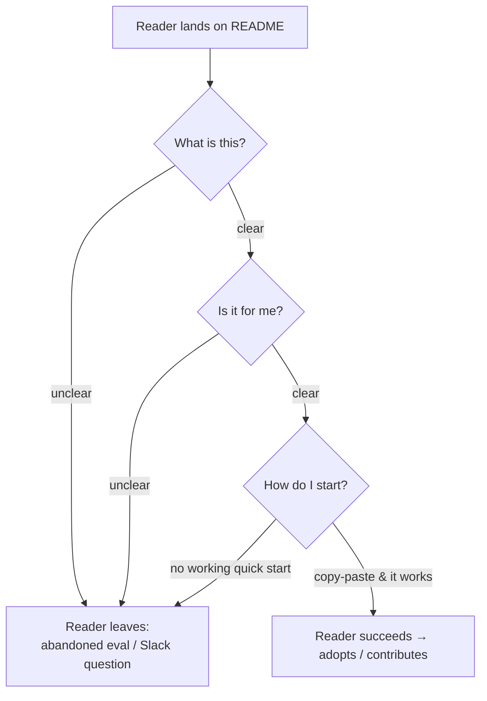

# READMEs & Onboarding Docs — Junior

> **Category:** [Documentation](../README.md) — the README is your project's front door; onboarding docs are the path from "I cloned it" to "I shipped a change."

---

## Introduction

> Focus: **What is it?** and **How to use it?**

A **README** is the file a tool, a teammate, or a stranger reads *first* when they land on your project. It is the front door. Open `github.com/some/repo` and the thing rendered below the file list is the README — before anyone reads a single line of your code, they read this.

> A README answers three questions in the first thirty seconds: **What is this? Is it for me? How do I start?**

**Onboarding docs** are the next step in: the getting-started guide, the dev-environment setup, the "day one" checklist that takes a new contributor from a fresh `git clone` to their first green build and first merged change. The README is the front door; onboarding docs are the hallway that leads somewhere useful.

### Why this matters

Most engineers underrate documentation because they picture a thick manual nobody reads. But the README is not that — it is the single highest-leverage document you will ever write, because it is the *most-read* one. Every evaluator deciding whether to adopt your library reads it. Every new hire reads it. Every teammate who forgot how to run the tests reads it. A good README is read a thousand times and written once.

The cost of a bad or absent README is concrete and recurring:

- An engineer evaluating your library can't tell what it does in 30 seconds, so they **pick a competitor** — the abandoned evaluation.
- A new hire spends their first three days fighting the build instead of writing code — **failed onboarding**.
- The same five questions get asked in chat every month because the answer lives only in someone's head — **repeated questions** that tax the whole team.

A README is cheap to write and expensive to omit. This topic teaches you what goes in it, what goes beside it, and how to make the path from clone to contribution short.

---

## Prerequisites

- **Required:** Basic **Markdown** — headings, lists, fenced code blocks, links, tables. (READMEs are Markdown.)
- **Required:** Comfort with **git/GitHub** basics — clone, branch, commit, pull request.
- **Helpful:** You've installed and run at least a few open-source projects, so you've *been* the reader a good README serves.
- **Helpful:** A sense of [why and what to document](../01-why-and-what-to-document/junior.md) — the README is the most public slice of that.

---

## Glossary

| Term | Definition |
|------|-----------|
| **README** | The project's front-door document; the first (often only) doc a reader sees. Conventionally `README.md`. |
| **Quick start** | The shortest possible path from clone/install to "it works on my machine" — copy-pasteable commands. |
| **Onboarding docs** | Docs that take a new contributor from fresh clone to first merged change (setup guide, day-one checklist). |
| **Time-to-first-commit** | How long from joining/cloning until a contributor lands their first real change. A key onboarding metric. |
| **Badge** | A small status image at the top of a README (build passing, version, license, coverage). |
| **CONTRIBUTING.md** | A companion file telling contributors how to set up, branch, test, and submit changes. |
| **Scannability** | How quickly a reader can skim a doc and find what they need — headings, short paragraphs, code blocks. |
| **Progressive disclosure** | Show the simple/common path first; link to depth for those who need it. Quick start → deeper guides. |
| **Doc rot** | Documentation that has silently drifted out of sync with the code it describes. |

---

## The README as the Front Door

Think of every place a README gets read:

- A developer searching for a library to solve a problem, comparing three repos in a browser tab each.
- A new teammate who just got repo access on day one.
- A future-you, six months from now, reopening a project you've completely forgotten.
- An on-call engineer at 3 a.m. trying to remember how this service even starts.
- A tool — a package registry, a dependency scanner, GitHub's own UI — that renders your README as the project's description.

In every one of these cases, the reader has **low context and low patience**. They are not going to read your source to figure out what your project is. If the README doesn't tell them fast, they leave — and "leave" might mean "choose a competitor," "ping you on Slack," or "give up on the task."

> The README is the only documentation you can *assume* will be read. Put the most important thing first.

---

## The 30-Second Test

Here is the test a junior should apply to every README they write. Hand it to someone who has never seen the project and give them thirty seconds. Can they answer:

1. **What is this?** — one sentence, no jargon.
2. **Is it for me?** — what problem it solves, who it's for.
3. **How do I start?** — the one command (or three) to get running.

```
   READER LANDS ON README
            │
            ▼
   ┌──────────────────────┐   30 seconds on the clock
   │  What is this?        │ ──► one-line description
   │  Is it for me?        │ ──► problem it solves / audience
   │  How do I start?      │ ──► copy-paste quick start
   └──────────────────────┘
            │
     can answer all 3? ── yes ──► reader stays, tries it, succeeds
            │
            no ──► reader leaves (abandoned eval / Slack question / give up)
```

If the reader can't answer all three in thirty seconds, the README has failed at its one job — no matter how thorough the rest of it is.

---

## README Anatomy

There is a widely shared standard structure for READMEs (codified by the **standard-readme** spec and curated examples like **Awesome README**). You don't need every section in every project, but this is the menu, roughly in reading order:

```
┌───────────────────────────────────────────────┐
│  # Project Name                                │  ← title
│  One-line description of what it does          │  ← the 30-second answer
│  [badges: build] [version] [license]           │  ← status at a glance
├───────────────────────────────────────────────┤
│  ## What & Why                                 │  ← problem it solves, who it's for
│  ## Quick Start / Installation                 │  ← copy-paste path to running
│  ## Usage / Examples                           │  ← the common things you'd do
│  ## Configuration                              │  ← options, env vars (if any)
│  ## Running Tests                              │  ← how to verify locally
│  ## Contributing → CONTRIBUTING.md             │  ← pointer, not the whole guide
│  ## License                                    │  ← legal terms
│  ## Support / Contact                          │  ← where to get help
└───────────────────────────────────────────────┘
```

| Section | Job | Skip when… |
|---|---|---|
| **Title + one-liner** | The 30-second answer | Never skip |
| **Badges** | Build/version/license at a glance | Internal tools rarely need them |
| **What & Why** | Problem solved, intended audience | Never skip |
| **Quick Start / Install** | Clone → running, copy-pasteable | Never skip for anything runnable |
| **Usage / Examples** | Show the common operations | Pure-reference projects |
| **Configuration** | Options, environment variables | No configurable behavior exists |
| **Running Tests** | How to verify it works locally | Trivial scripts |
| **Contributing** | Pointer to `CONTRIBUTING.md` | Truly private repos |
| **License** | Legal terms of use | Internal repos (still wise to add) |
| **Support / Contact** | Where to ask for help | — |

The most common junior mistake is to spend all the effort on the *bottom* of this list (exhaustive API tables) and neglect the *top* (the one-liner and quick start) — exactly the sections every reader hits first.

---

## A Weak README vs. a Strong One

Here is a README that fails the 30-second test:

```markdown
# project

TODO: write docs

## Setup

Install the dependencies and run it.
```

A reader can't tell what it is, who it's for, or how to start. "Install the dependencies" assumes they know which dependencies, with which tool. This README does *negative* work: it makes the project look abandoned.

Here is the same project with a README that passes the test:

```markdown
# inventory-sync

> Keeps the warehouse database in sync with the Shopify storefront, every 5 minutes.

[]()
[]()

## What it does

`inventory-sync` is a small service that pulls stock levels from our
warehouse Postgres and pushes them to Shopify so the storefront never
oversells. If you maintain the storefront or the warehouse, this is yours.

## Quick start

```bash
git clone https://github.com/acme/inventory-sync
cd inventory-sync
cp .env.example .env        # then fill in SHOPIFY_TOKEN and DB_URL
make run                    # starts the sync loop
```

You should see `synced 412 SKUs in 1.3s` within ten seconds.

## Configuration

| Variable        | Default | Description                    |
|-----------------|---------|--------------------------------|
| `SYNC_INTERVAL` | `5m`    | How often to run a sync pass.  |
| `DB_URL`        | —       | Postgres connection string.    |
| `SHOPIFY_TOKEN` | —       | Storefront admin API token.    |

## Running tests

```bash
make test
```

## Contributing

See CONTRIBUTING.md for setup and the PR process.

## License

MIT — see LICENSE.
```

The difference is not length — the strong version is barely longer. The difference is that it **answers the three questions in order** and gives commands you can paste.

---

## Quick Start: Commands That Actually Work

The single most valuable part of a README is a quick start whose commands actually run. This sounds obvious; it is the most commonly broken promise in software.

The cardinal rule:

> **Copy-pasteable means copy-pasteable.** A reader should be able to select the block, paste it into a terminal, and have it work — no editing, no "obviously you also need to…", no assumed context.

Concretely:

- **Don't assume installed tools.** If `make run` needs `make`, `docker`, or a specific language version, say so (or use a setup that doesn't need them).
- **Don't assume secrets exist.** If the app needs `DB_URL`, show how to get a working value (`cp .env.example .env`), not just that the variable exists.
- **Show the expected output.** "You should see `Listening on :8080`" tells the reader whether it worked. Without it, they don't know if a silent prompt means success or hang.
- **Prefer one command over ten.** A `make run` or `docker compose up` that wraps the steps is more robust than ten copy-pasted lines, because there are fewer places to drift out of date.

The trap this protects against has a name: **"works on my machine."** The author's machine has the right language version, the right tools, environment variables set months ago, and a database already running. The reader's machine has none of that. A quick start that only works on the author's machine is worse than none, because it wastes the reader's time before failing.

---

## The Companion Files

A README points to a small family of companion files. GitHub gives several of these **special treatment** — it surfaces them in its UI automatically (a "Contributing" button on new PRs, a security tab, the license in the sidebar).

| File | What it's for | GitHub special-cases it? |
|---|---|---|
| `README.md` | The front door | Yes — rendered on the repo home |
| `CONTRIBUTING.md` | How to set up, branch, test, and submit changes | Yes — linked when opening an issue/PR |
| `CODE_OF_CONDUCT.md` | Expected behavior in the community | Yes — surfaced in community profile |
| `SECURITY.md` | How to report a vulnerability (privately) | Yes — "Security" tab |
| `LICENSE` | Legal terms of use | Yes — shown in sidebar |
| `CHANGELOG.md` | Notable changes per release | Linked from README; see [changelogs](../09-changelogs-and-release-notes/junior.md) |
| `.github/ISSUE_TEMPLATE/` | Prefilled forms for bug reports / features | Yes — used when filing issues |
| `.github/PULL_REQUEST_TEMPLATE.md` | A checklist the PR author fills in | Yes — prefills the PR body |

The README should **point** to these rather than inline them. A README that contains the full contribution guide, the full changelog, and the full code of conduct is bloated and hard to scan. Keep the front door small; link to the rooms beyond it.

Here is a minimal `CONTRIBUTING.md` skeleton — the companion file you'll most often write:

```markdown
# Contributing to inventory-sync

Thanks for helping out! Here's how to get from zero to a merged change.

## Set up your environment

```bash
git clone https://github.com/acme/inventory-sync
cd inventory-sync
make setup        # installs deps, sets up git hooks
cp .env.example .env
```

## Make a change

1. Branch from `main`: `git checkout -b fix/short-description`
2. Make your change. Add or update tests.
3. Run the checks locally: `make test lint`
4. Commit with a clear message.

## Submit it

1. Push your branch and open a pull request against `main`.
2. Fill in the PR template (what changed, why, how you tested it).
3. A maintainer will review within two working days.

## Questions?

Ask in #inventory-sync on Slack, or open a draft PR and tag a maintainer.
```

For larger repositories, one more companion is worth knowing about: **`ARCHITECTURE.md`** — a high-level map of where things live and how the major pieces fit together, so a newcomer doesn't have to reverse-engineer the layout from the directory tree.

---

## Onboarding Docs

If the README is the front door, **onboarding docs** are the guided path inside. Their single goal:

> Minimize **time-to-first-commit** (and time-to-first-green-build) — the time from a new contributor joining to their first successful change.

The core onboarding artifacts:

- **A getting-started / dev-environment-setup doc** — exactly how to get a working development environment: language versions, services to run, secrets to obtain, the one command that starts everything.
- **A "day one" checklist** — a literal, ordered list a new person follows on their first day.

Here is a simple onboarding checklist:

```markdown
# Day-One Checklist — inventory-sync

- [ ] Clone the repo and run `make setup` (should finish without errors)
- [ ] Copy `.env.example` to `.env`; get secrets from the team vault (link)
- [ ] Run `make test` — all green?
- [ ] Run `make run` — see `synced N SKUs`?
- [ ] Make a trivial change (fix a typo in this checklist!) and open a PR
- [ ] Get your PR reviewed and merged
- [ ] You're set up. Welcome aboard.
```

The key mental shift: **treat onboarding docs as executable.** A new hire should be able to follow them *verbatim* and succeed. If they hit a step that doesn't work — a missing tool, a stale command, an undocumented secret — that is not the new person being slow. **That is a bug in the docs.** The newest person on the team is your best documentation tester, because they have exactly zero assumed context. Capture every stumble they hit and fix the doc.

The most reliable way to keep setup docs from rotting is to back them with a **script or container**: a `make setup` that *is* the setup, a `docker compose up` that *is* the dev environment. Prose drifts; an executable setup either works or fails loudly. (More on keeping docs alive at [docs-as-code](../10-docs-as-code-and-tooling/junior.md) and [keeping docs alive](../11-keeping-docs-alive-and-doc-rot/junior.md).)

```
ONBOARDING FUNNEL (each leak = lost time / a frustrated newcomer)

  New contributor
       │
       ▼
  Clone repo ──────────────► (no README? confusion)
       │
       ▼
  Set up env ──────────────► (manual steps drift → "works on my machine")
       │
       ▼
  First green build ───────► time-to-first-green-build
       │
       ▼
  First merged change ─────► TIME-TO-FIRST-COMMIT  ← the metric to minimize
```

---

## Writing for the Reader

Documentation is writing, and the reader is busy. A few habits make any README or onboarding doc dramatically more useful:

- **Make it scannable.** Use headings, short paragraphs, bulleted lists, and code blocks. A reader skims first and reads second; help them find their section in two seconds.
- **Lead with the common case.** Most readers want the same thing (get it running, do the basic operation). Put that first. This is **progressive disclosure**: the simple path up top, links to depth for the few who need it.
- **Don't assume context.** The thing that's obvious to you (which package manager, that a database must be running) is the thing the reader doesn't know. Spell it out or script it away.
- **Use screenshots where they help.** A picture of the running UI, or a terminal showing the expected output, orients a reader faster than a paragraph. Don't overdo it — screenshots rot too.
- **Keep commands copy-pasteable.** Covered above, repeated here because it's the thing readers actually use.

A useful framing borrowed from [why and what to document](../01-why-and-what-to-document/junior.md): a README is a *blend* of documentation types. The quick start is a **tutorial** (follow these steps and succeed), the usage section is a **how-to** (accomplish a specific task), and the configuration table is **reference** (look up a value). A good README serves all three without becoming a manual — it does each lightly and links out for depth.

---

## Best Practices

1. **Pass the 30-second test.** Title, one-liner, and quick start must answer *what / for whom / how to start* immediately.
2. **Put the quick start near the top** and make every command copy-pasteable, with expected output.
3. **Point to companion files** (`CONTRIBUTING.md`, `LICENSE`, `SECURITY.md`); don't inline them into the README.
4. **Back setup with a script or container** (`make setup`, `docker compose up`) so the docs can't quietly rot.
5. **Treat onboarding docs as executable** — have the newest person follow them verbatim and fix every gap they hit.
6. **Write for a reader with zero context.** State the package manager, the language version, the services that must be running.
7. **Keep it scannable** — headings, short blocks, the common case first (progressive disclosure).

---

## Common Mistakes

1. **No README, or a `TODO: write docs` README.** The project looks abandoned and evaluators leave.
2. **Burying or omitting the quick start.** The most-used section is hard to find or missing entirely.
3. **Commands that don't actually run** — assumed tools, missing secrets, the "works on my machine" trap.
4. **A bloated README** that inlines the whole contributing guide, changelog, and architecture — nobody scans it.
5. **No expected output.** The reader runs the command and can't tell whether it worked.
6. **Assuming context.** "Just run it" — with which tool, which version, against which database?
7. **Letting setup docs drift** because they're prose, not a script the build exercises.

---

## Tricky Points

- **A README is read far more than it's written.** It feels like overhead while you write it; it pays back every time someone lands on the repo. The leverage is enormous and front-loaded.
- **"Install the dependencies and run it" is not a quick start.** A quick start is the *literal commands*, in order, that take a stranger from clone to running.
- **The newest teammate is your best doc tester.** Their confusion is signal, not noise — every stumble is a doc bug. Capture it before they gain context and forget.
- **Companion files are pointers, not chapters.** GitHub surfaces `CONTRIBUTING.md`, `SECURITY.md`, and `LICENSE` automatically — let them live as separate files and link from the README.
- **A screenshot can rot too.** It's documentation like any other; a UI redesign makes it lie. Use screenshots where they earn their keep, and expect to maintain them.

---

## Test Yourself

1. What three questions must a README answer in the first 30 seconds?
2. Name five standard sections of a README, roughly in reading order.
3. What does "copy-pasteable" demand of your quick-start commands?
4. What is the difference between a README and onboarding docs?
5. Why are companion files (`CONTRIBUTING.md`, `SECURITY.md`) kept separate and merely linked from the README?
6. Why is the newest person on the team your best documentation tester?
7. What is "time-to-first-commit," and why do onboarding docs aim to minimize it?

---

## Cheat Sheet

```text
THE 30-SECOND TEST (a README's one job)
  What is this?  ·  Is it for me?  ·  How do I start?

README ANATOMY (top to bottom = reading order)
  title + one-liner → badges → what & why → quick start →
  usage → config → tests → contributing(pointer) → license → support

QUICK START RULES
  copy-pasteable · no assumed tools · no missing secrets · show expected output
  prefer ONE command (make run / docker compose up) over ten

COMPANION FILES (link, don't inline)
  CONTRIBUTING.md · CODE_OF_CONDUCT.md · SECURITY.md · LICENSE ·
  CHANGELOG.md · .github/ templates · ARCHITECTURE.md (big repos)

ONBOARDING
  goal: minimize TIME-TO-FIRST-COMMIT
  treat docs as EXECUTABLE — newest hire follows verbatim; gaps = bugs
  back setup with a SCRIPT or CONTAINER so it can't rot
```

---

## Summary

- The **README is the front door** — the first and often only doc anyone reads. It must answer *what / for whom / how to start* in 30 seconds.
- The **standard anatomy** (title + one-liner, badges, what & why, quick start, usage, config, tests, contributing pointer, license) puts the most-read sections first.
- A **quick start is only as good as its commands** — they must be copy-pasteable, assume nothing, and show expected output. The enemy is "works on my machine."
- **Companion files** (`CONTRIBUTING.md`, `SECURITY.md`, `LICENSE`, issue/PR templates) live beside the README and are linked, not inlined; GitHub renders several specially.
- **Onboarding docs** minimize **time-to-first-commit**, are treated as executable (newest hire follows them verbatim; gaps are bugs), and are kept alive by scripts/containers.

---

## Further Reading

- **standard-readme** — a community spec for README structure.
- **Awesome README** — a curated list of exemplary READMEs to imitate.
- Tom Preston-Werner, *Readme Driven Development* — write the README first (covered at [Middle](middle.md)).
- GitHub Docs — *About READMEs* and *Setting up your project for healthy contributions* (community health files).
- [Make a README](https://www.makeareadme.com/) — a gentle template and rationale.

---

## Related Topics

- **The bigger picture:** [Why & What to Document](../01-why-and-what-to-document/junior.md)
- **Keeps the quick start honest:** [Docs as Code & Tooling](../10-docs-as-code-and-tooling/junior.md), [Keeping Docs Alive](../11-keeping-docs-alive-and-doc-rot/junior.md)
- **Linked from the README:** [Changelogs & Release Notes](../09-changelogs-and-release-notes/junior.md)

---

## Diagrams




---

## Check your understanding

1. Explain READMEs & Onboarding Docs — Junior Level in your own words and name the problem it solves.
2. How would you apply the ideas around Table of Contents, Introduction, Prerequisites in a realistic engineering change?
3. What failure mode or misuse should you look for, and what evidence would reveal it?
4. What small example would prove that you can apply READMEs & Onboarding Docs — Junior Level correctly?
5. What observable result would convince you that the approach improved the system?
