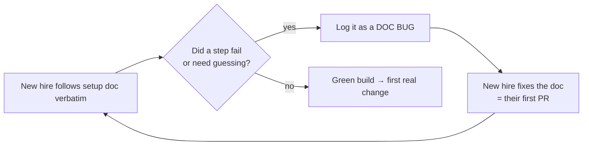
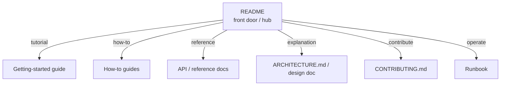
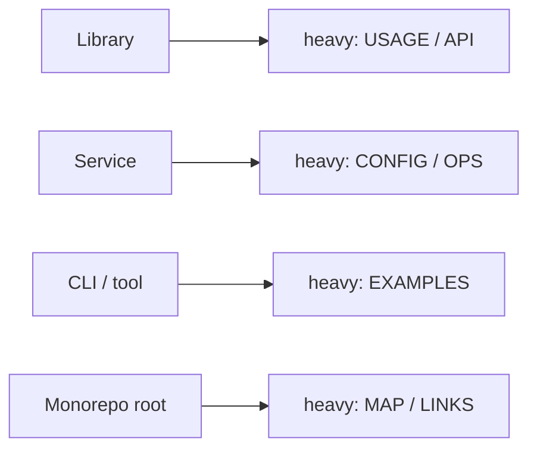

# READMEs & Onboarding Docs — Middle

> **Category:** [Documentation](../README.md) — the README is your project's front door; onboarding docs are the path from "I cloned it" to "I shipped a change."

> **Prerequisite:** [Junior](junior.md)
> **Focus:** **Why** and **When**

---

## Introduction

> Focus: **Why** and **When**

At the junior level, the README is a structure you fill in. At the middle level, the README becomes a set of **decisions**: *What kind of project is this, and what does its reader need? Should I write the README before the code or after? What companion files does this repo actually warrant? Where does the README stop and a docs site begin?*

The unifying insight is that **there is no single correct README** — there is a README *appropriate to this project's type and audience.* A published library, an internal service, and a one-off CLI tool have different readers with different needs, and a good engineer matches the doc to the reader rather than copying a template wholesale. This file is about making those calls deliberately.

---

## Tailoring the README by Project Type

The standard anatomy is a starting menu, not a fixed recipe. What a reader needs depends entirely on what the thing *is*. The defining question for each type: **what is the reader trying to do, and what's the first thing they need?**

| Section | Library | Application / Service | CLI / Internal Tool | Monorepo (root) |
|---|---|---|---|---|
| One-line description | Critical | Critical | Useful | Critical |
| Badges (build/version) | Critical (npm/PyPI) | Useful | Optional | Useful |
| Install | `npm i` / `pip install` | Run/deploy, not "install" | Install binary | "Pick a package" |
| Quick start | Smallest working snippet | Get it running locally | One example invocation | Per-package, linked |
| Usage / API surface | Heavy — this is the point | Light — link to API docs | Flag/subcommand list | Defer to sub-READMEs |
| Configuration | Maybe | Heavy — env vars, secrets | Flags & config file | Per-package |
| Architecture overview | Rare | Useful → `ARCHITECTURE.md` | Rare | Critical (the map) |
| Deployment / ops | No | Yes → runbook link | Maybe | Per-service |
| Contributing | Yes (open-source) | Internal contributing | Maybe | Yes — monorepo workflow |

The patterns to internalize:

- **A library README is mostly *usage*.** The reader is a developer who wants to call your code. The most valuable thing is the smallest snippet that does something real — `import`, call, see a result. Installation is one line; the API surface is the bulk.
- **An application/service README is mostly *operation*.** The reader wants to run it locally, configure it, and (eventually) deploy it. Usage is thin; configuration, environment setup, and a pointer to the [runbook](../07-runbooks-and-operational-docs/junior.md) are thick. Architecture overview earns its place (or a link to `ARCHITECTURE.md`).
- **A CLI/internal-tool README is mostly *examples*.** Reader wants the incantation. Lead with `tool do-the-common-thing --flag`, list the subcommands, and stop. Internal tools can drop badges and license.
- **A monorepo root README is a *map*.** Its reader needs to find the right package fast. It describes the repo's layout, the shared workflow (how to build/test anything), and links to per-package READMEs — it does *not* try to document every package itself.

> The wrong move is to apply a library template to a service (a giant API table nobody needs) or a service template to a library (deployment instructions for code that's `npm install`-ed). Match the README to what the reader is trying to do.

---

## README-Driven Development

**README-Driven Development (RDD)**, named by Tom Preston-Werner (GitHub co-founder), inverts the usual order:

> **Write the README *before* you write the code.**

The idea: the README describes how someone *uses* your project — the public interface, the commands, the example calls. If you write that first, you are designing the interface from the *caller's* point of view before you've committed any implementation to a shape. You discover the awkward API, the confusing flag, the missing capability while they're still cheap to change — in prose, not in shipped code.

```markdown
<!-- RDD: the README for a library that doesn't exist yet -->
# retry

> Retry a flaky function with exponential backoff, in one line.

## Usage

```python
from retry import retry

@retry(attempts=5, backoff="exponential", on=ConnectionError)
def fetch(url):
    return httpx.get(url)
```

By default it retries up to 3 times with jitter. Pass `on=` to retry only
specific exceptions; everything else propagates immediately.
```

Writing that *first* surfaces design questions before a line of implementation exists: Should `attempts` count the first try or only retries? Is `backoff` a string or a strategy object? What's the default? You answer them by editing prose — the cheapest possible place to change your mind. By the time you implement, the interface is already validated against the only thing that matters: *what it's like to use.*

RDD's deeper value is that it forces **outside-in thinking**. Engineers naturally design from the implementation outward ("I have this data structure, so the API looks like…"). The README forces you to start from the user's goal and work back. It's the documentation cousin of test-driven development: write the desired-usage spec first, then make it real.

RDD has limits — for exploratory or research code where you don't yet know the interface, writing the README first is premature. But for any project with a deliberate public surface (a library, a CLI, an API), it's one of the highest-leverage habits available.

---

## The README as a Diátaxis Blend

The **Diátaxis** framework (see [why and what to document](../01-why-and-what-to-document/middle.md)) splits documentation into four types by what the reader is doing:

| Type | Reader's goal | In a README |
|---|---|---|
| **Tutorial** | Learning by doing | The quick start — follow these steps, get a result |
| **How-to** | Accomplishing a task | Usage examples — "to do X, call Y" |
| **Reference** | Looking up a fact | Configuration table, flag list |
| **Explanation** | Understanding why | The "what & why" section, architecture overview |

A README is unusual because it deliberately **spans all four lightly.** Most documents should be *one* Diátaxis type (mixing them is a known anti-pattern); a README is the exception, because it's the front door and the reader hasn't yet chosen what they need.

The skill is to do each type *just enough* and then **link out** to a dedicated document that does it properly:

- Quick start (tutorial) → link to a fuller *getting-started guide* for the deep version.
- Usage (how-to) → link to a *how-to guides* section.
- Config table (reference) → link to full *reference docs* / [API docs](../04-api-and-reference-documentation/junior.md).
- Why/architecture (explanation) → link to `ARCHITECTURE.md` or a [design doc](../06-design-docs-and-rfcs/junior.md).

> The README is the hub of a hub-and-spoke documentation set. It touches every Diátaxis type lightly and routes the reader to the spoke that goes deep. When a section of the README grows past "lightly," that's the signal to split it into its own doc.

---

## Designing the Companion-File Set

A middle engineer chooses the companion files a repo *actually* needs rather than scaffolding all of them by reflex. Over-scaffolding (an empty `CODE_OF_CONDUCT.md` for a two-person internal repo) is noise; under-scaffolding (no `SECURITY.md` on a public, security-sensitive library) is a real gap.

| File | Add it when… | Skip it when… |
|---|---|---|
| `CONTRIBUTING.md` | Anyone but you might contribute | Truly solo, throwaway |
| `CODE_OF_CONDUCT.md` | Public project with a community | Small internal repo |
| `SECURITY.md` | Public, or handles sensitive data | Internal tool with no attack surface |
| `LICENSE` | Always for public; wise internally | (Still add it) |
| `.github/ISSUE_TEMPLATE/` | You get repeated low-quality issues | Low issue volume |
| `.github/PULL_REQUEST_TEMPLATE.md` | You want a consistent PR checklist | Tiny team that already does it |
| `ARCHITECTURE.md` | Repo is big enough that layout isn't obvious | Small, self-evident projects |
| `CHANGELOG.md` | You release versions people depend on | Continuously-deployed internal service (link release notes instead) |

The judgment is about **maintenance cost vs. value**. Every companion file is a file someone must keep current; an out-of-date `CONTRIBUTING.md` that tells contributors to run a command that no longer exists is worse than none. Add the file when its value clears its upkeep cost — and when you add it, wire it into something that keeps it honest (the setup script the `CONTRIBUTING.md` describes should be the *actual* setup script).

A `CONTRIBUTING.md` worth its upkeep does three things precisely: **how to set up** (ideally one scripted command), **how to make a change** (branch naming, where tests live, how to run them), and **how to submit** (PR target, what the template wants, review SLA). Vague exhortations ("write good code," "follow our style") are filler; concrete, runnable steps are the value.

---

## Onboarding as a Discipline

Onboarding stops being "send the new hire the wiki link" and becomes an engineered process with a metric and a feedback loop.

**The metric:** time-to-first-commit (or time-to-first-green-build for the earliest milestone). It's measurable, it's a proxy for the whole developer experience, and it's the thing onboarding docs exist to shrink.

**The feedback loop:** the onboarding doc is *tested* by every new hire who follows it. Treat it like a build:

1. The newest person follows the setup doc **verbatim**, changing nothing, and writes down every place it fails or requires guessing.
2. Each failure is a **bug**, filed against the doc.
3. The new hire (still the best-positioned person, because they still lack context) **fixes the doc** as their first contribution — closing the loop and producing the day-one win of a merged PR.



This reframing — **onboarding docs are executable and testable, and gaps are bugs** — is the central middle-level idea. It converts onboarding from a vague chore into something with the same rigor as code: a thing that either passes or fails, with a clear owner for fixing failures (the next newcomer, while the gap is still fresh).

The corollary: **the cost of an onboarding gap scales with team growth.** A missing step that costs each new hire two hours costs ten hours across five hires and a hundred across fifty. Fixing the doc once is the highest-leverage version of "help the new person" you can do.

---

## Keeping the Quick Start From Rotting

The quick start's promises are the most likely thing in your README to break, because the code changes daily and the README doesn't. A command that worked at commit time silently stops working three commits later. Strategies, weakest to strongest:

| Strategy | How it works | Strength |
|---|---|---|
| **Discipline** | "Remember to update the README" | Weakest — relies on memory |
| **Review checklist** | PR template asks "did you update setup docs?" | Weak — easy to tick falsely |
| **Single source of truth** | README references a script; the script is the truth | Strong — one place to drift |
| **Tested in CI** | Extract README commands and run them in CI | Strongest — drift fails the build |

The principle that does the heavy lifting: **a quick start should delegate to executable artifacts rather than restate them.** Instead of listing ten setup commands in the README (ten things to keep in sync), the README says `make setup` and the `Makefile` is the truth. Now there's *one* place the setup lives, and developers run it daily, so it can't silently rot.

The strongest version makes the README itself a test target. Tools exist to extract fenced code blocks from Markdown and execute them in CI (e.g., language-specific "doctest"-style runners, or simple scripts that grep `bash` blocks and run them in a clean container). When the documented quick start *is* run on every commit in a fresh environment, "works on my machine" becomes impossible — the machine is CI's clean machine, identical to a new contributor's blank slate. (Deeper at [docs-as-code](../10-docs-as-code-and-tooling/middle.md) and [keeping docs alive](../11-keeping-docs-alive-and-doc-rot/middle.md).)

---

## Internal vs. Open-Source READMEs

The reader changes, so the README changes:

| Dimension | Open-Source README | Internal README |
|---|---|---|
| Primary reader | A stranger evaluating adoption | A teammate (current or future) |
| Must answer first | "Should I use this *instead of* alternatives?" | "How do I run/change/deploy this?" |
| Badges | Build, version, downloads, coverage | Build status (maybe); the rest is noise |
| License | Required | Usually omitted (it's company-owned) |
| Contributing | Public process, code of conduct | Internal workflow, team norms, who owns it |
| Links to | Public docs site, package registry | Internal wiki, runbook, dashboards, on-call |
| Marketing tone | Some — it competes for adopters | None — it's purely functional |
| Ownership / contacts | Maintainers, community channels | **Owning team, on-call, Slack channel** — critical |

The single most important internal-README addition that open-source READMEs don't need: **ownership.** Who owns this service? Which team, which Slack channel, who's on-call? Internal repos outlive the people who wrote them; the README that says "owned by #payments-platform, on-call rotation here" saves the 3 a.m. archaeology. Conversely, internal READMEs can drop the adoption-marketing and license sections that open-source ones live or die by.

> Open-source READMEs *sell*; internal READMEs *orient*. The open-source reader is choosing whether to adopt you; the internal reader has already inherited you and needs to operate you.

---

## Trade-offs

| Decision | One way | The other way |
|---|---|---|
| README length | Short → scannable, but may underserve | Long → complete, but nobody reads it all |
| README vs. docs site | All in README → one place, but bloats | Split to a site → scales, but two things to maintain |
| RDD (README first) | Designs the interface early | Premature for exploratory/unknown work |
| Inline setup vs. scripted | Inline → visible, but rots | `make setup` → one source of truth, but a layer of indirection |
| Companion files | Scaffold all → consistent | Add as needed → less to maintain |
| Screenshots | Orient fast | Rot on every UI change |

The recurring tension is **completeness vs. scannability**, and it resolves the same way every time: the README stays short and routes to depth. When a section grows past what a reader will skim, that's the signal to **split it into its own doc** — a getting-started guide, an `ARCHITECTURE.md`, a docs site — and leave a link behind. README bloat is not solved by a better README; it's solved by promoting sections out of it.

---

## Edge Cases

### 1. The monorepo

A root README that tries to document every package becomes unmaintainable. The pattern: root README is a **map** (layout + shared build/test workflow + links), each package has its own focused README. The reader navigates from map to leaf.

### 2. The generated README

Some projects generate the README (or parts of it) from code — a CLI that emits its own `--help` into the usage section, a tool that injects the current version. This is the *strongest* anti-rot measure for those sections, but it adds build complexity and the generator itself must be maintained. Worth it for the parts that change most (flag lists, supported versions).

### 3. The "front door" that's actually a docs site

For large products, the repo README is a thin pointer to a real docs site (the hub moves outward). The README still must pass the 30-second test — it just answers "how do I start?" with "read the [getting-started guide](#)." Don't let the existence of a docs site turn the README into a stub that fails its one job.

### 4. The polyglot repo

If `make setup` needs tools the reader may not have (Docker, a specific runtime), the quick start has a chicken-and-egg problem. The fix is a **prerequisites** line ("requires Docker ≥ 24") and, ideally, a containerized dev environment so the only prerequisite *is* Docker.

---

## Tricky Points

- **There's no universal README — there's a README for *this* reader.** A library README and a service README share a skeleton and almost nothing else. Tailor by project type.
- **RDD designs the interface, not just the docs.** Writing usage first surfaces API mistakes while they're prose-cheap to fix. It's TDD for the public surface.
- **A README is the *only* document allowed to mix Diátaxis types** — but only lightly, and only because it's the hub. The moment a section goes deep, split it out.
- **Delegating beats restating.** A quick start that says `make setup` has one source of truth; one that lists ten commands has ten things to keep in sync.
- **Internal READMEs need owners; open-source READMEs need positioning.** The reader's question differs ("how do I operate this?" vs. "should I adopt this?"), so the content differs.
- **The newest hire is a renewable doc-testing resource** — but only while they still lack context. Capture their stumbles in week one, not month three.

---

## Best Practices

1. **Tailor by project type.** Library → usage-heavy; service → config/ops-heavy; CLI → examples; monorepo root → a map with links.
2. **Try README-Driven Development** for anything with a deliberate public surface — design the interface in prose first.
3. **Keep the README a hub.** Do each Diátaxis type lightly; link out the moment a section wants to go deep.
4. **Choose companion files by value vs. upkeep**, and wire each one into something that keeps it honest.
5. **Engineer onboarding around time-to-first-commit** — newest hire follows docs verbatim, files gaps as bugs, fixes them as their first PR.
6. **Delegate the quick start to executable artifacts** (`make setup`, containers) and, ideally, run it in CI.
7. **For internal repos, put ownership front and center** — team, on-call, Slack channel.

---

## Test Yourself

1. How does a library README differ from a service README in what it emphasizes, and why?
2. What is README-Driven Development, and what does writing the README first actually buy you?
3. Why is a README the one document allowed to blend all four Diátaxis types — and what's the rule for when to stop?
4. Give the spectrum of strategies for keeping a quick start from rotting, weakest to strongest.
5. How do you turn onboarding from a chore into a testable, self-improving process?
6. Name two things an internal README needs that an open-source one doesn't, and one thing the reverse.

---

## Summary

- **There is no universal README** — tailor it to the project type (library → usage, service → operation, CLI → examples, monorepo → map) and the reader's goal.
- **README-Driven Development** writes the README first to design the public interface from the caller's view, surfacing mistakes while they're prose-cheap.
- A README is the **hub** of a hub-and-spoke doc set — it blends Diátaxis types lightly and routes to spokes; split a section out the moment it goes deep.
- **Choose companion files by value vs. upkeep** and wire each into something that keeps it honest.
- **Onboarding is a discipline** with a metric (time-to-first-commit) and a feedback loop (newest hire follows docs verbatim; gaps are bugs they fix).
- **Internal READMEs orient** (ownership, on-call, infra links); **open-source READMEs sell** (positioning, license, badges).

---

## Diagrams

### README as a hub routing to deep docs



### Project type decides the README's center of gravity




---

## Check your understanding

1. Explain READMEs & Onboarding Docs — Middle Level in your own words and name the problem it solves.
2. How would you apply the ideas around Table of Contents, Introduction, Tailoring the README by Project Type in a realistic engineering change?
3. What failure mode or misuse should you look for, and what evidence would reveal it?
4. Which local design trade-off would make you choose or reject READMEs & Onboarding Docs — Middle Level in an existing codebase?
5. What observable result would convince you that the approach improved the system?
