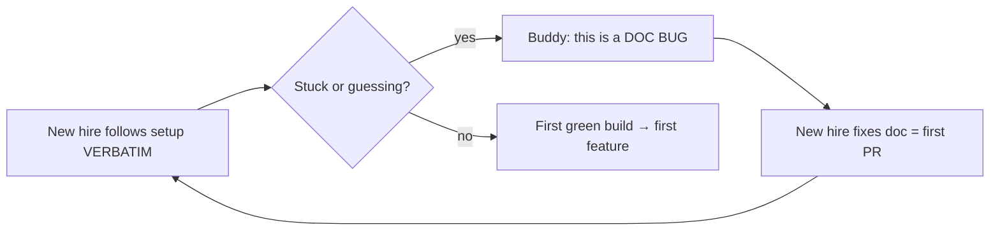
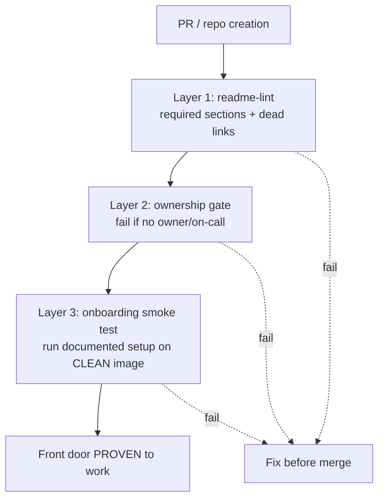
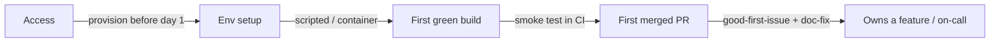

# READMEs & Onboarding Docs — Professional

> **Category:** [Documentation](../README.md) — the README is your project's front door; onboarding docs are the path from "I cloned it" to "I shipped a change."

> **Prerequisites:** [Junior](junior.md) · [Middle](middle.md) · [Senior](senior.md)
> **Focus:** **Production** — standards, automation, metrics, org-wide consistency

---

## Table of Contents

1. [Introduction](#introduction)
2. [A README Standard Across an Organization](#a-readme-standard-across-an-organization)
3. [Enforcing the Front Door in CI](#enforcing-the-front-door-in-ci)
4. [Onboarding Metrics That Matter](#onboarding-metrics-that-matter)
5. [The Onboarding Buddy and the Doc-Bug Loop](#the-onboarding-buddy-and-the-doc-bug-loop)
6. [Reviewing READMEs and Setup Docs](#reviewing-readmes-and-setup-docs)
7. [Real Incidents](#real-incidents)
8. [The Politics of the Front Door](#the-politics-of-the-front-door)
9. [Checklists](#checklists)
10. [Cheat Sheet](#cheat-sheet)
11. [Diagrams](#diagrams)
12. [Related Topics](#related-topics)

---

## Introduction

> Focus: **production** — keeping the front door working across many repos, many contributors, and years.

One good README is a personal achievement. Five hundred consistently good READMEs across an organization, each kept honest as the code beneath it changes weekly, is an *operational* problem — the professional-level concern. At this scale, individual diligence doesn't hold: people leave, repos get abandoned, setup scripts rot, and the same onboarding gap costs every new hire the same lost day.

The professional answer is a *system*: a README standard the org agrees on, automation that enforces and tests the front door, metrics that make onboarding friction visible, and a culture that treats a failed setup step as a logged bug rather than a new hire's problem. This file is about running that system.

---

## A README Standard Across an Organization

When an engineer can parachute into any repo and find the same things in the same places, orientation cost collapses. That requires a **standard** — a documented, scaffolded, ideally enforced skeleton.

A typical org README standard mandates:

```markdown
# <service-name>

> One-line description. (What is it? Who is it for?)

**Owner:** Team Payments · **On-call:** PagerDuty · **Slack:** #payments
**Status:** Production · **Tier:** 1 (revenue-critical)

## Quick start
<copy-pasteable: clone → setup → run → expected output>

## Architecture
<one paragraph + link to ARCHITECTURE.md or design doc>

## Running tests
## Configuration
<env vars table, link to secrets source — never inline secrets>

## Deploy & operate
<link to runbook>

## Contributing
<link to CONTRIBUTING.md>
```

The non-negotiables at the org level — the lines that pay for themselves a hundred times across the estate:

- **Ownership block.** Team, on-call, Slack channel. This single block turns an orphaned repo back into a maintained one and is the first thing an incident responder needs.
- **A working quick start.** Standard says it must be copy-pasteable and tested (see CI below).
- **Status and tier.** Is this production-critical, deprecated, or a prototype? An evaluator reading an internal repo needs to know whether to trust it.
- **Links, not inlined chapters.** Runbook, `ARCHITECTURE.md`, `CONTRIBUTING.md` are linked; the README stays thin.

Ship the standard as a **scaffold**, not a wiki page nobody reads: a `cookiecutter`/`degit` template, a repo-creation bot, or a "new service" generator that emits the skeleton pre-filled with ownership from your service catalog. Standards that require manual compliance decay; standards baked into repo creation hold.

---

## Enforcing the Front Door in CI

Discipline doesn't scale; automation does. Three layers of CI enforcement, from cheap to strong:

### Layer 1 — Structural lint (does the README have the required parts?)

```yaml
readme-lint:
  steps:
    - run: |
        test -f README.md          || { echo "::error::no README"; exit 1; }
        grep -q "^## Quick start"   README.md || { echo "::error::no Quick start"; exit 1; }
        grep -q "Owner:"            README.md || { echo "::error::no Owner block"; exit 1; }
    # plus markdownlint for formatting, and lychee/markdown-link-check for dead links
```

Cheap, catches the orphaned/templated/`TODO: write docs` README, enforces the standard's required sections, and kills dead links before a reader hits one.

### Layer 2 — Ownership enforcement

Fail CI (or block repo creation) if the ownership metadata is missing — wired to `CODEOWNERS` and/or a service catalog. An internal repo with no owner is a future 3 a.m. mystery; refuse to let it exist.

### Layer 3 — The onboarding smoke test (does the quick start actually work?)

This is the layer that defeats "works on my machine" — run the documented setup on a clean image, exactly as a new hire would:

```yaml
onboarding-smoke-test:
  runs-on: ubuntu-latest          # blank slate, nothing pre-installed
  steps:
    - uses: actions/checkout@v4
    - run: make setup             # the exact command CONTRIBUTING.md tells humans to run
    - run: make test              # the "first green build" milestone, proven
    - run: |
        timeout 20 make run &
        sleep 6
        curl -fsS localhost:8080/health   # the expected-output promise, verified
```

When this job is green, the quick start is a *proof*, not a hope: CI just *was* a new contributor on a clean machine and succeeded. This is the single highest-value piece of onboarding automation — it makes the front door's central promise continuously true. (See [docs-as-code](../10-docs-as-code-and-tooling/professional.md) and [keeping docs alive](../11-keeping-docs-alive-and-doc-rot/professional.md).)

---

## Onboarding Metrics That Matter

You cannot improve what you don't measure, and "we have an onboarding doc" is not a measurement. The professional tracks **outcomes**, with the leading metric being the path's throughput.

| Metric | What it tells you | Watch out for |
|---|---|---|
| **Time-to-first-commit** | Whole-path health (clone → merged PR) | The headline metric; instrument it |
| **Time-to-first-green-build** | Setup-and-build health specifically | Isolates the env-setup leak |
| **Onboarding-doc bug count** | How leaky the docs are (per new hire) | *Rising* per-hire count = rotting docs |
| **Repeated-question rate** | Knowledge missing from docs | Same question in Slack ≥3× → a doc gap |
| **Quick-start CI pass rate** | Whether the front door promise holds | Should be ~100%; flakes = real friction |
| **README standard compliance** | Estate consistency | % of repos passing readme-lint |

### How to read them

- **Time-to-first-commit is the headline.** It's the proxy for the whole developer experience. Capture it at onboarding (a simple "date of first merged PR minus start date"); track its *trend*. Rising means the system is degrading.
- **The doc-bug count per new hire should fall over time, not rise.** If each successive hire logs *more* setup bugs, your docs are rotting faster than you're fixing them — the smoke test (above) is the structural fix.
- **Repeated questions are a metric, not noise.** The same question asked three times is a documentation defect with a clear address: the answer belongs in the README/onboarding doc. Track the top repeated questions and convert them into docs.
- **The ground truth is the outcome, not the artifact.** A beautiful onboarding wiki with a five-day time-to-first-commit is failing. A three-line README with a one-hour time-to-first-commit is succeeding. Measure the result, not the diligence.

> Beware vanity metrics: "pages of onboarding documentation" and "wiki page views" measure activity, not success. The only metrics that matter are whether new people get productive fast and stay unblocked.

---

## The Onboarding Buddy and the Doc-Bug Loop

The professional operationalizes the middle-level idea ("gaps are bugs") into a standing process:

1. **Every new hire is paired with a buddy** and given the setup doc to follow **verbatim** on day one.
2. **The new hire's literal first task is to fix the onboarding doc** — every step that failed, every command that needed guessing, every secret they had to ask for. This produces the day-one win (a merged PR) *and* repairs the doc while the gaps are freshest in the only mind that can see them clearly.
3. **The buddy resists the urge to "just help."** When the new hire is stuck, the buddy's job is to note *why the doc didn't prevent it*, not only to unblock — because unblocking one person fixes one day; fixing the doc fixes every future hire.



This loop is self-improving: each newcomer arrives with maximum naïveté and minimum context — exactly the conditions under which doc gaps are visible — fixes the doc, and hands a slightly better path to the next person. **The cost of the gap is paid once and amortized across every future hire.** A team that runs this loop for a year has onboarding docs that work; a team relying on tribal memory does not.

---

## Reviewing READMEs and Setup Docs

README and setup-doc changes deserve the same review rigor as code, because they're read more than most code. What a reviewer checks:

- **The 30-second test still passes.** After this change, can a stranger answer *what / for whom / how to start*? Edits that bury the one-liner or break the quick start fail review.
- **Commands are copy-pasteable and assume nothing.** No "obviously also install X," no missing secret, no unstated tool version. Ideally, the smoke test already proves this — but the reviewer confirms the doc *matches* what CI runs.
- **Links resolve and point at the right depth.** Companion files are linked, not inlined; depth is promoted to the right spoke (runbook, `ARCHITECTURE.md`, docs site).
- **Ownership and status are present and current** (internal repos).
- **No secrets, tokens, or internal hostnames** leaked into the README. (A surprisingly common incident — see below.)

### Review comment templates

> "This quick start assumes Postgres is already running. Add a prerequisite line or fold it into `make setup` so a fresh clone works — otherwise it'll fail for anyone who isn't you."

> "Great detail, but this config section is now two screens — it's drowning the quick start. Let's move the full reference to the docs site and keep the three common vars here with a link."

> "The README still lists the old `npm run start`; CI's smoke test runs `make run`. They've drifted — please make the README match the tested command (or fix the smoke test)."

> "This internal service has no Owner/on-call block. Per the README standard, add it — readme-lint will fail without it anyway."

---

## Real Incidents

### Incident 1: The README that rotted into a three-day onboarding

A revenue-critical service's README quick start hadn't been touched in a year while the build system migrated from a shell script to a `Makefile` and then to Bazel. New hires dutifully followed the documented steps, which failed in three different ways; each spent two to three days reverse-engineering the real setup by interrupting the team. **Postmortem:** the quick start was prose with no executable backing, so nothing caught the drift. **Fix:** the documented setup was reduced to `make setup`, and an onboarding-smoke-test CI job (clean image, run the documented commands) was added. The next hire was green in forty minutes. **Lesson:** an untested quick start *will* rot; back it with a script and test it in CI.

### Incident 2: The secret in the README

In a hurry, an engineer pasted a *working* database connection string — credentials and all — into a README quick start so it would "just work" for the next person. It worked for the next person, and for anyone who later cloned the now-public mirror. **Result:** credential rotation, an audit, and a new secret-scanning gate. **Fix:** the README's quick start became `cp .env.example .env` with a link to the team vault; a CI secret scanner (and a pre-commit hook) now blocks credentials in any tracked file. **Lesson:** never inline secrets to make a quick start convenient; reference where to *get* them.

### Incident 3: The 1,800-line README nobody read

A popular internal platform's README had accreted every config option, every edge case, and three years of FAQ into one file. New users couldn't find the quick start; it sat below a 40-row option table. Adoption stalled and the team fielded the same starter questions weekly. **Fix:** the README was cut to a one-liner, a tested quick start, and links; the depth moved to a versioned docs site with proper Diátaxis sections. Starter questions dropped sharply. **Lesson:** completeness is not a README virtue. Promote depth out; keep the front door thin enough to pass the 30-second test.

### Incident 4: The orphaned repo at 3 a.m.

During an incident, responders found the failing service's repo had **no owner listed** anywhere — the team that wrote it had reorganized away. Twenty minutes of the outage were spent just finding who could deploy a fix. **Fix:** an org-wide rule — CI fails any repo whose README lacks an Owner/on-call block, backed by `CODEOWNERS` and the service catalog. **Lesson:** at scale, the ownership block is the most operationally valuable line in the README. Enforce it.

---

## The Politics of the Front Door

Sustaining good READMEs and onboarding is partly social:

- **Docs work is undervalued because it's invisible when it works.** A great README produces *no* support questions and *fast* onboarding — the absence of pain, which nobody notices. Make the value visible with the metrics above (time-to-first-commit, repeated-question rate) so the investment can be defended.
- **"We don't have time for the README" is false economy.** The README is written once and read by everyone for the project's life; the hours are recovered on first contact. Frame it as capacity recovery, not overhead.
- **Onboarding-doc fixes need a clear owner, or they're nobody's job.** The doc-bug loop (new hire fixes the doc as their first PR) assigns the owner automatically and durably. Without it, "someone should update the wiki" never happens.
- **Reward the unglamorous wins.** The engineer who cut the README from 1,800 lines to 80 and added a smoke test did more for the team than most features. Make that visible in reviews and retros, or it won't recur.

> The front door is a commons: everyone benefits, so without an owner and a process, no one tends it. The professional's job is to install the owner (the next new hire), the process (the doc-bug loop), and the proof (the CI smoke test) — so the commons stays maintained without depending on anyone's goodwill.

---

## Checklists

### README review checklist

```text
README REVIEW CHECKLIST
[ ] 30-SECOND TEST — what is it? for whom? how to start? — answerable up top
[ ] QUICK START — copy-pasteable, assumes no tools/secrets, shows expected output
[ ] QUICK START — matches what the CI smoke test actually runs (no drift)
[ ] LINKS — resolve; companion files linked not inlined; depth promoted to spokes
[ ] OWNERSHIP — team / on-call / Slack present and current (internal repos)
[ ] STATUS/TIER — production / deprecated / prototype is clear (internal)
[ ] NO SECRETS — no credentials, tokens, internal hostnames in the file
[ ] SCANNABLE — front door is thin; not a 1,000-line manual
[ ] STANDARD — passes readme-lint (required sections present)
```

### Onboarding-system checklist

```text
ONBOARDING SYSTEM CHECKLIST
[ ] Access provisioned BEFORE start date (not a day-one wait)
[ ] Setup is a SCRIPT or CONTAINER, not prose steps
[ ] Onboarding smoke test runs the documented path on a CLEAN image in CI
[ ] New hire follows the doc VERBATIM; gaps are logged as doc bugs
[ ] New hire's FIRST PR fixes the onboarding doc (day-one win + repair)
[ ] Time-to-first-commit is measured and its TREND is watched
[ ] Repeated questions (≥3×) are converted into docs
[ ] Doc-bug-count-per-hire is FALLING, not rising
```

---

## Cheat Sheet

```text
STANDARD       one skeleton across all repos: one-liner · OWNERSHIP ·
               quick start · status/tier · links (not inlined chapters).
               Ship it as a scaffold/generator, not a wiki page.

ENFORCE        Layer 1: readme-lint (required sections, dead links)
               Layer 2: fail CI if no owner (CODEOWNERS / catalog)
               Layer 3: ONBOARDING SMOKE TEST — run documented setup on a
                        clean image. Defeats "works on my machine."

MEASURE        time-to-first-commit (headline) · time-to-first-green-build ·
               doc-bug-count-per-hire (should FALL) · repeated-question rate.
               Outcomes, not "pages of docs" (vanity).

LOOP           new hire follows VERBATIM → gap = doc bug → hire fixes it as
               first PR. Self-improving; cost paid once, amortized over all hires.

NEVER          inline secrets in a quick start · let the README rot untested ·
               bloat the front door past the 30-second test · ship an unowned repo.
```

---

## Diagrams

### Three layers of front-door enforcement in CI



### Where onboarding time leaks, and the production fix for each



---

## Related Topics

- **Automation backbone:** [Docs as Code & Tooling](../10-docs-as-code-and-tooling/professional.md), [Keeping Docs Alive](../11-keeping-docs-alive-and-doc-rot/professional.md)
- **Linked from the README:** [Runbooks & Ops Docs](../07-runbooks-and-operational-docs/junior.md), [Changelogs & Release Notes](../09-changelogs-and-release-notes/junior.md)
- **The boundary's deep side:** [Architecture Decision Records](../05-architecture-decision-records-adrs/junior.md), [Design Docs & RFCs](../06-design-docs-and-rfcs/junior.md)
- **Tooling:** markdownlint, lychee/markdown-link-check, Dev Containers, Backstage (service catalog), secret scanners (gitleaks, trufflehog).

---


---

## Check your understanding

1. Explain READMEs & Onboarding Docs — Professional Level in your own words and name the problem it solves.
2. How would you apply the ideas around Table of Contents, Introduction, A README Standard Across an Organization in a realistic engineering change?
3. What failure mode or misuse should you look for, and what evidence would reveal it?
4. How would you introduce and govern READMEs & Onboarding Docs — Professional Level across teams through reversible, measurable increments?
5. What observable result would convince you that the approach improved the system?
