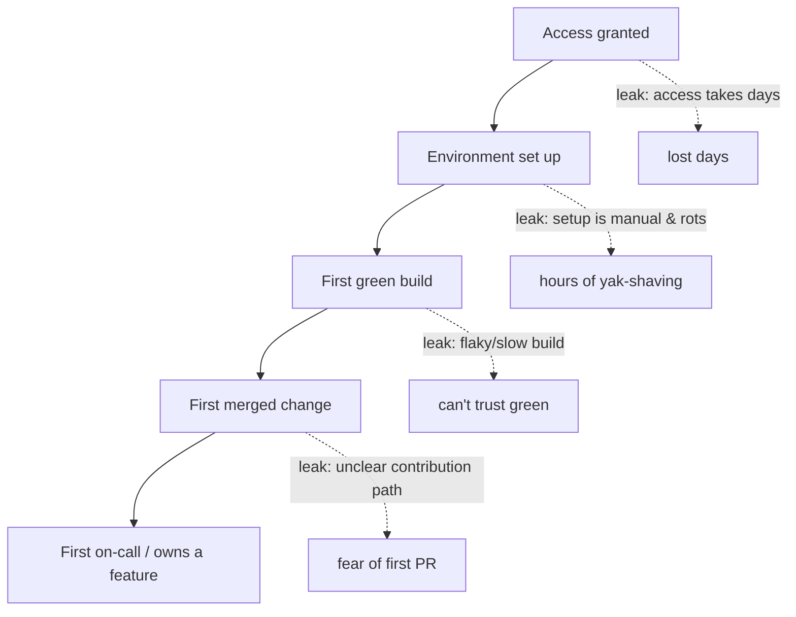
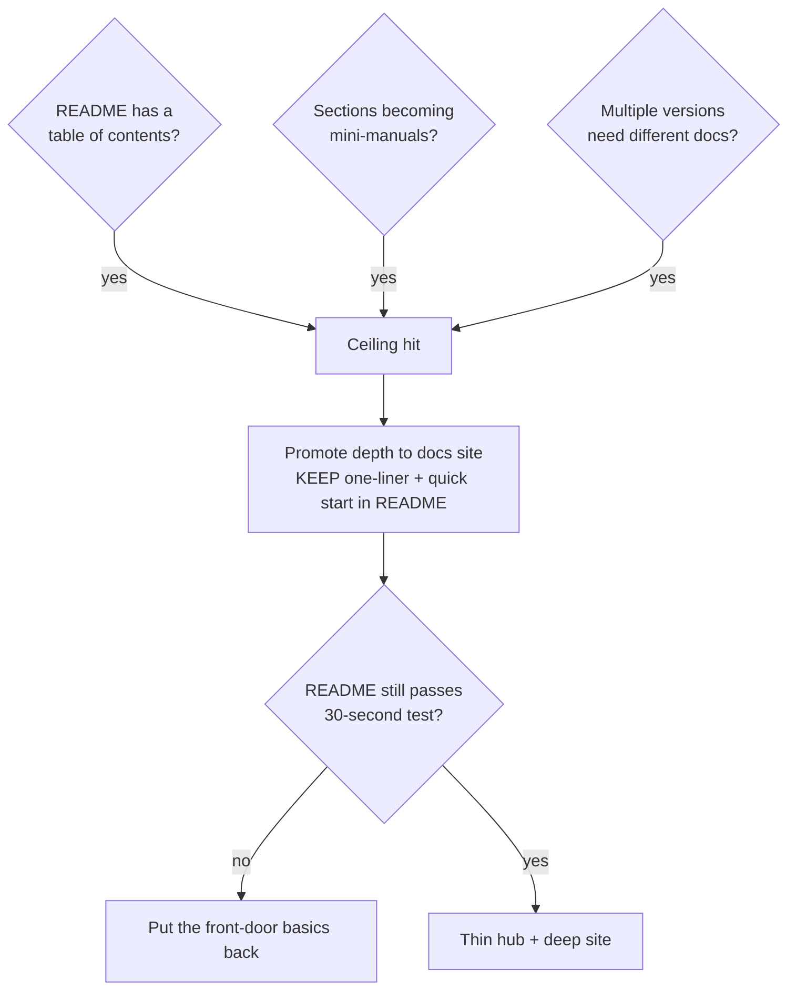
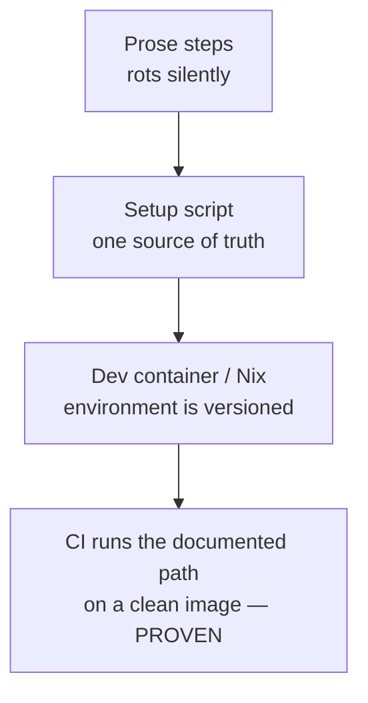

# READMEs & Onboarding Docs — Senior

> **Category:** [Documentation](../README.md) — the README is your project's front door; onboarding docs are the path from "I cloned it" to "I shipped a change."

> **Prerequisites:** [Junior](junior.md) · [Middle](middle.md)
> **Focus:** **Design trade-offs** and **system-level reasoning**

---

## Introduction

> Focus: **design trade-offs** and **system-level reasoning**

At the senior level, a README stops being a file you write and becomes a **boundary you design**. It is the contract between a system and everyone who has to use, operate, or change it without having built it. Onboarding likewise stops being a document and becomes a **system** — a path with measurable throughput, leaks you can locate, and an economic value you can defend in a planning meeting.

This file covers the hard questions a senior owns:

1. **What is the README's *real* job in a system's architecture?** (It's a boundary doc — the same role an API contract plays for code.)
2. **When does a README stop scaling, and what replaces it?** (The README → docs-site transition, and how to make it without breaking the front door.)
3. **How do you treat onboarding as an engineered system** with a metric, leak detection, and a return on investment you can quantify?

---

## The README as an Architectural Boundary

A senior recognizes the README as the same kind of artifact as a public API signature or a service contract: a **stable boundary that decouples the inside from the outside.** The code behind it can change freely; the README is the promise about how to *enter*.

This framing has consequences:

- **The README describes the *interface*, not the *implementation*.** A quick start says "run `make run` and hit `:8080`" — it doesn't explain the internal request pipeline. When the implementation changes but the entry contract holds, the README shouldn't change. When the README *must* change to reflect an internal refactor, that's a smell: the boundary was leaking implementation.
- **It's a contract with humans, so it has the same versioning concerns as any contract.** If your README's quick start changes between versions, you've made a breaking change to the *onboarding contract* — and like any breaking change, it deserves a note in the [changelog](../09-changelogs-and-release-notes/junior.md) and, for libraries, attention to who depends on the old instructions.
- **Boundary thinking tells you what belongs in the README and what doesn't.** Anything a *user/operator* needs to cross the boundary (start it, configure it, call it) belongs. Anything only a *maintainer* needs (why the internal cache is an LRU) belongs in `ARCHITECTURE.md` or a [design doc](../06-design-docs-and-rfcs/junior.md) — behind the boundary, not on it.

> A README is to a system what a function signature is to a function: the part that's *meant* to be depended on. Design it to stay stable while the inside churns.

The corollary for senior design: **a system whose README must change on every internal refactor has a leaky boundary.** Good encapsulation shows up in documentation as much as in code — the README of a well-bounded service describes a small, stable surface; the README of a tangled one is a sprawling map of internals because there's no clean way in.

---

## When the README Should Become a Docs Site

Every README has a scaling ceiling. Past it, cramming more in makes the front door *worse* — bloated, unscannable, failing the 30-second test it exists to pass. The senior decision is *when* to promote documentation out of the README and into a dedicated site, and how to do it without breaking the front door.

**Signals you've hit the ceiling:**

- The README has a table of contents (a README that needs internal navigation is too long).
- Sections are growing into mini-manuals (the config section is two screens; the usage section has a dozen examples).
- Multiple audiences are fighting for the same file (the evaluator's "what is this" sits above the operator's deploy guide sits above the contributor's setup).
- You're versioning concerns — users on v1 and v2 need different instructions, which a single Markdown file can't express.

**The transition pattern — promote, don't dump:**

```
BEFORE (ceiling hit)              AFTER (promoted)
┌──────────────────────┐         ┌──────────────────────┐
│ README                │        │ README (thin hub)     │
│  one-liner            │        │  one-liner            │
│  quick start          │        │  quick start (kept!)  │
│  usage (12 examples)  │  ───►  │  → docs site /guides  │
│  config (2 screens)   │        │  → docs site /config  │
│  deploy guide         │        │  → runbook            │
│  architecture         │        │  → ARCHITECTURE.md    │
└──────────────────────┘         └──────────────────────┘
                                  docs site: tutorials,
                                  how-tos, reference,
                                  explanation (Diátaxis-clean,
                                  versioned, searchable)
```

The critical constraint: **the README must still pass the 30-second test after the split.** Promotion is not "delete the README and point to a site." It's "keep the one-liner and a working quick start in the README; move the *depth* to the site." A reader who lands on the repo should *still* learn what it is and how to start without leaving — then follow links for everything else.

What the docs site buys you that a README can't: **search, versioning, navigation, and Diátaxis cleanliness** (separate tutorial/how-to/reference/explanation sections instead of one file blending them). The cost is a second system to build and keep alive (see [docs-as-code](../10-docs-as-code-and-tooling/senior.md)). Promote when the README's pain exceeds that cost — not before, because a docs site for a small project is its own over-engineering.

---

## Onboarding as a System, Not a Document

A senior owns onboarding as a **system with throughput**, not a wiki page. The system has stages, each stage leaks people or time, and you can instrument and fix the leaks like any pipeline.



Each leak is a distinct failure with a distinct fix:

| Stage leak | Symptom | Fix (system, not pep talk) |
|---|---|---|
| Access | Day one spent waiting for permissions | Provision access *before* start date; automate it |
| Environment | "It doesn't build on my laptop" | Scripted/containerized setup; dev containers |
| First green build | Build is slow or flaky, so green is meaningless | Fix the build before fixing the docs |
| First change | New hire afraid to open a PR | A "good first issue" queued; a tiny doc fix as the warm-up |
| First ownership | Can't find who owns what | `ARCHITECTURE.md` + ownership/contacts in every README |

The senior insight: **onboarding friction is usually a symptom of engineering friction, not a documentation problem.** If setup takes a day, the fix is a better setup script — not a better-written description of the painful manual steps. If the first green build is untrustworthy because the suite is flaky, no onboarding doc helps. **Document the path, but first make the path short.** The best onboarding doc is the one that can be three lines long because the underlying system is good.

---

## The Economics of Time-to-First-Commit

Seniors justify investment in onboarding and READMEs with arithmetic, because "good docs" loses budget fights and "this saves N engineer-days per hire" wins them.

The model is simple. Let:

- `H` = new technical hires per year,
- `Δ` = hours saved per hire by good onboarding (a manual, rot-prone setup easily costs a new hire 1–3 days; a scripted one costs an hour),
- `R` = the recurring tax: every existing engineer interrupted to answer the same setup question, every quarter.

```
Annual cost of BAD onboarding ≈ (H × Δ)              ← wasted new-hire days
                              + (R interruptions × team size)  ← repeated questions
                              + abandoned-evaluation cost      ← for libraries: lost adoption

Cost of GOOD onboarding ≈ initial scripting + ongoing upkeep (small, amortized)
```

For a team hiring ten engineers a year, shaving two days off each is twenty engineer-days — several weeks of capacity — recovered annually, *before* counting the interruption tax on everyone else. That is a trivially positive return on a few days of writing a setup script and a README. The senior move is to **frame onboarding investment as capacity recovery**, with this arithmetic, in the same language as any other efficiency project.

For *libraries*, the economics shift to **adoption**: a README that fails the 30-second test loses evaluators to competitors. Here the cost of a bad README is not internal hours but market share — every abandoned evaluation is a user who chose someone else's library because theirs was easier to start. The README is, for an open-source project, the top of the adoption funnel.

> "We don't have time to write the README" is almost always false economy. The README is written once and read by everyone who touches the project for its entire life. The hours are recovered on first contact.

---

## Executable Onboarding: Making Docs a Build Artifact

The senior-grade defense against onboarding rot is to make the setup *be* code, so it lives or dies with the build — the convergence of this topic with [docs-as-code](../10-docs-as-code-and-tooling/senior.md) and [keeping docs alive](../11-keeping-docs-alive-and-doc-rot/senior.md).

The ladder of executability:

1. **Prose steps** — rot silently; the floor.
2. **A setup script** (`make setup`, `./scripts/bootstrap`) — one source of truth, run daily, breaks loudly.
3. **A dev container / reproducible environment** (Dev Containers, Nix, a `compose.yaml` dev profile) — the environment itself is version-controlled; "works on my machine" becomes "works in *the* machine."
4. **CI runs the documented path on a clean image** — the quick start is *tested* on every commit in an environment identical to a new contributor's blank slate. Drift fails the build before a human hits it.

```yaml
# A CI job that proves the README's quick start still works.
# Runs on a clean image — the same blank slate a new hire starts from.
onboarding-smoke-test:
  runs-on: ubuntu-latest         # fresh, nothing pre-installed
  steps:
    - uses: actions/checkout@v4
    - run: make setup            # exactly what CONTRIBUTING.md tells a human to run
    - run: make test             # the "first green build" milestone, proven
    - run: timeout 15 make run & sleep 5 && curl -fsS localhost:8080/health
```

When this job is green, you have a *proof* — not a hope — that a new contributor following the docs will succeed, because CI just *was* that contributor. This is the strongest possible answer to "works on my machine": the documented path is continuously exercised on a machine that resembles no one's laptop and everyone's first day.

The design trade-off: this couples your docs to your CI and adds maintenance to the pipeline. For a service many people onboard onto, it's clearly worth it. For a tiny script, a setup *script* (level 2) is plenty. Match the rung to the cost of onboarding failure.

---

## README-Driven Development as a Design Tool

At the senior level, RDD (introduced at [Middle](middle.md)) is less a documentation habit and more an **interface-design technique** — and it earns its place in design review.

- **RDD makes the API's ergonomics reviewable before they're expensive.** A README showing the intended usage is a design artifact you can put in front of teammates and ask "is this nice to use?" — *before* implementation locks the shape. It surfaces awkwardness (a confusing parameter, a missing default, a clumsy call sequence) at prose cost.
- **It's the documentation analog of designing the test first.** TDD designs from the caller's needs; RDD designs the *interface* from the caller's needs. Both invert the natural implementation-outward instinct that produces APIs convenient for the author and awkward for the user.
- **It pairs with [design docs and RFCs](../06-design-docs-and-rfcs/junior.md).** For a significant new component, the RDD-style "here's how you'll use it" README *is* a core section of the design doc — it makes the proposal concrete and forces the author to commit to a usable surface, not just an architecture.

The limit a senior must respect: RDD presumes you *know* the interface you're aiming for. For genuinely exploratory work — research code, a spike to learn a domain — writing the README first is premature commitment to an interface you haven't earned the knowledge to design. Use RDD where the surface is deliberate (libraries, services, CLIs, public APIs); skip it where you're still discovering what the thing even is.

---

## The Front Door at Scale: Many Repos

In an organization with hundreds of repos, the README problem becomes a *consistency* problem. A senior thinks about the front door across the whole estate, not one project:

- **A README *standard* (and a template/linter).** Every repo's README has the same skeleton — one-liner, ownership, quick start, links — so an engineer landing on any repo knows where to look. A linter (or a scaffolding tool that generates the skeleton) enforces it cheaply.
- **Ownership is non-negotiable in every internal README.** Across hundreds of repos, the most valuable line is "owned by team X, on-call here, Slack #channel." It's what turns an orphaned repo back into a maintained one. Many orgs enforce this via a `CODEOWNERS`/service-catalog integration that *fails CI* if ownership metadata is missing.
- **A service catalog / developer portal** (Backstage and similar) becomes the meta-front-door — the README of READMEs — indexing every service, its owner, its docs, its health. The per-repo README still must pass the 30-second test; the catalog is how someone *finds* the right repo in the first place.
- **The onboarding system spans repos, not just one.** "Set up your dev environment" for a microservice fleet is a different, harder problem than for one repo — it's the whole local stack. Senior onboarding work here is often a single `make dev-up` that stands up the *system*, documented once, owned centrally.

> At one repo, the README is a document. At a thousand repos, the README is a *protocol* — a shared structure that lets any engineer parachute into any repo and orient in seconds. Enforce the protocol; the individual READMEs follow.

---

## Liabilities

### Liability 1: The README that rots into a lie

A README whose quick start no longer works is worse than no README — it actively wastes the reader's time and erodes trust in *all* the docs. The fix is structural (delegate to scripts; test in CI), not exhortative ("remember to update it"). An untested quick start *will* rot; assume it.

### Liability 2: Documenting friction instead of removing it

Writing an elaborate, careful guide to a painful 30-step manual setup is effort spent in the wrong place. The senior failure is polishing the description of a bad path instead of fixing the path. Always ask: can this step be *scripted away* rather than *documented better*?

### Liability 3: README bloat masquerading as thoroughness

A 2,000-line README *feels* thorough and *is* useless — nobody reads it, and the 30-second answer drowns. Completeness is not a README virtue; routing-to-depth is. Promote depth to a docs site; keep the front door thin.

### Liability 4: Onboarding measured by activity, not outcome

"We have an onboarding wiki" is activity. "New hires reach their first merged PR in two days" is outcome. A senior measures time-to-first-commit and the leak points — not the existence of documents. A thick onboarding doc that nobody can follow is a failure dressed as diligence.

### Liability 5: Missing the boundary leak

When the README must change on every internal refactor, the system's boundary is leaking implementation into its entry contract. That's an architecture smell surfacing in docs — fix the encapsulation, don't just keep re-editing the README.

---

## Pros & Cons at the System Level

| Dimension | Strong README + executable onboarding | Neglected README / manual onboarding |
|---|---|---|
| Time-to-first-commit | Hours | Days |
| Repeated-question tax on the team | Near zero | Constant interruption |
| Adoption (libraries) | High — evaluators succeed fast | Low — abandoned evaluations |
| Trust in docs | High — they're proven (CI) | Erodes — quick start rots into a lie |
| Maintenance cost | Real but amortized over every reader | "Free" until it costs everyone, forever |
| Resilience to staff turnover | High — ownership + executable setup | Low — knowledge leaves with people |
| Risk on irreversible doc decisions | Low — front door stays thin & stable | High — bloat/rot compound silently |

The system-level verdict: investment in the front door and the onboarding path has an unusually high, front-loaded return because the artifacts are **written once and read by everyone, forever.** The cost is real and recurring (someone must keep them alive), but the failure mode of neglect — abandoned evaluations, days of yak-shaving per hire, a permanent question tax, knowledge that walks out with departing engineers — is far more expensive and, crucially, *invisible* until you measure it.

---

## Diagrams

### When to promote the README to a docs site



### Executability ladder for onboarding (rot-resistance increases downward)



---

## Related Topics

- **The boundary's deep side:** [Architecture Decision Records](../05-architecture-decision-records-adrs/junior.md), [Design Docs & RFCs](../06-design-docs-and-rfcs/junior.md)
- **Keeps the front door honest:** [Docs as Code & Tooling](../10-docs-as-code-and-tooling/senior.md), [Keeping Docs Alive](../11-keeping-docs-alive-and-doc-rot/senior.md)
- **Linked from the README:** [Changelogs & Release Notes](../09-changelogs-and-release-notes/junior.md), [Runbooks & Ops Docs](../07-runbooks-and-operational-docs/junior.md)
- **The doc-type lens:** [Why & What to Document](../01-why-and-what-to-document/senior.md)

---


---

## Check your understanding

1. Explain READMEs & Onboarding Docs — Senior Level in your own words and name the problem it solves.
2. How would you apply the ideas around Table of Contents, Introduction, The README as an Architectural Boundary in a realistic engineering change?
3. What failure mode or misuse should you look for, and what evidence would reveal it?
4. How would you validate a system-level decision about READMEs & Onboarding Docs — Senior Level under uncertainty?
5. What observable result would convince you that the approach improved the system?
