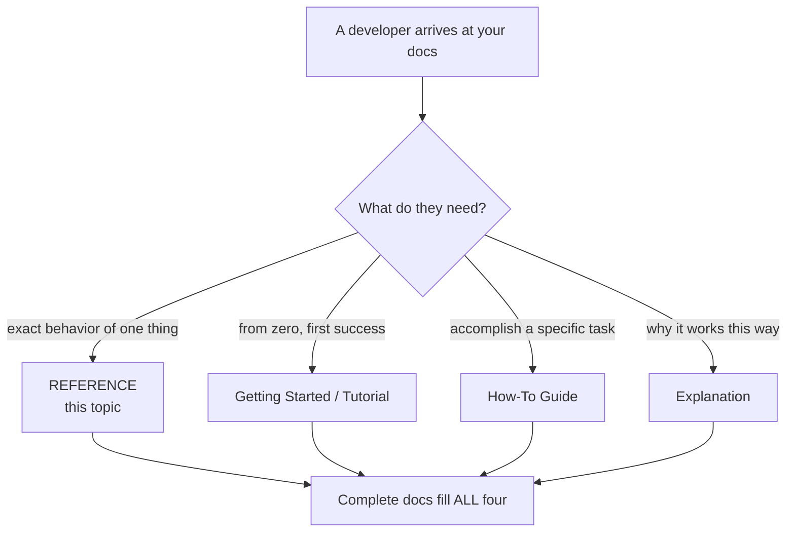

# API & Reference Documentation — Junior

> **Category:** [Documentation](../README.md) — reference docs as a craft: the exhaustive, lookup-oriented description of an API's machinery, and the runnable examples and guides that make it usable.

---

## Introduction

> Focus: **What is it?** and **How to use it?**

**Reference documentation** is the exhaustive, structured description of an API — every endpoint or function, with its parameters, types, defaults, return shapes, errors, and an example of each. It is the part of the docs you *look things up in*, not the part you read end to end. When you search "what does the `limit` parameter on `/v1/charges` default to?", the answer lives in the reference.

> **Reference documentation** describes *the machinery* — what each part of the API is, exactly, and how it behaves. It is information-oriented and built for lookup, not for learning.

This is distinct from **guides** and **tutorials**, which are task- and learning-oriented: "how do I accept my first payment?" A great set of API docs needs **both** — a complete reference *and* task-oriented guides *and* a getting-started page. Reference alone is cold and hard to start with; guides alone leave you stranded the moment you need a detail they didn't cover.

### Why this matters

The reference is the contract. When a developer integrates your API at 2 a.m. against a deadline, they don't want prose — they want to find the exact field name, the exact error code, and a `curl` line they can paste and run. Reference docs that are incomplete, inconsistent, or wrong are worse than no docs: they send people down the wrong path with confidence. The best developer APIs in the industry — Stripe, Twilio — win adoption substantially *because* their reference is complete, consistent, and full of examples that run.

> This topic covers reference docs as a **craft** — what to write and how to structure it. The specific *tooling* (Swagger UI generators, Redoc, doc portals) is covered in **Backend → API Documentation Tools**. Code-level reference produced from docstrings (Javadoc, Sphinx, godoc) is covered in **[Code Comments & Docstrings](../02-code-comments-and-docstrings/)**.

---

## Prerequisites

- **Required:** You have called or built at least one API — a REST endpoint, a library function, or both.
- **Required:** You can read JSON and an HTTP request/response (method, path, headers, status code, body).
- **Helpful:** Familiarity with the **[Diátaxis](../01-why-and-what-to-document/)** four-mode model of documentation (tutorial / how-to / reference / explanation).
- **Helpful:** Exposure to **[docstrings and doc generators](../02-code-comments-and-docstrings/)**, which produce one kind of reference automatically.

---

## Glossary

| Term | Definition |
|------|-----------|
| **Reference docs** | Exhaustive, structured, lookup-oriented description of every part of an API. |
| **Guide / how-to** | Task-oriented docs that walk a developer through achieving one goal. |
| **Tutorial** | Learning-oriented docs that teach a beginner through a guided first experience. |
| **Getting started** | The shortest path from zero to a first successful call. |
| **Endpoint** | A single addressable operation in a web API (e.g., `POST /v1/charges`). |
| **Parameter** | An input to an operation — path, query, header, or body field. |
| **Return shape** | The structure of a successful response (fields, types, nesting). |
| **Error code** | A documented failure response (HTTP status + an application error code/message). |
| **OpenAPI / Swagger** | A machine-readable specification format for REST APIs; the source for generated reference docs. |
| **SDK** | A language-specific client library that wraps the raw API. |
| **Drift** | When docs no longer match the code/contract they describe. |

---

## Reference vs. Guides: The Core Distinction

These are two different *modes* of documentation that answer two different questions. Confusing them is the single most common API-doc mistake.

| | **Reference** | **Guide / Tutorial** |
|---|---|---|
| Orientation | Information | Task / learning |
| Reader's question | "What exactly is this and how does it behave?" | "How do I accomplish *X*?" |
| Structure | Mirrors the API (one entry per endpoint/function) | Mirrors the *task* (ordered steps) |
| Completeness | Exhaustive — every parameter, every error | Selective — only what the task needs |
| Read pattern | Looked up, jumped into | Read in order, start to finish |
| Tone | Dry, precise, consistent | Narrative, encouraging |
| Analogy | A dictionary | A recipe / a lesson |

```
          INFORMATION-ORIENTED          TASK-ORIENTED
        ┌────────────────────────┬────────────────────────┐
STUDY   │  EXPLANATION            │  TUTORIAL               │
(learn) │  "why it works this way"│  "your first call"      │
        ├────────────────────────┼────────────────────────┤
WORK    │  REFERENCE              │  HOW-TO GUIDE           │
(apply) │  "every endpoint, exact"│  "accept a payment"     │
        └────────────────────────┴────────────────────────┘
```

> This is the **Diátaxis** quadrant (covered in [Why & What to Document](../01-why-and-what-to-document/)). Reference sits in the bottom-left: information-oriented, work-oriented. A complete API docs site fills *all four* quadrants — but the reference is the one engineers cannot ship the API without.

---

## The Classic Failure: Mixing the Two

The most common API-doc smell is writing **a tutorial where a reference belongs**, or **a reference where a tutorial belongs.**

**Tutorial-as-reference** — the reference reads like a story, so you cannot look anything up:

> *"Now that you've created a customer, you'll probably want to charge them. To do that, send the amount — remember, in cents! — along with the customer ID you got earlier..."*

Where is the complete list of parameters? What are *all* the error codes? You can't find them, because the narrative buried them. A reference must be **scannable**, not narrated.

**Reference-as-tutorial** — the "getting started" page is just the raw endpoint dump:

> *POST /v1/charges. Parameters: amount (integer), currency (string), source (string), customer (string), description (string), metadata (object)...*

A newcomer has no idea which parameters they need *first*, in what order to call things, or what success looks like. They needed a guided path; they got a parts list.

> **The fix:** write each piece in its proper mode. The reference is exhaustive and structured for lookup; the getting-started and guides are selective and structured for the task. Don't make one do the other's job.

---

## What a Great API Reference Contains

For **each** endpoint (web API) or function/class (library), a complete reference entry has:

| Element | Why it must be there |
|---|---|
| **Name & purpose** | One precise sentence on what it does. |
| **Every parameter** | Name, **type**, required/optional, **default**, and **constraints** (range, format, max length). |
| **Return shape** | The exact structure of a successful response, with field types. |
| **Error codes / exceptions** | Every documented failure: HTTP status, error code, when it occurs. A first-class concern, not an afterthought. |
| **Authentication** | How to authenticate this call (API key, OAuth scope, token). |
| **Rate limits** | Limits that apply, and what happens when you exceed them. |
| **Idempotency** | Whether/how a retried call is safe (e.g., idempotency keys). |
| **At least one runnable example** | A request *and* its response, copy-pasteable. |
| **Versioning notes** | Which version this applies to; deprecations. |

The non-negotiables for a *junior* to internalize: **every parameter with its type and default, every error, and a runnable example.** Those three are the difference between a reference and a stub.

> A field documented as just `amount (integer)` is half-done. `amount (integer, required) — the charge amount in the smallest currency unit (e.g., cents for USD). Minimum 50.` is a reference entry. The type, the unit, the constraint, and the requiredness are all *knowledge the caller cannot guess.*

---

## A Poor Endpoint Doc vs. an Excellent One

**Poor** — vague, no types, no errors, no example:

```
GET /users/{id}
Returns a user. Pass the id. May fail.
```

A reader still doesn't know: What type is `id`? What fields come back? What status codes? How do they authenticate? What does "may fail" mean?

**Excellent** — precise, complete, runnable:

````markdown
## GET /v1/users/{id}

Retrieve a single user by ID. Requires a bearer token.

### Path parameters
| Name | Type   | Required | Description                  |
|------|--------|----------|------------------------------|
| `id` | string | yes      | The user's unique ID (`usr_…`). |

### Response `200 OK`
```json
{
  "id": "usr_8f2a",
  "email": "ada@example.com",
  "created_at": "2026-06-11T09:00:00Z",
  "status": "active"        // one of: active | suspended | deleted
}
```

### Errors
| Status | Code              | When                                   |
|--------|-------------------|----------------------------------------|
| 401    | `unauthorized`    | Missing or invalid bearer token.       |
| 404    | `user_not_found`  | No user exists with the given `id`.    |
| 429    | `rate_limited`    | Over 100 req/min; retry after `Retry-After`. |

### Example
```bash
curl https://api.example.com/v1/users/usr_8f2a \
  -H "Authorization: Bearer $API_KEY"
```
````

The excellent version answers every question a caller can have **without leaving the page.** That is the whole job of reference documentation.

---

## Examples That Actually Run

The single highest-leverage thing in any API reference is the **example that you can copy, paste, and run** — and that returns what the docs say it will.

```bash
# A runnable, copy-pasteable example: real command, real shape of response.
curl https://api.example.com/v1/charges \
  -H "Authorization: Bearer $API_KEY" \
  -d amount=2000 \
  -d currency=usd \
  -d source=tok_visa
```

```json
// The response the example actually returns:
{ "id": "ch_3Lq", "amount": 2000, "currency": "usd", "status": "succeeded" }
```

Two rules make examples trustworthy:

1. **Show input *and* output.** An example request with no shown response leaves the reader guessing at the return shape.
2. **Keep them correct.** An example that no longer runs is worse than none — it actively misleads. The mature solution is to *test* your examples (doc-tests; see **[Code Comments & Docstrings](../02-code-comments-and-docstrings/)** for `doctest`/runnable-snippet tooling) so a broken example fails the build instead of a customer's integration.

> Stripe's and Twilio's reference docs are the industry gold standard largely because **every** endpoint has a runnable example, in **multiple languages**, that is generated and tested — so it never drifts from the real API.

---

## The Four Pillars of Developer Docs

Great API documentation (the "Stripe/Twilio" bar) consistently has four pillars. A reference is one of them.

```
   ┌────────────────────────────────────────────────────────────┐
   │  1. GETTING STARTED   from zero to first call in minutes    │
   │  2. GUIDES / HOW-TOS  task recipes ("accept a payment")     │
   │  3. REFERENCE         exhaustive, looked-up, this topic     │
   │  4. SDKs + CHANGELOG  client libs, runnable in your language │
   └────────────────────────────────────────────────────────────┘
```

Traits the gold-standard docs share:

- **Consistency** — every endpoint documented the same way, same field naming, same example format.
- **Runnable examples** — copy-paste and it works, in multiple languages (language switchers).
- **A changelog** — what changed, when (see [Changelogs & Release Notes](../09-changelogs-and-release-notes/)).
- **A status page** — is the API up right now?
- **SDK switching** — the same example shown in `curl`, Python, Node, Go, etc.

A junior's takeaway: **the reference is necessary but not sufficient.** You also need a way in (getting started) and task recipes (guides) for the docs to be genuinely usable.

---

## Reference for Libraries vs. Web APIs

The *audience and conventions* differ, even though the principle (exhaustive, lookup-oriented) is the same.

| | **Library / SDK reference** | **Web API reference** |
|---|---|---|
| Unit of documentation | Function, class, method, type | Endpoint (method + path) |
| Typical source | **Generated from docstrings** (Javadoc, godoc, Sphinx) | **Generated from a spec** (OpenAPI) or hand-written |
| Audience | Developers in *that* language | Developers in *any* language |
| Auth/rate-limit/idempotency | Usually N/A | First-class concerns |
| Errors documented as | Exceptions / error return values | HTTP status + error codes |

For libraries, the reference is largely your **docstrings**, surfaced by a generator (that's why this topic cross-links [Code Comments & Docstrings](../02-code-comments-and-docstrings/)). For web APIs, the reference is largely your **OpenAPI spec**, rendered by a tool. Either way, the goal is the same: someone can look up any part and find its exact behavior.

---

## Best Practices

1. **Write reference in reference mode.** Exhaustive, structured, scannable — never narrated. Save the story for guides.
2. **Document every parameter fully:** name, type, required/optional, default, and constraints. The default and the constraint are the parts juniors forget.
3. **Treat errors as first-class.** List every error code, when it occurs, and how to recover. "May fail" is not documentation.
4. **Give every entry a runnable example** — request *and* response.
5. **Pair the reference with a getting-started and guides.** The reference can't onboard anyone alone.
6. **Be consistent.** Same structure, naming, and example format for every endpoint/function.
7. **Note the version** an entry applies to, and flag deprecations.

---

## Common Mistakes

1. **Narrating the reference.** Turning a lookup resource into a story you can't search.
2. **Dumping the reference as "getting started."** Newcomers need a guided path, not a parts list.
3. **Omitting types, defaults, and constraints.** "amount (integer)" without "in cents, min 50" is a guess generator.
4. **Skipping error documentation.** The errors are *exactly* what a caller hits in production and needs documented.
5. **Examples with no output.** Showing the request but not the response.
6. **Stale examples.** Code that no longer runs — actively misleading.
7. **No way in.** A perfect reference with no getting-started page; people bounce.

---

## Tricky Points

- **Reference completeness ≠ usefulness.** A reference can be 100% complete and still be unusable for a newcomer — because completeness serves *lookup*, not *learning*. That's why guides exist alongside it. (Explored at [Middle](middle.md).)
- **"The reference" might be three different things.** Generated-from-spec (OpenAPI), generated-from-docstrings, and hand-written prose are all "reference" — with very different drift and maintenance properties. (See [Middle](middle.md) and [Senior](senior.md).)
- **Examples are reference content, not decoration.** They carry information (the return shape, the auth header) that the prose often states less clearly.
- **Errors are a feature, not an appendix.** Many integrations spend most of their effort on the unhappy path; undocumented errors are where they get stuck.

---

## Test Yourself

1. In one sentence each, define reference docs and guides, and say which question each answers.
2. What is wrong with writing your reference as a narrative tutorial?
3. List five things a complete reference entry for a web API endpoint must contain.
4. Why is "show the response, not just the request" important for examples?
5. Name the four pillars of great developer documentation.
6. Why must a reference be paired with a getting-started page?

---

## Cheat Sheet

```text
REFERENCE vs GUIDE
  reference   exhaustive, information-oriented, looked-up   "what is it, exactly?"
  guide       selective, task-oriented, read in order       "how do I do X?"
  → write each in its OWN mode; never narrate a reference

A COMPLETE REFERENCE ENTRY (per endpoint/function)
  name+purpose · EVERY param (type, required, default, constraints)
  return shape · ERROR codes (status + when) · auth · rate limit
  idempotency · RUNNABLE example (request + response) · version notes

EXAMPLES
  copy-paste-runnable · show request AND response · keep them correct (test them)

FOUR PILLARS OF DEV DOCS
  1 getting-started   2 guides   3 reference   4 SDKs + changelog
  shared traits: consistency · runnable examples · language switch · status page
```

---

## Summary

- **Reference** documentation is exhaustive, information-oriented, and structured for **lookup** — it describes the machinery. **Guides/tutorials** are task/learning-oriented. Great API docs need **both**, plus a getting-started.
- The classic failure is **mixing the modes**: a narrated reference you can't search, or a raw endpoint dump masquerading as onboarding.
- A complete reference entry has **every parameter (type, default, constraints), the return shape, every error, auth, rate limits, idempotency, a runnable example, and version notes.**
- **Examples that actually run** — request *and* response, kept correct — are the highest-leverage content. Test them so they can't drift.
- The four pillars of gold-standard developer docs: **getting started, guides, reference, SDKs + changelog.**
- Library reference comes mostly from **docstrings**; web API reference comes mostly from an **OpenAPI spec**.

---

## Further Reading

- Diátaxis — [diataxis.fr](https://diataxis.fr) — the reference/how-to/tutorial/explanation model.
- [Stripe API Reference](https://stripe.com/docs/api) — the canonical gold-standard reference.
- [Twilio Docs](https://www.twilio.com/docs) — runnable, multi-language developer docs.
- Nordic APIs — articles on developer-experience traits of great API docs.
- [Write the Docs](https://www.writethedocs.org/) — community guidance on API and reference writing.

---

## Related Topics

- **Builds on:** [Why & What to Document](../01-why-and-what-to-document/) (Diátaxis), [Code Comments & Docstrings](../02-code-comments-and-docstrings/) (generated reference, doc-tests)
- **Pairs with:** [READMEs & Onboarding](../03-readmes-and-onboarding-docs/) (the getting-started front door)
- **Tooling (deferred):** Backend → API Documentation Tools

---

## Diagrams




---

## Check your understanding

1. Explain API & Reference Documentation — Junior Level in your own words and name the problem it solves.
2. How would you apply the ideas around Table of Contents, Introduction, Prerequisites in a realistic engineering change?
3. What failure mode or misuse should you look for, and what evidence would reveal it?
4. What small example would prove that you can apply API & Reference Documentation — Junior Level correctly?
5. What observable result would convince you that the approach improved the system?
