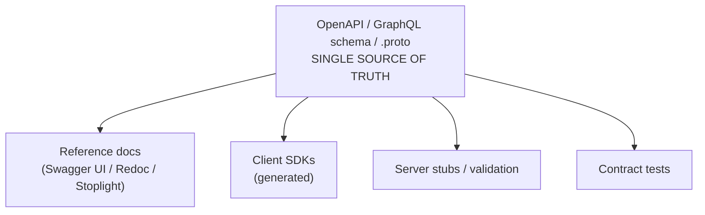
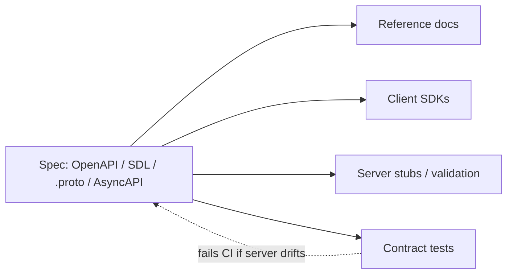
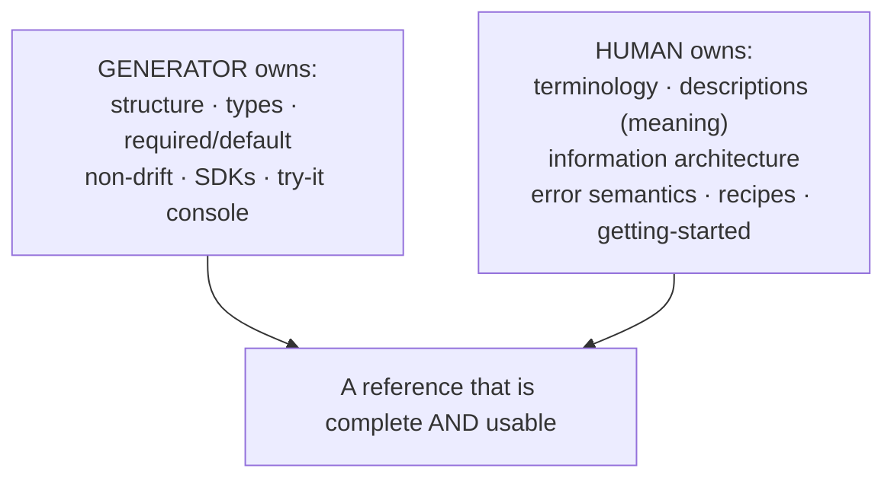

# API & Reference Documentation — Middle

> **Category:** [Documentation](../README.md) — reference docs as a craft: the exhaustive, lookup-oriented description of an API's machinery, and the runnable examples and guides that make it usable.

> **Prerequisite:** [Junior](junior.md)
> **Focus:** **Why** and **When**

---

## Table of Contents

1. [Introduction](#introduction)
2. [Spec-Driven Reference: The Single Source of Truth](#spec-driven-reference-the-single-source-of-truth)
3. [A Slice of OpenAPI → Its Rendered Reference](#a-slice-of-openapi--its-rendered-reference)
4. [Design-First vs. Code-First](#design-first-vs-code-first)
5. [GraphQL, gRPC, and AsyncAPI](#graphql-grpc-and-asyncapi)
6. [Why Spec-Driven Reference Can't Drift](#why-spec-driven-reference-cant-drift)
7. [Writing the Reference Well](#writing-the-reference-well)
8. [Error Documentation as a First-Class Concern](#error-documentation-as-a-first-class-concern)
9. [Recipes: The Bridge Between Reference and Guides](#recipes-the-bridge-between-reference-and-guides)
10. [When to Choose Generated vs. Hand-Written](#when-to-choose-generated-vs-hand-written)
11. [Trade-offs](#trade-offs)
12. [Tricky Points](#tricky-points)
13. [Best Practices](#best-practices)
14. [Test Yourself](#test-yourself)
15. [Summary](#summary)
16. [Diagrams](#diagrams)

---

## Introduction

> Focus: **Why** and **When**

At the junior level you learned *what* a reference contains and *why* it differs from a guide. At the middle level the central question becomes: **where does the reference come from, and how do you keep it from being a lie?**

Hand-written reference docs have one fatal flaw: they **drift.** The code changes, the docs don't, and within a release or two the reference quietly disagrees with reality. The middle-level answer is **spec-driven reference** — you write a machine-readable contract (an OpenAPI spec for REST, a GraphQL schema, a `.proto` file for gRPC), make that the **single source of truth**, and *generate* the reference docs from it. Now the docs cannot describe a parameter the contract doesn't have.

This file covers the spec formats, the design-first/code-first decision, why generation kills drift, and the writing skills that make a reference precise and usable — including the one part no generator handles for you: **errors and recipes.**

---

## Spec-Driven Reference: The Single Source of Truth

> A **single source of truth** is one authoritative artifact from which everything else (docs, client SDKs, server stubs, tests) is derived — so they cannot disagree.

The idea: instead of writing the API in code *and* describing it in prose (two sources that will diverge), you describe the API once in a formal spec and derive both ends from it.



The payoff is that **the reference is a projection of the contract**, not a separate document someone maintains by hand. Change the spec, regenerate, and the docs, SDKs, and validators all move together.

---

## A Slice of OpenAPI → Its Rendered Reference

Here is a minimal OpenAPI 3 fragment describing one endpoint:

```yaml
paths:
  /v1/charges:
    post:
      summary: Create a charge
      security: [{ bearerAuth: [] }]
      requestBody:
        required: true
        content:
          application/x-www-form-urlencoded:
            schema:
              type: object
              required: [amount, currency, source]
              properties:
                amount:   { type: integer, minimum: 50,
                            description: "Amount in the smallest currency unit (cents)." }
                currency: { type: string, example: "usd" }
                source:   { type: string, description: "A payment source token." }
      responses:
        "200":
          description: Charge succeeded
          content:
            application/json:
              schema: { $ref: "#/components/schemas/Charge" }
        "402":
          description: Card was declined
          content:
            application/json:
              schema: { $ref: "#/components/schemas/Error" }
```

A renderer (Swagger UI, Redoc, Stoplight Elements) turns that into a reference page roughly like:

```
POST /v1/charges        Create a charge          🔒 bearerAuth

BODY (application/x-www-form-urlencoded)
  amount    integer   required   ≥ 50   Amount in smallest currency unit (cents).
  currency  string    required          e.g. "usd"
  source    string    required          A payment source token.

RESPONSES
  200  Charge succeeded   → Charge
  402  Card was declined  → Error

[ Try it ]   curl -X POST .../v1/charges -d amount=2000 -d currency=usd ...
```

Every fact in the rendered reference — the type `integer`, the `≥ 50` constraint, the required-ness, the `402` error — came from the spec. **No human transcribed it, so no human can get it wrong.** The "Try it" console is generated too: the spec knows enough to build a runnable request.

---

## Design-First vs. Code-First

There are two ways to obtain the spec, and the choice shapes your whole workflow.

| | **Design-first** | **Code-first** |
|---|---|---|
| What comes first | The spec, written by hand | The code, with annotations |
| The spec is | The source of truth you build to | Generated *from* the code |
| Workflow | Write spec → review → generate stubs + docs → implement | Write code + annotations → generate spec → generate docs |
| Strength | Contract agreed *before* implementation; parallel front/back work | Spec can't drift from code — it's extracted from it |
| Weakness | Spec and code can diverge if discipline slips | Design is implicit; harder to review the contract up front |
| Tooling smell | Stoplight, openapi-generator, hand-edited YAML | springdoc, FastAPI, swaggo annotations |

- **Design-first** treats the spec as the primary artifact: you *design* the API in the spec, get it reviewed (front-end and back-end teams agree on the contract before either writes code), then generate server stubs and client SDKs. Best when the API is a product and the contract matters more than the implementation.
- **Code-first** treats the code as primary: you annotate handlers/types and a tool extracts the spec. Best for internal services where the implementation moves fast and you mainly want docs that track it cheaply.

> Neither is "correct." Design-first optimizes for *contract quality and agreement*; code-first optimizes for *spec-code fidelity with low ceremony.* Mature teams often do design-first for public/published APIs and code-first for internal ones. (Forward-link: this maps onto the reversibility argument at [Senior](senior.md).)

---

## GraphQL, gRPC, and AsyncAPI

OpenAPI is the spec for REST. The single-source-of-truth pattern generalizes:

| Protocol | The "spec" / source of truth | How reference is obtained |
|---|---|---|
| **REST** | OpenAPI (Swagger) document | Swagger UI / Redoc / Stoplight render it |
| **GraphQL** | The **schema (SDL)** + **introspection** | Tools query introspection to build interactive docs (GraphiQL, Apollo); descriptions live in the schema |
| **gRPC** | The `.proto` (protobuf) files | `protoc` plugins generate reference (e.g., protoc-gen-doc); comments in `.proto` become docs |
| **Event-driven / async** | **AsyncAPI** document | AsyncAPI generators render channels, messages, payloads |

GraphQL has a notable property: the schema is **introspectable at runtime**, so a client can ask the server "what types and fields do you have?" and tools build docs from the live API itself — drift is structurally near-impossible for *shape* (descriptions still have to be written in the schema).

```graphql
type Query {
  "Fetch a user by ID. Returns null if not found."
  user(id: ID!): User
}

type User {
  id: ID!
  "Primary email; unique across the system."
  email: String!
  status: UserStatus!
}
```

Those `"..."` descriptions are the GraphQL equivalent of OpenAPI `description:` fields — the prose layer the schema carries into the generated reference. **A schema without descriptions generates a *structurally* complete but *semantically* empty reference** (the field names, none of the meaning).

---

## Why Spec-Driven Reference Can't Drift

The structural argument for spec-driven reference:

1. **There is one definition of the contract**, and the docs are generated from it. A field that isn't in the spec can't appear in the docs; a field added to the spec appears automatically.
2. **Contract testing closes the loop on code-first/design-first alike.** A contract test asserts that the *running server* conforms to the spec — same status codes, same response shapes. If the implementation drifts from the spec, the test fails in CI, not in a customer's integration.

```
   SPEC  ──generate──▶  DOCS        (docs match spec by construction)
     ▲
     │ contract test
     ▼
  RUNNING SERVER          (server must match spec, or CI fails)
```

> The combination — **generate docs from the spec, and contract-test the server against the spec** — is what makes "the docs are wrong" structurally hard. Hand-written reference has neither guarantee. (Drift and its remedies are the whole subject of [Keeping Docs Alive & Doc Rot](../11-keeping-docs-alive-and-doc-rot/).)

---

## Writing the Reference Well

Generation gives you *structure* and *non-drift*. It does **not** give you good *prose*, good *information architecture*, or good *examples*. Those are still a writing craft:

1. **Precise, consistent terminology.** Pick one word per concept and use it everywhere. If it's a "charge," it's never sometimes a "payment" and sometimes a "transaction." Inconsistent vocabulary is the most common reference defect that no tool catches.
2. **Complete, but no narrative fluff.** Every parameter described; zero "as you probably know" filler. Reference is dense by design.
3. **Good information architecture.** Group endpoints by resource; order parameters logically (required first); make the whole thing **searchable**. A reference people can't navigate is a reference people don't read.
4. **Describe the *meaning*, not just the type.** `status (string)` is the type the generator already knew. `status (string) — one of active | suspended | deleted; suspended accounts can read but not write` is the knowledge only a human can add. The spec's `description` fields are where this craft lives.
5. **An example per entry**, request and response, runnable. (See doc-tests in [Code Comments & Docstrings](../02-code-comments-and-docstrings/).)

> The division of labor: the **spec** owns structure, types, and non-drift; the **human** owns terminology, descriptions, IA, errors, and recipes. Generation doesn't replace writing — it removes the *transcription* work so the writing can focus on meaning.

---

## Error Documentation as a First-Class Concern

The unhappy path is where integrations spend most of their effort, and it's the part references most often shortchange. A first-class error reference documents, for every failure:

| Field | Example |
|---|---|
| HTTP status | `402` |
| Application error code | `card_declined` |
| When it occurs | The issuing bank refused the charge. |
| How to recover | Show the user; do not retry the same source. |
| Stable identifier | Code is *machine-stable* (clients switch on it); message is human-facing and may change. |

```json
{
  "error": {
    "type": "card_error",
    "code": "card_declined",          // machine-stable: clients branch on THIS
    "message": "Your card was declined.", // human-facing: may be localized/reworded
    "decline_code": "insufficient_funds",
    "doc_url": "https://api.example.com/docs/errors/card_declined"
  }
}
```

> The key craft point: **document the stable machine code separately from the human message.** Clients must branch on a code that won't change wording out from under them. A `doc_url` in the error body that links straight to the reference entry is a gold-standard touch (Stripe does this).

OpenAPI lets you model errors as schemas and attach them to each response status, so the error catalog is generated *and* the per-endpoint "which errors can this call return?" is visible. But the *semantics* — when each fires, how to recover — are prose you write.

---

## Recipes: The Bridge Between Reference and Guides

A pure reference answers "what is each thing?" but not "how do I combine them to do *X*?" The bridge is **recipes** (a.k.a. how-to guides): short, task-focused, runnable sequences that compose several reference entries.

> **Recipe:** "To refund a partial payment: (1) `GET /v1/charges/{id}` to find the amount, (2) `POST /v1/refunds` with `amount` < the original. Here's the full runnable sequence…"

Recipes are where reference and guides meet. They're more task-oriented than reference (they have a goal and an order) but more focused than a tutorial (they assume you've started). A great docs site has a **recipe per common task**, each linking into the reference entries it uses. This is also the right place to put **idempotency** and **rate-limit** guidance in context, rather than leaving it as cold per-endpoint footnotes.

---

## When to Choose Generated vs. Hand-Written

| Situation | Lean | Why |
|---|---|---|
| Public REST/GraphQL/gRPC API | **Spec-generated reference** | Non-drift and SDK generation matter most |
| Internal service, fast-moving | **Code-first generated** | Cheapest way to keep docs tracking code |
| Conceptual overview, guides, recipes | **Hand-written** | No generator writes a getting-started or a recipe |
| Error *semantics*, idempotency rules | **Hand-written (in spec descriptions)** | Meaning is human knowledge |
| A tiny internal endpoint nobody else calls | **A README section** | A full spec is over-tooling |

The mature pattern is **both**: spec-generated reference for the exhaustive machinery, hand-written guides/recipes/getting-started layered on top. The generated part can't drift; the hand-written part gives it a way in and a human voice.

---

## Trade-offs

| Decision | Spec-generated reference | Hand-written reference |
|---|---|---|
| Drift risk | Very low (regenerated from contract) | High (manual sync) |
| Up-front cost | Spec + tooling setup | Just start typing |
| Completeness | Total (every field, by construction) | As complete as discipline allows |
| Warmth / readability | Cold without added descriptions | Naturally narrative |
| SDK / stub generation | Free, from the spec | Not possible |
| Best for | Public/stable APIs, many consumers | Tiny/internal, or the conceptual layer |

The asymmetry: generated reference pays a setup cost once and then *cannot* drift; hand-written reference is free to start and drifts *forever*. For anything with external consumers, the generated approach wins decisively — but it still needs hand-written guides on top to be usable.

---

## Tricky Points

- **Generated ≠ good.** A generated reference is *complete and non-drifting* but can be *semantically empty* if you didn't write descriptions. The generator copies your `description` fields; if they're blank, so is the meaning.
- **Code-first specs can still lie about semantics.** The *shapes* match the code, but "this field is deprecated" or "amount is in cents" is a description you must add — the annotations don't infer intent.
- **Introspection (GraphQL) prevents *structural* drift, not *descriptive* drift.** The live schema is always shape-accurate; the human descriptions can still be stale or missing.
- **A spec is not a guide.** Generating Swagger UI does *not* give you onboarding. Teams that ship only the generated reference and call it "the docs" reproduce the junior "reference-as-tutorial" failure at scale.
- **Contract tests are what make "spec = truth" real.** Without them, the spec is just *aspirational* — the server can quietly diverge.

---

## Best Practices

1. **Make a machine-readable spec the single source of truth** (OpenAPI / SDL / `.proto` / AsyncAPI) and *generate* the reference from it.
2. **Contract-test the server against the spec** so divergence fails CI, not customers.
3. **Fill in `description` fields** — the spec gives structure; descriptions give meaning. Don't ship a semantically empty generated reference.
4. **Use consistent terminology** — one word per concept, everywhere.
5. **Document errors as first-class:** stable machine code, human message, when-it-fires, how-to-recover, and a `doc_url`.
6. **Layer hand-written guides, recipes, and getting-started** on top of the generated reference.
7. **Choose design-first for public/contract-critical APIs, code-first for internal fast-movers.**

---

## Test Yourself

1. What does "single source of truth" mean for API reference, and why does it kill drift?
2. Contrast design-first and code-first; when would you pick each?
3. Name the source-of-truth artifact for REST, GraphQL, gRPC, and event-driven APIs.
4. Why is a generated reference "complete but possibly empty"?
5. What two things must error documentation separate, and why?
6. What is a recipe, and where does it sit between reference and tutorial?

---

## Summary

- The middle-level shift: **where does the reference come from, and how do you stop it lying?** Answer: a machine-readable **spec as single source of truth**, with the reference **generated** from it.
- **OpenAPI** (REST), **schema + introspection** (GraphQL), **`.proto`** (gRPC), and **AsyncAPI** (events) are the source-of-truth formats; renderers (Swagger UI, Redoc, Stoplight) turn them into reference.
- **Design-first** optimizes contract agreement; **code-first** optimizes spec-code fidelity. Generated docs **can't drift**, and **contract tests** keep the server honest to the spec.
- Generation handles *structure*; humans still own **terminology, descriptions, information architecture, errors, and recipes**.
- **Error docs are first-class:** separate the stable machine code from the human message; say when it fires and how to recover.
- **Recipes** bridge reference and guides; ship generated reference **plus** hand-written guides and a getting-started.

---

## Diagrams

### Spec → everything



### Division of labor




---

## Check your understanding

1. Explain API & Reference Documentation — Middle Level in your own words and name the problem it solves.
2. How would you apply the ideas around Table of Contents, Introduction, Design-First vs. Code-First in a realistic engineering change?
3. What failure mode or misuse should you look for, and what evidence would reveal it?
4. Which local design trade-off would make you choose or reject API & Reference Documentation — Middle Level in an existing codebase?
5. What observable result would convince you that the approach improved the system?
