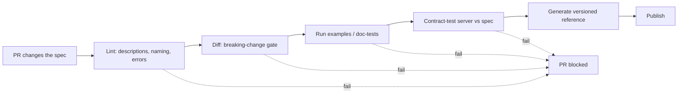
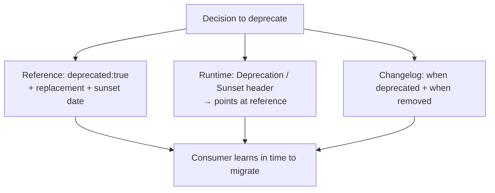

# API & Reference Documentation — Professional

> **Category:** [Documentation](../README.md) — reference docs as a craft: the exhaustive, lookup-oriented description of an API's machinery, and the runnable examples and guides that make it usable.

> **Prerequisites:** [Junior](junior.md) · [Middle](middle.md) · [Senior](senior.md)
> **Focus:** **Production** — pipelines, governance, reviews, metrics, incidents

---

## Introduction

> Focus: **production** — running reference docs as infrastructure for many APIs, many teams, over years.

Individually, every team agrees reference docs matter. Collectively, references rot: a field is added without a `description`, an example breaks and nobody notices, a breaking change ships because the spec wasn't diffed, v1 docs describe v2 behavior. No single lapse is unreasonable; the aggregate is a docs portal consumers no longer trust.

The professional question is operational: **how do you keep reference accurate and usable across dozens of APIs and hundreds of changes a week?** The answer is the same shape as for code quality — make the good path the default and enforce it in CI: a generation pipeline, spec governance with gates, examples tested in the build, review standards that catch the semantic gaps tools can't, and metrics that track the *outcome* (can a developer integrate without filing a ticket?) rather than vanity counts.

---

## The Reference Pipeline in CI/CD

Reference docs are **built artifacts**, treated like any other build output. A production pipeline, triggered on every change to a spec:

```text
ON CHANGE TO spec (openapi.yaml / schema.graphql / *.proto):
  1. LINT       spec passes style rules        (Spectral / Redocly / Buf lint)
  2. DIFF       no breaking change vs. released (oasdiff / GraphQL Inspector / buf breaking)
  3. EXAMPLES   doc-tests run & assert output   (every runnable example executes)
  4. CONTRACT   running service conforms to spec (Dredd / Pact / schemathesis)
  5. GENERATE   render reference                (Redoc / Swagger UI / Stoplight)
  6. PUBLISH    versioned docs site             (per-version, old versions kept live)
```

> The principle from [Docs as Code & Tooling](../10-docs-as-code-and-tooling/): **if it isn't in CI, it will rot.** A reference that regenerates and self-tests on every merge cannot describe a parameter the service doesn't have. A reference maintained by "remember to update the docs" cannot stay accurate at scale — willpower is not a pipeline.

The pipeline also makes documentation a **merge gate**: a PR that adds an undocumented endpoint, breaks an example, or introduces an undeclared breaking change *fails CI* and doesn't merge. Documentation quality becomes non-negotiable the same way passing tests is.

---

## Reviewing API Reference in Pull Requests

Tooling enforces structure; **review enforces meaning.** The reviewer's job is precisely the gaps a linter can't see.

### Review by layer

1. **Spec structure (tool-assisted):** Did lint pass? Does every new operation/field have a `description`? Are errors declared per response? If the linter is green, don't re-litigate style — focus on meaning.
2. **Semantics (human-only):** Does the `description` say what the linter can't infer — units (`amount` in cents), valid enum values *and what they mean*, side effects, idempotency, when each error fires and how to recover? "amount: the amount" is a lint-pass and a review-fail.
3. **Examples:** Is there a runnable example, and is it *realistic* (not `"string"` placeholders)? Does the doc-test cover it?
4. **Breaking change:** Did the diff tool flag anything? If so, is there a version bump, a deprecation path, and a changelog entry — or is this a silent break?
5. **Consistency with the rest of the API:** Same naming, same pagination shape, same error envelope as sibling endpoints? New inconsistency is a review-stop.

### The highest-value review questions

> **"What does a caller need to know about this field that its *type* doesn't already say?"** — forces real descriptions, not type echoes.

> **"Which errors can this endpoint return, and is each one documented with a recovery?"** — the unhappy path is where integrations get stuck.

> **"If a consumer pinned to the current version reads this, is it still true for them?"** — catches in-place mutation of versioned reference.

### Review comment templates

> "`status` is documented as `(string)` — that's just the type. List the values (`active | suspended | deleted`) and what each *means* for the caller."

> "This adds `POST /v1/exports` but declares no error responses. What happens on a bad request or rate-limit? Add them to the spec — undocumented errors are where integrations break."

> "oasdiff flagged `customer` as newly required — that's a breaking change. This needs a v2 (or making it optional with a default), a deprecation note on the old shape, and a changelog entry."

> "Example uses `amount: 0` and `email: \"string\"` — replace with a realistic, runnable payload so a reader can paste it and see a real response."

---

## Governing the Spec Across Many Teams

A single API is easy; **fifty APIs from twenty teams** is the professional reality, and consistency across them is what makes a platform feel like one product rather than fifty.

- **A published API style guide, encoded as lint rules.** The checkable parts (naming, pagination, error envelope, versioning header, required descriptions) become Spectral/Buf rules in a shared ruleset every repo extends. Consistency is *enforced*, not hoped for. (Public exemplars: Google AIP, Microsoft REST guidelines, Zalando's RESTful guidelines.)
- **A spec registry / catalog.** One place listing every service's spec and version (Backstage, an internal portal, SwaggerHub). Consumers discover APIs; the platform team sees coverage. (Tooling: Backend → API Documentation Tools.)
- **A golden-path template.** A starter repo with the spec scaffold, lint config, doc pipeline, and contract-test harness wired up, so a new service gets governed reference *for free* on day one. The simple path is the default path.
- **Federation for GraphQL / aggregation for REST.** A unified reference across services (Apollo Federation, a docs portal that ingests many specs) so consumers see one coherent reference, not fifty silos.

> The lesson that scales: **encode the standard once, enforce it in CI everywhere.** A style guide nobody can violate (because lint blocks the merge) beats a 40-page PDF nobody reads. Governance is automation, not documentation about documentation.

---

## Keeping Examples Correct at Scale

Examples are the highest-value and highest-maintenance content. At platform scale, only automation keeps them honest.

| Technique | How | Best for |
|---|---|---|
| **Generate from spec** | The "try-it" request is derived from OpenAPI | Baseline, every endpoint, free |
| **Snippet-from-tests** | Extract example code from passing integration tests at build time | Canonical per-endpoint examples |
| **Doc-tests in CI** | Examples *execute* and assert output on every build | Library/SDK examples |
| **Generated SDK + generated snippet** | SDK generated from spec; multi-language snippets call it | Multi-language reference (Stripe model) |
| **Synthetic-data fixtures** | Examples run against a sandbox with stable seeded data | Realistic, reproducible request/response pairs |

> The rule that ends the debate: **an example you don't execute is an example you will eventually ship broken.** If a snippet can't be tested or generated, it shouldn't be a documented example — cut the language or generate it. A broken example destroys trust faster than a missing one, because it fails *after* the developer committed to your API.

The economic decision is **how many languages to maintain.** Each added language multiplies the example surface. Stripe's 7 languages are justified by adoption ROI and *fully automated*; an internal API earns one generated `curl` example. Match the investment to the audience — gold-plating example coverage on a low-traffic internal API is waste.

---

## Measuring Reference Quality

Vanity metrics ("we documented 100% of endpoints") lie — a 100%-covered reference can be 100% type-echoes with no meaning, no examples, and broken links. Measure what predicts a developer *succeeding*.

| Metric | Tracks quality? | Notes |
|---|---|---|
| **Endpoint/field doc coverage** | Weakly | Necessary floor; lint can gate it. But "has a description" ≠ "useful." |
| **Description-non-empty + non-trivial** | Partially | Lint for present *and* not just echoing the field name. |
| **Example coverage + example test pass rate** | **Yes** | Every endpoint has a *runnable, passing* example. |
| **Broken-link / broken-example rate in CI** | **Yes** | Drift made visible; should be zero. |
| **Spec-vs-server contract-test pass rate** | **Yes** | Ground truth that docs match reality. |
| **Time-to-first-successful-call (TTFSC)** | **Yes (outcome)** | How long from landing on docs to a working call — the real DX metric. |
| **Support tickets / forum questions per endpoint** | **Yes (outcome)** | High question volume on one endpoint = a reference gap there. |
| **Docs page → "was this helpful?" + search-with-no-result** | **Yes (outcome)** | Where readers get stuck. |

> The ground-truth question is **not "how much did we document?" but "can a developer integrate without filing a ticket?"** Time-to-first-successful-call and support-tickets-per-endpoint are downstream of reference quality; if they're bad, the reference is bad regardless of coverage %. Quality Engineering's Documentation Quality covers freshness gates and coverage metrics in depth; here the point is to *prefer outcome metrics over coverage vanity.*

---

## Deprecation and Sunset in the Reference

Removing things from a published API is where reference docs earn their keep — done in the reference, in the open, ahead of time.

```yaml
# OpenAPI: the reference IS where consumers discover a deprecation
/v1/charges/{id}/refund:
  post:
    deprecated: true
    summary: "[DEPRECATED] Refund a charge. Use POST /v1/refunds instead. Sunset: 2027-01-01."
```

```graphql
type Charge {
  refundUrl: String @deprecated(reason: "Use Refund.receiptUrl. Removed after 2027-01-01.")
}
```

The professional discipline:

1. **Mark it in the reference first** (`deprecated: true` / `@deprecated`) — generated docs then render the warning automatically.
2. **State the replacement and the sunset date** in the deprecation text, not just "deprecated."
3. **Emit a runtime `Deprecation` / `Sunset` HTTP header** so callers who never read docs still get warned (and the header points at the reference entry).
4. **Record it in the [changelog](../09-changelogs-and-release-notes/)** so the diff is discoverable.
5. **Never remove without the deprecation window having elapsed** for a published API — the reference is the contract, and silent removal breaks consumers you can't see.

> The triad again: the **reference** shows what's deprecated *now*; the **changelog** records *when* it was deprecated and removed; the **runtime header** reaches callers who don't read either. All three, for a one-way-door public API.

---

## Real Incidents

### Incident 1: The "amount" that wasn't in cents

A payments API's reference documented `amount (integer, required)` with no unit. A large integrator read it, sent `amount: 50` meaning $50.00, and charged customers **50 cents**. Thousands of underbilled transactions before reconciliation caught it. **Root cause:** the `description` echoed the type and omitted the *meaning* (smallest currency unit). **Fix:** mandatory non-trivial descriptions on monetary fields, a lint rule rejecting descriptions that merely restate the field name, and a worked example showing `amount: 2000` → "$20.00". **Lesson:** the type is what the generator already knew; the unit is the knowledge only a human adds — and omitting it is a financial incident, not a typo.

### Incident 2: The example that hadn't run in a year

A popular SDK's quickstart example used a constructor signature removed two minor versions earlier. Every new developer's first copy-paste threw an error; many concluded the SDK was broken and left. The example had never been tested. **Fix:** all quickstart and reference examples became *extracted from passing integration tests* (snippet-from-tests) and run in CI; a broken example now fails the build. **Lesson:** an untested example is a time bomb that detonates on your newest, least-committed users — exactly the ones you can least afford to lose.

### Incident 3: The silent breaking change

A team made an optional response field required *in the request* and shipped it. The spec was regenerated (code-first) and docs updated to match — but there was no spec *diff* in CI, so nobody noticed it was breaking. Integrations that omitted the field started getting `400`s in production. **Fix:** added `oasdiff` breaking-change detection as a hard CI gate; a breaking change now requires an explicit version bump and a deprecation path or it can't merge. **Lesson:** "the docs match the code" is necessary but not sufficient — the docs (and code) can be *correctly documenting a break*. You need a diff gate, not just a generation step.

### Incident 4: The undocumented error nobody could recover from

A reference listed only `200` and `400` for an endpoint that, under load, also returned `429` with a `Retry-After` header. Consumers, seeing no documented `429`, treated it as a hard failure and didn't back off — amplifying the overload into an outage. **Fix:** lint rule requiring rate-limited endpoints to document `429` + `Retry-After` + recovery guidance; error responses became a mandatory part of every spec operation. **Lesson:** undocumented errors aren't a cosmetic gap — they cause *consumer behavior that worsens incidents.* The unhappy path is first-class.

---

## The Politics of Reference Docs

- **Docs are credited to no one and blamed on everyone.** The engineer who ships a feature gets the credit; the reference gap surfaces as a support ticket months later with no owner. Counter by making docs a *merge gate* (CI), so they're part of "done," not optional follow-up.
- **"DevRel will document it" is where reference goes to die.** The team that built the endpoint knows the semantics; a separate writer can't infer that `amount` is in cents. Owning teams write the spec descriptions; DevRel owns the guides/recipes layer on top.
- **Completeness is invisible; gaps are loud.** A perfect reference generates no praise; one missing error code generates an incident. Use outcome metrics (TTFSC, tickets-per-endpoint) to make the invisible value visible to stakeholders.
- **The spec is a contract, so it's a negotiation.** Design-first spec review *is* API design review across teams — treat it with that seriousness, because for a public API the reference *is* the product surface.

---

## Review Checklist

```text
API REFERENCE REVIEW CHECKLIST
[ ] LINT       spec passes the shared ruleset (descriptions present, naming, errors declared)
[ ] SEMANTICS  descriptions add MEANING the type can't (units, enum meanings, side effects)
[ ] ERRORS     every error response documented: status, code, when it fires, how to recover
[ ] EXAMPLE    runnable + realistic (no "string"/0 placeholders) + covered by a doc-test
[ ] BREAKING   diff tool clean; any break has version bump + deprecation + changelog
[ ] VERSION    still true for a consumer pinned to the current version (no in-place mutation)
[ ] CONSISTENT same naming/pagination/error-envelope as sibling endpoints
[ ] AUTH/LIMITS auth, rate limits, idempotency stated where they apply
[ ] DEPRECATION deprecated items marked + replacement + sunset date + runtime header
[ ] USABILITY  reference is wrapped by getting-started/recipes (not shipped raw as "docs")
```

---

## Cheat Sheet

```text
PIPELINE        lint → diff(breaking) → run examples → contract-test → generate → publish(versioned)
                docs are a BUILT artifact and a MERGE GATE. Not in CI → it rots.

REVIEW          tools enforce STRUCTURE; humans enforce MEANING.
                "what does the caller need that the TYPE doesn't say?"
                "which errors, and how to recover from each?"

GOVERN          style guide AS LINT RULES (shared ruleset) · spec registry · golden-path template
                encode the standard once, enforce in CI everywhere

EXAMPLES        generate from spec OR extract from passing tests. Untested example = future break.
                # of languages = adoption ROI; automate or cut.

MEASURE         outcome > vanity. TTFSC + tickets-per-endpoint + contract-pass + broken-example-rate.
                NOT "100% documented" (can be 100% type-echoes).

DEPRECATE       reference (deprecated:true) + replacement + sunset date + runtime header + changelog.
                never remove a published-API element without the window elapsing.
```

---

## Diagrams

### Where reference rot is stopped



### The deprecation triad



---

## Related Topics

- **Builds on:** [Code Comments & Docstrings](../02-code-comments-and-docstrings/) (doc-tests), [Why & What to Document](../01-why-and-what-to-document/) (Diátaxis)
- **Pipeline & CI:** [Docs as Code & Tooling](../10-docs-as-code-and-tooling/)
- **Versioning triad:** [Changelogs & Release Notes](../09-changelogs-and-release-notes/)
- **Fighting drift:** [Keeping Docs Alive & Doc Rot](../11-keeping-docs-alive-and-doc-rot/)
- **Measuring quality:** Quality Engineering → Documentation Quality
- **Tooling (deferred):** Backend → API Documentation Tools

---


---

## Check your understanding

1. Explain API & Reference Documentation — Professional Level in your own words and name the problem it solves.
2. How would you apply the ideas around Table of Contents, Introduction, Governing the Spec Across Many Teams in a realistic engineering change?
3. What failure mode or misuse should you look for, and what evidence would reveal it?
4. How would you introduce and govern API & Reference Documentation — Professional Level across teams through reversible, measurable increments?
5. What observable result would convince you that the approach improved the system?
