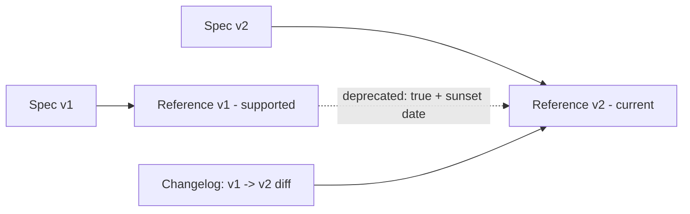
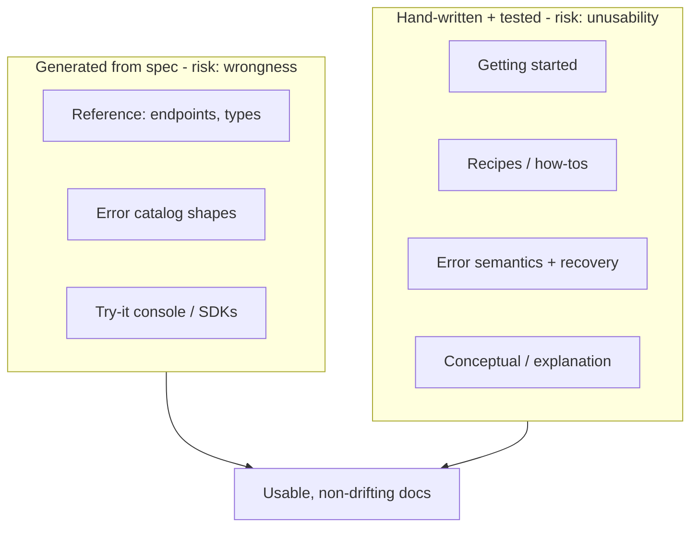
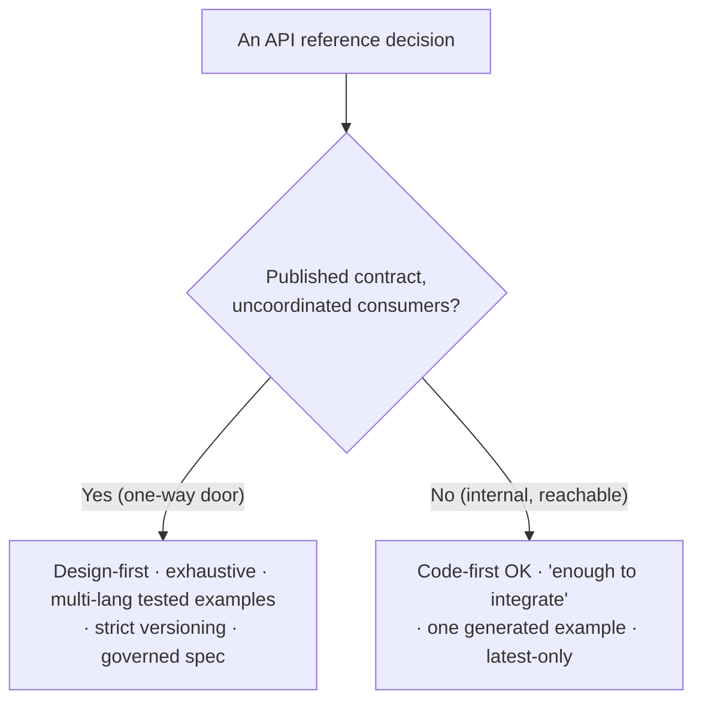

# API & Reference Documentation — Senior

> **Category:** [Documentation](../README.md) — reference docs as a craft: the exhaustive, lookup-oriented description of an API's machinery, and the runnable examples and guides that make it usable.

> **Prerequisites:** [Junior](junior.md) · [Middle](middle.md)
> **Focus:** **Design trade-offs** and **system-level reasoning**

---

## Table of Contents

1. [Introduction](#introduction)
2. [The Generated-vs-Hand-Written Trade-off, at System Scale](#the-generated-vs-hand-written-trade-off-at-system-scale)
3. [Generated Reference Is Complete but Cold](#generated-reference-is-complete-but-cold)
4. [The Maintenance Cost of Examples](#the-maintenance-cost-of-examples)
5. [Versioned Reference](#versioned-reference)
6. [Reference for Internal Services vs. Published APIs](#reference-for-internal-services-vs-published-apis)
7. [Spec as Contract: Governance and Linting](#spec-as-contract-governance-and-linting)
8. [Completeness vs. Usability](#completeness-vs-usability)
9. [Documentation as an Architectural Forcing Function](#documentation-as-an-architectural-forcing-function)
10. [Liabilities](#liabilities)
11. [Pros & Cons at the System Level](#pros--cons-at-the-system-level)
12. [Diagrams](#diagrams)
13. [Related Topics](#related-topics)

---

## Introduction

> Focus: **design trade-offs** and **system-level reasoning**

At the senior level, API reference stops being "a document you write" and becomes **an architectural concern with a maintenance budget, a versioning strategy, and governance.** The questions are no longer "what goes in an entry" but:

1. **Where on the generated↔hand-written spectrum should each part of the docs live**, and what does each choice cost over years?
2. **How do examples — the highest-value content — stay correct without becoming a maintenance sink?**
3. **How does reference survive versioning, deprecation, and a growing population of consumers you can't coordinate?**

The throughline: **a spec-driven reference is a *contract*, and treating it as one — governed, linted, versioned, contract-tested — is what separates a reference that scales from one that rots.** This file is about reasoning at that altitude.

---

## The Generated-vs-Hand-Written Trade-off, at System Scale

The middle level framed this as a per-doc choice. The senior view is that a real docs system is *layered*, and each layer sits at a different point on the spectrum because each has a different **drift profile** and **authoring cost**.

| Layer | Source | Drift risk | Who maintains | Why here |
|---|---|---|---|---|
| Reference (endpoints/types) | **Generated from spec** | Near-zero | The spec + CI | Must be exhaustive and never wrong |
| Error catalog (shapes) | **Generated from spec** | Near-zero | The spec | Same |
| Error *semantics* | Hand-written (in `description`) | Medium | Owning team | Meaning is human knowledge |
| Recipes / how-tos | Hand-written, **tested** | Medium | DevRel/owning team | Task knowledge no generator has |
| Getting started | Hand-written, **tested** | Medium | DevRel | Onboarding is a designed experience |
| Conceptual / explanation | Hand-written | Low (changes slowly) | Architects | The "why," rarely auto-derivable |

> The senior insight: **don't pick generated *or* hand-written — assign each layer to the source that minimizes its dominant risk.** Exhaustive reference goes generated (its risk is *wrongness*); onboarding goes hand-written-and-tested (its risk is *unusability*). A team that generates everything ships a cold parts-list; a team that hand-writes everything ships a beautiful lie within two releases.

---

## Generated Reference Is Complete but Cold

The defining limitation of generated reference: it is **structurally complete and emotionally empty.** It tells you every field exists and what type it is. It rarely tells you *which fields you actually need*, *what order to call things in*, or *what good usage looks like* — because that knowledge isn't in the type system.

```
GENERATED REFERENCE GIVES YOU          HUMANS STILL MUST ADD
  every endpoint                        which 3 endpoints you need first
  every field + type                    which fields matter for the common case
  every error shape                     when each error fires, how to recover
  required/optional flags               the recommended call sequence (recipe)
  a try-it console                      a worked, narrated first integration
```

This is *exactly* the junior "reference-as-tutorial" failure, re-emerging at the platform level: a team stands up Swagger UI, links it as "Docs," and wonders why adoption is poor. The reference is perfect and **no one can get started.** The cold-but-complete reference is a *floor*, not a finished product — it must be wrapped in hand-written guides, recipes, and a getting-started to become usable.

> The right mental model: generated reference is **the dictionary.** You do not learn a language from a dictionary; you look things up in it once you can already speak. Onboarding (the textbook, the lessons) is a separate, hand-crafted thing — and skipping it is the most common platform-docs failure.

---

## The Maintenance Cost of Examples

Examples are the single highest-value reference content (junior level) — and the single highest-*maintenance* content. Every example is code; code rots. A reference with 200 endpoints in 4 languages has 800 examples, each of which can silently go stale.

The senior strategies, from cheapest to most robust:

| Strategy | What it is | Cost | Drift protection |
|---|---|---|---|
| **Generated from spec** | The "try-it" request derived from OpenAPI | Free | Shape can't drift; values may be unrealistic |
| **Generated SDK + generated snippet** | SDK is generated from spec; snippet calls it | Setup | Both move with the spec |
| **Doc-tests** | Examples *run* in CI; output asserted | Medium | A broken example **fails the build** |
| **Snippet-from-tests** | Pull verified example code *out of the test suite* into docs | Medium | The example is a passing test by construction |
| **Hand-written, untested** | Prose example, manually checked | Low to write | **Rots silently** — avoid for anything that matters |

> The governing principle: **an example you don't test is an example you will eventually ship broken.** The mature pattern is *snippet injection from tests* — the canonical example for an endpoint is literally a passing integration test, mechanically extracted into the docs at build time. The example can't lie because the test had to pass. (Doc-test tooling: [Code Comments & Docstrings](../02-code-comments-and-docstrings/); drift mechanics: [Keeping Docs Alive & Doc Rot](../11-keeping-docs-alive-and-doc-rot/).)

The trade-off to reason about explicitly: **more languages and more examples = more developer experience but more maintenance surface.** Stripe maintains examples in ~7 languages because the ROI on adoption justifies the (large, automated) cost. A small internal API should *not* — one `curl` example generated from the spec is the right budget. Match the example investment to the audience size.

---

## Versioned Reference

Once an API has external consumers, the reference must answer "behavior of which **version**?" — and that interacts with everything.

- **The reference is versioned with the API.** v1 docs describe v1; v2 docs describe v2; both stay live as long as both versions are supported. A single "latest" reference is a bug the moment a consumer is pinned to an older version.
- **Deprecation is reference content.** A deprecated field/endpoint must be *marked as such in the reference*, with the replacement and the sunset date — not silently removed. OpenAPI has `deprecated: true`; GraphQL has `@deprecated(reason:)`. The reference is where consumers *discover* a deprecation.
- **Reference, changelog, and release notes are a triad.** The reference says *what is true now (per version)*; the [changelog](../09-changelogs-and-release-notes/) says *what changed between versions*; release notes say *what it means for you*. A consumer debugging "this used to work" needs all three.



> The senior failure mode: **mutating the reference in place when the API changes**, so the docs always describe `HEAD` and a pinned consumer's reality is undocumented. Versioned reference means *keeping the old reference live*, driven by the old spec, for as long as the old version runs. This is why docs belong in the repo, versioned alongside the code — see [Docs as Code & Tooling](../10-docs-as-code-and-tooling/).

---

## Reference for Internal Services vs. Published APIs

Same craft, radically different *economics and obligations* — the distinction that drives most senior reference decisions.

| | **Internal service** | **Published / public API** |
|---|---|---|
| Consumers | Known, reachable teams | Unknown, uncoordinated, many |
| Cost of a breaking change | A Slack message + a sprint | A migration crisis; possible contract breach |
| Reference completeness bar | "Enough to integrate" | Exhaustive — every field, every error |
| Versioning | Often just "latest" | Strict, multiple live versions |
| Examples | One `curl` from spec | Multi-language, tested, SDKs |
| Design approach | Code-first is fine | Design-first (contract reviewed up front) |
| Drift tolerance | Days (you can ask the team) | Zero (consumers can't ask you) |

> The governing variable is **reversibility of the contract** — the same one-way-door reasoning from design. An internal endpoint is a reversible decision: you can change it and chase down the three callers. A published API is a **one-way door**: every consumer you can't see has built on the documented contract, so the reference *is the API* for practical purposes. That's why public APIs justify design-first, strict versioning, and exhaustive tested examples, while internal services rationally spend far less.

The mistake in both directions: documenting an internal endpoint to public-API standards (waste), or documenting a public API to internal standards (a support and trust catastrophe).

---

## Spec as Contract: Governance and Linting

When the spec is the source of truth, it becomes a **governed artifact** — and at scale, governed by tools, not goodwill.

- **Spec linting** (Spectral, Redocly lint) enforces *consistency* the same way a code linter enforces style: every operation has a `summary`, every parameter a `description`, naming follows a convention (`snake_case` vs `camelCase`), every response declares its errors. This is how you make "consistent terminology" (a middle-level *aspiration*) into a CI *gate*.
- **Breaking-change detection** (oasdiff, GraphQL Inspector, Buf for protobuf) diffs the new spec against the old and *fails CI on a breaking change* — a removed field, a tightened type, a new required parameter. The contract literally cannot break silently.
- **Style guides as code.** A large org publishes an API style guide (Google's, Microsoft's, Zalando's are public) and encodes the checkable parts as lint rules. The reference is consistent across hundreds of services *because the spec is linted*, not because everyone read the guide.

```text
CI PIPELINE FOR THE SPEC (the contract)
  1. lint spec        → every op documented, naming consistent   (Spectral)
  2. diff vs. prev    → fail on breaking change                  (oasdiff/Buf)
  3. generate docs    → reference can't drift from spec
  4. contract test    → running server conforms to spec
  5. publish          → versioned reference site
```

> The reframing: a spec-driven reference turns "documentation quality" into a **CI concern with gates**, the same way TDD turns correctness into one. The senior move is to *encode the doc standards as spec-lint rules* so quality is enforced mechanically, not negotiated per-PR.

---

## Completeness vs. Usability

The deepest tension in reference docs, and the one a senior must hold both sides of:

- **Completeness** serves the expert doing lookup: *every* field, *every* error, no omissions. Incompleteness here is a defect — the one missing error code is exactly the one a consumer hits.
- **Usability** serves the newcomer and the common case: the 3 fields that matter, the recommended sequence, the happy path foregrounded.

These pull in opposite directions. A reference optimized purely for completeness is an undifferentiated wall of 80 fields where the 3 important ones are invisible. A reference optimized purely for usability hides the long tail the expert needs.

> The resolution is **layering, not compromise.** Keep the reference *complete* (every field, generated, exhaustive) and add a *usability layer on top* — getting-started, recipes, "common parameters" call-outs, and good information architecture (required first, deprecated collapsed, related endpoints grouped). You don't make the reference less complete to make it usable; you wrap the complete reference in task-oriented guides. This is the system-scale restatement of "reference and guides are different modes, and you need both."

---

## Documentation as an Architectural Forcing Function

A subtle senior payoff: **a spec-first, design-first workflow makes the reference a design tool, not just an output.** Writing the OpenAPI spec *before* the implementation forces you to confront the contract — inconsistent resource naming, an endpoint that returns three different shapes, an error taxonomy that doesn't generalize — *while it's still cheap to change.*

- A design-first spec review is an **API design review** that happens to produce reference docs as a byproduct.
- Spec linting that flags "this operation has no documented errors" forces the team to *design* the error taxonomy, not bolt it on.
- The act of documenting a confusing endpoint surfaces that it's *confusing* — documentation pain is a design smell. If you can't write a clean reference entry, the API is probably wrong.

> The highest-leverage version of this topic: **documentation is not downstream of design; for a public API, the spec *is* the design.** Treating reference as an afterthought is how APIs end up inconsistent. Treating the spec as the contract you design and review up front is how they end up coherent — the docs are then the cheap, generated shadow of a well-designed contract.

---

## Liabilities

### Liability 1: Generated reference shipped as "the docs"

The most common platform-docs failure. Complete, correct, and unusable for a newcomer because there's no getting-started or recipe layer. Generated reference is a floor; treat it as one.

### Liability 2: Untested examples at scale

Hundreds of hand-maintained examples across languages will drift, and a broken example erodes trust faster than a missing one. If you can't test an example, generate it or cut the language.

### Liability 3: Mutating reference in place across versions

Always describing `HEAD` so pinned consumers have no accurate reference. Version the reference with the API; keep old versions live while old versions run.

### Liability 4: An ungoverned spec

A spec that's the "source of truth" but isn't linted, diffed, or contract-tested is *aspirational*, not authoritative. Without CI gates, it drifts from the server and from its own consistency standards as surely as hand-written docs.

### Liability 5: Public-grade docs for internal APIs (and vice-versa)

Mis-matching the documentation investment to the consumer population — gold-plating internal references, or under-documenting a one-way-door public contract. Match the rigor to reversibility.

---

## Pros & Cons at the System Level

| Dimension | Spec-Generated Reference | Hand-Written Reference |
|---|---|---|
| Drift over years | Near-zero (regenerated; contract-tested) | High — the default failure mode |
| Completeness | Total, by construction | As good as discipline; degrades |
| Warmth / onboarding | Cold — needs a guide layer | Naturally narrative |
| SDK / stub generation | Free | Impossible |
| Consistency enforcement | Mechanical (spec lint) | Manual, per-reviewer |
| Up-front cost | Spec + tooling + CI | None |
| Best for | Public/stable APIs, many consumers | The conceptual & onboarding layer |
| Example maintenance | Automatable (generate/test) | Manual, rots |

The system-scale conclusion: **generate the exhaustive reference and govern the spec as a contract (lint + diff + contract-test + version); hand-write and *test* the usability layer on top.** Generated-only is cold and unadopted; hand-written-only is warm and wrong. The art — exactly as in design — is assigning each layer to the approach that minimizes *its* dominant risk, and reserving the heaviest rigor for the one-way-door public contracts.

---

## Diagrams

### The layered docs system, by source and risk



### Reversibility decides the rigor



---

## Related Topics

- **Builds on:** [Why & What to Document](../01-why-and-what-to-document/) (Diátaxis), [Code Comments & Docstrings](../02-code-comments-and-docstrings/) (doc-tests, generated reference)
- **Versioning triad:** [Changelogs & Release Notes](../09-changelogs-and-release-notes/)
- **Where docs live & CI:** [Docs as Code & Tooling](../10-docs-as-code-and-tooling/)
- **Fighting drift:** [Keeping Docs Alive & Doc Rot](../11-keeping-docs-alive-and-doc-rot/)
- **Tooling (deferred):** Backend → API Documentation Tools

---


---

## Check your understanding

1. Explain API & Reference Documentation — Senior Level in your own words and name the problem it solves.
2. How would you apply the ideas around Table of Contents, Introduction, The Generated-vs-Hand-Written Trade-off, at System Scale in a realistic engineering change?
3. What failure mode or misuse should you look for, and what evidence would reveal it?
4. How would you validate a system-level decision about API & Reference Documentation — Senior Level under uncertainty?
5. What observable result would convince you that the approach improved the system?
