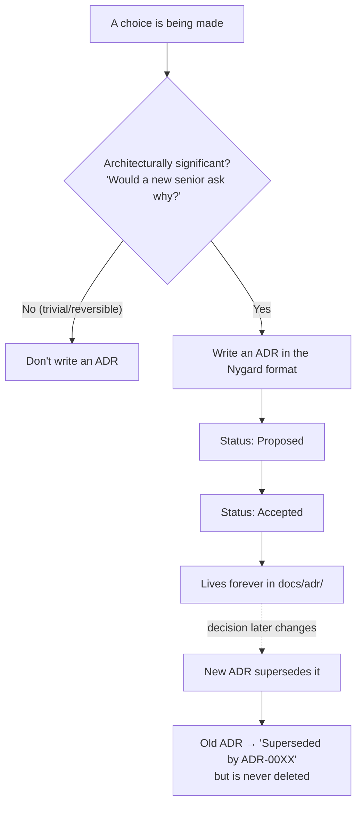

# Architecture Decision Records (ADRs) — Junior

> **Category:** [Documentation](../README.md) — a lightweight, append-only record of a single architecturally-significant decision: its context, the decision itself, and its consequences.

---

## Introduction

> Focus: **What is it?** and **How to use it?**

An **Architecture Decision Record** — an **ADR** — is a short document that captures **one** architecturally-significant decision: *what was decided, why, and what it costs.* It is not a tutorial, not a spec, and not a wiki page. It is a single dated entry in a logbook of decisions, written at the moment a team commits to a choice.

> An **ADR** records the **context** in which a decision was made, the **decision** itself, and its **consequences** — so that a future engineer can understand *why* the system is built the way it is, not merely *what* it does.

The code in your repository tells you *what* the system does. It almost never tells you *why* it does it that way — why PostgreSQL and not MongoDB, why a message queue instead of direct HTTP calls, why this module is split in two. That "why" lives in people's heads, in old Slack threads, in a meeting nobody recorded. Six months later those people have forgotten, changed teams, or left. The reasoning evaporates, and the next engineer is left doing **archaeology**: guessing at intent from the artifacts that remain.

An ADR captures that "why" *while it is still fresh*, in the repository, next to the code it explains. It is the cheapest insurance a team can buy against the question every engineer eventually asks: **"Why on earth did they do it this way?"**

### Why this matters

Code answers *what*; ADRs answer *why*. That second layer is what lets a system outlive the memory of the people who built it. Without it, every change becomes a gamble: you cannot tell whether a strange-looking design is a mistake you should fix or a deliberate choice that solved a problem you can't see. ADRs turn that invisible reasoning into durable, searchable, version-controlled history.

---

## Prerequisites

- **Required:** Comfort with **Markdown** and a **Git** repository — ADRs are plain `.md` files committed alongside code.
- **Required:** A basic sense of what "architecture" means — the structural choices (databases, services, frameworks, module boundaries) that are hard to change later.
- **Helpful:** [Why & What to Document](../01-why-and-what-to-document/junior.md) — ADRs are one specific *kind* of documentation, aimed squarely at the "why."
- **Helpful:** Exposure to code review — an ADR is reviewed much like a pull request.

---

## Glossary

| Term | Definition |
|------|-----------|
| **ADR** | Architecture Decision Record — a short document capturing one significant decision: its context, the decision, and its consequences. |
| **Architecturally significant** | A decision that affects structure, dependencies, interfaces, or cross-cutting concerns — or is expensive to reverse. |
| **Context** | The forces in play when the decision was made: requirements, constraints, the situation that demanded a choice. |
| **Consequences** | What becomes easier *and* harder after the decision — the trade-offs you are knowingly accepting. |
| **Status** | Where an ADR is in its life: *proposed*, *accepted*, *deprecated*, or *superseded*. |
| **Superseding** | Replacing an old decision with a new ADR, rather than editing the old one — ADRs are append-only history. |
| **Decision log / index** | The ordered list of all ADRs, giving an at-a-glance history of the system's evolution. |
| **Nygard format** | The original, canonical ADR template (Michael Nygard, 2011): Title, Status, Context, Decision, Consequences. |

---

## What Problem Does an ADR Solve?

Imagine you join a team and find that user sessions are stored in Redis with a 15-minute expiry. You wonder: *Why Redis and not the main database? Why 15 minutes and not an hour?* You ask around. The person who decided left last year. Nobody remembers. So you have three bad options:

1. **Assume it was deliberate** and never touch it — even if it's now wrong.
2. **Assume it was arbitrary** and change it — and discover the hard way it solved a real problem (a security requirement, a load issue).
3. **Re-investigate from scratch** — re-running an analysis the team already did once, burning days.

This is **decision archaeology**, and it is enormously wasteful. The same debates get **re-litigated** every time someone new arrives. Settled questions become unsettled because nobody can prove they were ever settled.

An ADR ends this. The day the Redis decision was made, someone wrote a 20-line ADR: *here's the load we were seeing, here's why the main DB couldn't take session writes, here's why 15 minutes (a security policy), here's what we give up (an extra moving part to operate).* Now the new engineer reads it in two minutes and either trusts the reasoning or, if the context has genuinely changed, writes a *new* ADR to change course — deliberately, with eyes open.

> Code is a snapshot of *what we ended up with*. An ADR is a record of *the choice we made and why*. Only one of those survives the people who wrote it.

---

## The Nygard Format

The canonical ADR template comes from **Michael Nygard** (2011, *"Documenting Architecture Decisions"*). It is deliberately tiny — five sections — because a template that is heavy never gets filled in. This minimalism is the whole point: an ADR you'll actually write beats a perfect template you won't.

| Section | What goes here |
|---|---|
| **Title** | A short noun phrase naming the decision, prefixed with its number, e.g. `ADR-0007: Use PostgreSQL for primary storage`. |
| **Status** | `Proposed`, `Accepted`, `Deprecated`, or `Superseded by ADR-00XX`. |
| **Context** | The forces at play: the problem, the requirements, the constraints. *Facts, not the decision.* Written so a stranger understands the situation. |
| **Decision** | What we decided to do, stated plainly in active voice: *"We will…"* |
| **Consequences** | What results — the good, the bad, and the neutral. The trade-offs we are knowingly accepting. |

A few rules that make the format work:

- **One decision per ADR.** If you're documenting three choices, write three ADRs. One decision per record keeps each one short, focused, and individually supersedable.
- **Context is facts; Decision is the choice; Consequences are the trade-offs.** Keeping these separate is the discipline. Don't smuggle the decision into the context, and don't hide the costs.
- **Write Consequences honestly.** Every real decision has downsides. An ADR that lists only benefits is marketing, not a record. Naming the costs is what makes it trustworthy — and what tells a future reader when the decision might no longer hold.

---

## A Complete Worked ADR

Here is a full, realistic ADR in the Nygard format. Read it as the artifact a team actually commits.

```markdown
# ADR-0007: Use PostgreSQL as the primary datastore

## Status

Accepted — 2026-03-14

## Context

We are building the order-management service for an e-commerce platform.
Our data is highly relational: orders reference customers, line items
reference products and orders, payments reference orders. We need:

- Strong consistency for order/payment state (no lost or double-charged
  orders).
- Multi-row transactions spanning orders, line items, and inventory.
- Ad-hoc reporting queries that join across these entities.
- A datastore the team already operates and can hire for.

We expect ~500 orders/minute at peak in year one — well within the reach
of a single relational node with read replicas. We are NOT, at this
scale, storage-bound or write-throughput-bound.

We considered MongoDB (document model) because another team uses it and
it was proposed as the "default." But our access patterns are
join-heavy and our integrity requirements are transactional.

## Decision

We will use **PostgreSQL** as the primary datastore for the
order-management service. We will model orders, line items, payments, and
inventory as related tables and rely on PostgreSQL transactions for
consistency.

## Consequences

**Positive**
- ACID transactions give us correctness for order/payment state for free.
- Joins make our reporting queries simple SQL, no application-side joins.
- The team already runs PostgreSQL; no new operational skill needed.
- Mature ecosystem: migrations, connection pooling, backups, replicas.

**Negative / accepted trade-offs**
- A single primary is a write bottleneck if we ever exceed single-node
  write capacity; we accept this for now and will revisit via sharding or
  read replicas when load demands (not today — YAGNI).
- Schema changes require migrations; we accept the migration discipline.

**Neutral**
- Horizontal write-scaling, if ever needed, will require a separate
  decision (and a new ADR).
```

Notice what this ADR does:

- **The Context is facts**, written for a stranger — the access patterns, the scale, the integrity needs. It even names the rejected alternative (MongoDB) and *why* it was rejected.
- **The Decision is one sentence of substance**, in active voice.
- **The Consequences are honest** — including the write-bottleneck downside we're knowingly accepting. That honesty is precisely what tells a future engineer *when this decision might need revisiting* (if write load exceeds a single node).

---

## Where ADRs Live

ADRs are **docs-as-code**: plain Markdown files, in the repository, version-controlled, reviewed in pull requests like any code change. The conventional home is a directory:

```text
my-service/
├── src/
├── docs/
│   └── adr/
│       ├── 0001-record-architecture-decisions.md
│       ├── 0002-use-postgresql-as-primary-datastore.md
│       ├── 0003-adopt-event-driven-order-notifications.md
│       └── README.md          ← the decision log / index
└── README.md
```

Living *in the repo* matters: the ADRs travel with the code they explain, they're versioned in lockstep, and they show up in the same review and history tools the team already uses. (More on this in [Docs as Code & Tooling](../10-docs-as-code-and-tooling/junior.md).) The very first ADR a project writes is often `0001-record-architecture-decisions.md` — an ADR recording the decision *to use ADRs*.

There is a small CLI, **`adr-tools`** (by Nat Pryce), that automates the boring parts — creating a numbered file from a template, linking superseding ADRs, and generating the index:

```bash
adr new "Use PostgreSQL as the primary datastore"
# creates docs/adr/0002-use-postgresql-as-the-primary-datastore.md from a template
```

You don't need a tool — an ADR is just a Markdown file — but tools lower the friction, which is what keeps the practice alive.

---

## Numbering and Naming

ADRs are numbered **sequentially**, zero-padded, and named with a slug of the title:

```text
0001-record-architecture-decisions.md
0002-use-postgresql-as-primary-datastore.md
0003-adopt-event-driven-order-notifications.md
```

The format is **`NNNN-kebab-case-title.md`**. The number is permanent and never reused — even if an ADR is later superseded, its number and file stay forever, because the *history* is the value. Numbering gives every decision a stable handle ("see ADR-0007") and the sequence itself tells a story: read top to bottom and you see the system's reasoning unfold over time.

---

## Status: The Life of an ADR

An ADR moves through a small set of statuses over its life:

| Status | Meaning |
|---|---|
| **Proposed** | Drafted and under discussion; not yet agreed. |
| **Accepted** | Agreed and in effect — this is how we do it. |
| **Deprecated** | No longer recommended, but not yet replaced. |
| **Superseded** | Replaced by a newer ADR; the new one's number is recorded here. |


The crucial rule for juniors: **you never go back and edit an Accepted ADR's decision.** When the decision changes, you write a *new* ADR and mark the old one `Superseded by ADR-00XX`. This append-only discipline is what makes the log trustworthy as *history* — covered in depth at the [Middle](middle.md) level.

---

## Real-World Analogies

| Concept | Analogy |
|---|---|
| **ADR** | A ship's logbook entry. The captain records *what was decided and why* (changed course to avoid a storm) at the moment, dated. You never erase a log entry — you add a new one. |
| **Context** | The "whereas" clauses in a contract — the situation and facts that frame the decision. |
| **Consequences** | The side-effects label on a medication: here's what it does *and* what it costs. |
| **Superseding (not editing)** | Constitutional amendments. You don't rewrite the original text; you add an amendment that supersedes it, and both stay on the record. |
| **The decision log** | A patient's medical history — a chronological record of decisions, each understandable in the context of the one before. |

---

## Mental Models

**The intuition:** *"Capture the **why** of one decision, while it's fresh, in a file next to the code — and never erase it, only supersede it."*

```
   CODE                         ADRs
   ─────────────────            ─────────────────────────────
   tells you WHAT               tell you WHY
   the current state            the decisions that got us here
   overwritten on change        appended to on change (history)
   survives as the artifact     survives as the reasoning
```

A second model: **architecture as a stream of decisions.** A system's architecture isn't a fixed diagram — it's the *accumulated result of many decisions* made over time. The ADR log is that stream, written down. Read it in order and you re-live how the architecture came to be.

---

## When to Write One

Write an ADR when a decision is **architecturally significant**. The practical test, the one to internalize first:

> **Would a new senior engineer joining the team ask "why is it like this?"** If yes, write an ADR.

A decision is architecturally significant if it affects one or more of:

- **Structure** — how the system is split into parts (services, modules, layers).
- **Dependencies** — a new framework, library, database, or external service.
- **Interfaces** — a public API contract, an event format, a protocol.
- **Cross-cutting concerns** — auth, logging, error handling, consistency model.
- **Reversibility** — anything *expensive or painful to undo* later.

### What NOT to ADR

Equally important is restraint. Do **not** write an ADR for trivial or easily-reversible choices:

- Naming a single variable or choosing a code-formatting style (that's a linter's job).
- A choice you could undo in an afternoon with no ripple effects.
- An implementation detail entirely contained in one function.

> Over-ADR-ing trivial decisions buries the significant ones in noise and turns the practice into ceremony nobody respects. The bar is: *significant **and** worth a future engineer's time.*

---

## Best Practices

1. **One decision per ADR.** Keep each record focused and individually supersedable.
2. **Write it when the decision is made**, not months later — the context is freshest then, and you avoid a documentation backlog.
3. **Keep Context to facts**, Decision to the choice, Consequences to the trade-offs. Don't blur them.
4. **Be honest about Consequences.** List the downsides. An ADR with no costs is not credible.
5. **Store ADRs in the repo** (`docs/adr/`), reviewed in PRs, versioned with the code.
6. **Number sequentially and never reuse a number.** The history is the value.
7. **Supersede, never silently edit** an accepted decision (covered next level).
8. **Maintain an index** so the log is discoverable.

---

## Common Mistakes

1. **Treating an ADR as a living doc.** Editing an accepted decision in place destroys the historical record. Supersede instead.
2. **Documenting *what* instead of *why*.** "We use PostgreSQL" is a fact already visible in the code; the ADR's job is the *reasoning*.
3. **Omitting the downsides.** Consequences with only upsides reads as a sales pitch and hides the very signals that tell a future reader when to revisit.
4. **ADR-ing everything.** Trivial decisions drown the significant ones; the log loses its value.
5. **Writing them too late.** A backlog of "ADRs to write" never gets written; the context is already lost.
6. **Bundling many decisions into one giant ADR.** Becomes unsupersedable and unreadable. Split it.

---

## Tricky Points

- **An ADR is immutable *as a decision record*, but its Status line is allowed to change.** You may flip `Accepted` → `Superseded by ADR-0012`. You do **not** rewrite the Context or Decision. The body is history; the status is a pointer. (Deepened at [Middle](middle.md).)
- **"Architecturally significant" is a judgement call, and that's fine.** The "would a new senior ask why?" test resolves most cases. When unsure, err toward writing it — a cheap ADR beats lost reasoning.
- **An ADR is not a design doc.** A design doc/RFC *proposes* and aligns *before* you build; an ADR *records* a decision as durable history. They complement each other — see [Middle](middle.md) and [Design Docs & RFCs](../06-design-docs-and-rfcs/junior.md).
- **ADRs document decisions, not status reports.** "We're investigating options" is not an ADR. The decision must actually have been made (or be formally `Proposed` for review).

---

## Test Yourself

1. What three things does an ADR capture (the heart of the Nygard format)?
2. Name the five sections of the Nygard ADR template.
3. What is the one-line test for "should I write an ADR?"
4. When a decision changes, what do you do — edit the old ADR or write a new one? Why?
5. Where do ADRs conventionally live, and why there?
6. Give two examples of decisions you should *not* write an ADR for.

---

## Cheat Sheet

```text
WHAT  one architecturally-significant DECISION:
      context (why) + decision (what) + consequences (trade-offs)

NYGARD FORMAT (the canonical template)
  Title        ADR-NNNN: short noun phrase
  Status       Proposed | Accepted | Deprecated | Superseded by ADR-00XX
  Context      the forces/facts that demanded a choice
  Decision     "We will ..."  (active voice, one decision)
  Consequences the good AND the bad you knowingly accept

RULES
  one decision per ADR        write it WHEN decided
  document WHY (not WHAT)      be honest about downsides
  never edit a decision        → supersede with a NEW ADR
  number sequentially          never reuse a number
  live in docs/adr/            reviewed in PRs (docs-as-code)

WHEN?  "Would a new senior ask 'why is it like this?'"  → yes = ADR
       trivial / easily reversible                       → no  = skip
```

---

## Summary

- An **ADR** captures one architecturally-significant **decision**: its **context**, the **decision**, and its **consequences** — so future engineers know *why*, not just *what*.
- It solves **decision archaeology** — guessing at lost reasoning — and stops settled debates from being re-litigated.
- The canonical **Nygard format** has five sections: **Title, Status, Context, Decision, Consequences** — deliberately tiny so it actually gets written.
- ADRs live in the repo (`docs/adr/`), are numbered `NNNN-title.md`, and are reviewed like code (**docs-as-code**).
- They are **append-only history**: never edit a decision — write a **new ADR that supersedes** the old one.
- Write one when a decision is significant and a future senior would ask "why?"; **don't** ADR trivial or easily-reversible choices.

---

## Further Reading

- Michael Nygard, *Documenting Architecture Decisions* (2011) — the original article and the canonical template.
- Joel Parker Henderson, *architecture-decision-record* (GitHub) — a large, well-curated collection of ADR templates and examples.
- Nat Pryce, *adr-tools* — the command-line tool for creating and managing ADRs.
- ThoughtWorks Technology Radar — entries that moved ADRs to "Adopt."
- [Why & What to Document](../01-why-and-what-to-document/junior.md) — where ADRs sit in the documentation spectrum.

---

## Related Topics

- **Documents the "why":** [Why & What to Document](../01-why-and-what-to-document/junior.md)
- **Complements (propose vs. record):** [Design Docs & RFCs](../06-design-docs-and-rfcs/junior.md)
- **How ADRs are stored & tooled:** [Docs as Code & Tooling](../10-docs-as-code-and-tooling/junior.md)
- **Keeping the log from rotting:** [Keeping Docs Alive & Doc Rot](../11-keeping-docs-alive-and-doc-rot/junior.md)

---

## Diagrams




---

## Check your understanding

1. Explain Architecture Decision Records (ADRs) — Junior Level in your own words and name the problem it solves.
2. How would you apply the ideas around Table of Contents, Introduction, Prerequisites in a realistic engineering change?
3. What failure mode or misuse should you look for, and what evidence would reveal it?
4. What small example would prove that you can apply Architecture Decision Records (ADRs) — Junior Level correctly?
5. What observable result would convince you that the approach improved the system?
