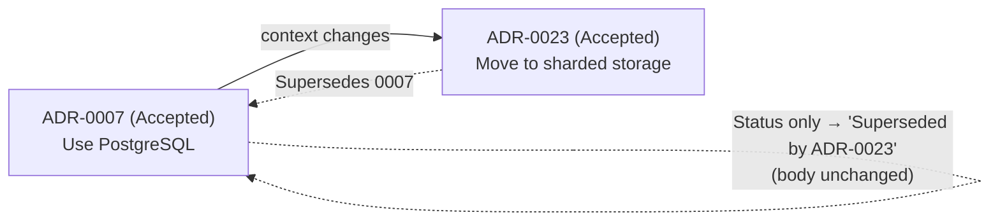
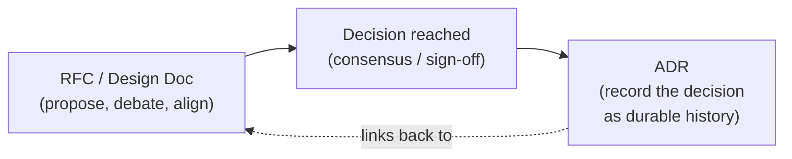
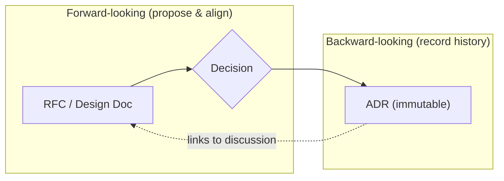

# Architecture Decision Records (ADRs) — Middle

> **Category:** [Documentation](../README.md) — a lightweight, append-only record of a single architecturally-significant decision: its context, the decision itself, and its consequences.

> **Prerequisite:** [Junior](junior.md)
> **Focus:** **Why** and **When**

---

## Table of Contents

1. [Introduction](#introduction)
2. [Template Variants and When to Use Them](#template-variants-and-when-to-use-them)
3. [MADR: Options Considered with Pros and Cons](#madr-options-considered-with-pros-and-cons)
4. [Y-Statements: The One-Sentence ADR](#y-statements-the-one-sentence-adr)
5. [Tyree & Akerman: The Fuller Template](#tyree--akerman-the-fuller-template)
6. [Immutability and Superseding](#immutability-and-superseding)
7. [A Worked Superseding ADR](#a-worked-superseding-adr)
8. [The Decision Log / Index](#the-decision-log--index)
9. [ADR vs. Design Doc vs. RFC](#adr-vs-design-doc-vs-rfc)
10. [Calibrating "Architecturally Significant"](#calibrating-architecturally-significant)
11. [Trade-offs](#trade-offs)
12. [Edge Cases](#edge-cases)
13. [Tricky Points](#tricky-points)
14. [Best Practices](#best-practices)
15. [Test Yourself](#test-yourself)
16. [Summary](#summary)
17. [Diagrams](#diagrams)

---

## Introduction

> Focus: **Why** and **When**

At the junior level, the ADR is a single template you fill in. At the middle level it becomes a set of judgement calls: *Which template fits this decision? Is this significant enough to record? This decision is changing — do I edit, deprecate, or supersede? Where does the ADR end and the design doc begin?*

The recurring tension is between **two failure modes** that kill the practice:

- **Too heavy** — a ceremonious template with ten mandatory sections that nobody fills in, so ADRs stop getting written.
- **Too sparse** — one-liners with no context or consequences, so the record doesn't actually preserve the reasoning it exists to capture.

The middle-level skill is calibrating between them: choosing the *lightest* template that still captures the *why*, and knowing the immutability rules cold so the log stays trustworthy as history.

---

## Template Variants and When to Use Them

Nygard's format is the canonical baseline, but several variants exist, each making a different trade between ceremony and richness.

| Template | Adds over Nygard | Best for |
|---|---|---|
| **Nygard** (original) | — (the baseline: Title, Status, Context, Decision, Consequences) | Most decisions; the default. |
| **MADR** (Markdown ADR) | Explicit **Options Considered** with pros/cons per option; **Decision Drivers** | Decisions where *comparing alternatives* is the point. |
| **Y-statement** (Zimmermann) | Compresses the whole thing into **one structured sentence** | Quick, lightweight capture; an executive summary atop a longer ADR. |
| **Tyree & Akerman** | Many extra fields: Assumptions, Constraints, Positions, Argument, Implications, Related decisions, Notes | Heavyweight, regulated, or high-stakes architecture governance. |

The guiding principle: **use the lightest template that captures the decision's reasoning.** Nygard is right for the vast majority. Reach for MADR when the *alternatives* matter and you want them on the record. Reach for Tyree & Akerman only when governance demands the rigor — its weight is a liability in a fast-moving team. Use Y-statements as a compact summary, not usually as the whole record.

---

## MADR: Options Considered with Pros and Cons

**MADR** (Markdown Any Decision Record / Markdown ADR) extends Nygard with an explicit **Options Considered** section, each option weighed with pros and cons, and named **Decision Drivers**. Its value is that it preserves not just *what we chose* but *what we rejected and why* — invaluable when someone later asks "did you consider X?"

```markdown
# ADR-0011: Use Kafka for inter-service event streaming

## Status
Accepted — 2026-04-02

## Context and Problem Statement
Our services need to react to domain events (order placed, payment
captured) without tight synchronous coupling. We need durable, ordered,
replayable event delivery to multiple independent consumers.

## Decision Drivers
- Durability and replay (consumers must be able to catch up after downtime)
- Ordering guarantees per entity (per-order event order must hold)
- Multiple independent consumer groups
- Operational cost and the team's existing skills

## Considered Options
1. Apache Kafka
2. RabbitMQ
3. AWS SQS + SNS fan-out

## Decision Outcome
Chosen option: **Apache Kafka**, because it best satisfies durability,
replay, and per-partition ordering for multiple consumer groups.

### Pros and Cons of the Options

#### Apache Kafka
- Good: durable log with replay; strong per-partition ordering
- Good: native fan-out to many consumer groups
- Bad: operationally heavier; a real cluster to run and tune

#### RabbitMQ
- Good: simple to operate; mature
- Bad: not a replayable log; harder multi-consumer replay semantics

#### AWS SQS + SNS
- Good: fully managed, low ops
- Bad: weaker ordering guarantees; replay is awkward; vendor lock-in

## Consequences
- Positive: durable, replayable, ordered event backbone for all services.
- Negative: we take on Kafka operational burden (or a managed offering's cost).
- Neutral: a future move off Kafka is a significant migration (one-way-ish).
```

The Options-Considered structure is MADR's reason to exist: the rejected alternatives, and *why* they lost, are exactly the information a future engineer needs before proposing to switch. Without it, they re-evaluate RabbitMQ from scratch, not knowing it was already weighed and dropped.

---

## Y-Statements: The One-Sentence ADR

**Olaf Zimmermann's Y-statement** compresses a decision into a single structured sentence — useful as a lightweight capture or as a one-line summary at the top of a fuller ADR. The skeleton:

> **In the context of** *\<use case / component\>*,
> **facing** *\<concern / non-functional requirement\>*,
> **we decided for** *\<option\>*
> **and against** *\<alternatives\>*
> **to achieve** *\<quality / benefit\>*,
> **accepting that** *\<downside / trade-off\>*.

A worked example:

> *In the context of* the order-management service,
> *facing* the need for strong consistency on order and payment state,
> *we decided for* PostgreSQL
> *and against* MongoDB,
> *to achieve* ACID transactions and simple relational reporting,
> *accepting that* single-node write throughput is a future ceiling we'll revisit via replicas/sharding.

Notice the Y-statement contains the same five ideas as Nygard — context, the decision, the rejected alternative, the benefit, and the trade-off — in one sentence. That makes it an excellent **executive summary** to lead an ADR with, even when the body uses the full Nygard or MADR format. Its weakness is that one sentence can't hold the detail of a complex context; use it to *summarize*, not always to *replace* the longer record.

---

## Tyree & Akerman: The Fuller Template

**Tyree & Akerman** (2005, *"Architecture Decisions: Demystifying Architecture"*) is the heavyweight end of the spectrum, with many fields:

| Field | Purpose |
|---|---|
| **Issue** | The decision being addressed |
| **Decision** | The chosen option |
| **Status** | proposed / accepted / etc. |
| **Assumptions** | Conditions assumed true when deciding |
| **Constraints** | Hard limits the decision must respect |
| **Positions** | The options considered |
| **Argument** | Why the chosen position won |
| **Implications** | Consequences, including future decisions forced |
| **Related decisions** | Links to other ADRs |
| **Related requirements** | Traceability to requirements |
| **Notes** | Everything else |

This rigor buys traceability and governance — explicit assumptions and constraints, links to requirements — which matters in regulated, safety-critical, or large-org-governance contexts. But the cost is real: a ten-field template is a ten-field reason not to write the ADR at all. For most teams the weight outweighs the benefit, which is exactly why Nygard's five-field format became the popular default. **Match the template's weight to the decision's stakes and your team's governance needs — not to a desire to look thorough.**

---

## Immutability and Superseding

This is the conceptual heart of ADRs and the thing engineers most often get wrong.

> An ADR is **append-only history**, not a living document. You do **not** edit the Context or Decision of an *accepted* ADR. When the decision changes, you write a **new ADR** that supersedes the old one.

Why? Because the value of the log is that it records *what we decided, in the situation we were in, at the time.* If you edit ADR-0007 to say "actually we use MongoDB now," you have erased the fact that we *once chose PostgreSQL for good reasons* — and you've left a future reader unable to understand the code written during the PostgreSQL era, or to learn from *why we changed our minds.* The history is the asset; editing destroys it.

The mechanics of superseding:

1. Write a **new ADR** (next number) that states the new decision, with its own Context, Decision, and Consequences. Its Context should explain *what changed* since the old decision.
2. In the new ADR, note `Supersedes ADR-0007`.
3. In the **old** ADR, change *only the Status line* to `Superseded by ADR-0023` (with the date). Leave its Context, Decision, and Consequences exactly as they were.



> The one edit you *are* allowed to make to an accepted ADR is its **Status line** — flipping `Accepted` to `Superseded by ADR-00XX` or `Deprecated`. The status is a pointer into the log; the body is frozen history.

**Deprecated vs. Superseded:** *Deprecated* means "no longer recommended, but nothing has replaced it yet." *Superseded* means "a specific new ADR replaces this one" — always with the replacing number recorded. A decision can go `Accepted → Deprecated → Superseded` as a replacement is eventually written.

---

## A Worked Superseding ADR

Here is the ADR that supersedes the PostgreSQL decision from the [Junior](junior.md) level, two years later:

```markdown
# ADR-0023: Adopt Vitess (sharded MySQL) for order storage

## Status
Accepted — 2028-01-19
Supersedes ADR-0007 (Use PostgreSQL as the primary datastore)

## Context
ADR-0007 chose single-primary PostgreSQL when we were at ~500 orders/min.
That decision was correct for that scale and explicitly flagged
single-node write throughput as the ceiling we would revisit.

We are now at ~40,000 orders/min sustained, with peaks higher during
sales events. The single PostgreSQL primary is now the binding
write-throughput bottleneck, exactly as ADR-0007 anticipated. Read
replicas have not solved it because the bottleneck is writes, not reads.

## Decision
We will migrate order storage to **Vitess (horizontally sharded MySQL)**,
sharded by customer_id, using the expand/contract migration pattern to
move with zero downtime over two quarters.

## Consequences
**Positive**
- Write throughput scales horizontally by adding shards.
- Per-customer data co-locates on one shard (most queries are
  customer-scoped), so most joins stay single-shard.

**Negative / accepted trade-offs**
- Cross-shard queries (e.g. global reporting) now require scatter-gather
  or a separate analytics store — a new decision (see ADR-0024).
- We take on Vitess operational complexity and a multi-quarter migration.
- We lose some of PostgreSQL's richer SQL features.

**Neutral**
- ADR-0007's reasoning remains valid for the scale it was written for;
  this is an evolution driven by growth, not a correction of an error.
```

Notice the new ADR's Context *references and respects* ADR-0007 — it doesn't call the old decision a mistake. It explicitly notes that the old decision was correct *for its time* and that the change is driven by a condition (40k orders/min) the old ADR itself flagged as the revisit trigger. This is what a healthy decision log looks like: a *stream of decisions*, each understandable in the light of the one before.

---

## The Decision Log / Index

Once you have more than a handful of ADRs, you need a way to see them at a glance. The **decision log** (often `docs/adr/README.md`, auto-generated by `adr-tools` or a CI script) is the index:

```markdown
# Architecture Decision Log

| #    | Title                                       | Status                  | Date       |
|------|---------------------------------------------|-------------------------|------------|
| 0001 | Record architecture decisions               | Accepted                | 2026-03-01 |
| 0002 | Use PostgreSQL as the primary datastore     | Superseded by 0023      | 2026-03-14 |
| 0003 | Adopt event-driven order notifications      | Accepted                | 2026-03-20 |
| 0011 | Use Kafka for inter-service event streaming | Accepted                | 2026-04-02 |
| 0023 | Adopt Vitess (sharded MySQL) for orders     | Accepted                | 2028-01-19 |
```

The log is the **single most valuable artifact** for onboarding: a new engineer reads it top to bottom and absorbs the system's entire reasoning history in minutes — including which decisions are still in force and which were superseded. It also makes superseded ADRs discoverable (they stay in the log, marked), so nobody re-proposes a dropped option without first reading why it was dropped.

---

## ADR vs. Design Doc vs. RFC

This distinction is the one middle engineers must get exactly right, because the three are constantly confused.

| | **Design Doc / RFC** | **ADR** |
|---|---|---|
| **Purpose** | *Propose* a design and *align* people before building | *Record* a decision as durable history |
| **Timing** | **Before** building — forward-looking | **At/after** the decision — backward-looking history |
| **Mode** | Discussion, debate, alternatives explored at length | Settled outcome, concise |
| **Lifecycle** | Often archived once the work ships; can go stale | Immutable; superseded, never edited |
| **Scope** | Can be broad (a whole feature/system) | One decision |
| **Audience** | Reviewers/stakeholders deciding *whether/how* | Future engineers asking *why* |

They are **complementary, not competing.** The healthy flow:



> An RFC is a *conversation* about what to do; an ADR is the *minute* that records what was decided. The RFC may run to many pages of exploration and may go stale after the work ships. The ADR distills the *outcome* — the decision and its consequences — into a permanent, append-only record. One often *links to* the other: the ADR cites the RFC where the full discussion lives.

A common, sound pattern: a long RFC drives the discussion; when the team commits, someone writes a short ADR capturing the decision, linking back to the RFC for the gory detail. The RFC can then be left to age gracefully; the ADR carries the durable *why*. (Full treatment in [Design Docs & RFCs](../06-design-docs-and-rfcs/middle.md).)

---

## Calibrating "Architecturally Significant"

The junior test — *"would a new senior ask why?"* — is the right starting point. The middle-level refinement adds **reversibility and blast radius**:

| Decision | Significant? | Reasoning |
|---|---|---|
| Choice of primary database | **Yes** | High blast radius, expensive to reverse |
| Sync vs. async between two services | **Yes** | Structural; affects coupling and failure modes |
| Auth/session strategy | **Yes** | Cross-cutting; security implications |
| A retry/backoff policy on one client | **Maybe** | ADR-worthy if it's a system-wide convention; skip if local |
| Which JSON library to use | **Usually no** | Easily swapped; low blast radius |
| A variable name / formatting | **No** | Trivial, reversible, linter's job |

The deeper test combines two axes: **how significant is the impact** (structure, dependencies, interfaces, cross-cutting concerns) **and how hard is it to reverse**. A decision high on either axis earns an ADR. A decision low on both does not.

> The bar is *significant AND worth a future engineer's time.* Over-ADR-ing trivia is as damaging as under-documenting the big calls — it buries the signal in ceremony and trains the team to ignore the log.

---

## Trade-offs

| Aspect | More ADRs / heavier templates | Fewer ADRs / lighter templates |
|---|---|---|
| Reasoning preserved | High — little is lost | Risk of losing the "why" of mid-tier decisions |
| Write friction | High — discourages the practice | Low — keeps it sustainable |
| Signal-to-noise in the log | Low if you ADR trivia | High — only the big calls |
| Onboarding value | High *if* curated; low if cluttered | High — the log reads cleanly |
| Risk | Abandonment (too heavy to sustain) | Gaps (some real reasoning never captured) |

The sweet spot for most teams: **Nygard's five-field format, applied to genuinely significant decisions, written at decision time.** That keeps friction low enough to sustain and signal high enough to trust. Escalate to MADR when alternatives matter; reserve Tyree & Akerman for governance-heavy contexts.

---

## Edge Cases

### 1. A decision was never formally made

Sometimes the "decision" was an accident of history — the first person used Library X and it stuck. You can still write an ADR *now*, retroactively, with the Status `Accepted` and a Context that honestly says "this was the de-facto choice; we're documenting it to make the reasoning explicit and revisitable." Retroactive ADRs are legitimate and valuable.

### 2. The decision is reversed back to a previous choice

If ADR-0023 (Vitess) is itself later superseded by ADR-0040 returning to PostgreSQL (now with a different scaling story), you do *not* un-supersede ADR-0007. You write ADR-0040, mark ADR-0023 superseded, and ADR-0040's context explains the full arc. Each ADR is a point in the stream; you never resurrect old ones.

### 3. Two ADRs conflict

If two accepted ADRs contradict each other, that's a bug in the log — resolve it by writing a new ADR that supersedes one (or both) and states the reconciliation. The log must never have two live, contradicting decisions.

---

## Tricky Points

- **Immutability applies to the decision, not the Status line.** You *may* flip Status to `Superseded`/`Deprecated`; you *may not* rewrite Context or Decision. Fixing a typo is fine; changing the substance is not.
- **The RFC may be forward-looking and the ADR backward-looking, but they share content.** The ADR is often *distilled from* the RFC. Don't duplicate the full RFC into the ADR — link to it and keep the ADR concise.
- **"Superseded" needs a number; "Deprecated" doesn't.** Superseded always names its replacement; Deprecated can stand alone until a replacement is written.
- **An ADR with no Consequences section is incomplete.** Naming the downsides is what tells a future reader the conditions under which the decision should be revisited. The PostgreSQL ADR's "single-node write ceiling" is *exactly* what later triggered the Vitess ADR.
- **MADR's Options-Considered is the antidote to "did you consider X?"** Recording rejected options and why they lost prevents re-litigation.

---

## Best Practices

1. **Default to Nygard.** Escalate to MADR when alternatives matter; use Y-statements as summaries; reserve Tyree & Akerman for governance-heavy contexts.
2. **Write at decision time**, while the context is fresh — avoid an ADR backlog.
3. **Never edit a decision; supersede it.** Change only the old ADR's Status line.
4. **Reference, don't resurrect.** A superseding ADR explains what changed and respects the old decision's validity for its time.
5. **Maintain the index/log** so the history is discoverable; auto-generate it if you can.
6. **Link ADRs to their RFC/design doc** rather than copying the discussion in.
7. **Calibrate significance by impact AND reversibility** — ADR the big or irreversible calls, skip the trivia.

---

## Test Yourself

1. Name three ADR template variants beyond Nygard and what each adds.
2. Why must you supersede rather than edit an accepted ADR's decision?
3. What is the *one* part of an accepted ADR you are allowed to change, and to what?
4. Write the Y-statement skeleton from memory (the six clauses).
5. Distinguish an ADR from a design doc/RFC on purpose and timing.
6. What's the difference between `Deprecated` and `Superseded`?

---

## Summary

- ADR templates form a spectrum: **Nygard** (default), **MADR** (alternatives with pros/cons), **Y-statements** (one-sentence summary), **Tyree & Akerman** (heavyweight governance). Use the lightest that captures the *why*.
- ADRs are **append-only history**: never edit a decision — write a **new ADR that supersedes** it, changing only the old one's **Status line**.
- A superseding ADR **respects** the old decision (valid for its time) and explains *what changed*; the **decision log** keeps both discoverable.
- An **ADR records** a decision; a **design doc/RFC proposes** one. They complement each other: **RFC → decision → ADR**, with the ADR linking back to the RFC.
- Calibrate **"architecturally significant"** by impact *and* reversibility — ADR the big/irreversible calls, skip the trivia.

---

## Diagrams

### ADR status lifecycle (with superseding)


### RFC → decision → ADR (propose vs. record)




---

## Check your understanding

1. Explain Architecture Decision Records (ADRs) — Middle Level in your own words and name the problem it solves.
2. How would you apply the ideas around Table of Contents, Introduction, Template Variants and When to Use Them in a realistic engineering change?
3. What failure mode or misuse should you look for, and what evidence would reveal it?
4. Which local design trade-off would make you choose or reject Architecture Decision Records (ADRs) — Middle Level in an existing codebase?
5. What observable result would convince you that the approach improved the system?
