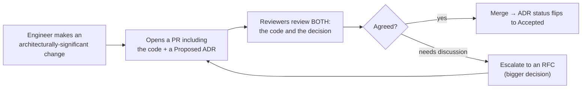
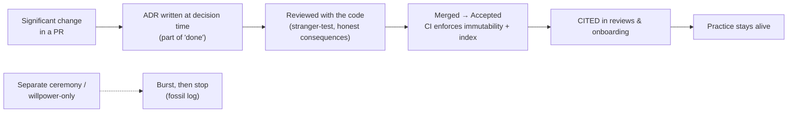
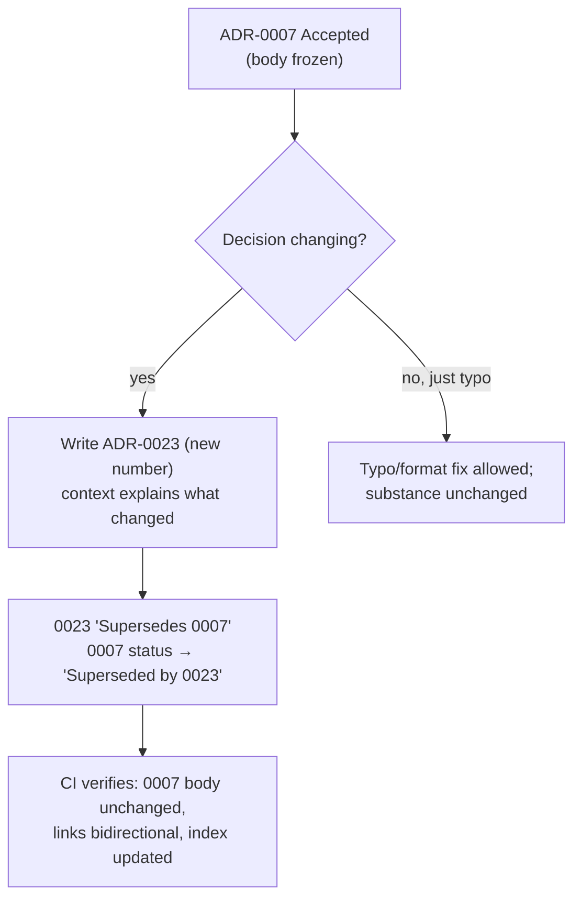

# Architecture Decision Records (ADRs) — Professional

> **Category:** [Documentation](../README.md) — a lightweight, append-only record of a single architecturally-significant decision: its context, the decision itself, and its consequences.

> **Prerequisites:** [Junior](junior.md) · [Middle](middle.md) · [Senior](senior.md)
> **Focus:** **Production** — adoption, review, tooling, governance at org scale

---

## Table of Contents

1. [Introduction](#introduction)
2. [Rolling Out ADRs in a Real Organization](#rolling-out-adrs-in-a-real-organization)
3. [ADRs in the Pull-Request Workflow](#adrs-in-the-pull-request-workflow)
4. [Tooling: adr-tools, Log4brains, CI Checks](#tooling-adr-tools-log4brains-ci-checks)
5. [Keeping the Practice Alive](#keeping-the-practice-alive)
6. [Reviewing an ADR](#reviewing-an-adr)
7. [Real Incidents](#real-incidents)
8. [The Politics of Recorded Decisions](#the-politics-of-recorded-decisions)
9. [ADR Review Checklist](#adr-review-checklist)
10. [Cheat Sheet](#cheat-sheet)
11. [Diagrams](#diagrams)
12. [Related Topics](#related-topics)

---

## Introduction

> Focus: **production** — making ADRs a durable, organization-wide practice that survives turnover and deadlines.

ADRs are trivial to *understand* and notoriously hard to *sustain*. Almost every team that adopts them writes a burst of enthusiastic ADRs in the first month and then quietly stops. The records become a fossil: ADR-0001 through ADR-0006, dated within three weeks of each other, then silence — while the architecture kept evolving, undocumented. A stalled log is worse than none, because it *implies* decisions are recorded when they aren't.

At the professional level the question is operational: **how do you make ADRs a habit that survives turnover, deadlines, and the natural entropy of a busy team?** The answer is a system — low-friction tooling, the right trigger in the workflow, review standards, governance that uses the log, and a culture that treats recording reasoning as part of "done," not paperwork after the fact.

---

## Rolling Out ADRs in a Real Organization

Adoption fails when it's mandated top-down as ceremony and succeeds when it's introduced as a low-friction tool that *visibly* saves people time. A pragmatic rollout:

1. **Start with ADR-0001: "We will record architecture decisions."** The first ADR records the decision to use ADRs, in the Nygard format. It's a self-demonstrating example and sets the template.
2. **Pick the lightest viable template (Nygard) and put it in the repo.** Don't debate templates for a sprint; ship Nygard, escalate to MADR only where alternatives genuinely matter.
3. **Backfill a handful of *existing* significant decisions retroactively.** This seeds the log with immediately useful content and proves the value ("oh, *that's* why we use Kafka") before asking anyone to write new ones.
4. **Define the trigger explicitly:** *"If your PR makes an architecturally-significant change — new dependency, new service boundary, a cross-cutting convention, an irreversible choice — it includes an ADR."* Make it part of the definition of done.
5. **Make significance concrete with examples**, not abstractions. A short "ADR or not?" list (database choice → yes; JSON library → usually no) prevents both over- and under-recording.
6. **Generate the index automatically** so nobody maintains it by hand.

> The single biggest predictor of success is **friction**. If writing an ADR takes a tool command and ten minutes inside the PR you're already making, it happens. If it requires a separate ceremony, a wiki login, and a meeting, it doesn't.

---

## ADRs in the Pull-Request Workflow

The professional move is to bind the ADR to the **code change that embodies the decision**, so the record is written *at decision time* and reviewed *with* the implementation.



This integration is what keeps the practice alive: there is no separate "write the ADRs" task to fall off the backlog, because the ADR is part of the PR that can't merge without it. It also means the decision is reviewed *as a decision* — reviewers can challenge the choice, not just the code — which is where governance happens, asynchronously and on the record. When a `Proposed` ADR draws too much disagreement to settle in PR comments, that's the signal to escalate it to a full [RFC](../06-design-docs-and-rfcs/professional.md); the ADR returns once the RFC concludes.

---

## Tooling: adr-tools, Log4brains, CI Checks

Tooling lowers friction (which sustains the practice) and enforces the invariants (immutability, valid supersession). The mature stack:

| Tool / check | What it does |
|---|---|
| **`adr-tools`** (Nat Pryce) | CLI: `adr new "Title"` scaffolds a numbered Nygard file; `adr new -s 7 "Title"` creates an ADR that supersedes #7 *and* updates #7's status; `adr generate toc` builds the index. |
| **Log4brains** | Generates a browsable, searchable static **ADR website** from your `docs/adr/` Markdown — turns the log into a navigable knowledge base. |
| **MADR tooling / templates** | Standard MADR template files and linters for the Options-Considered format. |
| **CI: immutability check** | Fails the build if an *Accepted* ADR's Context/Decision/Consequences changed (only Status edits allowed). The guardrail that makes append-only real. |
| **CI: link check** | Verifies `Supersedes`/`Superseded by` links are bidirectional and that no two *Accepted* ADRs contradict. |
| **CI: index freshness** | Regenerates and diffs the index so it never drifts from the files. |
| **CI: lint/structure** | Ensures required sections exist (no missing Consequences), numbering is sequential, filenames match the slug. |

Example of the supersession command doing the bookkeeping for you:

```bash
# Create ADR-0023 that supersedes ADR-0007, automatically setting 0007's
# status to "Superseded by ADR-0023" — no manual editing of the old file's body.
adr new -s 7 "Adopt Vitess (sharded MySQL) for order storage"
```

The immutability CI check is the most underrated of these. *Convention* says "don't edit accepted ADRs"; a CI check *enforces* it, and enforcement is what lets the whole org trust the log without auditing every change. (Broader docs-CI patterns: [Docs as Code & Tooling](../10-docs-as-code-and-tooling/professional.md).)

---

## Keeping the Practice Alive

The practice dies of friction and forgetting. The counters:

| Failure mode | Counter |
|---|---|
| **Burst-then-stop** | Bind ADRs to PRs (part of "done"), so they're never a separate task to drop. |
| **Too heavy to write** | Default to Nygard; ban ceremony; ten minutes max for a routine ADR. |
| **Forgetting the trigger** | A PR template checkbox: "Does this change need an ADR?" + a concrete significance list. |
| **Treated as living docs** | CI immutability check; train the team to supersede, not edit. |
| **Index/links rot** | Auto-generate the index and link-check in CI. |
| **Discoverability** | A generated ADR site (Log4brains); link ADRs from code comments and the architecture catalog. |
| **"Nobody reads them"** | Make them part of onboarding; cite ADR numbers in code review and design discussions so they're *used*, not just stored. |

> An ADR practice is alive when ADR numbers show up *in conversation* — "that violates ADR-0009," "did you read ADR-0023 before re-proposing RabbitMQ?" A log that's written but never *referenced* is on its way to death. Usage, not volume, is the health metric. (See [Keeping Docs Alive & Doc Rot](../11-keeping-docs-alive-and-doc-rot/professional.md).)

---

## Reviewing an ADR

Reviewing an ADR is distinct from reviewing code; you're reviewing *reasoning*. The high-value review questions:

- **Is it actually one decision?** If it's three, ask to split it — bundled ADRs become unsupersedable.
- **Is the Context facts, written for a stranger?** A reviewer from another team should understand the situation without tribal knowledge. If it assumes context the reader won't have, it'll be useless in two years.
- **Are the Consequences honest — including the downsides and the *revisit trip-wire*?** "What condition would make us regret this?" An ADR that names no cost is advocacy; push back.
- **Were real alternatives considered (use MADR if so)?** "Did you consider X, and why did it lose?" Recording the rejected options prevents future re-litigation.
- **Is this a one-way door?** If irreversible, the bar for the Context and alternatives is higher — and it may warrant escalation to an RFC.
- **Does it conflict with an existing ADR?** If so, it must explicitly supersede it, not silently contradict it.

> The reviewer's job is to ensure the ADR will answer "why?" for someone who *isn't in the room* and *wasn't on the team* — in two years. That stranger-test is the standard.

---

## Real Incidents

### Incident 1: The log that stopped at ADR-0006

A team adopted ADRs with enthusiasm: six records in the first month. Then a crunch hit, ADRs fell off, and the practice never resumed. Eighteen months later a new architect read `docs/adr/`, saw six tidy ADRs, and *assumed the architecture was well-documented* — then spent two weeks discovering that every significant decision *after* month one (the move to Kafka, the auth redesign, the read-replica split) was unrecorded. **Postmortem:** a stalled log is worse than no log, because it falsely signals completeness. **Fix:** ADRs were bound to PRs (no significant PR merges without one), a PR-template checkbox was added, and the gap decisions were backfilled. **Lesson:** the practice must be wired into the workflow, not left to willpower.

### Incident 2: The silently edited decision

Under pressure to "keep the docs current," an engineer edited ADR-0007 in place to say the system now used a different cache, instead of writing a superseding ADR. Months later, a reviewer cited ADR-0007 to justify a design — using the *edited* version — not realizing the original decision and its context had been overwritten, and that the rationale they were citing had never actually been the reasoning. A subtly wrong design shipped on a falsified record. **Fix:** a CI immutability check now fails any build that alters an Accepted ADR's body; the team was retrained to supersede. **Lesson:** immutability isn't pedantry — one in-place edit makes the *entire* log untrustworthy, because you can no longer assume any ADR reflects its original reasoning.

### Incident 3: The ADR nobody could find

A team faithfully wrote ADRs, but scattered them across twelve service repos with no central index. When a new platform team needed to know the org's standard for inter-service messaging, they couldn't find the three relevant ADRs (in three different repos) and re-decided from scratch — landing on a *fourth*, inconsistent choice. **Fix:** repo-local ADRs were kept, but a CI job now aggregates them into a generated, searchable central index (Log4brains-style). **Lesson:** an ADR that can't be found is an ADR that doesn't exist. Discoverability is a first-class requirement, not an afterthought.

### Incident 4: Over-ADR-ing into noise

In a zealous adoption, one team wrote ADRs for trivial choices — a logging format, a variable-naming convention, a linter rule. Within a year the log had ~120 ADRs, the dozen *significant* ones buried among trivia, and engineers stopped reading it because the signal-to-noise was hopeless. **Fix:** a "significance bar" was documented (blast radius / reversibility / contention / surprise), trivial ADRs were retroactively closed as `Deprecated — out of scope`, and new ADRs were gated on the bar in review. **Lesson:** ADRs are for *architecturally-significant* decisions. Recording trivia is as damaging as omitting the big calls — it destroys the log's usefulness for onboarding and governance.

---

## The Politics of Recorded Decisions

Sustaining ADRs is partly a social problem:

- **Writing down a decision feels like exposing yourself to future blame.** Engineers fear an ADR will be used to say "you decided wrong." Reframe: a *superseded* ADR isn't a failure — it's a decision that was correct for its time and is now evolving. Celebrate clean supersession as the system working, not as anyone being wrong. The PostgreSQL → Vitess arc is a *success story*, not a confession.
- **"We don't have time to document" hides a false economy.** The time saved by skipping the ten-minute ADR is paid back many times over in future archaeology and re-litigation. Make the cost of *not* recording visible (cite the incidents above).
- **Senior engineers and architects must model it.** If the staff engineer makes a big call in a Slack thread and never writes the ADR, everyone learns ADRs are optional. The most senior people writing ADRs for their decisions is the strongest possible signal.
- **Governance-by-transparency beats governance-by-gatekeeping, but only if leadership trusts it.** Selling ADR-based governance up the chain means showing that recorded, reviewed decisions give *more* visibility than an approval board — without the bottleneck.

> The cultural goal: recording the *why* of a significant decision is as normal and non-negotiable as writing a test for new behavior. Neither is "extra paperwork"; both are part of doing the work properly.

---

## ADR Review Checklist

```text
ADR REVIEW CHECKLIST
[ ] ONE decision per ADR (split if it's several)
[ ] CONTEXT is facts, written for a stranger from another team
[ ] DECISION is stated plainly in active voice ("We will ...")
[ ] CONSEQUENCES are honest — downsides AND the revisit trip-wire named
[ ] ALTERNATIVES recorded (MADR) if real options were weighed
[ ] STATUS is correct (Proposed for review; Accepted on merge)
[ ] SUPERSEDES an existing ADR explicitly if it changes a prior decision
[ ] NO silent contradiction of an existing Accepted ADR
[ ] ONE-WAY DOOR? → higher bar on context/alternatives; consider an RFC
[ ] SIGNIFICANCE bar met (blast radius / reversibility / contention / surprise)
[ ] NUMBER sequential, filename = NNNN-kebab-title.md, in docs/adr/
[ ] INDEX will regenerate to include it
```

---

## Cheat Sheet

```text
ROLL OUT      ADR-0001 = "we record decisions"; pick Nygard; backfill a few;
              make ADRs part of the PR's definition of done.

TRIGGER       significant PR (new dep / boundary / cross-cutting / irreversible)
              → include a Proposed ADR; reviewed WITH the code.

TOOLING       adr-tools (new/supersede/index) · Log4brains (browsable site)
              CI: immutability check · supersede-link check · index freshness

KEEP ALIVE    bind to PRs · light template · auto-index · CITE adr numbers in
              review & onboarding.  Health metric = ADRs referenced, not written.

IMMUTABILITY  never edit an Accepted decision → SUPERSEDE.  Only Status may change.
              Enforce with a CI check (convention isn't enough at scale).

PITFALLS      burst-then-stop · silent edits · can't-find-them · ADR-ing trivia.
              Counters: workflow binding · CI · central index · significance bar.

CULTURE       superseding = success, not failure.  Seniors model it.
              recording the WHY = as normal as writing a test.
```

---

## Diagrams

### Where the practice lives or dies



### Decision change: the only legal path



---

## Related Topics

- **Complements (propose vs. record):** [Design Docs & RFCs](../06-design-docs-and-rfcs/professional.md)
- **CI, linting, generated sites for ADRs:** [Docs as Code & Tooling](../10-docs-as-code-and-tooling/professional.md)
- **Fighting log rot, keeping ADRs referenced:** [Keeping Docs Alive & Doc Rot](../11-keeping-docs-alive-and-doc-rot/professional.md)
- **What to document at all:** [Why & What to Document](../01-why-and-what-to-document/professional.md)
- **Tooling:** `adr-tools`, Log4brains, MADR templates, CI immutability/link checks.

---


---

## Check your understanding

1. Explain Architecture Decision Records (ADRs) — Professional Level in your own words and name the problem it solves.
2. How would you apply the ideas around Table of Contents, Introduction, Rolling Out ADRs in a Real Organization in a realistic engineering change?
3. What failure mode or misuse should you look for, and what evidence would reveal it?
4. How would you introduce and govern Architecture Decision Records (ADRs) — Professional Level across teams through reversible, measurable increments?
5. What observable result would convince you that the approach improved the system?
