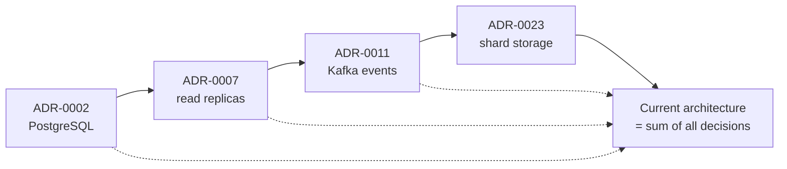
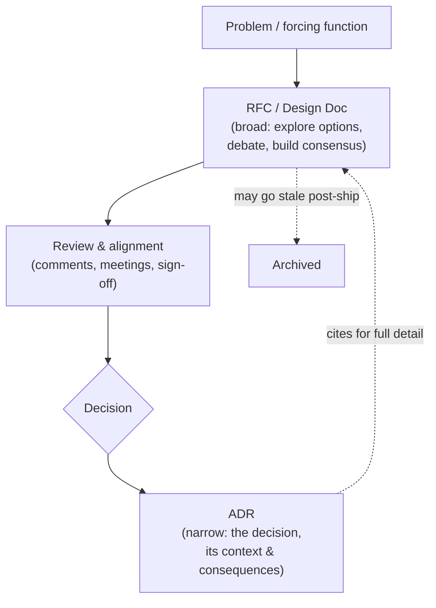
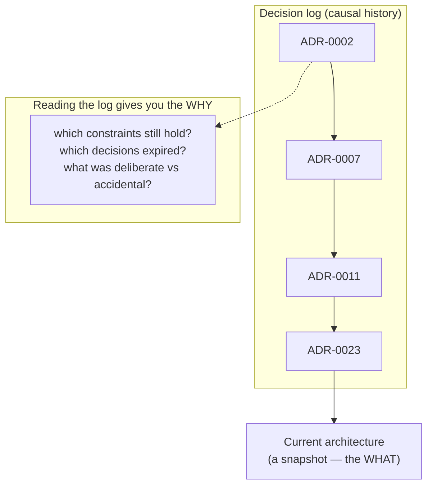
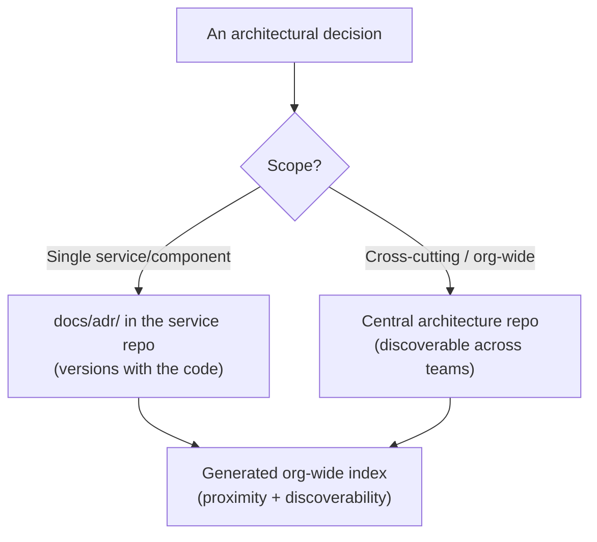

# Architecture Decision Records (ADRs) — Senior

> **Category:** [Documentation](../README.md) — a lightweight, append-only record of a single architecturally-significant decision: its context, the decision itself, and its consequences.

> **Prerequisites:** [Junior](junior.md) · [Middle](middle.md)
> **Focus:** **Design trade-offs** and **system-level reasoning**

---

## Introduction

> Focus: **design trade-offs** and **system-level reasoning**

At the senior level, ADRs stop being a documentation habit and become a **model of what architecture *is*.** The naïve view of architecture is a static thing — a diagram, a set of boxes and arrows, a "blueprint." The senior view is that architecture is **a stream of decisions accumulated over time**, each made under specific forces, each with consequences that shape the next. The ADR log is that stream, written down. Get this view and ADRs stop being optional hygiene and become the primary record of the system's *reasoning* — the thing that lets architecture survive the people who created it.

This file covers the hard questions a senior must answer:

1. **What is the relationship between the decision log and the architecture itself?**
2. **Which decisions are *worth* the permanence of an ADR — and what are the costs of getting that bar wrong in either direction?**
3. **How do ADRs fit into governance, into the RFC pipeline, and into a multi-repo / multi-team organization?**

---

## Architecture as a Stream of Decisions

The reframe, due in part to Michael Nygard and amplified by the broader "decision-centric architecture" movement:

> **A system's architecture is not its current structure — it is the sequence of decisions that produced that structure.** The boxes-and-arrows diagram is a *snapshot of the latest state*; the decision log is the *causal history* that explains it.

This matters because the snapshot, by itself, is *unintelligible*. A diagram shows you that orders go through Kafka, that storage is sharded, that auth uses short-lived tokens — but it cannot tell you whether any of that is a sound deliberate choice or an accident you should fix. Only the decisions explain the diagram. An architect who inherits a system inherits its *current state*; an architect who inherits a *good ADR log* inherits the *reasoning*, which is far more valuable — it tells them which constraints still hold, which decisions were tied to conditions that have since changed, and where the bodies are buried.

This is why the log is read top-to-bottom, not dipped into: each decision is comprehensible only in the context of the ones before it. ADR-0023 (shard the database) makes no sense without ADR-0007 (single PostgreSQL was right at small scale, with the write ceiling flagged). The stream is the architecture's autobiography.

---

## What Makes a Decision Worth Recording

"Architecturally significant" gets sharper at the senior level. The decision is worth the permanence of an ADR when it scores high on **impact** and/or **irreversibility** — the same one-way-door reasoning that governs [simple design and YAGNI](../../craftsmanship-disciplines/04-simple-design/senior.md), applied to documentation.

| Axis | High → ADR it | Low → skip it |
|---|---|---|
| **Blast radius** | Touches many components/teams | Contained in one function |
| **Reversibility** | Expensive/painful to undo (one-way door) | Trivially swappable in an afternoon |
| **Cross-cutting** | Auth, consistency model, error strategy, observability | A local implementation detail |
| **Contention** | The team debated it; alternatives were real | Obvious, uncontested |
| **Surprise** | A future reader would be puzzled by it | Self-evident from the code |

The senior insight is that **contention and surprise are signals in their own right.** A decision that was *debated* deserves an ADR even if it seems small, because the debate means the reasoning is non-obvious and re-litigation is likely. A decision that *surprises* a reader deserves one because surprise is exactly the archaeology trigger. Conversely, an uncontested, self-evident, reversible choice does *not* deserve one no matter how "architectural" it sounds.

> The failure is not having too many or too few ADRs in the abstract — it's recording the *wrong* decisions: trivia that buries the log, while the genuinely surprising, contested, irreversible calls go unrecorded because they felt "obvious at the time." They are never obvious later.

---

## The Consequences Section Is the Whole Point

Juniors treat Consequences as a formality. Seniors understand it is the **most valuable** section, for a reason that only becomes clear over years:

> The Consequences section is what tells a future engineer **when the decision should be revisited.** A decision is only valid while its trade-offs remain acceptable. By recording the costs you *knowingly accepted*, you encode the *trip-wire* for the next decision.

Re-read the PostgreSQL ADR from [Junior](junior.md): it explicitly accepts "single-node write throughput is a future ceiling." Two years later, that exact recorded consequence is what *triggers* the Vitess superseding ADR — the team didn't rediscover the bottleneck by accident; the ADR had named it as the condition to watch. **A well-written Consequences section is a message to your future self saying "revisit me when *this* becomes true."**

This reframes how to write Consequences:

- **Name the conditions under which the decision flips.** Not just "this is slower" but "this becomes the bottleneck above N requests/sec."
- **Record what becomes *harder*, not only what becomes easier.** The new constraints a decision imposes are the seeds of future ADRs.
- **Distinguish accepted costs from open risks.** An accepted cost ("we run a Kafka cluster") is a known price; an open risk ("ordering across partitions is not guaranteed and may bite us") is a flagged danger.

A Consequences section with only benefits is not a record — it is advocacy, and it is useless precisely when it matters most, because it gives a future engineer no signal about when the decision has expired.

---

## ADRs as the Distillation of an RFC

At the senior level the relationship between the [RFC/design doc](../06-design-docs-and-rfcs/senior.md) and the ADR becomes an operational pipeline you actively manage:

The division of labor is precise:

- **The RFC is the *deliberation*** — wide, exploratory, often long, full of options, prototypes, and disagreement. Its job is to *get to* a decision and align people. Once the work ships, an RFC is allowed to age; it captured a moment of thinking.
- **The ADR is the *verdict*** — narrow, concise, permanent. Its job is to be the durable answer to "why?" long after the RFC's discussion is irrelevant.

A senior manages this so neither is redundant: the ADR does **not** copy the RFC's exploration; it *distills* the outcome and *links* to the RFC for the archaeology. One forcing function may yield several ADRs (one RFC proposing a service split might produce separate ADRs for the boundary, the communication protocol, and the data ownership). Conversely, a small decision needs no RFC at all — write the ADR directly. The pipeline is a default, not a mandate.

> The RFC answers *"what should we do and why this over that?"* in real time. The ADR answers *"what did we decide and what did it cost?"* forever. Conflating them produces either RFCs that pretend to be permanent (and rot) or ADRs bloated with stale debate (and unread).

---

## Where ADRs Live: Repo-Local vs. Centralized

A real organizational tension at scale: **should ADRs live in the repo of the thing they describe, or in a central architecture repository?**

| | **Repo-local** (`docs/adr/` in the service) | **Centralized** (one architecture repo / wiki) |
|---|---|---|
| Proximity to code | High — travels and versions with the code | Low — can drift from the code's reality |
| Discoverability across teams | Low — scattered across many repos | High — one place to browse the org's decisions |
| Right scale | Service-/component-level decisions | Cross-cutting, org-wide, multi-service decisions |
| Tooling | `adr-tools`, PR review, git history | Often a docs site or knowledge base |

The mature answer is usually **both, by scope**: decisions that affect a single service live in that service's repo (docs-as-code, reviewed with the code); decisions that span services or set org-wide standards live in a central architecture repo. The discriminator is the decision's *scope*, matching the principle that documentation should live as close as possible to what it describes ([Keeping Docs Alive](../11-keeping-docs-alive-and-doc-rot/senior.md)) while remaining *discoverable*. A common pattern is repo-local ADRs plus a generated, centralized **index** that aggregates across repos, giving proximity *and* discoverability. Tooling and CI for this is the subject of [Docs as Code & Tooling](../10-docs-as-code-and-tooling/senior.md).

---

## ADRs and Architectural Governance

In larger organizations, the ADR practice becomes the substrate for **lightweight architectural governance** — a far better model than the old "architecture review board approves everything up front" gatekeeping.

- **Decisions are made by the team closest to the work**, recorded as ADRs, and *visible* to architects and other teams. Governance shifts from *approval gates* to *transparency and review* — the architect reviews the ADR (often the `Proposed` status) rather than dictating the decision.
- **The log becomes the audit trail.** Compliance, security, and architecture functions can read *why* a choice was made and whether constraints were respected — without re-interrogating the team.
- **Cross-team consistency emerges from a shared, searchable log.** Before a team picks a message broker, they can read the org's existing ADRs and either align or write an ADR justifying divergence.
- **`Proposed` status is the review hook.** An ADR in `Proposed` is an invitation to comment before it's accepted — the governance touchpoint, done asynchronously and on the record.

This is the architecture analog of *trunk-based, reviewed change*: autonomy with accountability, decisions distributed but recorded. It scales because it doesn't bottleneck on a central board, yet it keeps reasoning visible and reviewable. The failure mode it replaces — undocumented tribal decisions plus a powerless review board nobody respects — is far worse.

---

## The Immutability Discipline at System Scale

The append-only rule, easy to follow for one repo, becomes a discipline to *defend* across an org:

- **The log's value scales super-linearly with its trustworthiness.** A log that is *sometimes* edited in place is a log you cannot trust *anywhere* — you can no longer assume any ADR reflects its original reasoning. One silent edit poisons the well. Enforce immutability ruthlessly (e.g., a CI check that an ADR's Context/Decision didn't change once Accepted, allowing only Status edits).
- **Superseding chains must stay linkable.** `Supersedes`/`Superseded by` links form a graph; tooling should verify they're bidirectional and that no Accepted ADR is silently contradicted by a later one. A broken supersession link is as bad as a broken decision.
- **Resist the urge to "clean up" old ADRs.** Old, superseded ADRs *look* like clutter to a tidy-minded engineer; they are the historical record and must stay. The Status line marks them as past; deletion erases the lesson.

> Immutability is not bureaucratic rigidity — it is the property that makes the log *a record* rather than *a wiki*. A wiki tells you the current best understanding; a decision log tells you what was decided and why, including the decisions you've since abandoned. Those abandoned decisions are where the most valuable lessons live.

---

## ADRs, Clean Architecture, and System Design

ADRs are how you make architectural principles *traceable* rather than aspirational:

- **Clean Architecture / dependency rules.** When you decide that the domain core must not depend on a framework, that boundary is an *architectural decision* — record it as an ADR. Later, when a reviewer questions why an adapter layer exists, the ADR is the answer, and it makes the principle enforceable ("this violates ADR-0009"). Without the ADR, "clean architecture" is a slogan; with it, it's a recorded, citable decision.
- **System design choices.** Every significant system-design trade-off — consistency vs. availability, sync vs. async, monolith vs. services, the choice of a specific storage engine — is exactly the kind of high-blast-radius, often-irreversible decision ADRs exist to capture. A system-design interview answer and an ADR have the *same skeleton*: context/requirements → decision → trade-offs. The ADR is the persisted form of that reasoning.
- **Conceptually, ADRs are to architecture what tests are to behavior.** Tests pin behavior so you can change code fearlessly; ADRs pin *reasoning* so you can change architecture deliberately — knowing which constraints are load-bearing and which were tied to conditions that have since changed.

The senior synthesis: principles like Clean Architecture describe the *shape* of a good system; ADRs record *the specific decisions* that realized (or deliberately departed from) that shape, with the context and trade-offs that justified each one. Principles without recorded decisions drift into cargo-cult; decisions without principles drift into inconsistency. ADRs are where the two meet on the record.

---

## Liabilities

### Liability 1: The log that started and stopped

The most common failure: a team writes ADRs 0001–0006 enthusiastically, then stops. Now the log is *worse than nothing* — it implies decisions are recorded when they aren't, so a reader trusts a log that's silently incomplete. A half-maintained log is a trap. Either sustain the practice (lightweight templates, write-at-decision-time, review-gated) or don't pretend to have it.

### Liability 2: Recording the wrong decisions

ADR-ing trivia while the genuinely surprising/irreversible calls go unrecorded. The log fills with noise; the signal is missing exactly where archaeology will later strike. Calibrate ruthlessly on blast radius, reversibility, contention, and surprise.

### Liability 3: Treating ADRs as living docs

Editing accepted decisions in place — the cardinal sin. It converts a trustworthy historical record into an untrustworthy wiki and destroys the lessons of abandoned decisions. Enforce immutability with tooling, not just convention.

### Liability 4: Consequences as advocacy

ADRs that list only benefits. They are useless precisely when needed — they give no trip-wire for revisiting, and they read as the sales pitch of whoever pushed the decision. Mandate honest, condition-naming Consequences.

### Liability 5: Discoverability rot

Even perfectly written ADRs are worthless if nobody can find them. Scattered across repos with no index, they're invisible. Maintain a generated index; link ADRs from the code and from the central architecture catalog.

---

## Pros & Cons at the System Level

| Dimension | With a healthy ADR practice | Without ADRs |
|---|---|---|
| Onboarding to architecture | Read the log; absorb the reasoning in hours | Months of archaeology and asking around |
| Re-litigating settled decisions | Rare — the log shows it was decided and why | Constant — every newcomer re-opens old debates |
| Changing the architecture | Deliberate — you see which constraints are load-bearing | Risky — you can't tell deliberate from accidental |
| Governance | Transparent, async, on-the-record, scales | Gatekeeping board (bottleneck) or tribal chaos |
| Cost | Real but small (lightweight, at decision time) | Zero up front; enormous later (lost reasoning) |
| Risk | Abandonment; recording the wrong things | Total reasoning loss the moment people leave |
| Trust in the record | High *if* immutability is enforced | N/A — no record exists |

The table makes the senior stance precise: a healthy ADR practice wins on every dimension *for significant decisions in systems that outlive their authors* — which is every system worth maintaining. It costs little when done with light templates at decision time, and it fails only through neglect (abandonment, wrong calibration, broken immutability) — all of which are within the team's control.

---

## Diagrams

### The decision log IS the architecture's history

### Repo-local vs. centralized by scope

---

## Related Topics

- **Complements (propose vs. record):** [Design Docs & RFCs](../06-design-docs-and-rfcs/senior.md)
- **Storage, indexing, CI for ADRs:** [Docs as Code & Tooling](../10-docs-as-code-and-tooling/senior.md)
- **Fighting log rot & discoverability:** [Keeping Docs Alive & Doc Rot](../11-keeping-docs-alive-and-doc-rot/senior.md)
- **One-way-door reasoning (shared with):** [Simple Design](../../craftsmanship-disciplines/04-simple-design/senior.md)
- **The "why" layer of documentation:** [Why & What to Document](../01-why-and-what-to-document/senior.md)

---

---

## Check your understanding

1. Explain Architecture Decision Records (ADRs) — Senior Level in your own words and name the problem it solves.
2. How would you apply the ideas around Table of Contents, Introduction, Architecture as a Stream of Decisions in a realistic engineering change?
3. What failure mode or misuse should you look for, and what evidence would reveal it?
4. How would you validate a system-level decision about Architecture Decision Records (ADRs) — Senior Level under uncertainty?
5. What observable result would convince you that the approach improved the system?
