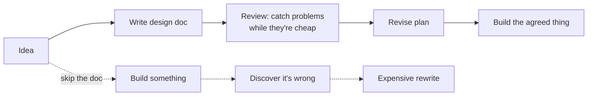
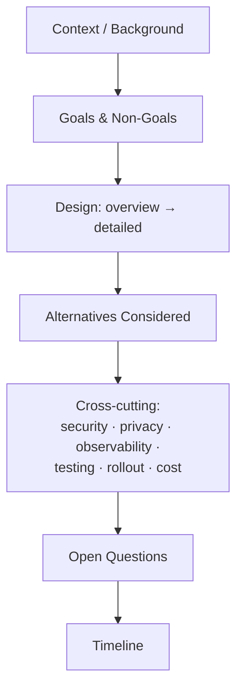
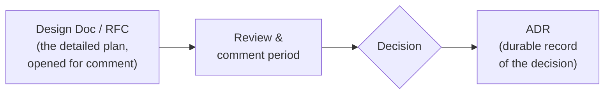
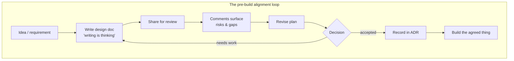

# Design Docs & RFCs — Junior

> **Category:** [Documentation](../README.md) — writing a short proposal *before* building, so the team can review the plan while it's still cheap to change.

---

## Introduction

> Focus: **What is it?** and **How to use it?**

A **design doc** (also called a *technical design document* or *tech spec*) is a short written description of *what you intend to build and how*, written **before** you build it, and shared so other people can read it and react. An **RFC** ("Request for Comments") is the same idea wrapped in a lightweight *process*: you publish the proposal, open a comment period, collect feedback, revise, and end with a decision.

> A design doc / RFC is written **before** building, to **align stakeholders, surface risks, and get review while the work is still cheap to change.**

That last phrase is the whole point. The cheapest moment to discover that your plan is wrong is *before* you've written 4,000 lines of code around it. A reviewer who spots a missing edge case, a security hole, or a simpler approach in your two-page doc just saved a week of implementation and a painful rewrite. The doc moves the expensive "you built the wrong thing" conversation from *after* the work to *before* it.

### Why this matters

Code tells you *what* the system does. A design doc tells you *why it exists, what we considered, and what we deliberately chose not to do* — and it does so at a moment when changing the plan costs minutes, not months. It is also how decisions get made *visibly*: instead of three people agreeing in a hallway, the proposal is written down where the whole team (and future-you) can see the reasoning. (For the broader "why document at all" question, see [Why & What to Document](../01-why-and-what-to-document/).)

---

## Prerequisites

- **Required:** You can describe a feature in plain English — what it does and roughly how.
- **Required:** Basic familiarity with your team's review tools (a shared doc, a wiki page, or a pull request).
- **Helpful:** Exposure to [Architecture Decision Records (ADRs)](../05-architecture-decision-records-adrs/) — the durable record a design doc often produces.
- **Helpful:** Comfort sketching a simple diagram (see [Diagrams as Code](../08-diagrams-as-code/)); design docs lean heavily on diagrams.

---

## Glossary

| Term | Definition |
|------|-----------|
| **Design doc** | A written plan for a feature/system, produced before building, describing the approach, alternatives, and risks. |
| **RFC** | "Request for Comments" — a proposal published with a structured comment period and an explicit accept/reject decision. |
| **ADR** | "Architecture Decision Record" — a short, durable record of *one decision* and its rationale (see [05](../05-architecture-decision-records-adrs/)). |
| **Goals / Non-Goals** | What this work *will* achieve, and — just as important — what it explicitly *will not* try to do. |
| **Alternatives Considered** | The other approaches you weighed and *why you rejected each*. |
| **Shepherd / decider** | The person responsible for driving an RFC to a decision and resolving disagreement. |
| **Comment period** | A time-boxed window during which reviewers leave feedback on a proposal. |
| **Disagree and commit** | Once a decision is made, even those who argued against it support it and move on. |
| **Doc rot** | When a document drifts out of sync with reality and becomes misleading (see [11](../11-keeping-docs-alive-and-doc-rot/)). |

---

## Why Write Anything Before Coding?

It feels faster to just start coding. For anything beyond a small, obvious change, it usually isn't. A design doc buys you four concrete things:

1. **Alignment.** Everyone who will be affected — your teammates, the team that owns the database you'll write to, the on-call engineer who'll be paged — agrees on the plan *before* the plan is set in code.
2. **Risk surfacing.** Reviewers spot the security issue, the scaling cliff, the broken edge case while it's a sentence to fix, not a deployed incident to roll back.
3. **A reviewable decision trail.** Six months later, when someone asks "why did we do it this way?", the answer is written down — with the alternatives you rejected and why.
4. **Less wasted implementation.** The most expensive code is the code you write and then throw away because it solved the wrong problem.



The top path catches mistakes when they cost a comment. The bottom path catches them when they cost a rewrite.

---

## "Writing Is Thinking"

Here is the part that surprises new engineers: **the act of writing the doc is often more valuable than the doc itself.**

When an idea lives only in your head, it can feel complete while hiding huge gaps. The moment you try to write it down in full sentences — "the request comes in, then we look up the user, then we…" — you are forced to confront the questions you'd been skating over. *What happens if the user doesn't exist? Where does this data live? What if two requests arrive at once?* Vague hand-waving collapses the instant it has to become a sentence.

> "Writing is nature's way of letting you know how sloppy your thinking is." — Dick Guindon

This is why teams insist on design docs even for work that one person will build alone: writing the doc *forces clarity and exposes gaps* before they become bugs. The doc is, first and foremost, a **thinking tool** — and only second, an artifact you keep.

A practical consequence: don't treat the design doc as paperwork you produce after you've already decided everything. Write it *while* you're still figuring the design out. The half-finished doc that makes you go "…wait, how *does* that case work?" has already paid for itself.

---

## The Anatomy of a Design Doc

There is no single official format, but the widely-copied **Google-style design doc** has a well-worn shape. You don't need every section every time — but these are the ones a reviewer expects to find:

| Section | What goes here |
|---|---|
| **Context / Background** | Why are we doing this *now*? What problem, what prompted it. Enough for a reader cold. |
| **Goals & Non-Goals** | What success looks like — and what is explicitly out of scope. |
| **Design (overview + detailed)** | The proposed approach. A high-level sketch first, then the specifics: data model, APIs, key flows. |
| **Alternatives Considered** | Other approaches you weighed, and **why each was rejected.** |
| **Cross-cutting concerns** | Security, privacy, observability, testing, rollout/migration, cost. |
| **Open Questions** | What you haven't resolved yet and want input on. |
| **Timeline** | Rough phases / milestones (kept loose at this level). |



A reviewer reads top to bottom: *I understand the problem → I know what's in and out of scope → I see the plan → I see you considered other plans → I see you thought about the hard cross-cutting stuff → I know what's still open.*

---

## The Two Highest-Value Sections

If you learn nothing else from this topic, learn this: **Goals/Non-Goals** and **Alternatives Considered** are the two sections that pay for the whole doc. Engineers love writing the "Design" section (it's the fun part) and skipping these two. That's backwards.

### Goals & Non-Goals

**Goals** state what the work must achieve — ideally measurable ("p99 latency under 200 ms", not "make it fast"). **Non-Goals** are the secret weapon: they state what you are *deliberately not doing.*

Non-Goals prevent scope creep ("can it also do X?" — "X is a non-goal, see the doc"), set reviewer expectations (a reviewer won't ding you for missing something you explicitly excluded), and force *you* to draw a boundary around the work. A doc without Non-Goals invites every reader to imagine a different, bigger project.

### Alternatives Considered

This is where you list the *other* approaches and **say why you rejected each one.** It matters for two reasons:

- It proves you didn't just grab the first idea that came to mind — you weighed options.
- It saves the next person (often future-you) from re-litigating a path you already ruled out. "Why didn't we just use a queue?" → "See Alternatives Considered: a queue was rejected because…"

A design doc with a thoughtful Alternatives section is the single strongest signal of an engineer who thinks before building.

---

## A Filled Design-Doc Excerpt

Here's what those two sections look like filled in, for a concrete feature: *adding password-reset-by-email to a web app.*

```markdown
## Goals & Non-Goals

### Goals
- A user who forgot their password can regain access using only their email.
- A reset link is single-use and expires after 30 minutes.
- The flow leaks no information about whether an email is registered.

### Non-Goals
- Account recovery for users who lost access to their email (separate project).
- SMS / phone-based reset (no requirement today; revisit if support volume grows).
- Rate-limiting infrastructure — we will reuse the existing per-IP limiter, not build a new one.

## Alternatives Considered

### A. Email a 6-digit code (chosen)
A short-lived code emailed to the user, entered on the reset page.
+ Familiar UX; no link-handling edge cases (email clients mangling URLs).
+ Code can be rate-limited and locked after N attempts.

### B. Email a magic reset link (rejected)
A signed URL the user clicks to land on the reset form.
- Links are forwarded, logged by proxies, and previewed by scanners — the
  scanner's "click" can consume a single-use token before the user does.
- Rejected: the token-consumed-by-scanner failure mode is hard to mitigate cleanly.

### C. Security questions (rejected)
"What was your first pet?"
- Low-entropy, often discoverable, and a known weak factor.
- Rejected on security grounds outright.
```

Notice how much *the rejections* tell you. A reader now understands not just the plan but the *reasoning* — and can challenge it precisely ("actually, scanner-click is solvable with a confirmation step") instead of vaguely.

---

## What Is an RFC?

**RFC** stands for **"Request for Comments."** The term comes from the **internet's own beginnings**: in **1969, Steve Crocker** wrote the first RFC (RFC 1) to document early ARPANET design decisions. He chose the deliberately humble name "Request for Comments" to keep the tone open and non-authoritative — *here's a proposal, please comment* — rather than handing down edicts. The internet's core protocols (TCP/IP, HTTP, DNS) are still published as IETF RFCs to this day.

Companies and open-source projects borrowed the idea for **internal RFC processes** — a structured way to propose a significant change and gather feedback before committing:

- **Rust** uses RFCs for language changes ([rust-lang/rfcs](https://github.com/rust-lang/rfcs)).
- **Python** has **PEPs** (Python Enhancement Proposals) — same concept, different name.
- Companies like **Uber, Squarespace, and many others** run internal RFC processes for cross-team technical proposals.

The core idea: instead of deciding in a meeting that excludes most stakeholders, you **write the proposal down and open it for structured, asynchronous comment.** Everyone affected can read it on their own time, leave feedback in context, and the decision is made in the open with a record of *why.* (You'll see the full RFC lifecycle and review process at the [Middle](middle.md) and [Senior](senior.md) levels.)

---

## Design Doc vs RFC vs ADR

These three are easy to confuse. They are **not competitors — they're a pipeline.** The cleanest way to keep them straight:

| | **Design Doc** | **RFC** | **ADR** |
|---|---|---|---|
| **Question it answers** | *How will we build this?* | *Should we do this — what do you all think?* | *What did we decide, and why?* |
| **Audience** | Often a team / reviewers | Broad — anyone affected | Anyone, later |
| **Process weight** | Light–medium | Medium–heavy (comment period, decider) | Very light |
| **Lifespan** | Point-in-time (goes stale after build) | Point-in-time (archived after decision) | **Durable** (kept forever, can be superseded) |
| **Size** | 1–20 pages | 1–10 pages | ~1 page |

The relationship as a flow:



In plain words: a **design doc** is the detailed plan; an **RFC** is that plan *explicitly opened for broad comment and a decision*; and an **ADR** is the short, lasting record of the decision that comes out the other end. You write the design doc/RFC to *make* the decision; you write the ADR to *remember* it. (ADRs are covered in depth in [05](../05-architecture-decision-records-adrs/).)

---

## Right-Sizing the Doc

A design doc is a tool, not a ritual. **Match the size of the doc to the size of the risk.**

| Change | Right-sized doc |
|---|---|
| Rename a config key | No doc — just the PR. |
| Add a field to an existing endpoint | A paragraph in the PR description. |
| New internal service or significant feature | A one-to-three-page design doc. |
| Cross-team change, new data model, irreversible decision | A full RFC with a comment period. |
| Company-wide standard or platform choice | A heavyweight RFC, multiple reviewers, a decider. |

The cost of a design doc must stay below the cost of getting the decision wrong. A one-pager for a small feature is great; a 20-page doc for a config rename is *design-doc theater* — process for its own sake. (More on right-sizing and when a quick spike beats a doc at [Middle](middle.md).)

---

## A Minimal Template You Can Copy

```markdown
# Design Doc: <Title>

**Author:** <you>   **Status:** Draft   **Last updated:** <date>
**Reviewers:** <names>

## Context / Background
What problem are we solving, and why now?

## Goals
- <measurable outcome>

## Non-Goals
- <explicitly out of scope>

## Proposed Design
Overview (the 2-sentence version), then the details:
data model, APIs, key flows, a diagram.

## Alternatives Considered
### Option A (chosen) — pros / cons
### Option B (rejected) — why rejected
### Option C (rejected) — why rejected

## Cross-Cutting Concerns
Security · Privacy · Observability · Testing · Rollout/Migration · Cost

## Open Questions
- <things you want input on>

## Timeline
Rough phases.
```

Start every doc from a template like this. The empty headings act as a checklist — the blank "Non-Goals" and "Alternatives Considered" sections nag you into filling them.

---

## Best Practices

1. **Write it before you build, not after.** A doc written after the code is a justification, not a design.
2. **Lead with Context and Goals/Non-Goals.** A reviewer must understand the problem and scope before the solution makes sense.
3. **Always fill Alternatives Considered.** At least one rejected option with a real reason. "I considered nothing else" is rarely true and never convincing.
4. **Write for a reader who isn't in your head.** Define terms, link prerequisites, include a diagram.
5. **Right-size it.** One page for one feature; a heavier RFC only for cross-team or irreversible work.
6. **Mark it as point-in-time.** Put a date and a status on it; don't pretend it stays accurate forever.
7. **Make the decision land in an ADR.** When the doc is resolved, record the decision durably (see [05](../05-architecture-decision-records-adrs/)).

---

## Common Mistakes

1. **Skipping the doc and "just building."** The expensive way to discover the plan was wrong.
2. **Writing the doc *after* the code.** It stops being a thinking tool and becomes a rubber stamp.
3. **No Non-Goals.** Every reader then imagines a different, bigger project, and scope balloons.
4. **No Alternatives Considered.** Signals you grabbed the first idea; invites the team to re-litigate later.
5. **All "Design," no cross-cutting concerns.** The security/rollout/observability gaps are exactly what review is for.
6. **Treating the doc as a living reference.** It's a point-in-time artifact; once built, reality moves on and the doc rots (see [11](../11-keeping-docs-alive-and-doc-rot/)).
7. **Over-processing a tiny change.** A 10-page RFC for a rename is theater.

---

## Tricky Points

- **The doc is more valuable as a *thinking/alignment tool* than as a lasting artifact.** Its biggest payoff happens *while you write it* and *during review* — not in being read months later.
- **A design doc is point-in-time, an ADR is durable.** Don't try to keep the design doc accurate forever; that's what reference docs and ADRs are for. The doc captured the *plan and the discussion*; the ADR captures the *decision*.
- **"RFC" the noun vs the process.** Sometimes "RFC" means the document; sometimes it means the whole comment-and-decide workflow. Both are common.
- **Non-Goals are not a list of everything you won't do.** They're the *tempting* things a reader might reasonably expect you to include but you're deliberately excluding.
- **Alternatives Considered must include a real rejection reason.** "Option B: also possible" is not an alternatives section. The *why-rejected* is the value.

---

## Test Yourself

1. In one sentence, why do you write a design doc *before* building?
2. What does "writing is thinking" mean in this context?
3. Name the two highest-value sections of a design doc and why.
4. What are Non-Goals, and what problem do they prevent?
5. What's the difference between a design doc, an RFC, and an ADR?
6. Why is a design doc a *point-in-time* artifact and not a living reference?

---

## Cheat Sheet

```text
WHY WRITE ONE   align stakeholders · surface risks · reviewable trail ·
                less wasted code — while change is still CHEAP

WRITING IS THINKING   the act of writing exposes gaps; the doc is a
                      thinking tool first, an artifact second

DESIGN-DOC SECTIONS
  Context/Background → Goals & Non-Goals → Design (overview+detailed)
  → Alternatives Considered → Cross-cutting (sec/privacy/obs/test/rollout/cost)
  → Open Questions → Timeline

HIGHEST-VALUE   Goals/Non-Goals  +  Alternatives Considered (WHY rejected)

PIPELINE        Design Doc / RFC  →  review  →  decision  →  ADR (durable)
                plan              comment    choose      remember

RIGHT-SIZE      one feature → 1 page · cross-team/irreversible → full RFC
                config rename → no doc   (more = theater)

POINT-IN-TIME   the doc goes stale after build — that's fine.
                durable facts live in reference docs + ADRs
```

---

## Summary

- A **design doc / RFC** is written *before* building to **align people, surface risks, and get review while change is cheap.**
- **"Writing is thinking":** the act of writing forces clarity and exposes gaps — the doc is a thinking/alignment tool first, a lasting artifact second.
- The Google-style anatomy: **Context → Goals & Non-Goals → Design → Alternatives Considered → cross-cutting concerns → Open Questions → Timeline.**
- The two highest-value sections are **Goals/Non-Goals** and **Alternatives Considered (with why-rejected).**
- **Design doc → RFC → ADR is a pipeline:** plan → opened for comment & decision → durable record. Not competitors.
- **Right-size** the doc to the risk, and remember it's **point-in-time** — it rots after build, and that's expected.

---

## Further Reading

- Steve Crocker, [RFC 1 (1969)](https://www.rfc-editor.org/rfc/rfc1.html) — the original "Request for Comments."
- [The Rust RFC process](https://github.com/rust-lang/rfcs) and [Python PEPs](https://peps.python.org/) — well-documented public RFC processes to model.
- Google's "Design Docs at Google" (industrybest-practices write-ups) — the canonical design-doc anatomy.
- [Architecture Decision Records (ADRs)](../05-architecture-decision-records-adrs/) — the durable record a design doc produces.

---

## Related Topics

- **Produces:** [Architecture Decision Records (ADRs)](../05-architecture-decision-records-adrs/)
- **Foundation:** [Why & What to Document](../01-why-and-what-to-document/)
- **Leans on:** [Diagrams as Code](../08-diagrams-as-code/)
- **Contrast:** [Keeping Docs Alive & Doc Rot](../11-keeping-docs-alive-and-doc-rot/) — design docs are *not* living references.

---

## Diagrams




---

## Check your understanding

1. Explain Design Docs & RFCs — Junior Level in your own words and name the problem it solves.
2. How would you apply the ideas around Table of Contents, Introduction, Prerequisites in a realistic engineering change?
3. What failure mode or misuse should you look for, and what evidence would reveal it?
4. What small example would prove that you can apply Design Docs & RFCs — Junior Level correctly?
5. What observable result would convince you that the approach improved the system?
