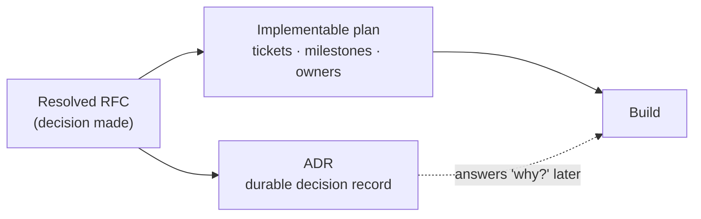
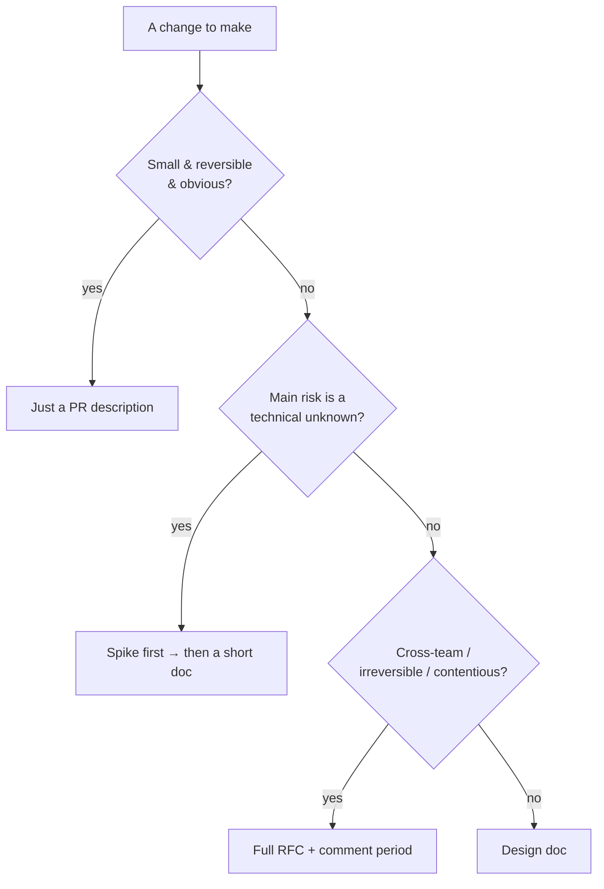
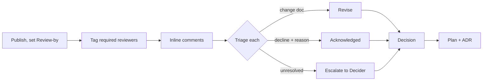

# Design Docs & RFCs — Middle

> **Category:** [Documentation](../README.md) — writing a short proposal *before* building, so the team can review the plan while it's still cheap to change.

> **Prerequisite:** [Junior](junior.md)
> **Focus:** **Why** and **When**

---

## Table of Contents

1. [Introduction](#introduction)
2. [When to Write a Doc — and When to Just Spike](#when-to-write-a-doc-and-when-to-just-spike)
3. [The RFC Lifecycle](#the-rfc-lifecycle)
4. [Running a Comment Period](#running-a-comment-period)
5. [The RFC Header / Status Block](#the-rfc-header-status-block)
6. [A Review-Comment Thread, Annotated](#a-review-comment-thread-annotated)
7. [Async Written Review vs Meeting-Driven Decisions](#async-written-review-vs-meeting-driven-decisions)
8. [Disagree and Commit](#disagree-and-commit)
9. [From Resolved Doc to Implementable Plan + ADR](#from-resolved-doc-to-implementable-plan--adr)
10. [Cross-Cutting Concerns Are Not Optional](#cross-cutting-concerns-are-not-optional)
11. [Trade-offs](#trade-offs)
12. [Edge Cases](#edge-cases)
13. [Tricky Points](#tricky-points)
14. [Best Practices](#best-practices)
15. [Test Yourself](#test-yourself)
16. [Summary](#summary)
17. [Diagrams](#diagrams)

---

## Introduction

> Focus: **Why** and **When**

At the junior level a design doc is a *document with sections you fill in*. At the middle level it's a **process you run** — you decide whether the change warrants a doc at all, you publish it, you drive a comment period to a decision, you handle disagreement, and you turn the resolved proposal into work plus a durable record.

The recurring judgement call is between **two failure modes**:

- **Under-process** — building straight from a hallway conversation; no shared plan, no review, mistakes surface in production.
- **Over-process** — an RFC with three reviewers and a two-week comment period for a one-day change; the process costs more than the decision it's protecting.

The middle skill is calibrating: *does this change deserve a doc, and how heavy a process?* — and then running that process well.

---

## When to Write a Doc — and When to Just Spike

A doc is justified when **the cost of getting the decision wrong exceeds the cost of writing and reviewing the doc.** That favors a doc when the work is large, irreversible, cross-team, or genuinely uncertain — and favors *skipping* it when the change is small, reversible, and obvious.

But there's a third option people forget: **the spike.** A *spike* is a quick, throwaway prototype you write to *answer a question* the doc can't answer from the armchair — "will this library even do what we need?", "is this query fast enough?". When the central risk is a *technical unknown*, a half-day spike often produces more certainty than a day of speculative writing.

| Situation | Best tool |
|---|---|
| Small, reversible, obvious change | No doc — PR description |
| Significant feature, design is the hard part | Design doc |
| Cross-team / irreversible / contentious | RFC with comment period |
| The risk is "does this even work?" | **Spike first**, then a short doc with the answer |
| You're stuck deciding between two libraries on paper | Spike both, then write the doc citing results |

> A spike and a doc aren't rivals — the best docs are often *informed by* a spike. Spike to remove the technical unknown; write to align people on the now-known approach.

The anti-pattern is writing a long doc that *guesses* at a technical answer you could have *measured* in an afternoon. If the doc's open questions are mostly "will X work?", stop writing and go find out.

---

## The RFC Lifecycle

An RFC is a design doc that moves through explicit **states**. The lifecycle is what turns "a doc someone wrote" into "a decision the org made."


- **Draft** — the author is still writing; not yet asking for broad review.
- **In Review** — published, comment period open, reviewers engaging.
- **Revising** — author incorporating feedback; may loop back to review.
- **Accepted / Rejected** — the decider (often a "shepherd") calls it.
- **Implemented** — the accepted design is built.
- **Superseded** — a later RFC replaces this decision (mirrors how ADRs supersede each other; see [05](../05-architecture-decision-records-adrs/)).

The states aren't bureaucracy for its own sake — they answer "is this still up for debate, or decided?" at a glance, which prevents the two classic confusions: building from a draft that's still changing, and re-debating something already accepted.

---

## Running a Comment Period

A comment period is a **time-boxed window** during which reviewers leave feedback. Running one well is a skill.

- **Time-box it.** "Comments open through Friday." An open-ended comment period never closes — people always have one more thought, and the proposal stalls forever. A deadline forces engagement.
- **Name the reviewers you *need*.** Tag the specific people whose sign-off matters (the team that owns the affected system, security, whoever's on the hook). "Anyone can comment" plus "these three must" is the right combination — broad input, clear required approvers.
- **Comment in context.** Inline comments on the specific line/section beat a wall of feedback in chat. The doc tool *is* the discussion surface.
- **Triage every comment.** The author owns responding to each: *accepted (changed the doc)*, *acknowledged but declined (with reason)*, or *deferred to an open question*. Silence on a comment reads as dismissal.
- **Escalate disagreement deliberately.** Most threads resolve in the doc. The few that don't go to the decider — they don't fester.

A healthy comment period feels like *many small resolved threads*, not one giant argument.

---

## The RFC Header / Status Block

Every RFC should open with a machine-and-human-readable status block, so anyone landing on it knows instantly *what state it's in and who owns it.* A common shape:

```markdown
---
RFC: 0042
Title: Migrate session storage from in-process to Redis
Author: B. Yashin Mansur
Status: In Review        # Draft | In Review | Accepted | Rejected | Superseded
Created: 2026-06-02
Review-by: 2026-06-13    # comment period closes
Decider: @platform-lead  # the shepherd who calls it
Reviewers: @security, @sre-oncall, @backend-leads
Supersedes: —
Superseded-by: —
Tracking-issue: PLAT-1187
---
```

The two fields people skip but shouldn't: **`Review-by`** (the time-box that makes the comment period actually close) and **`Decider`** (the single named person responsible for reaching a decision — diffused ownership is how RFCs die in limbo). `Supersedes` / `Superseded-by` mirror the ADR convention and keep the decision history navigable.

---

## A Review-Comment Thread, Annotated

The value of an RFC is realized in the comment threads. Here's a sketch of a healthy one, with the moves labeled:

```markdown
> ## Proposed Design
> We'll store sessions in Redis with a 24h TTL.

  💬 @security:  Are sessions encrypted at rest in Redis? PII in the
                 session payload would be a compliance issue.
      ↳ @author: Good catch — sessions hold an email. I'll add a
                 Non-Goal (we won't store PII in the session, only a
                 user-id) and a Cross-Cutting note. Updated §Privacy.   ✅ resolved

  💬 @sre-oncall: What's the failure mode if Redis is down? Right now an
                  in-process store means sessions survive a Redis outage.
      ↳ @author:  This is the real risk. Two options: (a) fail-closed
                  (users logged out on Redis outage), (b) fall back to
                  signed stateless cookies. Adding both to Alternatives.
      ↳ @sre:     (b) is much better for our SLO. Strong preference.
      ↳ @author:  Agreed, switching the proposal to (b).                ✅ resolved

  💬 @backend-lead: Why Redis and not Memcached? We already run Memcached.
      ↳ @author:    Memcached has no native TTL-with-touch + no
                    persistence option we may want later. Documented in
                    Alternatives §Memcached (rejected).                 ✅ resolved

  💬 @backend-lead: Nit: "24h TTL" — sliding or absolute?
      ↳ @author:    Sliding (refresh on activity). Clarified in §Design. ✅ resolved
```

Notice the patterns of a *good* thread:
- The reviewer asks a **specific, falsifiable question**, not "I don't like this."
- The author **either changes the doc or explains why not** — every comment lands somewhere.
- The hardest comment (`@sre`'s outage question) **changed the actual design** — proof the review caught a real risk *before* code. That single thread justified the whole RFC.
- The thread is marked **resolved**, so a later reader knows it's settled.

---

## Async Written Review vs Meeting-Driven Decisions

There are two ways to make a technical decision, and the RFC culture has a strong preference.

| | **Async written review (RFC)** | **Meeting-driven** |
|---|---|---|
| Where the thinking happens | In the doc, in writing | In the room, in real time |
| Who can participate | Anyone, on their own time, across time zones | Whoever's invited and free |
| Quality of reasoning | High — writing forces rigor | Variable — the loudest voice often wins |
| Record produced | The doc *is* the record | Notes (if you're lucky) |
| Speed for simple decisions | Slower | Faster |
| Speed for complex/contentious | **Faster** (parallel, no scheduling) | Slower (serial, hard to schedule) |

The RFC bias toward **async written review** isn't dogma — it's because writing forces the proposer to think clearly (the "writing is thinking" point from [Junior](junior.md)), it includes people a meeting would exclude, and it *produces its own record.* A meeting's decision evaporates unless someone writes it down; an RFC's decision *is* written down.

The pragmatic synthesis most teams land on: **async written review as the default; a short meeting to break a deadlock.** When two well-reasoned camps are stuck in the comment threads, a 30-minute call resolves it faster than another round of writing — *but the outcome goes back into the doc.* The meeting decides; the doc remembers.

---

## Disagree and Commit

Not every disagreement resolves into consensus, and waiting for unanimity is how proposals die. The norm that keeps things moving is **"disagree and commit"**: once the decider makes the call, *everyone* — including those who argued the other way — supports the decision and moves on.

This depends on a fair process: people accept a decision they disagree with *if* they believe their argument was genuinely heard and weighed. That's why the comment-triage discipline matters — a reviewer whose concern was thoughtfully declined (*with a reason*) will commit; a reviewer whose concern was ignored will resist. The decider's job is not to make everyone agree, but to make a *legitimate* call that the dissenters can live with.

> "Disagree and commit" is not "the loudest person wins." It's "we debated in good faith, a named decider chose, the reasoning is recorded, and now we all row in the same direction."

---

## From Resolved Doc to Implementable Plan + ADR

A resolved RFC isn't the finish line — it's the input to two outputs:

1. **An implementable plan.** Turn the agreed design into actual work: tickets, milestones, owners. The "Timeline" section grows teeth here. The doc described *what and why*; the plan is *who does what, in what order.*
2. **An ADR.** Record the *decision* — durably and concisely — so it outlives the doc. The RFC will go stale once the system is built; the ADR is the one-page, permanent answer to "why did we choose Redis with stateless-cookie fallback?" (See [ADRs](../05-architecture-decision-records-adrs/).)



This is the pipeline from [Junior](junior.md) made concrete: the design doc/RFC is where you *do the thinking and make the decision*; the ADR is where you *bank the decision*; the plan is how you *execute it.*

---

## Cross-Cutting Concerns Are Not Optional

The "Design" section is where authors want to live. The cross-cutting concerns are where reviews find the real problems — and where junior docs are thinnest. For any non-trivial design, address each explicitly (even if the answer is "N/A, because…"):

| Concern | The question review will ask |
|---|---|
| **Security** | New attack surface? Auth/authz changes? Secrets handled correctly? |
| **Privacy** | What PII flows through this? Where is it stored, for how long? |
| **Observability** | How will we know it's working? What metrics, logs, traces, alerts? |
| **Testing** | How is this tested? What's the hardest thing to test, and how? |
| **Rollout / Migration** | How do we ship safely — feature flag, phased rollout, data migration, rollback plan? |
| **Cost** | What does this cost to run? Storage, compute, third-party fees at scale? |

A doc that's all "Design" and no cross-cutting concerns hasn't been thought through — it's just described the happy path. The cross-cutting sections are where you prove you've considered the system in production, not the system in a demo.

---

## Trade-offs

| Decision | Lean toward a doc / RFC | Lean toward skipping (or a spike) |
|---|---|---|
| Cost now | Higher — writing + review time | Lower — start building immediately |
| Risk caught early | High — review surfaces it cheaply | Low — risk surfaces in production |
| Decision record | Yes — the doc/ADR | None (or tribal memory) |
| Best when | Large, irreversible, cross-team, contentious | Small, reversible, obvious, or a measurable unknown |
| Failure if misapplied | *Theater* — process for its own sake | *Cowboy* — building the wrong thing twice |

The asymmetry: skipping a doc that you needed costs a rewrite *plus* the lost review; writing a doc you didn't need costs an afternoon. For genuinely uncertain or irreversible work, the doc is cheap insurance. For obvious work, it's overhead. Calibrate honestly — and notice that most teams err toward *too little* process on big changes and *too much* on small ones simultaneously.

---

## Edge Cases

### 1. The doc nobody reads

You wrote a thorough doc, opened a comment period, and got crickets. This is **design-doc theater** — the form without the function. Causes: too long, no named required reviewers, no deadline, or the change was too small to care about. The fix isn't "write a better doc"; it's often "this didn't need a doc" or "I failed to recruit the reviewers who'd actually care."

### 2. The decision that needs to be fast

Sometimes you genuinely can't wait two weeks. Run a **compressed RFC**: a one-pager, a 48-hour comment window, a named decider, and an explicit note that it's expedited. The process scales down; don't abandon it entirely just because it's urgent — urgent decisions are exactly the ones that benefit from a quick second pair of eyes.

### 3. The doc that's been "In Review" for a month

A stalled RFC is usually a missing **decider** or a missing **deadline**. Assign one named person to call it and set a hard `Review-by` date. Limbo is the most common way RFCs fail — not rejection, but never-deciding.

---

## Tricky Points

- **A spike can replace a doc's *guess* with a *fact* — but it's not a substitute for alignment.** You still write the (now-short) doc to align people; the spike just makes its content true instead of speculative.
- **The comment period must close.** Without a `Review-by` date, "open for comments" becomes "open forever" and the proposal never ships.
- **"Disagree and commit" requires the disagreement to be *heard*.** Skip the comment-triage discipline and you don't get commitment — you get quiet sabotage.
- **The RFC is the record of the *debate*; the ADR is the record of the *decision*.** Don't conflate them — the RFC has all the back-and-forth; the ADR is the clean one-page conclusion.
- **Async-by-default doesn't mean meetings-never.** Use a meeting to *break a deadlock*, then put the outcome back in the doc. The meeting decides; the doc remembers.

---

## Best Practices

1. **Right-size before writing.** Ask: small/reversible (no doc), uncertain-technical (spike first), or significant/irreversible (full RFC)?
2. **Spike to answer technical unknowns** rather than guessing at them in prose.
3. **Open every RFC with a status block** including a named **Decider** and a hard **Review-by** date.
4. **Recruit the reviewers who'll actually care**, and tag required approvers explicitly.
5. **Triage every comment** — change the doc, decline with a reason, or move it to Open Questions. Never leave a comment dangling.
6. **Fill the cross-cutting sections** (security, privacy, observability, testing, rollout, cost) — that's where review earns its keep.
7. **End with a plan and an ADR.** Decision → tickets + a durable one-page record.

---

## Test Yourself

1. When should you write a spike instead of (or before) a design doc?
2. List the states of an RFC lifecycle and what each one signals.
3. Why must a comment period be time-boxed, and what two header fields make it work?
4. What does "disagree and commit" require to actually work?
5. What are the two outputs of a *resolved* RFC?
6. Why is async written review the RFC culture's default over meetings?

---

## Summary

- The middle skill is **calibrating process to risk** — no doc for small reversible work, a **spike** for technical unknowns, a full **RFC** for significant/irreversible/cross-team work — and then *running* that process.
- An RFC moves through a **lifecycle** (Draft → In Review → Revising → Accepted/Rejected → Implemented → Superseded); the states answer "still debated or decided?".
- A **comment period must be time-boxed** with a named **Decider** and **Review-by** date; the author **triages every comment**.
- **Async written review** is the default (it forces rigor, includes everyone, and self-documents); meetings break deadlocks, and the outcome goes back into the doc.
- **"Disagree and commit"** keeps decisions moving — but only if disagreement was genuinely *heard*.
- A resolved RFC produces an **implementable plan** and an **ADR**; the RFC records the *debate*, the ADR records the *decision*.
- **Cross-cutting concerns** (security, privacy, observability, testing, rollout, cost) are where review finds the real problems — never optional.

---

## Diagrams

### When to write what



### The comment period, resolved




---

## Check your understanding

1. Explain Design Docs & RFCs — Middle Level in your own words and name the problem it solves.
2. How would you apply the ideas around Table of Contents, Introduction, When to Write a Doc — and When to Just Spike in a realistic engineering change?
3. What failure mode or misuse should you look for, and what evidence would reveal it?
4. Which local design trade-off would make you choose or reject Design Docs & RFCs — Middle Level in an existing codebase?
5. What observable result would convince you that the approach improved the system?
