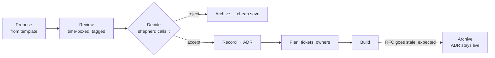
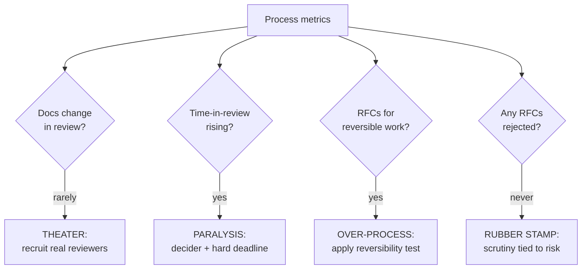

# Design Docs & RFCs — Professional

> **Category:** [Documentation](../README.md) — writing a short proposal *before* building, so the team can review the plan while it's still cheap to change.

> **Prerequisites:** [Junior](junior.md) · [Middle](middle.md) · [Senior](senior.md)
> **Focus:** **Production** — running the process at org scale, templates, metrics, incidents

---

## Introduction

> Focus: **production** — running the design-doc/RFC process across many teams over years.

A design doc is easy for one engineer to write. An *RFC process that hundreds of engineers actually use, that improves decisions, and that doesn't collapse into theater or bureaucracy* is an organizational system you have to design and maintain like any other.

At the professional level the question is operational: **how do you run a design-doc/RFC practice at org scale so that the right decisions get the right scrutiny, decisions actually get made, the durable knowledge survives, and engineers don't come to resent the process?** The answer is a system: a template that encodes the senior reasoning, tooling that keeps docs discoverable, metrics that detect when the process is degrading, a decider model that scales, and a disciplined pipeline from doc to ADR.

---

## Standing Up an RFC Process That Survives

Most internal RFC processes either never get adopted or calcify into bureaucracy. The ones that survive share a few design choices:

1. **Make the lightweight path genuinely lightweight.** If the *minimum* RFC is a 10-section template with three required approvers, people route around it. The minimum viable RFC should be a one-pager with one decider and a 3-day window. Heavy process is *opt-up* for one-way doors, not the default.
2. **One obvious home.** RFCs live in *one* place everyone knows (a `rfcs/` directory in a repo, or one wiki space) — not scattered across personal docs, Slack, and email. Discoverability is adoption.
3. **A template that's a checklist, not a chore.** Empty `## Non-Goals` and `## Alternatives Considered` headings do the teaching; people fill what's in front of them.
4. **A named owner for the process itself.** Someone owns "the RFC process" the way someone owns CI — keeps the template current, unblocks stalled RFCs, reports on health.
5. **Visible wins early.** The first few RFCs should be real decisions that visibly went better *because* of the process (a risk caught, a cross-team conflict resolved in writing). Adoption follows demonstrated value, not mandate.

> The failure mode of a new RFC process is not "too few rules" — it's "too much ceremony for the common case." Optimize the *default* path for speed; reserve weight for the one-way doors.

---

## The Org-Wide Template

A shared template encodes the senior reasoning so every author gets it approximately right and every reviewer cites a standard, not a preference. A production-grade template:

```markdown
---
RFC: <number>
Title: <imperative, specific>
Author: <name>
Status: Draft            # Draft | In Review | Accepted | Rejected | Superseded
Created: <date>
Review-by: <date>        # comment period closes — REQUIRED
Decider: <@handle>       # the single accountable shepherd — REQUIRED
Reviewers: <@required-approvers>
Supersedes / Superseded-by: <RFC #>
Tracking: <issue link>
---

# <Title>

## Context / Background
Why now? What problem, what prompted it. Written for a reader cold to it.

## Goals
- <measurable outcome>      # few and sharp; the design is held to these

## Non-Goals
- <deliberately out of scope>   # pre-answers "can it also...?"

## Proposed Design
Overview (2 sentences) → details: data model, APIs, key flows, a diagram.

## Alternatives Considered
### A. <chosen> — pros / honest cons
### B. <genuinely-tempting rejected> — specific, falsifiable why-rejected
### C. <rejected> — why

## Cross-Cutting Concerns
- Security:        <attack surface, authz>
- Privacy:         <PII, retention>
- Observability:   <metrics, logs, traces, alerts, SLOs>
- Testing:         <strategy, the hardest thing to test>
- Rollout/Migration: <flag, phases, data migration, ROLLBACK plan>
- Cost:            <run cost at expected + peak scale>

## Open Questions
- <unresolved; explicitly want input>

## Timeline
Rough phases / milestones.

## Decision
<filled at close: outcome + the reasoning. This becomes the ADR seed.>
```

The two most-skipped, most-enforced fields remain **`Review-by`** (makes the comment period close) and **`Decider`** (makes a decision possible). The `## Decision` block at the bottom is the *seed of the ADR* — the durable record is half-written by the time the RFC closes.

---

## Tooling and Where Docs Live

The "where" determines whether docs get reviewed and found later. Two viable models:

| Model | Mechanism | Strengths | Weaknesses |
|---|---|---|---|
| **Docs in the repo** (PR-based RFC) | RFC is a markdown file; review *is* a pull request | Versioned, diffable, lives next to code, inline comments, CI can lint it | Reviewers must use the repo; less friendly to non-engineers |
| **Shared doc tool** (Google Docs / Notion / Confluence) | RFC is a doc with inline comments | Easy for anyone to comment; rich formatting; familiar | Not versioned with code; drifts; weaker change history |

Many orgs use **the repo for engineering RFCs** (the diffable history and CI integration are worth it — this is the *docs-as-code* approach; see [Docs as Code & Tooling](../10-docs-as-code-and-tooling/)) and a doc tool for proposals that need broad non-engineer input.

Whichever you pick, automate what you can:
- **Lint the template** — CI rejects an RFC missing `Decider`, `Review-by`, Non-Goals, or Alternatives.
- **Diagrams as code** — embed Mermaid/PlantUML so diagrams are diffable and reviewable, not screenshots that rot (see [Diagrams as Code](../08-diagrams-as-code/)).
- **Status automation** — a bot that nudges stalled "In Review" RFCs past their `Review-by` date and pings the decider.
- **A discoverable index** — an auto-generated list of all RFCs with status, so the corpus is navigable.

---

## Metrics: Measuring a Healthy Process

You manage what you measure — and the wrong metric corrupts the process. Choose metrics that detect the [senior-level failure modes](senior.md) (theater, paralysis, over-process), not vanity counts.

| Metric | What it tells you | Watch for |
|---|---|---|
| **Time-in-review (median)** | Is the process timely? | Rising → paralysis; near-zero → rubber-stamping |
| **% of RFCs that change after first draft** | Is review *substantive*? | Near 0% → **theater** (nobody really reviewing) |
| **% rejected or significantly redirected** | Is "no" a real outcome? | 0% rejected → docs are sales pitches, not explorations |
| **RFCs stuck past `Review-by`** | Decider/ownership health | Any growing backlog → diffused ownership |
| **Comments per RFC from *required* reviewers** | Are the right people engaging? | Low → wrong reviewers, or theater |
| **RFC → ADR conversion** | Are decisions being banked durably? | Low → knowledge evaporating |
| **Incidents traceable to a skipped doc** | The ground truth | Each one → a one-way door that dodged process |

### The honest-measurement rules

- **A doc that never changes during review is the alarm, not the goal.** The most dangerous "green" metric is a fast, frictionless review where nothing ever changes — that's *theater*, and it produces the same outcome as having no process while costing more.
- **Never reward authors for RFC *count*.** Counting docs produced incentivizes docs for things that didn't need them (over-process) — the opposite of the goal. Reward decisions made well.
- **Zero rejections is a red flag, not a triumph.** If no RFC is ever rejected or substantially redirected, either the process is a rubber stamp or authors only propose pre-blessed ideas. A healthy process kills some proposals — cheaply, in review.
- **The real outcome metric is downstream:** are major decisions sound, made on time, and traceable later? An RFC process that prevents wrong builds and leaves an ADR trail is working, regardless of throughput.

---

## Scaling the Decider Role

A single shepherd per RFC works until volume outgrows any one person. At scale, the decider model itself has to scale:

- **Delegate by domain.** Map decision areas to owners — the storage team decides storage RFCs, the API council decides public-API RFCs. The author knows who their decider is *before* writing.
- **A tech-leads / architecture group for cross-cutting RFCs.** Decisions that span domains go to a small standing group with a chair who breaks ties. (Beware turning this into a slow, gatekeeping "architecture board" — it must *enable* decisions, not bottleneck them.)
- **Default-decider rules to prevent limbo.** "If no decider is named within 2 days, the author's manager is the decider." Removes the most common stall cause.
- **Escalation path, not escalation default.** Most RFCs decided at team level; only genuine cross-team conflicts escalate. If everything escalates, you've recentralized and recreated the bottleneck.

> The decider model scales by *distributing* decision authority to domain owners, not by funneling everything through one architecture board. Centralized deciding is how RFC processes become the bureaucracy engineers route around.

---

## The Doc/RFC/ADR Pipeline in Production

In production, the pipeline must run reliably, or the durable knowledge leaks. The discipline:

```text
1. PROPOSE   author writes RFC from the template (Draft)
2. REVIEW    publish, tag required reviewers, time-boxed comment period
3. DECIDE    shepherd synthesizes, calls it, fills the ## Decision block
4. RECORD    the Decision block becomes an ADR (durable, one page)
5. PLAN      accepted design → tickets, milestones, owners
6. BUILD     implement; the RFC now begins to go stale (expected)
7. ARCHIVE   mark RFC Implemented/Superseded; ADR remains the live record
```

The load-bearing step teams skip is **(4) RECORD**. An accepted RFC with no ADR means that two years on, when the RFC has gone stale and half the authors have left, the *why* is gone. The ADR is the durable distillate; the RFC is the (perishable) full discussion. (See [ADRs](../05-architecture-decision-records-adrs/).)

A production refinement: **bake ADR creation into the RFC close.** When the shepherd marks an RFC Accepted, the template's `## Decision` block *is* the ADR draft — copy it into the ADR log, link both ways, done. Don't leave it as a "someone should write an ADR" todo that never happens.

---

## Real Incidents

### Incident 1: The schema decided in a stand-up
A team chose an event schema in a 15-minute stand-up — "we'll just nest the payload, ship it." No doc, no review. Six months and three consuming teams later, a required field couldn't be added without a breaking change, and the nested shape made versioning brutal. The migration touched four services and took a quarter. **Postmortem:** an event schema is a *one-way door* — exactly the decision an RFC exists to catch. A 30-minute review would have surfaced the versioning problem for the price of a comment. **Lesson:** match process to *reversibility*, not to how quick the decision *feels.*

### Incident 2: Death by comment period
An RFC for a new internal platform sat "In Review" for seven weeks. Every round of comments spawned new alternatives; the author kept expanding the doc; no one was empowered to call it. Three engineers were effectively blocked the whole time. **Postmortem:** no named decider and no `Review-by` date — textbook analysis paralysis. **Fix:** assigned a decider, set a hard 3-day final window, shipped a decision. **Lesson:** a comment period without a deadline and a decider is a black hole. Time-box and name the shepherd.

### Incident 3: The strawman alternatives
A staff engineer's RFC proposed a custom framework; the Alternatives section listed three off-the-shelf options, each dismissed in one line ("too heavy", "not flexible", "wrong language"). It was approved — the seniority lent it weight. The framework took two quarters, then was abandoned for one of the "dismissed" off-the-shelf options, which fit fine. **Postmortem:** decision-laundering — the alternatives were strawmen, and rank substituted for scrutiny. **Lesson:** review bar scales with *reversibility, not seniority*; a senior reviewer should have rejected the doc for un-serious alternatives.

### Incident 4: The doc treated as living truth
A new hire found a two-year-old design doc in the wiki and built a new feature against its described architecture — which had been substantially rebuilt a year prior. The doc had no date or status. Days of work targeted a system that no longer existed. **Postmortem:** a design doc was mistaken for a reference doc. **Lesson:** design docs are *point-in-time*; date and status them, route current truth to reference docs and ADRs, and *expect* design docs to go stale (see [Keeping Docs Alive & Doc Rot](../11-keeping-docs-alive-and-doc-rot/)).

---

## The Politics of Process

Running the process well is partly a social problem:

- **Process is easy to over-sell and over-impose.** A leader who mandates RFCs for everything gets malicious compliance — docs written to satisfy the rule, not to think. Sell the *value* (better decisions, fewer wrong builds), apply it to one-way doors, and let demonstrated wins drive adoption.
- **Rejecting an RFC must be safe and normal.** If "your RFC was rejected" is a black mark, authors stop surfacing risky-but-honest proposals and only float safe ones. Frame early rejection as the process *working* — a wrong build prevented cheaply.
- **Senior authors get *more* scrutiny, not less.** The instinct to wave through a staff engineer's doc is exactly how senior mistakes become incidents (Incident 3). Tie scrutiny to reversibility; protect reviewers who challenge senior authors.
- **The process owner must defend the lightweight path.** There's constant pressure to add "just one more required section/approver." Each addition taxes every future RFC. Guard the default path's lightness as fiercely as you guard the one-way-door rigor.

---

## Review Checklist

```text
DESIGN-DOC / RFC REVIEW CHECKLIST
[ ] CONTEXT — could a cold reader understand the problem and why now?
[ ] SCOPE   — Goals measurable & few; Non-Goals fence off scope creep
[ ] DESIGN  — overview then detail; a diagram for any non-trivial flow
[ ] ALTERNATIVES — ≥1 GENUINELY-tempting option, falsifiable why-rejected
[ ] ALTERNATIVES — chosen option's cons stated honestly (not a sales pitch)
[ ] CROSS-CUTTING — security · privacy · observability · testing · rollback · cost
[ ] OPEN QUESTIONS — honest uncertainties surfaced, not hidden
[ ] REVERSIBILITY — one-way door? → this scrutiny is warranted; two-way? → lighten up
[ ] PROCESS — named Decider + hard Review-by date present
[ ] REQUIRED REVIEWERS — the teams that own affected systems are tagged
[ ] DECISION → ADR — the close will produce a durable ADR, not just an approval
[ ] POINT-IN-TIME — doc is dated/status'd; not mistaken for a living reference
```

---

## Cheat Sheet

```text
RUN THE PROCESS   lightweight DEFAULT path (1 pager, 1 decider, 3 days);
                  heavy process is OPT-UP for one-way doors only

TEMPLATE          enforce Decider + Review-by (CI lint); empty Non-Goals &
                  Alternatives headings teach by being there

WHERE DOCS LIVE   ONE home; repo (diffable, CI-linted, docs-as-code) for
                  eng RFCs; doc tool for broad non-eng input

METRICS           % of RFCs that CHANGE in review (low = theater) ·
                  time-in-review (high = paralysis) · % rejected (0% = rubber
                  stamp) · RFC→ADR conversion · NOT raw RFC count

DECIDER           distribute by domain; default-decider rule kills limbo;
                  escalation is a PATH, not the default

PIPELINE          propose → review → DECIDE → RECORD(ADR) → plan → build →
                  archive.  Don't skip RECORD — bank the 'why' in an ADR.

INCIDENTS         schema in a stand-up (one-way door, no process) ·
                  7-week comment period (no decider/deadline) ·
                  strawman alternatives (rank > scrutiny) ·
                  stale doc as truth (point-in-time mistaken for reference)
```

---

## Diagrams

### The production pipeline



### Detecting a degrading process



---

## Related Topics

- **Durable output:** [Architecture Decision Records (ADRs)](../05-architecture-decision-records-adrs/)
- **Tooling / docs-as-code:** [Docs as Code & Tooling](../10-docs-as-code-and-tooling/)
- **Diagrams in docs:** [Diagrams as Code](../08-diagrams-as-code/)
- **Not a living reference:** [Keeping Docs Alive & Doc Rot](../11-keeping-docs-alive-and-doc-rot/)

---


---

## Check your understanding

1. Explain Design Docs & RFCs — Professional Level in your own words and name the problem it solves.
2. How would you apply the ideas around Table of Contents, Introduction, Standing Up an RFC Process That Survives in a realistic engineering change?
3. What failure mode or misuse should you look for, and what evidence would reveal it?
4. How would you introduce and govern Design Docs & RFCs — Professional Level across teams through reversible, measurable increments?
5. What observable result would convince you that the approach improved the system?
