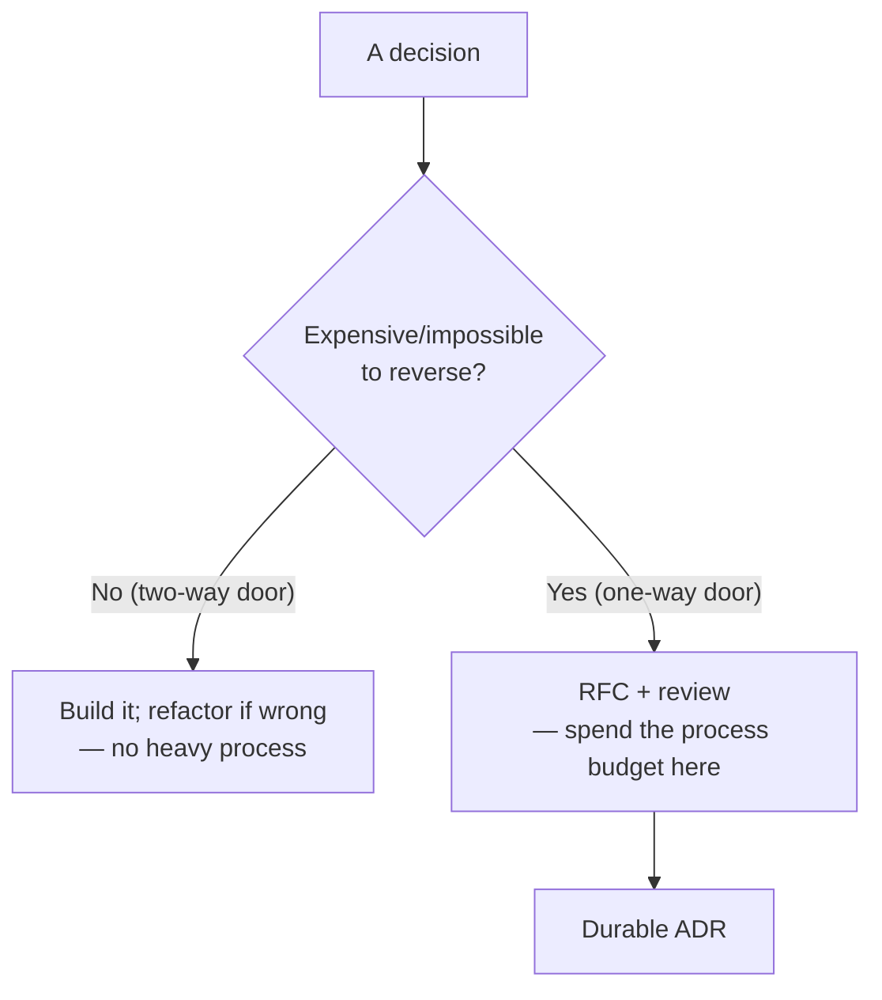
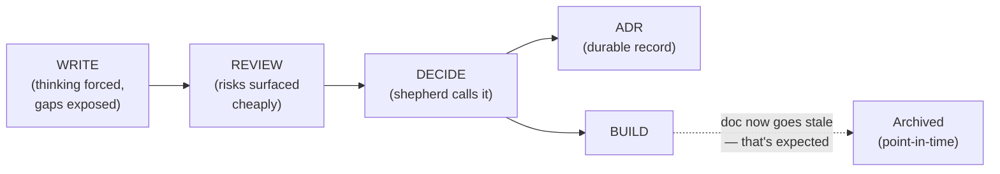

# Design Docs & RFCs — Senior

> **Category:** [Documentation](../README.md) — writing a short proposal *before* building, so the team can review the plan while it's still cheap to change.

> **Prerequisites:** [Junior](junior.md) · [Middle](middle.md)
> **Focus:** **Design trade-offs** and **system-level reasoning**

---

## Table of Contents

1. [Introduction](#introduction)
2. [The Doc as a Decision-Forcing Function](#the-doc-as-a-decision-forcing-function)
3. [The Reversibility Lens: Which Decisions Deserve a Doc](#the-reversibility-lens-which-decisions-deserve-a-doc)
4. [Designing the Alternatives Section as the Real Work](#designing-the-alternatives-section-as-the-real-work)
5. [Goals/Non-Goals as a Scope Contract](#goalsnon-goals-as-a-scope-contract)
6. [Design Review as a Culture](#design-review-as-a-culture)
7. [The Shepherd / Decider Role](#the-shepherd--decider-role)
8. [The Doc Is a Point-in-Time Artifact](#the-doc-is-a-point-in-time-artifact)
9. [Failure Modes: Theater, Paralysis, Over-Process](#failure-modes-theater-paralysis-over-process)
10. [Liabilities](#liabilities)
11. [Pros & Cons at the System Level](#pros--cons-at-the-system-level)
12. [Diagrams](#diagrams)
13. [Related Topics](#related-topics)

---

## Introduction

> Focus: **design trade-offs** and **system-level reasoning**

At the senior level, design docs and RFCs stop being "a document I fill in" and become a **lever on how an organization makes technical decisions.** The questions shift from *what sections does a doc have?* to:

1. **Which decisions are worth the process, and which are killed by it?** (Reversibility, again, is the dividing line.)
2. **How do I make the Alternatives section do the heavy lifting** — so the doc *forces* a good decision rather than rationalizing a predetermined one?
3. **How does design review become a healthy culture** rather than a gate that breeds theater, paralysis, or rubber-stamping?

The throughline: a design doc's value is overwhelmingly *front-loaded* — in the thinking it forces and the review it enables, *before* the build. A senior optimizes for that front-loaded value and refuses to pay for process that doesn't deliver it.

---

## The Doc as a Decision-Forcing Function

The most important reframing a senior makes: **a design doc is not documentation — it's a decision-forcing function.** Its primary product is a *better decision, made earlier, with the risks surfaced.* The artifact is a byproduct.

This reframing has sharp consequences:

- **A doc that doesn't change anyone's mind — including the author's — was probably unnecessary or written too late.** If you wrote it *after* deciding, to justify a choice already made, you got the artifact but skipped the function. The doc's job is to be the place where the decision is *made*, not announced.
- **The best outcome of a review is sometimes "don't build this."** A doc that gets rejected early saved an entire project. Counting only "approved" docs as successes inverts the incentive — a culture where rejection feels like failure produces docs engineered to be approved, not docs that surface inconvenient risks.
- **The author should be genuinely uncertain about at least one thing.** A doc with no Open Questions and a perfectly clean Alternatives section (every rejected option laughably bad) is usually a *sales pitch*, not a design exploration. Real design has real tensions; a doc that hides them isn't forcing a decision, it's manufacturing consent.

> Optimize the doc for the *quality of the decision and the risks surfaced*, not for the polish of the artifact or the speed of approval.

---

## The Reversibility Lens: Which Decisions Deserve a Doc

Not every decision earns a doc. The senior heuristic is the same one that governs architecture generally: **reversibility.** Jeff Bezos' framing of *one-way doors* (irreversible) vs *two-way doors* (reversible) maps directly onto process weight.

| Decision | Reversibility | Process |
|---|---|---|
| Internal class/module structure | Cheap (refactor) | None — just build it |
| A library choice isolated behind an interface | Cheap–medium | Short doc or none |
| Public/published API contract | Expensive (clients break) | RFC |
| Database schema / storage format | Expensive (migration) | RFC |
| Wire protocol / event schema | Expensive (version skew) | RFC |
| Data retention / privacy model | Very expensive (legal, re-processing) | RFC + security/privacy review |
| Org-wide standard or platform | Very expensive (everyone adopts) | Heavyweight RFC, broad review |

The discipline cuts both ways:

- **Applying heavy process to a two-way door is waste.** Requiring an RFC to rename an internal method is the bureaucracy that makes engineers hate process — and they're right to. Reversible decisions should be made by building, then refactoring if wrong.
- **Skipping process on a one-way door is the costly mistake.** Choosing an event schema in a hallway, or a data-retention model in a stand-up, is how teams get locked into decisions that take a multi-quarter migration to undo.

> Spend your process budget on the one-way doors. The art of a senior is recognizing which doors are which *before* walking through them.

---

## Designing the Alternatives Section as the Real Work

[Junior](junior.md) established that Alternatives Considered is the highest-value section. The senior skill is *making it real* — because the Alternatives section is where docs most often lie.

The failure pattern: an author has already decided on Option A, then writes the Alternatives section with three strawmen (B, C, D) so obviously bad that A is the only choice. This is **decision-laundering** — using the doc's credibility to bless a predetermined answer. A reader can smell it: the rejected options are never the ones a smart skeptic would actually propose.

A *real* Alternatives section has these properties:

- **At least one rejected option is genuinely tempting.** If none of the alternatives was ever seriously attractive, you didn't explore the space — or you're hiding the one that was.
- **The rejection reasons are specific and falsifiable**, not dismissive. "Kafka: rejected, too complex" is a strawman. "Kafka: rejected — our event volume (≈200/s peak) doesn't justify the operational cost of running a broker; SQS meets the durability bar at a fraction of the ops load" is a real comparison a reviewer can *challenge*.
- **The chosen option's cons are stated honestly.** Every choice has a downside. A doc that lists only the chosen option's upsides has stopped being a design exploration.
- **The reader could disagree and pick a different option.** That's the test: if the alternatives are presented so that only one conclusion is possible, you've written a justification, not an analysis.

```markdown
## Alternatives Considered

### A. SQS + Lambda (chosen)
+ Fully managed; no broker to operate; scales to our spiky load.
+ Native DLQ + retry; matches our existing ops model.
– At-least-once delivery → consumers MUST be idempotent (real cost, see §Design).
– Ordering not guaranteed without FIFO queues (we don't need ordering here).

### B. Kafka (rejected, but genuinely considered)
+ Strong ordering, replay, high throughput — the "right" tool at large scale.
– Our peak is ≈200 msg/s; Kafka's operational burden (brokers, ZK/KRaft,
  rebalancing) is unjustified at this volume.
Rejected: cost/ops outweighs benefit *at our scale*. Re-evaluate if volume
grows ~50×.

### C. Synchronous call, no queue (rejected)
+ Simplest; no new infra.
– Couples producer's latency/availability to consumer's. Defeats the whole
  point (decoupling the slow downstream job).
Rejected: doesn't meet the decoupling goal.
```

Notice B is a *real* contender rejected on a *specific, scale-dependent* reason with a re-evaluation trigger — and A's idempotency cost is stated plainly. That's a section that *forces* a decision instead of laundering one.

---

## Goals/Non-Goals as a Scope Contract

At the senior level, Goals/Non-Goals function as a **scope contract** between the author and every stakeholder. Treat them as such:

- **Goals should be measurable and few.** Three sharp goals beat ten vague ones. "Reduce checkout p99 latency from 1.2s to under 400ms" is a goal you can hold the design accountable to. "Improve performance" is a wish.
- **Non-Goals are where you win the scope argument *before* it happens.** Every Non-Goal is a future "can it also…?" pre-answered. The senior move is to anticipate the scope-creep requests and fence them off explicitly: *"Multi-region failover is a Non-Goal for v1; the design must not preclude it, but we will not build it now."* That sentence does enormous work — it sets the boundary *and* protects the future.
- **A Non-Goal that constrains the design is the most valuable kind.** "We will not store PII in this service" isn't just scope — it's a constraint that shapes every subsequent decision and a check reviewers can apply throughout the doc.

> The Goals/Non-Goals section is the doc's *thesis*. If a reviewer disagrees with it, there's no point reviewing the Design — you've misaligned on the problem, and the rest is moot. Get explicit agreement on this section *first.*

---

## Design Review as a Culture

A design doc only delivers value if the org has a *culture* of reviewing them well — the same way code review or [pair and mob programming](../../craftsmanship-disciplines/) only work as cultural practices, not mandates. The senior shapes that culture:

- **Reviewing a design doc is high-leverage work, and the org must treat it as such.** An hour spent reviewing a doc that prevents a wrong month-long build is the highest-ROI hour an engineer can spend — yet review is often unrewarded "extra" work squeezed between "real" tasks. Seniors make design review a *valued, expected* activity, not a favor.
- **Psychological safety is the precondition.** A doc surfaces the author's uncertainty in public. If proposing an idea that gets rejected is career-damaging, people stop proposing — or only propose safe, pre-blessed ideas. The culture must make "this design has a fatal flaw" a *gift to the author*, not an attack.
- **Critique the design, not the designer.** "This approach doesn't handle the outage case" is review. "You always forget failure modes" is not. Seniors model and enforce this distinction relentlessly.
- **The review bar scales with reversibility, not with seniority.** A staff engineer's RFC for a schema change gets *more* scrutiny than a junior's reversible internal refactor, not less. Tying scrutiny to rank instead of risk is how senior mistakes become production incidents.

Design review as a culture is what separates orgs where docs *improve* decisions from orgs where docs are theater everyone performs and no one reads.

---

## The Shepherd / Decider Role

Every non-trivial RFC needs a single named **shepherd** (a term from the IETF and Rust processes) — sometimes split into a *shepherd* (drives the process) and a *decider* (makes the call), often the same person. The role exists because **diffused ownership is the #1 cause of RFC death.** A doc with "the team will decide" decides nothing.

The shepherd's job:

- **Keep it moving.** Enforce the comment-period deadline; chase the required reviewers; prevent the doc from rotting in "In Review" limbo.
- **Synthesize, don't just tally.** Reviews aren't votes. The shepherd weighs the *arguments* — a single well-reasoned objection from the team that owns the affected system outweighs five "+1, looks good" comments.
- **Make the call and own it.** When the comment threads have resolved what they can, the shepherd decides — Accept, Reject, or "needs another round" — and records the reasoning. The decision is *legitimate* because it followed a fair process, not because everyone agreed.
- **Be the addressee of "disagree and commit."** Dissenters commit to the *shepherd's* call. That only works if the shepherd is a real, named, accountable person who demonstrably heard the dissent.

> A decision without a decider isn't a decision — it's a hope. Name the shepherd in the header, and hold them accountable for *reaching* a decision, not for reaching the *popular* one.

---

## The Doc Is a Point-in-Time Artifact

This is the senior insight that prevents the most common long-term failure: **a design doc captures a plan and a discussion at one moment; it is not a living reference.**

Once the system is built, reality diverges from the doc immediately — the implementation differs in a dozen small ways, requirements shift, the design evolves. Trying to keep the design doc *eternally accurate* is a losing battle and a category error. The doc's job was to *get you to a good decision*; that job is done when the build starts.

The senior consequence — **route durable facts to the right home:**

| What | Where it belongs | Why |
|---|---|---|
| "Why did we choose this?" | **ADR** ([05](../05-architecture-decision-records-adrs/)) | Durable, concise, deliberately kept current via supersession |
| "How does the system work *now*?" | **Reference docs / READMEs** | Maintained alongside the code |
| "What was the plan and debate?" | The design doc (archived) | A point-in-time record — *expected* to go stale |

> Don't fight doc rot on a design doc — *expect* it. The anti-pattern is treating the design doc as the living source of truth for how the system works; that's what reference docs and ADRs are for (see [Keeping Docs Alive & Doc Rot](../11-keeping-docs-alive-and-doc-rot/)). Mark the doc with a date and a status; when it's built, let it become history.

This is why the **doc → review → ADR pipeline** matters so much: the ADR is the *durable* output that survives after the design doc has served its (point-in-time) purpose.

---

## Failure Modes: Theater, Paralysis, Over-Process

Three ways a healthy design-doc practice degrades, and the senior's counter to each:

### Design-doc theater
Docs are written and "reviewed" but nobody engages substantively — comments are "+1" and rubber stamps. The *form* of review without the *function.* **Tell:** docs are never rejected and rarely change after the first draft. **Counter:** recruit reviewers who actually own the affected systems; reward substantive review; measure whether docs *change* during review (a doc that never changes wasn't really reviewed).

### Analysis paralysis
The doc becomes the project. Endless comment rounds, ever-growing alternatives, the build never starts. **Tell:** an RFC that's been "In Review" for a month. **Counter:** hard `Review-by` dates, a decider empowered to call it, and — when the blocker is a technical unknown — *stop writing and spike* (see [Middle](middle.md)).

### Over-process on reversible work
RFCs required for two-way doors. The bureaucracy that teaches engineers to resent process. **Tell:** docs for internal refactors, config renames, obviously-reversible choices. **Counter:** the reversibility test — only one-way doors get the heavy process; reversible decisions are made by building.

The meta-failure underneath all three: **mistaking the artifact for the value.** The value is the *decision and the surfaced risk*. When a team optimizes for producing docs rather than for making good decisions cheaply, every one of these failure modes follows.

---

## Liabilities

### Liability 1: Decision-laundering
The Alternatives section used to bless a predetermined choice via strawmen. Erodes trust in the whole process — once reviewers learn the alternatives are theater, they stop reviewing seriously. **Mitigate:** demand genuinely-considered alternatives with falsifiable rejection reasons; a senior reviewer should reject a doc whose alternatives are obvious strawmen.

### Liability 2: The doc as a procrastination device
Writing and polishing a doc *feels* like progress while deferring the harder work of building or, worse, deferring a decision. **Mitigate:** time-box; remember the doc is a means to a decision, not the end.

### Liability 3: Stale docs masquerading as truth
A two-year-old design doc found in a wiki, taken as the current architecture, leads someone badly astray. **Mitigate:** date and status every doc; route durable facts to ADRs and reference docs; *expect* design docs to go stale and treat them as history.

### Liability 4: Process that excludes the people it should include
A "broad comment period" that the actual affected team never saw — the security or SRE owner finds out after it shipped. **Mitigate:** explicitly identify and tag *required* approvers, not just "anyone may comment."

---

## Pros & Cons at the System Level

| Dimension | Design Docs / RFCs | No formal process (build-first) |
|---|---|---|
| Cost of a wrong major decision | Low — caught in review, cheaply | High — caught in production, expensively |
| Cost on reversible/trivial work | **High if misapplied** (theater, paralysis) | Low — just build and refactor |
| Quality of reasoning | High — writing forces rigor | Variable |
| Inclusion of stakeholders | High — async, broad | Low — whoever's in the room |
| Decision record | Yes (doc + ADR) | Tribal memory |
| Speed for small decisions | Slower | Faster |
| Speed for complex/contentious | Faster (parallel async) | Slower (re-litigated forever) |
| Dependence on review culture | Total — degrades to theater without it | N/A |

The system-level stance: design docs/RFCs win decisively *for irreversible, high-stakes, cross-team decisions in an org with a healthy review culture* — which is exactly where wrong decisions are most expensive. They **lose** when misapplied to reversible/trivial work (over-process) or when the review culture is absent (theater). The senior's job is to aim the process at the one-way doors and to cultivate the review culture that makes it real.

---

## Diagrams

### Reversibility decides the process weight



### Front-loaded value of a design doc



---

## Related Topics

- **Durable output:** [Architecture Decision Records (ADRs)](../05-architecture-decision-records-adrs/)
- **Foundation:** [Why & What to Document](../01-why-and-what-to-document/)
- **Leans on:** [Diagrams as Code](../08-diagrams-as-code/)
- **Contrast (not a living reference):** [Keeping Docs Alive & Doc Rot](../11-keeping-docs-alive-and-doc-rot/)
- **Review as culture:** [Craftsmanship Disciplines](../../craftsmanship-disciplines/)

---


---

## Check your understanding

1. Explain Design Docs & RFCs — Senior Level in your own words and name the problem it solves.
2. How would you apply the ideas around Table of Contents, Introduction, The Doc as a Decision-Forcing Function in a realistic engineering change?
3. What failure mode or misuse should you look for, and what evidence would reveal it?
4. How would you validate a system-level decision about Design Docs & RFCs — Senior Level under uncertainty?
5. What observable result would convince you that the approach improved the system?
