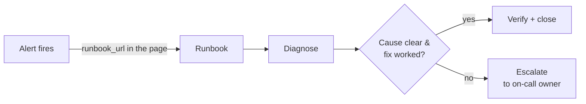
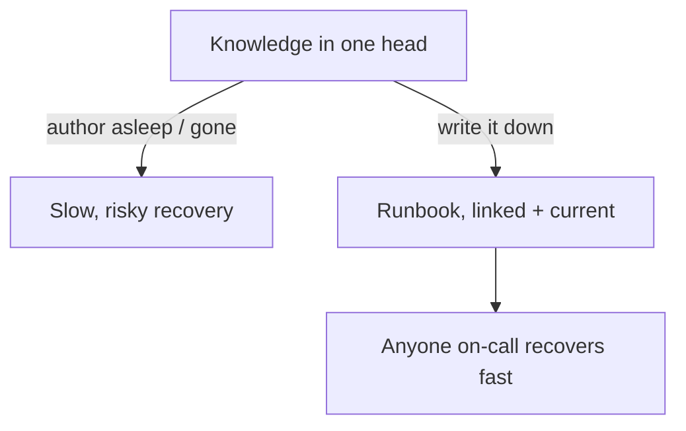

# Runbooks & Operational Docs — Junior

> **Category:** [Documentation](../README.md) — the operational knowledge that keeps a running system healthy and recoverable, written for the on-call engineer at 3 a.m.

---

## Introduction

> Focus: **What is it?** and **How to use it?**

A **runbook** is a written procedure that tells an engineer exactly how to handle a specific operational situation — a database that's filling up, an alert that just fired, a certificate that needs rotating. It is the difference between an outage that ends in fifteen minutes and one that ends in two hours because the only person who understood the system was asleep.

> An **operational doc** is documentation written for the *operator* of a running system — the person keeping it healthy in production — as opposed to the *developer* building it or the *user* consuming it.

Most documentation you've met so far (READMEs, API docs, design docs) is read by someone calm, at a desk, deciding what to build. Operational docs are read by someone *under stress*, often at night, with users affected and a clock running. That single fact — **the reader is stressed and the cost of a mistake is high** — shapes everything about how operational docs are written: they are terse, concrete, copy-pasteable, and ruthlessly free of "it depends."

### Why this matters

When a system breaks at 3 a.m., the person paged is often *not* the person who built it. Maybe the author is on vacation, has left the company, or is simply not on call this week. Without a runbook, that engineer must reverse-engineer the system mid-incident — slow, error-prone, and stressful. With a good runbook, they follow steps and resolve the page. Operational docs:

- **Reduce MTTR** (Mean Time To Recovery) — incidents end faster when the fix is written down.
- **Spread knowledge** beyond the original author, so the system doesn't depend on one person's memory.
- **Prevent heroics and reduce the bus factor** — "only Sara knows how to fail over the database" is an organizational risk; a runbook removes it.

---

## Prerequisites

- **Required:** You've deployed code to a real environment and seen something go wrong in production.
- **Required:** Basic command line — you can read and run shell commands (`ssh`, `df`, `kubectl`, `grep`, log queries).
- **Helpful:** Exposure to **monitoring/alerting** — knowing what an "alert" or a "page" is (covered conceptually here; the discipline itself belongs to SRE/observability).
- **Helpful:** [Why & What to Document](../01-why-and-what-to-document/) — operational docs are one band of the documentation spectrum.

---

## Glossary

| Term | Definition |
|------|-----------|
| **Runbook** | A step-by-step procedure for a specific operational task or alert: diagnose, remediate, verify. |
| **Playbook** | A doc for responding to an *incident* (outage), covering process and roles, not just a single fix. (Terms are often blurred — see [the distinction](#runbook-vs-playbook).) |
| **On-call** | The engineer currently responsible for responding to alerts, usually on a rotation. |
| **Alert / Page** | An automated notification that something crossed a threshold and a human must look. A *page* is an urgent alert that wakes someone. |
| **Incident** | An unplanned disruption or degradation of a service that needs a response. |
| **MTTR** | Mean Time To Recovery — average time from an incident starting to being resolved. Runbooks aim to lower it. |
| **Escalation** | Handing a problem to someone with more context or authority when you can't resolve it. |
| **Rollback** | Reverting a change (usually a deploy) to a previous known-good state. |
| **Postmortem** | A blameless written analysis after an incident: what happened, why, and what to fix. |
| **Bus factor** | How many people would have to be "hit by a bus" before the team loses critical knowledge. Runbooks raise it. |

---

## The 3 a.m. Test

The single most useful idea in this whole topic is one question you ask of every operational doc:

> **The 3 a.m. test:** Could a tired on-call engineer who *did not build this system* follow this document, at 3 a.m., and resolve the page — without calling anyone?

If the answer is no, the doc isn't done. The 3 a.m. test rejects everything that assumes context the reader doesn't have:

- "Restart the service" → *Which command? On which host? How do I know which host?*
- "Check the usual logs" → *Where are they? What am I looking for?*
- "Scale up if needed" → *How? What's the command? How do I know it's needed?*
- "Contact the team" → *Which team? What's the channel? Who's the escalation?*

A doc passes the 3 a.m. test when every step is **concrete, self-contained, and copy-pasteable**. The reader should never have to *think* about anything except whether the symptom matches — the commands should be literally runnable.

---

## What an Operational Doc Is For

Operational docs answer questions the running system raises, not the codebase:

| Question | Operational doc that answers it |
|---|---|
| "This alert fired — what do I do?" | The **runbook** linked from the alert |
| "The whole service is down — how do we respond?" | The **incident playbook** + incident process doc |
| "How do I deploy / roll back / rotate a cert?" | A **task runbook** |
| "Who do I escalate to, and how?" | The **escalation / on-call handbook** |
| "We lost the primary database — how do we recover?" | The **disaster-recovery / backup-restore** procedure |
| "What does this incident teach us?" | The **postmortem** |

The common thread: these are read *while operating*, often urgently. They are not "nice to have someday" docs — they are the safety equipment you only need when something is already on fire, which is exactly when you cannot afford for them to be missing or wrong.

---

## Runbook vs. Playbook

These two words are used loosely in the industry, but the useful distinction is about **routine task vs. incident response**:

| | **Runbook** | **(Incident) Playbook** |
|---|---|---|
| Answers | "How do I do this *one task* / handle this *one alert*?" | "How do we *respond to an outage*?" |
| Scope | A single procedure | A whole incident: process, roles, comms |
| Example | "Rotate the TLS certificate"; "High API latency alert" | "Payments outage response"; "Region-down response" |
| Read when | Doing routine ops, or a single alert fires | A real incident is declared |
| Contains | Diagnosis + exact remediation steps | Roles, severity, comms plan, *links to relevant runbooks* |
| Tone | A recipe | A coordination plan |

A useful way to remember it: a **runbook tells one person how to fix one thing**; a **playbook tells a group of people how to coordinate during a crisis** (and the playbook usually *points to* runbooks for the actual fixes). A deploy procedure is a runbook. "What we do when the checkout service is fully down" is a playbook. Don't agonize over the label — but do know that the routine-task doc and the crisis-coordination doc are different artifacts with different readers.

---

## Anatomy of a Runbook

A good per-alert or per-task runbook has a predictable skeleton, so a stressed reader knows exactly where to look. The order matters: **identify, then diagnose, then fix, then verify, then escalate.**

| Section | What it contains | Why it's there |
|---|---|---|
| **Title / Alert name** | Matches the alert exactly | So the reader knows they're in the right doc |
| **Symptom / Trigger** | What fires this runbook (the alert condition, or the user-visible symptom) | Confirm you're in the right place |
| **Severity & Impact** | How bad is it? Who/what is affected? | Tells the reader how urgently to act and whether to escalate |
| **Diagnosis** | Steps to confirm the cause — exact commands and what their output means | The reader must *understand* before acting |
| **Remediation** | The fix — exact, copy-pasteable commands, in order | The point of the runbook |
| **Verification** | How to confirm the fix worked | So the reader doesn't walk away from a half-fixed system |
| **Rollback** | How to undo the remediation if it makes things worse | Safety net |
| **Escalation** | Who to call, when, and how, if the steps don't work | So a stuck reader isn't stranded |
| **Links** | Dashboards, log queries, related runbooks, the service's design doc | Fast access to context without searching |

Two rules a junior should internalize:

1. **Every command is copy-pasteable and complete.** Not `restart the worker` but the actual command, with the host/namespace filled in (or a clear placeholder like `<POD_NAME>` and the command to find it).
2. **Diagnosis comes before remediation.** A runbook that says "just restart it" without confirming the cause teaches people to apply fixes blindly — which sometimes makes things *worse*.

---

## A Full Worked Runbook

Here is a complete, realistic runbook for a concrete alert. Notice how every step passes the 3 a.m. test — a person who has never seen this service could follow it.

````markdown
# RUNBOOK: Disk Usage Critical on Primary DB Host

**Alert:** `DiskUsageCritical{host=~"db-primary-.*"}`
**Severity:** SEV-2 (degrades writes; SEV-1 if disk hits 100% — DB stops)
**Impact:** When the data disk fills, PostgreSQL stops accepting writes.
The app returns 5xx on any write. Reads may still work.
**Dashboard:** https://grafana.internal/d/db-host-health
**Owning team:** #team-data (escalation below)

---

## 1. Symptom / Trigger
Disk usage on a primary DB host is > 90% (critical) or > 80% (warning).
You were paged because it crossed the critical threshold.

## 2. Diagnose — confirm the cause (do this first)
SSH to the host shown in the alert label:

    ssh db-primary-01.prod.internal

Confirm the disk and see which mount is full:

    df -h /var/lib/postgresql

Find what's consuming the space (largest dirs under the data mount):

    sudo du -h -d1 /var/lib/postgresql | sort -rh | head

Common causes, in order of likelihood:
  - WAL (write-ahead log) piling up because a replica or archiver is stuck
    → check:  du -sh /var/lib/postgresql/*/pg_wal
  - An unrotated / runaway log file
    → check:  du -sh /var/log/postgresql
  - Real data growth (a table genuinely got big) → escalate, don't delete data

## 3. Remediate — pick the branch that matches your diagnosis

### Branch A — WAL piling up (replica or archiver stuck)
Check replication status from inside psql:

    sudo -u postgres psql -c "SELECT client_addr, state, replay_lag FROM pg_stat_replication;"

If a replica is disconnected/lagging and WAL is held for it, and that replica
is known-dead, drop its replication slot to release WAL (DOUBLE-CHECK the slot name):

    sudo -u postgres psql -c "SELECT slot_name, active FROM pg_replication_slots;"
    sudo -u postgres psql -c "SELECT pg_drop_replication_slot('<DEAD_SLOT_NAME>');"

⚠️ Only drop a slot for a replica you have CONFIRMED is dead/decommissioned.
Dropping a live replica's slot will break it. If unsure → escalate.

### Branch B — runaway log file
Truncate the oversized log (do NOT delete the active file; truncate it):

    sudo truncate -s 0 /var/log/postgresql/postgresql-*.log

### Branch C — real data growth
Do NOT delete data. Escalate to #team-data to plan a volume resize.
A temporary mitigation is to expand the disk (cloud volume), which the
on-call data engineer can do — see escalation.

## 4. Verify
Re-check disk usage; it should be dropping:

    df -h /var/lib/postgresql

Confirm Postgres is accepting writes again (run from the app side or):

    sudo -u postgres psql -c "SELECT pg_is_in_recovery();"   # expect 'f' on primary

Confirm the alert clears in Grafana within ~5 min.

## 5. Rollback
Branch A/B are not reversible (you freed space) and need no rollback.
If you resized the volume (Branch C) and it caused issues, see the
cloud volume runbook: ./resize-db-volume.md

## 6. Escalate
If disk is still > 90% after the above, or you hit Branch C, page the
data on-call:
  - PagerDuty: "Data — Primary on-call"
  - Slack: #team-data  (mention @data-oncall)
  - Phone tree: see ../on-call-handbook.md
Provide: host name, df output, and which branch you tried.
````

What makes this work: it states impact and severity up front (so the reader knows the stakes), it **diagnoses before fixing**, every command is runnable, it has explicit *don't-do-this* warnings on the dangerous step, it tells you how to *verify* success, and it gives a clear escalation path if the engineer is stuck. That is the 3 a.m. test, passed.

---

## Alert → Runbook Linkage

A runbook nobody can find during an incident is worthless. The fix is a simple, powerful convention:

> **Every alert links directly to its runbook.** When the page fires, the notification itself contains the URL to the procedure.

This is usually done in the monitoring/alerting config. In Prometheus Alertmanager, for example, you attach the runbook URL as an annotation:

```yaml
- alert: DiskUsageCritical
  expr: disk_used_percent{mountpoint="/var/lib/postgresql"} > 90
  for: 5m
  labels:
    severity: critical
  annotations:
    summary: "Disk > 90% on {{ $labels.host }}"
    # The on-call engineer clicks this straight from the page:
    runbook_url: "https://runbooks.internal/db/disk-usage-critical"
```

Now the half-asleep engineer doesn't search a wiki — they tap the link in the alert and land on the exact procedure. **An alert without a runbook link is an unfinished alert.** Many teams make "has a runbook link" a requirement for any alert that pages a human.

---

## Other Operational Docs

Runbooks are the core, but a healthy team keeps a few more operational docs:

- **On-call handbook** — what being on call means here: how to acknowledge a page, where the dashboards are, the escalation contacts, what counts as an emergency, how to hand off at end of shift.
- **Escalation / contact docs** — who owns which service, the on-call rotation, phone numbers and channels, and when to wake whom.
- **Capacity / scaling docs** — how to scale a service up or down, and the signals that say you should.
- **Disaster-recovery (DR) procedures** — how to recover from catastrophic loss (a region down, a database destroyed), including **backup-restore** steps.
- **Architecture maps for operators** — a diagram showing what depends on what, so an operator can reason about blast radius (these are best kept as [diagrams as code](../08-diagrams-as-code/)).

You'll meet the heavier ones (DR, severity definitions, postmortems) at the [Middle](middle.md) level. For now, know they exist and that they're the same *kind* of doc: written for the operator, read under pressure.

---

## Mental Models

**The fire extinguisher.** A fire extinguisher is useless if it's hard to find, the instructions are vague, or it's empty when you reach for it. A runbook is the same: it has to be *findable* (linked from the alert), *clear* (3 a.m. test), and *charged* (kept current). You hope you never need it; when you do, it must just work.

**The recipe vs. the cookbook author.** The author of a recipe knows the dish by heart and could improvise. The recipe is written for someone who *doesn't*. A runbook is written by the expert *for the non-expert*, so it must spell out everything the expert would do automatically.

```
              KNOWLEDGE LIVES...                  PROBLEM
   In one person's head only      →  bus factor 1; heroics; slow recovery
   In a runbook, linked + current →  anyone on-call recovers; low MTTR
```

The whole point of operational docs is to **move knowledge out of heads and into findable, current procedures.**

---

## Best Practices

1. **Write to the 3 a.m. test.** Assume the reader is tired and didn't build the system. Every step concrete, self-contained, copy-pasteable.
2. **Diagnose before you remediate.** Confirm the cause before applying a fix; blind restarts hide problems and sometimes worsen them.
3. **Make commands runnable.** Exact commands with hostnames/namespaces filled in or with a clear placeholder *and* the command to resolve it.
4. **State severity and impact at the top.** The reader needs to know the stakes and urgency immediately.
5. **Always include verification.** "How do I know it worked?" — without it, people walk away from half-fixed systems.
6. **Always include an escalation path.** A runbook must never leave a stuck reader stranded.
7. **Link the runbook from the alert.** A page should carry its runbook URL.
8. **Keep it short and scannable.** Headings, numbered steps, code blocks — no prose paragraphs to parse at 3 a.m.

---

## Common Mistakes

1. **Vague steps.** "Restart the service if needed" fails the 3 a.m. test. Which service, which command, which host, how do you know it's needed?
2. **No diagnosis.** Jumping straight to "restart it" trains people to apply fixes without understanding — sometimes destructively.
3. **Missing verification.** The runbook ends at the fix, so the operator doesn't know whether it actually worked.
4. **No escalation path.** When the steps don't resolve it, the reader is stuck with no one to call.
5. **Assumed context.** "Check the usual dashboard" — *which* one? A 3 a.m. reader has no "usual."
6. **The runbook is unfindable.** It exists in someone's notes but isn't linked from the alert, so nobody finds it during the incident.
7. **Only the author can use it.** Written as a reminder for the expert, not a procedure for a stranger — defeating the whole purpose.

---

## Tricky Points

- **A stale runbook can be *worse* than no runbook.** If the commands are out of date, a stressed engineer runs them, gets a confusing error, and now distrusts the doc mid-incident — false confidence at the worst time. This is why keeping runbooks honest is a core concern (deepened at [Middle](middle.md) and forward-linked to [Keeping Docs Alive](../11-keeping-docs-alive-and-doc-rot/)).
- **A runbook is not a script — yet.** A junior runbook is prose with copy-pasteable commands. The *ideal* end state is often automation (a script or button that does it for you). The trend from prose → automated is a senior topic; for now, write clear prose with exact commands.
- **"Runbook" and "playbook" are used inconsistently.** Don't argue the words; know the *concept* — routine-task/single-alert procedure vs. incident-coordination doc.
- **Impact ≠ severity.** *Impact* is what's broken and who's affected; *severity* is the agreed urgency label (SEV-1/2/3). State both; they answer different questions.

---

## Test Yourself

1. State the 3 a.m. test in one sentence.
2. What is the difference between a runbook and an incident playbook?
3. List the core sections of a runbook in order.
4. Why must diagnosis come *before* remediation?
5. Why is a stale runbook potentially worse than no runbook at all?
6. What does "alert → runbook linkage" mean, and where is it configured?
7. Name three operational docs besides runbooks.

---

## Cheat Sheet

```text
THE 3 A.M. TEST
  Could a tired engineer who didn't build this follow it and fix the page — alone?

RUNBOOK SKELETON (order matters)
  Title/alert → Symptom → Severity & Impact → DIAGNOSE → REMEDIATE
  → VERIFY → Rollback → Escalate → Links

RUNBOOK vs PLAYBOOK
  runbook  = one person, one task/alert (a recipe)
  playbook = a group, an outage (coordination + roles + links to runbooks)

NON-NEGOTIABLES
  - every command copy-pasteable & complete
  - diagnose before you fix
  - always: verification + escalation path
  - every alert links to its runbook (runbook_url)

WARNINGS
  - stale runbook can be WORSE than none (false confidence)
  - impact (what's broken) ≠ severity (the urgency label)
```

---

## Summary

- **Operational docs** are written for the *operator* of a running system — read under stress, often at night — so they are terse, concrete, and copy-pasteable.
- The **3 a.m. test** is the governing question: could a tired engineer who didn't build the system follow this and fix the page alone?
- A **runbook** handles one task or alert (diagnose → remediate → verify → escalate); an **incident playbook** coordinates the response to an outage and links to runbooks.
- A runbook's value comes from **exact commands, diagnosis before remediation, verification, and an escalation path** — and from being **linked directly from the alert** that fires it.
- Operational docs **reduce MTTR, spread knowledge, and lower the bus factor** — and a **stale** one can be worse than none.

---

## Further Reading

- Google, *Site Reliability Engineering* (the SRE book) — operational practice, alerting, and the role of runbooks (free online).
- Google, *The Site Reliability Workbook* — practical runbook and on-call guidance.
- PagerDuty, *Incident Response* documentation — on-call and incident-process practices.
- [Why & What to Document](../01-why-and-what-to-document/) — where operational docs sit on the documentation spectrum.

---

## Related Topics

- **Foundations:** [Why & What to Document](../01-why-and-what-to-document/)
- **Operator architecture maps:** [Diagrams as Code](../08-diagrams-as-code/)
- **Keep them honest:** [Keeping Docs Alive & Doc Rot](../11-keeping-docs-alive-and-doc-rot/)
- **Conceptually adjacent:** SRE, observability, and monitoring/alerting (separate disciplines).

---

## Diagrams

### Alert → runbook → escalation



### The bus-factor problem operational docs solve




---

## Check your understanding

1. Explain Runbooks & Operational Docs — Junior Level in your own words and name the problem it solves.
2. How would you apply the ideas around Table of Contents, Introduction, Prerequisites in a realistic engineering change?
3. What failure mode or misuse should you look for, and what evidence would reveal it?
4. What small example would prove that you can apply Runbooks & Operational Docs — Junior Level correctly?
5. What observable result would convince you that the approach improved the system?
