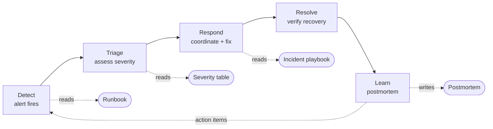
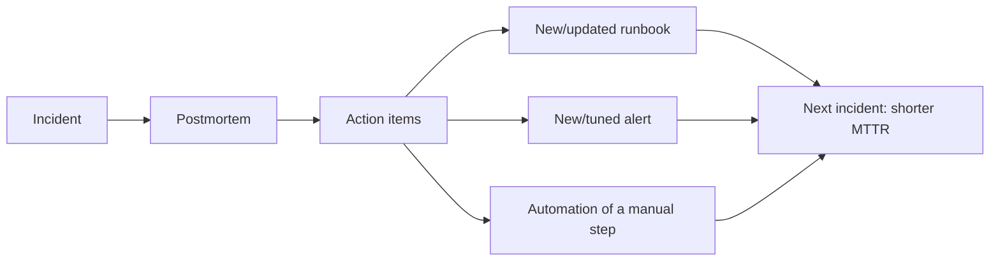
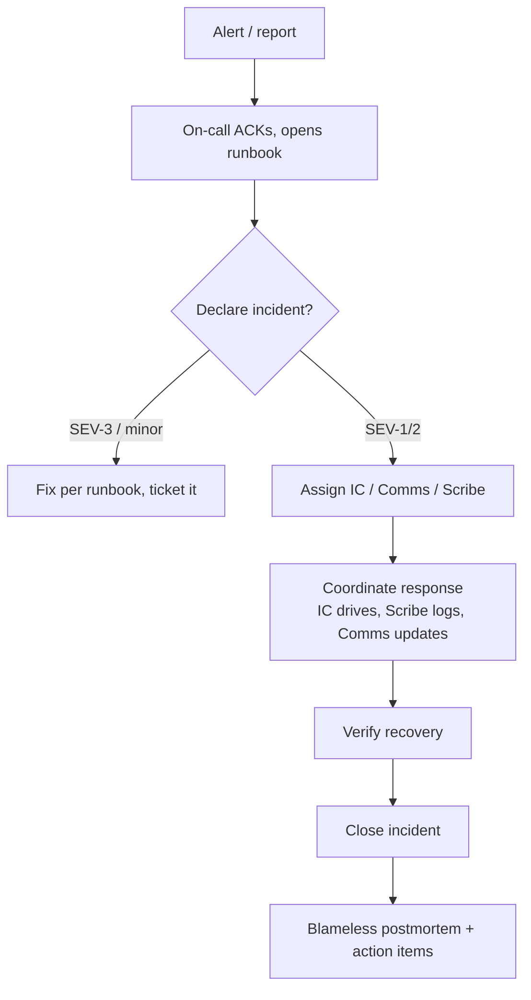
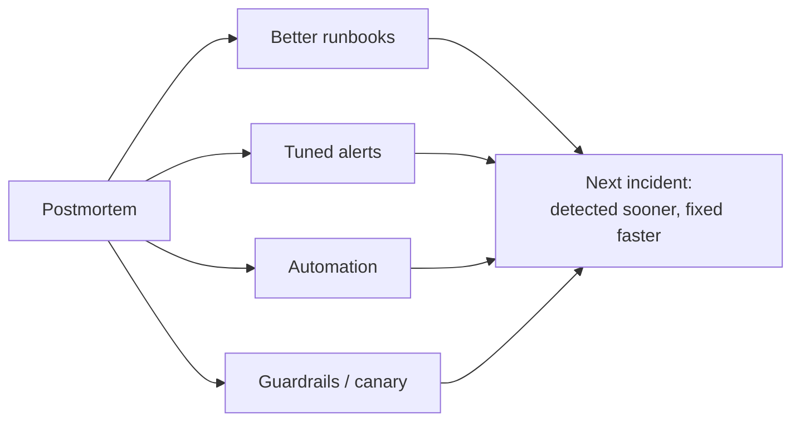

# Runbooks & Operational Docs — Middle

> **Category:** [Documentation](../README.md) — the operational knowledge that keeps a running system healthy and recoverable, written for the on-call engineer at 3 a.m.

> **Prerequisite:** [Junior](junior.md)
> **Focus:** **Why** and **When**

---

## Introduction

> Focus: **Why** and **When**

At the junior level, a runbook was a recipe for one alert. At the middle level you zoom out to the **incident** — the unplanned outage the runbooks exist to survive — and the *documents that structure a team's response to it*: severity definitions, the incident process doc, roles, the timeline, and above all the **blameless postmortem**.

A crucial scoping note: **this is a topic about the doc artifacts, not about incident management as a discipline.** Running incidents well — incident command, comms cadence, paging strategy — is the province of SRE (link conceptually to Google's *Site Reliability Engineering*). Here we care about *what gets written down*: the severity table, the playbook, the timeline, the postmortem. The doc is the part that outlives the incident and makes the *next* one shorter.

---

## The Incident Lifecycle and Where Docs Fit

An incident moves through phases, and a different operational doc supports each:



The dotted arrow back from **Learn** to **Detect** is the entire point: a postmortem isn't a report you file and forget — its action items *change the system and its docs* so the same failure can't recur (or recovers faster next time). An incident process that doesn't feed back is just paperwork.

---

## Severity Definitions

Before anyone can respond *proportionally*, the team must agree on what "bad" means. A **severity (SEV) table** is a short doc that maps impact to urgency and response. Without it, every responder guesses, and either over-reacts to a minor blip or under-reacts to a real outage.

| Severity | Definition | Example | Response |
|---|---|---|---|
| **SEV-1** | Critical: core service down or data loss; major customer impact | Checkout fully unavailable; primary DB lost | Page on-call immediately; declare incident; all-hands; status page |
| **SEV-2** | Major: significant degradation, partial outage, or SEV-1 imminent | Elevated error rate; one region degraded; disk filling fast | Page on-call; declare incident; senior responders |
| **SEV-3** | Minor: limited impact, workaround exists, not customer-visible | A non-critical job is failing; a single replica down | Handle in business hours; ticket; no page overnight |

The severity table earns its keep in two ways: it tells the on-call engineer **how hard to react** (do I wake people up?), and it standardizes language so "we have a SEV-2" means the same thing to everyone. *Impact* (what's broken, who's affected) drives the *severity* (the label); keep them distinct.

---

## Incident Roles and the Process Doc

For anything above a small SEV-3, one person fixing while also updating stakeholders, taking notes, and deciding strategy is a recipe for chaos. The **incident process doc** defines roles so the response is coordinated, not improvised. The canonical three (from SRE incident management):

| Role | Responsibility |
|---|---|
| **Incident Commander (IC)** | Owns the response. Decides strategy, delegates, holds the big picture. Does *not* fix the bug themselves — they coordinate. |
| **Communications (Comms) Lead** | Keeps stakeholders and customers informed: status page, internal updates, exec summaries. Shields responders from interruptions. |
| **Scribe** | Records the timeline in real time: every action, observation, and decision with timestamps. Feeds the postmortem. |

(On a small team one person may wear several hats — but the *doc* still names the roles so everyone knows who's doing what when it gets big.)

The incident playbook (introduced at [Junior](junior.md)) is where this lives: it states who declares an incident, how roles are assigned, the comms cadence (e.g., "update the status page every 30 min"), and — critically — **links out to the relevant runbooks** for the actual technical fixes. The playbook coordinates; the runbooks remediate.

---

## The Incident Timeline

The **timeline** is the factual spine of the whole incident. The scribe records, with timestamps (always UTC to avoid timezone confusion), every meaningful event:

```text
TIMELINE (all times UTC)
13:42  Alert APILatencyHigh fires; on-call paged
13:45  On-call ACKs; opens runbook; confirms p99 latency 4.2s (normal <300ms)
13:51  Incident declared SEV-2; @alex assumes IC; @sam = scribe; @jo = comms
13:58  Identified: a deploy at 13:30 introduced an unbounded query
14:04  IC decides to roll back the 13:30 deploy
14:09  Rollback started (runbook: deploy/rollback.md)
14:16  Rollback complete; p99 latency dropping
14:22  p99 back to 240ms; alert clears
14:25  Incident resolved; monitoring for recurrence
14:40  Incident closed; postmortem assigned to @alex, due in 3 business days
```

A timeline matters because human memory of a stressful event is unreliable and self-serving. Written *as it happens*, the timeline is the objective record the postmortem analyzes — and it surfaces the metric that matters: **MTTD** (time to detect, 13:42), **time to declare** (13:51), and **MTTR** (resolved 14:25 → ~43 min). You can only improve what you measure.

---

## The Blameless Postmortem

The **postmortem** (Google SRE's term; some call it a "retrospective" or "incident review") is a written analysis produced after every significant incident. Its defining property is that it is **blameless**.

> A **blameless postmortem** assumes everyone acted reasonably given what they knew at the time, and focuses entirely on *systemic* causes — the conditions that let the failure happen — rather than on punishing the individual whose action triggered it.

### Why blameless, specifically

This is not soft "be nice" culture; it is a hard engineering requirement, and the reasoning is mechanical:

- **Blame destroys information.** If the engineer who ran the bad command will be punished, the *next* engineer hides their mistakes, omits details from the timeline, and avoids reporting near-misses. You lose exactly the data you need to prevent recurrence.
- **People rarely cause incidents; systems let them.** If one mistyped command can take down production, the defect is the *system that allowed it* (no confirmation, no canary, no guardrail), not the human who typed it. "Human error" is the *start* of the investigation, not the conclusion.
- **The goal is prevention, not accountability theater.** A postmortem that ends in "Bob will be more careful" prevents nothing — Bob was already trying to be careful. A postmortem that ends in "add a confirmation prompt and a canary gate" prevents the *class* of failure for everyone.

> The blameless rule of thumb: replace "*who* did this?" with "*what about the system* made this easy to do and hard to catch?"

### Standard postmortem structure

The canonical sections (Google SRE):

| Section | Purpose |
|---|---|
| **Summary** | One paragraph: what happened, impact, duration. Readable by an exec. |
| **Impact** | Quantified: users affected, requests failed, revenue/SLO burn, duration. |
| **Timeline** | The factual sequence (from the scribe), UTC, timestamped. |
| **Root cause(s)** | The *systemic* cause(s) — often via "5 whys"; usually more than one. |
| **What went well** | Detection, response, tooling that worked — preserve these. |
| **What went poorly** | Gaps: slow detection, missing runbook, confusing dashboard. |
| **Action items** | Concrete, *owned*, *dated*, tracked fixes — the only part that prevents recurrence. |

The **action items** are the heart. Everything else explains; only action items change the future. Each must have an owner, a due date, and a tracking ticket — a postmortem whose action items are vague ("improve monitoring") or unowned is a postmortem that changes nothing.

---

## A Postmortem Template + Filled Excerpt

A reusable template (keep it in the repo, [docs-as-code](../10-docs-as-code-and-tooling/) style, so every incident starts from the same skeleton):

````markdown
# Postmortem: <short title>

**Status:** Draft | In review | Final
**Authors:** @owner    **Reviewers:** @ic, @team-lead
**Incident date:** YYYY-MM-DD    **Severity:** SEV-_    **Duration:** __ min

## Summary
<2–4 sentences: what broke, who was impacted, how long, how it was resolved.>

## Impact
- Users affected: __     Requests failed: __     SLO/error-budget burn: __
- Customer-visible? __    Revenue impact (est.): __

## Timeline (UTC)
| Time | Event |
|------|-------|
|      |       |

## Root Cause(s)
<Systemic causes. Use 5 Whys. Expect more than one contributing factor.>

## What Went Well
-

## What Went Poorly
-

## Action Items
| # | Action | Owner | Due | Ticket | Type (prevent / detect / mitigate) |
|---|--------|-------|-----|--------|------------------------------------|
| 1 |        |       |     |        |                                    |
````

A filled excerpt (the latency incident from the timeline above):

````markdown
# Postmortem: API latency spike from unbounded query (2026-06-09)

**Status:** Final   **Authors:** @alex   **Reviewers:** @maya, @team-lead
**Incident date:** 2026-06-09   **Severity:** SEV-2   **Duration:** 43 min

## Summary
A deploy at 13:30 UTC introduced a query without a LIMIT clause on the
/orders endpoint. p99 latency rose from ~240ms to 4.2s, causing client
timeouts and a 12% error rate for 43 minutes. Resolved by rolling back
the deploy.

## Impact
- ~38,000 requests timed out; ~4,500 checkout attempts failed.
- Error-budget burn for the month: ~30%.
- Customer-visible: yes (slow/failed checkout). Est. revenue impact: ~$11k.

## Root Cause(s)
1. A code change added a query missing a `LIMIT`, scanning the full table
   under production data volumes (the dev dataset was small, so it was fast
   in testing — connascence between query and data size went unnoticed).
2. No automated check for unbounded queries in CI.
3. The deploy went straight to 100% with no canary, so the regression hit
   all traffic at once instead of 1%.

## What Went Well
- Alerting detected the latency in 12 min; the runbook's rollback steps
  were accurate and the rollback was clean.

## What Went Poorly
- No canary stage meant blast radius was 100% immediately.
- The "API latency" runbook had no step for "correlate with recent deploys,"
  so the responders spent ~7 min before suspecting the deploy.

## Action Items
| # | Action | Owner | Due | Ticket | Type |
|---|--------|-------|-----|--------|------|
| 1 | Add canary stage (1% → 100%) to the deploy pipeline | @sam | 06-20 | OPS-812 | mitigate |
| 2 | Add CI lint flagging queries without LIMIT/pagination | @maya | 06-23 | OPS-813 | prevent |
| 3 | Add "check recent deploys" step to api-latency runbook | @alex | 06-13 | OPS-814 | detect |
````

Note action item #3: a runbook gap *discovered during the incident* becomes a tracked fix. That is the feedback loop in action.

---

## Closing the Loop: Postmortems Feed Runbooks

The most underused output of a postmortem is **better operational docs.** Every incident is a free, brutally honest test of your runbooks. After each one, ask:

- **Was there a runbook for this?** If not, write one now (the steps are fresh).
- **Did the runbook work?** If a step was wrong, missing, or slow, fix it — that's an action item.
- **Did the alert link to the right runbook?** If the page didn't carry the procedure, fix the alert annotation.
- **Could this be automated?** If the fix was mechanical (the rollback was just running one command), consider turning the runbook step into a script or a button (the executable-runbook direction, covered at [Senior](senior.md)).



This loop is *why* the topic links forward to [Keeping Docs Alive](../11-keeping-docs-alive-and-doc-rot/): the postmortem is one of the most reliable forcing functions for keeping operational docs current, because a doc that just failed an engineer at 3 a.m. has a very motivated person to fix it.

---

## Disaster Recovery: RTO, RPO, and Backup-Restore

Some operational docs cover the catastrophic case — the database is gone, the region is down. These are **disaster-recovery (DR)** procedures, and they're governed by two numbers the business must agree on:

> **RTO (Recovery Time Objective):** the maximum acceptable *time* to restore service after a disaster. "We can be down at most 1 hour."
>
> **RPO (Recovery Point Objective):** the maximum acceptable *data loss*, measured in time. "We can lose at most 5 minutes of data."

| | RTO | RPO |
|---|---|---|
| Measures | How long until we're back up | How much data we can lose |
| Driven by | Restore/failover speed | Backup frequency / replication lag |
| "1 hour" means | Down ≤ 1 hour | Lose ≤ 1 hour of data |
| Improved by | Faster failover, warm standbys, rehearsed restores | More frequent backups, synchronous replication |

The DR doc that operators actually need is the **backup-restore procedure**: where backups live, how to verify one is good, and the *exact* steps to restore. The unforgivable mistake here is the **untested backup** — a backup nobody has ever restored is a hope, not a recovery plan. A DR runbook must be *rehearsed* (a restore drill), or you will discover during a real disaster that the backups were corrupt, incomplete, or un-restorable. (Backup/restore mechanics belong to database operations; here the point is that the *procedure* is a first-class operational doc that must be tested.)

---

## When to Write a Runbook (and When Not To)

Not everything needs a runbook, and writing one for the wrong thing is wasted effort that then rots. A useful decision rule:

| Situation | Write a runbook? |
|---|---|
| An alert that **pages a human** | **Yes** — and link it from the alert (non-negotiable) |
| A recurring manual operational task (rotate cert, scale up, failover) | **Yes** — and consider automating it |
| A one-off task you'll never repeat | No — note it in the relevant ticket instead |
| A fix you can fully **automate** | Automate it; the script *is* the runbook (see [Senior](senior.md)) |
| A purely informational "how the system works" doc | That's a design doc / architecture map, not a runbook |

The guiding principle: **a runbook is for a procedure that (a) will be needed under pressure and (b) isn't yet automated.** If it'll never recur, skip it; if it can be automated, prefer that.

---

## Trade-offs

| Decision | One side | Other side |
|---|---|---|
| **Detail vs. speed** | Exhaustive runbook covers every branch | Long runbooks are slow to scan at 3 a.m. — lead with the common case |
| **Prose runbook vs. automation** | Prose is fast to write, flexible | Automation is faster and can't be skipped — but costs more to build/maintain |
| **Postmortem depth vs. throughput** | Deep analysis on every incident | Reserve full postmortems for SEV-1/2; lightweight notes for SEV-3 |
| **Severity strictness** | Tight SEV-1 criteria avoid alarm fatigue | Too tight and real outages get under-resourced |
| **Blameless culture cost** | Takes deliberate effort to sustain | Without it, you lose the data that prevents recurrence |

The recurring tension is **speed during the incident vs. completeness of the doc.** The resolution: structure the runbook so the *most likely* path is at the top and fast, with the long tail of edge cases below — the tired reader hits the common fix immediately and only scrolls when it doesn't apply.

---

## Edge Cases

### 1. The incident with no runbook
It happens. The playbook should cover this: declare the incident, assign roles, and have the IC drive ad-hoc diagnosis — *then* the first action item is "write the runbook we wished we had."

### 2. The runbook step that's now dangerous
Infra changed and a remediation command would now cause harm. This is why runbooks need review (and ideally testing) — a stale destructive step is the worst failure mode. Flag it loudly until fixed.

### 3. Cascading / multi-service incidents
No single runbook applies; this is a *playbook* situation. The architecture map (for operators) becomes essential to reason about blast radius and dependency order.

### 4. The "fixed itself" incident
The alert cleared before anyone acted. Still worth a lightweight postmortem — auto-recovery you don't understand is a future SEV-1 waiting for the conditions to line up differently.

---

## Tricky Points

- **Blameless ≠ accountability-free.** Blameless means no *punishment* for honest mistakes; the team is still accountable for *fixing the system*. Action items have owners and dates — that's accountability for the fix, not blame for the cause.
- **Root cause is usually plural.** Real incidents have *contributing factors*, not a single root cause. A postmortem that names one cause and stops has under-investigated.
- **The timeline must be written live.** Reconstructed-from-memory timelines are inaccurate and biased. The scribe role exists precisely so it's captured as it happens.
- **A postmortem with no action items (or unowned ones) prevents nothing.** The analysis is worthless without owned, dated, tracked follow-through.
- **RTO and RPO are easy to confuse.** Time-to-recover vs. data-loss-window. Mixing them up leads to backups that meet the wrong objective.
- **Severity is for response, not blame.** A SEV-1 isn't "someone failed"; it's "this needs maximum response *now*."

---

## Best Practices

1. **Define severities once, in a table** everyone shares; let impact drive the label.
2. **Name incident roles** (IC / Comms / Scribe) in the playbook, even if one person wears several hats on a small team.
3. **Scribe the timeline live, in UTC.** It's the objective record the postmortem rests on.
4. **Run every significant incident's postmortem blamelessly** — systemic causes, not individuals.
5. **Make action items owned, dated, and tracked.** They're the only part that prevents recurrence.
6. **Feed postmortems back into runbooks and alerts** — fix the gap the incident exposed while it's fresh.
7. **Define RTO/RPO with the business** and **rehearse the restore** — an untested backup is not a backup.
8. **Lead runbooks with the common case;** push edge cases lower so the 3 a.m. path is fast.

---

## Test Yourself

1. Why must a postmortem be blameless — give the mechanical (information) reason, not the moral one.
2. List the standard sections of a postmortem.
3. What are the three canonical incident roles, and what does each do?
4. Define RTO and RPO, and give an example of each.
5. Why is an untested backup not a backup?
6. Describe the feedback loop from postmortem to runbook.
7. Why must the incident timeline be written live rather than reconstructed afterward?

---

## Summary

- The middle level zooms out to the **incident** and the docs that structure the response: the **severity table**, the **incident playbook** with named **roles**, the **live timeline**, and the **blameless postmortem**.
- A postmortem is **blameless** for a hard engineering reason — blame destroys the information needed to prevent recurrence — and its **owned, dated action items** are the only part that actually changes the future.
- Postmortems **feed back into runbooks, alerts, and automation**, which is how operational docs stay honest and MTTR keeps dropping.
- **Disaster-recovery** docs are governed by **RTO** (recovery time) and **RPO** (data loss), and a backup-restore procedure is worthless until it's been **rehearsed**.
- Write runbooks for **paging alerts and recurring manual tasks**; skip one-offs; **automate** what you can.

---

## Diagrams

### The incident response flow (with role hand-off)



### Postmortem feedback loop




---

## Check your understanding

1. Explain Runbooks & Operational Docs — Middle Level in your own words and name the problem it solves.
2. How would you apply the ideas around Table of Contents, Introduction, The Incident Lifecycle and Where Docs Fit in a realistic engineering change?
3. What failure mode or misuse should you look for, and what evidence would reveal it?
4. Which local design trade-off would make you choose or reject Runbooks & Operational Docs — Middle Level in an existing codebase?
5. What observable result would convince you that the approach improved the system?
