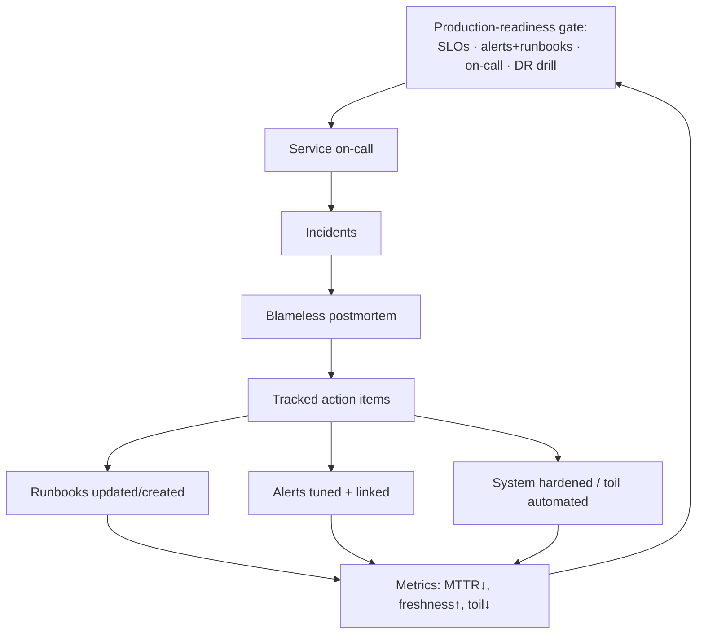
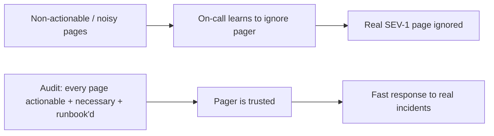

# Runbooks & Operational Docs — Professional

> **Category:** [Documentation](../README.md) — the operational knowledge that keeps a running system healthy and recoverable, written for the on-call engineer at 3 a.m.

> **Prerequisites:** [Junior](junior.md) · [Middle](middle.md) · [Senior](senior.md)
> **Focus:** **Production** — programs, metrics, on-call health, legacy systems

---

## Introduction

> Focus: **production** — keeping operational knowledge correct and usable across many services, teams, and years.

A single good runbook is a craft skill. Keeping *hundreds* of runbooks correct across dozens of services, with alerts wired to them, postmortems feeding them, and a rotating cast of on-call engineers depending on them at 3 a.m. — that's an *operational-readiness program*. At the professional level the question is organizational: **how do you make "the runbook is correct and findable" a property of the system, not a hope?**

The failure mode at scale is not "we have no runbooks." It's "we have 400 runbooks, nobody knows which are current, half the alerts link to dead pages, and the team only finds out which ones lie during a SEV-1." Operational docs rot faster than any other documentation (see [Senior](senior.md)) and are needed at the worst possible moments — so the professional builds the *program* that keeps them honest: review standards, freshness metrics, a real postmortem process, and the cultural and on-call-health work that sustains it.

---

## Running an Operational-Docs Program

The program rests on a few load-bearing standards, codified so they're the default, not a per-team fight:

1. **Every paging alert has a runbook link — enforced.** Make `runbook_url` a *required* annotation; a CI/lint check on the alerting config fails the build if a paging alert lacks one. No link, no merge.
2. **Runbooks live in version control, next to the code** (or in a docs-as-code repo). PR-reviewed, diffable, blameable — never in a wiki that nobody can audit. (See [Docs as Code & Tooling](../10-docs-as-code-and-tooling/).)
3. **Every runbook has an owner and a last-verified date.** An unowned, undated runbook is treated as untrusted.
4. **Production-readiness gate.** Before a service goes (or stays) on-call, it must have: defined SLOs, alerts with runbook links, an on-call rotation, and rehearsed DR. New services aren't "done" until they're operable.
5. **Postmortems are mandatory for SEV-1/2, blameless, and their action items are tracked to completion** — not filed and forgotten.
6. **Standard templates** for runbook, playbook, and postmortem, kept in the repo so every artifact starts from the same skeleton.

These standards turn "we should keep our runbooks current" (a wish) into checks, gates, and owners (a system).

---

## Enforcing Runbook Quality in Review

A runbook PR deserves the same review rigor as code — arguably more, because it's exercised under stress. The reviewer applies a specific bar, and the single highest-value question is:

> **"Could someone *not on this team* execute this at 3 a.m. and resolve the page — using nothing but what's written here?"**

Run it through the 3 a.m. test concretely:

1. **Concrete commands.** No "restart the service" — the exact command, host/namespace filled in or with a placeholder *plus* the command to resolve it.
2. **Diagnosis before remediation.** The runbook confirms the cause before acting. Reject "just restart it" runbooks.
3. **Verification present.** "How do I know it worked?" — every runbook must say.
4. **Escalation present.** A stuck reader has somewhere to go.
5. **Guardrails on dangerous steps.** Destructive commands carry explicit warnings (and ideally are wrapped in a script that *enforces* the guardrail — see [Senior](senior.md)).
6. **Common case first.** The likely path is at the top; edge cases below.
7. **Links resolve.** Dashboard/log/related-runbook links are live, not 404s.

### Review comment templates

> "This step says 'scale up the workers if needed.' What's the exact command, and what signal tells the on-call it's needed? At 3 a.m. 'if needed' isn't actionable — let's make it `kubectl scale … --replicas=N` with the threshold that triggers it."

> "The remediation deletes data with no verification or rollback. Before merging, add a diagnosis step that confirms the cause and a verification step — and wrap the deletion in `drop_dead_slot.py` so the active-slot guardrail is enforced, not just warned about."

> "This alert pages but has no `runbook_url`. Our standard is no paging alert without a runbook link — please add one (and the runbook) before merge."

> "Great runbook, but it's untested. Let's put it through a walkthrough or the next game day before we trust it in the rotation."

---

## Measuring Operational-Doc Health

You manage operational readiness with metrics that track *whether the docs actually work*, not vanity counts. The naive metric — "number of runbooks" — is worse than useless; it rewards sprawl.

| Metric | Tracks readiness? | Notes |
|---|---|---|
| **Paging alerts with a valid runbook link** | **Yes** | The foundational gate; aim for 100%. Lint it in CI. |
| **Runbook freshness** (% verified in last N months) | **Yes** | The anti-rot metric. Stale runbooks are latent liabilities. |
| **MTTR / MTTD trend** | **Yes (outcome)** | The ground truth: good runbooks lower time-to-detect and time-to-recover. |
| **% incidents that hit a *missing or wrong* runbook** | **Yes** | Directly measures the gap; should trend to zero. |
| **Postmortem completion + action-item closure rate** | **Yes** | Open action items mean the loop isn't closing; recurrence risk. |
| **Game-day / DR-drill cadence + findings fixed** | **Yes** | Are runbooks actually exercised? Are findings closed? |
| **Toil hours / repetitive-page count** | **Yes** | High → you're documenting problems you should automate away. |
| **Number of runbooks** | **No** | Vanity; rising count can mean rising operational debt, not maturity. |

### Honest-measurement rules

- **The real metric is the outcome: MTTR/MTTD.** If recovery is getting faster, the operational docs are working regardless of counts. If a postmortem says "the runbook was wrong/missing," that's a readiness defect no count will show.
- **Freshness beats quantity.** 50 verified, exercised runbooks beat 400 unverified ones. Report *coverage of paging alerts* and *% verified recently*, not totals.
- **Watch the recurring-page count.** A page that fires nightly and is "handled by a runbook" is operational debt; the metric to drive down is *toil*, by automating or fixing the system (see [Senior](senior.md)).
- **Tie it to DORA.** Change-failure rate and time-to-restore are downstream of operational-doc quality; if they degrade, your readiness did too.

---

## On-Call Health and the Human Cost

Operational docs exist to protect a *person* — the on-call engineer — and a professional treats their well-being as part of the readiness program, because burned-out on-call is both inhumane and an availability risk.

- **Alert fatigue is a doc problem too.** Every page must be *actionable* (has a runbook) and *necessary* (something a human must do *now*). Non-actionable or noisy pages train people to ignore the pager — so the next real SEV-1 gets a slower response. Auditing alerts (do they page? do they have runbooks? do they need a human at 3 a.m.?) is operational-doc work.
- **The on-call handbook is the engineer's safety net.** It must make a new on-call engineer's first shift survivable: how to ACK, where the dashboards are, who to escalate to, what's an emergency vs. a wait-until-morning, and explicit *permission to escalate early*. "When in doubt, escalate" should be written policy, not folklore.
- **Good runbooks reduce on-call stress directly.** The difference between a confident 15-minute resolution and a terrifying 2-hour flail is whether the runbook passed the 3 a.m. test. Runbook quality is a humane-on-call investment, not just an MTTR one.
- **Hand-off docs.** End-of-shift hand-off notes (what's ongoing, what's fragile tonight) prevent the next engineer from walking into a live problem blind.

> The professional reframing: **the on-call engineer is the customer of every operational doc.** If the doc doesn't make their 3 a.m. easier, it has failed its only job.

---

## The Postmortem Program

A few postmortems are an event; a *program* is what makes the feedback loop ([Middle](middle.md)) reliable at scale:

- **Blamelessness is enforced from the top.** Leadership must visibly never punish people for honest mistakes named in postmortems — one public blame event poisons the well permanently and people stop being candid. Blamelessness is a leadership behavior, not a template field.
- **Action items are tracked like any other work** — owned, dated, ticketed, and reviewed for closure. A standing "postmortem action-item review" keeps them from rotting in a backlog. Open-item count is a tracked metric.
- **Postmortems are shared and read.** A postmortem read only by its author teaches one person. Circulate them; run "incident of the month" reviews; build a searchable archive so the *next* engineer hitting a similar symptom finds the prior analysis.
- **Templates and a lightweight tier for SEV-3.** Full postmortems for SEV-1/2; a short note for minor ones — so the process scales without crushing throughput.
- **The loop must visibly close.** Every postmortem should produce *at least one* improvement to a runbook, alert, guardrail, or the system itself. If postmortems stop changing things, the program has become theater.

---

## Operational Docs for Legacy Systems

The hardest reality: a critical, poorly understood legacy system already in production, on-call, with sparse or wrong runbooks. You can't pause to document it perfectly. The approach is incremental and incident-driven:

1. **Mine incidents for runbooks.** The fastest way to document a legacy system honestly is to write the runbook *right after* each incident it causes, while the knowledge is fresh and proven correct. Incidents are a free, accurate documentation source.
2. **Capture tribal knowledge before it walks out.** When the one expert is about to leave (or go on a long vacation), pair-write the top runbooks with them and *have someone else execute them in a drill* — verifying the doc, not just recording the expert's dictation.
3. **Start with the highest-impact, highest-frequency pages.** Don't try to document everything. The Pareto rule applies: a handful of alerts cause most of the 3 a.m. pain. Runbook those first.
4. **Quarantine the dangerous unknowns.** Where nobody knows the safe remediation, the honest runbook says so: "⚠️ No known safe automated fix; on-call must escalate to @legacy-owner." A truthful "escalate" beats a guessed, dangerous command.
5. **Rehearse DR for the legacy system explicitly** — legacy backups are the most likely to be quietly un-restorable. Drill the restore.

### What *not* to do
- **Don't ship guessed runbooks.** A confidently-wrong legacy runbook is the [stale-runbook failure mode](senior.md) at its worst — false confidence on a system nobody understands. If you're not sure, write "escalate," not a guess.
- **Don't document instead of fixing.** A legacy system that pages nightly needs the page *fixed*, not just a smoother runbook for enduring it (see [Senior](senior.md) on over-documentation).

---

## Real Incidents

### Incident 1: The runbook that pointed at the wrong host
A database failover runbook still referenced `db-01`/`db-02` after a migration to a new cluster naming scheme months earlier — nobody had run it since. During a real primary failure, the on-call engineer followed the runbook's `promote db-02` step against a host that no longer existed, lost seven minutes to confusing errors, and nearly promoted the wrong node. **Root cause:** runbook untested since the migration; no freshness check. **Fixes:** added a quarterly DR drill that *executes* the failover runbook in staging, a "last-verified" date on every runbook, and a check that flags runbooks unverified in 6 months. **Lesson:** an untested runbook is a latent SEV-1; staleness is a correctness defect, not a cosmetic one.

### Incident 2: The page nobody could action
An alert fired nightly for months: `BackgroundJobQueueHigh`. It had a runbook that said "monitor; it usually clears." On-call engineers learned to ignore the pager overnight — until a genuinely stuck queue caused a SEV-1 data-staleness incident that the (ignored) page had been screaming about for two hours. **Root cause:** a non-actionable, noisy page trained the team to ignore the pager (alert fatigue). **Fixes:** the alert was changed to only page on a *sustained, growing* queue (actionable), given a real remediation runbook, and the "monitor it" version was downgraded to a non-paging dashboard signal. **Lesson:** every page must be actionable and necessary, or it erodes response to *all* pages — alert hygiene is operational-doc work.

### Incident 3: The backup that never restored
A team's DR doc described nightly database backups and a restore procedure. When a corruption event forced a restore, the backups were found to be of the *schema only* — a misconfiguration two years old that no one had caught because no one had ever performed the restore. Recovery took 14 hours from a stale replica instead of the documented 1-hour RTO. **Root cause:** unrehearsed DR; the restore procedure was never executed. **Fixes:** monthly restore drills into an isolated environment with automated verification of restored row counts. **Lesson:** an untested backup is not a backup; a DR runbook unverified by a real drill is fiction.

### Incident 4: The blameful postmortem that went silent
After a SEV-1, a manager named and publicly criticized the engineer who'd run the triggering command. The technical root causes (no canary, no confirmation prompt) went unaddressed. Over the next quarter, postmortems grew vaguer, near-misses stopped being reported, and a near-identical incident recurred. **Root cause:** blame destroyed the candor the process depended on. **Fixes:** leadership re-committed publicly to blamelessness, the manager apologized, and the focus moved to the missing guardrails. **Lesson:** blamelessness is enforced by leadership behavior, not a template — one blame event can poison reporting for a year.

---

## The Politics of Operational Docs

Sustaining operational readiness is partly a social and budgeting problem:

- **Operational docs are invisible until they save you.** A runbook that turns a 2-hour outage into a 15-minute one prevents a disaster *that never happens* — so the work is uncredited. Professionals must make the value legible: report MTTR improvements and "incidents resolved purely from the runbook by someone not on the owning team."
- **Documentation work is chronically under-prioritized** against features. Bake it into the production-readiness gate (no on-call without runbooks) so it's not optional, and into the postmortem loop so it's funded by incidents.
- **"We'll write the runbook later" never happens.** The forcing function is post-incident: the runbook gets written *as the action item*, while motivation and knowledge are highest.
- **Blamelessness needs visible top-down protection.** Engineers watch how the first blamed mistake is handled; leadership sets the ceiling on candor. This is a culture investment that pays in *information*.
- **Celebrate the boring saves.** The engineer who quietly followed a runbook and resolved a SEV-2 in ten minutes did the system a huge favor — and so did the person who wrote that runbook. Make those wins visible so the work feels worth doing.

---

## Review Checklist

```text
RUNBOOK / OPERATIONAL-DOC REVIEW CHECKLIST
[ ] 3 A.M. TEST — a non-author could execute this alone, at 3 a.m., from this doc
[ ] COMMANDS — exact, copy-pasteable; placeholders have a resolve command
[ ] DIAGNOSE-FIRST — confirms cause before remediating (no blind "restart it")
[ ] VERIFY — explicit "how do I know it worked?"
[ ] ESCALATE — clear path when steps don't resolve it
[ ] GUARDRAILS — destructive steps warned AND (ideally) enforced in a script
[ ] COMMON-CASE-FIRST — likely path on top, edge cases below
[ ] LINKS — dashboards/logs/related runbooks resolve (no 404s)
[ ] ALERT LINK — every paging alert carries a runbook_url (lint-enforced)
[ ] OWNER + LAST-VERIFIED date present; not stale
[ ] EXERCISED — walkthrough / game-day / recent-incident validation
POSTMORTEM:
[ ] BLAMELESS — systemic causes, no individual named for punishment
[ ] ACTION ITEMS — owned, dated, ticketed; ≥1 improves a runbook/alert/system
```

---

## Cheat Sheet

```text
PROGRAM           every paging alert → runbook (lint-enforced 100%);
                  runbooks in version control, owned + last-verified dated;
                  production-readiness gate before on-call.

REVIEW BAR        "could a non-author run this at 3 a.m. from this doc alone?"
                  diagnose-first · verify · escalate · guardrails · common-case-first.

MEASURE           alert→runbook coverage · runbook freshness · MTTR/MTTD trend ·
                  % incidents hitting a wrong/missing runbook · action-item closure ·
                  toil/repeat-page count.  NOT "number of runbooks" (vanity/debt).

ON-CALL HEALTH    every page actionable + necessary (kills alert fatigue);
                  on-call handbook = safety net; "escalate early" is written policy.

POSTMORTEM PROG   blameless (leadership-enforced) · action items tracked to closure ·
                  shared + archived · loop must visibly change the system.

LEGACY            mine incidents for runbooks · capture tribal knowledge in drills ·
                  Pareto the worst pages · write "escalate" not a guess · rehearse DR.

STALE = WORSE THAN NONE.  Untested runbook = latent SEV-1.
```

---

## Diagrams

### The operational-readiness program



### Alert fatigue: the doc-shaped failure



---

## Related Topics

- **Docs in the repo, CI-checked:** [Docs as Code & Tooling](../10-docs-as-code-and-tooling/)
- **Keep them honest:** [Keeping Docs Alive & Doc Rot](../11-keeping-docs-alive-and-doc-rot/)
- **Operator architecture maps:** [Diagrams as Code](../08-diagrams-as-code/)
- **Record the *why*:** [Architecture Decision Records](../05-architecture-decision-records-adrs/)
- **Tooling:** Prometheus/Alertmanager (`runbook_url`), Rundeck / PagerDuty Process Automation / AWS SSM, ChatOps bots; SRE production-readiness reviews.

---


---

## Check your understanding

1. Explain Runbooks & Operational Docs — Professional Level in your own words and name the problem it solves.
2. How would you apply the ideas around Table of Contents, Introduction, Running an Operational-Docs Program in a realistic engineering change?
3. What failure mode or misuse should you look for, and what evidence would reveal it?
4. How would you introduce and govern Runbooks & Operational Docs — Professional Level across teams through reversible, measurable increments?
5. What observable result would convince you that the approach improved the system?
