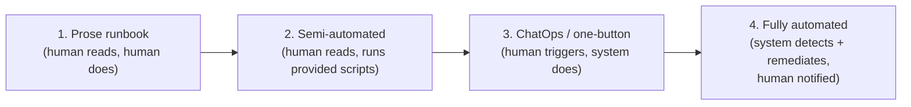
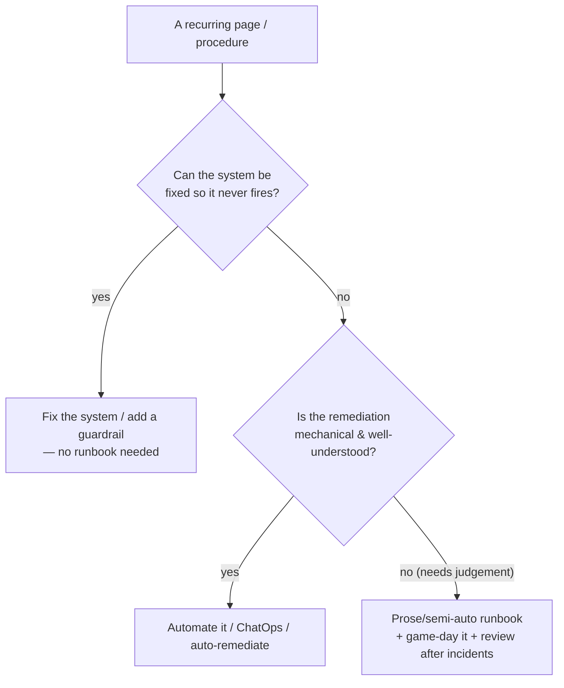
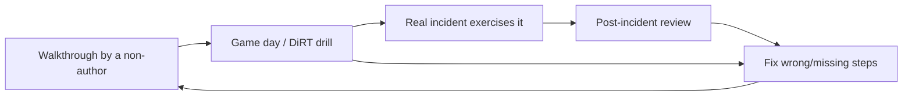

# Runbooks & Operational Docs — Senior

> **Category:** [Documentation](../README.md) — the operational knowledge that keeps a running system healthy and recoverable, written for the on-call engineer at 3 a.m.

> **Prerequisites:** [Junior](junior.md) · [Middle](middle.md)
> **Focus:** **Design trade-offs** and **system-level reasoning**

---

## Table of Contents

1. [Introduction](#introduction)
2. [Why Prose Runbooks Rot Fastest](#why-prose-runbooks-rot-fastest)
3. [The Automation Continuum](#the-automation-continuum)
4. [Executable and Living Runbooks](#executable-and-living-runbooks)
5. [ChatOps and Runbook Automation Platforms](#chatops-and-runbook-automation-platforms)
6. [Keeping Runbooks Honest: Game Days and DiRT](#keeping-runbooks-honest-game-days-and-dirt)
7. [The Stale-Runbook Failure Mode](#the-stale-runbook-failure-mode)
8. [Over-Documentation vs. Automation](#over-documentation-vs-automation)
9. [Operational Docs as a System](#operational-docs-as-a-system)
10. [Liabilities](#liabilities)
11. [Pros & Cons at the System Level](#pros--cons-at-the-system-level)
12. [Diagrams](#diagrams)
13. [Related Topics](#related-topics)

---

## Introduction

> Focus: **design trade-offs** and **system-level reasoning**

At the junior and middle levels, a runbook was a document — prose with copy-pasteable commands. At the senior level the central question changes: **should this be a document at all, or should it be code?** Senior operational maturity is the recognition that **prose runbooks are the *least* reliable form of operational knowledge** — they are untested until the incident, they rot silently, and they depend on a stressed human executing them correctly. The senior arc is the migration from *prose → semi-automated → fully automated*, and — for whatever necessarily stays prose — the *discipline that keeps it honest*: game days, chaos drills, and review-after-every-incident.

This file covers three hard questions:

1. **Why do prose runbooks rot fastest, and what's the migration path off them?**
2. **How do you keep the runbooks that *must* stay prose actually correct?** (You exercise them.)
3. **When is a runbook the wrong artifact entirely — when should you automate, build a guardrail, or fix the system so the page never fires?**

---

## Why Prose Runbooks Rot Fastest

Of all documentation, prose runbooks have the worst rot dynamics, and it's worth understanding *why* precisely:

- **They're write-once, read-rarely.** A runbook is read only when its specific failure occurs — maybe twice a year. Between readings, the infra it describes changes continuously: hostnames, namespaces, CLI flags, dashboard URLs, the deploy tool. The doc drifts out of sync with reality and *nobody notices*, because nobody's reading it.
- **They're untested until the worst possible moment.** Code has tests; a prose runbook has nothing verifying its commands still work. The first "test run" is a real engineer, mid-incident, at 3 a.m. — the most expensive and stressful possible place to discover step 4 is wrong.
- **Their failures are silent.** A broken function fails in CI. A broken runbook fails only when invoked — and even then the failure looks like "the on-call was confused," not "the doc lied." The rot is invisible until it costs you.
- **They depend on flawless human execution.** Even a *correct* prose runbook can be misexecuted by a tired human who skips a step, fat-fingers a command, or misreads a placeholder.

> The senior insight: **a prose runbook is a *latent liability*** — it looks like an asset (we have docs!) but it's an unverified promise that comes due only under pressure. The closer you can move it toward executable, tested code, the more its rot becomes *detectable* (it fails in CI) instead of *catastrophic* (it fails in production at 3 a.m.).

---

## The Automation Continuum

Operational procedures live on a continuum, and senior judgement is knowing where each procedure *should* sit:



| Stage | Form | Who reads / who acts | Rot detectability |
|---|---|---|---|
| **1. Prose** | Markdown with commands | Human reads, human types | Silent rot; tested only in incidents |
| **2. Semi-automated** | Prose + runnable scripts (the doc says *run this script*) | Human reads, script acts | Script can be tested in CI; prose around it still rots |
| **3. ChatOps / one-button** | A command (`/rollback service X`) or a runbook-automation job | Human triggers, system executes deterministically | The automation is code → testable, version-controlled |
| **4. Fully automated** | Auto-remediation (e.g., autoscaler, auto-restart, self-healing) | System detects *and* fixes; human is notified | Lives in code; exercised by traffic; no doc to rot |

The migration direction is always **rightward**, for things worth automating. Each step rightward (a) removes a chance for human error, (b) makes the procedure faster and more deterministic, and (c) — crucially — turns silent doc-rot into *detectable code failure*. But each step also costs more to build and maintain, which is the trade-off (below).

> The guiding principle, from SRE: **if a human is doing the same mechanical remediation repeatedly, that's a bug in your automation, not a need for a better runbook.** Toil (manual, repetitive, automatable work) should be engineered away, not documented around.

---

## Executable and Living Runbooks

A **living runbook** is one whose steps are *runnable artifacts*, not prose to retype. The forms, roughly in order of maturity:

### Semi-automated: the doc embeds the script
Instead of "run `kubectl rollout undo deployment/api -n prod`", the runbook says "run `./runbooks/rollback.sh api`", and that script is version-controlled, code-reviewed, and tested. The prose explains *when* and *why*; the script *is* the *how*. The commands can't drift from reality without breaking the script's tests.

### Notebook-style runbooks
Tools like **Jupyter** (and ops-specific equivalents like Rundeck, AWS Systems Manager Automation documents, or Nautobot/Naas-style runbooks) interleave prose explanation with *executable cells*. The on-call engineer reads the narrative and runs each cell, seeing real output inline. Diagnosis queries return live data; remediation cells perform the action. This is the sweet spot for procedures that need human judgement *between* steps but where each step should be executed, not retyped.

### Automated runbook jobs
A runbook becomes a parameterized job (Rundeck, Ansible playbook, GitHub Actions workflow, AWS SSM Automation): the "runbook" is now a definition the platform executes, with built-in logging, RBAC, and an audit trail. The human invokes it; the platform guarantees the steps run in order, every time.

```python
# A semi-automated remediation step, as a tested script the runbook invokes.
# The runbook prose says: "If diagnosis confirms a dead replica slot, run:
#     ./runbooks/db/drop_dead_slot.py --slot <name> --confirm"
# The script encodes the GUARDRAILS the prose could only beg the human to follow:

def drop_dead_slot(slot: str, confirm: bool) -> None:
    if not confirm:
        raise SystemExit("Refusing to act without --confirm")
    if slot_is_active(slot):                       # guardrail prose can't enforce
        raise SystemExit(f"Slot {slot} is ACTIVE — refusing to drop. Escalate.")
    if not slot_exists(slot):
        raise SystemExit(f"Slot {slot} not found — re-check diagnosis.")
    log_action("drop_replication_slot", slot)      # automatic audit trail
    execute_sql(f"SELECT pg_drop_replication_slot('{slot}')")
    print(f"Dropped slot {slot}. Verify disk: df -h /var/lib/postgresql")
```

Notice what the script buys you over prose: the dangerous "only do this if the slot is dead" warning — which a prose runbook can only *ask* a tired human to honor — becomes an *enforced guardrail* the system checks. **Code can refuse to do the wrong thing; a document can only warn against it.** That is the deepest argument for the continuum.

---

## ChatOps and Runbook Automation Platforms

**ChatOps** — invoking operations from the chat tool (Slack/Teams) where the incident is already being coordinated — collapses the gap between "reading the runbook" and "doing the thing":

```text
On-call:  /incident declare sev2 "API latency spike"
Bot:      Incident #4821 created. War room: #inc-4821. IC? React 👋
On-call:  /deploy status api prod
Bot:      api prod: v2.4.1 deployed 13:30 UTC by @maya (23 min ago)
On-call:  /rollback api prod --to-previous
Bot:      ⚠️ Rolling back api prod v2.4.1 → v2.4.0. Confirm with /confirm 4821
On-call:  /confirm 4821
Bot:      Rollback started. Tracking… ✅ complete 14:16. p99: 4.2s → 240ms
```

Why ChatOps is more than convenience: **every action is logged in the channel, in order, with who did it and when** — the timeline writes *itself*, the scribe's job is half-done, and the postmortem has an authoritative record. The chat history *is* the audit trail. ChatOps also enforces guardrails (the `/confirm` step) and makes the same action available to *anyone* on-call, eliminating "only Sara can run the deploy script."

**Runbook automation platforms** (Rundeck, PagerDuty Process Automation, AWS SSM, Ansible Automation Platform) take this further: named runbooks become governed, audited, parameterized jobs with role-based access control. The runbook stops being a doc you *follow* and becomes a job you *run*. The remaining prose is just the *when/why/escalation* wrapper — the part that genuinely needs human judgement.

---

## Keeping Runbooks Honest: Game Days and DiRT

For every procedure that *must* stay at least partly prose (because it needs human judgement, or automating it isn't worth the cost), the only way to keep it honest is to **exercise it before the real incident.** You cannot trust an untested runbook; so you test it deliberately.

> A **game day** (a.k.a. **chaos drill**, or Google's **DiRT** — Disaster Recovery Testing) is a planned exercise where the team injects a realistic failure and responds to it *using the actual runbooks and on-call process* — to discover where they're wrong *before* a customer does.

The practices, from lightest to heaviest:

| Exercise | What it does | What it validates |
|---|---|---|
| **Runbook walkthrough** | An engineer who didn't write it tries to follow it on a non-incident | The 3 a.m. test, literally — finds assumed context |
| **Game day** | Inject a controlled failure in staging/prod; team responds for real | Runbook accuracy, alert→runbook linkage, role coordination |
| **Chaos engineering** | Continuously/randomly inject failures (Chaos Monkey, Litmus, Gremlin) | Whether the *system* (and its auto-remediation) survives unaided |
| **DiRT / DR drill** | Simulate a major disaster (region down, DB loss); execute the DR runbook | RTO/RPO are real, backups restore, the DR doc is correct |

The discipline that makes this matter: **the output of a game day is the same as a postmortem — owned, dated action items that fix the runbooks and alerts that failed.** A game day where the runbook had three wrong steps is a *success* — you found them in a drill, not in a real SEV-1. The worst game day is the one that "goes perfectly" because the team quietly worked around the doc's gaps; insist that they use *only* what's written.

The other honesty forcing-function — covered at [Middle](middle.md) — is **review after every real incident**: the incident just exercised your runbook for free; fix what it exposed while it's fresh. Game days and post-incident review together are the maintenance regime that keeps operational docs from rotting (forward-link: [Keeping Docs Alive & Doc Rot](../11-keeping-docs-alive-and-doc-rot/)).

---

## The Stale-Runbook Failure Mode

It bears stating as its own principle because it inverts naive intuition:

> **A stale, wrong runbook is *worse* than no runbook at all.**

With *no* runbook, the on-call engineer knows they're improvising — they're careful, they verify, they escalate early. With a *wrong* runbook, they have **false confidence**: they trust the doc, run the stale command, get a confusing error or — worse — cause damage (the command now targets the wrong host, the flag changed meaning, the slot is live). The doc actively misled them at the moment of maximum stress.

This is why a senior treats runbook freshness as a correctness property, not a nicety:

- **Date and own every runbook.** "Last verified: 2026-05, owner @data-oncall." A runbook unverified in a year is suspect.
- **Prefer executable steps** so staleness fails in CI, not in production.
- **Exercise via game days** so prose staleness is found in a drill.
- **Review after every incident** that touched the runbook.
- **When in doubt, mark it.** A banner — "⚠️ UNVERIFIED since the X migration; diagnose carefully" — restores the honest "I'm improvising" stance that a confidently-wrong doc destroys.

---

## Over-Documentation vs. Automation

A senior must resist the reflex to *document* a problem that should be *fixed*. Three escalating responses to a recurring page, in increasing order of value:

1. **Write a runbook** for it. (Lowest value: the page still fires, a human still toils, the doc still rots.)
2. **Automate the remediation.** (Better: the toil is gone, the fix is deterministic and tested.)
3. **Fix the system so the page never fires.** (Best: the failure mode is *engineered away*.)

> The senior reframing: **a runbook for a frequent, mechanical page is often a *symptom of an unfixed system*.** If you're paging a human nightly to run the same three commands, the right artifact is not a better runbook — it's an autoscaler, a guardrail, a circuit breaker, or a bug fix.

This is the over-documentation trap: documentation *feels* productive and is cheap to write, so teams paper over operational pain with runbooks instead of paying down the underlying defect. The discipline is to ask, for every new runbook: *should this procedure exist at all, or am I documenting a problem I should be eliminating?* Reserve runbooks for the genuinely human-judgement-requiring, infrequent, or not-yet-automatable cases — and treat a growing pile of remediation runbooks as a signal of accumulating operational debt.

---

## Operational Docs as a System

At the senior level, operational docs stop being isolated files and become an interconnected system that mirrors the running system:

- **Alerts** link to **runbooks** (every paging alert).
- **Runbooks** link to **dashboards**, **log queries**, and the relevant **architecture map** ([diagrams as code](../08-diagrams-as-code/), so operators can reason about blast radius and dependency order).
- **Playbooks** link to the runbooks they coordinate.
- **Postmortems** ([Middle](middle.md)) link back to the runbooks and alerts they amend, and forward to the **ADRs** ([Architecture Decision Records](../05-architecture-decision-records-adrs/)) that record *why* a remediation or design changed.
- The **on-call handbook** and **escalation docs** are the index a new on-call engineer starts from.

The senior's job is to ensure this web is *navigable under stress*: from any page, the engineer is at most one click from the procedure, and from the procedure at most one click from the context. A disconnected operational doc — accurate but unlinked — is nearly as useless as a missing one, because it won't be found in time.

---

## Liabilities

### Liability 1: Automation that fails silently or unsafely
An automated runbook that does the wrong thing — without a human in the loop — can amplify an incident (an auto-remediation that restarts a thundering herd, or "fixes" a symptom while the cause cascades). Automation needs the same guardrails, dry-run modes, and circuit breakers you'd want in any production code, plus a clear human-override path.

### Liability 2: The untested backup / unrehearsed DR
The single costliest operational-doc liability: a DR runbook nobody has run. It will be discovered to be wrong during the one disaster it exists for. Rehearse restores on a schedule; treat a DR doc unverified by a real drill as non-existent.

### Liability 3: Runbook sprawl as operational debt
A directory of 300 remediation runbooks isn't operational maturity — it can be 300 unfixed system defects, each rotting. Periodically prune: automate the mechanical ones, delete the dead ones, and treat the count as a debt signal.

### Liability 4: ChatOps as an unaudited foot-gun
Powerful chat commands (`/rollback`, `/scale`, `/drop`) without RBAC, confirmation, and rate-limiting hand anyone in the channel a loaded weapon. The convenience that makes ChatOps great also makes an accidental or malicious command instantly destructive. Guardrails are mandatory.

---

## Pros & Cons at the System Level

| Dimension | Prose runbooks | Automated / executable runbooks |
|---|---|---|
| Cost to create | Low | High (it's code: build, test, maintain) |
| Speed during incident | Slow (human reads + types) | Fast (deterministic execution) |
| Human-error risk | High (skipped/mistyped steps) | Low (steps run as written) |
| Rot detectability | Silent until invoked | Fails in CI (detectable early) |
| Flexibility / judgement | High (human adapts) | Lower (must anticipate cases) |
| Auditability | Manual | Automatic (logs, who/when) |
| Best for | Rare, judgement-heavy, or one-off procedures | Frequent, mechanical, well-understood remediations |

The senior synthesis: **match the form to the procedure.** Mechanical, frequent, well-understood remediations belong on the right of the continuum (automate them, or fix the system so they're moot). Rare, judgement-heavy procedures stay prose — but are kept honest by game days and post-incident review. The failure is using the *wrong form*: automating something that needs human judgement (brittle, surprising), or leaving a nightly mechanical toil as a prose runbook (slow, error-prone, rotting).

---

## Diagrams

### Where should this procedure live? (the senior decision)



### Keeping a prose runbook honest



---

## Related Topics

- **Keep them honest:** [Keeping Docs Alive & Doc Rot](../11-keeping-docs-alive-and-doc-rot/)
- **Operator architecture maps:** [Diagrams as Code](../08-diagrams-as-code/)
- **Record the *why* behind changes:** [Architecture Decision Records](../05-architecture-decision-records-adrs/)
- **Conceptually adjacent:** SRE (toil, auto-remediation), chaos engineering, observability/monitoring.

---


---

## Check your understanding

1. Explain Runbooks & Operational Docs — Senior Level in your own words and name the problem it solves.
2. How would you apply the ideas around Table of Contents, Introduction, Why Prose Runbooks Rot Fastest in a realistic engineering change?
3. What failure mode or misuse should you look for, and what evidence would reveal it?
4. How would you validate a system-level decision about Runbooks & Operational Docs — Senior Level under uncertainty?
5. What observable result would convince you that the approach improved the system?
