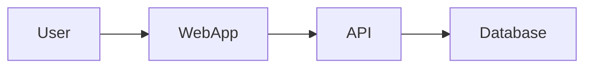
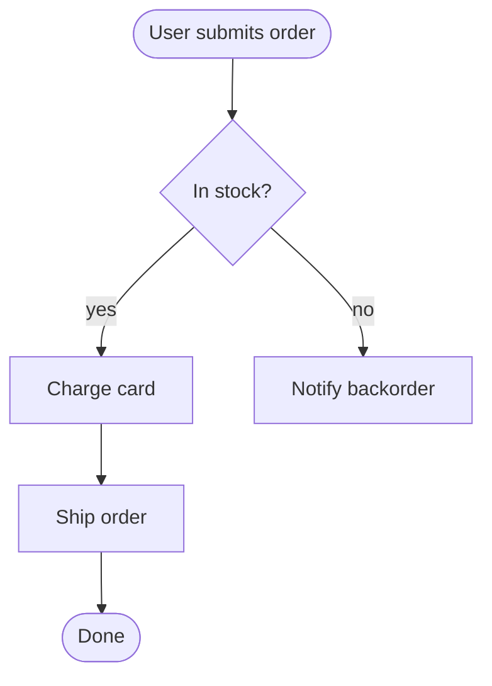
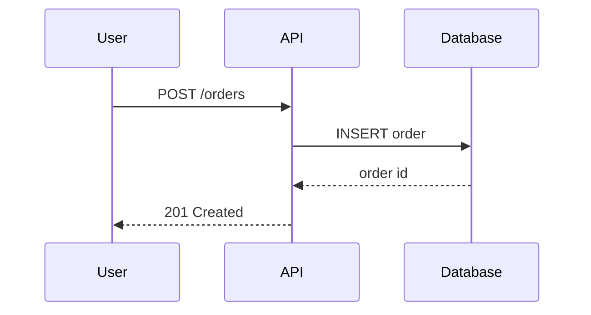
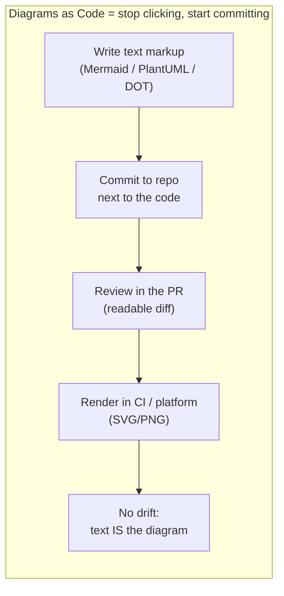

# Diagrams as Code — Junior

> **Category:** [Documentation](../README.md) — write architecture and flow diagrams in plain-text markup, commit them next to the code, and render them automatically — instead of pasting binary screenshots that rot.

---

## Table of Contents

1. [Introduction](#introduction)
2. [Prerequisites](#prerequisites)
3. [Glossary](#glossary)
4. [The Problem: The Diagram That Rots](#the-problem-the-diagram-that-rots)
5. [The Idea: Diagrams as Code](#the-idea-diagrams-as-code)
6. [Why This Matters](#why-this-matters)
7. [Your First Diagram: Mermaid](#your-first-diagram-mermaid)
8. [The Common Diagram Types](#the-common-diagram-types)
9. [The Same Idea in PlantUML](#the-same-idea-in-plantuml)
10. [Graphviz / DOT](#graphviz--dot)
11. [Where Diagrams Live](#where-diagrams-live)
12. [Which Diagram Answers Which Question](#which-diagram-answers-which-question)
13. [Good Diagram Habits](#good-diagram-habits)
14. [Best Practices](#best-practices)
15. [Common Mistakes](#common-mistakes)
16. [Tricky Points](#tricky-points)
17. [Test Yourself](#test-yourself)
18. [Cheat Sheet](#cheat-sheet)
19. [Summary](#summary)
20. [Further Reading](#further-reading)
21. [Related Topics](#related-topics)
22. [Diagrams](#diagrams)

---

## Introduction

> Focus: **What is it?** and **How to use it?**

**Diagrams as code** means you *write* a diagram as a few lines of plain text — a small markup language — and a tool **renders** it into a picture automatically. The text lives in your repository, next to the code it describes, and is reviewed, versioned, and regenerated exactly like source code.

> A **diagram as code** is a diagram defined in committed, human-readable text markup and rendered automatically — never a hand-placed binary image exported from a drawing tool.

Here is the entire idea in one block. This is real Mermaid source; on GitHub, GitLab, or an MkDocs site it renders as an actual picture:



Five lines of text. No mouse, no dragging boxes, no exporting a PNG. You committed *the recipe for the picture*, and the platform draws it for you. Change a line, and the picture changes — automatically, in the next render.

---

## Prerequisites

- **Required:** comfort with **Markdown** and committing files to **Git** — diagrams-as-code lives in Markdown files in a repo.
- **Required:** you have opened a **pull request** and had code reviewed — the payoff is diffable, reviewable diagrams.
- **Helpful:** a rough mental picture of a typical web system (client, server/API, database) so the examples make sense.
- **Helpful:** exposure to [READMEs](../03-readmes-and-onboarding-docs/junior.md) and [code comments/docstrings](../02-code-comments-and-docstrings/junior.md) — diagrams usually live *inside* these.

---

## Glossary

| Term | Definition |
|------|-----------|
| **Diagram as code** | A diagram written as plain-text markup, committed to the repo, and rendered automatically. |
| **Mermaid** | A text-to-diagram syntax that renders **natively** in GitHub, GitLab, and many doc tools — the easiest entry point. |
| **PlantUML** | An older, more complete text-to-diagram tool covering all UML diagram types; renders via a server or local jar. |
| **Graphviz / DOT** | A graph-layout engine; you describe nodes and edges in the `DOT` language and it auto-arranges them. |
| **Render** | Turn the text markup into an actual image (SVG/PNG) — done by the platform or in CI. |
| **Doc rot** | Documentation that has silently drifted out of sync with reality; a stale screenshot is the classic example. |
| **Diff** | The line-by-line change view in Git; text diagrams produce *readable* diffs, binary images do not. |
| **Single source of truth** | One authoritative place a fact lives; for a diagram, the committed markup — not a copy in someone's drawing tool. |

---

## The Problem: The Diagram That Rots

Picture the usual lifecycle of a diagram drawn the old way:

1. An engineer opens Lucidchart, draw.io, or Visio and drags boxes around for an hour.
2. They export a `architecture.png` and paste it into the wiki or README.
3. The system changes — a new service is added, a queue is introduced, a database is split.
4. **Nobody updates the picture.** Updating it means finding the original file, reopening the GUI tool, re-arranging, re-exporting, re-uploading.
5. Six months later the diagram confidently shows an architecture that no longer exists. A new hire trusts it and wastes a day.

This is **doc rot**, and the screenshot-of-a-whiteboard is its purest form — out of date the instant the marker stops moving. (Fighting rot is a whole topic on its own: [Keeping Docs Alive](../11-keeping-docs-alive-and-doc-rot/junior.md).)

The root causes are all about *friction* and *invisibility*:

| Problem with binary-image diagrams | Consequence |
|---|---|
| Lives outside the repo (or as an opaque blob inside it) | Drifts from the code; nobody is reminded to update it |
| Editing needs a GUI tool and the original source file | High friction → people don't bother |
| A `.png` shows as "Binary file changed" in a PR | Can't be reviewed; no one catches a wrong arrow |
| Only the original author can change it | Knowledge is trapped; diagram dies when they leave |

---

## The Idea: Diagrams as Code

Diagrams as code flips every one of those problems:

| Binary image (old way) | Diagram as code |
|---|---|
| Drag-and-drop in a GUI tool | **Write** a few lines of text |
| Exported `.png` / `.svg` blob | Source markup committed to the repo |
| Lives in a wiki / Google Drive | Lives **next to the code** it describes |
| "Binary file changed" in the diff | A **readable line-by-line diff** in the PR |
| Updated manually, rarely | **Regenerated automatically** by the platform / CI |
| Edited only by its author | Edited by anyone who can write text |

The mental shift is exactly the same one the industry made for infrastructure (Infrastructure as Code) and configuration: **stop clicking, start committing.** When the picture is generated from committed text, it can be reviewed, versioned, branched, and diffed — and it can never quietly drift, because the text *is* the diagram and the text is in the repo with everything else.

---

## Why This Matters

- **Version-controlled.** Every change to the diagram is a commit with an author, a date, and a message. You can `git blame` a box and find out who added it and why.
- **Diff-able and reviewable.** A teammate sees `API --> Cache` appear in the PR diff and can comment "shouldn't that arrow go the other way?" You cannot review a screenshot.
- **Lives next to the code.** The diagram is in the same repo, often the same folder. When you touch the code, the diagram is right there, harder to forget.
- **No drift between a stale PNG and reality.** Because the source is text in the repo, an out-of-date diagram shows up as out-of-date code — caught in review like any other staleness.
- **Regenerated in CI.** A pipeline can re-render every diagram on each commit, so the published picture always matches the latest committed markup.
- **Accessible to every engineer.** You don't need design skills or a license to a drawing app. If you can type, you can produce a clean diagram — and update someone else's.

> The one-line argument: a diagram-as-code is *a diagram that participates in your normal engineering workflow* — commit, review, merge, CI — instead of living outside it where it rots.

---

## Your First Diagram: Mermaid

**Mermaid** is the place to start, for one decisive reason: GitHub and GitLab render it **natively** inside Markdown. You write a fenced code block tagged ` ```mermaid `, push it, and the picture appears in the rendered Markdown — no tooling, no build step.

A **flowchart** (process / logic):



A **sequence diagram** (who talks to whom, in what order):



Notice what you did: you described *intent* ("user posts an order, the API inserts it, the DB returns an id") and Mermaid handled all the layout, arrows, and spacing. You never positioned a single box.

The basic flowchart vocabulary you need on day one:

```text
flowchart TD        direction: TD=top-down, LR=left-right, BT, RL
A --> B             solid arrow from A to B
A -- text --> B     arrow with a label
A([Rounded])        a "start/end" shape
A{Decision?}        a diamond (branch)
A[Box]              a plain rectangle (step)
```

---

## The Common Diagram Types

Mermaid (and the other tools) support far more than flowcharts. The most useful for an engineer:

An **ER (entity-relationship) diagram** — the shape of your data:


A **class diagram** — structure of objects/types:


A **state diagram** — the lifecycle of one thing:


You don't need to memorize the syntax — you look it up the first few times. What matters is recognizing that **each diagram type answers a different question**, covered below.

---

## The Same Idea in PlantUML

Mermaid isn't the only tool. **PlantUML** is older, supports the full UML standard, and is extremely popular in enterprise and Java circles. It renders via a small server or a local Java jar (and GitHub does *not* render it natively — you commit the `.puml` source and render it in CI or via a service like Kroki).

Here is **the same sequence** as the Mermaid example above, in PlantUML:

```text
@startuml
actor User
participant API
database Database

User -> API : POST /orders
API -> Database : INSERT order
Database --> API : order id
API --> User : 201 Created
@enduml
```

Same idea, different syntax. PlantUML tends to be more verbose but more capable (it covers component, deployment, and other UML diagrams Mermaid handles less fully). For a junior the takeaway is: **these are alternative dialects of the same concept** — text in, picture out. Pick the one your platform renders most easily; for most teams on GitHub/GitLab that is **Mermaid**.

---

## Graphviz / DOT

**Graphviz** is the granddaddy: a pure **graph-layout engine** with a tiny language called **DOT**. You declare nodes and edges; Graphviz computes a nice layout. Tons of tools generate DOT under the hood (dependency graphs, profilers, compilers).

```text
digraph services {
    rankdir=LR;
    web   -> api;
    api   -> db [label="reads/writes"];
    api   -> cache;
    worker -> queue;
    queue  -> worker;
}
```

Run `dot -Tsvg services.dot -o services.svg` and you get a laid-out picture. You'll meet DOT most often as *generated output* from other tools, but it's worth recognizing.

---

## Where Diagrams Live

The whole point is that diagrams live *with the code and docs*, embedded directly in the Markdown:

- In a **README** to show the high-level architecture ([READMEs & Onboarding](../03-readmes-and-onboarding-docs/junior.md)).
- In a **design doc / RFC** to show the proposed design ([Design Docs & RFCs](../06-design-docs-and-rfcs/junior.md)).
- In an **ADR** to illustrate a decision ([Architecture Decision Records](../05-architecture-decision-records-adrs/junior.md)).
- In a **runbook** to show an incident flow or system topology ([Runbooks & Ops Docs](../07-runbooks-and-operational-docs/junior.md)).
- In a docs site built with the **docs-as-code** toolchain ([Docs as Code & Tooling](../10-docs-as-code-and-tooling/junior.md)).

Because the diagram is a fenced block inside the Markdown, it travels with the document, renders in the same view, and is reviewed in the same PR.

---

## Which Diagram Answers Which Question

The single most useful skill is matching the diagram **type** to the **question** it answers. A diagram is a tool for answering *one* question for *one* audience.

| You want to show… | Use this diagram | It answers |
|---|---|---|
| How components talk over time / a protocol | **Sequence** | "In what order do these parts call each other?" |
| Logic, a process, a decision flow | **Flowchart** | "What are the steps and branches?" |
| The shape of your data | **ER diagram** | "What entities exist and how are they related?" |
| Object/type structure | **Class diagram** | "What are the types and their relationships?" |
| The lifecycle of one thing | **State diagram** | "What states can this be in, and what transitions are legal?" |
| Where software runs (infra) | **Deployment diagram** | "What runs on which machine/network?" |
| The big picture of a system | **Context / Container** (C4) | "What is this system, and what are its major parts?" |

> Rule of thumb: **one diagram, one question, one audience.** A diagram trying to show data *and* runtime *and* logic at once usually shows none of them clearly.

---

## Good Diagram Habits

Even at the junior level, a few habits separate a useful diagram from a confusing one:

- **Give it a title.** A diagram with no caption forces the reader to guess what they're looking at.
- **Be consistent with arrows.** Decide what an arrow *means* (a call? a data flow? a dependency?) and keep it the same throughout one diagram.
- **Keep one level of abstraction.** Don't mix a high-level "Payments Service" box with a low-level "for-loop" box in the same picture.
- **Keep it small.** Many small focused diagrams beat one giant "everything" diagram nobody can read.
- **Embed it in the doc.** A diagram in a folder by itself is half-useful; a diagram inside the README/ADR/runbook that explains it is fully useful.

---

## Best Practices

1. **Default to Mermaid** when your platform renders it natively (GitHub/GitLab/MkDocs). Zero setup, instant rendering.
2. **Commit the source, not just the image.** The text markup is the source of truth; a rendered PNG, if you keep one, is a build artifact.
3. **Put the diagram next to what it describes** — inside the README, ADR, design doc, or runbook.
4. **Pick the right diagram type** for the question (use the table above).
5. **One diagram, one idea.** Split a complex picture into several focused ones.
6. **Treat the diagram like code:** it goes through the same PR/review as the change it documents, updated in the *same* commit.

---

## Common Mistakes

1. **Pasting a screenshot of a drawing tool** into the docs — instantly un-reviewable and starts rotting immediately.
2. **The everything-diagram.** One sprawling picture with forty boxes that answers no question clearly.
3. **Mixing abstraction levels** — a cloud-region box next to a single function in the same diagram.
4. **Inconsistent arrows** — some arrows mean "calls", some mean "data flows", some mean "depends on", with no legend.
5. **Committing only the rendered `.png`** and losing the source, so the next person is back to a binary blob.
6. **Letting the diagram drift** — changing the code in a PR but not the diagram in the same PR. Diagrams are docs; they rot too.

---

## Tricky Points

- **GitHub renders Mermaid natively; it does *not* render PlantUML or DOT natively.** For PlantUML/Graphviz you render in CI or via a service like **Kroki**, then embed the resulting image — or you use a docs tool that supports them. This is the most common surprise for beginners.
- **A diagram is documentation, so it can rot.** "Diagrams as code" reduces rot dramatically (it's diffable and lives with the code) but does not eliminate it — you still must update the markup when reality changes.
- **Auto-layout is convenient but not always pretty.** The tool chooses the layout; you trade pixel-perfect control for zero maintenance. Usually a great trade, occasionally annoying.
- **The fenced block must be tagged correctly** (` ```mermaid `), or the platform shows raw text instead of a picture.

---

## Test Yourself

1. In one sentence, what is a "diagram as code"?
2. Why does a screenshot pasted into a wiki "rot," and how does diagrams-as-code fix that?
3. Name the two biggest advantages of text-based diagrams over exported images.
4. Which tool renders **natively** in GitHub Markdown, and which one usually needs CI or a render service?
5. Match each to its question: sequence, ER, state, flowchart.
6. What does "one diagram, one question, one audience" mean in practice?

---

## Cheat Sheet

```text
WHAT        diagram written as committed text markup, rendered automatically
WHY         versioned · diffable · reviewable · next to code · CI-rendered · no drift
START WITH  Mermaid (renders natively on GitHub/GitLab/MkDocs)
ALSO        PlantUML (full UML, render via CI/Kroki) · Graphviz/DOT (graph layout)

DIAGRAM → QUESTION
  sequence   → order of interactions / a protocol
  flowchart  → steps & decision branches
  ER         → shape of the data
  class      → type/object structure
  state      → lifecycle & legal transitions
  deployment → what runs where
  C4 context/container → the big-picture architecture

HABITS      title it · consistent arrows · one abstraction level ·
            small & focused · embed in the doc · update in the SAME PR
```

---

## Summary

- **Diagrams as code** = write a diagram in plain-text markup, commit it, render it automatically. Stop clicking, start committing.
- It fixes the **rotting screenshot**: text diagrams are version-controlled, diffable, reviewable in PRs, live next to the code, and can be regenerated in CI.
- **Mermaid** is the easiest start (native GitHub/GitLab rendering); **PlantUML** covers full UML; **Graphviz/DOT** is a graph-layout engine.
- Match the **diagram type to the question**: sequence, flowchart, ER, class, state, deployment, context/container.
- Good habits: title it, consistent arrows, one abstraction level, keep diagrams small and focused, embed them in the doc, and update them in the same PR as the code.
- Diagrams are documentation — they still rot if you don't maintain them.

---

## Further Reading

- [Mermaid documentation](https://mermaid.js.org/) — syntax for every diagram type, with a live editor.
- [PlantUML](https://plantuml.com/) — the full UML reference and language guide.
- [Graphviz / DOT language](https://graphviz.org/doc/info/lang.html) — the node/edge layout language.
- [Kroki](https://kroki.io/) — one HTTP service that renders Mermaid, PlantUML, Graphviz, and more.
- The C4 model (Simon Brown) — [c4model.com](https://c4model.com/) — covered at the [Middle](middle.md) level.

---

## Related Topics

- **Diagrams live inside:** [READMEs](../03-readmes-and-onboarding-docs/junior.md), [Design Docs & RFCs](../06-design-docs-and-rfcs/junior.md), [ADRs](../05-architecture-decision-records-adrs/junior.md), [Runbooks](../07-runbooks-and-operational-docs/junior.md).
- **Rendered & versioned by:** [Docs as Code & Tooling](../10-docs-as-code-and-tooling/junior.md).
- **The rot they fight:** [Keeping Docs Alive](../11-keeping-docs-alive-and-doc-rot/junior.md).

---

## Diagrams




---

## Check your understanding

1. Explain Diagrams as Code — Junior Level in your own words and name the problem it solves.
2. How would you apply the ideas around Table of Contents, Introduction, Prerequisites in a realistic engineering change?
3. What failure mode or misuse should you look for, and what evidence would reveal it?
4. What small example would prove that you can apply Diagrams as Code — Junior Level correctly?
5. What observable result would convince you that the approach improved the system?
