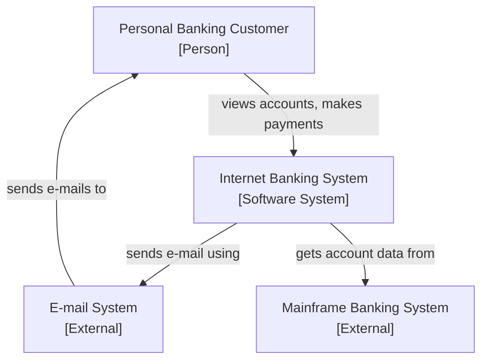
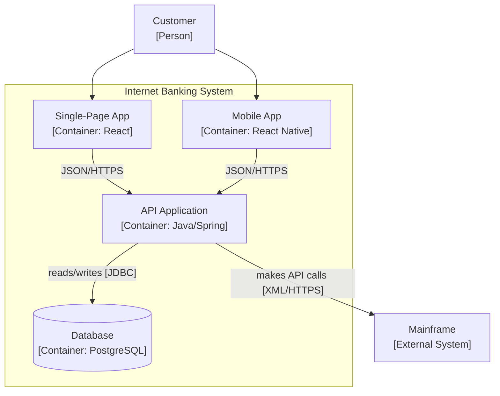
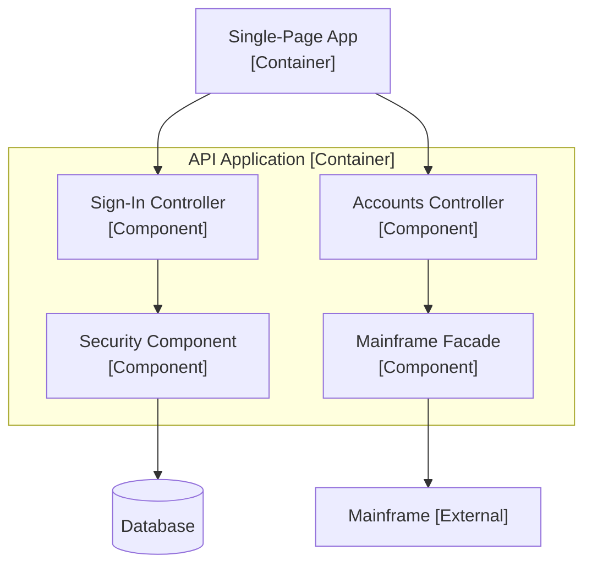
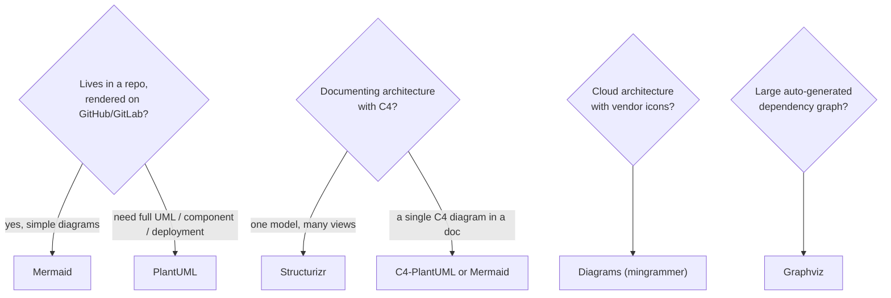
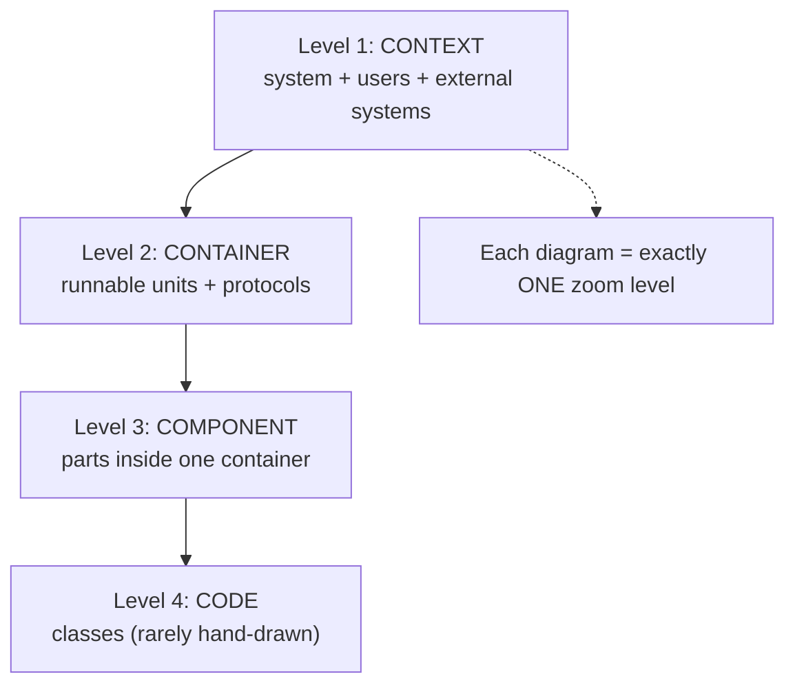
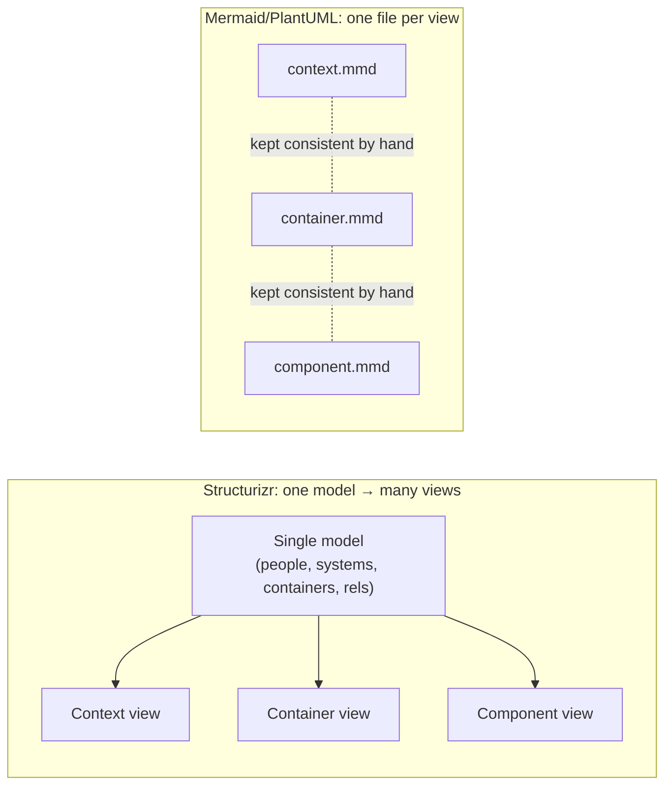

# Diagrams as Code — Middle

> **Category:** [Documentation](../README.md) — write architecture and flow diagrams in plain-text markup, commit them next to the code, and render them automatically — instead of pasting binary screenshots that rot.

> **Prerequisite:** [Junior](junior.md)
> **Focus:** **Why** and **When**

---

## Introduction

> Focus: **Why** and **When**

At the junior level you learned the *mechanics*: write text, render a picture, prefer Mermaid, match the diagram type to the question. At the middle level the questions become judgement calls: **which tool, at which level of abstraction, for which audience.**

The central insight that organizes everything here is **abstraction level**. The most common failure in diagramming is not bad syntax — it's mixing levels: a single picture with a "Payment Service" box, a "PostgreSQL" box, an "HTTP request" arrow, and a "for-loop" sitting side by side. Such a diagram answers no question for anyone. The cure is a *discipline of zoom*, and the best-known framework for it is the **C4 model**.

---

## The C4 Model: Maps at Different Zoom Levels

The **C4 model**, created by **Simon Brown**, is a small set of hierarchical abstractions for describing software architecture. The four C's are four *zoom levels*:

> **C4** = **C**ontext → **C**ontainer → **C**omponent → **C**ode. Each level zooms in one step further, like Google Maps going from country → city → street → building.

| Level | Name | Shows | Audience | Analogy |
|---|---|---|---|---|
| **1** | **Context** | Your system as one box, plus the users and external systems it talks to | Everyone, incl. non-technical | A map of the whole country |
| **2** | **Container** | The deployable/runnable units *inside* your system (web app, API, database, queue) and how they communicate | Technical staff, architects | Zoom to a city: the major districts |
| **3** | **Component** | The major building blocks *inside one container* and their responsibilities | Developers on that container | Zoom to a street: the buildings |
| **4** | **Code** | Classes/interfaces inside one component (UML-ish) | Rarely drawn by hand | Inside a building: the rooms |

The genius of the framing is the **map metaphor**: you don't show a single map at every zoom level at once. You pick the zoom appropriate to the question and audience. A CEO wants the country map (Context); a developer fixing a bug in the ordering service wants the street map (Component). C4 makes "what zoom level is this diagram?" an explicit, answerable question.

> A "container" in C4 has **nothing to do with Docker**. It means a separately runnable/deployable thing — a web app, an API process, a database, a serverless function, a single-page app. The terminology collision trips up almost everyone once.

---

## The Same System Across C4 Levels

The principle "many small focused diagrams" comes alive when you draw *the same system* at successive zoom levels. Take an "Internet Banking System."

### Level 1 — System Context



One box for *our* system, the people who use it, and the external systems it depends on. A non-technical stakeholder can read this. Nothing about *how* it's built.

### Level 2 — Containers (zoom into the one box)



Now we see the *runnable units* and the protocols between them. This is the most useful C4 level day-to-day — it's the picture you put in the README.

### Level 3 — Components (zoom into the API Application)



Inside one container, what are the major components and who calls whom. **Level 4 (Code)** — classes inside a component — is almost never drawn by hand; your IDE generates it on demand. C4's own guidance is to stop at Level 3 for most teams.

> Notice the discipline: **each diagram stays at exactly one zoom level.** The Context diagram never shows PostgreSQL; the Container diagram never shows individual controllers. That single-level consistency is what makes each one readable.

---

## Why C4 Beats Ad-Hoc Boxes-and-Lines

Most "architecture diagrams" in the wild are boxes and lines with no defined meaning: some boxes are servers, some are classes, some are teams; some arrows are HTTP calls, some are data flows, some are "depends on." The reader cannot decode them. C4 fixes three specific things:

| Problem with ad-hoc diagrams | What C4 gives you |
|---|---|
| Boxes mix abstraction levels (a service next to a class) | **Consistent abstraction** — every box on a diagram is the same kind of thing |
| No agreed meaning for boxes/arrows | A **defined notation** — boxes are people/systems/containers/components; arrows are labeled relationships |
| One diagram tries to serve everyone | **Audience-appropriate zoom** — pick the level for the reader |
| Tied to a drawing-tool's quirks | **Notation-independent** — C4 is a *model*, renderable in Mermaid, PlantUML, Structurizr, or on a whiteboard |

C4 is deliberately **notation-independent and tooling-independent**: it tells you *what to draw at each level*, not which tool to draw it with. That's why it pairs perfectly with diagrams-as-code — the model gives you the discipline, the tool gives you the rendering.

---

## C4 as Code: Structurizr and C4-PlantUML

Two mainstream ways to author C4 diagrams as code:

**C4-PlantUML** — a set of PlantUML macros (`!include` the C4 library) that give you `Person`, `System`, `Container`, `Rel`, etc. You still write one file per diagram:

```text
@startuml
!include <C4/C4_Container>

Person(customer, "Customer", "A banking customer")
System_Boundary(ibs, "Internet Banking System") {
    Container(spa, "Single-Page App", "React", "Account UI in the browser")
    Container(api, "API Application", "Java/Spring", "Business logic via JSON/HTTPS")
    ContainerDb(db, "Database", "PostgreSQL", "Stores accounts, transactions")
}
System_Ext(mainframe, "Mainframe", "Core banking")

Rel(customer, spa, "Uses", "HTTPS")
Rel(spa, api, "Calls", "JSON/HTTPS")
Rel(api, db, "Reads/Writes", "JDBC")
Rel(api, mainframe, "Calls", "XML/HTTPS")
@enduml
```

**Structurizr** — Simon Brown's own tool, built around a key idea: **describe the model once, generate many views.** You define people, systems, containers, and relationships *a single time* in the Structurizr DSL, then ask for a Context view, a Container view, a Component view — all from that one model. Change a relationship once and *every* view that uses it updates.

```text
workspace {
    model {
        customer = person "Customer"
        ibs = softwareSystem "Internet Banking System" {
            spa = container "Single-Page App" "React"
            api = container "API Application" "Java/Spring"
            db  = container "Database" "PostgreSQL"
        }
        mainframe = softwareSystem "Mainframe" "Core banking"

        customer -> spa "Uses"
        spa -> api "Calls" "JSON/HTTPS"
        api -> db "Reads/Writes"
        api -> mainframe "Calls"
    }
    views {
        systemContext ibs { include * }
        container ibs       { include * }
    }
}
```

This is the deeper win: **one model, many consistent views.** With raw Mermaid you redraw each level by hand and they can drift from each other; Structurizr derives them from a single source, so they can't.

---

## The Tool Landscape

| Tool | Strengths | Renders natively in GitHub? | Best for |
|---|---|---|---|
| **Mermaid** | Tiny syntax, native GitHub/GitLab/MkDocs rendering, covers flowchart/sequence/class/ER/state/gitgraph | **Yes** | The default for docs in a repo |
| **PlantUML** | Full UML (sequence/class/component/deployment), C4 via C4-PlantUML, very mature | No (render via CI/Kroki) | UML-heavy and enterprise/Java teams |
| **Graphviz / DOT** | Best-in-class auto-layout for large graphs; the engine many tools generate | No | Dependency/call graphs, generated diagrams |
| **D2** (Terrastruct) | Modern syntax, beautiful auto-layout, good for architecture | No (CLI / plugins) | Clean architecture diagrams, newer projects |
| **Structurizr** | C4 model-as-code: one model → many views | No (own renderer/site) | Serious C4 architecture documentation |
| **Diagrams** (mingrammer, Python) | Real cloud-provider icons (AWS/GCP/Azure/K8s) defined in Python | No (Python script → image) | Cloud-architecture diagrams with vendor icons |
| **Kroki** | Not a syntax — a unified render *service* for Mermaid, PlantUML, Graphviz, D2, and more | n/a (it *is* the renderer) | Rendering any of the above in one pipeline |

A few worth singling out:

- **D2 (Terrastruct)** is the modern challenger — a clean text syntax with notably prettier auto-layout than older tools.
- **Diagrams** (the "mingrammer" Python library) is unique: you write *Python*, and it draws cloud architecture with the actual AWS/GCP/Azure/Kubernetes icons. Great for infra/deployment pictures that need recognizable vendor logos.
- **Kroki** is the glue: a single HTTP endpoint that renders almost every other syntax, so your CI doesn't need a separate toolchain per language.

---

## Choosing a Tool

A practical decision order:



The pragmatic default for most teams: **Mermaid for everyday diagrams in docs, C4 (via Structurizr or C4-PlantUML) for architecture, Diagrams for cloud-infra pictures, Kroki to render whatever you pick in CI.** Don't proliferate tools without reason — every extra syntax is another thing your team and your pipeline must support.

---

## Which Diagram Type for Which Question

The diagram-type → question mapping, now with the architecture-level (C4) diagrams folded in:

| Question to answer | Diagram type | Notes |
|---|---|---|
| What is this system and who/what does it interact with? | **C4 Context** | Level 1; non-technical audience |
| What runnable parts make up the system? | **C4 Container** | Level 2; the everyday architecture picture |
| What are the parts inside one container? | **C4 Component** | Level 3 |
| In what order do parts call each other? (a protocol) | **Sequence** | Time flows downward |
| What are the steps and branches of a process? | **Flowchart** | Logic, algorithms, request handling |
| What entities exist and how are they related? | **ER** | The data model |
| What are the types and their relationships? | **Class** | Structure (C4 Level 4 territory) |
| What states can one thing be in? | **State** | Lifecycles, order/payment status |
| What runs on which infrastructure? | **Deployment** | Nodes, networks, regions |

> The governing principle, unchanged from junior but now sharper: **a diagram answers one question for one audience.** C4 operationalizes the "one audience" half; the diagram-type table operationalizes the "one question" half.

---

## Embedding Diagrams in Engineering Docs

Diagrams-as-code earns its keep by living *inside* the documents engineers already write:

- **Design docs / RFCs** — a Container or sequence diagram of the proposed design makes the proposal concrete and reviewable in the same PR. ([Design Docs & RFCs](../06-design-docs-and-rfcs/middle.md))
- **ADRs** — a small before/after diagram of the decision clarifies *what changed* structurally. ([Architecture Decision Records](../05-architecture-decision-records-adrs/middle.md))
- **Runbooks** — a sequence or flowchart of the incident-response steps, or a deployment diagram of the topology to debug at 3 a.m. ([Runbooks & Ops Docs](../07-runbooks-and-operational-docs/middle.md))
- **Docs site** — the [docs-as-code toolchain](../10-docs-as-code-and-tooling/middle.md) renders all of these on a published site, in CI.

The cross-link to keep front of mind: diagrams-as-code is a *subset* of [docs-as-code](../10-docs-as-code-and-tooling/middle.md) — the same repo, the same review, the same CI, applied specifically to pictures.

---

## Trade-offs

| | Diagrams as code | GUI drawing tools (Lucidchart, draw.io, Visio) |
|---|---|---|
| Version control / diff / review | **Excellent** (text in the repo) | Poor (binary blobs) |
| Lives next to the code | **Yes** | No (separate app/drive) |
| Layout control | Auto-layout; limited fine-tuning | **Pixel-perfect** hand placement |
| Visual polish | Good, occasionally awkward | **High** — designed for presentations |
| Learning curve | A small syntax to learn | Familiar drag-and-drop |
| Drift resistance | **High** (caught in review) | Low (manual updates) |
| Big-bang complex diagram | Gets unwieldy as text | Easier to wrangle visually |

The honest summary: **diagrams-as-code wins decisively for diagrams that must stay in sync with a changing system** (architecture, sequences, data models in a living codebase). GUI tools still win when you need a *one-off polished visual* for an exec deck, or a complex hand-tuned layout where auto-layout looks bad. Use the right tool for the job — and most engineering documentation is the diagrams-as-code job.

---

## Edge Cases

### 1. The diagram auto-layout looks ugly

Auto-layout sometimes routes arrows awkwardly or stacks boxes oddly. Options, in order: re-order the declarations (layout engines respect declaration order), change direction (`TD` ↔ `LR`), or **split the diagram** (an ugly auto-layout is often a too-big diagram). Reach for a GUI tool only if the diagram is a one-off that won't change.

### 2. Mermaid can't express what you need

Mermaid is intentionally limited. If you need full component/deployment UML or proper C4, step up to PlantUML / C4-PlantUML / Structurizr rather than forcing Mermaid to fake it.

### 3. You inherited a pile of `.png` diagrams

Don't rewrite them all at once. Convert a diagram to code *the next time it needs to change* — same opportunistic approach as any other documentation cleanup. (See [Keeping Docs Alive](../11-keeping-docs-alive-and-doc-rot/middle.md).)

---

## Tricky Points

- **"Container" in C4 ≠ Docker container.** It means a separately runnable/deployable unit. This single ambiguity causes more confusion than any other part of C4.
- **C4 is a model, not a tool or a notation.** You can draw C4 on a whiteboard, in Mermaid, in PlantUML, or in Structurizr. The value is the *consistent abstraction levels*, not any rendering.
- **One model → many views (Structurizr) vs. one file per view (Mermaid/PlantUML).** The former prevents the levels from drifting apart; the latter is simpler but you maintain consistency by hand.
- **Stop at C4 Level 3.** Level 4 (Code) is rarely worth drawing by hand — your IDE/UML tool generates it from the code, which is the only way it stays accurate.
- **Diagrams-as-code is still docs.** It resists rot far better than screenshots but does not self-update; the markup must be maintained like the code.

---

## Best Practices

1. **Use C4 to discipline abstraction levels** — one zoom level per diagram, the right level for the audience.
2. **Draw Context and Container for any non-trivial system**; add Component diagrams only for containers complex enough to need them.
3. **Prefer one-model-many-views (Structurizr)** when you maintain several C4 levels — it keeps them consistent automatically.
4. **Default to Mermaid** for everyday diagrams; reach for PlantUML/C4-PlantUML/D2/Diagrams when the diagram type demands it.
5. **Render in CI** (often via Kroki) so the published images always match the committed source.
6. **Embed diagrams in the doc that explains them** — README, design doc, ADR, runbook — never as orphan image files.
7. **Many small focused diagrams** over one everything-diagram; each answers one question.

---

## Test Yourself

1. Name the four C4 levels in order and what each shows.
2. Why is C4 better than ad-hoc boxes-and-lines? Give two specific reasons.
3. What does "container" mean in C4, and what does it *not* mean?
4. What is the key advantage of Structurizr's "one model, many views" over hand-drawing each level in Mermaid?
5. When would you choose the Python "Diagrams" library over Mermaid?
6. When do GUI drawing tools still beat diagrams-as-code?

---

## Summary

- The middle-level skill is choosing the right **abstraction level, tool, and audience** — and the discipline that organizes it is the **C4 model**.
- **C4** (Context → Container → Component → Code) is "maps at different zoom levels": one consistent abstraction per diagram, the right zoom for the audience. It beats ad-hoc boxes-and-lines via consistent abstraction, a defined notation, and audience-appropriate zoom — and it's notation-independent.
- **C4 as code:** C4-PlantUML (macros, one file per view) or **Structurizr** (one model → many consistent views).
- The **tool landscape**: Mermaid (default, native GitHub), PlantUML (full UML), Graphviz/DOT (graph layout), D2 (modern, pretty), Structurizr (C4), Diagrams/mingrammer (cloud icons), Kroki (unified renderer).
- Keep matching **diagram type to question**, embed diagrams in design docs / ADRs / runbooks, and render in CI.
- The trade-off: diagrams-as-code wins for diagrams that must stay in sync; GUI tools win for one-off polished visuals and hand-tuned layouts.

---

## Diagrams

### C4 = zoom levels



### One model, many views (Structurizr) vs. one file per view




---

## Check your understanding

1. Explain Diagrams as Code — Middle Level in your own words and name the problem it solves.
2. How would you apply the ideas around Table of Contents, Introduction, The C4 Model: Maps at Different Zoom Levels in a realistic engineering change?
3. What failure mode or misuse should you look for, and what evidence would reveal it?
4. Which local design trade-off would make you choose or reject Diagrams as Code — Middle Level in an existing codebase?
5. What observable result would convince you that the approach improved the system?
