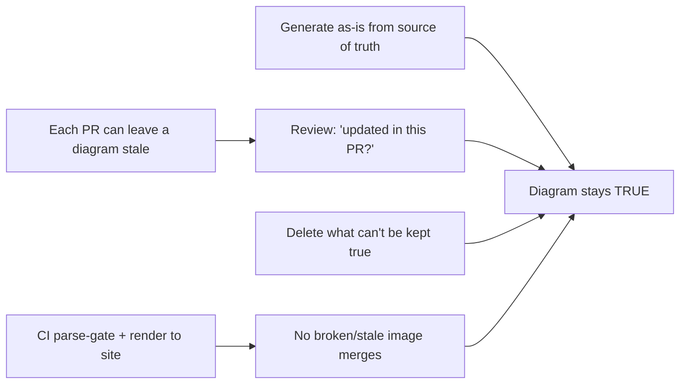
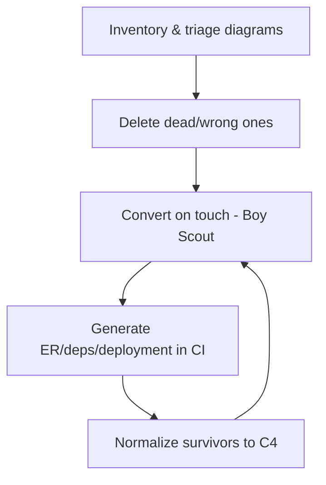

# Diagrams as Code — Professional

> **Category:** [Documentation](../README.md) — write architecture and flow diagrams in plain-text markup, commit them next to the code, and render them automatically — instead of pasting binary screenshots that rot.

> **Prerequisites:** [Junior](junior.md) · [Middle](middle.md) · [Senior](senior.md)
> **Focus:** **Production** — reviews, CI, team conventions, legacy migration

---

## Table of Contents

1. [Introduction](#introduction)
2. [Reviewing Diagrams in Pull Requests](#reviewing-diagrams-in-pull-requests)
3. [The CI Pipeline for Diagrams](#the-ci-pipeline-for-diagrams)
4. [Team Conventions for Diagrams as Code](#team-conventions-for-diagrams-as-code)
5. [Keeping Diagrams in Sync at Scale](#keeping-diagrams-in-sync-at-scale)
6. [Migrating a Legacy Diagram Estate](#migrating-a-legacy-diagram-estate)
7. [Measuring Whether It's Working](#measuring-whether-its-working)
8. [Real Incidents](#real-incidents)
9. [The Politics of Diagrams](#the-politics-of-diagrams)
10. [Review Checklist](#review-checklist)
11. [Cheat Sheet](#cheat-sheet)
12. [Diagrams](#diagrams)
13. [Related Topics](#related-topics)

---

## Introduction

> Focus: **production** — running diagrams-as-code across a large org over years.

A single engineer adopting Mermaid is easy. The professional problem is **institutional**: hundreds of diagrams, dozens of authors, several years, and the relentless gravity that pulls every diagram toward staleness, inconsistency, and the big-ball-of-mud. The benefits from the junior level — versioned, diffable, reviewable, CI-rendered — are *potential*; they only materialize if the team builds the review standards, CI, and conventions that turn them on.

The operational question: **how do you keep a diagram corpus true, consistent, and readable when it's maintained by many people who'd rather be writing code?** The answer is a system — review that treats diagrams as code, CI that renders and gates them, conventions that make the right thing the default, and a disciplined migration path off the legacy `.png` pile.

---

## Reviewing Diagrams in Pull Requests

A diagram is code; it gets reviewed like code. But reviewers consistently *skip* diagrams ("it's just a picture") — which is exactly how wrong diagrams merge. A professional reviewer reads the rendered diagram **and** the diff.

### What to check, in order

1. **Is it correct?** Does the diagram match what the code in *this same PR* actually does? An arrow pointing the wrong way is a bug, not a cosmetic note.
2. **Is it the right abstraction level?** One C4 zoom level per diagram; no service-box-next-to-a-class mixing.
3. **Does it answer one question?** If it's trying to show data *and* runtime *and* logic, ask for it to be split.
4. **Is the notation consistent?** Arrows mean one thing throughout; the team's conventions (sync vs. async, etc.) are followed.
5. **Does it render?** CI should confirm it parses — but eyeball the rendered output in the PR (GitHub shows Mermaid; for others, the CI artifact link).
6. **Is it co-located and embedded** in the doc that explains it, not an orphan file?

### The highest-value review question

> **"Does this diagram still match the code after this change — and was it updated in *this* PR?"**

A PR that changes the request flow but leaves the sequence diagram untouched is shipping a future-wrong diagram. Catching that *at review time*, in the same PR, is the entire mechanism by which diagrams-as-code beats screenshots. If reviewers don't ask it, you've gained diffability but thrown away its payoff.

### Review comment templates

> "This sequence diagram still shows the API calling the DB directly, but the PR routes it through the new cache. Please update `order-flow.mmd` in this PR so they don't diverge."

> "This diagram mixes a 'Payments Service' box with a 'validateCard()' box — two C4 levels in one picture. Split into a Container view and a Component view; each will be readable."

> "Forty boxes, no legend — what one question does this answer? I'd break it into a C4 Context plus per-container Component diagrams."

> "Solid arrows usually mean synchronous calls in our diagrams, but here some are events. Use dashed for async per our notation guide so it's decodable."

---

## The CI Pipeline for Diagrams

Diagrams belong in the same CI as the rest of [docs-as-code](../10-docs-as-code-and-tooling/professional.md). A production pipeline does four things:

1. **Lint / parse** every diagram source. A diagram that doesn't parse should **fail the build** — this guarantees no syntactically-broken diagram ever reaches the published site, and is the floor of "renders in CI."
2. **Render** to SVG/PNG (via Mermaid CLI `mmdc`, `plantuml.jar`, Graphviz `dot`, `d2`, the Structurizr CLI, or a single **Kroki** call) and publish into the docs site.
3. **Validate the model** where one exists (Structurizr: no orphan elements, naming conventions, every relationship endpoint defined).
4. **Optionally diff rendered output** so reviewers can see the *picture* change, not only the text change.

```yaml
# Sketch of a diagrams CI job (GitHub Actions style)
diagrams:
  steps:
    - run: npx @mermaid-js/mermaid-cli -i docs/**/*.mmd -o build/   # render + parse-check
    - run: structurizr-cli validate -workspace architecture.dsl     # model validation
    - run: kroki-check docs/**/*.puml docs/**/*.dot                 # render PlantUML/DOT via Kroki
    # build fails if any source fails to render → broken diagrams can't merge
```

> CI rendering buys two things: a **parse gate** (no broken diagrams merge) and a **single source of truth for the published image** (it always matches the latest committed markup — no stale exported PNG can sneak in). Both are core promises of the practice; without the pipeline they're aspirational.

What CI *cannot* check is **semantic** correctness — that the diagram matches reality. That's the reviewer's job (above) and the sync mechanisms below.

---

## Team Conventions for Diagrams as Code

Codify these so the right thing is the default, not a per-PR negotiation:

1. **One default tool for everyday diagrams** (usually Mermaid, for native rendering), one for architecture (C4 via Structurizr or C4-PlantUML), one for cloud-infra (Diagrams/mingrammer). Resist sprawl; every extra syntax is CI and cognitive cost.
2. **C4 for architecture.** New architecture documentation uses C4 levels; no ad-hoc boxes-and-lines for system structure.
3. **One diagram, one question, one audience.** Written as a standard so reviewers can cite it.
4. **A notation guide.** Arrow meanings (sync vs. async/event), box conventions, color usage — decided once, org-wide, in a shared include/template.
5. **Diagrams co-located with the code/doc they describe**, updated in the *same PR* as the change. No orphan diagram files.
6. **Source committed, never just the rendered image.** Rendered images are CI artifacts, not source.
7. **Generate the as-is where possible** (ER from schema, deployment from IaC) so those diagrams can't rot.
8. **A diagram that can't be kept true gets deleted**, not left to mislead.

These encode the senior reasoning so juniors get it right by default and reviewers cite a policy rather than a personal preference.

---

## Keeping Diagrams in Sync at Scale

Sync is the whole game; everything else is means to it. The layered defense:

| Layer | Mechanism | What it catches |
|---|---|---|
| **Generate** | ER/dependency/deployment diagrams rendered from the source of truth in CI | Eliminates rot *by construction* for as-is diagrams |
| **Co-locate** | Diagram lives in the same folder/PR as the code | Makes a stale diagram visible to the reviewer of the change |
| **Review** | "Was the diagram updated in this PR?" as a standard question | Hand-authored drift |
| **CODEOWNERS** | Touching `service-x/` flags the owner of its diagram | Forces the right eyes on diagram-relevant changes |
| **CI parse gate** | Build fails if a diagram doesn't render | Syntactic rot |
| **Cadenced review** | High-level C4 diagrams reviewed at architecture review | Slow semantic drift in big-picture diagrams |

The professional principle: **push every diagram as close to its source of truth as possible.** Generated-from-source is best (can't rot); co-located-and-reviewed is the fallback for intent diagrams you must hand-author. The further a diagram lives from its truth, the faster it rots — and a wrong diagram is worse than none.

---

## Migrating a Legacy Diagram Estate

The typical reality: a wiki and a shared drive full of `architecture-v3-FINAL.png` files of unknown accuracy. The migration is incremental, opportunistic, and never a big-bang "redraw everything" project (which has all the risk and none of the deadline pressure to finish).

### The sequence

1. **Inventory and triage.** List the existing diagrams; mark each *accurate / stale / unknown*. Most "unknown" ones are stale — treat skeptically.
2. **Delete the dead.** Diagrams describing systems that no longer exist, or that are confidently wrong, get removed now. A wrong diagram actively misleads; deletion is a positive act.
3. **Convert on touch (Boy Scout Rule).** When a system changes and its diagram needs updating *anyway*, redraw that one as code in the same PR. Don't schedule a separate conversion sprint; ride the work already flowing through the code.
4. **Generate what you can.** ER diagrams, dependency graphs, deployment topologies — replace hand-maintained `.png`s with generated-in-CI versions; these stop rotting immediately.
5. **Establish C4 for the survivors.** As you convert the architecture diagrams, normalize them onto C4 levels so the corpus becomes consistent rather than each-author's-style.

### What not to do

- **Don't big-bang.** A "migrate all diagrams to Mermaid" initiative with no feature value rarely survives the first deadline and converts a lot of diagrams nobody reads.
- **Don't convert stale diagrams faithfully.** Re-rendering a *wrong* diagram in Mermaid just gives you a wrong diagram with a nicer diff. Verify against reality as you convert, or delete it.
- **Don't keep both** the `.png` and the new code version — the old image will be the one someone finds in search and trusts. Remove the binary when the code version lands.

---

## Measuring Whether It's Working

You can't manage what you can't see, and the goal — *true, current, readable diagrams* — resists naive metrics. Choose ones that track the real outcome:

| Signal | Tracks? | Notes |
|---|---|---|
| **Diagrams updated in the same PR as related code changes** | **Yes** (the core behavior) | The headline indicator the practice is alive, not theater |
| **Fraction of as-is diagrams that are generated** | **Yes** | Higher = less rot surface; aim to grow it |
| **CI render pass rate / broken-diagram count** | Partially | Catches syntactic rot only, not semantic staleness |
| **Number of `.png` diagrams remaining in docs** | **Yes (migration progress)** | Should trend to zero for living docs |
| **"Diagram was wrong" incidents / onboarding confusion** | **Yes (outcome)** | The ground truth: did a stale diagram cost someone time? |
| **Count of diagrams** | **No** | More diagrams is not better; *true and read* is better |

> The honest metric is the **outcome**: did a diagram help someone understand the system correctly, and did any diagram mislead someone? Track stale-diagram incidents and onboarding feedback. A green CI render gate proves diagrams *parse*, not that they're *true* — never report "diagrams are healthy" on render-pass-rate alone.

---

## Real Incidents

### Incident 1: The architecture diagram that caused an outage

A team's wiki had a Container diagram (a `.png` exported eighteen months earlier) showing the payments service reading directly from the primary database. The architecture had since moved reads to a replica, but the diagram was never updated. During an incident, a responder used the stale diagram to reason about load, failed over the *wrong* node, and extended the outage by forty minutes. **Postmortem:** the diagram lived in a wiki, disconnected from the code, with no review on changes. **Fix:** the topology diagram was regenerated from the deployment IaC in CI — it now can't drift from reality. **Lesson:** an as-is diagram you can't *generate* and don't *co-locate* will eventually lie, and at the worst time.

### Incident 2: The DRY-broken-by-redraw diagram

Two teams maintained two hand-drawn copies of "the order flow" — one in the backend wiki, one in the mobile wiki. A protocol change updated one; the other stayed stale. The mobile team built against the stale copy and shipped a client that called a removed endpoint. **Fix:** a single Structurizr model with two *views* (backend, mobile) projected from it — one source of truth, no possible divergence. **Lesson:** duplicated diagrams are duplicated knowledge; the same DRY logic as code applies — one model, many views beats many hand-kept copies.

### Incident 3: The unreadable generated hairball

A team enabled auto-generated class diagrams for the whole codebase in their docs site, proud to have "diagrams as code." The output was a 400-node hairball nobody could read; people ignored it and kept asking architects to explain the system on calls. **Fix:** deleted the auto-generated mega-diagram; replaced it with a hand-authored C4 Container view plus generated *per-module* ER diagrams. **Lesson:** generation gives truth, not abstraction. Curate the high level; generate the detail.

### Incident 4: CI gate that only proved diagrams compiled

A team's "diagram health" dashboard showed 100% — every diagram rendered cleanly. Meanwhile half the architecture diagrams were semantically a year out of date. Leadership trusted the green dashboard. **Fix:** added the review norm "update the diagram in the same PR," moved as-is diagrams to generated, and stopped reporting render-pass-rate as "health." **Lesson:** a parse gate measures syntax, not truth. Don't let a green render gate masquerade as accuracy.

---

## The Politics of Diagrams

Sustaining the practice is partly social:

- **"It's just a picture" is the enemy.** Reviewers under-scrutinize diagrams because they don't feel like code. Make diagram review an explicit, expected part of PR review, with the standard question on the checklist.
- **Updating the diagram feels like overhead** when you're focused on the code change. Counter by co-location (it's right there) and by treating a missing diagram update as an incomplete PR, not a nice-to-have.
- **The wrong diagram is worse than no diagram**, but deleting one *feels* like losing information. Reframe: deleting a misleading diagram is a positive, valued act — celebrate it like deleting dead code.
- **Architects must model the behavior.** If the staff engineer pastes a screenshot into the design doc, everyone does. Author in code, update in the same PR, and explain *why* the diagram is generated or co-located.

---

## Review Checklist

```text
DIAGRAMS-AS-CODE REVIEW CHECKLIST
[ ] CORRECT     — diagram matches what THIS PR's code actually does
[ ] UPDATED     — diagram changed in the SAME PR as the code it describes
[ ] LEVEL       — one C4 zoom level; no mixed abstraction (service + class)
[ ] ONE QUESTION— answers a single question for a single audience; else split
[ ] NOTATION    — arrows/colors follow the team guide (sync vs async, etc.)
[ ] RENDERS     — CI parse gate green; rendered output eyeballed
[ ] EMBEDDED    — co-located in the doc that explains it, not an orphan file
[ ] SOURCE      — markup committed, not just a rendered .png
[ ] GENERATE?   — could this as-is diagram be generated instead of hand-drawn?
[ ] DELETE?     — if it can't be kept true, remove it (don't let it mislead)
```

---

## Cheat Sheet

```text
REVIEW       highest-value question: "does the diagram still match the code,
             and was it updated in THIS PR?"  (kills future-wrong diagrams)

CI           parse-gate (broken diagram fails build) + render to the site +
             validate the model.  Renders are artifacts; SOURCE is committed.
             CI proves SYNTAX, never TRUTH.

CONVENTIONS  small tool set (Mermaid + C4 + Diagrams) · C4 for architecture ·
             one notation guide · co-located + same-PR · generate the as-is

SYNC LADDER  generate (can't rot) > co-locate+review > CODEOWNERS > CI gate >
             cadenced review.  Push every diagram toward its source of truth.

LEGACY       inventory → delete the dead → convert ON TOUCH (Boy Scout) →
             generate what you can → normalize to C4. Never big-bang.

MEASURE      same-PR update rate · % generated · stale-diagram incidents.
             NOT render-pass-rate-alone, NOT diagram count.

WRONG > NONE A wrong diagram actively misleads. Fewer true diagrams beat many
             stale ones. Deleting a misleading diagram is a WIN.
```

---

## Diagrams

### Where diagram rot is stopped



### Legacy migration flow



---

## Related Topics

- **The pipeline that renders/gates these:** [Docs as Code & Tooling](../10-docs-as-code-and-tooling/professional.md).
- **Diagrams embed in:** [Design Docs & RFCs](../06-design-docs-and-rfcs/professional.md), [ADRs](../05-architecture-decision-records-adrs/professional.md), [Runbooks](../07-runbooks-and-operational-docs/professional.md).
- **The rot they fight (and share):** [Keeping Docs Alive](../11-keeping-docs-alive-and-doc-rot/professional.md).
- **Tooling:** Mermaid CLI (`mmdc`), PlantUML, Graphviz, D2, Structurizr CLI, Kroki, Diagrams (mingrammer).

---


---

## Check your understanding

1. Explain Diagrams as Code — Professional Level in your own words and name the problem it solves.
2. How would you apply the ideas around Table of Contents, Introduction, Reviewing Diagrams in Pull Requests in a realistic engineering change?
3. What failure mode or misuse should you look for, and what evidence would reveal it?
4. How would you introduce and govern Diagrams as Code — Professional Level across teams through reversible, measurable increments?
5. What observable result would convince you that the approach improved the system?
