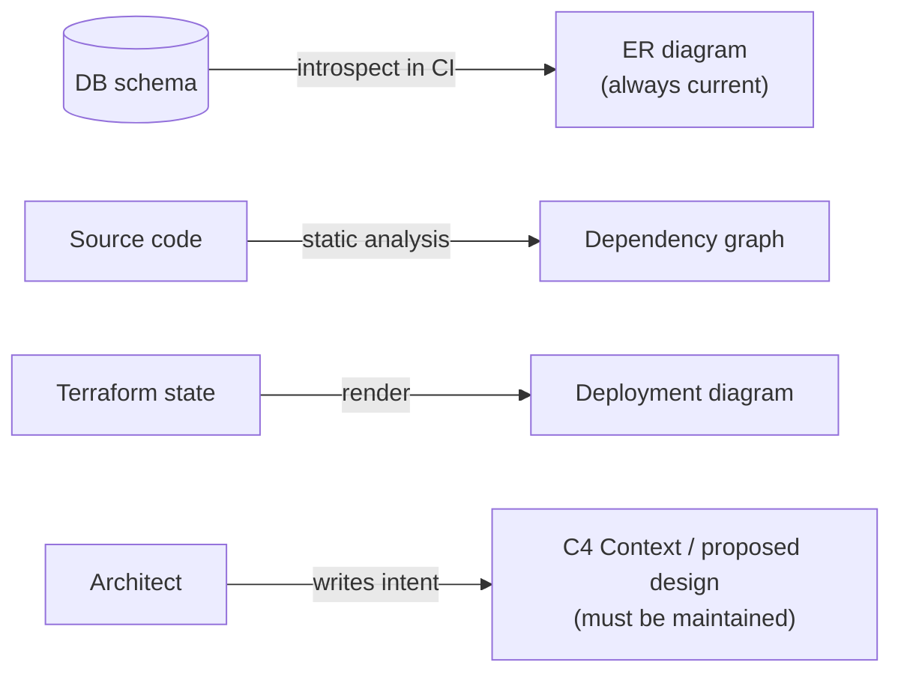
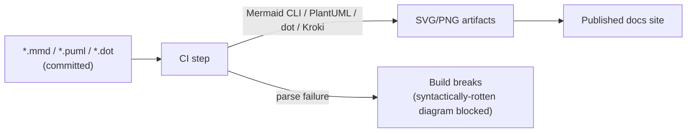
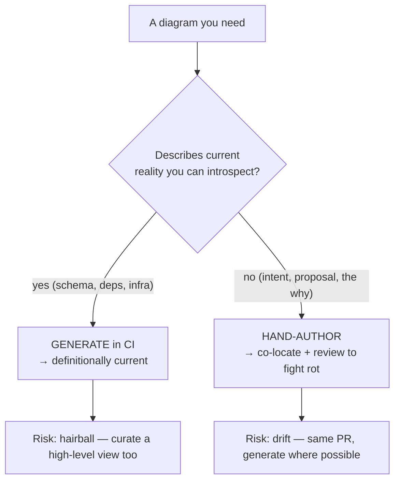
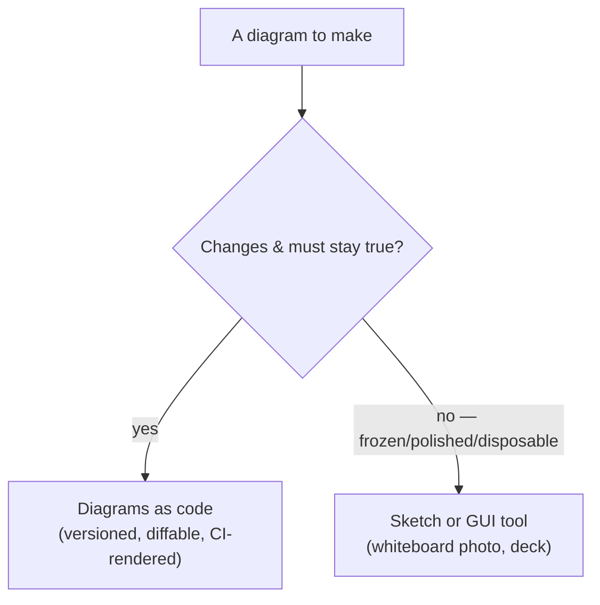

# Diagrams as Code — Senior

> **Category:** [Documentation](../README.md) — write architecture and flow diagrams in plain-text markup, commit them next to the code, and render them automatically — instead of pasting binary screenshots that rot.

> **Prerequisites:** [Junior](junior.md) · [Middle](middle.md)
> **Focus:** **Design trade-offs** and **system-level reasoning**

---

## Table of Contents

1. [Introduction](#introduction)
2. [Diagrams as Code vs. GUI Tools: The Real Trade-off](#diagrams-as-code-vs-gui-tools-the-real-trade-off)
3. [Auto-Layout: The Defining Limitation](#auto-layout-the-defining-limitation)
4. [Generated vs. Hand-Authored Diagrams](#generated-vs-hand-authored-diagrams)
5. [C4 at the System Level: Modeling vs. Drawing](#c4-at-the-system-level-modeling-vs-drawing)
6. [The "Big Ball of Mud" Diagram and How to Avoid It](#the-big-ball-of-mud-diagram-and-how-to-avoid-it)
7. [Diagrams Rot Too: The Maintenance Strategy](#diagrams-rot-too-the-maintenance-strategy)
8. [When NOT to Use Diagrams as Code](#when-not-to-use-diagrams-as-code)
9. [Rendering Architecture and CI Pipelines](#rendering-architecture-and-ci-pipelines)
10. [Notation Discipline at Scale](#notation-discipline-at-scale)
11. [Liabilities](#liabilities)
12. [Pros & Cons at the System Level](#pros--cons-at-the-system-level)
13. [Diagrams](#diagrams)
14. [Related Topics](#related-topics)

---

## Introduction

> Focus: **design trade-offs** and **system-level reasoning**

At the senior level, "diagrams as code" stops being a tooling preference and becomes a **stance on how architectural knowledge is captured, governed, and kept honest across a large organization over years.** The junior question was *how do I render a picture?* The middle question was *which abstraction level and tool?* The senior questions are harder:

1. **Where does diagrams-as-code's auto-layout limitation actually bite, and how do you design around it?**
2. **When should a diagram be *generated* from the system rather than hand-authored — and what's the trade?**
3. **How do you stop diagrams from rotting at scale, given that they are documentation and documentation rots?**
4. **When is diagrams-as-code the *wrong* tool, and a whiteboard photo or a polished GUI deck the right one?**

The senior throughline: diagrams-as-code is the *default* for living technical documentation, but it is **bounded** — by layout limits, by the cost of keeping it true, and by audiences and moments it doesn't serve.

---

## Diagrams as Code vs. GUI Tools: The Real Trade-off

The naive framing is "text good, GUI bad." The senior framing is that the two optimize for *different properties*, and you choose by which property dominates the diagram's purpose.

| Property | Diagrams as code | GUI tools (Lucidchart/draw.io/Visio) |
|---|---|---|
| **Synchronization with a changing system** | High — diffed and reviewed with the code | Low — manual, decays immediately |
| **Auditability** (who changed what, why) | High — `git blame`, PR history | None |
| **Layout precision / visual polish** | Limited (auto-layout) | High (hand-tuned) |
| **Authoring speed for a throwaway sketch** | Medium | High (fast for one-offs) |
| **Cost to keep N diagrams consistent** | Low with a model (Structurizr); medium otherwise | High — every diagram maintained by hand |
| **Accessibility to all engineers** | High — anyone can edit text | Lower — tool licenses, GUI skill |

The decision rule a senior internalizes:

> **If the diagram describes something that changes and must stay true, it belongs in code. If the diagram is a frozen artifact whose value is visual persuasion at a single moment, a GUI tool is fine.**

Architecture, sequences of live protocols, data models, deployment topologies — *changing, must-stay-true* — go in code. A board-deck "vision" slide, a one-off migration plan you'll throw away — *frozen, persuasion* — can be a polished GUI drawing. The mistake is using the wrong tool for the property that matters: a hand-drawn architecture diagram (rots) or a text diagram fought into a presentation centerpiece (fragile, ugly).

---

## Auto-Layout: The Defining Limitation

The single biggest technical objection to diagrams-as-code is real: **you give up control of layout.** A layout *engine* (dagre for Mermaid, Graphviz's algorithms, ELK, D2's engines) decides where boxes go and how arrows route. For small diagrams this is a gift; for large ones it produces crossings, awkward routing, and "spaghetti."

Senior mitigation strategies, in order of preference:

1. **Make the diagram smaller.** Ugly auto-layout is overwhelmingly a *symptom of a too-large diagram*. A diagram that won't lay out cleanly is usually answering more than one question — split it (this is the C4 discipline applied as a layout tool).
2. **Influence the engine.** Declaration order, direction (`TD`/`LR`), subgraphs/boundaries, and rank hints (`rank=same` in DOT) steer layout without abandoning code.
3. **Choose a better engine for the shape.** D2 and ELK lay out architecture diagrams more cleanly than dagre; Graphviz excels at large dependency graphs. The *syntax* and the *layout engine* are separable — pick the engine the graph wants.
4. **Accept "good enough."** A diagram that is 90% as pretty but always correct beats a pixel-perfect one that's six months stale. The point of the diagram is *truth and comprehension*, not beauty.

> The trade is explicit: you exchange **pixel-perfect control** for **synchronization, diffability, and zero-maintenance layout.** For documentation of a living system, that is almost always the right trade — but a senior names the trade rather than pretending the limitation doesn't exist.

---

## Generated vs. Hand-Authored Diagrams

There are two fundamentally different sources for a diagram-as-code, with opposite rot profiles:

| | **Hand-authored** | **Generated from the system** |
|---|---|---|
| Source | A human writes the markup | A tool reads code/config/runtime and emits markup |
| Examples | A Context diagram, a sequence of a proposed design | ER diagram from a DB schema; dependency graph from imports; deployment from Terraform; class diagram from code |
| Accuracy | As good as the author's diligence — **can rot** | **Cannot rot** — it's derived from the source of truth |
| Best for | *Intent, proposals, the future, the why* | *Current reality, the as-is, the what* |
| Risk | Drifts from reality | Too detailed/noisy; shows *what* but not *why* |

The senior insight is that **generation eliminates rot by construction**: if your ER diagram is regenerated from the live schema in CI, it is *definitionally* current. So the question for any "as-is" diagram is: *can I generate this instead of drawing it?*

But generated diagrams have their own failure mode: they show **everything**, which is **nothing**. An auto-generated dependency graph of a 500-class module is a hairball — accurate and useless. Generation gives you *truth*; it does not give you *abstraction*. Reserve generation for diagrams whose value is current detail (schemas, dependencies) and hand-author the ones whose value is curated meaning (C4 Context, proposed designs). Often the best system uses both: a generated low-level reference plus a hand-curated high-level overview.

---

## C4 at the System Level: Modeling vs. Drawing

The deep payoff of C4 + diagrams-as-code at scale is treating architecture as a **model, not a set of pictures.** With Structurizr's "one model, many views," the architecture description becomes a single source of truth from which views are *projected*:

- Add a new container once → it appears in every view that includes it.
- The relationships are stated once → no two diagrams can contradict each other.
- The model can be **validated** (no orphan elements, naming conventions enforced) the way you'd lint code.
- The model can live in the **architecture-as-code** lineage alongside [ADRs](../05-architecture-decision-records-adrs/senior.md) and [design docs](../06-design-docs-and-rfcs/senior.md), giving a coherent "this is our system, and here's why" corpus.

The contrast with hand-drawn-per-view (raw Mermaid/PlantUML) is a *consistency* trade: per-view files are simpler to start but require human discipline to keep the Context, Container, and Component diagrams agreeing with each other; a model guarantees it. At a small scale, per-view is fine. At organization scale — dozens of systems, many teams — the model approach is what prevents the diagram corpus from fragmenting into mutually-contradictory pictures.

> System-level reframing: diagrams-as-code lets you stop *drawing your architecture* and start *modeling* it — and a model can be queried, validated, versioned, and projected, none of which a drawing can.

---

## The "Big Ball of Mud" Diagram and How to Avoid It

Every organization accumulates the dreaded diagram: forty boxes, a hundred arrows, no legend, no abstraction level, "the architecture" that no one can read and everyone fears to touch. Diagrams-as-code does **not** prevent this — you can write a big ball of mud in Mermaid as easily as in Visio. Avoiding it is a *discipline*, not a tool feature:

| Mud symptom | Discipline that prevents it |
|---|---|
| Boxes at mixed abstraction levels | **C4** — one zoom level per diagram |
| One diagram answering many questions | **One diagram, one question, one audience** |
| Arrows with no defined meaning | A **legend / consistent notation**; label relationships |
| Diagram grows without bound | **Decompose** — Context → Container → per-container Component |
| Everyone afraid to edit it | It's *code* — small PRs, reviewed, owned |

The senior move when handed a mud diagram is the same as with mud code: **decompose by abstraction level.** Replace the one giant picture with a C4 Context plus a handful of focused Container/Component views. The total information is the same; the *comprehensibility per diagram* is vastly higher because each now answers exactly one question.

---

## Diagrams Rot Too: The Maintenance Strategy

This is the senior's most important honest admission: **diagrams-as-code resists rot but does not defeat it.** A hand-authored Container diagram is documentation; if the system gains a message queue and nobody edits the diagram, it's wrong — diffable, versioned, reviewable, and *wrong*. The advantages reduce rot (it's in the PR, it's diffable) but they don't make a human update it.

A real anti-rot strategy combines several mechanisms:

1. **Generate the as-is wherever possible** (schemas, dependencies, deployment) — generated diagrams can't rot. Maximize this fraction.
2. **Co-locate hand-authored diagrams with the code they describe** so a code change and a diagram change land in the *same* PR — the reviewer sees the diagram is stale.
3. **Make staleness reviewable.** A PR that changes the container topology but not `container.mmd` is a flag a reviewer (or a CODEOWNERS rule) can catch.
4. **Render in CI** so a diagram that fails to parse breaks the build — at minimum, syntactically-rotten diagrams can't merge.
5. **Date or version high-level diagrams** and review them at known cadences (e.g., during architecture review), accepting they need periodic human attention.
6. **Delete diagrams that aren't worth maintaining.** A wrong diagram is worse than no diagram — it actively misleads. Fewer, true diagrams beat many, stale ones.

This is the same fight as [Keeping Docs Alive](../11-keeping-docs-alive-and-doc-rot/senior.md), specialized to pictures: the closer the diagram lives to its single source of truth — ideally *generated from it* — the slower it rots.

---

## When NOT to Use Diagrams as Code

A senior knows the tool's boundaries. Diagrams-as-code is the wrong choice when:

- **A quick hand-drawn sketch is the right tool.** During a design conversation at a whiteboard, the *thinking* is the point and friction kills it. Sketch by hand; photograph it *if* it's a transient artifact. (Just don't paste that photo into permanent docs and call it documentation — that's the rotting screenshot.)
- **The audience demands visual polish.** A board deck, a sales diagram, a conference keynote — the value is persuasion and aesthetics at a single frozen moment. A GUI tool's hand-tuned layout wins; sync doesn't matter because the artifact won't change.
- **The diagram is genuinely one-off and disposable.** A migration plan you'll discard next week doesn't need to be in version control. Don't pay the markup tax for something with no future.
- **Hand-tuned layout is essential to comprehension.** Some complex spatial diagrams (a precise network topology, a physical rack layout) need exact placement auto-layout can't give.

> The discriminator is the same trade as always: *does this diagram change and need to stay true?* If yes → code. If it's a frozen, polished, or disposable artifact → a sketch or a GUI tool is the right tool, and insisting on code is dogma.

---

## Rendering Architecture and CI Pipelines

At the system level, *how* diagrams render matters for reliability and consistency:

- **Native rendering** (Mermaid on GitHub/GitLab) — zero infrastructure, but limited to Mermaid and to the platform's viewer.
- **Build-time rendering in CI** — a pipeline step runs `mmdc` (Mermaid CLI), `plantuml.jar`, `dot`, `d2`, or the Structurizr CLI to emit SVG/PNG into the published docs site. Decouples you from the platform's renderer and supports any syntax.
- **A render service (Kroki)** — one HTTP endpoint renders Mermaid, PlantUML, Graphviz, D2, and more. This is the senior choice when a team uses *several* syntaxes: the pipeline calls one service instead of installing five toolchains.

The architectural point: rendering belongs in the **docs-as-code pipeline** ([Docs as Code & Tooling](../10-docs-as-code-and-tooling/senior.md)). Diagrams-as-code is not a separate practice — it's the *image-producing* part of the same CI that lints prose, checks links, and publishes the site.

---

## Notation Discipline at Scale

When dozens of engineers author diagrams, *consistency* becomes the dominant quality. Senior-level governance:

- **Adopt one notation per concern** — e.g., C4 for architecture, standard UML sequence for protocols — so any diagram is decodable without a per-author legend.
- **Standardize meaning of arrows.** "Solid = synchronous call, dashed = async/event" decided once, org-wide.
- **Provide templates and shared includes** (a C4-PlantUML include, a Structurizr base workspace, a Mermaid theme) so diagrams look and behave consistently.
- **Lint the diagrams** where possible — Structurizr can validate the model; CI can reject diagrams that don't parse or that violate naming rules.

Consistency is the difference between a *diagram corpus* (a navigable, decodable map of the system) and a *pile of pictures* (each requiring re-learning its private conventions). At scale, the notation discipline matters more than the tool choice.

---

## Liabilities

### Liability 1: Treating diagrams-as-code as rot-proof

It isn't. Hand-authored diagrams drift like any documentation; the win is reduced friction and reviewability, not immunity. Teams that believe "it's in Git so it's current" ship confidently-wrong diagrams. Generate the as-is, co-locate the rest, and accept the maintenance cost.

### Liability 2: The generated hairball

Auto-generating a class or dependency diagram for a large module yields an accurate, unreadable mess. Generation gives truth, not abstraction. Curate (hand-author) the high-level views; reserve generation for reference detail.

### Liability 3: Fighting auto-layout instead of decomposing

Hours spent wrestling a layout engine to lay out a forty-box diagram are hours that should have been spent *splitting the diagram*. Ugly layout is a decomposition signal, not a tooling defect.

### Liability 4: Tool sprawl

Five diagramming syntaxes across a repo means five toolchains in CI, five things to learn, and inconsistent output. Standardize on a small set (e.g., Mermaid + C4-PlantUML/Structurizr) and a single render path (Kroki).

### Liability 5: Dogma over judgement

Insisting *every* diagram be code — including the whiteboard sketch and the board deck — wastes effort and produces worse artifacts. The trade-off is conditional on "changes and must stay true."

---

## Pros & Cons at the System Level

| Dimension | Diagrams as Code | GUI Drawing Tools |
|---|---|---|
| Sync with a changing system | **High** (diffed, reviewed, generatable) | Low (manual, decays) |
| Auditability / provenance | **High** (Git history) | None |
| Consistency across many diagrams | **High with a model** (Structurizr) | Low (per-diagram effort) |
| Visual polish / layout precision | Limited (auto-layout) | **High** |
| Speed for a throwaway sketch | Medium | **High** |
| Resistance to rot | **High** (esp. generated) — not immune | Low |
| Infra/toolchain cost | Some (CI render step) | None (just the app) |
| Best for | Living technical documentation | Frozen, polished, one-off visuals |

The senior stance crystallized: **diagrams-as-code wins every row that matters for documentation of a living system** — sync, auditability, consistency, rot-resistance — and *loses* exactly on polish, throwaway-speed, and hand-tuned layout, which matter only for frozen or disposable artifacts. So you make it the default for the system's living documentation and consciously reach for a sketch or GUI tool for the artifacts whose value is a single polished moment.

---

## Diagrams

### Generated (can't rot) vs. hand-authored (must be maintained)

### Code or GUI? The discriminator

---

## Related Topics

- **The pipeline that renders these:** [Docs as Code & Tooling](../10-docs-as-code-and-tooling/senior.md).
- **Diagrams embed in:** [Design Docs & RFCs](../06-design-docs-and-rfcs/senior.md), [ADRs](../05-architecture-decision-records-adrs/senior.md), [Runbooks](../07-runbooks-and-operational-docs/senior.md).
- **The rot they fight (and share):** [Keeping Docs Alive](../11-keeping-docs-alive-and-doc-rot/senior.md).

---

---

## Check your understanding

1. Explain Diagrams as Code — Senior Level in your own words and name the problem it solves.
2. How would you apply the ideas around Table of Contents, Introduction, Diagrams as Code vs. GUI Tools: The Real Trade-off in a realistic engineering change?
3. What failure mode or misuse should you look for, and what evidence would reveal it?
4. How would you validate a system-level decision about Diagrams as Code — Senior Level under uncertainty?
5. What observable result would convince you that the approach improved the system?
