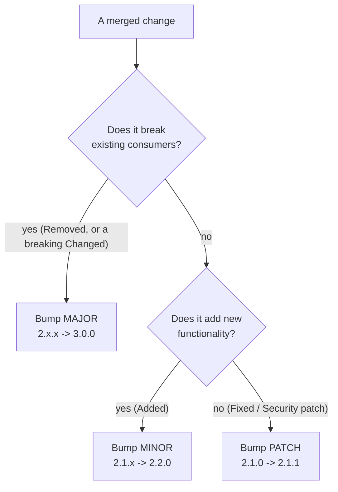
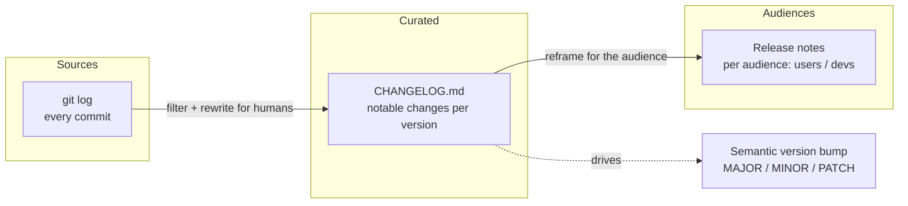

# Changelogs & Release Notes — Junior

> **Category:** [Documentation](../README.md) — communicating *what changed* between versions to the humans who must decide whether and how to upgrade.

---

## Table of Contents

1. [Introduction](#introduction)
2. [Prerequisites](#prerequisites)
3. [Glossary](#glossary)
4. [Three Things People Confuse: Changelog vs Release Notes vs Git Log](#three-things-people-confuse-changelog-vs-release-notes-vs-git-log)
5. [Keep a Changelog: The Canonical Format](#keep-a-changelog-the-canonical-format)
6. [A Real, Well-Formed CHANGELOG.md](#a-real-well-formed-changelogmd)
7. [Semantic Versioning](#semantic-versioning)
8. [How Semver Ties to the Changelog Categories](#how-semver-ties-to-the-changelog-categories)
9. [Writing a Good Changelog Entry](#writing-a-good-changelog-entry)
10. [Where These Live](#where-these-live)
11. [Best Practices](#best-practices)
12. [Common Mistakes](#common-mistakes)
13. [Tricky Points](#tricky-points)
14. [Test Yourself](#test-yourself)
15. [Cheat Sheet](#cheat-sheet)
16. [Summary](#summary)
17. [Further Reading](#further-reading)
18. [Related Topics](#related-topics)
19. [Diagrams](#diagrams)

---

## Introduction

> Focus: **What is it?** and **How to use it?**

When you ship a new version of a library, a service, or an app, someone on the other end has to decide: *Should I upgrade? What will break if I do? What do I get?* A **changelog** is the document that answers those questions. It is a curated, human-readable list of the notable changes in each released version, newest version first.

> A **changelog** is a curated, chronological record of notable changes in a project, organized by version, written **for humans** who need to decide whether and how to upgrade.

The key words are *curated* and *for humans*. A changelog is **not** an automatic dump of every commit, and it is **not** a marketing announcement. It sits in the middle: more readable than raw history, more honest and complete than a press release.

### Why this matters

Every dependency you pull in has a changelog (or should). The first time you bump a library from `2.4.0` to `3.0.0` and your build breaks, you will go straight to its changelog to find out *what* broke and *how to fix it*. When you maintain code others depend on, **you are on the other side of that exact moment** — and a good changelog is the difference between a five-minute upgrade and a lost afternoon. Writing changelogs well is a core part of being a considerate engineer.

---

## Prerequisites

- **Required:** Basic Git — you know what a commit, a tag, and history are.
- **Required:** You have used a package version like `1.4.2` (npm, pip, Maven, Go modules — any of them).
- **Helpful:** Familiarity with a project's **[README](../03-readmes-and-onboarding-docs/junior.md)**, since the README usually points to the changelog.
- **Helpful:** Having once been *burned* by an upgrade that broke silently — it makes the motivation visceral.

---

## Glossary

| Term | Definition |
|------|-----------|
| **Changelog** | A curated, per-version list of notable changes, for humans, newest first. Lives as `CHANGELOG.md`. |
| **Release notes** | The audience-facing narrative for a *specific* release — often friendlier/marketing-flavored, aimed at end users. |
| **Git log** | The raw, uncurated commit history. Machine-complete, human-noisy. *Not* a changelog. |
| **Semantic Versioning (semver)** | A versioning scheme `MAJOR.MINOR.PATCH` where each number has a precise, promised meaning. |
| **Breaking change** | A change that requires consumers to modify their code/config to keep working. Forces a MAJOR bump. |
| **Unreleased** | The changelog section collecting changes merged but not yet shipped in a tagged version. |
| **Deprecation** | Marking a feature as "still works, but going away" — a warning before removal. |
| **Conventional Commits** | A commit-message convention (`feat:`, `fix:`, …) that lets tools generate changelogs and pick version numbers automatically. |
| **Migration guide** | Step-by-step instructions for moving across a breaking change. The most valuable part of a major release. |

---

## Three Things People Confuse: Changelog vs Release Notes vs Git Log

Beginners (and plenty of teams) treat these as the same thing. They are not, and conflating them is the single most common mistake in this topic.

| | **Git log** | **Changelog** | **Release notes** |
|---|---|---|---|
| **Audience** | Machines / maintainers | Developers & technical users deciding *whether/how to upgrade* | End users (often non-technical) |
| **Curated?** | No — every commit | Yes — only *notable* changes | Yes — only what the audience cares about |
| **Tone** | Terse, technical | Neutral, precise | Friendly, sometimes marketing-flavored |
| **Granularity** | Per commit | Per version | Per release (one narrative) |
| **Example line** | `fix typo in var name (a3f1c9)` | `### Fixed — Login form rejected valid emails with a + sign (#812)` | "Logging in is now more reliable — and faster." |
| **Lives in** | `git log` / the repo's history | `CHANGELOG.md` in the repo | GitHub Releases, a blog, in-app, email |

```
        RAW                  CURATED FOR DEVS           CURATED FOR USERS
   ┌───────────┐  filter +  ┌──────────────┐  reframe  ┌──────────────┐
   │  git log  │ ─────────▶ │ CHANGELOG.md │ ────────▶ │ release notes│
   │ every     │  rewrite   │ notable      │  for the  │ what it means│
   │ commit    │            │ changes      │  audience │ to the user  │
   └───────────┘            └──────────────┘           └──────────────┘
```

The mental model: the git log is the *source material*, the changelog is the *edited record*, and the release notes are the *story you tell a particular audience*. A changelog might say `Fixed: race condition in the connection pool that could drop requests under load (#1290)`. The release note for the same fix might say "We squashed a bug that occasionally caused timeouts during traffic spikes." Same underlying change, different audience, different words.

---

## Keep a Changelog: The Canonical Format

You do not have to invent a changelog format. There is a widely adopted convention called **[Keep a Changelog](https://keepachangelog.com)** (created by Olivier Lacan) that almost the entire open-source world follows. Learn it once and you will recognize it everywhere.

Its guiding principle, stated on the first line of the spec:

> **Changelogs are for humans, not machines.**

The rules that matter:

1. **One entry per version**, listed **reverse-chronologically** (newest at the top). A reader scanning from the top sees the latest news first.
2. **An `[Unreleased]` section at the very top**, where you accumulate changes as they merge, *before* they ship. When you cut a release, you rename that section to the version and date.
3. **Group changes by type**, using exactly these six headings:

   | Heading | Use for |
   |---|---|
   | **Added** | New features |
   | **Changed** | Changes to existing functionality |
   | **Deprecated** | Features soon to be removed |
   | **Removed** | Features removed in this version |
   | **Fixed** | Bug fixes |
   | **Security** | Vulnerabilities fixed (mention the CVE if there is one) |

4. **Use ISO dates** — `YYYY-MM-DD` (e.g., `2026-06-11`), which is unambiguous worldwide (no "is 03/04 March or April?" confusion).
5. **Link the versions** at the bottom so each version header can jump to its diff/tag.

That is the whole format. Six categories, newest-first, an Unreleased section, ISO dates, links.

---

## A Real, Well-Formed CHANGELOG.md

Here is what a correct file looks like. Study it — you will write dozens of these.

```markdown
# Changelog

All notable changes to this project are documented in this file.
The format is based on [Keep a Changelog](https://keepachangelog.com/en/1.1.0/),
and this project adheres to [Semantic Versioning](https://semver.org/).

## [Unreleased]

### Added
- `--dry-run` flag for `deploy` that previews changes without applying them.

### Fixed
- Config loader no longer crashes when `timeout` is omitted (#1342).

## [2.1.0] - 2026-05-20

### Added
- Retry with exponential backoff for transient HTTP 5xx responses (#1287).
- `Client.with_timeout(seconds)` builder method.

### Changed
- Default connection pool size raised from 5 to 10.

### Deprecated
- `Client.set_timeout()` — use `Client.with_timeout()`; removal planned for 3.0.0.

### Fixed
- Race condition in the connection pool that could drop requests under load (#1290).

## [2.0.0] - 2026-03-02

### Removed
- **BREAKING:** Dropped the synchronous `fetch()` API. Use `async fetch()`.
  See the v2 migration guide.

### Changed
- **BREAKING:** `Client(config)` now requires an explicit `region`.

### Security
- Patched header-injection vulnerability in the request builder (CVE-2026-0011).

[Unreleased]: https://github.com/acme/widget/compare/v2.1.0...HEAD
[2.1.0]: https://github.com/acme/widget/compare/v2.0.0...v2.1.0
[2.0.0]: https://github.com/acme/widget/compare/v1.9.3...v2.0.0
```

Notice: newest at the top; an `Unreleased` bucket; the six headings; ISO dates; breaking changes flagged loudly and pointing at a migration guide; the link footer at the bottom. This file tells a reader *exactly* what they need to know to upgrade safely.

---

## Semantic Versioning

A version number is not decoration — under **[Semantic Versioning](https://semver.org)** (semver) it is a **promise about compatibility**. The format is:

```
MAJOR . MINOR . PATCH
  2   .   1   .   0
```

> **Version is a communication tool.** The number tells consumers, before they read a single word of your changelog, how risky an upgrade is.

The rules for bumping (given a release that changes behavior):

| Bump | When | Meaning to consumers |
|---|---|---|
| **MAJOR** (`2.0.0`) | You make an **incompatible / breaking** change | "Read carefully — your code may need changes." |
| **MINOR** (`2.1.0`) | You add functionality in a **backward-compatible** way | "Safe to upgrade; new things are available." |
| **PATCH** (`2.0.1`) | You make a **backward-compatible bug fix** | "Safe to upgrade; only fixes, no new behavior." |

Two more pieces of the spec to know:

- **Pre-release** versions append a hyphen: `2.0.0-alpha.1`, `2.0.0-rc.2`. These signal "not stable yet" and sort *before* the final `2.0.0`.
- **Build metadata** appends a plus: `2.0.0+20260611` or `1.4.2+build.7`. It is ignored when comparing precedence — purely informational.

### The `0.y.z` caveat

Anything starting with `0.` (like `0.7.3`) is explicitly **"anything may change at any time."** Initial development. The compatibility promises above kick in only at `1.0.0`. So when you see `0.x` in a dependency, assume *every* upgrade can break you — and when *you* hit a stable public API, release `1.0.0` to start making the promise.

---

## How Semver Ties to the Changelog Categories

The two specs are designed to work together. The *kind* of change you record in the changelog tells you which number to bump:



| Changelog category | Typical semver effect |
|---|---|
| **Removed**, or **Changed** in a breaking way | **MAJOR** |
| **Added** (new, backward-compatible) | **MINOR** |
| **Deprecated** (still works, just warned) | **MINOR** (nothing broke *yet*) |
| **Fixed** (backward-compatible) | **PATCH** |
| **Security** (backward-compatible fix) | **PATCH** (MAJOR if the fix itself breaks something) |

This is the practical link: when you decide a change belongs under **Removed** or is a breaking **Changed**, you have *also* decided the next release is a MAJOR. The categories and the version number tell one consistent story.

---

## Writing a Good Changelog Entry

The format is easy; *good entries* take a little care. The reader of an entry is a developer trying to decide whether a change affects them. Write to that person.

**Bad entries (say nothing):**

```markdown
### Fixed
- Bug fixes
- Various improvements
- Fixed stuff
```

These are worthless — the reader learns nothing about *whether they're affected*.

**Good entries (specific, actionable):**

```markdown
### Fixed
- `parseDate()` no longer throws on dates before 1970 (#704).
- CLI now exits with code 1 (was 0) when a config file is missing,
  so CI pipelines correctly fail on misconfiguration.
```

A good entry answers: **what changed, who it affects, and — if action is needed — what to do.** When a change is breaking, the "what to do" is the whole point: link a migration guide.

> Rule of thumb: write the entry so a developer who has *never seen your codebase* can tell whether this version affects them. If they can't, the entry is too vague.

---

## Where These Live

| Artifact | Lives | Why there |
|---|---|---|
| **CHANGELOG.md** | Root of the repo, in version control | Travels with the code; reviewable in PRs; treated as [docs-as-code](../10-docs-as-code-and-tooling/junior.md) |
| **Release notes** | GitHub/GitLab Releases, blog, in-app banner, email | Where the *audience* is |
| **Migration guides** | Their own docs files (e.g., `docs/migrations/v2.md`) | Long-form; one per breaking release |
| **Pointer to the changelog** | The [README](../03-readmes-and-onboarding-docs/junior.md) | The README is the front door; it links to the changelog |

The most important habit: **`CHANGELOG.md` belongs in the repository**, edited in the same pull request as the change it describes. Doing it later, from memory, is how changelogs rot and lie.

---

## Best Practices

1. **Keep `CHANGELOG.md` in the repo**, updated in the same PR as the change — not reconstructed at release time.
2. **Follow Keep a Changelog**: Unreleased section, six categories, reverse-chronological, ISO dates.
3. **Bump the version by semver rules**: breaking → MAJOR, new feature → MINOR, fix → PATCH.
4. **Write for the human upgrading**, not for yourself. Every entry should let a stranger judge whether it affects them.
5. **Flag breaking changes loudly** and link a migration guide right there in the entry.
6. **Never dump the raw git log.** Curate: drop "fix typo," "wip," and merge commits; keep what users notice.
7. **Reference issues/PRs** (`#1290`) so readers can dig deeper.

---

## Common Mistakes

1. **Dumping `git log` as the changelog.** Raw commits are noisy, full of "wip" and typo fixes, and written for the author, not the reader.
2. **Empty entries.** "Bug fixes and improvements" tells the reader nothing — the cardinal sin.
3. **No Unreleased section**, so changes are scrambled together from memory at release time and things get missed.
4. **Versioning by feeling.** Bumping MINOR for a breaking change (or MAJOR "because it feels big") breaks the semver promise consumers rely on.
5. **Ambiguous dates** (`06/05/26` — which is which?). Always ISO `YYYY-MM-DD`.
6. **No upgrade guidance on breaking changes.** Saying "removed `fetch()`" without saying "use `async fetch()` instead" leaves the reader stranded.
7. **Treating the changelog and release notes as the same thing** — pasting a marketing blurb into `CHANGELOG.md`, or dumping technical entries into a user-facing announcement.

---

## Tricky Points

- **A changelog is *curated*, a git log is *complete*.** They are different artifacts with different jobs. You will hear "just generate it from git" — that's only good *if* commits are disciplined (see [Conventional Commits](middle.md)).
- **"Notable" is a judgment call.** A typo fix in a comment is not notable; a fix to a public function's behavior is. Ask: "would a user or downstream developer notice or care?"
- **Deprecation is not removal.** A deprecated feature *still works*; it is a warning that it will go away. Deprecating is a MINOR bump; *removing* is MAJOR.
- **`0.x` makes no promises.** Before `1.0.0`, every upgrade can break you, by spec. This trips up people who assume `0.5 → 0.6` is "minor and safe."
- **The Unreleased section is your friend.** Adding the entry when you write the change (not at release) is what keeps the changelog accurate.

---

## Test Yourself

1. In one sentence each, distinguish a git log, a changelog, and release notes by *audience*.
2. List the six Keep a Changelog categories.
3. What does each part of `MAJOR.MINOR.PATCH` mean when you bump it?
4. You removed a public function. What semver bump is that, and which changelog category?
5. Why is `2026-06-11` a better date format than `06/11/2026`?
6. What is the `[Unreleased]` section for?
7. Why is "various bug fixes" a bad changelog entry?

---

## Cheat Sheet

```text
THREE ARTIFACTS (don't confuse them)
  git log        every commit, raw, for machines/maintainers
  CHANGELOG.md   curated notable changes per version, for devs upgrading
  release notes  the story for a specific audience (often end users)

KEEP A CHANGELOG
  - newest version first; [Unreleased] section at the top
  - six categories: Added Changed Deprecated Removed Fixed Security
  - ISO dates YYYY-MM-DD; link versions at the bottom
  - "Changelogs are for humans, not machines"

SEMVER  MAJOR.MINOR.PATCH
  MAJOR  breaking change          (Removed / breaking Changed)
  MINOR  backward-compat feature  (Added; also Deprecated)
  PATCH  backward-compat fix      (Fixed / Security)
  0.x.y  = anything may change;  pre-release: 2.0.0-rc.1

GOOD ENTRY = what changed + who it affects + what to do (if breaking)
```

---

## Summary

- A **changelog** is a *curated, per-version, human-readable* record of notable changes — distinct from a raw **git log** (every commit, for machines) and from **release notes** (the audience-facing story for one release).
- **Keep a Changelog** is the canonical format: newest first, an `[Unreleased]` section, six categories (Added/Changed/Deprecated/Removed/Fixed/Security), ISO dates, linked versions, written for humans.
- **Semantic Versioning** makes the version number a *promise*: MAJOR = breaking, MINOR = compatible feature, PATCH = compatible fix; `0.x` promises nothing.
- The changelog category and the semver bump tell **one consistent story**: Removed/breaking-Changed → MAJOR, Added → MINOR, Fixed → PATCH.
- Good entries say *what changed, who it affects, and what to do*; breaking changes link a migration guide. Keep `CHANGELOG.md` in the repo, updated in the same PR as the change.

---

## Further Reading

- [Keep a Changelog](https://keepachangelog.com) — Olivier Lacan's canonical format spec.
- [Semantic Versioning 2.0.0](https://semver.org) — the precise versioning contract.
- [Conventional Commits](https://www.conventionalcommits.org) — the commit convention that automates changelogs (covered at [Middle](middle.md)).
- [GitHub: About releases](https://docs.github.com/en/repositories/releasing-projects-on-github) — where release notes live on GitHub.

---

## Related Topics

- **The README links to the changelog:** [READMEs & Onboarding](../03-readmes-and-onboarding-docs/junior.md)
- **Changelogs live in the repo as docs-as-code:** [Docs as Code & Tooling](../10-docs-as-code-and-tooling/junior.md)
- **Versioned reference docs:** [API & Reference Documentation](../04-api-and-reference-documentation/junior.md)

---

## Diagrams




---

## Check your understanding

1. Explain Changelogs & Release Notes — Junior Level in your own words and name the problem it solves.
2. How would you apply the ideas around Table of Contents, Introduction, Prerequisites in a realistic engineering change?
3. What failure mode or misuse should you look for, and what evidence would reveal it?
4. What small example would prove that you can apply Changelogs & Release Notes — Junior Level correctly?
5. What observable result would convince you that the approach improved the system?
