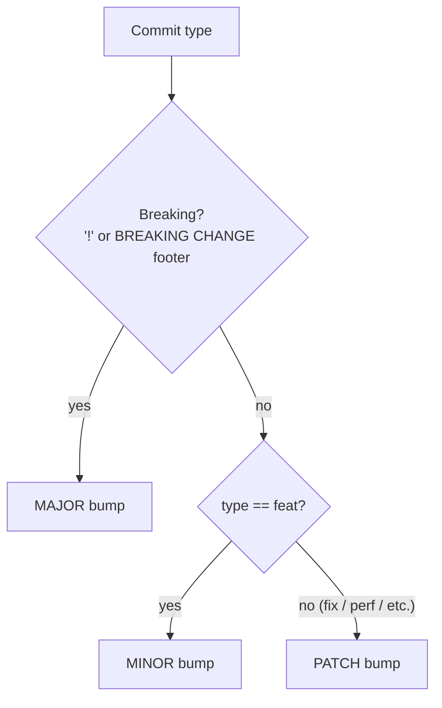
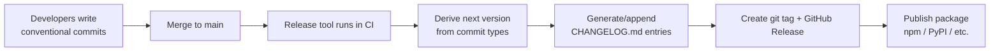
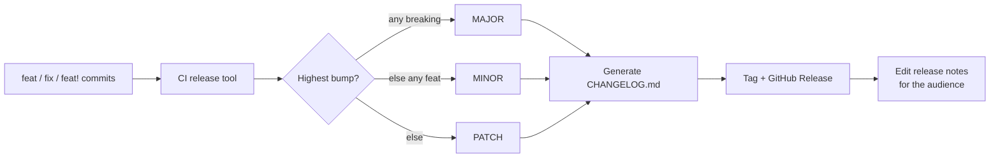

# Changelogs & Release Notes — Middle

> **Category:** [Documentation](../README.md) — communicating *what changed* between versions to the humans who must decide whether and how to upgrade.

> **Prerequisite:** [Junior](junior.md)
> **Focus:** **Why** and **When**

---

## Introduction

> Focus: **Why** and **When**

At the junior level you learned to *write* a changelog by hand and to pick a version number by the semver rules. That works, but it has two failure modes that scale badly: it is **tedious** (someone has to remember to edit `CHANGELOG.md` every PR) and it is **error-prone** (someone has to correctly judge the semver bump every release). On a busy repo with many contributors, both decay.

The middle-level question is: **how do we make the changelog and the version number a near-automatic byproduct of work we already do?** The answer is a chain: discipline the *commit messages* with a convention, then let a tool read those messages to derive the version bump, generate the changelog, and tag the release. This is the **Conventional Commits → semver → changelog → release** pipeline, and understanding it — including when *not* to use it — is the core of this level.

---

## Conventional Commits: A Grammar for Commit Messages

> **Conventional Commits** is a lightweight convention that gives commit messages a *structure a machine can parse* while staying readable to humans.

The format ([conventionalcommits.org](https://www.conventionalcommits.org)):

```
<type>[optional scope][optional !]: <description>

[optional body]

[optional footer(s)]
```

Concrete examples:

```
feat(auth): add OAuth2 device-flow login
fix(parser): handle empty input without panicking
docs: clarify retry configuration in README
refactor(core): extract connection pool into its own module
feat(api)!: rename `list()` to `listAll()`

BREAKING CHANGE: `list()` is removed; callers must use `listAll()`.
```

The pieces:

| Element | Meaning |
|---|---|
| **type** | The *kind* of change. Common types: `feat`, `fix`, `docs`, `style`, `refactor`, `perf`, `test`, `build`, `ci`, `chore`. |
| **scope** | Optional area touched, in parentheses: `(auth)`, `(parser)`. Helps group changelog entries. |
| **`!`** | A breaking change, flagged right in the header: `feat!:` or `feat(api)!:`. |
| **description** | A short, imperative summary ("add", not "added"). |
| **body** | Optional longer explanation of *what* and *why*. |
| **footer** | Metadata: `BREAKING CHANGE: …`, `Refs: #123`, `Co-Authored-By:`. |

The two types that drive everything are **`feat`** (a new feature) and **`fix`** (a bug fix). The breaking-change signal is either the `!` in the header **or** a `BREAKING CHANGE:` footer — either one is sufficient.

> The whole point: a human reads `feat(auth): add device-flow login` and understands it instantly; a *tool* reads the same line, sees `feat`, and knows this is a backward-compatible feature → a MINOR bump → an "Added" changelog entry. One disciplined sentence serves both readers.

---

## How Conventional Commits Encode a Semver Bump

The convention's most important property: the commit *type* maps directly onto the semver bump. This is the bridge between the two specs you learned separately.



| Commit | Semver bump | Lands in changelog under |
|---|---|---|
| `feat: …` | **MINOR** | Added |
| `fix: …` | **PATCH** | Fixed |
| `perf: …` | **PATCH** | (often Changed/Performance) |
| any type with `!` or `BREAKING CHANGE:` | **MAJOR** | the relevant section, flagged breaking |
| `docs:`, `chore:`, `test:`, `ci:`, `style:`, `refactor:` | **none** (no release) | usually omitted from the changelog |

This mapping is *why* Conventional Commits exists. The tool scans the commits since the last release, finds the **highest-priority** bump implied by any of them (one `feat!` makes the whole release a MAJOR, even amid a hundred `fix`es), and that determines the next version automatically.

---

## The Automation Pipeline

Put the pieces together and you get a hands-off release pipeline:



The flow, step by step:

1. Developers write conventional commits as normal work. No extra ceremony.
2. On merge to the release branch, a tool (in CI) reads every commit since the last tag.
3. It computes the bump: any breaking → MAJOR; else any `feat` → MINOR; else PATCH.
4. It generates changelog entries from the commit subjects/bodies, grouped by type.
5. It bumps the version, commits the updated `CHANGELOG.md`, and creates a git tag.
6. It publishes the GitHub/GitLab Release (using the new entries as release notes) and, optionally, the package to its registry.

The version number and changelog become **derived artifacts** — never hand-edited, always consistent with the commit history. The cost of a release drops to "merge the PR."

---

## A Worked Example: Commits to Changelog to Release

Suppose the last release was `2.1.0`. Since then, these commits landed on `main`:

```
feat(client): add streaming response support
fix(retry): respect Retry-After header on 429 responses
fix(config): don't crash when LOG_LEVEL is unset
perf(parser): cut allocation in the hot path by 40%
docs: expand the quickstart
chore: bump dev dependencies
feat(auth)!: require explicit `scopes` in Client(...)

BREAKING CHANGE: Client() now requires a `scopes` argument.
Pass `scopes=["read"]` to preserve the previous default.
```

The release tool reasons: there is a `!`/`BREAKING CHANGE` → the bump is **MAJOR** → next version is **`3.0.0`** (not `2.2.0`). It then generates:

```markdown
## [3.0.0] - 2026-06-11

### Added
- **client:** add streaming response support (#1501)
- **auth:** require explicit `scopes` in `Client(...)` (#1520)

### Fixed
- **retry:** respect `Retry-After` header on 429 responses (#1508)
- **config:** don't crash when `LOG_LEVEL` is unset (#1512)

### Performance
- **parser:** cut allocation in the hot path by 40% (#1510)

### ⚠ BREAKING CHANGES
- `Client()` now requires a `scopes` argument.
  Pass `scopes=["read"]` to preserve the previous default.
```

Note what was *dropped*: the `docs:` and `chore:` commits don't appear — they're not notable to a consumer. This is curation done by convention rather than by hand. The `BREAKING CHANGES` block is lifted verbatim from the footer, which is exactly why you write that footer carefully.

---

## The Tooling Landscape

Several mature tools implement this pipeline. They differ mostly in ecosystem and philosophy.

| Tool | Ecosystem | Style | Notes |
|---|---|---|---|
| **semantic-release** | Node (works for any repo) | Fully automated, opinionated | Computes version, generates notes, tags, publishes — all in CI. No human in the loop. |
| **release-please** (Google) | Language-agnostic | PR-based | Maintains a standing "release PR" that accumulates the changelog + version bump; you merge it when ready to ship. |
| **changesets** | JS monorepos | Intent-files | Contributors add a small "changeset" file declaring the bump per package; great for monorepos with many packages. |
| **git-cliff** | Language-agnostic (Rust) | Changelog generator | Highly configurable changelog from conventional commits; you control versioning/release separately. |
| **commitizen / cz** | Node, Python | Commit *authoring* | Prompts contributors to write conventional commits correctly; pairs with the generators above. |

Two philosophies stand out: **semantic-release** is "robot ships on every merge" (zero friction, zero human gate), while **release-please** and **changesets** keep a **human decision point** ("merge the release PR when you're ready") — which most teams prefer, because *when* to release is a product decision, not just a mechanical one.

For **monorepos** (many packages in one repo), **changesets** is the common choice: each PR adds a changeset file stating which packages changed and how (`patch`/`minor`/`major`), so each package gets its *own* correct version and changelog independently. This solves the hard problem plain conventional-commits parsing struggles with — *which package did this commit affect?*

---

## Automated vs Hand-Curated: The Core Trade-off

This is the central judgment call of the topic. Neither approach is universally right.

| | **Automated** (commits → tool) | **Hand-curated** (write `CHANGELOG.md` by hand) |
|---|---|---|
| Effort per release | Near zero | Real ongoing effort |
| Consistency | High — version always matches commits | Depends on discipline |
| Entry *quality* | Only as good as the commit messages | As good as the author chooses |
| Reads like prose for humans | Often not — terse, mechanical | Yes, if written well |
| Noise | Can include unhelpful entries | Curated by definition |
| Best for | High-velocity libraries, monorepos, many contributors | User-facing products, where the narrative matters |

The honest summary:

> Automation trades *quality and narrative* for *consistency and zero effort*. Hand-curation trades *effort* for *a changelog a human actually enjoys reading*. Most mature teams land in the middle.

The hybrid most teams converge on: **use conventional commits and a tool to do the bookkeeping** (version bump, draft changelog, tag) — then **edit the generated notes by hand before publishing**, especially for releases users will read (the GitHub Release body, the migration guide). You get the machine's consistency *and* a human's clarity. The commits give you a complete, correct skeleton; you flesh out the parts that matter.

---

## Release Notes Are Not the Changelog

A reminder the junior level introduced, now operationalized: the changelog and the release notes are **derived from the same facts but written for different readers**.

| | Changelog entry | Release note for the same change |
|---|---|---|
| Reader | A developer deciding whether to upgrade | A user wondering what's new/better |
| For `feat: add response streaming` | `Added: streaming response support via Client.stream() (#1501)` | "Large responses now stream in as they arrive — no more waiting for the whole payload." |
| For a `fix` | `Fixed: race condition dropping requests under load (#1290)` | "Improved reliability under heavy traffic." |
| What it omits | Nothing notable to a developer | The refactors, internal fixes, anything users don't perceive |

The same release ships **both**: a technical `CHANGELOG.md` entry *and* an audience-facing note (in the GitHub Release, a blog post, an in-app "What's new", an email). Per-channel notes are normal — the in-app banner is one sentence; the blog post is three paragraphs; the changelog is the precise list. Write the version that fits each channel's audience.

---

## Writing the Most Valuable Part: Migration Guides

For a MAJOR release, the single most valuable artifact is **not** the list of what broke — it's the guide to *fixing* it. A breaking change without migration steps is a trap.

A migration guide entry should give, per breaking change: **what changed, why, and the exact before/after code.**

```markdown
# Migrating from v2 to v3

## `Client()` now requires `scopes`

**Why:** Implicit default scopes silently over-granted permissions (CVE-2026-0044).

**Before (v2):**
    client = Client(api_key=KEY)            # implicitly got ["read", "write"]

**After (v3):**
    client = Client(api_key=KEY, scopes=["read", "write"])   # explicit

**Automated fix:** run `npx widget-codemod v3-scopes` to update call sites.

## `fetch()` removed — use `async fetch()`

**Before:**  data = client.fetch(url)
**After:**   data = await client.fetch(url)
```

The features of a good migration guide: it is *runnable* (copy-pasteable before/after), it explains *why* (so the change feels justified, not arbitrary), and — for mechanical changes — it offers a **codemod** or script so consumers don't edit hundreds of call sites by hand. The changelog *links* to this guide; the guide does the heavy lifting.

---

## Deprecation Notices and Timelines

Removal should almost never be a surprise. The professional pattern is **deprecate first, remove later**:

```
   v2.3.0          v2.4.0 ... v2.9.x            v3.0.0
   feature ──────▶ DEPRECATED ──────────────▶ REMOVED
   exists          (still works,               (gone; migration
                    emits a warning)            guide required)
```

A deprecation notice should state: **what** is deprecated, **what to use instead**, and **when** it will be removed.

```markdown
### Deprecated
- `Client.set_timeout()` is deprecated in favor of `Client.with_timeout()`.
  It will be removed in **3.0.0** (planned Q4 2026). See the migration note.
```

Crucially, **deprecating is a MINOR change** (nothing broke — the feature still works), while the eventual **removal is MAJOR**. Giving users a deprecation window *across at least one minor version* — with a runtime warning and a changelog entry — is what makes the later MAJOR upgrade tolerable. Removing something that was never deprecated is the move that erodes trust in your releases.

---

## Edge Cases

### 1. A breaking change hidden in a "fix"

Sometimes a bug fix *is* breaking — consumers were relying on the buggy behavior. Per semver, **the contract is about compatibility, not intent**: if the fix breaks consumers, it's a MAJOR (or at least a loudly-flagged change), no matter that it's "just a fix." Conventional Commits handles this: mark it `fix!:` with a `BREAKING CHANGE:` footer.

### 2. Reverting an unreleased change

If you `feat:` something, then revert it before any release, the net change is nothing — and a good tool (or a careful human) omits both from the changelog. Don't ship "Added X" and "Removed X" in the same version; that's noise.

### 3. Security fixes need their own discipline

A security fix is a PATCH *and* a Security entry *and* often an out-of-band release (you don't wait for the next scheduled release). Link the CVE, and consider an advisory channel beyond the changelog (covered at [Senior](senior.md)).

### 4. The commit is conventional but the message is useless

`fix: bug` is technically conventional and still says nothing. The convention disciplines *structure*, not *content* — garbage in, garbage out. This is the recurring weakness of full automation.

---

## Tricky Points

- **Conventional Commits disciplines structure, not quality.** `fix: stuff` parses fine and reads terribly. The convention enables automation; it does not guarantee a good changelog. You still need writing discipline (or a human editing pass).
- **The bump is the *max* over all commits.** One `feat!` among fifty `fix`es makes the whole release MAJOR. Tools take the highest-priority bump, not a vote.
- **`chore`/`docs`/`refactor` usually produce no release** under standard config — which is correct (they're invisible to consumers) but surprises people who expect every merge to ship.
- **Squash-merge changes the picture.** If you squash a PR into one commit, *that* commit's message must be conventional (and breaking-flagged) — the individual commit messages inside the PR are lost. Configure your merge strategy accordingly.
- **Release notes ≠ changelog**, even when a tool generates both from the same commits. The GitHub Release body is read by users; edit it for them. The `CHANGELOG.md` is the precise developer record.

---

## Best Practices

1. **Adopt Conventional Commits** and enforce it (a commit-lint hook in CI) so the structure is reliable.
2. **Let a tool own the version bump and the draft changelog** — humans are bad at applying semver consistently across many releases.
3. **Keep a human editing pass** for anything users read: the GitHub Release notes, the blog post, the migration guide.
4. **Write breaking-change footers carefully** — they become the migration prompt; include before/after and a codemod if you can.
5. **Deprecate before you remove**, across at least one minor version, with a stated removal version.
6. **Tailor notes per channel:** terse changelog, friendly in-app blurb, narrative blog post — same facts, right register.
7. **For monorepos, use changesets** so each package versions and logs independently.

---

## Test Yourself

1. Write a conventional commit for "added a `--verbose` flag" and for "fixed a crash on empty input."
2. Given commits `fix:`, `fix:`, `feat:`, `feat!:`, what is the next semver bump and why?
3. What two ways can a commit signal a breaking change?
4. Name the steps of the conventional-commits → release pipeline.
5. What is the core trade-off between automated and hand-curated changelogs, and what hybrid resolves it?
6. Why is a deprecation a MINOR bump but the removal a MAJOR bump?
7. What's the most valuable artifact in a MAJOR release, and what should it contain?

---

## Summary

- **Conventional Commits** give commit messages a parseable grammar (`type(scope)!: description` + footers). `feat`/`fix`/breaking are the types that drive releases.
- The commit type **maps onto a semver bump**: `feat` → MINOR, `fix`/`perf` → PATCH, any `!`/`BREAKING CHANGE` → MAJOR; the release bump is the *max* over all commits.
- The **pipeline** — conventional commits → tool derives version → generates changelog → tags + publishes — turns the version and changelog into consistent *derived artifacts*. Tools: semantic-release, release-please, changesets (monorepos), git-cliff.
- The **core trade-off** is automation (consistent, effortless, mechanical) vs hand-curation (readable, narrative, costly); the common hybrid is tool-bookkeeping + a human editing pass on user-facing notes.
- **Release notes are reframed changelog facts** for a specific audience; ship both, per channel. The **migration guide** is the most valuable part of a MAJOR release. **Deprecate (MINOR) before you remove (MAJOR).**

---

## Diagrams

### The full pipeline




---

## Check your understanding

1. Explain Changelogs & Release Notes — Middle Level in your own words and name the problem it solves.
2. How would you apply the ideas around Table of Contents, Introduction, Conventional Commits: A Grammar for Commit Messages in a realistic engineering change?
3. What failure mode or misuse should you look for, and what evidence would reveal it?
4. Which local design trade-off would make you choose or reject Changelogs & Release Notes — Middle Level in an existing codebase?
5. What observable result would convince you that the approach improved the system?
