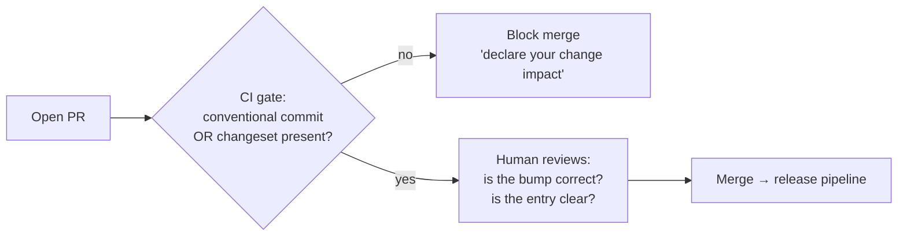
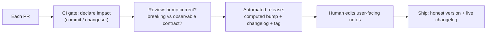
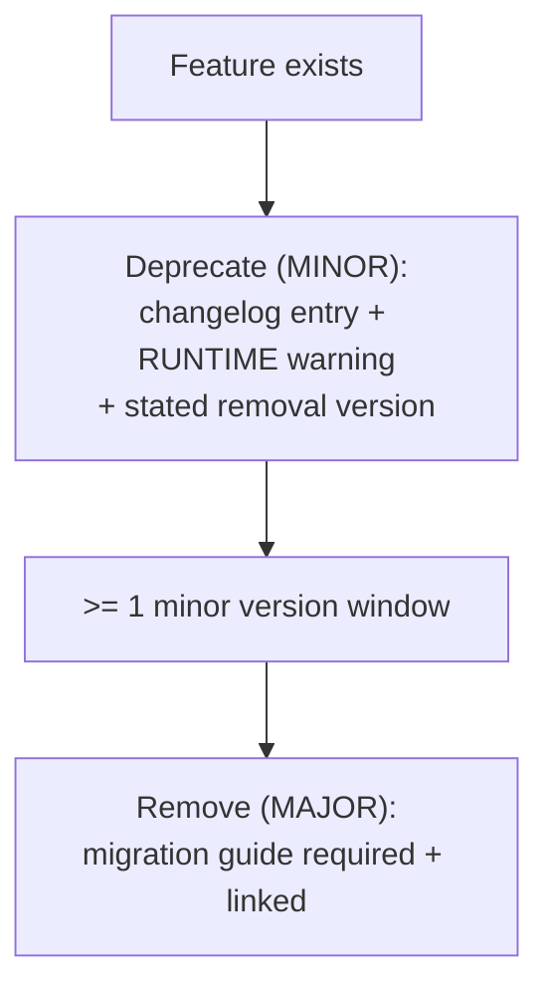

# Changelogs & Release Notes — Professional

> **Category:** [Documentation](../README.md) — communicating *what changed* between versions to the humans who must decide whether and how to upgrade.

> **Prerequisites:** [Junior](junior.md) · [Middle](middle.md) · [Senior](senior.md)
> **Focus:** **Production** — reviews, automation, team conventions, real incidents

---

## Introduction

> Focus: **production** — keeping versioning honest and changelogs alive across many contributors over years.

Everyone agrees a project should have a good changelog. Yet most real repos have a `CHANGELOG.md` that stops three versions ago, a version number bumped by vibes, and release notes that say "various bug fixes." The reason is structural: the changelog is the thing nobody is *blocked* by, so it's the thing that slips — every time, on every team, unless the *system* makes slipping impossible.

The professional question is operational: **how do you guarantee that, across dozens of contributors and hundreds of merges a week, the version number stays an honest contract and the changelog stays accurate?** The answer is not "remind people" — it's process: make the changelog part of definition-of-done, enforce the pipeline in CI so a release *cannot* ship without it, review version bumps as carefully as code, and codify the conventions so the right thing is the default thing.

---

## Making the Changelog Part of Definition-of-Done

The single highest-leverage move: **a change is not done until its changelog impact is recorded — in the same PR.** Not "before release," not "when we remember." In the PR, reviewed alongside the code.

There are two mechanisms, depending on your pipeline:

- **Conventional-commit-driven:** the PR's commit (or squash-merge subject) must be a valid conventional commit. The changelog is generated later from it. The *commit message* is the artifact reviewers gate on.
- **Changeset-driven (monorepos / explicit intent):** the PR must include a changeset file declaring the affected packages and bump levels. CI fails the PR if it's missing. The *changeset* is the artifact.



The cultural shift this encodes: **declaring what your change means to consumers is the author's job, at the moment they know the most about it** — not a release engineer's job weeks later, reconstructing intent from a diff. The author knows whether their fix is breaking; the release engineer is guessing.

For changes that genuinely need no changelog (internal refactors, CI tweaks), make the "no release impact" declaration *explicit* (`chore:` / an empty changeset) — so "no entry" is a decision, not an omission.

---

## Enforcing the Pipeline in CI

Discipline that relies on memory decays. Encode it:

| Gate | Tool | Catches |
|---|---|---|
| **Commit-message lint** | commitlint, conform | Non-conventional commits at PR time |
| **Changeset presence** | changesets `status` check | PRs that don't declare package impact |
| **Breaking-change flag sanity** | custom check / review | A `feat!`/`BREAKING CHANGE` without a migration-guide link |
| **Version-tag immutability** | branch/tag protection | Re-tagging or moving a published version |
| **Release generation** | semantic-release / release-please | The whole bump → changelog → tag → publish flow |
| **Changelog link-check** | markdown-link-check | Dead links to migration guides/issues |

The release itself should be **fully scripted in CI**, triggered by merge (or by merging the release PR), so that:

- The version bump is *computed*, never typed by a human (eliminates "I'll just call it 2.5.0").
- Publishing is *atomic with* tagging and changelog generation — you can't publish a package without its tag and changelog entry existing.
- The npm/PyPI publish is gated on provenance/2FA tokens held by CI, not individuals.

> The goal is a pipeline where **the cheapest path to shipping is also the correct one.** If releasing requires a human to remember to edit the changelog and pick a version, both will be wrong eventually. If releasing is "merge the release PR," they're right by construction.

---

## Reviewing Changelog Entries and Version Bumps

Code review must cover the *release impact*, not just the code. Most teams skip this and pay for it later. The reviewer's job, in order:

1. **Is the version bump correct?** This is the highest-stakes check. Does this change break consumers? If yes, it *must* be flagged breaking (`!`/`BREAKING CHANGE`/`major` changeset) regardless of how small it looks. **Under-calling a break here breaks the ecosystem contract** ([Senior](senior.md)).
2. **Is "breaking" judged against the observable contract?** A changed default, tightened validation, or altered error type *is* breaking even with an unchanged signature (Hyrum's Law). Reviewers must catch the subtle ones.
3. **Does the entry say something?** "Bug fixes" / "improvements" / "updated stuff" are rejections. The entry must let a stranger tell whether it affects them.
4. **For coincidentally-similar changes, is the categorization right?** A `fix` that's actually a behavior change consumers relied on is breaking, not a patch.
5. **Does a breaking change link a migration guide?** A `feat!` with no migration steps is incomplete — block it.
6. **Is the audience right for the channel?** If this generates a user-facing release note, will a non-engineer understand it?

### Review comment templates

> "This is marked `fix` (PATCH), but it tightens validation — inputs that used to be accepted now error. Anyone relying on the old leniency breaks. That's a breaking change: please mark it `fix!` and add a migration note."

> "`### Fixed — bug fixes` tells the reader nothing. What specifically was fixed, and who is affected? Something like: `Fixed: timezone offsets dropped for events before 1970 (#812)`."

> "Great `feat!`, but there's no migration guidance. Add a before/after to `docs/migrations/v3.md` and link it from the entry — consumers will land here *because* it broke them."

> "This default changed from `30s` to `5s`. Same signature, but it's a behavior break for anyone relying on the old default. MAJOR, not MINOR."

---

## Team Conventions That Make It Stick

Codify these so the honest version and live changelog are the default, not a per-PR fight:

1. **Conventional Commits (or changesets) are mandatory**, enforced by a CI gate — not a style suggestion.
2. **The release is fully automated** from the release branch; humans never hand-type a version or hand-publish.
3. **"Breaking" is judged against the observable contract**, written into the handbook: a changed default/error/validation is breaking. When in doubt, breaking.
4. **Every breaking change ships with a migration guide**, linked from the changelog entry — no exceptions.
5. **Deprecate before remove**, with a stated removal version and a *runtime* warning, across ≥1 minor version.
6. **Define the public contract explicitly** (what's `internal`/`_private`) so "you depended on internals" is a defensible, documented position.
7. **One source of change-facts; reframed per channel.** A human edits user-facing release notes; nobody hand-edits the version.
8. **Security fixes get CVE/GHSA linkage and an out-of-band release**, backported to supported lines.

These encode the senior reasoning so a junior gets it right by default and a reviewer cites a policy, not a personal opinion.

---

## Retrofitting Discipline onto a Legacy Repo

Most repos start *without* any of this: ad-hoc commits, a half-dead changelog, versions bumped by feel. You can't rewrite history; you introduce discipline going forward.

### The sequence

1. **Adopt semver (or CalVer) explicitly and announce it.** State the contract in the README: "from here, we follow semver." Consumers can't trust a promise you never made.
2. **Add the commit/changeset gate to CI** so *new* changes are disciplined. Don't try to fix old commits.
3. **Draw a line in the changelog.** Add a `## [Unreleased]` and a note: "entries before vX.Y were reconstructed/approximate." Backfilling the entire history is rarely worth it — start clean from now.
4. **Introduce the release tool in a dry-run mode first.** Let `semantic-release --dry-run` show what version it *would* pick for a few cycles; verify it matches human judgment before letting it publish.
5. **Define the public API surface.** Mark internals. Until you do, *everything* is arguably public and every change is arguably breaking.
6. **Backfill a migration guide only for the next MAJOR**, not historically. Forward-looking effort pays; archaeological effort usually doesn't.

> Don't boil the ocean. You will never reconstruct a perfect historical changelog, and trying is pure cost with no consumer value. Draw a line, get the gate in place, and make *everything from here forward* correct.

### What not to do

- **Don't retroactively re-tag published versions** to "fix" the history — consumers' lockfiles point at those tags; moving them is an ecosystem incident.
- **Don't flip to automated publishing without a dry-run period** — a misconfigured tool that picks the wrong bump or publishes a broken artifact is worse than the manual process you had.
- **Don't adopt semver and then immediately violate it** — one breaking-change-as-a-patch after announcing semver destroys the trust the announcement was meant to build.

---

## Real Incidents

### Incident 1: The breaking change shipped as a patch

A popular library fixed a "bug" where a config field had been case-insensitive; the fix made it case-sensitive and shipped as a **PATCH** (`4.2.1`). Thousands of consumers auto-upgraded within their `^4.2.0` range overnight; every one with a mismatched-case config broke in production simultaneously — a coordinated, self-inflicted outage across the ecosystem. **Postmortem:** the change altered observable behavior consumers depended on (Hyrum's Law), so it was breaking and required a MAJOR, no matter that the team saw it as "just a fix." **Fix:** yanked `4.2.1`, re-released the behavior change as `5.0.0` with a migration note, and made case-sensitivity opt-in for one minor first. **Lesson:** "is it breaking?" is judged by consumer-observable behavior, not by the author's intent — and the version contract is enforced by *everyone's* automation, instantly.

### Incident 2: "Various improvements" and the support flood

A SaaS team's release notes for a major UI change read, in full: "Bug fixes and performance improvements." A workflow users relied on had silently moved. Support was buried for a week in "where did X go?" tickets — every one answerable by a single sentence in the notes that was never written. **Fix:** instituted a rule that any user-visible change requires a human-written, specific release note before the release ships. **Lesson:** "nobody reads release notes until something changes for them" — and when it does, the note's absence becomes the support team's problem. Vague notes are a cost transfer from the release author to support.

### Incident 3: Removal with no deprecation runway

A team removed a deprecated-in-their-heads-but-never-formally-deprecated API endpoint in a MAJOR. The bump was *correct* semver — but consumers had no warning, no runtime deprecation log, and no migration guide, because the team assumed "everyone knew it was old." Integrations broke en masse on upgrade. **Fix:** re-added the endpoint with a loud runtime deprecation warning and a removal date one minor out, plus a migration guide. **Lesson:** a correct MAJOR bump does not excuse a missing deprecation window. Removal must be *announced in advance, at runtime,* not just be technically-correctly versioned.

### Incident 4: The automated changelog full of `fix: wip`

A team turned on fully-automated release notes from conventional commits — but never disciplined commit *content*. The published `1.4.0` notes read: "fix: wip", "fix: address review", "feat: stuff", "fix: oops". The notes shipped to customers as the official record. **Fix:** added a commit-content review step and a human editing pass on the generated GitHub Release body before publishing. **Lesson:** Conventional Commits enforces *structure*, not *quality*. Automation amplifies whatever discipline you have — including the lack of it.

### Incident 5: Monorepo dependency cascade missed

In a monorepo, `@acme/core` shipped a breaking change as a MAJOR, correctly. But the changelog tooling didn't propagate the bump to `@acme/cli`, which depended on `core` — `cli` got a PATCH and its changelog never mentioned the breaking dependency. Consumers upgrading `cli` got `core`'s break with no warning in `cli`'s notes. **Fix:** switched to changesets, which propagates dependency bumps and writes the cascade into each package's changelog. **Lesson:** in a monorepo, the version contract spans dependency edges; the changelog must follow the cascade, not just the directly-touched package.

---

## The Politics of Versioning

Sustaining honest versioning is partly a social problem:

- **"It's a small fix, let's not bump MAJOR."** The pressure to avoid a MAJOR (it looks scary, it fragments users) tempts teams to ship breaks as minors. Arm the team with the contract framing: the version isn't a vibe, it's a promise downstream automation acts on. A correct MAJOR is cheaper than a broken ecosystem.
- **"We'll write the notes later."** Later never comes, or comes with everyone's memory faded. Make it definition-of-done, gated in CI, so "later" is impossible.
- **Marketing wants a big version number.** Pressure to call something `5.0` for marketing when it's a minor change (or vice versa) corrupts the contract. Resolve it: use semver for the *technical* version consumers depend on, and a separate *marketing* name/year if needed (many products do — "the 2026 release, technically `4.3.0`").
- **Engineers see the changelog as busywork.** Reframe it as the artifact that *saves them* during the next upgrade and *shields support* during this one. The person who writes a clear breaking-change note prevents dozens of tickets.

---

## Review Checklist

```text
RELEASE-IMPACT REVIEW CHECKLIST (apply per PR)
[ ] BUMP — is the semver bump correct for this change?
[ ] BREAKING — judged vs OBSERVABLE contract (default/error/validation
      changes are breaking even with the same signature)?
[ ] DECLARED — conventional commit or changeset present and accurate?
[ ] ENTRY — does it say WHAT changed + WHO it affects (not "bug fixes")?
[ ] CATEGORY — Added/Changed/Deprecated/Removed/Fixed/Security correct?
[ ] MIGRATION — every breaking change links a runnable migration guide?
[ ] DEPRECATION — removals had a prior deprecation window + runtime warning?
[ ] SECURITY — CVE/GHSA linked; out-of-band + backported if needed?
[ ] AUDIENCE — user-facing note reframed for non-engineers?
[ ] MONOREPO — dependency-cascade bumps propagated to dependents?
```

---

## Cheat Sheet

```text
DEFINITION OF DONE   change isn't done until its changelog impact is
                     declared IN THE PR (conventional commit / changeset).

ENFORCE IN CI        commitlint / changeset gate; release fully scripted;
                     version COMPUTED not typed; publish atomic with tag+log.

REVIEW               check the BUMP first. Breaking is judged by OBSERVABLE
                     behavior (Hyrum's Law), not by signatures. When in
                     doubt -> breaking. Reject "various bug fixes".

VERSION = CONTRACT   downstream resolvers auto-upgrade trusting it.
                     Breaking-as-a-patch = ecosystem outage. MAJOR is cheap;
                     a broken contract is not.

DEPRECATE -> REMOVE  runtime warning + stated removal version, >=1 minor.
                     Removal w/o a window = trust killer.

LEGACY               announce semver, gate CI, draw a line in CHANGELOG,
                     dry-run the release tool first. Don't re-tag history.

SECURITY             CVE/GHSA linkage so scanners find it; out-of-band;
                     backport to supported lines.
```

---

## Diagrams

### Where the version contract is kept honest



### Deprecate-then-remove runway, enforced



---

## Related Topics

- **Lives in the repo, gated in CI:** [Docs as Code & Tooling](../10-docs-as-code-and-tooling/professional.md)
- **The README points to the changelog:** [READMEs & Onboarding](../03-readmes-and-onboarding-docs/professional.md)
- **Versioned reference alignment:** [API & Reference Documentation](../04-api-and-reference-documentation/professional.md)
- **The changelog as anti-rot:** [Keeping Docs Alive](../11-keeping-docs-alive-and-doc-rot/professional.md)
- **Tooling:** semantic-release, release-please, changesets, git-cliff, commitlint.

---


---

## Check your understanding

1. Explain Changelogs & Release Notes — Professional Level in your own words and name the problem it solves.
2. How would you apply the ideas around Table of Contents, Introduction, Making the Changelog Part of Definition-of-Done in a realistic engineering change?
3. What failure mode or misuse should you look for, and what evidence would reveal it?
4. How would you introduce and govern Changelogs & Release Notes — Professional Level across teams through reversible, measurable increments?
5. What observable result would convince you that the approach improved the system?
